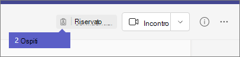

Com'è l'esperienza guestWhat the guest experience is like
=================================

Quando un ospite è invitato a partecipare a un team, riceve un messaggio di posta elettronica di benvenuto.When a guest is invited to join a team, they receive a welcome email message. Questo messaggio include alcune informazioni sul team e cosa aspettarsi ora che siano membri.This message includes some information about the team and what to expect now that they're a member. Il guest deve accettare l'invito selezionando **Apri Microsoft teams** nel messaggio di posta elettronica prima di poter accedere al team e ai relativi canali.The guest must accept the invitation by selecting **Open Microsoft Teams** in the email message before they can access the team and its channels.
    

    
Tutti i membri del team vedono un messaggio nel thread del canale che annuncia che il proprietario del team ha aggiunto un Guest e fornisce il nome dell'ospite.All team members see a message in the channel thread announcing that the team owner has added a guest and providing the guest's name. Tutti gli utenti del team possono identificare facilmente chi è ospite.Everyone on the team can identify easily who is a guest. Come illustrato nello screenshot seguente di un team di esempio, un banner indica "questo team ha Guest" e viene visualizzata un'etichetta **(Guest)** accanto al nome di ogni Guest.As shown in the following screenshot of a sample team, a banner indicates "This team has guests" and a **(Guest)** label appears next to each guest's name.
    

## Confronto tra i membri del team e le funzionalità GuestComparison of team member and guest capabilities

Nella tabella seguente vengono confrontate le funzionalità teams disponibili per i membri del team di un'organizzazione e i relativi Guest.The following table compares the Teams functionality available for an organization's team members and its guests.

|**Funzionalità in teams****Capability in Teams**|**Utenti teams nell'organizzazione****Teams user in the organization**|**Utente Guest****Guest user**|
|:-----|:-----|:-----|
|Creare un canaleCreate a channel     *I proprietari del team controllano questa impostazione.**Team owners control this setting.*    |||
|Partecipare a una chat privataParticipate in a private chat    |||
|Partecipare a una conversazione di canaleParticipate in a channel conversation    |||
|Pubblicare, eliminare e modificare i messaggiPost, delete, and edit messages    |||
|Condividere un file di canaleShare a channel file    |||
|Condividere un file di chatShare a chat file    |||
|Aggiungere app (schede, bot o connettori)Add apps (tabs, bots, or connectors)    |||
|Creare riunioni o pianificare le sessioni di AccessCreate meetings or access schedules    |||
|Accedere a OneDrive for Business StorageAccess OneDrive for Business storage    |||
|Creare criteri di accesso Guest a livello di tenant e teams/ChannelsCreate tenant-wide and teams/channels guest access policies    |||
|Invitare un utente all'esterno del dominio del tenant di Office 365Invite a user outside the Office 365 tenant's domain    *I proprietari del team controllano questa impostazione.**Team owners control this setting.*      |||
|Creare un teamCreate a team    |||
|Individuare e partecipare a un team pubblicoDiscover and join a public team    |||
|Visualizzazione organigrammaView organization chart    |||
|Usare la traduzione in lineaUse inline translation    |||
   
La tabella seguente mostra le funzionalità di chiamata e riunione disponibili per gli ospiti, rispetto ad altri tipi di utenti.The following table shows the calling and meeting features available to guests, compared to other types of users.

| Caratteristica chiamanteCalling feature | IGuest | Utenti E1 e E3E1 and E3 user | E5 e Enterprise Voice UserE5 and Enterprise Voice user |
| --------------- | ----- | -------------- | -------------- |
| Chiamate VOIPVOIP calling | SìYes | SìYes | Supporto per più paesiYes |
| Chiamata di gruppoGroup calling | SìYes | SìYes | Supporto per più paesiYes |
| Controlli di chiamata principali supportati (blocco, mute, video attivato/disattivato, condivisione dello schermo)Core call controls supported (hold, mute, video on/off, screen sharing) | SìYes | SìYes | Supporto per più paesiYes |
| Destinazione di trasferimentoTransfer target | SìYes | SìYes | Supporto per più paesiYes |
| Può trasferire una chiamataCan transfer a call | SìYes | SìYes | Supporto per più paesiYes |
| Trasferimento consultivo canCan consultative transfer | SìYes | SìYes | Supporto per più paesiYes |
| Può aggiungere altri utenti a una chiamata tramite VOIPCan add other users to a call via VOIP | SìYes | SìYes | Supporto per più paesiYes |
| Può aggiungere utenti per numero di telefono a una chiamataCan add users by phone number to a call | NoNo | NoNo | SìYes |
| Inoltra destinazioneForward target | NoNo | SìYes | Supporto per più paesiYes |
| Destinazione gruppo chiamateCall group target | NoNo | SìYes | Supporto per più paesiYes |
| Destinazione senza rispostaUnanswered target | NoNo | SìYes | Supporto per più paesiYes |
| Può essere la destinazione di una chiamata federataCan be the target of a federated call | NoNo | SìYes | Supporto per più paesiYes |
| Può eseguire una chiamata federataCan make a federated call | NoNo | SìYes | Supporto per più paesiYes |
| Può inoltrare immediatamente le chiamateCan immediately forward their calls | NoNo | NoNo | SìYes |
| Può chiamare simultaneamente le chiamateCan simultaneously ring their calls | NoNo | NoNo | SìYes |
| Può instradare le chiamate senza rispostaCan route their unanswered calls | NoNo | NoNo | SìYes |
| Le chiamate perse possono andare alla segreteria telefonicaMissed calls can go to voicemail | NoNo | N.1No1 |SìYes |
| Avere un numero di telefono in grado di ricevere chiamateHave a phone number that can receive calls | NoNo | NoNo | SìYes |
| Può chiamare i numeri di telefonoCan dial phone numbers | NoNo | NoNo | SìYes |
| Può accedere alle impostazioni delle chiamateCan access call settings | NoNo | NoNo | SìYes |
| Può cambiare il messaggio di saluto della segreteriaCan change voicemail greeting | NoNo | N.1No1 | SìYes |
| Può modificare le suonerieCan change ringtones | NoNo | NoNo  | SìYes |
| Supporta TTYSupports TTY | NoNo | NoNo | SìYes |
| Può avere delegatiCan have delegates | NoNo | NoNo | SìYes |
|  Può essere un delegatoCan be a delegate | NoNo | NoNo | SìYes |

1 questa funzionalità sarà presto disponibile.1 This feature will be available soon.

> [!NOTE]
> Gli amministratori di Office 365 controllano le funzionalità disponibili per gli utenti.Office 365 admins control the features available to guests. 

## Domande frequentiFrequently asked questions

### Come si lascia un'organizzazione a cui si è stati invitati?How do I leave an organization that I've been invited to?
Se si è stati invitati a un'organizzazione di cui non si vuole essere ospiti, è possibile scegliere di uscire dall'organizzazione.If you've been invited to an organization that you don't want to be a guest of, you can choose to leave the organization. Per altre informazioni, vedere uscire da [un'organizzazione come utente Guest](https://docs.microsoft.com/azure/active-directory/b2b/leave-the-organization).For more information, go to [Leave an organization as a guest user](https://docs.microsoft.com/azure/active-directory/b2b/leave-the-organization). In alternativa, puoi chiedere all'amministratore dell'organizzazione di rimuoverti dal tenant.Alternatively, you can ask the admin of the organization to remove you from their tenant. Tieni presente che in entrambi i casi dovrai essere invitato di nuovo al tenant se vuoi accedere all'organizzazione in futuro.Note that in either case you'll need to be re-invited to the tenant if you want to access the organization in the future.

### Gli utenti hanno le stesse funzionalità dei membri del team?Do guests have the same capabilities as team members?
Non.No. Per altre informazioni su ciò che un ospite può o non può fare, vedere il [confronto tra le funzionalità membro del team e Guest](#comparison-of-team-member-and-guest-capabilities) in questo articolo.For more information about what a guest can and cannot do, go to [Comparison of team member and guest capabilities](#comparison-of-team-member-and-guest-capabilities) in this article.

### Gli utenti possono accedere a OneDrive for business?Do guests have access to OneDrive for Business?
Non.No.

### Gli utenti possono accedere ai file di SharePoint?Do guests have access to SharePoint files?
Sì.Yes.

### Gli utenti possono eseguire ricerche nei file?Can guests search within files?
Non.No.

### I guest possono allegare file?Can guests attach files?
Sì, un guest può allegare file in questi due modi:Yes, a guest can attach files in these two ways:

   - Selezionare **file** nel riquadro sinistro e quindi passare al percorso del file.Select **Files** in the left pane, and then browse to the file location.
   - Caricare file dal computer.Upload files from their computer.

### Un guest può scaricare un file in una chat privata?Can a guest download a file in a private chat?
Sì, possono ricevere un file da un membro in una chat privata e quindi scaricarlo sul desktop.Yes, they can receive a file from a member in a private chat, and then download it to their desktop.
