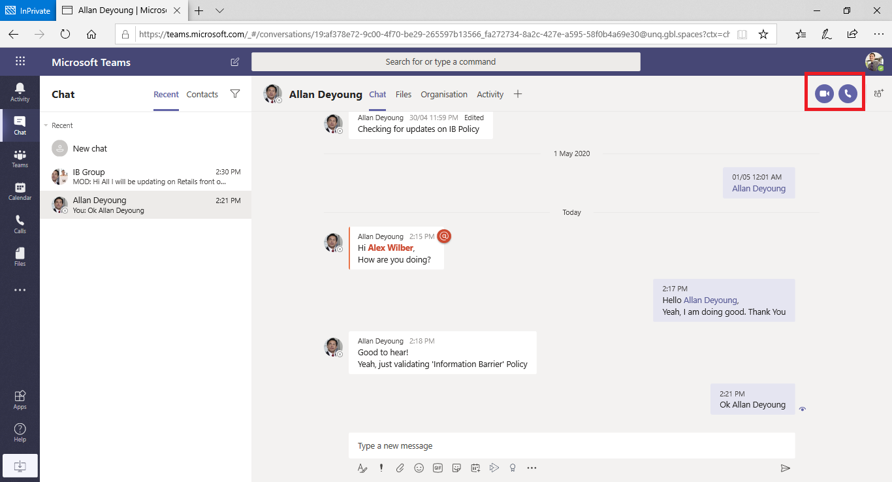
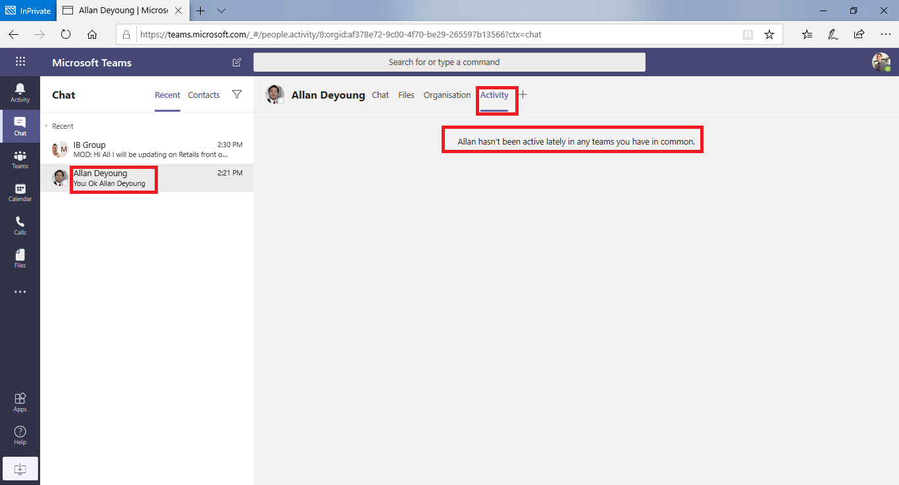

# <a name="information-barriers-in-microsoft-teams"></a>Barriere alle informazioni in Microsoft Teams

Le barriere alle informazioni sono criteri che un amministratore può configurare per impedire a singoli utenti o gruppi di comunicare tra loro. Gli IBS sono utili se, ad esempio, un reparto gestisce informazioni che non devono essere condivise con altri reparti. Gli IBS sono utili anche quando un gruppo deve essere isolato o impedito di comunicare con altri utenti esterni al gruppo.

Per Microsoft Teams, le barriere alle informazioni possono determinare e impedire i tipi di collaborazione non autorizzati seguenti:

- Aggiunta di un utente a un team o a un canale
- Accesso degli utenti al contenuto del team o del canale
- Accesso degli utenti alle chat 1:1 e di gruppo
- Accesso degli utenti alle riunioni
- Impedisce le ricerche e l'individuazione, gli utenti non saranno visibili nella selezione utenti.

>[!NOTE]
>- Non è possibile creare gruppi di barriere alle informazioni tra tenant.
>- L'uso di bot, app Azure Active Directory (Azure AD), API per l'invio di notifiche del feed attività e alcune API per aggiungere utenti non sono supportate nella versione 1.
>- I canali privati sono conformi ai criteri di barriere alle informazioni configurate.
>- Per informazioni sul supporto per le barriere SharePoint siti connessi a Teams, vedere Segmenti associati a Microsoft Teams [siti.](/sharepoint/information-barriers#segments-associated-with-microsoft-teams-sites)

## <a name="background"></a>Sfondo

Il driver principale per gli IBS proviene dal settore dei servizi finanziari. La Financial Industry Regulatory Authority[(FINRA)]( https://www.finra.org)esamina i crediti e i conflitti di interesse all'interno delle società membro e fornisce indicazioni sulla gestione di tali conflitti (FINRA 2241, [Debt Research Regulatory Notice 15-31).](https://www.finra.org/sites/default/files/Regulatory-Notice-15-31_0.pdf)

Tuttavia, dopo l'introduzione degli elementi di base, molte altre aree li hanno trovati utili. Altri scenari comuni includono:

- **Istruzione:** gli studenti di un istituto di istruzione non sono in grado di cercare i dettagli di contatto per gli studenti di altri istituti di istruzione.
- **Legale:** mantenere la riservatezza dei dati ottenuti dall'avvocato di un cliente e impedirne l'accesso da parte di un avvocato della stessa società che rappresenta un cliente diverso.
- **Governo:** l'accesso e il controllo delle informazioni sono limitati in reparti e gruppi.
- **Professional servizi:** un gruppo di persone in un'azienda è in grado di chattare con un cliente o un cliente specifico solo tramite l'accesso guest durante un impegno del cliente.

Ad esempio, Enrico appartiene al segmento Banking e Pradeep appartiene al segmento Financial advisor. Enrico e Pradeep non possono comunicare tra loro perché i criteri IB dell'organizzazione bloccano la comunicazione e la collaborazione tra questi due segmenti. Tuttavia, Enrico e Pradeep possono comunicare con Lee nelle risorse umane.


## <a name="when-to-use-information-barriers"></a>Quando usare le barriere alle informazioni

È consigliabile usare gli elementi di archiviazione in situazioni come queste:

- A un team deve essere impedito di comunicare o condividere dati con un altro team specifico.
- Un team non deve comunicare o condividere dati con utenti esterni al team.

Il servizio di valutazione dei criteri di protezione delle informazioni determina se una comunicazione è conforme ai criteri IB.

## <a name="managing-information-barrier-policies"></a>Gestione dei criteri di protezione delle informazioni

I criteri IB vengono gestiti nel Centro Microsoft 365 conformità tramite i cmdlet di PowerShell. Per altre informazioni, vedere [Definire i criteri per le barriere in fatto di informazioni.](/office365/securitycompliance/information-barriers-policies)

>[!IMPORTANT]
>Prima di configurare o definire i criteri, è necessario abilitare la ricerca nella directory con ambito Microsoft Teams. Attendere almeno alcune ore dopo l'abilitazione della ricerca nella directory con ambito prima di configurare o definire i criteri per le barriere alle informazioni. Per altre informazioni, vedere [Definire i criteri di protezione delle informazioni.](/office365/securitycompliance/information-barriers-policies#prerequisites)

## <a name="information-barriers-administrator-role"></a>Ruolo di amministratore di Information Barriers

Il ruolo Gestione conformità IB è responsabile della gestione dei criteri IB. Per altre informazioni su questo ruolo, vedere [Autorizzazioni nel Centro Microsoft 365 conformità.](/office365/securitycompliance/permissions-in-the-security-and-compliance-center)

## <a name="information-barrier-triggers"></a>Trigger della barriera delle informazioni

I criteri IB vengono attivati quando si verificano Teams eventi seguenti:

- **I membri vengono aggiunti a un team:** ogni volta che si aggiunge un utente a un team, i criteri dell'utente devono essere valutati in base ai criteri IB degli altri membri del team. Dopo l'aggiunta dell'utente, l'utente può eseguire tutte le funzioni del team senza ulteriori controlli. Se i criteri dell'utente bloccano l'aggiunta al team, l'utente non verrà visualizzato nella ricerca.

    

- Viene richiesta una **nuova chat:** ogni volta che un utente richiede una nuova chat con uno o più utenti, la chat viene valutata per assicurarsi che non violi i criteri IB. Se la conversazione viola i criteri IB, la conversazione non viene avviata.

    Ecco un esempio di chat 1:1.

    

    Ecco un esempio di chat di gruppo.

    

- **Un** utente viene invitato a partecipare a una riunione: quando un utente viene invitato a partecipare a una riunione, i criteri IB applicati all'utente vengono valutati in base ai criteri IB applicati agli altri membri del team. In caso di violazione, l'utente non sarà autorizzato a partecipare alla riunione.

    

- **Uno schermo** viene condiviso tra due o più utenti: quando un utente condivide uno schermo con altri utenti, la condivisione deve essere valutata per assicurarsi che non violi i criteri IB di altri utenti. Se un criterio IB viene violato, la condivisione dello schermo non sarà consentita.

    Ecco un esempio di condivisione dello schermo prima dell'applicazione del criterio.

    

    Ecco un esempio di condivisione dello schermo dopo l'applicazione del criterio. Le icone di condivisione dello schermo e chiamata non sono visibili.

    

- Un utente effettua una chiamata telefonica **in Teams:** ogni volta che un utente avvia una chiamata vocale (tramite VOIP) a un altro utente o gruppo di utenti, la chiamata viene valutata per assicurarsi che non violi i criteri IB di altri membri del team. In caso di violazione, la chiamata vocale viene bloccata.

- **Guest in Teams:** i criteri IB si applicano anche ai guest in Teams. Se i guest devono essere individuabili nell'elenco indirizzi globale dell'organizzazione, vedere Gestire l'accesso [guest in Microsoft 365 gruppi.](/microsoft-365/admin/create-groups/manage-guest-access-in-groups) Quando gli utenti guest sono individuabili, è [possibile definire i criteri IB.](/office365/securitycompliance/information-barriers-policies)

## <a name="how-policy-changes-impact-existing-chats"></a>Impatto delle modifiche ai criteri sulle chat esistenti

Quando l'amministratore dei criteri IB apporta modifiche a un criterio o quando viene attivata una modifica dei criteri a causa di una modifica al profilo di un utente , ad esempio per una modifica del processo, il servizio di valutazione dei criteri di protezione delle informazioni cerca automaticamente i membri per assicurarsi che l'appartenenza al team non violi i criteri.

Se tra gli utenti è presente una chat o un'altra comunicazione e viene impostato un nuovo criterio o viene modificato un criterio esistente, il servizio valuta le comunicazioni esistenti per assicurarsi che le comunicazioni siano ancora consentite. 

- **Chat 1:1:** se la comunicazione tra due utenti non è più consentita (a causa dell'applicazione a uno o a entrambi gli utenti di un criterio che blocca la comunicazione), l'ulteriore comunicazione viene bloccata. Le conversazioni chat esistenti diventano di sola lettura.

    Ecco un esempio che mostra che la chat è visibile.

    

    Ecco un esempio che mostra che la chat è disabilitata.

    

- Chat di **gruppo:** se la comunicazione da un utente a un gruppo non è più consentita (ad esempio, perché un utente ha modificato i processi), l'utente, insieme agli altri utenti la cui partecipazione viola il criterio, potrebbe essere rimosso dalla chat di gruppo e non saranno consentite ulteriori comunicazioni con il gruppo. L'utente può comunque vedere le vecchie conversazioni, ma non sarà in grado di vedere o partecipare a nuove conversazioni con il gruppo. Se il criterio nuovo o modificato che impedisce la comunicazione viene applicato a più utenti, gli utenti interessati dal criterio potrebbero essere rimossi dalla chat di gruppo. Possono comunque vedere le vecchie conversazioni.

  In questo esempio, Enrico si è spostato in un reparto diverso all'interno dell'organizzazione e viene rimosso dalla chat di gruppo.

  

  Enrico non può più inviare messaggi alla chat di gruppo.

  

- **Team:** tutti gli utenti che sono stati rimossi dal gruppo vengono rimossi dal team e non saranno in grado di vedere o partecipare a conversazioni nuove o esistenti.

## <a name="scenario-a-user-in-an-existing-chat-becomes-blocked"></a>Scenario: un utente in una chat esistente viene bloccato

Attualmente, gli utenti verificano gli scenari seguenti se un criterio IB blocca un altro utente:

- **Scheda Persone:** un utente non può vedere gli utenti bloccati nella **scheda** Persone.

- **Selezione utenti:** gli utenti bloccati non saranno visibili nella selezione utenti.

    

- **Scheda Attività:** se un utente visita la **scheda** Attività di un utente bloccato, non verrà visualizzato alcun post. La scheda **Attività** visualizza solo i post dei canali e non ci sarebbero canali comuni tra i due utenti.

    Ecco un esempio di visualizzazione della scheda Attività bloccata.

    

- **Organigrammi:** se un utente accede a un organigramma in cui viene visualizzato un utente bloccato, l'utente bloccato non verrà visualizzato nell'organigramma. Verrà invece visualizzato un messaggio di errore.

- **Scheda Persone:** se un utente partecipa a una conversazione e l'utente viene bloccato in un secondo momento, gli altri utenti visualizzano un messaggio di errore al posto della scheda persone quando passano il mouse sul nome dell'utente bloccato. Le azioni elencate nella scheda (ad esempio chiamate e chat) non saranno disponibili.

- **Contatti suggeriti:** gli utenti bloccati non vengono visualizzati nell'elenco contatti suggeriti (l'elenco dei contatti iniziale visualizzato per i nuovi utenti).

- **Contatti chat:** un utente può vedere gli utenti bloccati nell'elenco dei contatti delle chat, ma gli utenti bloccati verranno identificati. L'unica azione che l'utente può eseguire sugli utenti bloccati è eliminarli. L'utente può anche selezionarlo per visualizzare la conversazione passata.

- **Chiamate ai contatti:** un utente può vedere gli utenti bloccati nell'elenco dei contatti delle chiamate, ma gli utenti bloccati verranno identificati. L'unica azione che l'utente può eseguire sul blocco degli utenti è eliminarla.

    Ecco un esempio di utente bloccato nell'elenco dei contatti delle chiamate.

    > [!div class="mx-imgBorder"]
    > 

    Ecco un esempio di disattivazione della chat per un utente nell'elenco dei contenuti delle chiamate.

    > [!div class="mx-imgBorder"]
    > 

- **Skype** a Teams migrazione: durante una migrazione da Skype for Business a Teams, tutti gli utenti, anche quelli bloccati dai criteri IB, verranno migrati a Teams. Questi utenti vengono quindi gestiti come descritto in precedenza.

## <a name="teams-policies-and-sharepoint-sites"></a>Teams criteri e SharePoint siti

Quando viene creato un team, viene eseguito il provisioning SharePoint un sito di Microsoft Teams per l'esperienza file. Per impostazione predefinita, i criteri di protezione delle informazioni non vengono rispettati in questo SharePoint e nei file. Per abilitare le barriere alle informazioni in SharePoint e OneDrive, seguire le istruzioni e i passaggi descritti nell'articolo Usare le barriere di informazioni [con](/sharepoint/information-barriers#enable-sharepoint-and-onedrive-information-barriers-in-your-organization) SharePoint.

## <a name="information--barrier-modes-and-teams"></a>Modalità di protezione delle informazioni e Teams

La modalità Barriere informazioni consente di rafforzare gli utenti che possono essere aggiunti o rimossi da un team. Quando si usano barriere di informazioni con Teams, sono supportate le modalità IB seguenti:

- **Apri:** questa configurazione è la modalità IB predefinita per tutti i gruppi esistenti di cui è stato eseguito il provisioning prima che le barriere di informazioni fossero abilitate. In questa modalità non sono applicabili criteri IB.
- **Implicito:** questa configurazione è la modalità IB predefinita quando viene eseguito il provisioning di un team dopo l'abilitazione delle barriere alle informazioni. La modalità implicita consente di aggiungere tutti gli utenti compatibili nel gruppo.
- **Proprietario moderato (anteprima):** questa modalità è impostata in un team quando si vuole consentire la collaborazione tra utenti di segmenti incompatibili moderati dal proprietario. Il proprietario del team può aggiungere nuovi membri in base ai criteri IB.

Teams creati prima di attivare un criterio di protezione delle informazioni nel tenant vengono impostati automaticamente sulla *modalità* di apertura per impostazione predefinita. Dopo aver attivato i criteri IB nel tenant, è necessario aggiornare la modalità dei team esistenti in *Implicito* per assicurarsi che i team esistenti siano conformi a IB.

Usare il cmdlet [Set-UnifiedGroup](/powershell/module/exchange/set-unifiedgroup) con il *parametro InformationBarrierMode* che corrisponde alla modalità da usare per i segmenti. L'elenco dei valori consentiti per *il parametro InformationBarrierMode* *è Open*, *Implicito* e *Owner Moderated*.

Ad esempio, per configurare la *modalità implicita* per un gruppo Microsoft 365, si userà il comando di PowerShell seguente:

```powershell
Set-UnifiedGroup -InformationBarrierMode Implicit
```

Per aggiornare la modalità da Apri a Implicita per tutti i team esistenti, usare questo [script di PowerShell.](information-barriers-mode-script.md)

Se si modifica la configurazione della modalità di apertura nei gruppi connessi Teams esistenti per soddisfare i requisiti di conformità per l'organizzazione, sarà necessario aggiornare le modalità [IB](/sharepoint/information-barriers.md#view-and-manage-ib-modes-as-an-administrator-with-sharepoint-powershell) per i siti SharePoint associati connessi al team di Teams.

## <a name="required-licenses-and-permissions"></a>Licenze e autorizzazioni necessarie

Per altre informazioni su licenze e autorizzazioni, piani e prezzi, vedere indicazioni sulle licenze Microsoft 365 per la sicurezza [& conformità.](/office365/servicedescriptions/microsoft-365-service-descriptions/microsoft-365-tenantlevel-services-licensing-guidance/microsoft-365-security-compliance-licensing-guidance)

## <a name="known-issues"></a>Problemi noti

- Gli utenti non possono partecipare a riunioni ad hoc: se i criteri IB sono abilitati, gli utenti non possono partecipare alle riunioni se le dimensioni **dell'elenco** delle riunioni sono maggiori dei limiti di partecipazione alla [riunione.](limits-specifications-teams.md) La causa principale è che i controlli IB si basano sul fatto che gli utenti possono essere aggiunti a un elenco di chat della riunione e solo quando possono essere aggiunti al roster possono partecipare alla riunione. Un utente che partecipa a una riunione una volta lo aggiunge all'elenco; Quindi, per le riunioni ricorrenti, l'elenco può riempirsi rapidamente. Quando l'elenco chat raggiunge i limiti [di partecipazione](limits-specifications-teams.md)alla riunione, non è possibile aggiungere altri utenti alla riunione. Se IB è abilitato per l'organizzazione e l'elenco delle chat è pieno per una riunione, i nuovi utenti (gli utenti che non sono già presenti nell'elenco) non possono partecipare alla riunione. Ma se IB non è abilitato per l'organizzazione e l'elenco delle chat delle riunioni è pieno, i nuovi utenti (gli utenti che non sono già presenti nell'elenco) possono partecipare alla riunione, anche se non vedranno l'opzione di chat nella riunione. Una soluzione a breve termine consiste nel rimuovere i membri inattivi dall'elenco delle chat delle riunioni per fare spazio ai nuovi utenti. Tuttavia, le dimensioni dei roster delle chat delle riunioni verranno aumentate in un secondo momento.
- **Gli utenti non possono** partecipare alle riunioni del canale: se i criteri IB sono abilitati, gli utenti non possono partecipare alle riunioni del canale se non sono membri del team. La causa principale è che i controlli IB si basano sul fatto che gli utenti possono essere aggiunti a un elenco di chat della riunione e solo quando possono essere aggiunti al roster possono partecipare alla riunione. Il thread di chat in una riunione del canale è disponibile solo per i membri del team/canale e i non membri non possono vedere o accedere al thread di chat. Se IB è abilitato per l'organizzazione e un membro non del team prova a partecipare a una riunione del canale, l'utente non è autorizzato a partecipare alla riunione. Tuttavia, se IB non è abilitato per l'organizzazione e un membro non del team prova a partecipare a una riunione del canale, l'utente è autorizzato a partecipare alla riunione, ma non vede l'opzione di chat nella riunione. 
- **Numero massimo di segmenti consentiti in un'organizzazione:** ogni organizzazione può configurare fino a 100 segmenti durante la configurazione dei criteri IB. Non esiste alcun limite per il numero di criteri che è possibile configurare.
- **I criteri IB** non funzionano per gli utenti federati: se si consente la federazione con organizzazioni esterne, gli utenti di tali organizzazioni non saranno limitati dai criteri IB. Se gli utenti dell'organizzazione aderiscono a una chat o a una riunione organizzata da utenti federati esterni, anche i criteri IB non limitano le comunicazioni tra gli utenti dell'organizzazione.

## <a name="more-information"></a>Altre informazioni

- Per altre informazioni sugli IBs, vedere [Barriere alle informazioni](/office365/securitycompliance/information-barriers).
- Per configurare i criteri IB, vedere [Introduzione alle barriere alle informazioni.](/office365/securitycompliance/information-barriers-policies)
- Per modificare o rimuovere i criteri IB, vedere [Gestire i criteri di protezione delle informazioni.](/microsoft-365/compliance/information-barriers-edit-segments-policies)

## <a name="availability"></a>Disponibilità

- La funzionalità è disponibile nel cloud pubblico. a gennaio 2021 sono stati lanciati ostacoli alle informazioni nel cloud GCC cloud.
- La funzionalità non è ancora disponibile nei cloud GCC - High e DOD.
