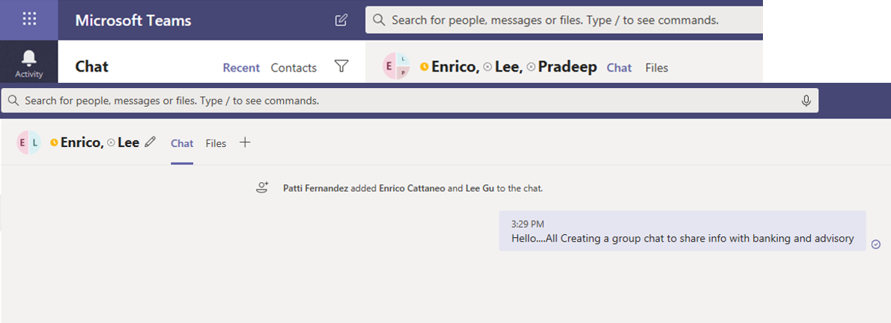

# Barriere alle informazioni in Microsoft TeamsInformation barriers in Microsoft Teams

Le barriere alle informazioni sono criteri che un amministratore può configurare per impedire a singoli utenti o gruppi di comunicare tra loro.Information barriers (IBs) are policies that an admin can configure to prevent individuals or groups from communicating with each other. Gli IBS sono utili se, ad esempio, un reparto gestisce informazioni che non devono essere condivise con altri reparti.IBs are useful if, for example, one department is handling information that shouldn't be shared with other departments. Gli IBS sono utili anche quando un gruppo deve essere isolato o impedito di comunicare con altri utenti esterni al gruppo.IBs are also useful when a group needs to be isolated or prevented from communicating with anyone outside of that group.

>[!NOTE]
>- Non è possibile creare gruppi IB (Information Barrier) tra tenant.Information barrier (IB) groups cannot be created across tenants.
>- L'uso di bot, app di Azure Active Directory (Azure AD) e alcune API per aggiungere utenti non è supportato nella versione 1.Using bots, Azure Active Directory (Azure AD) apps, and some APIs to add users is not supported in version 1.
>- I canali privati sono conformi ai criteri IB che si configurano.Private channels are compliant to IB policies that you configure.
>- Novità: per informazioni sul supporto per le barriere per i siti di SharePoint connessi a Teams, vedere Segmenti [associati ai siti di Microsoft Teams.](/sharepoint/information-barriers#segments-associated-with-microsoft-teams-sites)New: For information about support for barriers for SharePoint sites that are connected to Teams, see [Segments associated with Microsoft Teams sites](/sharepoint/information-barriers#segments-associated-with-microsoft-teams-sites).

I criteri IB impediscono anche le ricerche e l'individuazione.IB policies also prevent lookups and discovery. Se si prova a comunicare con qualcuno con cui non si dovrebbe comunicare, l'utente non verrà trovato nella selezione utenti.If you attempt to communicate with someone you shouldn't be communicating with, you won't find that user in the people picker.

## SfondoBackground

Il driver principale per gli IBS proviene dal settore dei servizi finanziari.The primary driver for IBs comes from the financial services industry. La Financial Industry Regulatory Authority[(FINRA)]( https://www.finra.org)esamina i crediti e i conflitti di interesse all'interno delle imprese membri e fornisce indicazioni sulla gestione di tali conflitti (FINRA 2241, [Debt Research Regulatory Notice 15-31).](https://www.finra.org/sites/default/files/Regulatory-Notice-15-31_0.pdf)The Financial Industry Regulatory Authority ([FINRA]( https://www.finra.org)) reviews IBs and conflicts of interest within member firms and provides guidance about managing such conflicts (FINRA 2241, [Debt Research Regulatory Notice 15-31](https://www.finra.org/sites/default/files/Regulatory-Notice-15-31_0.pdf).

Tuttavia, dopo l'introduzione degli elementi di base, molte altre aree li hanno trovati utili.However, since introducing IBs, many other areas have found them to be useful. Altri scenari comuni includono:Other common scenarios include:

- Istruzione: gli studenti di un istituto di istruzione non sono in grado di cercare i dettagli di contatto per gli studenti di altri istituti di istruzione.Education: Students in one school aren't able to look up contact details for students of other schools.

- Legale: mantenere la riservatezza dei dati ottenuti dall'avvocato di un cliente e impedirne l'accesso da parte di un avvocato della stessa società che rappresenta un cliente diverso.Legal: Maintaining the confidentiality of data that is obtained by the lawyer of one client and preventing it from being accessed by a lawyer for the same firm who represents a different client.

- Enti pubblici: l'accesso e il controllo delle informazioni sono limitati in tutti i reparti e i gruppi.Government: Information access and control are limited across departments and groups.

- Servizi professionali: un gruppo di persone in un'azienda è in grado di chattare con un cliente o un cliente specifico solo tramite l'accesso guest durante l'impegno del cliente.Professional services: A group of people in a company is only able to chat with a client or a specific customer via guest access during a customer engagement.

Ad esempio, Enrico appartiene al segmento Banking e Pradeep appartiene al segmento Financial advisor.For example, Enrico belongs to the Banking segment and Pradeep belongs to the Financial advisor segment. Enrico e Pradeep non possono comunicare tra loro perché i criteri IB dell'organizzazione bloccano la comunicazione e la collaborazione tra questi due segmenti.Enrico and Pradeep can't communicate with each other because the organization's IB policy blocks communication and collaboration between these two segments. Tuttavia, Enrico e Pradeep possono comunicare con Lee nelle risorse umane.However, Enrico and Pradeep can communicate with Lee in HR.

## Quando usare le barriere alle informazioniWhen to use information barriers

È consigliabile usare gli elementi di archiviazione in situazioni come queste:You might want to use IBs in situations like these:

- A un team deve essere impedito di comunicare o condividere dati con un altro team specifico.A team must be prevented from communicating or sharing data with a specific other team.
- Un team non deve comunicare o condividere dati con utenti esterni al team.A team must not communicate or share data with anyone outside of the team.

Il servizio di valutazione dei criteri di protezione delle informazioni determina se una comunicazione è conforme ai criteri IB.The Information Barrier Policy Evaluation Service determines whether a communication complies with IB policies.

## Gestione dei criteri di protezione delle informazioniManaging information barrier policies

I criteri IB vengono gestiti nel Centro conformità di Microsoft 365 con i cmdlet di PowerShell.IB policies are managed in the Microsoft 365 Compliance Center (SCC) using PowerShell cmdlets. Per altre informazioni, vedere [Definire i criteri per le barriere in fatto di informazioni.](/office365/securitycompliance/information-barriers-policies)For more information, see [Define policies for information barriers](/office365/securitycompliance/information-barriers-policies).

> [!IMPORTANT]
> Prima di configurare o definire criteri, è necessario abilitare la ricerca nella directory con ambito in Microsoft Teams.Before you set up or define policies, you must enable scoped directory search in Microsoft Teams. Attendere almeno alcune ore dopo l'abilitazione della ricerca nella directory con ambito prima di configurare o definire i criteri per le barriere alle informazioni.Wait at least a few hours after enabling scoped directory search before you set up or define policies for information barriers. Per altre informazioni, vedere [Definire i criteri di protezione delle informazioni.](/office365/securitycompliance/information-barriers-policies#prerequisites)For more information, see [Define information barrier policies](/office365/securitycompliance/information-barriers-policies#prerequisites).

## Ruolo di amministratore di Information BarriersInformation barriers administrator role

Il ruolo Gestione conformità IB è responsabile della gestione dei criteri IB.The IB Compliance Management role is responsible for managing IB policies. Per altre informazioni su questo ruolo, vedere Autorizzazioni nel Centro conformità [di Microsoft 365.](/office365/securitycompliance/permissions-in-the-security-and-compliance-center)For more information about this role, see [Permissions in the Microsoft 365 Compliance Center](/office365/securitycompliance/permissions-in-the-security-and-compliance-center).

## Trigger della barriera delle informazioniInformation barrier triggers

I criteri IB vengono attivati quando si verificano gli eventi di Teams seguenti:IB policies are activated when the following Teams events take place:

- **I membri vengono aggiunti a un team:** ogni volta che si aggiunge un utente a un team, i criteri dell'utente devono essere valutati in base ai criteri IB degli altri membri del team.**Members are added to a team** - Whenever you add a user to a team, the user's policy must be evaluated against the IB policies of other team members. Dopo l'aggiunta dell'utente, l'utente può eseguire tutte le funzioni del team senza ulteriori controlli.After the user is successfully added, the user can perform all functions in the team without further checks. Se i criteri dell'utente bloccano l'aggiunta al team, l'utente non verrà visualizzato nella ricerca.If the user's policy blocks them from being added to the team, the user won't show up in search.

    

- Viene richiesta una **nuova chat:** ogni volta che un utente richiede una nuova chat con uno o più utenti, la chat viene valutata per assicurarsi che non violi i criteri IB.**A new chat is requested** - Each time that a user requests a new chat with one or more other users, the chat is evaluated to make sure that it isn't violating any IB policies. Se la conversazione viola i criteri IB, la conversazione non viene avviata.If the conversation violates an IB policy, then the conversation isn't started.

    Ecco un esempio di chat 1:1.Here's an example of a 1:1 chat.

    > [!div class="mx-imgBorder"]
    > 

    Ecco un esempio di chat di gruppo.Here's an example of a group chat.

    > [!div class="mx-imgBorder"]
    > 

- **Un** utente viene invitato a partecipare a una riunione: quando un utente viene invitato a partecipare a una riunione, i criteri IB applicabili all'utente vengono valutati in base ai criteri IB applicati agli altri membri del team.**A user is invited to join a meeting** - When a user is invited to join a meeting, the IB policy that applies to the user is evaluated against the IB policies that apply to the other team members. In caso di violazione, l'utente non sarà autorizzato a partecipare alla riunione.If there's a violation, the user won't be allowed to join the meeting.

    

- **Uno schermo viene** condiviso tra due o più utenti: quando un utente condivide uno schermo con altri utenti, è necessario valutare la condivisione per assicurarsi che non violi i criteri IB di altri utenti.**A screen is shared between two or more users** - When a user shares a screen with other users, the sharing must be evaluated to make sure that it doesn't violate the IB policies of other users. Se un criterio IB viene violato, la condivisione dello schermo non sarà consentita.If an IB policy is violated, the screen share won't be allowed.

    Ecco un esempio di condivisione dello schermo prima dell'applicazione del criterio.Here's an example of screen share before the policy is applied.

    > [!div class="mx-imgBorder"]
    > 

    Ecco un esempio di condivisione dello schermo dopo l'applicazione del criterio.Here's an example of screen share after the policy is applied. Le icone di condivisione dello schermo e chiamata non sono visibili.The screen share and call icons aren't visible.

    > [!div class="mx-imgBorder"]
    > 

- Un utente effettua una chiamata **telefonica in Teams:** ogni volta che un utente avvia una chiamata vocale (tramite VOIP) a un altro utente o gruppo di utenti, la chiamata viene valutata per assicurarsi che non violi i criteri IB di altri membri del team.**A user places a phone call in Teams** - Whenever a user initiates a voice call (via VOIP) to another user or group of users, the call is evaluated to make sure that it doesn't violate the IB policies of other team members. In caso di violazione, la chiamata vocale viene bloccata.If there's any violation, the voice call is blocked.

- **Guest in Teams** : le politiche IB si applicano anche agli ospiti in Teams.**Guests in Teams** - IB policies apply to guests in Teams, too. Se i guest devono essere individuabili nell'elenco indirizzi globale dell'organizzazione, vedere [Gestire l'accesso guest nei gruppi di Microsoft 365.](/microsoft-365/admin/create-groups/manage-guest-access-in-groups)If guests need to be discoverable in your organization's global address list, see [Manage guest access in Microsoft 365 Groups](/microsoft-365/admin/create-groups/manage-guest-access-in-groups). Quando gli utenti guest sono individuabili, è [possibile definire i criteri IB.](/office365/securitycompliance/information-barriers-policies)Once guests are discoverable, you can [define IB policies](/office365/securitycompliance/information-barriers-policies).

## Impatto delle modifiche ai criteri sulle chat esistentiHow policy changes impact existing chats

Quando l'amministratore dei criteri IB apporta modifiche a un criterio o quando viene attivata una modifica dei criteri a causa di una modifica al profilo di un utente , ad esempio per una modifica del processo, il servizio di valutazione dei criteri di protezione delle informazioni cerca automaticamente i membri per assicurarsi che l'appartenenza al team non violi i criteri.When the IB policy administrator makes changes to a policy, or when a policy change is activated because of a change to a user's profile (such as for a job change), the Information Barrier Policy Evaluation Service automatically searches the members to ensure that their membership in the team doesn't violate any policies.

Se tra gli utenti è presente una chat o un'altra comunicazione e viene impostato un nuovo criterio o viene modificato un criterio esistente, il servizio valuta le comunicazioni esistenti per assicurarsi che le comunicazioni siano ancora consentite.If there's an existing chat or other communication between users, and a new policy is set or an existing policy is changed, the service evaluates existing communications to make sure that the communications are still allowed to occur. 

- **Chat 1:1** - Se la comunicazione tra due utenti non è più consentita (a causa dell'applicazione a uno o a entrambi gli utenti di un criterio che blocca la comunicazione), l'ulteriore comunicazione viene bloccata.**1:1 chat** - If communication between two users is no longer allowed (because of application to one or both users of a policy that blocks communication), further communication is blocked. Le conversazioni chat esistenti diventano di sola lettura.Their existing chat conversations become read-only.

    Ecco un esempio che mostra che la chat è visibile.Here's an example that shows the chat is visible.

    > [!div class="mx-imgBorder"]
    > 

    Ecco un esempio che mostra che la chat è disabilitata.Here's an example that shows the chat is disabled.

    > [!div class="mx-imgBorder"]
    > 

- Chat di **gruppo-** Se la comunicazione da un utente a un gruppo non è più consentita (ad esempio, perché un utente ha modificato i processi), l'utente, insieme agli altri utenti la cui partecipazione viola il criterio, potrebbe essere rimosso dalla chat di gruppo e non saranno consentite ulteriori comunicazioni con il gruppo.**Group chat** - If communication from one user to a group is no longer allowed (for example, because a user changed jobs), the user—along with the other users whose participation violates the policy—may be removed from group chat, and further communication with the group won't be allowed. L'utente può comunque vedere le vecchie conversazioni, ma non sarà in grado di vedere o partecipare a nuove conversazioni con il gruppo.The user can still see old conversations, but won't be able to see or participate in any new conversations with the group. Se il criterio nuovo o modificato che impedisce la comunicazione viene applicato a più utenti, gli utenti interessati dal criterio potrebbero essere rimossi dalla chat di gruppo.If the new or changed policy that prevents communication is applied to more than one user, the users who are affected by the policy may be removed from group chat. Possono comunque vedere le vecchie conversazioni.They can still see old conversations.

  In questo esempio, Enrico si è spostato in un reparto diverso all'interno dell'organizzazione e viene rimosso dalla chat di gruppo.In this example, Enrico moved to a different department within the organization and is removed from the group chat.

  

  Enrico non può più inviare messaggi alla chat di gruppo.Enrico can no longer send messages to the group chat.

  

- **Team:** tutti gli utenti che sono stati rimossi dal gruppo vengono rimossi dal team e non potranno vedere o partecipare a conversazioni nuove o esistenti.**Team** - Any users who have been removed from the group are removed from the team and won't be able to see or participate in existing or new conversations.

## Scenario: un utente in una chat esistente viene bloccatoScenario: A user in an existing chat becomes blocked

Attualmente, gli utenti verificano gli scenari seguenti se un criterio IB blocca un altro utente:Currently, users experience the following scenarios if an IB policy blocks another user:

- **Scheda Persone:** un utente non può vedere gli utenti bloccati nella **scheda** Persone.**People tab** - A user can't see blocked users on the **People** tab.

- **Selezione utenti:** gli utenti bloccati non saranno visibili nella selezione utenti.**People Picker** - Blocked users won't be visible in the people picker.

    

- **Scheda Attività:** se un utente visita la **scheda** Attività di un utente bloccato, non verrà visualizzato alcun post.**Activity tab** - If a user visits the **Activity** tab of a blocked user, no posts will appear. La scheda **Attività** visualizza solo i post dei canali e non ci sarebbero canali comuni tra i due utenti.(The **Activity** tab displays channel posts only, and there would be no common channels between the two users.)

    Ecco un esempio di visualizzazione della scheda Attività bloccata.Here's an example of the activity tab view that is blocked.

    > [!div class="mx-imgBorder"]
    > 

- **Organigrammi:** se un utente accede a un organigramma in cui viene visualizzato un utente bloccato, l'utente bloccato non verrà visualizzato nell'organigramma.**Org charts** - If a user accesses an org chart on which a blocked user appears, the blocked user won't appear on the org chart. Verrà invece visualizzato un messaggio di errore.Instead, an error message will appear.

- **Scheda Persone:** se un utente partecipa a una conversazione e l'utente viene bloccato in un secondo momento, gli altri utenti visualizzano un messaggio di errore al posto della scheda persone quando passano il mouse sul nome dell'utente bloccato.**People card** - If a user participates in a conversation and the user is later blocked, other users will see an error message instead of the people card when they hover over the blocked user's name. Le azioni elencate nella scheda (ad esempio chiamate e chat) non saranno disponibili.Actions listed on the card (such as calling and chat) will be unavailable.

- **Contatti suggeriti:** gli utenti bloccati non vengono visualizzati nell'elenco contatti suggeriti (l'elenco dei contatti iniziale visualizzato per i nuovi utenti).**Suggested contacts** - Blocked users don't appear on the suggested contacts list (the initial contact list that appears for new users).

- **Contatti chat:** un utente può vedere gli utenti bloccati nell'elenco dei contatti delle chat, ma gli utenti bloccati verranno identificati.**Chat contacts** - A user can see blocked users on the chats contact list, but the blocked users will be identified. L'unica azione che l'utente può eseguire sugli utenti bloccati è eliminarli.The only action that the user can perform on the blocked users is to delete them. L'utente può anche fare clic su di essi per visualizzare la conversazione passata.The user can also click on them to view their past conversation.

- **Chiamate ai contatti:** un utente può vedere gli utenti bloccati nell'elenco dei contatti delle chiamate, ma gli utenti bloccati verranno identificati.**Calls contacts** - A user can see blocked users on the calls contact list, but the blocked users will be identified. L'unica azione che l'utente può eseguire sul blocco degli utenti è eliminarla.The only action that the user can perform on the block users is to delete them.

    Ecco un esempio di utente bloccato nell'elenco dei contatti delle chiamate.Here's an example of a blocked user in the calls contact list.

    > [!div class="mx-imgBorder"]
    > 

    Ecco un esempio di disattivazione della chat per un utente nell'elenco dei contenuti delle chiamate.Here's an example of the chat being disabled for a user on the calls content list.

    > [!div class="mx-imgBorder"]
    > 

- **Migrazione da Skype** a Teams - Durante la migrazione da Skype for Business a Teams, tutti gli utenti, anche quelli che sono bloccati dai criteri IB, verranno migrati a Teams.**Skype to Teams migration** - During a migration from Skype for Business to Teams, all users—even those users who are blocked by IB policies—will be migrated to Teams. Questi utenti vengono quindi gestiti come descritto in precedenza.Those users are then handled as described above.

## Criteri di Teams e siti di SharePointTeams policies and SharePoint sites

Quando viene creato un team, viene eseguito il provisioning di un sito di SharePoint e associato a Microsoft Teams per l'esperienza file.When a team is created, a SharePoint site is provisioned and associated with Microsoft Teams for the files experience. Per impostazione predefinita, i criteri di protezione delle informazioni non vengono rispettati in questo sito di SharePoint e nei file.Information barrier policies aren't honored on this SharePoint site and files by default. Per abilitare le barriere alle informazioni in SharePoint e OneDrive, seguire le istruzioni e i passaggi nell'argomento Usare le barriere [di informazioni con SharePoint.](/sharepoint/information-barriers#enable-sharepoint-and-onedrive-information-barriers-in-your-organization)To enable information barriers in SharePoint and OneDrive, follow the guidance and steps in the [Use information barriers with SharePoint](/sharepoint/information-barriers#enable-sharepoint-and-onedrive-information-barriers-in-your-organization) topic.

## Licenze e autorizzazioni necessarieRequired licenses and permissions

Per altre informazioni sulle licenze e sulle autorizzazioni, inclusi i piani e i prezzi, vedere Indicazioni sulle licenze [di Microsoft 365](/office365/servicedescriptions/microsoft-365-service-descriptions/microsoft-365-tenantlevel-services-licensing-guidance/microsoft-365-security-compliance-licensing-guidance)per la conformità & sicurezza .For more information on licenses and permissions, including plans and pricing, see [Microsoft 365 licensing guidance for security & compliance](/office365/servicedescriptions/microsoft-365-service-descriptions/microsoft-365-tenantlevel-services-licensing-guidance/microsoft-365-security-compliance-licensing-guidance).

## Problemi notiKnown Issues

- Gli utenti non possono partecipare a riunioni ad hoc: se i criteri IB sono abilitati, gli utenti non possono partecipare alle riunioni se le dimensioni **dell'elenco** riunioni sono maggiori dei limiti di partecipazione alla [riunione.](limits-specifications-teams.md)**Users can't join ad-hoc meetings**: If IB policies are enabled, users aren't allowed to join meetings if the size of the meeting roster is greater than the [meeting attendance limits](limits-specifications-teams.md). La causa principale è che i controlli IB si basano sul fatto che gli utenti possono essere aggiunti a un elenco di chat della riunione e solo quando possono essere aggiunti al roster possono partecipare alla riunione.The root cause is that IB checks rely on whether users can be added to a meeting chat roster, and only when they can be added to the roster are they allowed to join the meeting. Un utente che partecipa a una riunione una volta lo aggiunge all'elenco; Quindi, per le riunioni ricorrenti, l'elenco può riempirsi rapidamente.A user joining a meeting once adds that user to the roster; hence for recurring meetings, the roster can fill up fast. Quando l'elenco chat raggiunge i limiti [di partecipazione](limits-specifications-teams.md)alla riunione, non è consentito aggiungere altri utenti alla riunione.Once the chat roster reaches the [meeting attendance limits](limits-specifications-teams.md), no additional users are allowed to be added to the meeting. Se IB è abilitato per il tenant e l'elenco chat è pieno per una riunione, i nuovi utenti ,ovvero quelli che non sono già presenti nell'elenco, non possono partecipare alla riunione.If IB is enabled for the tenant and the chat roster is full for a meeting, new users (those users who aren't already on the roster) aren't allowed to join the meeting. Ma se IB non è abilitato per il tenant e l'elenco delle chat delle riunioni è pieno, i nuovi utenti (gli utenti che non sono già presenti nell'elenco) possono partecipare alla riunione, anche se non vedranno l'opzione di chat nella riunione.But if IB isn't enabled for the tenant and the meeting chat roster is full, new users (those users who aren't already on the roster) are allowed to join the meeting, though they won't see the chat option in the meeting. Una soluzione a breve termine consiste nel rimuovere i membri inattivi dall'elenco delle chat delle riunioni per fare spazio ai nuovi utenti.A short-term solution is to remove inactive members from the meeting chat roster to make space for new users. Tuttavia, le dimensioni dei roster delle chat delle riunioni verranno aumentate in un secondo momento.We will, however, be increasing the size of meeting chat rosters at a later date.
- **Gli utenti non possono** partecipare alle riunioni del canale: se i criteri IB sono abilitati, gli utenti non possono partecipare alle riunioni del canale se non sono membri del team.**Users can't join channel meetings**: If IB policies are enabled, users aren't allowed to join channel meetings if they're not a member of the team. La causa principale è che i controlli IB si basano sul fatto che gli utenti possono essere aggiunti a un elenco di chat della riunione e solo quando possono essere aggiunti al roster possono partecipare alla riunione.The root cause is that IB checks rely on whether users can be added to a meeting chat roster, and only when they can be added to the roster are they allowed to join the meeting. Il thread di chat in una riunione del canale è disponibile solo per i membri del team/canale e i non membri non possono vedere o accedere al thread di chat.The chat thread in a channel meeting is available to Team/Channel members only, and non-members can't see or access the chat thread. Se IB è abilitato per il tenant e un membro non del team prova a partecipare a una riunione del canale, l'utente non è autorizzato a partecipare alla riunione.If IB is enabled for the tenant and a non-team member attempts to join a channel meeting, that user isn't allowed to join the meeting. Tuttavia, se IB non è abilitato per il tenant e un membro non del team prova a partecipare a una riunione del canale, l'utente è autorizzato a partecipare alla riunione, ma non vede l'opzione di chat nella riunione. However, if IB is *not* enabled for the tenant and a non-team member attempts to join a channel meeting, the user is allowed to join the meeting—but they won't see the chat option in the meeting.
- I proprietari del team non vengono **rimossi:** se viene applicato un nuovo criterio IB che determina la visualizzazione di due o più segmenti in conflitto presenti in un canale di Teams, ai segmenti con proprietari del team viene data una preferenza più alta e altri utenti del segmento vengono rimossi.**Team owners are not removed**: If a new IB policy is applied that results in two or more conflicting segments present in a Teams channel, the segments with team owners are given higher preference and other segment users are removed. Inoltre, al momento, i proprietari dei team non vengono rimossi, anche se sono in conflitto con altri proprietari/utenti.Also, at this time, team owners are not getting removed, even if they are in conflict with other owners/users. Gli amministratori tenant e altri proprietari di canali doranno rimuovere manualmente i proprietari in conflitto.Tenant admins and other channel owners will have to remove conflicting owners manually.
- **Numero massimo di segmenti consentiti in un tenant:** ogni tenant può configurare fino a 100 segmenti durante la configurazione dei criteri IB.**Maximum number of segments allowed in a tenant**: Each tenant can set up to 100 segments when configuring IB policies. Non esiste alcun limite per il numero di criteri che è possibile configurare.There is no limit on the number of policies that can be configured.

- **I criteri IB** non funzionano per gli utenti federati: se si consente la federazione con tenant esterni, gli utenti di tali tenant non saranno limitati dai criteri IB.**IB policies don't work for federated users**: If you allow federation with external tenants, the users of those tenants won't be restricted by IB policies. Se gli utenti dell'organizzazione aderiscono a una chat o a una riunione organizzata da utenti federati esterni, anche i criteri IB non limitano le comunicazioni tra gli utenti dell'organizzazione.If users of your organization join a chat or meeting organized by external federated users, then IB policies also won't restrict communication between users of your organization.

## Altre informazioniMore information

- Per altre informazioni sugli IBs, vedere [Barriere alle informazioni](/office365/securitycompliance/information-barriers).To learn more about IBs, see [Information barriers](/office365/securitycompliance/information-barriers).

- Per configurare i criteri IB, vedere [Definire i criteri per le barriere in fatto di informazioni.](/office365/securitycompliance/information-barriers-policies)To set up IB policies, see [Define policies for information barriers](/office365/securitycompliance/information-barriers-policies).

- Per modificare o rimuovere i criteri IB, vedere Modificare o rimuovere i criteri di protezione [delle informazioni.](/microsoft-365/compliance/information-barriers-edit-segments-policies)To edit or remove IB policies, see [Edit (or remove) information barrier policies](/microsoft-365/compliance/information-barriers-edit-segments-policies).

## DisponibilitàAvailability

- La funzionalità è disponibile nel cloud pubblico. a gennaio 2021 sono stati lanciati ostacoli alle informazioni nel cloud GCC.The feature is available in our public cloud; in January 2021, we rolled out Information Barriers in the GCC cloud.
- La funzionalità non è ancora disponibile nei cloud GCCH e DOD.The feature is not yet available in the GCCH and DOD clouds.