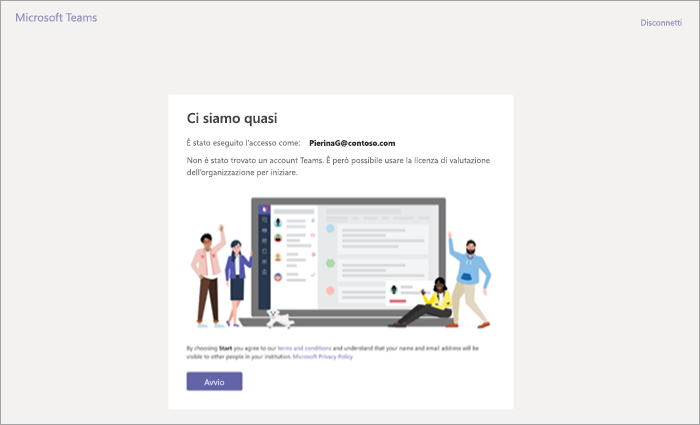
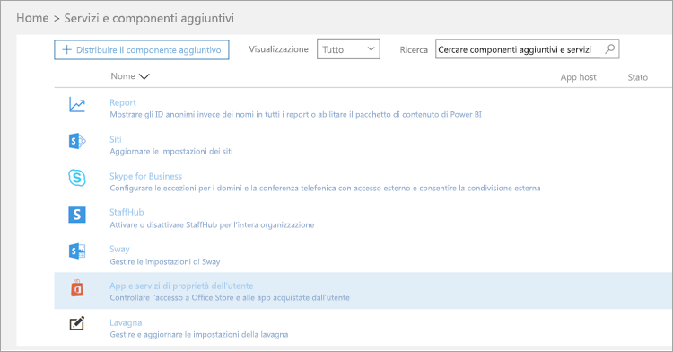
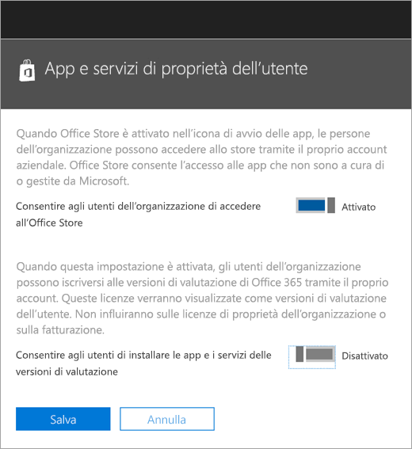
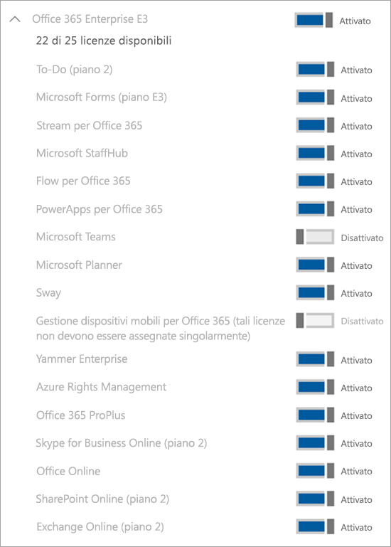

Gestire l'offerta Microsoft Teams Commercial Cloud Trial
=======================================================

Con Microsoft Teams Commercial Cloud Trial, agli utenti di Office 365 esistenti nell'organizzazione, che non hanno una licenza di Microsoft Teams, possono avviare un periodo di valutazione del prodotto di 1 anno. Gli amministratori possono attivare o disattivare questa funzionalità per gli utenti nell'organizzazione. 

> [!IMPORTANT]
> L'offerta Microsoft Teams Commercial Cloud Trial verrà sostituita da quella Microsoft Teams Exploratory a partire da gennaio 2020. Per informazioni su questa nuova offerta, vedere [Gestire la licenza Teams Exploratory](teams-exploratory.md).

## Contenuto dell'offerta

I piani di servizio inclusi nell'offerta sono:

- Exchange Foundation
- Flow per Office 365 - Piano 1
- Forms
- Microsoft Planner
- Microsoft Teams (Teams1, Teams IW)
- Office 
- PowerApps per Office 365 - Piano 1
- Chiosco SharePoint Online
- Stream
- Sway
- Whiteboard
- Yammer Enterprise 

La versione di valutazione mette a disposizione un abbonamento di prova di 1 anno per l'intera organizzazione. Per ogni licenza concessa, la versione di valutazione assegna 2 GB di spazio di archiviazione di SharePoint Online. 

## Chi è idoneo

Gli utenti devono essere abilitati all'iscrizione per app e versioni di valutazione (nell'interfaccia di amministrazione di Microsoft 365). Per altre informazioni, vedere [Gestire la versione di valutazione](#manage-the-trial) più avanti in questo articolo. 

Gli utenti che non hanno una licenza di Office 365 che include Teams possono avvalersi dell'offerta Microsoft Teams Commercial Cloud Trial. Ad esempio, se un utente ha Office 365 Business (che non include Teams), è idoneo per la versione di valutazione.

## Chi non è idoneo

L'organizzazione non è idonea per la versione di valutazione se è un Syndication Partner Customer o cliente GCC, GCC High, DoD o EDU.

Se l'organizzazione non è idonea per l'offerta Microsoft Teams Commercial Cloud Trial, il comando **Consenti agli utenti di installare le versioni di valutazione di app e servizi** non è disponibile.

## Modalità di iscrizione per la versione di valutazione per gli utenti

Gli utenti idonei possono aderire all'offerta di valutazione eseguendo l'accesso a Teams ([teams.microsoft.com](https://teams.microsoft.com)). Verrà visualizzata la schermata seguente per avviare la versione di valutazione. 

Tutte le versioni di valutazione all'interno dell'organizzazione condividono le stesse date di inizio e fine, in base alla data in cui il primo utente si è iscritto per la versione di valutazione. Ad esempio, se l'utente A avvia la prima versione di valutazione il 25 gennaio 2019 e l'utente B avvia una versione di valutazione il 3 giugno 2019, le versioni di valutazione di entrambi gli utenti scadranno il 25 gennaio 2020.

## Gestire la versione di valutazione

La versione di valutazione di Teams deve essere avviata dai singoli utenti finali e non può essere avviata per conto dei dipendenti.

Gli amministratori possono impedire che gli utenti finali richiedano app e servizi in versione di valutazione all'interno della propria organizzazione. Attualmente, la versione di valutazione descritta in questo articolo è l'unica disponibile in questa categoria, ma potrebbe applicarsi a programmi simili in futuro. 

### Impedire agli utenti di installare le versioni di valutazione di app e servizi

È possibile disabilitare l'installazione delle versioni di valutazione di app e servizi per un utente.

1. Nell'[interfaccia di amministrazione di Microsoft 365](https://portal.office.com/adminportal/home) passare a **Impostazioni** > **Servizi e componenti aggiuntivi** > **App e servizi di proprietà degli utenti**.

    

2. Deselezionare **Consenti agli utenti di installare le versioni di valutazione di app e servizi**.

    

### Gestire la disponibilità della versione di valutazione per un utente con una licenza che include Teams

Un utente a cui è stata assegnata una licenza che include Teams non è idoneo per la versione di valutazione. Quando il piano di servizio Teams è abilitato, l'utente può accedere e usare Teams. Se il piano di servizio è disabilitato, l'utente non può accedere e non gli viene neanche presentata l'opzione relativa alla versione di valutazione.

Per disattivare l'accesso a Teams:

1. Nell'interfaccia di amministrazione di Microsoft 365 selezionare **Utenti** > **Utenti attivi**.

2. Selezionare la casella accanto al nome dell'utente.

3. A destra, nella riga **Licenze di prodotto**, scegliere **Modifica**.

4. Nel riquadro **Licenze di prodotto** spostare l'interruttore nella posizione **No**.

    

### Gestire la disponibilità di Manage Teams per gli utenti che hanno già richiesto la versione di valutazione

Se un utente ha richiesto una licenza di valutazione di Teams, è possibile rimuoverla eliminando la licenza o il piano di servizio.

Per disattivare la licenza di valutazione:

1. Nell'interfaccia di amministrazione di Microsoft 365 selezionare **Utenti** > **Utenti attivi**.

2. Selezionare la casella accanto al nome dell'utente.

3. A destra, nella riga **Licenze di prodotto**, scegliere **Modifica**.

4. Nel riquadro **Licenze di prodotto** spostare l'interruttore nella posizione **No**.

    
    
>[!Note]
>L'interruttore Microsoft Teams - Versione di valutazione verrà visualizzato quando il primo utente dell'organizzazione si sarà iscritto per la versione di valutazione.

### Gestire Teams per gli utenti che hanno la licenza di valutazione

Gli utenti che hanno una licenza di valutazione possono essere gestiti nello stesso modo in cui si gestiscono gli utenti con una normale licenza a pagamento. Per altre informazioni, vedere [Gestire le impostazioni di Microsoft Teams per l'organizzazione](enable-features-office-365.md).

### Aggiornare gli utenti dalla licenza di valutazione

Per aggiornare gli utenti dalla licenza di valutazione, eseguire queste operazioni:

1. Acquistare un abbonamento che include Teams.

2. Rimuovere l'abbonamento di valutazione di Teams dall'utente.

3. Assegnare la licenza acquistata.

Per altre informazioni, vedere [Licenze di Office 365 per Microsoft Teams](Office-365-licensing.md).

> [!NOTE]
> Se allo scadere di una versione di valutazione non viene immediatamente eseguito l'aggiornamento a un abbonamento che include Teams, i dati dell'utente non vengono rimossi. L'utente esiste ancora in Azure Active Directory e tutti i dati all'interno di Teams vengono conservati. Una volta assegnata una nuova licenza all'utente per abilitare nuovamente le funzionalità di Teams, tutto il contenuto sarà ancora disponibile. 

### Rimuovere una licenza di valutazione di Microsoft Teams legacy

A partire dal 22 aprile 2019, gli utenti possono iniziare a richiedere la licenza Microsoft Teams Commercial Cloud Trial più recente. Se si vuole eseguire la migrazione degli utenti dell'organizzazione dalla licenza di valutazione legacy a quella più recente, è necessario prima di tutto rimuovere la licenza di valutazione di Microsoft Teams precedente da ciascun utente. Dopo la rimozione della licenza legacy, tutti gli utenti interessati possono richiedere la licenza Microsoft Teams Commercial Cloud Trial aggiornata.

- Se si vuole rimuovere questa licenza tramite PowerShell, vedere [Rimuovere le licenze dagli account utente con Office 365 PowerShell](https://docs.microsoft.com/office365/enterprise/powershell/remove-licenses-from-user-accounts-with-office-365-powershell)

- Se si vuole rimuovere questa licenza tramite il portale di amministrazione, vedere la pagina dedicata alla [rimozione delle licenze per gli utenti di Office 365 per le aziende](https://docs.microsoft.com/office365/admin/subscriptions-and-billing/remove-licenses-from-users?view=o365-worldwide)
