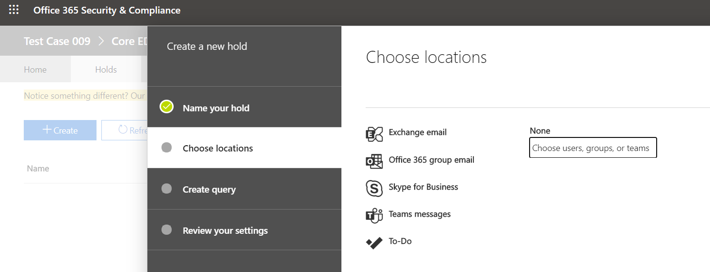

Applicazione di un blocco a un utente o un team di Microsoft Teams
==================================================

Quando è ragionevole aspettarsi che si presenti una controversia legale, le organizzazioni sono tenuti a conservare le informazioni archiviate elettronicamente, inclusi i messaggi di chat di Teams rilevanti per il caso. Le organizzazioni potrebbero dover conservare tutti i messaggi relativi a un argomento specifico o per determinati utenti. Questo articolo illustra il blocco a livello legale in Microsoft Teams (per gestire l'implementazione del blocco nell'area M365, vedere Gestire casi di [eDiscovery:](https://docs.microsoft.com/microsoft-365/compliance/ediscovery-cases#step-4-place-content-locations-on-hold)mettere in stato di blocco i percorsi di contenuto).

> [!NOTE]
> Nel mese di febbraio 2020 sono stati abilitati i diritti di blocco a livello legale o di archiviazione per caso sui canali privati. Le chat dei canali privati vengono archiviate nelle cassette postali degli utenti, le normali chat di canale vengono archiviate nella cassetta postale del gruppo di un team. Se è già applicato un blocco a livello legale per la cassetta postale di un utente, il criterio di blocco verrà ora applicato automaticamente ai messaggi del canale privato archiviati nella cassetta postale. Non sono necessarie altre azioni per attivare questa opzione da parte di un amministratore. È supportato anche il blocco a tutti i file condivisi in canali privati.

All'interno di Microsoft Teams, è possibile mettere in stato di blocco o a tutti gli utenti un intero team o un utente selezionato. In questo modo, tutti i messaggi s scambiati in quei team (inclusi i canali privati) o i messaggi sati da queste persone saranno individuabili dai responsabili della conformità o dagli amministratori di Teams dell'organizzazione.

> [!NOTE]
> L'applicazione di un blocco a un utente non mette automaticamente un gruppo in stato di blocco o viceversa.

Per applicazione di un blocco a un utente o a un team:

1. Passare al [Centro & sicurezza.](https://go.microsoft.com/fwlink/?linkid=854628) Quando si crea un nuovo caso, viene visualizzata l'opzione per il blocco di cassette postali o siti.

2. Passare a eDiscovery o Advanced eDiscovery e creare un caso facendo clic su "Crea un caso". Dopo aver creato il caso, aprirlo.

   > [!div class="mx-imgBorder"]
   > 

3. Passare alla sezione "Blocchi" nel menu superiore e fare clic su "+ Crea" per creare un blocco. L'applicazione di un blocco a un utente o a un team consente di salvare tutti i messaggi sati da tali utenti o messaggi. Quando si crea un nuovo caso, viene visualizzata l'opzione per il blocco di cassette postali o siti.

   > [!div class="mx-imgBorder"]
   > 

   1. **Assegnare un nome al blocco.** Selezionare un nome descrittivo e univoco per il blocco che si sta per creare.

      > [!div class="mx-imgBorder"]
      > 

    2. **Scegliere la posizione.** Scegliere se si vuole che il blocco sia applicato a un utente o a un intero team (per il momento non è possibile applicare un blocco a singoli canali). Nota: se un utente è in stato di blocco, tutti i suoi messaggi sono in stato di blocco, inclusi tutti i messaggi inviati in una chat 1:1, 1:molti o di gruppo o in una conversazione di canale (inclusi i canali privati).
  
       > [!div class="mx-imgBorder"]
       > 

    3. **Creare una query.** È possibile personalizzare il blocco se si vuole una maggiore granularità nel criterio di blocco. Ad esempio, è possibile specificare parole chiave da cercare oppure aggiungere altre condizioni che devono essere soddisfatte per l'applicazione del blocco.
    
    4. **Rivedere le impostazioni** prima di pubblicarla nell'organizzazione.

Dopo aver impostato il blocco a livello legale, è possibile individuare tutto il contenuto conservato da qualsiasi criterio di blocco dopo [l'articolo Teams eDiscovery.](eDiscovery-investigation.md)

> [!IMPORTANT]
> Quando un utente o un gruppo viene messo in stato di blocco, tutte le copie dei messaggi vengono conservate. Ad esempio, se un utente ha pubblicato un messaggio in un canale e poi lo ha modificato, in uno scenario di blocco, vengono conservate entrambe le copie del messaggio. Senza il blocco a livello legale sul posto, viene conservato solo il messaggio più recente.

## Posizioni di contenuto da mettere in stato di blocco a tutti per conservare il contenuto di Teams

Come guida utile, è possibile usare la tabella seguente per comprendere il percorso di contenuto (ad esempio una cassetta postale o un sito) a cui è stato posto un blocco a tutti gli elementi in modo da conservare diversi tipi di contenuto di Teams.

|Scenario  |Percorso di contenuto  |
|---------|---------|
|Chat di Teams per un utente (ad esempio, chat 1:1, chat di gruppo 1:N e conversazioni di canale privato)     |Cassetta postale utente.         |
|Chat di canale di Teams (esclusi i canali privati)    |Cassetta postale del gruppo usata per il team.         |
|Contenuto dei file di Teams (ad esempio, contenuto wiki e file)     |Sito di SharePoint usato dal team.         |
|File dei canali privati di Teams     |Sito di SharePoint dedicato per canali privati.     |
|Contenuto privato dell'utente     |Account di OneDrive for Business dell'utente.         |
|Contenuto della scheda nelle chat|Cassetta postale utente per chat 1:1, chat di gruppo 1:N, conversazioni di canale privato o cassetta postale di gruppo per il contenuto della scheda nei messaggi del canale. Per altre informazioni, vedere la sezione "Conservazione del contenuto della scheda" in [Creare un blocco di eDiscovery.](https://docs.microsoft.com/microsoft-365/compliance/create-ediscovery-holds#preserve-card-content)
||||

> [!NOTE]
> Per conservare le comunicazioni in canali privati, è necessario mettere in stato di blocco le cassette postali degli utenti (utenti di canali privati) e, quando si usa lo strumento eDiscovery per la ricerca, eseguire una ricerca nella cassetta postale dell'utente. Come indicato in precedenza, le chat dei canali privati vengono archiviate nelle cassette postali degli utenti, non nella cassetta postale del gruppo di un team.

Se si vogliono leggere altre informazioni su questo argomento per le aree non Di Teams in Microsoft 365, è consigliabile esaminare Gestione dei casi di [eDiscovery:](https://docs.microsoft.com/microsoft-365/compliance/ediscovery-cases#step-4-place-content-locations-on-hold)Applicazione di un blocco ai percorsi di contenuto.
