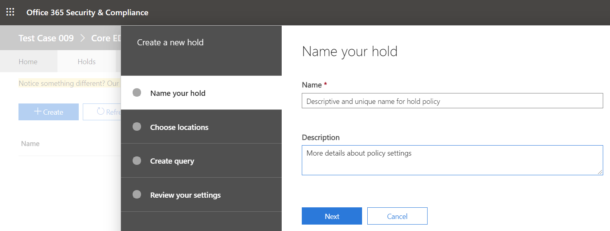

# Applicazione di un blocco Microsoft Teams un utente o un teamPlace a Microsoft Teams user or team on legal hold

Quando esiste una ragionevole aspettativa di controversie legali, le organizzazioni devono conservare le informazioni archiviate elettronicamente (ESI), inclusi Teams messaggi di chat rilevanti per il caso.When a reasonable expectation of litigation exists, organizations are required to preserve electronically stored information (ESI), including Teams chat messages that are relevant to the case. Le organizzazioni potrebbero dover conservare tutti i messaggi relativi a un argomento specifico o a determinati utenti.Organizations may need to preserve all messages related to a specific topic or for certain individuals. Questo articolo illustra il blocco legale in Microsoft Teams.This article will cover legal hold in Microsoft Teams. Per mantenere il contenuto in Microsoft 365, vedere [Creare un blocco di eDiscovery.](https://docs.microsoft.com/microsoft-365/compliance/create-ediscovery-holds)To hold content across Microsoft 365, see [Create an eDiscovery hold](https://docs.microsoft.com/microsoft-365/compliance/create-ediscovery-holds).

> [!NOTE]
> A febbraio 2020 è stato attivato il blocco legale per i canali privati.In February 2020, we turned on legal hold for private channels. Le chat del canale privato vengono archiviate nelle cassette postali degli utenti, mentre le normali chat del canale vengono archiviate nella cassetta postale Teams del gruppo.Private channel chats are stored in user mailboxes, while normal channel chats are stored in the Teams’ group mailbox. Se esiste già un blocco legale per una cassetta postale utente, il criterio di blocco verrà applicato automaticamente ai messaggi del canale privato archiviati nella cassetta postale.If there is already a legal hold in place for a user mailbox, the hold policy will now automatically apply to private channel messages stored in that mailbox. Non sono necessarie altre azioni per l'attivazione di questa opzione da parte di un amministratore.There is no further action needed for an admin to turn this on. È supportato anche il blocco legale dei file condivisi nei canali privati.Legal hold of files shared in private channels is also supported.

All'Microsoft Teams, un intero team o utenti selezionati può essere sospeso per motivi legali.Within Microsoft Teams, an entire team or select users can be put on legal hold. In questo modo si assicurerà che tutti i messaggi s scambiati in questi team (inclusi i canali privati) o i messaggi s scambio da questi utenti siano individuabili dai responsabili della conformità dell'organizzazione o dagli amministratori Teams aziendali.Doing that will make sure that all messages that were exchanged in those teams (including private channels) or messages exchanged by those individuals are discoverable by the organization's compliance managers or Teams Admins.

> [!NOTE]
> L'applicazione di un blocco a un utente non comporta automaticamente il blocco di un gruppo o viceversa.Placing a user on hold does not automatically place a group on hold or vice-versa.
> Le notifiche inviate nel feed attività non possono essere poste in blocco.Notifications sent in activity feed can't be placed on hold.

Per impostare un blocco legale per un utente o un team in un caso di eDiscovery di base:To put a user or a team on legal hold in a Core eDiscovery case:

1. Passare al [Centro conformità Microsoft 365](https://compliance.microsoft.com).Go to the [Microsoft 365 compliance center](https://compliance.microsoft.com). Quando si crea un nuovo caso, viene visualizzata l'opzione per mettere in blocco cassette postali o siti.When you create a new case, you are presented with the option to place mailboxes or sites on hold.

2. Passare a **eDiscovery**  >  **Core** e creare un caso facendo clic **su Crea un caso.**Go to **eDiscovery** > **Core** and create a case by clicking **Create a case**. Dopo aver creato il caso, aprirlo.After the case is created, open it.
  
   

   > [!NOTE]
   > È anche possibile inserire un utente in un blocco associato a un Advanced eDiscovery caso.You can also place a user on a hold that's associated with an Advanced eDiscovery case. Per altre informazioni, vedere [Gestire i blocchi in Advanced eDiscovery](https://docs.microsoft.com/microsoft-365/compliance/managing-holds).For more information, see [Manage holds in Advanced eDiscovery](https://docs.microsoft.com/microsoft-365/compliance/managing-holds).

3. Passare alla scheda **Blocchi** nel menu superiore e fare clic **su Crea** per creare un blocco.Go to the **Holds** tab on the top menu and click **Create** to create a hold. L'applicazione di un blocco a un utente o a un team mantiene tutti i messaggi s scambiati da tali utenti o messaggi.Placing a user or a team on hold preserves all the messages exchanged by those users or messages. Quando si crea un nuovo caso, viene visualizzata l'opzione per mettere in blocco cassette postali o siti.When you create a new case, you are presented with the option to place mailboxes or sites on hold.

   
    
    1. **Assegnare un nome al blocco**.**Name your hold**. Selezionare un nome descrittivo e univoco per il blocco che si sta per creare.Select a descriptive and unique name for the hold you are going to create.
  
       

    1. **Scegliere la posizione**.**Choose location**. Scegliere se applicare il blocco a un utente o a un intero team (il blocco non può essere applicato ai singoli canali per il momento).Choose whether you want the hold to be applied on a user or on an entire Team (hold cannot be applied on individual channels for now). Nota: se un utente è in stato di blocco, tutti i messaggi sono in attesa, incluso quello che ha inviato in una chat 1:1, in una chat 1:1 o in una chat di gruppo o in una conversazione di canale (inclusi i canali privati).Note: if a user is on hold, all their messages would be on hold, including whatever they sent in a 1:1 chat, 1:many or group chat, or a channel conversation (including private channels).
    

    2. **Creare una query**.**Create query**. È possibile personalizzare il blocco se si vuole una maggiore granularità nei criteri di blocco.You can customize the hold if you want more granularity in the hold policy. Ad esempio, è possibile specificare parole chiave da cercare oppure aggiungere altre condizioni che dovranno essere soddisfatte per l'applicazione del blocco.For example, you can specify keywords to look for, or you can add more conditions, that would need to be satisfied for the hold to take effect.
    
    3. **Rivedere le impostazioni prima** di creare il blocco.**Review your settings** before creating the hold.

Dopo aver creato il blocco legale, è possibile eseguire ricerche nel contenuto conservato da qualsiasi criterio di blocco.After the legal hold has been created, you can search the content retained by any hold policy. Per altre informazioni, vedere [Condurre un'indagine eDiscovery in Teams](eDiscovery-investigation.md).For more information, see [Conduct an eDiscovery investigation in Teams](eDiscovery-investigation.md).

> [!IMPORTANT]
> Quando un utente o un gruppo viene sospeso, tutte le copie dei messaggi verranno conservate.When a user or group is placed on hold, all message copies will be retained. Ad esempio, se un utente ha pubblicato un messaggio in un canale e quindi lo ha modificato, in uno scenario di blocco vengono mantenute entrambe le copie del messaggio.For example, if a user posted a message in a channel and then modified the message, in a hold scenario, both copies of the message are retained. Senza il blocco legale sul posto, viene mantenuto solo il messaggio più recente.Without the legal hold in-place, only the latest message is retained.

## Percorsi di contenuto da inserire in blocco legale per mantenere Teams contenutoContent locations to place on legal hold to preserve Teams content

Come guida utile, è possibile usare la tabella seguente per comprendere quale percorso di contenuto, ad esempio una cassetta postale o un sito, inserire in blocco legale per mantenere i diversi tipi di contenuto Teams contenuto.As a helpful guide, you can use the following table to understand what content location (such as a mailbox or site) to place on legal hold to preserve different types of Teams content.

|ScenarioScenario  |Percorso del contenutoContent location  |
|---------|---------|
|Teams chat per un utente (ad esempio, chat 1:1, chat di gruppo 1:N e conversazioni di canale privato)Teams chats for a user (for example, 1:1 chats, 1:N group chats, and private channel conversations)     |Cassetta postale utente.User mailbox.         |
|Teams chat del canale (esclusi i canali privati)Teams channel chats (excluding private channels)    |Cassetta postale del gruppo usata per il team.Group mailbox used for the team.         |
|Teams contenuto del file (ad esempio, contenuto wiki e file)Teams file content (for example, Wiki content and files)     |SharePoint sito usato dal team.SharePoint site used by the team.         |
|Teams dei canali privatiTeams private channel files     |Sito SharePoint dedicato per canali privati.Dedicated SharePoint site for private channels.     |
|Contenuto privato dell'utenteUser's private content     |L'account OneDrive for Business dell'utente.The user's OneDrive for Business account.         |
|Contenuto della scheda nelle chatCard content in chats|Cassetta postale utente per chat 1:1, chat di gruppo 1:N e conversazioni di canale privato o cassetta postale di gruppo per il contenuto della scheda nei messaggi del canale.User mailbox for 1:1 chats, 1:N group chats, and private channel conversations or group mailbox for card content in channel messages. Per altre informazioni, vedere la sezione "Conservare il contenuto della scheda" in [Creare un blocco di eDiscovery.](/microsoft-365/compliance/create-ediscovery-holds#preserve-card-content)For more information, see the "Preserve card content" section in [Create an eDiscovery hold](/microsoft-365/compliance/create-ediscovery-holds#preserve-card-content).
||||

> [!NOTE]
> Per mantenere le comunicazioni nei canali privati, è necessario mettere in blocco le cassette postali degli utenti (utenti del canale privato) e quando si usa lo strumento eDiscovery per eseguire ricerche, è consigliabile eseguire una ricerca nella cassetta postale dell'utente.To retain communication in private channels, you need to put the user mailboxes ( Private channel users) on hold and when using eDiscovery tool to search, you should search in that user’s mailbox. Come è stato detto in precedenza, le chat dei canali privati vengono archiviate nelle cassette postali degli utenti, non nella cassetta postale di gruppo di un team.As was stated earlier, private channel chats are stored in user mailboxes, not in group mailbox of a Team.

Per altre informazioni su questo argomento per le aree non Teams in Microsoft 365, vedere Gestire i casi di [eDiscovery:](/microsoft-365/compliance/ediscovery-cases#step-4-place-content-locations-on-hold)Mettere in attesa i percorsi di contenuto.If you want to read further on this topic for non-Teams areas in Microsoft 365, you should review [Manage eDiscovery cases: Place content locations on hold](/microsoft-365/compliance/ediscovery-cases#step-4-place-content-locations-on-hold).
