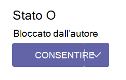

# Gestire le app di Teams nell'interfaccia di amministrazione di Microsoft Teams

Le app per l'organizzazione sono gestite nella pagina **Delle app di Teams** nel portale dell'interfaccia di amministrazione di Teams. Usare la pagina Gestisci app per visualizzare e gestire tutte le app di Teams nel catalogo app dell'organizzazione.

:::image type="content" source="media/manage-apps.png" alt-text="Screenshot della pagina Gestisci app." lightbox="media/manage-apps.png":::

Per usare l'interfaccia di amministrazione di Teams, è necessario avere un ruolo di Amministrazione globale o amministratore di Teams. Per informazioni dettagliate, vedere gli articoli della Guida seguenti:

* [Ruoli di amministratore di Teams](./using-admin-roles.md).
* [Ruoli di amministratore di Microsoft 365](/microsoft-365/admin/add-users/about-admin-roles)

Per gestire le app, usare i criteri per controllare le autorizzazioni per gli utenti, l'installazione delle app e il caricamento di app personalizzate create all'interno dell'organizzazione. Per informazioni sui criteri, vedere [Panoramica dei criteri delle app](app-policies.md).

> [!NOTE]
> La pagina Gestisci app non è disponibile nelle distribuzioni Microsoft 365 Government Community Cloud High (GCCH) o DoD (Department of Defense) di Teams.

Durante la creazione di un'app, gli sviluppatori creano e aggiungono un ID app al file manifesto. È possibile visualizzare questo ID dell'app esterna nella pagina Gestisci app dopo aver abilitato la colonna `External app ID` dalle impostazioni della colonna. È anche possibile visualizzarlo nella pagina dei dettagli dell'app di un'app personalizzata. L'ID è applicabile solo per le app personalizzate.

## Casi d'uso per la gestione delle app e le interfacce disponibili

Le opzioni per eseguire la maggior parte dei casi di utilizzo di gestione delle app sono disponibili nell'interfaccia di amministrazione di Teams. Inoltre, alcune opzioni sono disponibili in altri portali.

| Casi d'uso per la gestione delle app | Collegamento all'interfaccia | Documentazione |
|:----|:----|:----|
| **Nell'interfaccia di amministrazione di Teams** | | |
| Controllare quali app sono disponibili per gli utenti dell'organizzazione consentendo e bloccando le app. È anche possibile caricare e approvare app personalizzate. Dopo aver gestito le app in questa pagina, è possibile usare i criteri di autorizzazione e di configurazione delle app per configurare le app disponibili per utenti specifici nell'app store dell'organizzazione. | [Gestire le app nell'interfaccia di amministrazione di Teams](https://admin.teams.microsoft.com/policies/manage-apps) | Articolo corrente |
| I criteri di autorizzazione delle app controllano le app che si vogliono rendere disponibili agli utenti di Teams nell'organizzazione. È possibile usare il criterio predefinito Globale (a livello di organizzazione) e personalizzarlo oppure creare uno o più criteri in base alle esigenze dell'organizzazione. | [Criteri di autorizzazione](https://admin.teams.microsoft.com/policies/app-permission) | [Gestire i criteri di autorizzazione per le app](teams-app-permission-policies.md) |
| I criteri di configurazione delle app controllano il modo in cui le app vengono rese disponibili a un utente con l'app Teams. Usare i criteri globali (predefiniti a livello di organizzazione) e personalizzarli o creare criteri personalizzati e assegnarli a un set di utenti. | [Criteri di configurazione](https://admin.teams.microsoft.com/policies/app-setup) | [Gestire i criteri di configurazione delle app](teams-app-setup-policies.md) |
| È possibile sviluppare e caricare app personalizzate come pacchetti di app e renderle disponibili nell'app store dell'organizzazione. | Impostazioni delle app a livello di organizzazione in [Gestisci app](https://admin.teams.microsoft.com/policies/manage-apps) | [Gestire criteri app personalizzati](teams-custom-app-policies-and-settings.md) |
| È possibile personalizzare l'app store di Teams con il logo, lo sfondo o il colore dell'organizzazione. | [Personalizza lo Store](https://admin.teams.microsoft.com/policies/customize-appstore) | [Personalizzare l'app store dell'organizzazione](customize-your-app-store.md) |
| Il report Utilizzo app Teams fornisce informazioni sulle app in uso, gli utenti attivi e altre informazioni sull'utilizzo delle app. | [Report sull'utilizzo](https://admin.teams.microsoft.com/analytics/reports) | [Report utilizzo app Teams](teams-analytics-and-reports/app-usage-report.md) |
| Gli utenti possono aggiungere app quando ospitano riunioni o chat con guest. Possono anche usare le app condivise dai guest quando partecipano a riunioni o chat ospitate esternamente. Vengono applicati i criteri dei dati dell'organizzazione dell'utente che ospita e le procedure di condivisione dei dati di qualsiasi app di terze parti condivisa dall'organizzazione dell'utente. | [Accesso esterno](https://admin.teams.microsoft.com/company-wide-settings/external-communications) | [Comportamento dell'app a seconda dei tipi di utenti](non-standard-users.md) |
| Con l'accesso guest, è possibile fornire l'accesso alle applicazioni e ad altre funzionalità di Teams a persone esterne all'organizzazione, mantenendo il controllo sui dati aziendali. | [Accesso guest](https://admin.teams.microsoft.com/company-wide-settings/guest-configuration) | [Accesso guest in Teams](guest-access.md) |
| I criteri di aggiornamento vengono usati per gestire gli utenti di Teams e di Office Preview che vedranno le funzionalità in versione non finale o in anteprima nell'app Teams.  | [Criteri di aggiornamento di Teams](https://admin.teams.microsoft.com/policies/updatemanagement) | [Anteprima pubblica di Teams](public-preview-doc-updates.md) |
| **Interfaccia di amministrazione di Teams esterna** | | |
| Gestire licenze e abbonamenti di app di terze parti in interfaccia di amministrazione di Microsoft 365 | [interfaccia di amministrazione di Microsoft 365](https://admin.microsoft.com/#/licenses) | [Gestire gli abbonamenti alle app di terze parti](/microsoft-365/commerce/manage-saas-apps) |
| Controllare gli eventi dell'app Teams in Portale di conformità di Microsoft Purview. | [Revisione](https://compliance.microsoft.com/auditlogsearch?viewid=Async%20Search) | [Attività di Teams](audit-app-management-activities.md) |
| Le applicazioni possono essere concesse all'organizzazione e ai relativi dati con tre metodi: un amministratore acconsente all'applicazione per tutti gli utenti, un utente concede il consenso all'applicazione o un amministratore che integra un'applicazione e abilita l'accesso in modalità self-service o l'assegnazione di utenti direttamente all'applicazione. Verifica le autorizzazioni Graph per le app. Verificare le autorizzazioni fornite dagli utenti o delegate dagli amministratori. | [Portale di Azure AD](https://aad.portal.azure.com/) | [Rivedere le autorizzazioni concesse alle applicazioni](/azure/active-directory/manage-apps/manage-application-permissions) |

<!---
| xxx | [Manage users](https://admin.teams.microsoft.com/users) | [Add users and assign licenses](/microsoft-365/admin/add-users/add-users?view=o365-worldwide) |  
--->

## Pubblicare un'app personalizzata nell'app store dell'organizzazione

Usare la pagina Gestisci app per pubblicare app create appositamente per l'organizzazione. Dopo la pubblicazione, un'app personalizzata è disponibile per gli utenti nell'app store dell'organizzazione. Esistono due modi per pubblicare un'app personalizzata nell'app store dell'organizzazione. La modalità di utilizzo dipende da come si ottiene l'app.

* [Approvare un'app personalizzata](#approve-a-custom-app): usare questo metodo se lo sviluppatore invia l'app direttamente alla pagina Gestisci app usando l'API di invio delle app di Teams. È quindi possibile rivedere e pubblicare (o rifiutare) l'app direttamente dalla pagina dei dettagli dell'app.
* [Caricare un pacchetto dell'app](#upload-an-app-package): usare questo metodo se lo sviluppatore invia il pacchetto dell'app in formato .zip. L'app viene pubblicata caricando il pacchetto dell'app.

### Approvare un'app personalizzata

Il widget **Approvazioni in sospeso** nella pagina Gestisci app ti invia una notifica quando uno sviluppatore invia un'app usando l'API di invio delle app di Teams. Viene elencata un'app appena inviata con **lo stato Pubblicazione** **inviato** e **lo stato** **Bloccato**. Passare alla pagina dei dettagli dell'app per visualizzare altre informazioni sull'app e quindi, per pubblicarla, impostare **Lo stato pubblicazione** su **Pubblica**.

Riceverai anche una notifica quando uno sviluppatore invia un aggiornamento a un'app personalizzata. È quindi possibile rivedere e pubblicare (o rifiutare) l'aggiornamento nella pagina dei dettagli dell'app. Tutti i criteri di autorizzazione e i criteri di configurazione delle app rimangono applicati per l'app aggiornata.

Per altre informazioni, vedere [Pubblicare un'app personalizzata inviata tramite l'API di invio delle app di Teams](submit-approve-custom-apps.md).

### Caricare un pacchetto dell'app

Lo sviluppatore crea un pacchetto dell'app Teams utilizzando [Teams App Studio](/microsoftteams/platform/get-started/get-started-app-studio) e quindi lo invia all'utente in formato .zip. Quando si dispone del pacchetto dell'app, è possibile caricarlo nell'app store dell'organizzazione.

Per caricare una nuova app personalizzata, selezionare **Carica** per caricare il pacchetto dell'app. L'app non viene evidenziata dopo il caricamento, quindi è necessario cercare nell'elenco delle app nella pagina Gestisci app per trovarla.

Per aggiornare un'app dopo il caricamento, seleziona il nome dell'app nell'elenco delle app nella pagina Gestisci app e quindi seleziona **Aggiorna**. L'esecuzione di un aggiornamento sostituisce l'app esistente e tutti i criteri di autorizzazione e i criteri di configurazione delle app rimangono applicati per l'app aggiornata.

Per altre informazioni, vedere [Pubblicare un'app personalizzata caricando un pacchetto dell'app](upload-custom-apps.md).

## Consentire e bloccare le app

Nella pagina Gestisci app puoi consentire o bloccare singole app a livello di organizzazione. Mostra ogni app disponibile e lo stato corrente dell'app a livello di organizzazione.

Per consentire o bloccare un'app:

1. Passare all'interfaccia di amministrazione di Teams > alle app di Teams > Gestire le app.
1. Seleziona un'app dall'elenco delle app.
1. Selezionare **Consenti** o **Blocca**.

Quando si blocca o si consente un'app nella pagina Gestisci app, l'app viene bloccata o consentita a tutti gli utenti dell'organizzazione.  Quando si blocca o si consente un'app in un criterio di autorizzazione dell'app Teams, questa viene bloccata o consentita per gli utenti a cui sono stati assegnati criteri. Per consentire a un utente di installare e interagire con qualsiasi app, è necessario consentire l'app a livello di organizzazione nella pagina Gestisci app e nei criteri di autorizzazione dell'app assegnati all'utente.

 > [!NOTE]
 > Per disinstallare un'app, fare clic con il pulsante destro del mouse sull'app e quindi scegliere **Disinstalla** o usare il menu **Altre app** a sinistra.

## Gestire le richieste degli utenti di sbloccare le app

Puoi visualizzare le richieste di rendere disponibile un'app bloccata per l'uso. La richiesta viene inviata all'amministratore IT, che può visualizzare e gestire le richieste utente nell'interfaccia di amministrazione di Teams.

  :::image type="content" source="media/user-request.png" alt-text="Effettuare una richiesta di approvazione delle app bloccate":::

### Visualizzare una richiesta

 1. Accedere all'interfaccia di amministrazione di Teams e selezionare [Gestisci app](https://admin.teams.microsoft.com/policies/manage-apps)

    :::image type="content" source="media/requested-apps1.png" alt-text="Le richieste degli utenti finali per le app bloccate vengono visualizzate nell'interfaccia di amministrazione di Teams nella colonna Intitolato Richieste da parte degli utenti." lightbox="media/requested-apps.png":::

 1. Per visualizzare e controllare il numero di richieste per ogni app, ordinare le richieste nella colonna **Richieste per utente** .
 1. Seleziona il nome dell'app che vuoi sbloccare e apre la pagina dei dettagli dell'app.
 1. Selezionare **Gestisci richieste** e completare i passaggi visualizzati nella finestra di dialogo popup. La procedura per approvare un'app varia in base al metodo usato per bloccarla.

    * Se l'app viene bloccata tramite criteri di autorizzazione, consentire l'app modificando i [criteri di autorizzazione](teams-app-permission-policies.md).
    * Se l'app è bloccata per tutti gli utenti, [consenti l'app](#allow-and-block-apps).
    * Se tutte le app sono bloccate per tutti gli utenti, modificare [le impostazioni a livello di organizzazione](#manage-org-wide-app-settings).

 Se un amministratore consente un'app, non informa l'utente finale che la richiesta viene agito su di essa. L'utente deve visitare l'app nello Store per verificare se l'app è sbloccata o meno.

### Ignorare una richiesta utente

 1. Seleziona il nome dell'app per cui vuoi ignorare le richieste dell'utente.
 1. Selezionare **Gestisci richieste** e quindi **Ignora tutte le richieste** nella finestra di dialogo.
 1. Quando una richiesta viene ignorata, l'utente viene reimpostato su zero.

  :::image type="content" source="media/reject.png" alt-text="il rifiuto delle app bloccate."border="true":::

Se un amministratore ignora una richiesta, non informa l'utente finale che la richiesta viene agito su di essa. L'utente deve visitare l'app nello Store per verificare se l'app è sbloccata o meno.

## App bloccate dagli autori

Quando un ISV pubblica un'app nell'app store globale, potrebbe essere necessario che gli amministratori configurino o personalizzino l'esperienza dell'app. L'amministratore può renderla disponibile agli utenti finali quando l'app è configurata.

Ad esempio, Contoso Electronics è un ISV che ha creato un'app help desk per Microsoft Teams. Contoso Electronics vuole che i clienti configurino alcune proprietà dell'app in modo che, quando gli utenti interagiscono con l'app, funzioni come previsto. Prima che un amministratore possa consentire o bloccare l'applicazione, verrà **visualizzata come Bloccata dall'editore** nell'interfaccia di amministrazione di Teams e verrà nascosta agli utenti finali per impostazione predefinita. Dopo aver seguito le indicazioni dell'autore per configurare l'app, è possibile renderla disponibile agli utenti impostando lo stato **su Consentito** o impedire agli utenti di usarla impostando lo stato su **Bloccata**.

<!--- 

--->

## Aggiungere un'app a un team

Si usa il pulsante **Aggiungi al team** per installare un'app in un team. Questa opzione è disponibile solo per le app che possono essere installate in un ambito del team. L'opzione non è disponibile per le app che possono essere installate solo nell'ambito personale.

1. Cerca un'app in base al nome e seleziona l'app. Non aprire la pagina dei dettagli dell'app.
1. Selezionare **Aggiungi al team**.

   :::image type="content" source="media/manage-apps-add-app-team-trimmed.png" alt-text="Screenshot dell'opzione Aggiungi al team per l'app che può essere aggiunta all'ambito del team.":::

1. Nel riquadro **Aggiungi al team** cercare il team a cui si vuole aggiungere l'app, selezionare il team e quindi selezionare **Applica**.

## Personalizzare un'app

Ora è possibile personalizzare un'app per includere un aspetto specifico in base alle esigenze dell'organizzazione. Vedere [Personalizzare le app in Teams](customize-apps.md).

## Acquisto di servizi per app di terze parti

È possibile cercare e acquistare licenze per i servizi offerti da app di terze parti per gli utenti dell'organizzazione direttamente dalla pagina Gestisci app. La colonna **Licenze** nella tabella indica se un'app offre un abbonamento SaaS a pagamento. Selezionare **Acquista ora** per visualizzare i piani e le informazioni sui prezzi e acquistare licenze per gli utenti. Per altre informazioni, vedere [Acquisto di servizi per app di terze parti di Teams nell'interfaccia di amministrazione di Microsoft Teams](purchase-third-party-apps.md).

## Concedere autorizzazioni e consenso alle app per l'uso delle informazioni degli utenti finali

È possibile esaminare e concedere il consenso alle app che richiedono autorizzazioni per conto di tutti gli utenti dell'organizzazione. In questo modo gli utenti non dovranno rivedere e accettare le autorizzazioni richieste dall'app all'avvio dell'app. La colonna **Autorizzazioni** indica se un'app ha autorizzazioni che richiedono il consenso. Verrà visualizzato un collegamento **Visualizza dettagli** per ogni app registrata in Azure AD con autorizzazioni che richiedono il consenso. Per altre informazioni, vedere [Visualizzare le autorizzazioni per le app e concedere il consenso di amministratore nell'interfaccia di amministrazione di Microsoft Teams](app-permissions-admin-center.md).

## Visualizzare le autorizzazioni di consenso specifiche per le risorse

Le autorizzazioni per il consenso specifico delle risorse consentono ai proprietari del team di concedere a un'app il consenso per l'accesso e la modifica dei dati di un team. Le autorizzazioni RSC sono granulari, autorizzazioni specifiche di Teams che definiscono cosa può fare un'app in un team specifico. È possibile visualizzare le autorizzazioni RSC nella scheda **Autorizzazioni** della pagina dei dettagli dell'app per un'app. Per altre informazioni, vedere [Visualizzare le autorizzazioni per le app e concedere il consenso di amministratore nell'interfaccia di amministrazione di Microsoft Teams](app-permissions-admin-center.md).

## Gestire le impostazioni delle app a livello di organizzazione

Usare le impostazioni delle app a livello di organizzazione per controllare se gli utenti con [una licenza F](https://www.microsoft.com/microsoft-365/enterprise/frontline#office-SKUChooser-0dbn8nt) ottengono l'esperienza personalizzata per le app in prima linea, se gli utenti possono installare app di terze parti e se gli utenti possono caricare o interagire con le app personalizzate nell'organizzazione. Le impostazioni app a livello di organizzazione disciplinano il comportamento di tutti gli utenti e sostituiscono qualsiasi criterio di autorizzazione app assegnato agli utenti. È possibile usarle per controllare eventuali app dannose o problematiche.

> [!NOTE]
> Per informazioni su come usare le impostazioni delle app a livello di organizzazione in Microsoft 365 Government - Government Community Cloud High GCCH e le distribuzioni DoD (Department of Defense) di Teams, vedi [Gestire i criteri di autorizzazione delle app in Teams](teams-app-permission-policies.md).

1. Nella pagina Gestisci app seleziona **Impostazioni app a livello di organizzazione**. È quindi possibile configurare le impostazioni desiderate nel riquadro.

    :::image type="content" source="media/manage-apps-org-wide-app-settings.png" alt-text="Screenshot del riquadro Impostazioni app a livello di organizzazione nella pagina Gestisci app":::

1. In **App personalizzate** disattiva o attiva **Mostra app personalizzate**. Quando questa impostazione è attivata, gli utenti con [una licenza F](https://www.microsoft.com/microsoft-365/enterprise/frontline#office-SKUChooser-0dbn8nt) ottengono l'esperienza app frontline personalizzata. Questa esperienza aggiunge le app più rilevanti in Teams per gli operatori in prima linea. Per altre informazioni, vedere [Personalizzare le app Di Teams per i dipendenti in prima linea](pin-teams-apps-based-on-license.md).

    Questa funzionalità è disponibile per le licenze F. Altri tipi di licenza saranno supportati in futuro.
1. In **App di terze parti**, disattivare o attivare queste impostazioni per controllare l'accesso alle app di terze parti:

    * **Consenti app di terze parti**: questa impostazione controlla se gli utenti possono usare app di terze parti. Se disattivi questa impostazione, gli utenti non potranno installare o usare app di terze parti e lo stato dell'app di queste app viene visualizzato come Bloccato a **livello di organizzazione** nella tabella.

        > [!NOTE]
        > Quando **l'opzione Consenti app di terze parti** è disattivata, [i webhook in uscita sono ancora abilitati](/microsoftteams/platform/webhooks-and-connectors/what-are-webhooks-and-connectors) per tutti gli utenti, ma è possibile controllarli a livello di utente consentendo o bloccando l'app Webhook in uscita tramite [criteri di autorizzazione dell'app](teams-app-permission-policies.md). Se sono presenti [criteri di autorizzazione](teams-app-permission-policies.md) per le **app Microsoft** che usano l'impostazione **Consenti app specifiche e bloccano tutte le altre** e si vogliono abilitare i webhook in uscita per gli utenti, aggiungere l'app Webhook in uscita all'elenco.

        > [!NOTE]
        > Gli utenti Teams possono aggiungere app quando tengono riunioni o chat con persone di altre organizzazioni. Possono inoltre usare app condivise da componenti di altre organizzazioni quando prendono parte a riunioni o chat tenute da quelle organizzazioni. Si applicano i criteri sui dati dell’organizzazione dell’utente ospitante, così come le pratiche di condivisione dei dati di tutte le app di terze parti condivise da quell’organizzazione.

    * **Consenti qualsiasi nuova app di terze parti pubblicata nello Store per impostazione predefinita**: questa impostazione consente di controllare se eventuali nuove app di terze parti pubblicate nello Store di Teams diventano disponibili automaticamente in Teams. È possibile impostare questa opzione solo se si consentono le app di terze parti.

1. In **App personalizzate** disattiva o attiva **Consenti l'interazione con le app personalizzate**. Questa impostazione controlla se gli utenti possono interagire con le app personalizzate. Per altre informazioni, vedere [Gestisci criteri e impostazioni app personalizzate in Teams](teams-custom-app-policies-and-settings.md).
1. Seleziona **Salva** per rendere effettive le impostazioni delle app a livello di organizzazione.

## Vedere anche

* [Gestire Teams durante la transizione dall Skype for Business interfaccia di amministrazione](manage-teams-skypeforbusiness-admin-center.md)
