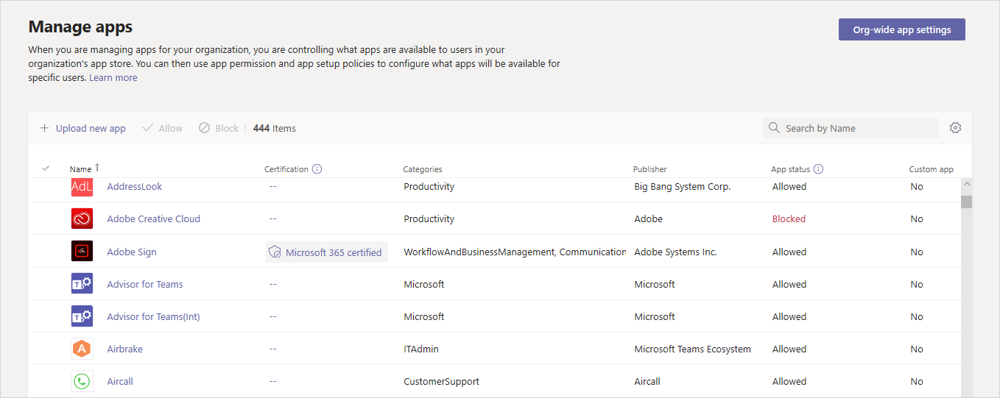

# Gestire le app nell'interfaccia Microsoft Teams di amministrazioneManage your apps in the Microsoft Teams admin center

Come amministratore, la pagina Gestisci app nell'interfaccia di amministrazione Microsoft Teams consente di visualizzare e gestire tutte le app Teams per l'organizzazione.As an admin, the Manage apps page in the Microsoft Teams admin center is where you view and manage all Teams apps for your organization. Qui è possibile visualizzare lo stato e le proprietà a livello di organizzazione delle app, approvare o caricare nuove app personalizzate nell'App Store dell'organizzazione, bloccare o consentire le app a livello di organizzazione, aggiungere app ai team, acquistare servizi per app di terze parti, visualizzare le autorizzazioni richieste dalle app, concedere il consenso dell'amministratore alle app e gestire le impostazioni delle app a livello di organizzazione.Here, you can see the org-level status and properties of apps, approve or upload new custom apps to your organization's app store, block or allow apps at the org level, add apps to teams, purchase services for third-party apps, view permissions requested by apps, grant admin consent to apps, and manage org-wide app settings.

La pagina Gestisci app offre una visualizzazione in tutte le app disponibili, fornendo le informazioni necessarie per decidere quali app consentire o bloccare all'interno dell'organizzazione.The Manage apps page gives you a view into all available apps, providing you with the information you need to decide which apps to allow or block across your organization. È quindi possibile usare i [criteri di autorizzazione](teams-app-permission-policies.md)delle [app,](teams-app-setup-policies.md)i criteri di configurazione delle app e i criteri e le impostazioni delle [app](teams-custom-app-policies-and-settings.md) personalizzati per configurare l'esperienza dell'app per utenti specifici dell'organizzazione.You can then use [app permission policies](teams-app-permission-policies.md), [app setup policies](teams-app-setup-policies.md), and [custom app policies and settings](teams-custom-app-policies-and-settings.md) to configure the app experience for specific users in your organization.

Nel riquadro di spostamento sinistro dell'interfaccia di amministrazione di Microsoft Teams, passare ad **App di Teams** > **Gestisci app**.In the left navigation of the Microsoft Teams admin center, go to **Teams apps** > **Manage apps**. Per accedere alla pagina, è necessario essere un amministratore globale o Teams del servizio.You must be a global admin or Teams service admin to access the page.

> [!NOTE]
> La pagina Gestisci app non è ancora disponibile nelle distribuzioni di Microsoft 365 Government Community Cloud High (GCCH) o Department of Defense (DoD) di Teams.The Manage apps page isn't available yet in Microsoft 365 Government Community Cloud High (GCCH) or Department of Defense (DoD) deployments of Teams.

## Visualizzare le appView apps

È possibile visualizzare tutte le app, incluse le informazioni seguenti su ogni app.You can view every app including the following information about each app.

- **Nome:** il nome dell'app.**Name**: The app name. Selezionare il nome dell'app per passare alla pagina dei dettagli dell'app per visualizzare altre informazioni sull'app.Select the app name to go to the app details page to see more information about the app. Include una descrizione dell'app, che sia consentita o bloccata, versione, informativa sulla privacy, condizioni per l'uso, categorie applicabili all'app, stato della certificazione, funzionalità supportate e ID app.This includes a description of the app, whether it's allowed or blocked, version, privacy policy, terms of use, categories that apply to the app, certification status, supported capabilities, and app ID. Ecco un esempio:Here's an example:

  
  
- **Certificazione:** se l'app ha ottenuto la certificazione, verrà visualizzato **Microsoft 365 certificato** o Publisher **attestazione.****Certification**: If the app has gone through certification, you'll see either **Microsoft 365 certified** or **Publisher attestation**. Selezionare il collegamento per visualizzare i dettagli della certificazione per l'app.Select the link to view certification details for the app. Se viene visualizzato " ", non sono disponibili informazioni **--** sulla certificazione per l'app.If you see "**--**", we don't have certification information for the app. Per altre informazioni sulle app certificate in Teams, Microsoft 365 [programma di certificazione delle app.](/teams-app-certification/all-apps)To learn more about certified apps in Teams, read [Microsoft 365 App Certification program](/teams-app-certification/all-apps).  
- **Publisher**: Nome dell'autore.**Publisher**: Name of the publisher.
- **Stato pubblicazione:** stato di pubblicazione delle app personalizzate.**Publishing status**: Publishing status of custom apps.
- **Stato:** stato dell'app a livello di organizzazione, che può essere uno dei seguenti:**Status**: Status of the app at the org level, which can be one of the following:
- **Consentito:** l'app è disponibile per tutti gli utenti dell'organizzazione.**Allowed**: The app is available for all users in your organization.
- **Bloccato:** l'app è bloccata e non è disponibile per gli utenti dell'organizzazione.**Blocked**: The app is blocked and not available for any users in your organization.
  - **Bloccato a livello di organizzazione:** l'app è bloccata nelle impostazioni dell'app a livello di organizzazione.**Blocked org-wide**: The app is blocked in org-wide app settings.
      È importante sapere che questa colonna rappresenta lo stato consentito e bloccato delle app che in precedenza erano nel **riquadro Impostazioni a livello di** organizzazione.It's important to know that this column represents the allowed and blocked status of apps that were formerly on the **Org-wide settings** pane. Ora è possibile visualizzare, bloccare e consentire le app a livello di organizzazione nella **pagina Gestisci app.**You now view, block, and allow apps at the org-wide on the **Manage apps** page.
- **Licenze:** indica se un'app offre un abbonamento a Software as a Service (SaaS) per l'acquisto.**Licenses**: Indicates whether an app offers a Software as a Service (SaaS) subscription for purchase. Questa colonna si applica solo alle app di terze parti.This column applies only to third-party apps. Ogni app di terze parti avrà uno dei valori seguenti:Each third-party app will have one of the following values:
- **Acquista ora:** l'app offre un abbonamento SaaS ed è disponibile per l'acquisto.**Purchase now**: The app offers a SaaS subscription and is available to purchase.  
- **Acquistato:** l'app offre un abbonamento SaaS e sono state acquistate licenze per l'app.**Purchased**: The app offers a SaaS subscription and you've purchased licenses for it.
- **- :** l'app non offre un abbonamento SaaS.**- -**: The app doesn't offer a SaaS subscription.
- **App personalizzata:** indica se l'app è un'app personalizzata.**Custom app**: Whether the app is a custom app.
- **Autorizzazioni:** indica se un'app di terze parti o personalizzata registrata in Azure Active Directory (Azure AD) ha autorizzazioni che necessitano del consenso.**Permissions**: Indicates whether a third-party or custom app that's registered in Azure Active Directory (Azure AD) has permissions that need consent. Verrà visualizzato uno dei valori seguenti:You'll see one of the following values:
- **Visualizza dettagli:** l'app ha autorizzazioni che richiedono il consenso prima che l'app possa accedere ai dati.**View details**: The app has permissions that require consent before the app can access data.
- **- -**: l'app non ha le autorizzazioni che necessitano del consenso.**- -**: The app doesn't have permissions that need consent.
- **Categorie:** categorie applicabili all'app.**Categories**: Categories that apply to the app.
- **Versione:** versione dell'app.**Version**: App version.

Per visualizzare le informazioni desiderate nella  tabella, selezionare Modifica colonna nell'angolo in alto a destra per aggiungere o rimuovere colonne alla tabella.To see the information that you want in the table, select **Edit Column** in the upper-right corner to add or remove columns to the table.

## Pubblicare un'app personalizzata nell'app store dell'organizzazionePublish a custom app to your organization's app store

Usare la pagina Gestisci app per pubblicare app create appositamente per l'organizzazione.Use the Manage apps page to publish apps that are built specifically for your organization. Dopo aver pubblicato un'app personalizzata, questa sarà disponibile per gli utenti nell'app store dell'organizzazione.After you publish a custom app, it's available to users in your organization's app store. Esistono due modi per pubblicare un'app personalizzata nell'app store dell'organizzazione.There are two ways to publish a custom app to your organization's app store. Il modo in cui si usa dipende da come si ottiene l'app.The way that you use depends on how you get the app.

- [Approvare un'app personalizzata:](#approve-a-custom-app)usare questo metodo se lo sviluppatore invia l'app direttamente alla pagina Gestisci app usando l'API Teams di invio delle app.[Approve a custom app](#approve-a-custom-app): Use this method if the developer submits the app directly to the Manage apps page using the Teams App Submission API. È quindi possibile rivedere e pubblicare (o rifiutare) l'app direttamente dalla pagina dei dettagli dell'app.You can then review and publish (or reject) the app directly from the app details page.
- [Upload un pacchetto dell'app:](#upload-an-app-package)usare questo metodo se lo sviluppatore invia il pacchetto dell'app in .zip formato.[Upload an app package](#upload-an-app-package): Use this method if the developer sends you the app package in .zip format. Per pubblicare l'app, caricare il pacchetto dell'app.You publish the app by uploading the app package.

### Approvare un'app personalizzataApprove a custom app

Il widget **Approvazioni in** sospeso nella pagina Gestisci app invia una notifica quando uno sviluppatore invia un'app usando l'API Teams di invio delle app.The **Pending approvals** widget on the Manage apps page notifies you when a developer submits an app by using the Teams App Submission API. Un'app appena inviata è elencata con lo stato **Pubblicazione** **inviato** e **lo stato** **Bloccato**.A newly submitted app is listed with a **Publishing status** of **Submitted** and an **Status** of **Blocked**. Passare alla pagina dei dettagli dell'app per visualizzare altre informazioni sull'app e quindi, per pubblicarla, impostare **Stato pubblicazione** su **Pubblica**.Go to the app details page to see more information about the app, and then to publish it, set **Publishing status** to **Publish**.

Si viene avvisati anche quando uno sviluppatore invia un aggiornamento a un'app personalizzata.You're also notified when a developer submits an update to a custom app. È quindi possibile rivedere e pubblicare (o rifiutare) l'aggiornamento nella pagina dei dettagli dell'app.You can then review and publish (or reject) the update on the app details page. Tutti i criteri di autorizzazione delle app e i criteri di configurazione delle app rimangono applicati per l'app aggiornata.All app permission policies and app setup policies remain enforced for the updated app.

Per altre informazioni, vedere [Pubblicare un'app personalizzata inviata tramite l'API Teams per l'invio di app.](submit-approve-custom-apps.md)To learn more, see [Publish a custom app submitted through the Teams App Submission API](submit-approve-custom-apps.md).

### Upload pacchetto di un'appUpload an app package

Lo sviluppatore crea un pacchetto Teams app usando [Teams App Studio](/microsoftteams/platform/get-started/get-started-app-studio)e quindi lo invia all'utente in .zip formato.The developer creates a Teams app package using [Teams App Studio](/microsoftteams/platform/get-started/get-started-app-studio), and then sends it to you in .zip format. Quando si ha il pacchetto dell'app, è possibile caricarlo nell'app store dell'organizzazione.When you have the app package, you can upload it to your organization's app store.

Per caricare una nuova app personalizzata, **selezionare** Upload per caricare il pacchetto dell'app.To upload a new custom app, select **Upload** to upload the app package. L'app non è evidenziata dopo il caricamento, quindi dovrai cercare nell'elenco delle app nella pagina Gestisci app per trovarla.The app isn't highlighted after it's uploaded so you'll need to search the list of apps on the Manage apps page to find it.

Per aggiornare un'app dopo il caricamento, nell'elenco delle app nella pagina Gestisci app selezionare il nome dell'app e quindi **selezionare Aggiorna**.To update an app after it's uploaded, in the list of apps on the Manage apps page, select the app name, and then select **Update**. In questo modo l'app esistente viene sostituita e tutti i criteri di autorizzazione dell'app e i criteri di configurazione dell'app rimangono applicati per l'app aggiornata.Doing this replaces the existing app and all app permission policies and app setup policies remain enforced for the updated app.

Per altre informazioni, vedere [Pubblicare un'app personalizzata caricando un pacchetto dell'app.](upload-custom-apps.md)To learn more, see [Publish a custom app by uploading an app package](upload-custom-apps.md).

## Consentire e bloccare le appAllow and block apps

La pagina Gestisci app consente di consentire o bloccare singole app a livello di organizzazione.The Manage apps page is where you allow or block individual apps at the org level. Mostra tutte le app disponibili e lo stato corrente dell'app a livello di organizzazione.It shows every available app and its current org-level app status. Il blocco e l'autorizzazione delle app a livello di organizzazione sono stati spostati dal riquadro **impostazioni dell'app** a livello di organizzazione a qui.(Blocking and allowing apps at the org level has moved from the **Org-wide app settings** pane to here.)

Per consentire o bloccare un'app, selezionarla e quindi selezionare **Consenti** o **Blocca**.To allow or block an app, select it, and then select **Allow** or **Block**. Quando si blocca un'app, tutte le interazioni con tale app vengono disabilitate e l'app non viene visualizzata Teams per gli utenti dell'organizzazione.When you block an app, all interactions with that app are disabled and the app doesn't appear in Teams for any users in your organization.

Quando si blocca o si consente un'app nella pagina Gestisci app, l'app viene bloccata o consentita per tutti gli utenti dell'organizzazione.When you block or allow an app on the Manage apps page, that app is blocked or allowed for all users in your organization.  Quando si blocca o si consente un'app in un Teams di autorizzazione dell'app, questa viene bloccata o consentita agli utenti a cui è assegnato tale criterio.When you block or allow an app in a Teams app permission policy, it's blocked or allowed for users who are assigned that policy. Per consentire a un utente di installare e interagire con qualsiasi app, è necessario consentire l'app a livello di organizzazione nella pagina Gestisci app e nei criteri di autorizzazione dell'app assegnati all'utente.For a user to be able to install and interact with any app, you must allow the app at the org level on the Manage apps page and in the app permission policy that's assigned to the user.

 > [!NOTE]
 > Per disinstallare un'app, fare clic con il pulsante destro del mouse sull'app e quindi scegliere **Disinstalla** o usare il **menu** Altre app sul lato sinistro.To uninstall an app, right-click the app, and then click **Uninstall** or use the **More apps** menu on the left side.

## Aggiungere un'app a un teamAdd an app to a team

Usare il pulsante **Aggiungi al team** per installare un'app in un team.You use the **Add to team** button to install an app to a team. Tenere presente che si tratta solo di app che possono essere installate in un ambito del team.Keep in mind that this is only for apps that can be installed in a team scope. Il **pulsante Aggiungi al team** non è disponibile per le app che possono essere installate solo nell'ambito personale.The **Add to team** button isn't available for apps that can only be installed in the personal scope.

1. Cercare l'app desiderata e quindi selezionarla facendo clic a sinistra del nome dell'app.Search for the app you want, and then select the app by clicking to the left of the app name.
2. Selezionare **Aggiungi al team**.Select **Add to team**.
3. Nel riquadro **Aggiungi al team** cercare il team a cui si vuole aggiungere l'app, selezionare il team e quindi scegliere **Applica**.In the **Add to team** pane, search for the team you want to add the app to, select the team, and then select **Apply**.

## Personalizzare un'appCustomize an app

Ora è possibile personalizzare un'app in modo da includere un aspetto specifico in base alle esigenze dell'organizzazione.You can now customize an app to include a specific look and feel according to your organization needs. Vedere [Personalizzare le app in Teams](customize-apps.md).See [Customize apps in Teams](customize-apps.md).

## Acquistare servizi per app di terze partiPurchase services for third-party apps

È possibile cercare e acquistare licenze per i servizi offerti da app di terze parti per gli utenti dell'organizzazione direttamente dalla pagina Gestisci app.You can search for and purchase licenses for services offered by third-party apps for users in your organization directly from the Manage apps page. La **colonna Licenze** nella tabella indica se un'app offre un abbonamento SaaS a pagamento.The **Licenses** column in the table indicates whether an app offers a paid SaaS subscription. Selezionare **Acquista ora per** visualizzare i piani e le informazioni sui prezzi e acquistare licenze per gli utenti.Select **Purchase now** to view plans and pricing information and buy licenses for your users. Per altre informazioni, vedere Acquistare servizi per Teams app di terze parti [nell'Microsoft Teams di amministrazione.](purchase-third-party-apps.md)To learn more, see [Purchase services for Teams third-party apps in the Microsoft Teams admin center](purchase-third-party-apps.md).

## Concedere il consenso dell'amministratore alle appGrant admin consent to apps

È possibile rivedere e concedere il consenso alle app che richiedono autorizzazioni per conto di tutti gli utenti dell'organizzazione.You can review and grant consent to apps that request permissions on behalf of all users in your organization. A questo scopo, gli utenti non devono rivedere e accettare le autorizzazioni richieste dall'app quando avviano l'app.You do this so that users don't have to review and accept the permissions requested by the app when they start the app. La **colonna Autorizzazioni** indica se un'app ha autorizzazioni che necessitano del consenso.The **Permissions** column indicates whether an app has permissions that need consent. Verrà visualizzato un collegamento Visualizza **dettagli** per ogni app registrata in Azure AD con autorizzazioni che necessitano del consenso.You'll see a **View details** link for each app registered in Azure AD that has permissions that need consent. Per altre informazioni, vedere Visualizzare le autorizzazioni per le app e concedere il consenso dell'amministratore [nell'Microsoft Teams di amministrazione.](app-permissions-admin-center.md)To learn more, see [View app permissions and grant admin consent in the Microsoft Teams admin center](app-permissions-admin-center.md).

## Visualizzare le autorizzazioni di consenso specifiche delle risorseView resource-specific consent permissions

Le autorizzazioni di consenso specifiche delle risorse consentono ai proprietari del team di concedere il consenso per un'app per accedere e modificare i dati di un team.Resource-specific consent (RSC) permissions let team owners grant consent for an app to access and modify a team's data. Le autorizzazioni RSC sono autorizzazioni Teams specifiche che definiscono le attività che un'app può eseguire in un team specifico.RSC permissions are granular, Teams-specific permissions that define what an app can do in a specific team. È possibile visualizzare le autorizzazioni RSC nella **scheda Autorizzazioni** della pagina dei dettagli dell'app per un'app.You can view RSC permissions on the **Permissions** tab of the app details page for an app. Per altre informazioni, vedere Visualizzare le autorizzazioni per le app e concedere il consenso dell'amministratore [nell'Microsoft Teams di amministrazione.](app-permissions-admin-center.md)To learn more, see [View app permissions and grant admin consent in the Microsoft Teams admin center](app-permissions-admin-center.md).

## Gestire le impostazioni dell'app a livello di organizzazioneManage org-wide app settings

Usare le impostazioni dell'app a livello di organizzazione per controllare se gli utenti possono installare app di terze parti e se gli utenti possono caricare o interagire con app personalizzate nell'organizzazione.Use org-wide app settings to control whether users can install third-party apps and whether users can upload or interact with custom  apps in your organization. Le impostazioni app a livello di organizzazione disciplinano il comportamento di tutti gli utenti e sostituiscono qualsiasi criterio di autorizzazione app assegnato agli utenti.Org-wide app settings govern the behavior for all users and override any other app permission policies assigned to users. È possibile usarle per controllare eventuali app dannose o problematiche.You can use them to control malicious or problematic apps.

> [!NOTE]
> Per informazioni su come usare le impostazioni delle app a livello di organizzazione nelle distribuzioni di Microsoft 365 Government - Government Community Cloud High GCCH e Department of Defense (DoD) di Teams, vedere Gestire i criteri di autorizzazione delle [app in Teams](teams-app-permission-policies.md).To learn how to use org-wide app settings in Microsoft 365 Government - Government Community Cloud High GCCH and Department of Defense (DoD) deployments of Teams, see [Manage app permission policies in Teams](teams-app-permission-policies.md).

1. Nella pagina Gestisci app selezionare Impostazioni app **a livello di organizzazione.**On the Manage apps page, select **Org-wide app settings**. È possibile quindi configurare le impostazioni desiderate nel pannello.You can then configure the settings you want in the panel.

    

2. In **App di terze parti**, disattivare o attivare queste impostazioni per controllare l'accesso alle app di terze parti:Under **Third-party apps**, turn off or turn on these settings to control access to third-party apps:

    - **Consenti app di terze parti**: questa impostazione controlla se gli utenti possono usare app di terze parti.**Allow third-party apps**: This controls whether users can use third-party apps. Se si disattiva questa impostazione, gli utenti non saranno **in** grado di installare o usare app di terze parti e lo stato dell'app di queste app verrà visualizzato come Bloccato a livello di organizzazione nella tabella.If you turn off this setting, your users won't be able to install or use any third-party apps and the app status of these apps is displayed as **Blocked org-wide** in the table.

        > [!NOTE]
        > Quando  l'opzione Consenti app di terze parti è disattivata, i [webhook](/microsoftteams/platform/webhooks-and-connectors/what-are-webhooks-and-connectors) in uscita sono ancora abilitati per tutti gli utenti, ma è possibile controllarli a livello di utente consentendo o bloccando l'app Webhook in uscita tramite i criteri di autorizzazione delle [app.](teams-app-permission-policies.md)When **Allow third-party apps** is off, [outgoing webhooks](/microsoftteams/platform/webhooks-and-connectors/what-are-webhooks-and-connectors) are still enabled for all users, but you can control them at the user level by allowing or blocking the Outgoing Webhook app through [app permission policies](teams-app-permission-policies.md).   Si noti che se sono disponibili criteri di  autorizzazione per le [app](teams-app-permission-policies.md) **Microsoft** che usano l'impostazione Consenti app specifiche e bloccano tutti gli altri utenti e si vogliono abilitare i webhook in uscita per gli utenti, aggiungere l'app Webhook in uscita all'elenco.Note that if you have existing [app permission policies](teams-app-permission-policies.md) for **Microsoft apps** that use the **Allow specific apps and block all others** setting, and you want to enable outgoing webhooks for users, add the Outgoing Webhook app to the list.

        > [!NOTE]
        > Gli utenti Teams possono aggiungere app quando tengono riunioni o chat con persone di altre organizzazioni.Teams users can add apps when they host meetings or chats with people from other organizations. Possono inoltre usare app condivise da componenti di altre organizzazioni quando prendono parte a riunioni o chat tenute da quelle organizzazioni.They can also use apps shared by people in other organizations when they join meetings or chats hosted by those organizations. Si applicano i criteri sui dati dell’organizzazione dell’utente ospitante, così come le pratiche di condivisione dei dati di tutte le app di terze parti condivise da quell’organizzazione.The data policies of the hosting user's organization, as well as the data sharing practices of any third-party apps shared by that user's organization, are applied.

    - **Consenti qualsiasi nuova app di terze parti pubblicata nello Store per impostazione predefinita**: questa impostazione consente di controllare se eventuali nuove app di terze parti pubblicate nello Store di Teams diventano disponibili automaticamente in Teams.**Allow any new third-party apps published to the store by default**: This controls whether new third-party apps that are published to the Teams app store become automatically available in Teams. È possibile impostare questa opzione solo se si consentono le app di terze parti.You can only set this option if you allow third-party apps.

3. In **App personalizzate** disattivare o attivare Consenti interazione con le app **personalizzate.**Under **Custom apps**, turn off or turn on **Allow interaction with custom apps**. Questa impostazione controlla se gli utenti possono interagire con le app personalizzate.This setting controls whether users can interact with custom apps. Per altre informazioni, vedere [Gestisci criteri e impostazioni app personalizzate in Teams](teams-custom-app-policies-and-settings.md).To learn more, see [Manage custom app policies and settings in Teams](teams-custom-app-policies-and-settings.md).
4. Selezionare **Salva per** le impostazioni dell'app a livello di organizzazione per avere effetto.Select **Save** for org-wide app settings to take effect.

## Visualizzare le informazioni sulla sicurezza e la conformità Microsoft 365 app certificateView security and compliance information for Microsoft 365 Certified apps

Quando si valuta un'app per l'organizzazione, gli amministratori possono usare casb (Cloud Access Security Broker) indipendenti, ad esempio Microsoft Cloud App Security (MCAS), per trovare informazioni sulla sicurezza e sui comportamenti di un'app.When evaluating an app for their organization, admins can use independent Cloud Access Security Brokers (CASB), such as Microsoft Cloud App Security (MCAS), to find information about security and behaviors of an app. L'interfaccia di amministrazione di Teams include informazioni sulla sicurezza e la conformità di MCAS per le app certificate Microsoft 365, in modo da avere altre informazioni sulla conformità o meno dell'app alle proprie esigenze.The Teams admin center includes security and compliance information from MCAS for Microsoft 365 Certified apps so you'll have more information on whether or not the app meets your needs.

> [!NOTE]
> Questa caratteristica è disponibile per tutti gli amministratori, indipendentemente dal fatto che l'organizzazione abbia o meno una licenza che supporta MCAS.This feature is available to all admins, whether or not your organization has a license that supports MCAS.

Per accedere alle informazioni MCAS, seguire questa procedura:To access MCAS information, follow these steps:

1. Nell'Teams di amministrazione selezionare **Gestisci app** in **Teams app.**In the Teams admin center, select **Manage apps** under **Teams apps**.
1. Selezionare **Certificazione** per ordinare le app e Microsoft 365 tutte le app certificate nella parte superiore della tabella.Select **Certification** to sort apps and push all Microsoft 365 Certified apps to the top of the table.
1. Scegliere un'app Microsoft 365 certificata.Choose a Microsoft 365 Certified app.
1. Selezionare la **scheda Sicurezza e** conformità.Select the **Security and compliance** tab.

In questa scheda sono disponibili informazioni sulla sicurezza, la conformità e la protezione dei dati.On this tab, you'll find information on security, compliance, and data protection. È anche possibile espandere ogni elenco a discesa per ottenere maggiori dettagli sulle funzionalità supportate per l'applicazione selezionata.You can also expand each dropdown list to get more details about which capabilities are supported for the selected application.

## Argomenti correlatiRelated topics

- [Impostazioni di amministrazione per le app in TeamsAdmin settings for apps in Teams](admin-settings.md)
