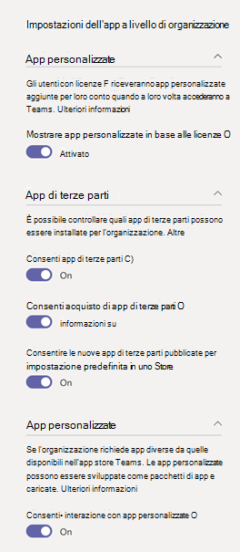

Gestire le app nell'interfaccia di amministrazione di Microsoft Teams
======================================================

Come amministratore, la pagina Gestisci app nell'interfaccia di amministrazione di Microsoft Teams consente di visualizzare e gestire tutte le app di Teams per l'organizzazione. Qui puoi visualizzare lo stato e le proprietà delle app a livello di organizzazione, approvare o caricare nuove app personalizzate nello store delle app della tua organizzazione, bloccare o consentire app a livello di organizzazione, aggiungere app ai team, acquistare servizi per app di terze parti, visualizzare le autorizzazioni richieste dalle app, concedere il consenso dell'amministratore alle app e gestire le impostazioni delle app a livello di organizzazione.

La pagina Gestisci app offre una visualizzazione di tutte le app disponibili e fornisce le informazioni necessarie per decidere quali app consentire o bloccare nell'intera organizzazione. È quindi possibile usare i criteri di autorizzazione per le [app,](teams-app-permission-policies.md)i criteri di configurazione delle [app,](teams-app-setup-policies.md)i criteri e le impostazioni delle [app](teams-custom-app-policies-and-settings.md) personalizzati per configurare l'esperienza dell'app per utenti specifici dell'organizzazione.

Nella barra di spostamento sinistra dell'interfaccia di amministrazione di Microsoft Teams, passa a **Gestisci app**  >  **di** Teams. È necessario essere un amministratore globale o un amministratore dei servizi di Teams per accedere alla pagina.

> [!NOTE]
> La pagina Gestisci app non è ancora disponibile nelle distribuzioni Di Microsoft 365 Government Community Cloud (GCC) di Teams.

## Visualizza app

È possibile visualizzare tutte le app, incluse le informazioni seguenti su ogni app.

- **Nome:** nome dell'app. Fare clic sul nome dell'app per passare alla pagina dei dettagli dell'app per visualizzare altre informazioni sull'app. Include una descrizione dell'app, che sia consentita o bloccata, versione, informativa sulla privacy, condizioni per l'utilizzo, categorie che si applicano all'app, stato della certificazione, funzionalità supportate e ID app. Ecco un esempio:

  
  
- **Certificazione:** se l'app ha ottenuto la certificazione, verrà visualizzata la certificazione **Microsoft 365** o **la certificazione di Publisher.** Fai clic sul collegamento per visualizzare i dettagli sulla certificazione per l'app. Se viene visualizzato " **--** ", non sono disponibili informazioni sulla certificazione per l'app. Per ulteriori informazioni sulle app certificate in Teams, leggi il programma di certificazione delle [app Microsoft 365.](https://docs.microsoft.com/teams-app-certification/all-apps)  
- **Publisher:** nome dell'autore.
- **Stato di pubblicazione:** stato di pubblicazione delle app personalizzate.
- **Stato:** stato dell'app a livello dell'organizzazione, che può essere uno dei seguenti:

    - **Consentito:** l'app è disponibile per tutti gli utenti dell'organizzazione.
    
    - **Bloccato:** l'app viene bloccata e non è disponibile per gli utenti dell'organizzazione.
    
    - **Organizzazione bloccata: l'app** è bloccata nelle impostazioni dell'app a livello di organizzazione.
    
      È importante sapere che questa colonna rappresenta lo stato consentito e bloccato delle app che in precedenza erano disponibili nel riquadro impostazioni a **livello di** organizzazione. Ora puoi visualizzare, bloccare e consentire le app a livello di organizzazione nella **pagina Gestisci app.** 
- **Licenze:** indica se un'app offre un abbonamento a Software as a Service (SaaS) per l'acquisto. Questa colonna si applica solo alle app di terze parti. Ogni app di terze parti avrà uno dei valori seguenti:
    - **Acquista ora:** l'app offre un abbonamento SaaS ed è disponibile per l'acquisto.  
    - **Acquistato:** l'app offre un abbonamento SaaS per cui sono state acquistate licenze.
    - **- :** l'app non offre un abbonamento SaaS.
- **App personalizzata:** indica se l'app è personalizzata.
- **Autorizzazioni:** indica se un'app di terze parti o personalizzata registrata in Azure Active Directory (Azure AD) ha autorizzazioni che necessitano del consenso. Verrà visualizzato uno dei valori seguenti:
    - **Visualizza dettagli:** l'app ha le autorizzazioni che richiedono il consenso prima che l'app possa accedere ai dati. 
    - **- :** l'app non ha le autorizzazioni necessarie per il consenso.
- **Categorie:** categorie che si applicano all'app.
- **Versione:** versione dell'app.

Per visualizzare le informazioni desiderate nella tabella, fare clic su Modifica colonna nell'angolo **in** alto a destra per aggiungere o rimuovere colonne dalla tabella.

## Pubblicare un'app personalizzata nell'App Store dell'organizzazione

Usare la pagina Gestisci app per pubblicare app create specificamente per l'organizzazione. Dopo aver pubblicato un'app personalizzata, questa sarà disponibile per gli utenti nello store delle app dell'organizzazione. Esistono due modi per pubblicare un'app personalizzata nell'app store dell'organizzazione. La modalità di utilizzo dipende da come si ottiene l'app.

- [Approvare un'app personalizzata:](#approve-a-custom-app)usare questo metodo se lo sviluppatore invia l'app direttamente alla pagina Gestisci app usando l'API di invio dell'app di Teams. È quindi possibile rivedere e pubblicare (o rifiutare) l'app direttamente dalla pagina dei dettagli dell'app.
- [Caricare un pacchetto dell'app:](#upload-an-app-package)usare questo metodo se lo sviluppatore invia il pacchetto dell'app in formato ZIP. Pubblicare l'app caricando il pacchetto dell'app.

###  Approvare un'app personalizzata

Il widget **Approvazioni in sospeso** nella pagina Gestisci app invia una notifica quando uno sviluppatore invia un'app usando l'API di invio dell'app di Teams. Viene elencata una nuova app inviata con lo **stato Pubblicazione** **inviata** e **Lo stato** **Bloccato.** Passare alla pagina dei dettagli dell'app per visualizzare altre informazioni sull'app e quindi, per pubblicarla, impostare **Lo stato** di pubblicazione su **Pubblica.**

Si viene avvisati anche quando uno sviluppatore invia un aggiornamento a un'app personalizzata. È quindi possibile rivedere e pubblicare (o rifiutare) l'aggiornamento nella pagina dei dettagli dell'app. Tutti i criteri di autorizzazione e di configurazione delle app rimangono applicati all'app aggiornata.

Per altre informazioni, vedere [Pubblicare un'app personalizzata inviata tramite l'API di](submit-approve-custom-apps.md)invio delle app di Teams.

### Caricare un pacchetto dell'app

Lo sviluppatore crea un pacchetto dell'app [Teams usando Teams App Studio](https://docs.microsoft.com/microsoftteams/platform/get-started/get-started-app-studio)e quindi lo invia all'utente in formato ZIP. Quando si ha il pacchetto dell'app, è possibile caricarlo nell'app store dell'organizzazione.

Per caricare una nuova app personalizzata, selezionare **Carica per** caricare il pacchetto dell'app. L'app non viene evidenziata dopo il caricamento, quindi è necessario eseguire una ricerca nell'elenco di app nella pagina Gestisci app per trovarla.

Per aggiornare un'app dopo il caricamento, nell'elenco delle app nella pagina Gestisci app fare clic sul nome dell'app e quindi su **Aggiorna.** In questo modo vengono sostituiti l'app esistente e tutti i criteri di autorizzazione e configurazione delle app rimangono applicati all'app aggiornata.

Per altre informazioni, vedere [Pubblicare un'app personalizzata caricando un pacchetto dell'app.](upload-custom-apps.md)

## Consentire e bloccare le app

La pagina Gestisci app consente di consentire o bloccare singole app a livello di organizzazione. Mostra tutte le app disponibili e il relativo stato corrente a livello di organizzazione. Il blocco e l'autorizzazione delle app a livello di organizzazione sono stati spostati dal riquadro impostazioni **dell'app** a livello di organizzazione a questa pagina.

Per consentire o bloccare un'app, selezionarla e quindi fare **clic** su Consenti o **Blocca.** Quando si blocca un'app, tutte le interazioni con tale app vengono disabilitate e l'app non viene visualizzata in Teams per gli utenti dell'organizzazione.

Quando si blocca o si consente un'app nella pagina Gestisci app, l'app viene bloccata o consentita a tutti gli utenti dell'organizzazione.  Quando si blocca o si consente un'app in un criterio di autorizzazione dell'app Teams, questa viene bloccata o consentita agli utenti a cui è assegnato tale criterio. Per consentire a un utente di installare e interagire con qualsiasi app, è necessario consentire l'app a livello dell'organizzazione nella pagina Gestisci app e nei criteri di autorizzazione per le app assegnati all'utente.

 > [!NOTE]
 > Per disinstallare un'app, fare clic con il pulsante destro del mouse sull'app e quindi scegliere **Disinstalla** o usare il **menu** Altre app a sinistra.

## Aggiungere un'app a un team

Usare il **pulsante Aggiungi al team** per installare un'app in un team. Tenere presente che questa opzione è disponibile solo per le app che possono essere installate in un ambito del team. Il **pulsante Aggiungi al team** non è disponibile per le app che possono essere installate solo nell'ambito personale.

1. Cercare l'app desiderata e quindi selezionarla facendo clic a sinistra del nome dell'app.
2. Selezionare **Aggiungi al team.**
3. Nel riquadro **Aggiungi al team** cerca il team a cui vuoi aggiungere l'app, seleziona il team e quindi scegli **Applica.**

## Acquistare servizi per app di terze parti

È possibile cercare e acquistare licenze per i servizi offerti da app di terze parti per gli utenti dell'organizzazione direttamente dalla pagina Gestisci app. La **colonna** Licenze nella tabella indica se un'app offre un abbonamento SaaS a pagamento. Fare **clic su Acquista ora** per visualizzare informazioni sui piani e sui prezzi e acquistare licenze per gli utenti. Per altre informazioni, vedere [Acquisto di servizi per app di terze parti teams nell'interfaccia di amministrazione di Microsoft Teams.](purchase-third-party-apps.md)

## Concedere il consenso dell'amministratore alle app

È possibile controllare e concedere il consenso alle app che richiedono autorizzazioni per conto di tutti gli utenti dell'organizzazione. In questo modo gli utenti non devono rivedere e accettare le autorizzazioni richieste dall'app quando avviano l'app. La **colonna Autorizzazioni** indica se un'app ha autorizzazioni che devono avere il consenso. Verrà visualizzato un collegamento Visualizza **dettagli per** ogni app registrata in Azure AD che ha autorizzazioni che necessitano del consenso. Per altre informazioni, vedere Visualizzare [le autorizzazioni per le app e concedere il consenso dell'amministratore nell'interfaccia di amministrazione di Microsoft Teams.](app-permissions-admin-center.md)

## Visualizzare autorizzazioni di consenso specifiche per le risorse

Le autorizzazioni di consenso specifico delle risorse (RSC) consentono ai proprietari del team di concedere il consenso per un'app per accedere ai dati di un team e modificarli. Le autorizzazioni RSC sono autorizzazioni granulari e specifiche di Teams che definiscono le attività che un'app può eseguire in un team specifico. È possibile visualizzare le autorizzazioni RSC nella **scheda Autorizzazioni** della pagina dei dettagli dell'app per un'app. Per altre informazioni, vedere Visualizzare [le autorizzazioni per le app e concedere il consenso dell'amministratore nell'interfaccia di amministrazione di Microsoft Teams.](app-permissions-admin-center.md)

## Gestire le impostazioni dell'app a livello di organizzazione

Usare le impostazioni dell'app a livello di organizzazione per controllare se gli utenti possono installare app di terze parti e se gli utenti possono caricare o interagire con app personalizzate nell'organizzazione. Le impostazioni app a livello di organizzazione disciplinano il comportamento di tutti gli utenti e sostituiscono qualsiasi criterio di autorizzazione app assegnato agli utenti. È possibile usarle per controllare eventuali app dannose o problematiche.

> [!NOTE]
> Per informazioni su come usare le impostazioni delle app a livello di organizzazione in Microsoft 365 Government - Distribuzioni GCC di Teams, vedi Gestire i criteri di autorizzazione delle [app in Teams.](teams-app-permission-policies.md)

1. Nella pagina Gestisci app seleziona Impostazioni **app a livello di organizzazione.** È possibile quindi configurare le impostazioni desiderate nel pannello.

    
    
2. In **App di terze parti**, disattivare o attivare queste impostazioni per controllare l'accesso alle app di terze parti:

    - **Consenti app di terze parti**: questa impostazione controlla se gli utenti possono usare app di terze parti. Se dis disattiva questa impostazione, gli utenti non potranno installare o usare app di terze parti  e lo stato dell'app di queste app verrà visualizzato nella tabella come app bloccata a livello di organizzazione.

        > [!NOTE]
        > Quando **l'opzione Consenti app** di terze parti è disattivata, gli [webhook](https://docs.microsoft.com/microsoftteams/platform/webhooks-and-connectors/what-are-webhooks-and-connectors) in uscita sono disabilitati, il che significa che gli utenti non possono crearle. Quando questa impostazione è attivata, gli webhook in uscita sono abilitati per tutti gli utenti ed è possibile controllarli a livello di utente, consentendo o bloccando l'app Webhook in uscita tramite i criteri di autorizzazione per le [app.](teams-app-permission-policies.md)   Se sono stati applicati criteri di autorizzazione per  le [app](teams-app-permission-policies.md) **Microsoft** che usano l'impostazione Consenti app specifiche e bloccano tutte le altre e si vogliono abilitare gli webhook in uscita per gli utenti, aggiungere l'app Webhook in uscita all'elenco.
    - **Consenti qualsiasi nuova app di terze parti pubblicata nello Store per impostazione predefinita**: questa impostazione consente di controllare se eventuali nuove app di terze parti pubblicate nello Store di Teams diventano disponibili automaticamente in Teams. È possibile impostare questa opzione solo se si consentono le app di terze parti.

3. In **App personalizzate** disattivare o attivare Consenti interazione con le app **personalizzate.** Questa impostazione controlla se gli utenti possono interagire con le app personalizzate. Per altre informazioni, vedere [Gestisci criteri e impostazioni app personalizzate in Teams](teams-custom-app-policies-and-settings.md).
4. Fare clic su **Salva** per fare in modo che le impostazioni app a livello di organizzazione abbiano effetto.

## Argomenti correlati

- [Impostazioni di amministrazione per le app in Teams](admin-settings.md)