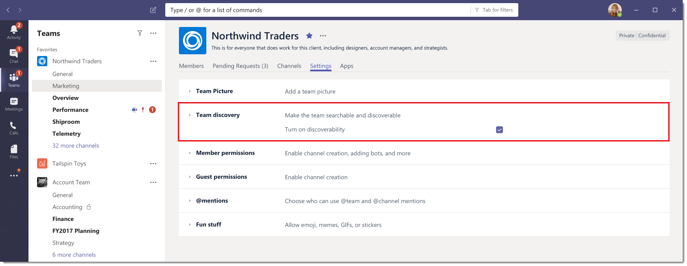

# <a name="manage-discovery-of-private-teams-in-microsoft-teams"></a>Gestire l'individuazione di team privati in Microsoft Teams

[!INCLUDE [preview-feature](includes/preview-feature.md)]

Gli amministratori e i proprietari del team possono controllare se i team privati possono essere scoperti dagli utenti di Microsoft teams nell'organizzazione. Quando un team privato è individuabile, viene visualizzato nei risultati della ricerca ed è incluso nei suggerimenti della raccolta team insieme ai team pubblici in teams. In questo modo è facile per gli utenti cercare e trovare i team privati a cui vogliono partecipare. Gli utenti possono richiedere di partecipare a un team privato e un proprietario del team può quindi approvare o rifiutare la richiesta.

## <a name="overview-of-public-teams-private-teams-and-discovery-in-teams"></a>Panoramica di Team pubblici, team privati e individuazione in teams

La maggior parte delle organizzazioni ha i seguenti tipi di Team: team pubblici, team privati individuabili e team privati non individuabili.


### <a name="public-teams"></a>Team pubblici

I team pubblici sono disponibili per tutti gli utenti dell'organizzazione a cui partecipare. I team pubblici sono visibili a tutti i membri della raccolta teams e gli utenti possono partecipare a un team pubblico senza dover ottenere l'approvazione del proprietario del team. Gli esempi di Team pubblici includono un team per discutere notizie tecnologiche, un team per ottenere feedback per i tuoi prodotti e un team per consentire alle persone di carpooling di lavorare.

### <a name="discoverable-private-teams"></a>Team privati individuabili

I team privati individuabili possono essere Uniti solo quando il proprietario del team aggiunge gli utenti. Quando rendi un team privato individuabile, il team è incluso nell'elenco dei team suggeriti e dei risultati della ricerca nella raccolta teams. USA teams privati individuabili per progetti e gruppi dell'organizzazione che tutti siano a conoscenza e dove sia necessario controllare l'accesso alle conversazioni e ai file del team. Gli esempi includono un team per il reparto HR, un team per tutti i responsabili dell'organizzazione e un team per un Manager e i relativi report diretti.

### <a name="non-discoverable-private-teams"></a>Team privati non individuabili

I team privati non individuabili possono essere Uniti solo quando il proprietario del team aggiunge gli utenti. Quando rendi un team privato non individuabile, è nascosto dall'elenco dei team suggeriti e rimosso dai risultati della ricerca nella raccolta teams. USA team non individuabili per collaborare a argomenti sensibili e altamente riservati. Gli esempi includono un team per discutere di un'acquisizione imminente e di un team per discutere un cambiamento nella direzione strategica dell'organizzazione.

## <a name="set-whether-new-private-teams-are-discoverable"></a>Impostare se i nuovi team privati sono individuabili

Quando un proprietario del team crea un team privato, può scegliere di renderlo individuabile configurando l'impostazione di individuazione del team. Per impostazione predefinita, i nuovi team privati sono ricercabili e individuabili. Se il proprietario del team non vuole che il team privato venga visualizzato nei risultati della ricerca e nei suggerimenti, il proprietario può disattivare l'impostazione selezionando **Modifica impostazione** accanto a **questo team è possibile eseguire la ricerca e**l'individuazione.


## <a name="set-whether-existing-private-teams-are-discoverable"></a>Impostare se i team privati esistenti sono individuabili

I proprietari del team possono impostare l'impostazione di individuazione per un team privato esistente direttamente nelle impostazioni del team e gli amministratori possono farlo usando PowerShell.

### <a name="in-team-settings"></a>Nelle impostazioni del team

In teams, vai al team privato, fai clic su **altre opzioni** > **Gestisci team**. Nella scheda **Impostazioni** espandere **individuazione team**e quindi deselezionare o selezionare la casella di controllo **attiva individuabilità** .



### <a name="using-powershell"></a>Utilizzo di PowerShell

Utilizzare il cmdlet **[set-team](https://docs.microsoft.com/powershell/module/teams/set-team?view=teams-ps)** per disattivare o attivare l'impostazione di individuazione per un team privato esistente. Ecco un esempio di come rendere individuabile un team:
```PowerShell
    Set-Team -GroupId 0abc123d-e4f5-67gh-i890-jk1m2n345o6p -ShowInTeamsSearchAndSuggestions $true
```
Puoi usare questo cmdlet in uno script per impostare l'impostazione di individuazione dei team privati esistenti in blocco.

## <a name="set-whether-users-can-discover-private-teams"></a>Impostare se gli utenti possono trovare team privati

Come amministratore, puoi anche controllare gli utenti dell'organizzazione che possono scoprire team privati nei risultati della ricerca e nei suggerimenti in teams. Creare un criterio usando il cmdlet **[New-CsTeamsChannelsPolicy](https://docs.microsoft.com/powershell/module/skype/new-csteamschannelspolicy?view=skype-ps)** e quindi assegnare i criteri agli utenti.
 
Imposta il parametro **AllowPrivateTeamDiscovery** su **true** per consentire agli utenti a cui viene assegnato il criterio di visualizzare team privati individuabili nei risultati della ricerca e nei suggerimenti. L'impostazione del parametro **AllowPrivateTeamDiscovery** su **false** consente di rimuovere tutti i team privati individuabili dai risultati della ricerca e dai suggerimenti per gli utenti a cui è stato assegnato il criterio.

Per impostazione predefinita, **AllowPrivateTeamDiscovery** è impostato su **true** per tutti gli utenti di un'organizzazione.

In questo esempio creiamo un criterio denominato VendorPolicy che impedisce agli utenti di individuare eventuali team privati resi individuabili e quindi assegniamo i criteri a un utente denominato vendoruser1.
```PowerShell
     New-CsTeamsChannelsPolicy -Identity VendorPolicy -AllowPrivateTeamDiscovery $false
     Grant-CsTeamsChannelsPolicy -Identity vendoruser1@company.com -PolicyName VendorPolicy
```

> [!NOTE]
> I team privati non individuabili non vengono mai visualizzati nei risultati della ricerca e nei suggerimenti, indipendentemente dall'impostazione dei criteri. Ad esempio, se disattivi l'impostazione di individuazione per un team privato, gli utenti non riescono a individuare il team, anche se il parametro **AllowPrivateTeamDiscovery** è impostato su **true** nell'impostazione dei criteri per tali utenti.

## <a name="related-topics"></a>Argomenti correlati
- [Panoramica di PowerShell Teams](teams-powershell-overview.md)
