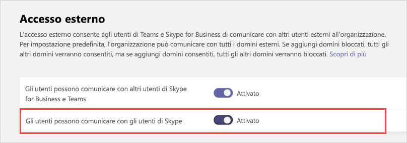

# Gestire l'accesso esterno in Microsoft Teams

L'accesso esterno consente agli utenti di Teams appartenenti a un intero dominio esterno di trovare, contattare, chattare e configurare riunioni con la propria organizzazione in Teams. Si può usare l'accesso esterno anche per comunicare con utenti di altre organizzazioni che usano ancora Skype for Business (online o locale) e Skype (in anteprima).

Se si vuole consentire a utenti di altre organizzazioni di accedere a team e canali, l'accesso guest potrebbe essere un'opzione migliore. Per altre informazioni sulle differenze tra accesso esterno e accesso guest, vedere [Confrontare l'accesso esterno e guest](communicate-with-users-from-other-organizations.md#compare-external-and-guest-access). 

Usare l'accesso esterno quando:
  
- Si hanno utenti in differenti domini che necessitano di collaborare. Ad esempio, Rob@contoso.com e Ann@northwindtraders.com stanno lavorando ad un progetto insieme ad altri nei domini contoso.com e northwindtraders.com.

- Si vuole che gli utenti dell'organizzazione usino Teams per contattare persone in specifiche aziende esterne all'organizzazione.

- Si vuole poter essere trovati e contattati da qualsiasi altro utente di Teams al mondo tramite il proprio indirizzo di posta elettronica. 

> [!IMPORTANT]
> Per usare il client Teams per comunicare con un utente esterno (indipendentemente dal fatto che tale utente usi Teams o Skype for Business), l'utente di Teams deve trovarsi in Skype for Business Online.

## Pianificare l'accesso esterno

L'accesso esterno è attivato per impostazione predefinita in Teams, quindi l'organizzazione può comunicare con tutti i domini esterni. Se si aggiungono domini bloccati, verranno consentiti tutti gli altri domini. Se si aggiungono domini consentiti, tutti gli altri domini verranno bloccati. L'eccezione a questa regola è se alle riunioni sono consentiti partecipanti anonimi. Gli scenari per configurare l'accesso esterno nell'interfaccia di amministrazione di Teams (**Impostazioni organizzazione** > **Accesso esterno**) sono tre:

> [!NOTE]
> Gli utenti Teams possono aggiungere app quando tengono riunioni o chat con persone di altre organizzazioni. Possono inoltre usare app condivise da componenti di altre organizzazioni quando prendono parte a riunioni o chat tenute da quelle organizzazioni. Si applicano i criteri sui dati dell’organizzazione dell’utente ospitante, così come le pratiche di condivisione dei dati di tutte le app di terze parti condivise da quell’organizzazione.

> [!NOTE]
> Se si disattiva l'accesso esterno nell'organizzazione, gli utenti esterni possono comunque partecipare alle riunioni mediante la partecipazione anonima. Per altre informazioni, vedere [Gestire le impostazioni di riunione in Teams](./meeting-settings-in-teams.md).

- **Federazione aperta**: questa è l'impostazione predefinita in Teams e consente agli utenti dell'organizzazione di trovare, eseguire chiamate, chattare e configurare riunioni con persone esterne all'organizzazione in qualsiasi dominio.

    In questo scenario, gli utenti possono comunicare con tutti i domini esterni che eseguono Teams o Skype for Business E usano la federazione aperta OPPURE hanno aggiunto il dominio al proprio elenco dei consentiti.

- **Consentire domini specifici**: aggiungendo domini a un elenco di **consentiti** è possibile limitare l'accesso esterno solo ai domini consentiti. Dopo aver configurato un elenco di domini consentiti, tutti gli altri domini verranno bloccati. Per consentire domini specifici, fare clic su **Aggiungi un dominio**, aggiungere il nome di dominio, fare clic su **Azione da eseguire sul dominio** e quindi selezionare **Consentito**.

- **Bloccare domini specifici**: l'aggiunta di domini a un elenco di **blocco** è possibile comunicare con tutti i domini esterni *tranne* quelli bloccati. Per bloccare domini specifici, fare clic su **Aggiungi un dominio**, aggiungere il nome di dominio, fare clic su **Azione da eseguire sul dominio** e quindi selezionare **Bloccato**. Dopo aver configurato un elenco di domini bloccati, tutti gli altri domini verranno consentiti.

> [!NOTE]
> I domini consentiti o bloccati si applicano alle riunioni solo se l'accesso anonimo alle riunioni è disattivato.

## Consentire o bloccare domini

### Passaggio 1 - Abilitare l'organizzazione alle comunicazioni con altre organizzazioni di Teams o Skype for Business

 **Uso dell'interfaccia di amministrazione di Microsoft Teams**

1. Nel riquadro di spostamento sinistro passare a **Impostazioni organizzazione** > **Accesso esterno**.

2. Attivare l'impostazione **Gli utenti possono comunicare con altri utenti di Skype for Business e Teams**.

     .

3. Se si vuole consentire a tutte le organizzazioni di Teams di comunicare con gli utenti della propria, andare al passaggio 5.

4. Se si vogliono limitare le organizzazioni che possono comunicare con gli utenti della propria organizzazione, è possibile consentire tutti i domini ad eccezione di alcuni oppure consentire solo domini specifici. 

    - Per consentire tutti i domini tranne alcuni, aggiungere i domini da bloccare facendo clic su **Aggiungi dominio**. Nel riquadro **Aggiungi un dominio** digitare il nome del dominio, fare clic su **Bloccato** e quindi fare clic su **Fatto**. 
    - Per limitare le comunicazioni a organizzazioni specifiche, aggiungere tali domini all'elenco con lo stato **Consentito**. Dopo avere aggiunto un dominio all'elenco dei consentiti, le comunicazioni con altre organizzazioni saranno limitate alle sole organizzazioni i cui domini sono presenti nell'elenco. 

5. Fare clic su **Salva**.

6. Assicurarsi che l'amministratore dell'altra organizzazione di Teams completi gli stessi passaggi. Ad esempio, se l'altro amministratore limita le organizzazioni con cui la sua azienda può comunicare, occorre essere inseriti nel suo elenco dei **domini consentiti**.

### Passaggio 2 - Test

Per testare la configurazione è necessario un utente di Teams che non si trova dietro il proprio firewall aziendale.
  
1. Una volta configurate le impostazioni di **Accesso esterno** in entrambe le organizzazioni, si può procedere.

2. Nell'app Teams cercare l'utente per indirizzo di posta elettronica e inviare una richiesta di chat.

3. Chiedere al contatto di Teams di inviare una richiesta di chat. Se non si riceve la richiesta, il problema sono le impostazioni del firewall, supponendo di aver già verificato che le impostazioni firewall dell'altra organizzazione siano corrette.

4. Un altro modo per verificare se il problema è il firewall consiste nel recarsi in una posizione Wi-Fi non dietro il firewall, ad esempio una caffetteria, e usare Teams per inviare una richiesta di chat al contatto. Se il messaggio viene recapitato nella posizione Wi-Fi, ma non in ufficio, il problema è sicuramente il firewall aziendale.

> [!NOTE]
> Se due organizzazioni attivano l'accesso esterno e consentono i rispettivi domini, tutto funzionerà. In caso contrario, occorre verificare che una delle due configurazioni non stia bloccando l'altro dominio.

## Comunicare con gli utenti di Skype (in anteprima)

Seguire questa procedura per consentire agli utenti di Teams nell'organizzazione di comunicare con gli utenti Skype e di chiamarli. Gli utenti di Teams potranno cercare utenti di Skype e avviare una conversazione a due di solo testo oppure una chiamata audio/video e viceversa.

 **Uso dell'interfaccia di amministrazione di Microsoft Teams**

1. Nel riquadro di spostamento sinistro passare a **Impostazioni organizzazione** > **Accesso esterno**.

2. Attivare l'impostazione **Gli utenti possono comunicare con gli utenti Skype**.

    .

Per altre informazioni sui modi in cui gli utenti di Teams e gli utenti di Skype possono comunicare, incluse le limitazioni applicabili, vedere [Interoperabilità tra Teams e Skype](teams-skype-interop.md).

## Scenari comuni di accesso esterno

Le sezioni seguenti descrivono come abilitare la federazione per gli scenari di accesso esterno comuni e in che modo il criterio TeamsUpgradePolicy determina il recapito delle chat e delle chiamate in arrivo.

### Abilitare la federazione

Per consentire agli utenti dell'organizzazione di comunicare con gli utenti di un'altra organizzazione, entrambe le organizzazioni devono abilitare la federazione. I passaggi per abilitare la federazione per una determinata organizzazione variano a seconda che l'organizzazione sia solo online, ibrida o solo locale.

| Se la propria organizzazione lo è | Abilitare la federazione come segue |
|:---------|:-----------------------|
|Online senza Skype for Business locale. Sono incluse le organizzazioni che hanno utenti TeamsOnly e/o di Skype for Business Online.| Se si usa l'interfaccia di amministrazione di Teams:  - Verificare che l'impostazione **Gli utenti possono comunicare con altri utenti di Skype for Business e Teams** in Accesso esterno sia abilitata. - Se non si usa la federazione aperta, che consente la federazione con qualsiasi altro dominio, aggiungere il dominio esterno all'elenco dei domini consentiti.  Se si usa PowerShell: - Verificare che il tenant sia abilitato per la federazione: `Get-CsTenantFederationConfiguration` deve mostrare `AllowFederatedUsers=true`.  - Verificare che il valore effettivo dell'utente per `CsExternalAccessPolicy` sia `EnableFederationAccess=true`. - Se non si usa la federazione aperta, verificare che il dominio di destinazione sia elencato in `AllowedDomains` di `CsTenantFederationConfiguration`. |
|Solo locale | Negli strumenti locali:  - Verificare che la federazione sia abilitata in `CsAccessEdgeConfiguration`. - Verificare che la federazione per l'utente sia abilitata tramite `ExternalAccessPolicy`, mediante criteri globali, criteri del sito o criteri assegnati dall'utente.   - Se non si usa la federazione aperta, verificare che il dominio di destinazione sia elencato in `AllowedDomains`. |
|Ibrida con alcuni utenti online (in Skype for Business o Teams) e alcuni utenti in locale. | Seguire i passaggi precedenti per le organizzazioni online e locali. |

### Recapito di chat e chiamate in entrata 

Le chat e le chiamate in entrata da un'organizzazione della federazione saranno recapitate nel client Teams o Skype for Business dell'utente in base alla modalità dell'utente destinatario in TeamsUpgradePolicy.

| Se si desidera questo | Procedere come segue: |
|:---------|:-----------------------|
| Assicurarsi che le chat e le chiamate federate in entrata arrivino al client Teams dell'utente: | Configurare gli utenti come TeamsOnly.
| Assicurarsi che le chat e le chiamate federate in entrata arrivino al client Skype for Business dell'utente | Configurare gli utenti in modo che siano in qualsiasi modalità tranne TeamsOnly. |

### Abilitare la federazione tra gli utenti dell'organizzazione e gli utenti consumer di Skype

Per abilitare la federazione tra gli utenti dell'organizzazione e gli utenti consumer di Skype:

| Se la propria organizzazione lo è | Abilitare la federazione utente come segue |
|:---------|:-----------------------|
| Solo online senza Skype for Business locale.  Sono incluse le organizzazioni che hanno utenti TeamsOnly e/o di Skype for Business Online. | Se si usa l'interfaccia di amministrazione di Teams:  - Verificare che l'impostazione **Gli utenti possono comunicare con gli utenti Skype** sia abilitata in Accesso esterno.  Se si usa PowerShell:  - Verificare che il tenant sia abilitato per la federazione: `Get-CsTenantFederationConfiguration` deve mostrare `AllowPublicUsers=true`.   - Verificare che il valore effettivo dell'utente per `CsExternalAccessPolicy` sia `EnablePublicCloudAccess=true`. |
| Solo locale | Negli strumenti locali:   - Verificare che Skype sia abilitato come partner federato.   - Verificare che sia impostato `EnablePublicCloudAccess=true` per l'utente tramite `ExternalAccessPolicy`, mediante criteri globali, criteri del sito o criteri assegnati dall'utente.|
| Ibrida con alcuni utenti online (in Skype for Business o Teams) e alcuni utenti in locale.| Seguire i passaggi precedenti per le organizzazioni online e locali.

> [!IMPORTANT]
> Non è necessario aggiungere **domini Skype** come domini consentiti per permettere agli utenti di Teams o Skype for Business Online di comunicare gli utenti di Skype all'interno o all'esterno dell'organizzazione. Tutti i **domini Skype** sono consentiti.

## Cosa distingue l'accesso esterno dall'accesso guest?

Per informazioni sulla differenza tra accesso esterno e accesso guest, vedere [Comunicare con utenti di altre organizzazioni](communicate-with-users-from-other-organizations.md).

## Argomenti correlati

- [Esperienza di chat nativa per utenti esterni (federati)](native-chat-for-external-users.md)
