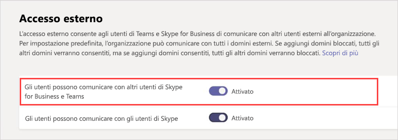

Gestire l'accesso esterno in Microsoft Teams
======================================================

Con l'accesso esterno di Microsoft teams, gli utenti di teams di altri domini possono partecipare alle chat e alle chiamate. È anche possibile consentire ad altri utenti esterni che usano ancora Skype for business online, Skype for business on-Prem o anche Skype di partecipare.

Usare l'accesso esterno quando:
  
- Si hanno utenti in domini diversi nell'azienda: ad esempio Rob@contoso.com e Ann@northwindtraders.com.

- Si vuole che gli utenti dell'organizzazione usino i team per contattare persone di aziende specifiche all'esterno dell'organizzazione.

- Si vuole che chiunque altro al mondo usi i team per poter trovare e contattare l'utente, usando l'indirizzo di posta elettronica. Se tu e un altro utente sia abilitare l'accesso esterno e consentire i domini di ogni altro, questo funzionerà. Se non funziona, l'altro utente deve verificare che la configurazione in uso non blocchi il dominio.

L'accesso esterno consente agli utenti esterni di trovare, chiamare e inviare messaggi istantanei, nonché di configurare riunioni con l'utente. Tuttavia, se si vuole che gli utenti esterni abbiano accesso a team e canali, l'accesso guest potrebbe essere un modo migliore per spostarsi. Per altre informazioni sulle differenze tra l'accesso esterno e l'accesso guest, vedere accesso esterno e Access [Guest](#external-access-vs-guest-access)), di seguito. Per attivare l'accesso guest, vedere [attivare l'accesso guest in](set-up-guests.md) modo che gli utenti possano comunicare.

> [!IMPORTANT]
> Attualmente, per federare all'interno dell'app Microsoft Teams a un utente esterno all'esterno dell'organizzazione che non è attualmente Guest di Azure Active Directory (Azure AD) o tenant, è necessario essere configurati correttamente per Hybrid e spostati in Skype for business online. A partire da 2/25/2019, teams non supporta la Federazione nativa senza che l'utente del profilo SIP venga ospitato in Skype for business online. Per altre informazioni su come configurare l'account per Hybrid e quindi passare a teams, vedere [aggiornare la distribuzione ibrida di Skype for business ai team](https://docs.microsoft.com/en-us/microsoftteams/upgrade-to-teams-execute-skypeforbusinesshybrid).

> [!IMPORTANT]
> Gli utenti Guest seguono le impostazioni a livello di organizzazione per la modalità di coesistenza. Non è possibile modificarlo.

## Access esterno e accesso Guest

L'accesso esterno (Federazione) e l'accesso Guest sono diversi:

- L'accesso Guest offre l'autorizzazione di accesso a un utente. L'accesso esterno consente l'autorizzazione di accesso a un intero dominio.

- L'accesso guest, una volta concesso da un proprietario del team, consente a un guest di [accedere a risorse](guest-experience.md), ad esempio discussioni e file di canale, per un team specifico e chattare con altri utenti del team a cui sono stati invitati. Con l'accesso esterno (chat federata) i partecipanti alla chat esterna non hanno accesso ai team o alle risorse del team dell'organizzazione che l'invitano. Possono partecipare solo a una chat federata uno-a-uno. Gli amministratori del tenant possono scegliere tra le due opzioni di comunicazione a seconda del livello di collaborazione desiderato per l'entità esterna. Gli amministratori possono scegliere approcci o entrambi, in base alle proprie esigenze organizzative, ma è consigliabile abilitare l'accesso guest per un'esperienza di team più completa e collaborativa. 

Vedere la tabella seguente per un confronto tra le caratteristiche di accesso esterno e Guest.

| Funzionalità | Utenti di Access esterni | Utenti di Access Guest |
|---------|-----------------------|--------------------|
| L'utente può chattare con qualcuno in un'altra società | Sì |Supporto per più paesi |
| L'utente può chiamare qualcuno in un'altra società | Sì | Supporto per più paesi |
| L'utente può vedere se qualcuno di un'altra società è disponibile per la chiamata o la chat | Sì | Sì1 |
| L'utente può cercare gli utenti in tenant esterni | Sì2 | No |
| L'utente può condividere file | No | Sì |
| L'utente può accedere alle risorse Teams | No | Sì |
| L'utente può essere aggiunto a una chat di gruppo | No | Sì |
| L'utente può essere aggiunto a una riunione | Sì | Supporto per più paesi |
| Altri utenti possono essere aggiunti a una chat con un utente esterno | N.3 | N/D |
| L'utente viene identificato come parte esterna | Sì | Supporto per più paesi |
| Visualizzazione della presenza | Sì | Supporto per più paesi |
| Viene visualizzato il messaggio fuori sede | No | Sì |
| Singoli utenti possono essere bloccati | No | No |
| @mentions supportate | No | Sì |
| Effettuare chiamate private | Sì | Supporto per più paesi |
| Consenti video IP | Sì | Supporto per più paesi |
| Modalità di condivisione dello schermo | No | Sì |
| Consenti riunione ora | No | Sì |
| Modificare i messaggi inviati | No | Sì |
| Può eliminare i messaggi inviati | No | Sì |
| Usare Giphy in una conversazione | No | Sì |
| Usare memi in una conversazione | No | Sì |
| Usare gli adesivi nella conversazione | No | Sì |
||||

1 a condizione che l'utente sia stato aggiunto come guest ed abbia effettuato l'accesso come Guest al tenant Guest. 
2 solo tramite posta elettronica o indirizzo SIP (Session Initiation Protocol). 
3 la chat esterna (federata) è solo 1:1.

Per altre informazioni sulle caratteristiche Guest e sull'esperienza Guest, vedere [attivare o disattivare l'accesso Guest a Microsoft teams](https://docs.microsoft.com/microsoftteams/set-up-guests) e [come è l'esperienza Guest](https://docs.microsoft.com/microsoftteams/guest-experience).

Per altre informazioni sulla versione gratuita di teams e su come funziona con le funzionalità disponibili in Access esterno, vedere [differenze tra Microsoft teams e Microsoft teams Free](https://support.office.com/article/differences-between-microsoft-teams-and-microsoft-teams-free-0b69cf39-eb52-49af-b255-60d46fdf8a9c?ui=en-US&rs=en-US&ad=US).

## Passaggi veloci per gli scenari

|**Si vuole....**  |**Passaggi rapidi**  |
|---------|-----------------------|
|Si vuole consentire **agli utenti del team** dell'organizzazione di comunicare con **gli utenti di Team** in un'altra organizzazione (esterna).|In accesso esterno aggiungere il dominio esterno all'elenco consentiti o usare la Federazione aperta. 
Fare in modo che l'amministratore dell'organizzazione di altri team faccia la stessa cosa.      |
|Si vuole consentire agli **utenti del team** dell'organizzazione di comunicare con **gli utenti di Skype for business online** nella stessa organizzazione.  |Abilitare la modalità di coesistenza o scegliere la modalità di aggiornamento delle isole per supportare gli utenti di Skype for business nell'organizzazione.   |
|Si vuole consentire agli **utenti del team** dell'organizzazione di comunicare con **gli utenti di Skype for business online** in un'altra organizzazione (esterna).      |In accesso esterno aggiungere il dominio esterno all'elenco consentiti o usare la Federazione aperta.  
Attivare **gli utenti possono comunicare con l'impostazione utenti Skype for business e teams** in Access esterno. 
Fare in modo che l'amministratore dell'organizzazione di altri team faccia la stessa cosa. 
**Nota**: il dominio esterno con gli utenti di Skype for business deve abilitare la modalità di coesistenza o scegliere la modalità di aggiornamento delle isole per supportare gli utenti di Skype for business nell'organizzazione.|
|Si vuole consentire **agli utenti del team** dell'organizzazione di comunicare con utenti **Skype** dall'interno o dall'esterno dell'organizzazione.   | Non è uno scenario supportato in questo momento. 
**Importante**: gli utenti del team non saranno in grado di comunicare con gli utenti Skype, ma gli utenti di Skype for business nell'organizzazione possono comunicare con utenti Skype all'interno o all'esterno dell'organizzazione se questi due requisiti sono soddisfatti: 
1) attivare **gli utenti possono comunicare con Skype for business e** gli utenti di teams e **gli utenti di Skype for business possono comunicare con le impostazioni degli utenti Skype** in Access esterno. 
 2) l'organizzazione viene eseguita in modalità di coesistenza. |
|Si vuole consentire **agli** utenti del team di comunicare con **gli utenti di Skype for business online** da un'organizzazione locale e con **utenti Skype**.   |In accesso esterno aggiungere il dominio esterno all'elenco consentiti o usare la Federazione aperta. . 
Attivare **gli utenti possono comunicare con l'impostazione utenti Skype for business e teams** in Access esterno. 
Attivare **gli utenti di Skype for business in grado di comunicare con l'impostazione utenti Skype** in Access esterno. 
 Fare in modo che l'amministratore nell'organizzazione locale faccia la stessa cosa.
**Importante** In questo scenario, gli utenti del team non saranno in grado di comunicare con gli utenti Skype, ma gli utenti di Skype for business nell'organizzazione possono comunicare con utenti Skype all'interno o all'esterno dell'organizzazione se si attivano **gli utenti in grado di comunicare con Skype for business e** gli utenti di teams e **Skype for business possono comunicare con le impostazioni degli utenti Skype** in Access esterno.|
|Si vuole consentire **agli utenti di Skype for business online** di comunicare con **gli utenti di Team** in un'altra organizzazione di Office 365.|Abilitare la modalità di coesistenza o scegliere la modalità di aggiornamento delle isole per supportare gli utenti di Skype for business nell'organizzazione. 
In accesso esterno aggiungere il dominio esterno all'elenco consentiti o usare la Federazione aperta.  
 Attivare **gli utenti possono comunicare con l'impostazione utenti Skype for business e teams** in Access esterno. 
Quindi, l'amministratore dell'organizzazione di altri team esegue le stesse operazioni. |
|Si vuole consentire **agli utenti di Skype for business online** di comunicare con gli **utenti di Skype for business online** da un'altra organizzazione di Office 365.    | Abilitare la modalità di coesistenza o scegliere la modalità di aggiornamento delle isole per supportare gli utenti di Skype for business nell'organizzazione. 
In accesso esterno aggiungere il dominio esterno all'elenco consentiti o usare la Federazione aperta. 
 Attivare **gli utenti possono comunicare con l'impostazione utenti Skype for business e teams** in Access esterno.
Fare in modo che l'amministratore dell'organizzazione di altri team faccia tutte le stesse operazioni. |
|Si vuole consentire **agli utenti di Skype for business online** di comunicare con gli **utenti di Skype for business online** da un'organizzazione locale.     |Abilitare la modalità di coesistenza o scegliere la modalità di aggiornamento delle isole per supportare gli utenti di Skype for business nell'organizzazione. 
In accesso esterno aggiungere il dominio esterno all'elenco consentiti o usare la Federazione aperta.  
Attivare **gli utenti possono comunicare con l'impostazione utenti Skype for business e teams** in Access esterno.  
 Quindi l'amministratore dell'organizzazione locale esegue le stesse operazioni. |
|Si vuole consentire **agli utenti di Skype for business online** di comunicare con **gli utenti Skype** (all'interno o all'esterno dell'organizzazione).   |Abilitare la modalità di coesistenza o scegliere la modalità di aggiornamento delle isole per supportare gli utenti di Skype for business nell'organizzazione. 
Attivare gli **utenti di Skype for business in grado di comunicare con l'impostazione utenti Skype** in Access esterno.         |
|Si vuole consentire agli utenti di **Skype for business online** di comunicare con **gli utenti di Skype for business online** in un'altra organizzazione e **utenti Skype** dall'interno o dall'esterno dell'organizzazione.    |Abilitare la modalità di coesistenza o scegliere la modalità di aggiornamento delle isole per supportare gli utenti di Skype for business nell'organizzazione. 
In accesso esterno aggiungere il dominio esterno all'elenco consentiti o usare la Federazione aperta.  
 Attivare **gli utenti possono comunicare con Skype for business e gli utenti di teams** e gli **utenti di Skype for business possono comunicare con l'impostazione utenti Skype** in Access esterno. 
Quindi, l'amministratore dell'organizzazione di altri team esegue le stesse operazioni.       
 **Nota**: l'amministratore dell'altro dominio esterno non deve attivare **gli utenti di Skype for business in grado di comunicare con l'impostazione utenti Skype** in Access esterno.|

> [!IMPORTANT]
> Non è necessario aggiungere **"domini Skype"** come domini consentiti per consentire ai team o agli utenti di Skype for business online di comunicare con utenti Skype all'interno o all'esterno dell'organizzazione. Tutti i **domini Skype** sono in whitelist, quindi tutti questi domini sono considerati consentiti.

## Consentire agli utenti del team di chattare e comunicare con gli utenti di un'altra organizzazione

L'accesso esterno consente ai team e agli utenti di Skype for business di comunicare con altri utenti esterni all'organizzazione. Per impostazione predefinita, l'organizzazione può comunicare con tutti i domini esterni. Se si aggiungono domini bloccati, tutti gli altri domini saranno consentiti, ma se si aggiungono domini consentiti, tutti gli altri domini verranno bloccati. È possibile configurare facilmente l'accesso esterno per l'organizzazione. Esistono tre scenari per l'impostazione:

- **Scenario 1** : è possibile usare la **Federazione aperta**. Questa è l'impostazione predefinita e consente alle persone dell'organizzazione di trovare, chiamare e inviare messaggi istantanei/chat, nonché configurare riunioni con persone esterne all'organizzazione.

    Quando usi questa configurazione, gli utenti possono comunicare con tutti i domini esterni che gestiscono team o Skype for business e usano la Federazione aperta o hanno aggiunto il dominio all'elenco Consenti.

- **Scenario 2** : è possibile aggiungere un dominio o domini all'elenco **Consenti** . A tale scopo, fare clic su **Aggiungi un dominio**, aggiungere il nome di dominio, fare clic **su azione per eseguire il dominio**e quindi selezionare **consentito**. È importante sapere che se si esegue questa operazione si **bloccherà** tutti gli altri domini.

- **Scenario 3** : è possibile aggiungere un dominio o domini all'elenco **blocca** . A tale scopo, fare clic su **Aggiungi un dominio**, aggiungere il nome di dominio, fare clic **su azione per eseguire il dominio**e quindi selezionare **bloccato**. È importante sapere che, se si esegue questa operazione, verranno **consentiti** tutti gli altri domini.

Seguire questa procedura per consentire o bloccare i domini.

### Passaggio 1-consentire all'organizzazione di comunicare con un'altra organizzazione di Teams

di Microsoft teams**con l'interfaccia di amministrazione di Microsoft teams**  

1. Nella barra di spostamento sinistra passa a **Impostazioni** > a livello di organizzazione per**l'accesso esterno**.

2. Attiva/disattiva gli **utenti possono comunicare con Skype for business e gli utenti di teams** **si attivano.**

     .

3. Se si vuole consentire a tutte le organizzazioni dei team di comunicare con gli utenti dell'organizzazione, passare al passaggio 5.

4. Se si vogliono limitare le organizzazioni che possono comunicare con gli utenti dell'organizzazione, è possibile consentire l'accesso a tutti tranne alcuni domini oppure consentire solo domini specifici. 

    - Per consentire a tutti eccetto alcuni domini, aggiungere i domini che si desidera bloccare facendo clic su **Aggiungi dominio**. Nel riquadro **Aggiungi un dominio** Digitare il nome del dominio, fare clic su **bloccato**e quindi fare clic su **fine**. 
    - Per limitare le comunicazioni a specifiche organizzazioni, aggiungere tali domini all'elenco con lo stato **consentito**. Dopo aver aggiunto un dominio all'elenco Consenti, le comunicazioni con altre organizzazioni saranno limitate solo alle organizzazioni i cui domini si trovano nell'elenco Consenti. 

5. Fai clic su **Salva**.

6. Verificare che l'amministratore dell'organizzazione di altri team completi gli stessi passaggi. Nell'elenco dei **domini consentiti** , ad esempio, l'amministratore deve immettere il dominio per l'azienda se limita le organizzazioni che possono comunicare con gli utenti.

### Passaggio 2: testarlo

Per testare la configurazione, è necessario un utente di teams che non si trova dietro il firewall.
  
1. Dopo che l'amministratore dell'organizzazione ha modificato le impostazioni di **accesso esterno** , è consigliabile andare bene.

2. Nell'app teams cercare l'indirizzo di posta elettronica di una persona e inviare una richiesta di chat.

3. Chiedere al contatto del team di inviare una richiesta di chat. Se non si riceve la richiesta, il problema è che le impostazioni del firewall (presumendo che abbiano già confermato le impostazioni del firewall siano corrette).

4. Un altro modo per verificare se il problema è il firewall consiste nell'accedere a una posizione Wi-Fi non dietro il firewall. ad esempio un coffee shop e usare teams per inviare una richiesta al contatto per la chat. Se il messaggio passa attraverso la posizione Wi-Fi, ma non quando si è al lavoro, si sa che il problema è il firewall.

## Comunicare con gli utenti in un'organizzazione di Skype for business online

Se si sta configurando l'accesso esterno per consentire agli utenti del team di trovare e contattare gli utenti di un'organizzazione Skype for business che limitano chi può contattare gli utenti, seguire la procedura per configurare l'accesso esterno dal dominio al dominio dell'altra organizzazione. Chiedi quindi all'amministratore dell'altra organizzazione di seguire i passaggi seguenti per configurare l'accesso esterno per Skype for business online.

 di Skype for business **con l'interfaccia di amministrazione di Skype for business**

Fare in modo che l'amministratore dell'organizzazione faccia questa procedura:

1. Nell'interfaccia di amministrazione di Microsoft 365 accedere a **** > **Teams** > di interfaccia di amministrazione &**portale legacy**Skype.
  
2. Nell'interfaccia di **amministrazione di Skype for business**scegli **** > **comunicazioni esterne**dell'organizzazione.

3. Per configurare la comunicazione con un'azienda specifica o con utenti di un altro dominio, nella casella a discesa scegliere **solo per i domini consentiti**.

    In alternativa, se si vuole consentire la comunicazione con tutti gli altri utenti del mondo che hanno aperto i criteri di Skype for business, scegliere attivato **eccetto i domini bloccati**. Questa è l'impostazione predefinita.

4. In **domini bloccati o consentiti**scegliere **+** e quindi aggiungere il nome del dominio che si vuole consentire.

## Argomenti correlati

Per informazioni sull'accesso guest in Microsoft teams, vedere [gestire l'accesso guest in Microsoft teams](manage-guests.md).
