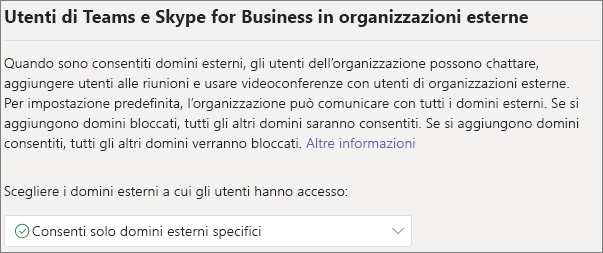
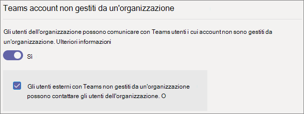
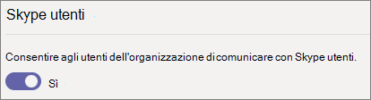

# <a name="manage-external-access-in-microsoft-teams"></a>Gestire l'accesso esterno in Microsoft Teams

L'accesso esterno consente agli utenti di Teams esterni all'organizzazione di trovare, chiamare, chattare e configurare riunioni con la propria organizzazione in Teams. Puoi anche usare l'accesso esterno per comunicare con persone di altre organizzazioni che usano ancora Skype for Business (online e locale) e Skype.

Per consentire agli utenti di altre organizzazioni di accedere ai team e ai canali dell’organizzazione, è possibile usare l'accesso guest. Per altre informazioni sulle differenze tra accesso esterno e accesso guest, vedere [Confrontare l'accesso esterno e guest](communicate-with-users-from-other-organizations.md#compare-external-and-guest-access). 

Usare l'accesso esterno quando:
  
- Sono presenti utenti in domini esterni che devono chattare. Ad esempio, Rob@contoso.com e Ann@northwindtraders.com stanno lavorando a un progetto insieme ad altri nei domini contoso.com e northwindtraders.com.

- Si vuole che gli utenti dell'organizzazione usino Teams per contattare persone in specifiche aziende esterne all'organizzazione.

- Si vuole poter essere trovati e contattati da qualsiasi altro utente di Teams al mondo tramite il proprio indirizzo di posta elettronica. 

## <a name="plan-for-external-access"></a>Pianificare l'accesso esterno

I criteri di accesso esterno includono i controlli per ogni tipo di federazione a livello di organizzazione e di utente. La disattivazione di un criterio a livello di organizzazione lo disattiva per tutti gli utenti, indipendentemente dall'impostazione a livello di utente. Tutte le impostazioni di accesso esterno sono abilitate per impostazione predefinita.

L'interfaccia di amministrazione di Teams controlla l'accesso esterno a livello di organizzazione. La maggior parte delle opzioni, ad eccezione delle restrizioni di dominio, è disponibile a livello di utente tramite PowerShell. Per altre informazioni, vedi [Utilizzo di PowerShell](#using-powershell) di seguito.

> [!NOTE]
> Se si disattiva l'accesso esterno nell'organizzazione, gli utenti esterni possono comunque partecipare alle riunioni mediante la partecipazione anonima. Per altre informazioni, vedere [Gestire le impostazioni delle riunioni in Teams](meeting-settings-in-teams.md).

> [!NOTE]
> Gli utenti Teams possono aggiungere app quando tengono riunioni o chat con persone di altre organizzazioni. Possono inoltre usare app condivise da componenti di altre organizzazioni quando prendono parte a riunioni o chat tenute da quelle organizzazioni. Si applicano i criteri sui dati dell’organizzazione dell’utente ospitante, così come le pratiche di condivisione dei dati di tutte le app di terze parti condivise da quell’organizzazione.

## <a name="allow-or-block-domains"></a>Consentire o bloccare domini

Se si aggiungono domini bloccati, verranno consentiti tutti gli altri domini. Se si aggiungono domini consentiti, tutti gli altri domini verranno bloccati. L'eccezione a questa regola è se alle riunioni sono consentiti partecipanti anonimi. Esistono tre scenari per la configurazione dell'accesso esterno nell'interfaccia di amministrazione di Teams (**Utenti** > **Accesso esterno**):

- **Consenti tutti i domini esterni**: questa è l'impostazione predefinita in Teams e consente agli utenti dell'organizzazione di trovare, chiamare, chattare e configurare riunioni con persone esterne all'organizzazione in qualsiasi dominio.

    In questo scenario, gli utenti possono comunicare con tutti i domini esterni che eseguono Teams o Skype for Business purché anche l'altro tenant supporti le comunicazioni esterne.
    
- **Consentirei solo domini esterni specifici**: aggiungendo domini a un elenco **Consenti**, si limita l'accesso esterno ai soli domini consentiti. Dopo aver configurato un elenco di domini consentiti, tutti gli altri domini verranno bloccati. 

- **Bloccare domini specifici**: l'aggiunta di domini a un elenco di **blocco** è possibile comunicare con tutti i domini esterni *tranne* quelli bloccati.  Dopo aver configurato un elenco di domini bloccati, tutti gli altri domini verranno consentiti.

- **Bloccare tutti i domini esterni:** impedisce agli utenti dell'organizzazione di trovare, chiamare, chattare e configurare riunioni con persone esterne all'organizzazione in qualsiasi dominio.

> [!NOTE]
> I domini consentiti o bloccati si applicano alle riunioni solo se l'accesso anonimo alle riunioni è disattivato.



**Utilizzo dell'interfaccia di amministrazione di Microsoft Teams.**

Consentire domini specifici

1. Nell'interfaccia di amministrazione di Teams, passare a **Utenti** > **Accesso esterno**.

2. In **Scegli i domini a cui hanno accesso gli utenti**, scegliere **Consenti solo domini esterni specifici.**

3. Selezionare **Consenti domini**.

4. Nella casella **Dominio** digitare il dominio che si desidera consentire e quindi fare clic su **Fatto.**

5. Se si desidera consentire un altro dominio, fare clic su **Aggiungi dominio.**

6. Fare clic su **Salva**.

Bloccare domini specifici

1. Nell'interfaccia di amministrazione di Teams, passare a **Utenti** > **Accesso esterno**.

2. In **Scegli i domini a cui gli utenti hanno accesso**, Scegli **Blocca solo domini esterni specifici**.

3. Selezionare **Blocca domini**.

4. Nella casella **Dominio** digitare il dominio che si desidera consentire e quindi fare clic su **Fatto.**

5. Se si desidera bloccare un altro dominio, fare clic su **Aggiungi un dominio**.

6. Fare clic su **Salva**.

Per comunicare con un altro tenant, è necessario abilitare **Consenti tutti i domini esterni** o aggiungere il tenant al proprio elenco di domini consentiti seguendo la stessa procedura precedente.  

## <a name="manage-contact-with-external-teams-users-not-managed-by-an-organization"></a>Gestire i contatti con utenti Teams esterni non gestiti da un'organizzazione

Gli amministratori possono scegliere di abilitare o disabilitare le comunicazioni con utenti esterni Teams utenti non gestiti da un'organizzazione ("non gestito"). Se abilitata, può anche controllare ulteriormente se le persone con account Teams non gestiti possono avviare un contatto (vedere l'immagine seguente). Se **Utenti esterni con account Teams non gestiti da un'organizzazione possono contattare gli utenti dell'organizzazione** è disattivato, gli utenti di Teams non gestiti non potranno cercare l'indirizzo di posta elettronica completo per trovare i contatti dell'organizzazione e tutte le comunicazioni con gli utenti di Teams non gestiti devono essere avviate dagli utenti dell'organizzazione.

Nell'interfaccia di amministrazione di Teams, passare a **Utenti** > **Accesso esterno**.



Seguire questa procedura per impedire agli utenti di Teams dell'organizzazione di avere contatti non richiesti con utenti di Teams esterni i cui account non sono gestiti da un'organizzazione:
1. Disattivare l'impostazione **Persone dell'organizzazione che possono comunicare con gli utenti di Teams i cui account non sono gestiti da un'organizzazione**.
2. Deselezionare la casella di controllo **Utenti esterni con account Teams non gestiti da un'organizzazione possono contattare gli utenti dell'organizzazione**.

Per consentire Teams utenti dell'organizzazione a comunicare con utenti Teams esterni i cui account non sono gestiti da un'organizzazione se gli utenti Teams hanno avviato il contatto:
1. Attivare l’impostazione **Le persone dell'organizzazione possono comunicare con gli utenti di Teams i cui account non sono gestiti da un'organizzazione**.
2. Deselezionare la casella di controllo **Utenti esterni con account Teams non gestiti da un'organizzazione possono contattare gli utenti dell'organizzazione**.

Per consentire agli Teams utenti dell'organizzazione di comunicare con utenti Teams esterni i cui account non sono gestiti da un'organizzazione e ricevere richieste di comunicazione con gli utenti Teams esterni:
1. Attivare l’impostazione **Le persone dell'organizzazione possono comunicare con gli utenti di Teams i cui account non sono gestiti da un'organizzazione**.
2. Selezionare la casella di controllo **Gli utenti esterni con account Teams non gestiti da un'organizzazione possono contattare gli utenti dell'organizzazione**.

## <a name="communicate-with-skype-users"></a>Comunicare con gli utenti di Skype

Seguire questa procedura per consentire agli utenti di Teams nell'organizzazione di comunicare con gli utenti Skype e di chiamarli. Gli utenti di Teams potranno cercare utenti di Skype e avviare una conversazione a due di solo testo oppure una chiamata audio/video e viceversa.



**Utilizzo dell'interfaccia di amministrazione di Microsoft Teams.**

1. Nel riquadro di spostamento sinistro passare a **Utenti** > **Accesso esterno**.

2. Abilita **Consenti agli utenti dell'organizzazione di comunicare con gli utenti di Skype** impostazione.

Per altre informazioni sui modi in cui gli utenti di Teams e gli utenti di Skype possono comunicare, incluse le limitazioni applicabili, vedere [Interoperabilità tra Teams e Skype](teams-skype-interop.md).

## <a name="using-powershell"></a>Utilizzo di PowerShell

Le impostazioni a livello di organizzazione possono essere configurate usando [Set-CSTenantFederationConfiguration](/powershell/module/skype/set-cstenantfederationconfiguration) e le impostazioni a livello utente possono essere configurate con [Set-CsExternalAccessPolicy](/powershell/module/skype/set-csexternalaccesspolicy).

La tabella seguente mostra i parametri del cmdlet utilizzati per configurare la federazione.

|Configurazione|Livello di organizzazione (Set-CSTenantFederationConfiguration)|Livello utente (Set-CsExternalAccessPolicy)|
|:-------|:--------|:------------------|
|Abilitare/disabilitare la federazione con altre organizzazioni di Teams e Skype for Business|`-AllowFederatedUsers`|`-EnableFederationAccess`|
|Abilitare la federazione con domini specifici|`-AllowedDomains`|Non disponibile|
|Disabilitare la federazione con domini specifici|`-Blocked Domains`|Non disponibile|
|Abilitare/disabilitare la federazione con gli utenti di Teams non gestiti da un'organizzazione|`-AllowTeamsConsumer`|`-EnableTeamsConsumerAccess`|
|Abilitare/disabilitare gli utenti di Teams non gestiti da un'organizzazione dall'avvio di conversazioni|`-AllowTeamsConsumerInbound`|`-EnableTeamsConsumerInbound`|
|Abilitare/disabilitare la federazione con Skype|`-AllowPublicUsers`|`-EnablePublicCloudAccess`|

È importante notare che la disabilitazione di un criterio "esegue il roll down" dal tenant agli utenti. Ad esempio:

```PowerShell
Set-CsTenantFederationConfiguration -AllowFederatedUsers $false
Set-CsExternalAccessPolicy -EnableFederationAccess $true
```

In questo esempio, anche se i criteri a livello di utente sono abilitati, gli utenti non saranno in grado di comunicare con gli utenti gestiti di Teams o con gli utenti di Skype for Business perché questo tipo di federazione è stato disattivato a livello di organizzazione. Pertanto, se si desidera abilitare questi controlli per un sottoinsieme di utenti, è necessario attivare il controllo a livello di organizzazione e creare due criteri – di gruppo uno che si applica agli utenti che devono avere il controllo disattivato e uno che si applica agli utenti a cui deve essere attivato il controllo.

## <a name="limit-external-access-to-specific-people"></a>Limitare l'accesso esterno a utenti specifici

Se è stato abilitato uno dei controlli di accesso esterno a livello di organizzazione, è possibile limitare l'accesso esterno a utenti specifici usando PowerShell.

È possibile usare lo script di esempio seguente, sostituendo *Control* per il controllo che si desidera modificare, *PolicyName* per il nome da assegnare al criterio e *Nome utente* per ogni utente per cui si desidera abilitare/disabilitare l'accesso esterno.

Assicurarsi di aver installato il modulo [Microsoft Teams PowerShell prima](/microsoftteams/teams-powershell-install) di eseguire lo script.

```PowerShell
Connect-MicrosoftTeams

# Disable external access globally
Set-CsExternalAccessPolicy -<Control> $false

# Create a new external access policy
New-CsExternalAccessPolicy -Identity <PolicyName> -<Control> $true

# Assign users to the policy
$users_ids = @("<UserName1>", "<UserName2>")
New-CsBatchPolicyAssignmentOperation -PolicyType ExternalAccessPolicy -PolicyName "<PolicyName>" -Identity $users_ids

```

Ad esempio, abilitare le comunicazioni con utenti esterni Teams utenti non gestiti da un'organizzazione:

```PowerShell
Connect-MicrosoftTeams

Set-CsExternalAccessPolicy -EnableTeamsConsumerAccess $false

New-CsExternalAccessPolicy -Identity ContosoExternalAccess -EnableTeamsConsumerAccess $true

$users_ids = @("MeganB@contoso.com", "AlexW@contoso.com")
New-CsBatchPolicyAssignmentOperation -PolicyType ExternalAccessPolicy -PolicyName "ContosoExternalAccess" -Identity $users_ids

```

Per altri esempi su come compilare un elenco di utenti, vedere [New-CsBatchPolicyAssignmentOperation.](/powershell/module/teams/new-csbatchpolicyassignmentoperation)

Per visualizzare il nuovo criterio, eseguire `Get-CsExternalAccessPolicy`.

Vedere anche [New-CsExternalAccessPolicy](/powershell/module/skype/new-csexternalaccesspolicy) e [Set-CsExternalAccessPolicy.](/powershell/module/skype/set-csexternalaccesspolicy)

## <a name="common-external-access-scenarios"></a>Scenari comuni di accesso esterno

Le sezioni seguenti descrivono come abilitare la federazione per gli scenari di accesso esterno comuni e in che modo il criterio TeamsUpgradePolicy determina il recapito delle chat e delle chiamate in arrivo.

### <a name="enable-federation-between-users-in-your-organization-and-other-organizations"></a>Abilitare la federazione tra gli utenti dell'organizzazione e altre organizzazioni

Per consentire agli utenti dell'organizzazione di comunicare con gli utenti di un'altra organizzazione, entrambe le organizzazioni devono abilitare la federazione. I passaggi per abilitare la federazione per una determinata organizzazione variano a seconda che l'organizzazione sia solo online, ibrida o solo locale.

| Se la propria organizzazione lo è | Abilitare la federazione come segue |
|:---------|:-----------------------|
|Online senza Skype for Business locale. Sono incluse le organizzazioni che hanno utenti TeamsOnly e/o di Skype for Business Online.| Se si usa l'interfaccia di amministrazione di Teams: <br>- Assicurarsi che i domini con cui si vuole comunicare siano autorizzati per l'accesso esterno.<br><br>Se si usa PowerShell:<br>- Verificare che il tenant sia abilitato per la federazione: `Get-CsTenantFederationConfiguration` deve mostrare `AllowFederatedUsers=true`. <br>- Verificare che il valore effettivo dell'utente di `CsExternalAccessPolicy` sia `EnableFederationAccess=true`.<br>- Se non si usa la federazione aperta, verificare che il dominio di destinazione sia elencato in `AllowedDomains` di `CsTenantFederationConfiguration`. |
|Solo locale| Negli strumenti locali: <br>- Verificare che la federazione sia abilitata in `CsAccessEdgeConfiguration`.<br>- Verificare che la federazione per l'utente sia abilitata tramite `ExternalAccessPolicy`, mediante criteri globali, criteri del sito o criteri assegnati dall'utente. <br> - Se non si usa la federazione aperta, verificare che il dominio di destinazione sia elencato in `AllowedDomains`.|
|Ibrida con alcuni utenti online (in Skype for Business o Teams) e alcuni utenti in locale. | Seguire i passaggi precedenti per le organizzazioni online e locali. |

### <a name="delivery-of-incoming-chats-and-calls"></a>Recapito di chat e chiamate in entrata 

Le chat e le chiamate in arrivo da un'organizzazione federativa verranno visualizzate nel client di Teams o Skype for Business dell'utente a seconda della modalità dell'utente destinatario in TeamsUpgradePolicy.

| Se si desidera questo | Procedere come segue: |
|:---------|:-----------------------|
|Assicurarsi che le chat e le chiamate federate in entrata arrivino al client Teams dell'utente:|Configurare gli utenti come TeamsOnly.
|Assicurarsi che le chat e le chiamate federate in entrata arrivino al client Skype for Business dell'utente|Configurare gli utenti in modo che siano in qualsiasi modalità tranne TeamsOnly.|

### <a name="enable-federation-between-users-in-your-organization-and-unmanaged-teams-users"></a>Abilitare la federazione tra gli utenti dell'organizzazione e gli utenti di Teams non gestiti

Per abilitare la federazione tra gli utenti dell'organizzazione e gli utenti di Teams non gestiti:

| Se la propria organizzazione lo è | Abilitare la federazione come segue |
|:---------|:-----------------------|
|Online senza Skype for Business locale. Sono incluse le organizzazioni che hanno solo utenti di Teams e/o utenti di Skype for Business Online.| Se si usa l'interfaccia di amministrazione di Teams:<br>-Assicurarsi che **Gli utenti dell'organizzazione** possano comunicare con Teams gli utenti i cui account non sono gestiti da un'organizzazione sia abilitato in **Accesso esterno**.<br>- Se si desidera che gli account Di Teams non gestiti avvii le chat, selezionare la casella per **Gli utenti esterni con account di Teams non gestiti da un'organizzazione possono contattare gli utenti dell'organizzazione**.<br><br>Se si usa PowerShell:<br>- Verificare che il tenant sia abilitato per la federazione: `Get-CsTenantFederationConfiguration` deve mostrare `AllowTeamsConsumer=true`.<br>-Verificare che il valore effettivo dell'utente di `CsExternalAccessPolicy` abbia`EnableTeamsConsumerAccess=true`.<br>-Verificare che il tenant sia abilitato per gli utenti non gestiti per avviare chat: `Get-CsTenantFederationConfiguration` deve mostrare `AllowTeamsConsumerInbound=true`.<br>-Verificare che il valore effettivo dell'utente di `CsExternalAccessPolicy` abbia`EnableTeamsConsumerInbound=true`.|
|Solo locale| La chat con utenti Teams non gestiti non è supportata solo per le organizzazioni locali.|
|Ibrida con alcuni utenti online (in Skype for Business o Teams) e alcuni utenti in locale. | Seguire i passaggi descritti in precedenza per le organizzazioni online. Tenere presente che la chat con utenti non Teams utenti non gestiti non è supportata per gli utenti locali.|

> [!IMPORTANT]
> Non è necessario aggiungere **domini Teams** come domini consentiti per consentire agli utenti di Teams di comunicare con utenti di Teams non gestiti all'esterno dell'organizzazione. Sono consentiti **tutti i domini di Teams senza gestione**.

### <a name="enable-federation-between-users-in-your-organization-and-consumer-users-of-skype"></a>Abilitare la federazione tra gli utenti dell'organizzazione e gli utenti consumer di Skype

Per abilitare la federazione tra gli utenti dell'organizzazione e gli utenti consumer di Skype:

| Se la propria organizzazione lo è | Abilitare la federazione utente come segue |
|:---------|:-----------------------|
|Online solo senza Skype for Business in locale. Sono incluse le organizzazioni che hanno utenti TeamsOnly e/o di Skype for Business Online. | Se si usa l'interfaccia di amministrazione di Teams: <br>- Assicurarsi che **Consenti agli utenti dell'organizzazione di comunicare con gli utenti Skype** sia abilitato in Accesso esterno.<br><br>Se si usa PowerShell: <br>- Verificare che il tenant sia abilitato per la federazione: `Get-CsTenantFederationConfiguration` deve mostrare `AllowPublicUsers=true`. <br> - Verificare che il valore effettivo dell'utente per `CsExternalAccessPolicy` sia `EnablePublicCloudAccess=true`. |
|Solo locale| Negli strumenti locali: <br> - Verificare che Skype sia abilitato come partner federato. <br> - Verificare che sia impostato `EnablePublicCloudAccess=true` per l'utente tramite `ExternalAccessPolicy`, mediante criteri globali, criteri del sito o criteri assegnati dall'utente.|
| Ibrida con alcuni utenti online (in Skype for Business o Teams) e alcuni utenti in locale.| Seguire i passaggi precedenti per le organizzazioni online e locali.

> [!IMPORTANT]
> Non è necessario aggiungere **domini Skype** come domini consentiti per permettere agli utenti di Teams o Skype for Business Online di comunicare con gli utenti di Skype all'interno o all'esterno dell'organizzazione. **Tutti i domini skype** sono consentiti.

## <a name="federation-diagnostic-tool"></a>Strumento di diagnostica della federazione

Gli amministratori possono usare il seguente strumento di diagnostica per verificare che un utente Teams possa comunicare con un utente Teams federato:

1. Selezionare **Esegui test** di seguito, per popolare la diagnostica nell’interfaccia Amministrazione Microsoft 365. 

   > [!div class="nextstepaction"]
   > [Esegui test: federazione di Teams](https://aka.ms/TeamsFederationDiag)

2. Nel riquadro Esegui diagnostica immettere il **dell'indirizzo SIP (Session Initiation Protocol)** e il **nome di dominio del tenant federato**, quindi selezionare **Esegui test**.

3. I test restituiranno i passaggi da attuare per risolvere eventuali configurazioni del tenant o di criteri che impediscono la comunicazione con l'utente federato.


## <a name="related-topics"></a>Argomenti correlati

[Esperienza di chat nativa per utenti esterni (federati)](native-chat-for-external-users.md)
