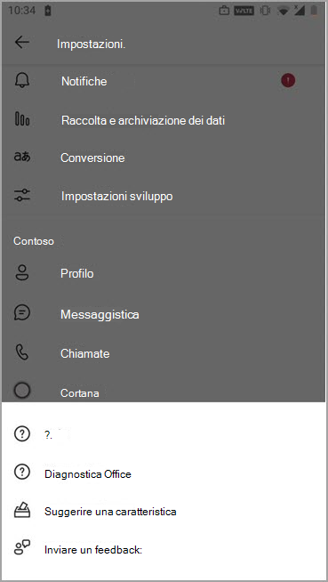

# <a name="manage-feedback-policies-in-microsoft-teams"></a>Gestire i criteri di feedback in Microsoft Teams

Gli utenti della tua organizzazione possono inviare feedback su Microsoft Teams per farci sapere come facciamo direttamente dall'interno di Teams desktop, client Web e dispositivi mobili. Stiamo migliorando continuamente l'esperienza di Teams e usiamo questo feedback per migliorare Teams.

> [!NOTE]
> I criteri di feedback non sono disponibili nelle distribuzioni GCC, GCC High o DOD.

**La funzionalità **Invia feedback****

Gli utenti possono inviare commenti e suggerimenti su Teams passando a **Aiutaci** >  a **inviare feedback** in Teams desktop e web.


Accedere al feedback sui dispositivi mobili usando **la Guida di** **Impostazioni** >  & feedback  > **Invia feedback**.



 I dati inviati tramite **Invia feedback** e **Invia feedback** sono considerati "Dati di supporto" ai sensi del contratto di Microsoft 365 o Office 365, incluse le informazioni che altrimenti verrebbero considerate "Dati del cliente" o "Dati personali".


**Rilevazioni**

Gli utenti possono anche valutare la loro esperienza con Teams e inviarci i dettagli sulla valutazione che assegnano. Questo sondaggio popup viene visualizzato di tanto in tanto dagli utenti in Teams. Quando un utente seleziona **Invia feedback** nella notifica, il sondaggio viene visualizzato per il completamento.


## <a name="set-whether-users-can-send-feedback-about-teams-to-microsoft"></a>Specificare se gli utenti possono inviare feedback su Teams a Microsoft

Gli amministratori possono controllare se gli utenti dell'organizzazione possono inviare feedback su Teams a Microsoft e se ricevono il sondaggio. Per impostazione predefinita, a tutti gli utenti dell'organizzazione viene assegnato automaticamente il criterio globale (impostazione predefinita a livello di organizzazione) e la funzionalità di feedback e il sondaggio sono abilitati nel criterio. L'eccezione è Teams per l'istruzione, in cui le funzionalità sono abilitate per gli insegnanti e disabilitate per gli studenti.

È possibile modificare il criterio globale o creare e assegnare criteri personalizzati. Dopo aver modificato il criterio globale o assegnato un criterio personalizzato, l'applicazione delle modifiche può richiedere alcune ore.

Si supponi, ad esempio, di voler consentire a tutti gli utenti dell'organizzazione di inviare feedback e ricevere sondaggi, ad eccezione dei nuovi assunti in formazione. In questo scenario si crea un criterio personalizzato per disattivare entrambe le caratteristiche e assegnarle ai nuovi assunti. Tutti gli altri utenti dell'organizzazione ottengono i criteri globali con le caratteristiche attivate.  

I criteri di feedback vengono gestiti con PowerShell. Utilizzare il [cmdlet **New-CsTeamsFeedbackPolicy**](/powershell/module/skype/new-csteamsfeedbackpolicy) per creare un criterio personalizzato. Utilizzare il cmdlet **Grant-CsTeamsFeedbackPolicy** per assegnarlo a uno o più utenti o gruppi di utenti, ad esempio un gruppo di sicurezza o un gruppo di distribuzione. Utilizzare **Set-CsTeamsFeedbackPolicy** per impostare flag specifici.

Per disattivare e attivare le funzionalità, impostare i seguenti parametri:

 - **Inviare feedback**: impostare il parametro **userInitiatedMode** **su abilitato** per consentire agli utenti a cui sono assegnati i criteri di fornire feedback. Se si imposta il parametro su disabilitata, la caratteristica viene **disattivata** e gli utenti a cui sono assegnati i criteri non hanno la possibilità di fornire feedback.

 - **Sondaggi**: impostare il parametro **receiveSurveysMode** su **abilitato** per consentire agli utenti a cui sono assegnati i criteri di ricevere il sondaggio. Per fare in modo che gli utenti ricevano il sondaggio e consentano loro di rifiutare esplicitamente, impostare il parametro **su enabledUserOverride**. In Teams, gli utenti possono quindi passare a **Impostazioni** > **Privacy** e scegliere se vogliono partecipare ai sondaggi. Se si imposta il parametro su disabilitata, la caratteristica viene **disattivata** e gli utenti a cui sono assegnati i criteri non riceveranno il sondaggio.

 - **Email**: usare il flag **AllowEmailCollection** per aggiungere un campo di posta elettronica.
 - **Raccolta log**: usare il flag **AllowLogCollection** per aggiungere il consenso esplicito per la raccolta di log per gli utenti. La raccolta log è attualmente abilitata solo nei dispositivi mobili. Per altre informazioni sui dati condivisi tramite i log, [vedere altre informazioni](https://go.microsoft.com/fwlink/?linkid=2168178).

## <a name="create-a-custom-feedback-policy"></a>Creare criteri di feedback personalizzati

In questo esempio viene creato un criterio per il feedback denominato Criteri di feedback per i nuovi assunti e viene disattivata la possibilità di inviare feedback tramite **l'opzione Invia feedback** e il sondaggio.

```PowerShell
New-CsTeamsFeedbackPolicy -identity "New Hire Feedback Policy" -userInitiatedMode disabled -receiveSurveysMode disabled
```

## <a name="assign-a-custom-feedback-policy-to-users"></a>Assegnare criteri di feedback personalizzati agli utenti

[!INCLUDE [assign-policy](includes/assign-policy.md)]

In questo esempio viene assegnato un criterio personalizzato denominato Criteri di feedback per i nuovi assunti a un utente denominato utente1.

```PowerShell
Grant-CsTeamsFeedbackPolicy -Identity user1@contoso.com -PolicyName "New Hire Feedback Policy"
```

## <a name="related-topics"></a>Argomenti correlati

- [Panoramica di PowerShell di Teams](teams-powershell-overview.md)
- [Assegnare i criteri agli utenti in Teams](policy-assignment-overview.md)
