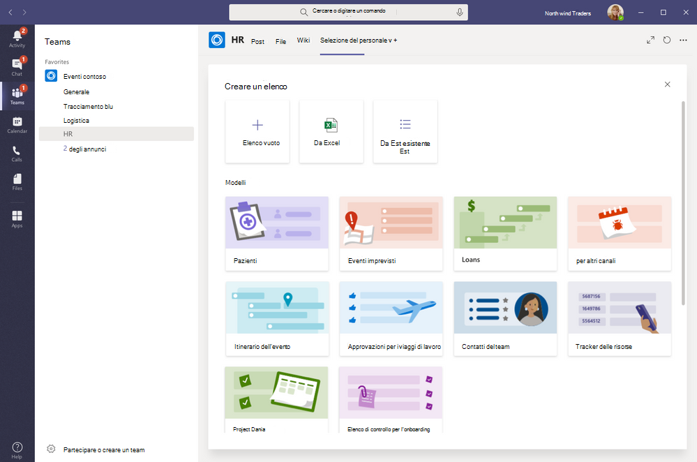

# Gestire l'app Elenchi per l'organizzazione in Microsoft Teams

## Panoramica di Elenchi

L'app Elenchi in Microsoft Teams consente agli utenti dell'organizzazione di tenere traccia delle informazioni, organizzare il lavoro e gestire i flussi di lavoro. Con Elenchi, gli utenti possono tenere traccia di dati come problemi, risorse, routine, contatti, inventario, incidenti, prestiti, pazienti e altro ancora usando visualizzazioni personalizzabili, regole e avvisi per mantenere sincronizzati tutti i membri del team.

In Teams gli utenti accedono a Elenchi come scheda in un canale. Fare su **+** per aprire la raccolta schede e aggiungere una nuova istanza della scheda dell'app Elenchi a un canale per iniziare.

Gli utenti possono creare nuovi elenchi o aggiungere elenchi esistenti all’interno dello stesso team o da un altro sito di SharePoint a cui hanno accesso. È possibile creare i nuovi elenchi da zero, a partire da modelli predefiniti, in base alla struttura di un elenco esistente, oppure importando i dati da una cartella di lavoro di Excel. L’app Elenchi è disponibile nei client desktop, Web e per dispositivi mobili di Teams.

## Modelli

I modelli in Elenchi sono personalizzati un base agli scenari comuni di tracciamento delle informazioni per gli utenti. Ogni modello viene fornito con una struttura di elenco predefinita, layout di modulo e opzioni di formattazione a livello di visualizzazione elenco e di visualizzazione dettagli per consentire agli utenti di iniziare rapidamente. Dopo aver selezionato un modello, gli utenti ottengono un'anteprima dell'aspetto dell'elenco, insieme ad alcuni dati di esempio. Di seguito sono riportati alcuni esempi di come i team dell'organizzazione possono usare i modelli predefiniti in Elenchi:

- Tenere traccia dei problemi e portarli a conclusione con il modello Gestione problemi.
- Organizzare tutti i dettagli dell'evento con il modello Itinerario dell'evento.
- Usare il modello Pazienti per registrare le esigenze e lo stato dei pazienti per i team sanitari dell'organizzazione sanitaria per monitorare e coordinare le attività di assistenza.
- Tenere traccia dello stato delle richieste di prestito con il modello Prestiti.

## Scenario di esempio

Un ufficio postale locale è responsabile dello smistamento e della consegna della posta nel proprio distretto. Ogni mattina, il team dell'ufficio postale si riunisce per esaminare gli obiettivi quotidiani, condividere annunci e discutere di incidenti noti.

Dopo la riunione, i postini prelevano la posta e iniziano il percorso di consegna. Lungo il percorso possono verificarsi degli incidenti, ad esempio un incidente automobilistico, un problema legato ai cani o una protesta con disordini sociali. Quando i postini incontrano un incidente, usano Teams sui propri dispositivi mobili per registrare i dettagli dell'incidente, che vengono monitorati in un elenco nel canale del team. Tutte le persone del team, inclusi i postini sul campo, possono visualizzare queste informazioni ed essere sempre informati.

Prima di passare a Teams, i postini dovevano tornare all'ufficio postale per compilare un modulo cartaceo per segnalare un incidente che veniva inserito in un foglio di calcolo Excel. Teams offre ai postini un'esperienza mobile first, in cui possono usare Elenchi per segnalare gli incidenti sul campo mentre si verificano, condividere i dettagli degli incidenti con i membri del team, avere conversazioni su di essi sul canale e contribuire alla risoluzione degli incidenti.

## Cosa c'è da sapere su Elenchi

### Elenchi è disponibile in tutti i team e canali

L’app Elenchi è preinstallata per tutti gli utenti di Teams ed è disponibile direttamente nella raccolta schede di tutti i team e canali. Questo significa che gli utenti non devono accedere all'App Store di Teams per installarla.

### Elenchi e SharePoint

I dati di Elenchi vengono archiviati nel sito del team di SharePoint Online. Per altre informazioni sull'interazione tra SharePoint Online e Teams, vedere [Modalità di interazione di SharePoint Online e OneDrive for Business con Teams](SharePoint-OneDrive-interact.md).

Le autorizzazioni impostate in SharePoint vengono applicate agli elenchi creati nell'app Elenchi. Per impostazione predefinita, gli elenchi ereditano le autorizzazioni dal sito a cui appartengono. Queste autorizzazioni regolamentano i tipi di azioni che gli utenti possono eseguire, ad esempio se possono creare o modificare gli elenchi. Per altre informazioni, vedere [Livelli di autorizzazione in SharePoint](/sharepoint/understanding-permission-levels) e [Autorizzazioni utente e livelli di autorizzazione in SharePoint Server](/sharepoint/sites/user-permissions-and-permission-levels).

In alcuni scenari è possibile limitare le azioni che gli utenti possono eseguire negli elenchi. Ad esempio, una persona di un team modifica una visualizzazione elenco, che viene modificata per tutti i membri del team, e si vuole consentire solo al proprietario del team o a determinati membri del team di modificare le visualizzazioni elenco. Per altre informazioni, vedere [Personalizzare le autorizzazioni per un elenco o una raccolta di SharePoint](https://support.microsoft.com/office/customize-permissions-for-a-sharepoint-list-or-library-02d770f3-59eb-4910-a608-5f84cc297782#ID0EAACAAA=Online,_2019,_2016,_2013).

> [!NOTE]
> A questo punto, le autorizzazioni di proprietari e membri di un team non sono collegate in alcun modo alle autorizzazioni nel sito del team che regolano il comportamento degli elenchi o dell'app Elenchi. Tuttavia, in base al feedback e all'utilizzo dei clienti, questo verrà preso in considerazione per un'iterazione futura del prodotto.  

### Limitazioni

Con Elenchi, gli utenti ottengono un'esperienza desktop, Web e per dispositivi mobili. È importante sapere che gli utenti non possono creare nuovi elenchi o aggiungere elenchi esistenti usando Elenchi nel client per dispositivi mobili di Teams. Per visualizzare o modificare un elenco nel client per dispositivi mobili di Teams, è necessario prima creare o aggiungere un elenco usando Elenchi nel client desktop o Web di Teams.

Gli utenti guest non possono creare o eliminare un elenco. Possono aggiungere voci di elenco a elenchi esistenti, avviare nuove conversazioni sulle voci di elenco e rispondere alle conversazioni esistenti sulle voci di elenco.

### Elenchi e l'app SharePoint

Se gli utenti dell'organizzazione hanno creato elenchi usando l'app SharePoint, tali elenchi verranno spostati automaticamente in Elenchi senza che sia necessaria alcuna azione da parte dell'utente. Per ottenere la migliore esperienza di integrazione degli elenchi e la più completa in Teams, usare l'app Elenchi e aggiungere gli elenchi esistenti.

## Configurare Elenchi

### Abilitare o disabilitare Elenchi nell'organizzazione

Elenchi è abilitata per impostazione predefinita per tutti gli utenti di Teams nell’organizzazione. È possibile disattivare o attivare l'app a livello di organizzazione nella pagina [Gestisci app](manage-apps.md) nell'interfaccia di amministrazione di Microsoft Teams.

1. Nel riquadro di spostamento sinistro dell'interfaccia di amministrazione di Microsoft Teams, passare ad **App di Teams** > **Gestisci app**.
2. Eseguire una delle operazioni seguenti:

    - Per disattivare Elenchi per l'organizzazione, cercare l'app Elenchi, selezionarla e quindi fare clic su **Blocca**.
    - Per attivare Elenchi per l'organizzazione, cercare l'app Elenchi, selezionarla e quindi fare clic su **Consenti**.

### Abilitare o disabilitare Elenchi per utenti specifici nell'organizzazione

Per consentire o bloccare l'uso di Elenchi a utenti specifici dell'organizzazione, assicurarsi che Elenchi sia attivata per l'organizzazione nella pagina [Gestisci app](manage-apps.md) e quindi creare criteri di autorizzazione per le app personalizzati da assegnare a tali utenti. Per altre informazioni, vedere [Gestire i criteri di autorizzazione delle app in Teams](teams-app-permission-policies.md).

## Cercare nel log di audit gli eventi degli elenchi

Gli elenchi sono abilitati con il controllo a livello aziendale, quindi è possibile cercare elenchi ed eventi delle voci di elenco nel log di audit nel Centro sicurezza e conformità. Per altre informazioni, vedere [Eseguire una ricerca nel log di controllo nel Centro sicurezza e conformità](/microsoft-365/compliance/search-the-audit-log-in-security-and-compliance).

Per un elenco di eventi di audit rilevanti per l'app Elenchi in Teams, vedere [Attività dell'elenco di SharePoint](/microsoft-365/compliance/search-the-audit-log-in-security-and-compliance#sharepoint-list-activities).

Prima di poter eseguire ricerche nel log di audit, è necessario attivare il controllo nel [Centro sicurezza e conformità](https://protection.office.com). Tenere presente che i dati di audit sono disponibili solo dal momento in cui è stato attivato il controllo.

## Power Automate, Power Apps e API Graph

Elenchi supporta [Power Automate](/power-automate/flow-types) per i flussi di lavoro e [Power Apps](/powerapps/maker/canvas-apps/customize-list-form) per i moduli elenco. Gli sviluppatori possono usare l'[API Elenchi](/sharepoint/dev/sp-add-ins/working-with-lists-and-list-items-with-rest) per connettere i dati degli elenchi come origine tramite Microsoft Graph.

## Fornire un feedback o segnalare un problema
  
Per inviare un feedback o segnalare un problema, fare clic su **Guida** nella parte inferiore del riquadro di spostamento sinistro di Teams e quindi selezionare **Segnala un problema**. Selezionare **Elenchi** e quindi immettere il proprio feedback o i dettagli sul problema che si è verificato.

## Argomenti correlati

- [Documentazione della Guida di Elenchi](https://support.microsoft.com/office/apps-and-services-cc1fba57-9900-4634-8306-2360a40c665b#PickTab=Lists)