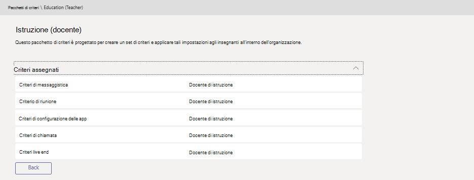

# Gestire i pacchetti di criteri in Microsoft Teams

Un pacchetto di criteri in Microsoft teams è una raccolta di criteri predefiniti e di impostazioni dei criteri che è possibile assegnare agli utenti che hanno ruoli simili nell'organizzazione. I pacchetti di criteri sono stati creati per semplificare, snellire e garantire la coerenza della gestione dei criteri per i gruppi di utenti nell'organizzazione.  

Quando si assegna un pacchetto di criteri agli utenti, i criteri del pacchetto vengono creati e quindi è possibile personalizzare le impostazioni dei criteri nel pacchetto per soddisfare le esigenze dell'organizzazione.

I pacchetti di criteri non sono disponibili per le organizzazioni di community Cloud (GCC) degli Stati Uniti.

## Che cos'è un pacchetto di criteri?

I pacchetti di criteri consentono di controllare le caratteristiche dei team che si desidera concedere o limitare per set specifici di persone nell'organizzazione. Ogni pacchetto di criteri in teams è progettato intorno a un ruolo utente e include criteri predefiniti e impostazioni dei criteri che supportano le attività di collaborazione e comunicazione tipiche di tale ruolo.

I team attualmente includono i seguenti pacchetti di criteri.

|**Nome pacchetto**  |**Descrizione** |
|---------|---------|
|Istruzione (studente di istruzione superiore)    |Crea un set di criteri e impostazioni dei criteri applicabili agli studenti dell'istruzione superiore.|
|Istruzione (studente di scuola elementare)   |Crea un set di criteri e impostazioni dei criteri applicabili agli studenti primari.|
|Istruzione (studente di scuola secondaria)    |Crea un set di criteri e impostazioni dei criteri applicabili agli studenti secondari.         |
|Istruzione (insegnante)    |Crea un set di criteri e impostazioni dei criteri applicabili agli insegnanti.      |
|Utente di piccole e medie imprese (Business Voice) |Crea un criterio di configurazione dell'app che include le app per un'esperienza di Business Voice.|
|Utente di piccole e medie imprese (senza Business Voice) |Questo pacchetto di criteri è progettato per creare un set di criteri e applicare tali impostazioni agli utenti di piccole e medie imprese senza le funzionalità vocali aziendali.|
|Addetto alla sicurezza pubblica   |Crea un set di criteri e impostazioni dei criteri applicabili agli addetti alla sicurezza pubblica dell'organizzazione.|
|Sanità (lavoratore clinico)  |Crea un set di criteri e impostazioni dei criteri che conferiscono agli operatori clinici, ad esempio infermieri registrati, addebiti infermieri, medici e assistenti sociali, l'accesso completo alla chat, alle chiamate, alla gestione del turno e alle riunioni. |
|Assistenza sanitaria (Information Worker)  |Crea un set di criteri e impostazioni dei criteri che forniscono agli Information Worker come personale IT, personale informatico, personale finanziario e responsabili della conformità, accesso completo alla chat, alle chiamate e alle riunioni.|

> [!NOTE]
> Aggiungeremo altri pacchetti di criteri nelle versioni future dei team, quindi controlla le informazioni più aggiornate.  

A ogni singolo criterio viene assegnato il nome del pacchetto di criteri in modo da poter identificare facilmente i criteri collegati a un pacchetto di criteri.
Ad esempio, quando si assegna il pacchetto di criteri Education (Teacher) agli insegnanti dell'Istituto di istruzione, viene creato un criterio denominato Education_Teacher per ogni criterio nel pacchetto.

## Come usare i pacchetti di criteri

La procedura seguente illustra come usare i pacchetti di criteri nell'organizzazione.

- **[Visualizzazione](#view-the-settings-of-a-policy-in-a-policy-package)**: visualizzare le impostazioni di ogni criterio in un pacchetto di criteri prima di assegnare un pacchetto. Verificare di aver compreso ogni impostazione e quindi decidere se i valori predefiniti sono appropriati per l'organizzazione o se è necessario modificarli per essere più restrittivi o indulgenti in base alle esigenze dell'organizzazione.

    Se un criterio viene eliminato, è comunque possibile visualizzarne le impostazioni, ma non si potranno modificare le impostazioni. I criteri eliminati vengono ricreati con le impostazioni predefinite quando si assegna il pacchetto di criteri.

- **[Assegna](#assign-a-policy-package)**: assegna il pacchetto di criteri agli utenti. Tenere presente che i criteri in un pacchetto di criteri non vengono creati finché non si assegna il pacchetto, dopodiché è possibile modificare le impostazioni dei singoli criteri nel pacchetto.  

- **[Personalizza](#customize-policies-in-a-policy-package)**: personalizzare le impostazioni dei criteri nel pacchetto dei criteri per adattarle alle esigenze dell'organizzazione. Tutte le modifiche apportate alle impostazioni dei criteri vengono applicate automaticamente agli utenti a cui è stato assegnato il pacchetto.

Ecco i passaggi per visualizzare, assegnare e personalizzare i pacchetti di criteri nell'interfaccia di amministrazione di Microsoft teams.

### Visualizzare le impostazioni di un criterio in un pacchetto di criteri

1. Nella barra di spostamento sinistra dell'interfaccia di amministrazione di Microsoft teams fare clic su **pacchetti di criteri**e quindi selezionare un pacchetto di criteri facendo clic a sinistra del nome del pacchetto.
2. Fare clic sul criterio che si vuole visualizzare.

### Assegnare un pacchetto di criteri

#### Assegnare un pacchetto di criteri a un utente

1. Nella barra di spostamento sinistra dell'interfaccia di amministrazione di Microsoft teams, passa a **utenti**e quindi fai clic sull'utente.
2. Nella pagina dell'utente fare clic su **criteri**e quindi fare clic su **modifica**accanto a **pacchetto criteri**.
3. Nel riquadro **Assegna criteri del pacchetto** selezionare il pacchetto da assegnare e quindi fare clic su **Salva**.

#### Assegnare un pacchetto di criteri a più utenti

1. Nella barra di spostamento sinistra dell'interfaccia di amministrazione di Microsoft teams, passa a **pacchetti di criteri**e quindi seleziona il pacchetto di criteri da assegnare facendo clic a sinistra del nome del pacchetto.
2. Fare clic su **Gestisci utenti**.
3. Nel riquadro **Gestisci utenti** cercare l'utente per nome visualizzato o per nome utente, selezionare il nome e quindi fare clic su **Aggiungi**. Ripetere questo passaggio per ogni utente che si vuole aggiungere.
4. Al termine dell'aggiunta di utenti, fare clic su **Salva**.

### Personalizzare i criteri in un pacchetto di criteri

È possibile modificare le impostazioni di un criterio tramite la pagina **pacchetti di criteri** o accedendo direttamente alla pagina dei criteri nell'interfaccia di amministrazione di Microsoft teams.

1. Nella barra di spostamento sinistra dell'interfaccia di amministrazione di Microsoft teams eseguire una delle operazioni seguenti:
    - Fare clic su **pacchetti di criteri**e quindi selezionare il pacchetto di criteri facendo clic a sinistra del nome del pacchetto.
    - Fare clic sul tipo di criterio.  Ad esempio, fare clic su **criteri di messaggistica**.
2. Fare clic sul criterio che si vuole modificare. I criteri collegati a un pacchetto di criteri hanno lo stesso nome del pacchetto di criteri.
3. Apportare le modifiche desiderate e quindi fare clic su **Salva**.

## Risoluzione dei problemi

**Viene visualizzato un messaggio di errore quando si assegna un pacchetto di criteri**

Questo problema può verificarsi se uno o più criteri del pacchetto non sono stati creati o applicati correttamente. Riassegnare il pacchetto di criteri agli utenti. Il tentativo di riprovare l'operazione in genere risolve questo problema.

## Argomenti correlati

[Pacchetti di criteri di Microsoft Teams per l'istruzione per amministratori](policy-packages-edu.md)
