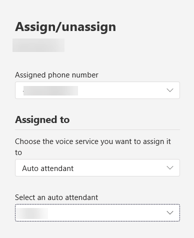

# <a name="manage-resource-accounts-in-microsoft-teams"></a>Gestire gli account di risorsa in Microsoft Teams

Un account di risorse è noto anche come *oggetto utente disabilitato* in Azure ad e può essere usato per rappresentare le risorse in generale. In Exchange potrebbe essere usato per rappresentare le sale riunioni, ad esempio, e consentire loro di avere un numero di telefono. Un account delle risorse può essere ospitato in Microsoft 365 o in locale con Skype for Business Server 2019.

In Microsoft teams o Skype for business online ogni coda di chiamata di sistema telefonico o operatore automatico è necessaria per avere almeno un account di risorse associato. Se un account di risorse richiede un numero di telefono assegnato dipenderà dall'uso previsto della coda di chiamata associata o dell'operatore automatico, come illustrato nel diagramma seguente. È anche possibile fare riferimento agli articoli sulle code di chiamata e gli operatori automatici collegati nella parte inferiore di questo articolo prima di assegnare un numero di telefono a un account delle risorse.


> [!NOTE]
> Questo articolo si applica sia a Microsoft teams che a Skype for business online. Per gli account delle risorse ospitati in Skype for Business Server 2019, vedere [configurare gli account di risorse](/SkypeForBusiness/hybrid/configure-onprem-ra).

## <a name="assign-a-phone-number-to-a-phone-system-call-queue"></a>Assegnare un numero di telefono a una coda di chiamata di sistema telefonico

Se l'organizzazione usa già almeno una licenza per il sistema telefonico, per assegnare un numero di telefono a una coda di chiamata di sistema telefonico, il processo è:

1. Ottenere un numero di servizio.
2. Ottenere un sistema telefonico gratuito- [licenza per gli utenti virtuali](teams-add-on-licensing/virtual-user.md) o una licenza per il sistema telefonico a pagamento da usare con l'account delle risorse o con una licenza per il sistema telefonico.
3. Creare l'account delle risorse. Per avere un account di risorse associato è necessario un operatore automatico o una coda di chiamata.
4. Assegnare il sistema telefonico o un sistema telefonico-licenza utente virtuale per l'account delle risorse.
5. Assegnare un numero di telefono del servizio all'account risorse a cui sono state assegnate solo le licenze.
6. Creare una coda di chiamata di sistema telefonico o un operatore automatico
7. Collegare l'account delle risorse con una coda di chiamata o un operatore automatico.

<!-- Auto attendants created after November 1st, 2019 also create a new resource account that is associated with the auto attendant. If a phone number is applied to the auto attendant's resource account,  a Phone System - Virtual user license is applied to the resource account if one is available. -->

Se l'operatore automatico o la coda di chiamata è annidata in un operatore automatico di primo livello, l'account di risorse associato deve avere solo un numero di telefono se si vogliono più punti di entrata nella struttura degli operatori automatici e delle code di chiamata.

Per reindirizzare le chiamate alle persone dell'organizzazione ospitate online, devono avere una licenza per il **sistema telefonico** ed essere abilitate per Enterprise Voice o avere piani di chiamata di Office 365. Vedere [assegnare licenze per i componenti aggiuntivi Microsoft teams](teams-add-on-licensing/assign-teams-add-on-licenses.md). Per abilitare VoIP aziendale, è possibile utilizzare Windows PowerShell. Ad esempio, Esegui:`Set-CsUser -identity "Amos Marble" -EnterpriseVoiceEnabled $true`

> [!WARNING]
> Per evitare problemi con l'account delle risorse, seguire questa procedura in questo ordine.

Se la coda di chiamata del sistema telefonico o l'operatore automatico che si sta creando verranno annidati e non sarà necessario un numero di telefono, il processo sarà:

1. Creare l'account delle risorse
2. Creare una coda di chiamata di sistema telefonico o un operatore automatico
3. Associare l'account delle risorse a una coda di chiamata o a un operatore automatico del sistema telefonico

### <a name="create-a-resource-account-with-a-phone-number"></a>Creare un account delle risorse con un numero di telefono

<a name="phonenumber"> </a>

> [!IMPORTANT]
> Un numero di telefono non viene assegnato direttamente all'operatore automatico o alla coda di chiamata, bensì all'account delle risorse associato all'operatore automatico o alla coda di chiamata.

Un operatore automatico o una coda di chiamata di primo livello richiede un numero di telefono collegato all'operatore automatico. Per creare un account delle risorse che usa un numero di telefono, il processo è:

1. Porta o ottenere un numero di servizio gratuito o a pagamento. Il numero non può essere assegnato ad altri account di servizi vocali o risorse.

   Prima di assegnare un numero di telefono a un account delle risorse, è necessario ottenere o trasferire i numeri di servizio a pagamento o a numero verde esistenti. Dopo aver ottenuto i numeri di telefono del servizio a pagamento o a pedaggio, questi vengono visualizzati nei numeri di telefono per l'interfaccia di **amministrazione di Microsoft teams**  >  **Voice**  >  **Phone numbers**e il **tipo di numero** verrà elencato come **servizio gratuito**. Per ottenere i numeri di servizio, vedere [recupero di numeri di telefono](getting-service-phone-numbers.md) o se si vuole trasferire un numero di servizio esistente, vedere trasferire i [numeri di telefono in teams](phone-number-calling-plans/transfer-phone-numbers-to-teams.md).

   Se si sta assegnando un numero di telefono a un account di risorse, è ora possibile usare la licenza per gli utenti virtuali del sistema telefonico senza costi. In questo modo le funzionalità del sistema telefonico sono disponibili per i numeri di telefono a livello di organizzazione e consentono di creare funzionalità di operatore automatico e coda di chiamata.

2. Ottenere una licenza per l'utente virtuale del sistema telefonico o una normale licenza per il sistema telefonico.

   Per ottenere la licenza per gli utenti virtuali, nell'interfaccia di amministrazione di Microsoft 365 **Billing**passare a  >  **Purchase services**  >  **abbonamenti al componente aggiuntivo** fatturazione servizi di acquisto e scorrere fino alla fine: verrà visualizzata la licenza "sistema telefonico-utente virtuale". Selezionare **Acquista ora**. È disponibile un costo zero, ma è comunque necessario seguire questa procedura per acquisire la licenza.
3. Creare un nuovo account di risorse. Vedere [creare un account risorse nell'interfaccia di amministrazione di Microsoft teams](#create-a-resource-account-in-the-microsoft-teams-admin-center) o [creare un account di risorse in PowerShell](#create-a-resource-account-in-powershell).
4. Assegnare un sistema telefonico-licenza per l' [utente virtuale](teams-add-on-licensing/virtual-user.md) o un sistema telefonico per l'account delle risorse. Vedere [assegnare licenze per i componenti aggiuntivi Microsoft teams](teams-add-on-licensing/assign-teams-add-on-licenses.md) e [assegnare licenze agli utenti](https://docs.microsoft.com/microsoft-365/admin/manage/assign-licenses-to-users).
5. Assegnare il numero di servizio all'account delle risorse. Vedere [assegnare/annullare l'assegnazione di numeri di telefono e servizi](#assignunassign-phone-numbers-and-services).
6. Configurare una delle operazioni seguenti:
   - [Operatore automatico cloud](create-a-phone-system-auto-attendant.md)
   - [Coda di chiamata cloud](create-a-phone-system-call-queue.md)
7. Collegare l'account della risorsa all'operatore automatico o alla coda di chiamata. Vedere [assegnare o annullare l'assegnazione di numeri di telefono e servizi](#assignunassign-phone-numbers-and-services)

Quando si crea un account di risorse durante la creazione di un operatore automatico, le licenze vengono applicate automaticamente.

### <a name="create-a-resource-account-without-a-phone-number"></a>Creare un account delle risorse senza un numero di telefono

Un operatore automatico o una coda di chiamata annidata richiederà un account delle risorse, ma in molti casi l'account di risorse corrispondente non avrà bisogno di un numero di telefono e delle licenze necessarie per il supporto di un numero di telefono. La creazione di un account delle risorse che non necessita di un numero di telefono richiede l'esecuzione delle attività seguenti nell'ordine seguente:

1. Creare un nuovo account di risorse. Vedere [creare un account risorse nell'interfaccia di amministrazione di Microsoft teams](#create-a-resource-account-in-the-microsoft-teams-admin-center) o [creare un account di risorse in PowerShell](#create-a-resource-account-in-powershell).
2. Configurare una delle operazioni seguenti:
   - [Operatore automatico cloud](create-a-phone-system-auto-attendant.md)
   - [Coda di chiamata cloud](create-a-phone-system-call-queue.md)
3. Assegnare l'account della risorsa alla coda di chiamata o all'operatore automatico. Vedere [assegnare/annullare l'assegnazione di numeri di telefono e servizi](#assignunassign-phone-numbers-and-services).


## <a name="create-a-resource-account-in-the-microsoft-teams-admin-center"></a>Creare un account risorse nell'interfaccia di amministrazione di Microsoft Teams

Dopo aver acquistato una licenza di sistema telefonico, nella barra di spostamento sinistra dell'interfaccia di amministrazione di Microsoft teams **Org-wide settings**, accedere agli  >  **account delle risorse**delle impostazioni a livello di organizzazione.


Per creare un nuovo account di risorse, fare clic su **Aggiungi**. Nel riquadro **Aggiungi account risorse** compilare il **nome visualizzato**, **nomeutente** (il nome di dominio deve essere popolato automaticamente) e il **tipo di account delle** risorse per l'account delle risorse. Il tipo di account delle risorse può essere l' **operatore automatico** o la **coda di chiamata**, a seconda dell'app che intendi associare all'account delle risorse. Quando si è pronti, fare clic su **Salva**.


<a name="enablesignin"> </a>

Quando si crea un account di risorse, l'accesso viene bloccato per l'account. Verrà visualizzato un banner nella parte superiore del riquadro che indica che l'account delle risorse non può essere caricato. È necessario sbloccare l'accesso per l'account delle risorse nell'interfaccia di amministrazione di Microsoft 365 in modo che l'account delle risorse sia autorizzato a eseguire l'accesso. A tale scopo, nell'interfaccia di amministrazione di Microsoft 365 accedere a **utenti**, cercare e quindi selezionare l'account delle risorse. Nella parte superiore del riquadro sotto il nome visualizzato fare clic su **Sblocca l'utente**, deselezionare la casella di controllo **blocca l'utente dalla firma in** e quindi fare clic su **Salva modifiche**.


Dopo aver eseguito questa operazione, verrà visualizzato "accesso consentito" sotto il nome visualizzato. 


Applicare quindi una licenza all'account delle risorse nell'interfaccia di amministrazione di Microsoft 365, come descritto in [assegnare licenze agli utenti](https://docs.microsoft.com/microsoft-365/admin/manage/assign-licenses-to-users?view=o365-worldwide).

### <a name="edit-resource-account"></a>Modificare l'account delle risorse 

 è possibile modificare il **nome visualizzato** dell'account delle risorse e il tipo di **account delle risorse** usando l'opzione **modifica** . Al termine, fare clic su **Salva** .


<a name="phonenumber"> </a>

### <a name="assignunassign-phone-numbers-and-services"></a>Assegnare/annullare l'assegnazione di numeri di telefono e servizi

 dopo aver creato l'account delle risorse e assegnato la licenza, è possibile fare clic su **assegna/Annulla assegnazione** per assegnare un numero di servizio all'account della risorsa, impostare il tipo di numero di telefono oppure assegnare l'account di risorse a un operatore automatico o una coda di chiamata già esistente. L'assegnazione di un numero di routing diretto può essere eseguita solo tramite cmdlet. Se non è ancora stata creata la coda di chiamata o l'operatore automatico che si associa all'account della risorsa, lasciarlo vuoto. Puoi collegare l'account delle risorse mentre lo crei. Al termine, fare clic su **Salva** .

Le opzioni per il **tipo di numero di telefono** sono:

- Nessuno
- Online
- Numeri verdi
- Locale



Per assegnare un routing diretto o un numero ibrido a un account di risorse, è necessario usare PowerShell, vedere la sezione seguente.

> [!IMPORTANT]
> Se l'account delle risorse non ha una licenza valida, un controllo interno causerà un errore quando si tenta di assegnare il numero di telefono all'account delle risorse. Non sarà possibile assegnare il numero o associare l'account delle risorse a una coda di chiamata o a un operatore automatico.

> [!IMPORTANT]
> Un numero di telefono non viene assegnato direttamente all'operatore automatico o alla coda di chiamata, bensì all'account delle risorse associato all'operatore automatico o alla coda di chiamata.


## <a name="change-an-existing-resource-account-to-use-a-virtual-user-license"></a>Cambiare un account di risorse esistente per usare una licenza utente virtuale

Se si decide di cambiare le licenze per l'account delle risorse esistenti da una licenza di sistema telefonico a una licenza per gli utenti virtuali, è necessario acquisire la licenza per gli utenti virtuali gratuita e quindi seguire i passaggi dell'interfaccia di amministrazione di Microsoft 365 per [spostare gli utenti in un altro abbonamento](https://docs.microsoft.com/office365/admin/subscriptions-and-billing/assign-licenses-to-users?redirectSourcePath=%252farticle%252f997596b5-4173-4627-b915-36abac6786dc&view=o365-worldwide#move-users-to-a-different-subscription). 

> [!WARNING]
> Rimuovere sempre una licenza per il sistema telefonico completo e assegnare la licenza utente virtuale nella stessa attività di licenza. Se si rimuove la vecchia licenza, si salvano le modifiche dell'account, si aggiunge la nuova licenza e quindi si salvano di nuovo le impostazioni dell'account, l'account delle risorse potrebbe non funzionare più come previsto. In questo caso, è consigliabile creare un nuovo account risorse per la licenza per gli utenti virtuali e rimuovere l'account delle risorse interrotte. 

## <a name="create-a-resource-account-in-powershell"></a>Creare un account risorse in PowerShell

A seconda che il proprio account di risorse si trovi online o in Skype for Business Server 2019, è necessario connettersi al prompt di PowerShell appropriato con i privilegi di amministratore.

- Gli esempi di cmdlet di PowerShell seguenti mostrano la creazione di un account delle risorse ospitato online con [New-CsOnlineApplicationInstance](https://docs.microsoft.com/powershell/module/skype/new-CsOnlineApplicationInstance?view=skype-ps). 

- Per gli account delle risorse ospitati in Skype for Business Server 2019 che possono essere usati con le code delle chiamate cloud e gli operatori automatici del cloud, vedere [pianificare le code delle chiamate cloud](/SkypeforBusiness/hybrid/plan-call-queue) o gli [operatori automatici di piano cloud](/SkypeForBusiness/hybrid/plan-cloud-auto-attendant). Le implementazioni ibride (numeri assegnati al routing diretto) vengono configurate usando il cmdlet [New-CsHybridApplicationEndpoint](https://docs.microsoft.com/powershell/module/skype/new-cshybridapplicationendpoint?view=skype-ps) in un server di Skype for Business Server 2019 locale.

L'ID applicazione che devi usare durante la creazione delle istanze dell'applicazione è:

- **Operatore automatico:** ce933385-9390-45d1-9512-c8d228074e07
- **Coda di chiamata:** 11cd3e2e-FCCB-42AD-Ad00-878b93575e07

> [!NOTE]
> Se si vuole che la coda di chiamata o l'operatore automatico siano ricercabili dagli utenti di Skype for Business Server 2019, è consigliabile creare gli account delle risorse in Skype for Business Server 2019, poiché gli account delle risorse online non vengono sincronizzati in Active Directory. Quando i record SRV DNS per sipfederationtls si risolvono in Skype for Business Server 2019, gli account delle risorse **devono** essere creati in Skype for business server 2019 usando SFB Management Shell e sincronizzati con Azure ad online.

 

1. Per creare un account delle risorse online per l'uso con un operatore automatico, usare il comando seguente:

    ``` Powershell
    New-CsOnlineApplicationInstance -UserPrincipalName testra1@contoso.com -ApplicationId "ce933385-9390-45d1-9512-c8d228074e07" -DisplayName "Resource account 1"
    ```

2. Non sarà possibile usare l'account delle risorse finché non si applica una licenza. Per informazioni su come applicare una licenza a un account nell'interfaccia di amministrazione di Microsoft 365, vedere [assegnare licenze agli utenti](https://docs.microsoft.com/microsoft-365/admin/manage/assign-licenses-to-users) e [assegnare licenze Skype for business](https://docs.microsoft.com/skypeforbusiness/skype-for-business-and-microsoft-teams-add-on-licensing/assign-skype-for-business-and-microsoft-teams-licenses).

3. Opzionale Dopo aver applicato la licenza corretta all'account delle risorse, è possibile assegnare un numero di telefono all'account delle risorse, come illustrato di seguito. Non tutti gli account delle risorse richiedono un numero di telefono. Se non è stata applicata una licenza per l'account delle risorse, l'assegnazione del numero di telefono non riuscirà.

   ``` Powershell
   Set-CsOnlineVoiceApplicationInstance -Identity testra1@contoso.com -TelephoneNumber +14255550100
   Get-CsOnlineTelephoneNumber -TelephoneNumber +14255550100
   ```

   Per altre informazioni su questo comando, vedere [set-CsOnlineVoiceApplicationInstance](https://docs.microsoft.com/powershell/module/skype/set-csonlinevoiceapplicationinstance?view=skype-ps) .

   > [!NOTE]
   > È più semplice impostare il numero di telefono online usando l'interfaccia di amministrazione di Microsoft teams, come descritto in precedenza.

   Per assegnare un numero di telefono di routing diretto a un account delle risorse (ospitati in Microsoft teams o Skype for Business Server 2019), usare il cmdlet seguente per PowerShell per Skype for business online:

   ``` Powershell
   Set-CsOnlineApplicationInstance -Identity appinstance01@contoso.com -OnpremPhoneNumber +14250000000
   ```

## <a name="manage-resource-account-settings-in-the-microsoft-teams-admin-center"></a>Gestire le impostazioni dell'account delle risorse nell'interfaccia di amministrazione di Microsoft Teams

Per gestire le impostazioni dell'account delle risorse nell'interfaccia di amministrazione di Microsoft teams, passare a account risorse per **le impostazioni a livello di organizzazione**  >  **Resource accounts**, selezionare l'account delle risorse per cui modificare le impostazioni e quindi fare clic su **modifica**. Nel riquadro **modifica account risorse** è possibile modificare queste impostazioni:

- **Nome visualizzato** per l'account
- Coda di chiamata o operatore automatico che usa l'account
- Numero di telefono assegnato all'account

Al termine, fare clic su **Salva**.

## <a name="delete-a-resource-account"></a>Eliminare un account delle risorse

Assicurarsi di dissociare il numero di telefono dall'account delle risorse prima di eliminarlo, per evitare che il numero di servizio venga bloccato in modalità in sospeso. Puoi eseguire questa operazione usando il cmdlet seguente:

``` Powershell
Set-CsOnlineVoiceApplicationInstance -Identity <Resource Account oid> -TelephoneNumber $null
```

Dopo aver eseguito questa operazione, è possibile eliminare l'account delle risorse nell'interfaccia di amministrazione di Microsoft 365, nella scheda utenti.

Per dissociare un numero di telefono di routing diretto dall'account delle risorse, usare il cmdlet seguente:

``` Powershell
Set-CsOnlineApplicationInstance -Identity  <Resource Account oid> -OnpremPhoneNumber ""
```

## <a name="troubleshooting"></a>Risoluzione dei problemi

Se non viene visualizzato il numero di telefono assegnato all'account delle risorse nell'interfaccia di amministrazione di teams e non è possibile assegnare il numero da questa posizione, verificare quanto segue:

``` Powershell
Get-MsolUser -UserPrincipalName "username@contoso.com"| fl objectID,department
```

Se l'attributo Department Visualizza l'endpoint dell'applicazione Skype for business, eseguire il cmdlet seguente:

``` Powershell
Set-MsolUser -ObjectId -Department "Microsoft Communication Application Instance"
```

> [!NOTE]
> Aggiornare la pagina Web dell'interfaccia di amministrazione di teams dopo aver eseguito cmldet e si dovrebbe essere in grado di assegnare il numero correttamente.

## <a name="related-information"></a>Informazioni correlate

Per le implementazioni ibride con Skype for Business Server:

   [Pianificare gli operatori automatici cloud](/SkypeForBusiness/hybrid/plan-cloud-auto-attendant)
  
   [Pianificare le code delle chiamate cloud](/SkypeforBusiness/hybrid/plan-call-queue)
   
   [Configurare gli account delle risorse on-Prem](/SkypeForBusiness/hybrid/configure-onprem-ra)


Per le implementazioni in teams o Skype for business online:

   [Cosa sono gli operatori automatici cloud?](what-are-phone-system-auto-attendants.md)

   [Configurare un operatore automatico cloud](/microsoftteams/create-a-phone-system-auto-attendant)

   [Esempio per piccole imprese - Impostare un operatore automatico](/microsoftteams/tutorial-org-aa)

   [Creare una coda di chiamata cloud](/SkypeForBusiness/what-is-phone-system-in-office-365/create-a-phone-system-call-queue)

[New-CsHybridApplicationEndpoint](https://docs.microsoft.com/powershell/module/skype/new-cshybridapplicationendpoint?view=skype-ps)

[New-CsOnlineApplicationInstance](https://docs.microsoft.com/powershell/module/skype/new-csonlineapplicationinstance?view=skype-ps)

[New-CsOnlineApplicationInstanceAssociation](https://docs.microsoft.com/powershell/module/skype/new-csonlineapplicationinstanceassociation?view=skype-ps)

[Sistema telefonico-licenza utente virtuale](teams-add-on-licensing/virtual-user.md)
