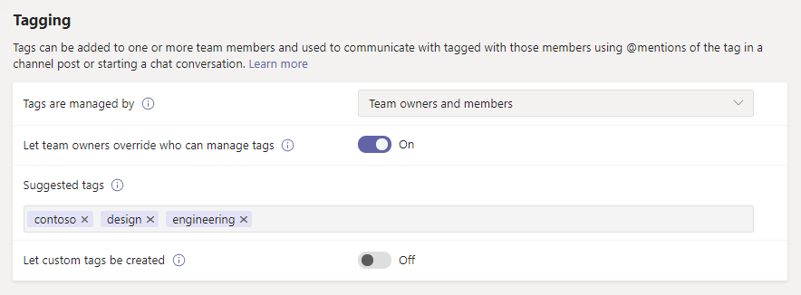

# Gestire i tag in Microsoft TeamsManage tags in Microsoft Teams

> [!NOTE]
> Una delle caratteristiche descritte in questo articolo, **contrassegnate per turno**, non è ancora stata rilasciata.One of the features discussed in this article, **tagging by shift**, hasn't yet been released. È stata annunciata e arriverà presto.It's been announced, and it's coming soon.Se si è un amministratore, è possibile scoprire quando questa funzionalità verrà rilasciata nel centro messaggi (nell'interfaccia di [amministrazione di Microsoft 365](https://portal.office.com/adminportal/home)). If you're an admin, you can find out when this feature will be released in the Message Center (in the [Microsoft 365 admin center](https://portal.office.com/adminportal/home)). Per rimanere in primo piano sulle caratteristiche future per i team, consulta la [Roadmap di Microsoft 365](https://www.microsoft.com/microsoft-365/roadmap?filters=&searchterms=microsoft%2Cteams).To stay on top of upcoming Teams features, check out the [Microsoft 365 Roadmap](https://www.microsoft.com/microsoft-365/roadmap?filters=&searchterms=microsoft%2Cteams).

## PanoramicaOverview

I tag in Microsoft teams consentono agli utenti di connettersi in modo rapido e semplice con un sottoinsieme di persone in un team.Tags in Microsoft Teams let users quickly and easily connect with a subset of people on a team. È possibile creare e assegnare tag personalizzati per suddividere in categorie gli utenti in base agli attributi, ad esempio ruolo, progetto, abilità o posizione.You can create and assign custom tags to categorize people based on attributes, such as role, project, skill, or location. In alternativa, i tag possono essere assegnati automaticamente agli utenti in base alle informazioni relative a pianificazione e spostamento nell' [app turni](https://support.microsoft.com/office/apps-and-services-cc1fba57-9900-4634-8306-2360a40c665b?#PickTab=Shifts) (presto disponibile).Or, tags can be automatically assigned to people based on their schedule and shift information in the [Shifts app](https://support.microsoft.com/office/apps-and-services-cc1fba57-9900-4634-8306-2360a40c665b?#PickTab=Shifts) (coming soon). Dopo che un tag viene aggiunto a uno o più membri del team, può essere usato in @mentions da chiunque nel team in un post di canale o per avviare una conversazione solo con le persone a cui è stato assegnato il tag.After a tag is added to one or multiple team members, it can be used in @mentions by anyone on the team in a channel post or to start a conversation with only those people who are assigned that tag.

Come accennato in precedenza, esistono due tipi di tag in teams.As mentioned earlier, there are two kinds of tags in Teams.

- **Tag personalizzati**: i proprietari del team e i membri del team (se la funzionalità è abilitata per gli utenti) possono creare e assegnare manualmente tag alle persone.**Custom tags**: Team owners and team members (if the feature is enabled for them) can manually create and assign tags to people. Ad esempio, un tag "designer" o "radiologo" raggiungerà questi set di persone in un team senza dover digitare i loro nomi.For example, a "Designer" or "Radiologist" tag will reach those sets of people on a team without having to type their names.
- **Tagging per turno** (presto disponibile): con questa funzionalità, agli utenti vengono assegnati automaticamente i tag che corrispondono al nome del gruppo pianificazione e spostamento nell' [app turni](https://support.microsoft.com/office/get-started-in-shifts-5f3e30d8-1821-4904-be26-c3cd25a497d6#bkmk_openshiftsappdesktop) in teams.**Tagging by shift** (coming soon): With this feature, people are automatically assigned tags that match their schedule and shift group name in the [Shifts app](https://support.microsoft.com/office/get-started-in-shifts-5f3e30d8-1821-4904-be26-c3cd25a497d6#bkmk_openshiftsappdesktop) in Teams. Ad esempio, il tag "EngineerOnCall" raggiunge tutti gli ingegneri che sono programmati in turni per lavorare quando il tag viene usato in una chat o in un post di canale.For example, the "EngineerOnCall" tag reaches all engineers who are scheduled in Shifts to work at the time the tag is used in a chat or channel post. Con il contrassegno tramite turno, teams Elimina l'ipotesi di conoscere il nome del personale in turno quando gli utenti devono inoltrare rapidamente le informazioni.With tagging by shift, Teams takes the guesswork out of knowing the name of on-shift staff when users need to quickly relay information. Il tagging per turno può anche essere supportato dai principali sistemi di gestione della forza lavoro, come JDA, Kronos e AMiON, tramite l'integrazione con i turni in teams.Tagging by shift can also be backed by major workforce management systems like JDA, Kronos, and AMiON by integrating them with Shifts in Teams. Per altre informazioni su come configurare questa funzionalità, vedere Configurare la [codifica tramite Maiusc](#set-up-tagging-by-shift-coming-soon).To learn more about how to set up this feature, see [Set up tagging by shift](#set-up-tagging-by-shift-coming-soon).

> [!NOTE]
> I tag non sono ancora supportati nei canali privati.Tags are not yet supported in private channels. I tag non sono ancora disponibili nelle organizzazioni US Government community Cloud (GCC), GCC High o Department of Defense (DoD).Tags are not yet available in US Government Community Cloud (GCC), GCC High, or Department of Defense (DoD) organizations.

## Come funzionano i tagHow tags work

Un tag può essere aggiunto manualmente o assegnato automaticamente a una persona in un team specifico.A tag can be manually added or automatically assigned to a person on a specific team. Può quindi essere usato in @mentions nella riga **a** in una chat o in un post su qualsiasi canale standard del team.It can then be used in @mentions on the **To** line in a chat or in a post on any standard channel of the team. Ecco alcuni esempi di come i tag possono essere usati in teams:Here's some examples of how tags can be used in Teams:

- Un responsabile dello Store pubblica un annuncio su un canale per inviare una notifica a tutti i cassieri.A store manager posts an announcement to a channel to notify all cashiers.
- Un amministratore dell'ospedale Invia un messaggio a tutti i radiologi di un canale.A hospital administrator sends a message to all radiologists in a channel.
- Un responsabile marketing avvia una chat di gruppo con tutte le finestre di progettazione.A marketing manager starts a group chat with all designers.
- Un infermiere Invia un messaggio a tutti i cardiologi di chiamata.A nurse sends a message to all on-call cardiologists. (disponibile a breve)(coming soon)
- Un ingegnere di sistema pubblica un annuncio su un canale per inviare una notifica a tutti i tecnici del campo di spostamento.A system engineer posts an announcement to a channel to notify all on-shift field engineers. (disponibile a breve)(coming soon)

Quando un tag viene @mentioned in una conversazione di canale, i membri del team associati al tag riceveranno una notifica, come qualsiasi altra @mention.When a tag is @mentioned in a channel conversation, team members associated with the tag will get notified, just like any other @mention.

## Gestire i tag personalizzati per l'organizzazioneManage custom tags for your organization

Come amministratore, puoi controllare il modo in cui i tag vengono usati in tutta l'organizzazione nell'interfaccia di amministrazione di Microsoft teams.As an admin, you can control how tags are used across your organization in the Microsoft Teams admin center.

Un team può avere fino a 100 tag, fino a 100 i membri del team possono essere assegnati a un tag e può essere assegnato un massimo di 25 tag a un singolo utente.A team can have up to 100 tags, up to 100 team members can be assigned to a tag, and up to 25 tags can be assigned to a single user. 

### Impostare gli utenti che possono aggiungere tag personalizzatiSet who can add custom tags

Per impostazione predefinita, i proprietari del team possono aggiungere tag personalizzati.By default, team owners can add custom tags. È possibile modificare questa impostazione per consentire ai proprietari del team e ai membri del team di creare, modificare, eliminare e gestire i tag oppure disattivare i tag per l'organizzazione.You can change this setting to allow team owners and team members to create, edit, delete, and manage tags or you can turn off tags for your organization.

1. Nella barra di spostamento sinistra dell'interfaccia di amministrazione di Microsoft teams, fare clic su impostazioni **di Team impostazioni a livello di organizzazione**  >  **Teams settings**.In the left navigation of the Microsoft Teams admin center, click **Org-wide settings** > **Teams settings**.
2. In **contrassegno**, accanto a **tag gestiti da**, selezionare una delle opzioni seguenti:Under **Tagging**, next to **Tags are managed by**, select one of the following options:

    - **Proprietari e membri del team**: consentire ai proprietari e ai membri del team di gestire i tag.**Team owners and members**: Allow team owners and members to manage tags.
    - **Proprietari del team**: consentire ai proprietari del team di gestire i tag.**Team owners**: Allow team owners to manage tags.
    - **Disabilitato**: disattivare i contrassegni.**Disabled**: Turn off tags.

### Configurare le impostazioni di tag personalizzatiConfigure custom tags settings

Puoi configurare le impostazioni dei tag seguenti per controllare il modo in cui i tag personalizzati vengono usati nell'organizzazione.You can configure the following tags settings to control how custom tags are used across your organization.

1. Nella barra di spostamento sinistra dell'interfaccia di amministrazione di Microsoft teams, fare clic su impostazioni **di Team impostazioni a livello di organizzazione**  >  **Teams settings**.In the left navigation of the Microsoft Teams admin center, click **Org-wide settings** > **Teams settings**.
2. In **tagging**impostare le operazioni seguenti in base alle esigenze dell'organizzazione.Under **Tagging**, set the following, depending on the needs of your organization.

    - **Consentire ai proprietari del team di ignorare chi può gestire i tag**: quando si attiva questa impostazione, i proprietari del team possono impostare se i membri del team possono creare e gestire i tag all'interno di un team e il valore dei **tag viene gestito** impostando il valore predefinito per ogni team.**Let team owners override who can manage tags**: When you turn on this setting, team owners can set whether team members can create and manage tags within a team and the value of the **Tags are managed by** setting is the default value for each team. Se si disattiva questa impostazione, i **tag vengono gestiti** impostando non può essere modificata per ogni team.If you turn off this setting, the **Tags are managed by** setting can't be changed per team.
    - **Tag predefiniti suggeriti**: usare questa opzione per aggiungere un set di tag predefiniti.**Suggested default tags**: Use this to add a set of default tags. È possibile aggiungere fino a 25 tag e ogni tag può contenere un massimo di 25 caratteri.You can add up to 25 tags, and each tag can contain a maximum of 25 characters. I proprietari e i membri del team (se la funzionalità è abilitata) possono usare questi suggerimenti, aggiungerli o creare un nuovo set di tag.Team owners and members (if the feature is enabled for them) can use these suggestions, add to them, or create a new set of tags.
    - **Consentire la creazione di tag personalizzati**: attivare questa impostazione per consentire agli utenti di aggiungere tag diversi dai tag predefiniti suggeriti impostati.**Let custom tags be created**: Turn on this setting to let people add tags other than the suggested default tags that you set. Se questa opzione è disattivata, gli utenti possono usare solo i tag predefiniti suggeriti.If this is turned off, people can only use the suggested default tags. Se si disattiva questa opzione, assicurarsi di aggiungere uno o più tag predefiniti.If you turn this off, make sure that you add one or more default tags.

## Gestire le impostazioni dei tag personalizzati per un teamManage custom tags settings for a team

Se è stata attivata l'opzione **consentire ai proprietari del team di ignorare chi può gestire** le impostazioni dei tag nell'interfaccia di amministrazione di Microsoft teams, i proprietari del team possono impostare se i membri possono aggiungere tag a livello di team.If you turned on the **Let team owners override who can manage tags** setting in the Microsoft Teams admin center, team owners can set whether members can add tags at the team level. A questo scopo, nella scheda **Impostazioni** di un team passa a **tag**e quindi scegli chi può aggiungere i tag.To do this, on the **Settings** tab for a team, go to **Tags**, and then choose who can add tags.

## Usare i tagUse tags

Ecco come aggiungere tag personalizzati e come configurare i contrassegni per turno (se si usa l'app turni in teams).Here's how to add custom tags and how to set up tagging by shift (if you're using the Shifts app in Teams). Per altre informazioni, vedere [usare i contrassegni in teams](https://support.office.com/article/using-tags-in-teams-667bd56f-32b8-4118-9a0b-56807c96d91e).To learn more, check out [Using tags in Teams](https://support.office.com/article/using-tags-in-teams-667bd56f-32b8-4118-9a0b-56807c96d91e).

### Creare e assegnare tag personalizzatiCreate and assign custom tags

Per creare e assegnare tag personalizzati, selezionare **Teams** sul lato sinistro dell'app e quindi trovare il team nell'elenco.To create and assign custom tags, select **Teams** on the left side of the app, and then find your team in the list. Selezionare **˙ ˙ ˙ altre opzioni**e quindi scegliere **Gestisci contrassegni**.Select **˙˙˙ More options**, and then choose **Manage tags**. In questo caso, è possibile creare i tag e assegnarli agli utenti del team.Here, you can create tags and assign them to people on your team.

Per eliminare un contrassegno, selezionare **˙ ˙ ˙ altre opzioni** accanto al tag e quindi selezionare **Elimina contrassegno**.To delete a tag, select **˙˙˙ More options** next to the tag, and then select **Delete tag**.

### Configurare la codifica per turno (presto disponibile)Set up tagging by shift (coming soon)

1. In teams passare all' [app turni](https://support.microsoft.com/office/get-started-in-shifts-5f3e30d8-1821-4904-be26-c3cd25a497d6#bkmk_openshiftsappdesktop).In Teams, go to the [Shifts app](https://support.microsoft.com/office/get-started-in-shifts-5f3e30d8-1821-4904-be26-c3cd25a497d6#bkmk_openshiftsappdesktop).
2. Creare [gruppi di turni](https://support.microsoft.com/office/fill-out-a-schedule-in-shifts-2d58df9b-1c6c-4c84-b0c3-835de7ad13ea#bkmk_organizeshiftsbygroup) e denominarli dopo un attributo, ad esempio un ruolo.Create [shift groups](https://support.microsoft.com/office/fill-out-a-schedule-in-shifts-2d58df9b-1c6c-4c84-b0c3-835de7ad13ea#bkmk_organizeshiftsbygroup) and name them after an attribute such as a role. Ad esempio, EngineerOnCall.For example, EngineerOnCall. Il nome del gruppo maiuscole sarà il nome del tag.The shift group name will be the name of the tag.
3. [Compilare una programmazione](https://support.microsoft.com/office/fill-out-a-schedule-in-shifts-2d58df9b-1c6c-4c84-b0c3-835de7ad13ea) assegnando i turni ai membri del team.[Fill out a schedule](https://support.microsoft.com/office/fill-out-a-schedule-in-shifts-2d58df9b-1c6c-4c84-b0c3-835de7ad13ea) by assigning shifts to members of you teams. Al termine, nell'angolo in alto a destra dell'app turni selezionare **Condividi con Team**.When you're finished, in the upper-right corner of the Shifts app, select **Share with team**.
4. Attendere 15 minuti per i turni pianificati per popolare il servizio di tagging.Wait 15 minutes for the scheduled shifts to populate the tagging service.
5. Usa il tag ovunque usi i tag in teams.Use the tag anywhere you use tags in Teams.

La codifica tramite Shift consente agli utenti di raggiungere i turni di persone in tempo reale.Tagging by shift allows your users to reach the people on-shift in real time. Le notifiche vengono inviate solo alle persone che si trovano in turno quando viene usato un tag per avviare una chat o in un post di canale.Notifications are sent only to those people who are on shift at the time a tag is used to start a chat or in a channel post.

## Argomenti correlatiRelated topics

[Uso di tag in teamsUsing tags in Teams](https://support.office.com/article/using-tags-in-teams-667bd56f-32b8-4118-9a0b-56807c96d91e)

[Gestire l'app Turni per l'organizzazione in TeamsManage the Shifts app for your organization in Teams](expand-teams-across-your-org/shifts/manage-the-shifts-app-for-your-organization-in-teams.md)

[Sposta la documentazione della GuidaShifts Help documentation](https://support.microsoft.com/office/apps-and-services-cc1fba57-9900-4634-8306-2360a40c665b)
