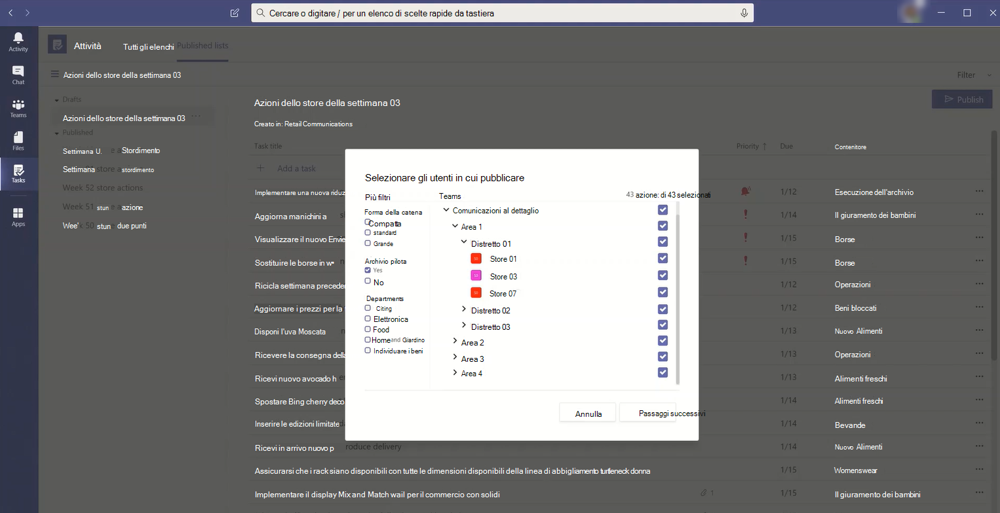
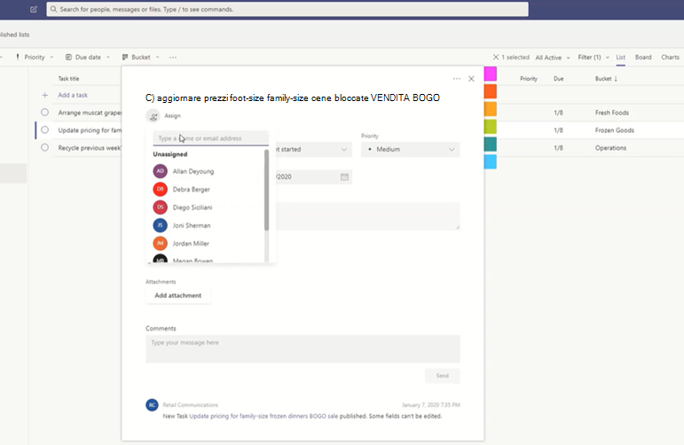
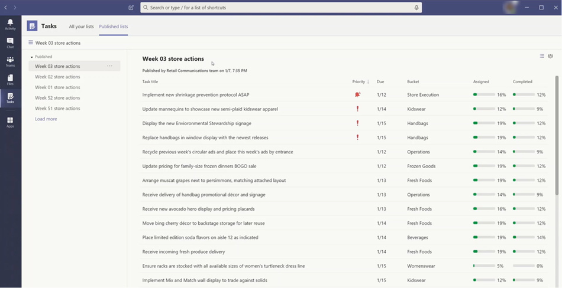

# Gestire l'app Tasks per l'organizzazione in Microsoft Teams

## Panoramica di Tasks

L'app Tasks offre un'esperienza di gestione delle attività coesiva in Microsoft Teams, integrando singole attività basate su [Microsoft To Do](https://todo.microsoft.com/tasks/) e attività del team basate su Planner in un unico posto. Gli utenti possono accedere all’app Tasks sul lato sinistro di Teams e come scheda in un canale all'interno di singoli team. Con **Attività personali** e **Piani condivisi**, gli utenti possono visualizzare e gestire tutte le attività personali e del team e assegnare priorità al lavoro. Tasks è disponibile nei client desktop, Web e per dispositivo mobile di Teams.

> [!NOTE]
> Man mano che Tasks viene implementata nei client desktop di Teams, inizialmente il nome dell'app sarà **Planner**. Il nome cambierà temporaneamente in **Tasks di Planner e To Do** e in seguito sarà chiamata **Tasks**. Sui client Teams per dispositivo mobile il nome dell’app sarà sempre **Tasks**. Potrebbe esserci un leggero ritardo nella disponibilità della versione per dispositivo mobile dopo che la versione desktop diventa disponibile.

   

Per le organizzazioni che vogliono semplificare la gestione delle attività per i dipendenti in prima linea, Tasks include anche funzionalità che consentono di indirizzare, pubblicare e tenere traccia delle attività su larga scala di tutto il personale in prima linea. Ad esempio, la leadership aziendale e regionale può creare e pubblicare elenchi di attività destinati per specifiche luoghi, come negozi al dettaglio, e monitorare i progressi attraverso rapporti in tempo reale. I manager possono assegnare attività al proprio personale e dirigere le attività all'interno delle loro sedi. In questo modo i dipendenti in prima linea avranno una lista delle priorità delle attività assegnate su dispositivo mobile o desktop. Per abilitare [la pubblicazione delle attività](#task-publishing), configurare prima di tutto una gerarchia di assegnazione team per l'organizzazione, che definisce il modo in cui tutti i team della gerarchia sono correlati tra loro.

## Informazioni necessarie riguardo Tasks

Tasks è disponibile sia come app che come scheda in un canale. L'app mostra sia le singole attività di To Do che le attività del team di Planner. La scheda mostra solo le attività del team.

Con Tasks, gli utenti ottengono un'esperienza desktop, Web e per dispositivi mobili. Se Tasks è installato nel client desktop di Teams, gli utenti lo vedranno anche nei client Web e per dispositivo mobile di Teams. L'eccezione è guest. È importante sapere che i gli utenti guest possono accedere solo all’app Tasks dal client per dispositivi mobili Teams. Gli utenti guest visualizzeranno le schede Tasks nei client desktop e Web di Teams.

**Mie attività** mostra le singole attività di un utente. **Piani condivisi** mostra le attività su cui sta lavorando l'intero team e include gli elenchi attività aggiunti come scheda Tasks a un canale. Si noti le relazioni seguenti tra le attività in Attività, To Do e Planner:

- Gli elenchi attività che un utente crea nell’app Tasks verranno visualizzati nei client To Do per quell’utente. Analogamente, gli elenchi attività che un utente crea in To Do verranno visualizzati nelle **Mie attività** in Tasks per quell’utente. Lo stesso vale per le singole attività.

- Le schede Tasks aggiunte a un canale verranno anche visualizzate nei client Planner. Quando un utente crea un piano in Planner, il piano non verrà visualizzato nell'app Tasks o Planner, a meno che non venga aggiunto come scheda a un canale. Quando un utente aggiunge una nuova scheda Tasks, può creare un nuovo elenco, piano o sceglierne uno già esistente.

## Configurare Tasks

> [!IMPORTANT]
> Le impostazioni e i criteri configurati per Planner verranno applicati anche a Tasks.

### Abilitare o disabilitare Tasks nell'organizzazione

Tasks è abilitato per impostazione predefinita per tutti gli utenti di Teams nell’organizzazione. È possibile disattivare o attivare l'app a livello di organizzazione nella pagina [Gestisci app](manage-apps.md) nell'interfaccia di amministrazione di Microsoft Teams.

1. Nel riquadro sinistro dell'interfaccia di amministrazione di Microsoft Teams passare a **Teams** **appGesti** >  app.
2. Nell'elenco delle app eseguire una delle operazioni seguenti:

    - Per disattivare Attività per l'organizzazione, cercare l'app Attività, selezionarla e quindi selezionare **Blocca**.
    - Per attivare Attività per l'organizzazione, cercare l'app Attività, selezionarla e quindi selezionare **Consenti**.

> [!NOTE]
> Se non è possibile trovare l’app Tasks, cercare i nomi nella prima nota di questo articolo. L'app potrebbe essere ancora in fase di ridenominazione.

### Abilitare o disabilitare Tasks per utenti specifici nell'organizzazione

Per consentire o bloccare l'uso di Tasks a utenti specifici dell'organizzazione, verificare che sia stato attivato per l'organizzazione nella pagina [Gestisci app](manage-apps.md) e quindi creare criteri di autorizzazione per le app personalizzati da assegnare a tali utenti. Per altre informazioni, vedere [Gestire i criteri di autorizzazione delle app in teams](teams-app-permission-policies.md).

### Usare un criterio di configurazione dell'app per aggiungere Tasks a Teams

I criteri di configurazione delle app consentono di personalizzare Teams per evidenziare le app più importanti per gli utenti dell'organizzazione. Le app impostate in un criterio vengono aggiunte alla barra dell'app, ovvero la barra sul lato del client desktop Teams e nella parte inferiore del Teams client per dispositivi mobili, in cui gli utenti possono accedervi rapidamente e facilmente.

Per aggiungere l'app Tasks agli utenti, è possibile modificare i criteri globali (impostazione predefinita a livello di organizzazione) oppure creare e assegnare criteri di configurazione dell'app personalizzati. Per altre informazioni, vedere [Gestire i criteri di configurazione delle app in teams](teams-app-setup-policies.md).

### Le Mie attività di un utente sono visibili se l’utente ha una licenza Exchange Online

Se non si vuole consentire a un utente di visualizzare le **Mie attività**, è possibile nasconderl0. Per nascondere **Le mie attività**, [rimuovere la licenza di Exchange Online dell'utente](/microsoft-365/admin/manage/remove-licenses-from-users). È importante sapere che, dopo aver rimosso una licenza di Exchange Online, l'utente non ha più accesso alla propria cassetta postale.  I dati della cassetta postale vengono mantenuti per 30 giorni, dopo i quali i dati verranno rimossi e non potranno essere recuperati a meno che la cassetta postale non venga impostata su [Blocco sul posto o Blocco per controversia legale](/exchange/security-and-compliance/in-place-and-litigation-holds).

Non è consigliabile rimuovere una licenza di Exchange Online per gli information worker, ma in alcuni scenari è possibile nascondere **le attività personali** in questo modo, ad esempio per gli operatori sul campo che non dipendono dalla posta elettronica.

## Pubblicazione di attività

Grazie alla pubblicazione di attività, l’organizzazione può pubblicare elenchi di attività mirati a posizioni specifiche (team) all'interno dell'organizzazione per definire e condividere un piano di lavoro da completare in tali posizioni.

- Le persone che fanno parte del team di pubblicazione, come la leadership aziendale o regionale, possono creare elenchi di attività e pubblicarli in team specifici.
    
- I manager dei team destinatari possono esaminare gli elenchi di attività pubblicati e assegnare singole attività ai membri del team.
    
- Per i dipendenti in prima linea la visualizzazione delle attività su dispositivo mobile è molto semplice. Possono allegare foto per mostrare il loro lavoro e contrassegnare le loro attività come completate.
- Gli editori e i manager possono visualizzare i report per vedere lo stato di assegnazione e completamento delle attività a ogni livello, anche per posizione (team), elenco attività e attività individuale.
    

Gli utenti creano, gestiscono e pubblicano elenchi attività nella scheda **Elenchi pubblicati** nell'app Tasks. Questa scheda viene visualizzata solo per un utente se l’organizzazione ha [impostato una gerarchia di destinazione per team](#set-up-your-team-targeting-hierarchy) e l'utente fa parte di un team incluso nella gerarchia. La gerarchia determina se l'utente può pubblicare o ricevere elenchi attività e visualizzare i report per gli elenchi ricevuti.

### Scenario di esempio

Di seguito c’è un esempio del funzionamento della pubblicazione di attività.

Contoso sta lanciando una nuova promozione su cibo da asporto e consegna. Per mantenere un’esperienza del marchio coerente, bisogna coordinare il lancio in oltre 300 punti vendita.

Il team di marketing condivide i dettagli della promozione e il corrispondente elenco di attività con manager della comunicazione per la vendita al dettaglio. Il gestore delle comunicazioni di vendita al dettaglio, che funge da guardiano dei negozi, esamina le informazioni. Crea quindi un elenco attività per la promozione e crea un'attività per ogni unità di lavoro che deve essere eseguita dagli archivi interessati. Al termine dell'elenco attività, è necessario selezionare i negozi che devono completare il lavoro. In questo caso, la promozione si applica solo ai negozi negli Stati Uniti che hanno un ristorante al loro interno. In Attività filtrano l'elenco negozio in base all'attributo ristorante in negozio, selezionano le posizioni di Stati Uniti corrispondenti nella gerarchia e quindi pubblicano l'elenco attività in tali negozi.

I responsabili dei negozi in ogni sede ricevono una copia delle attività pubblicate e assegnano tali attività ai membri del proprio team. I manager possono usare Tasks per comprendere tutto ciò che c’è da fare nel loro negozio. Possono anche usare i filtri disponibili per concentrarsi su un insieme di lavori specifici, come quelli in scadenza o in una determinata area.

I dipendenti in prima linea di ogni negozio avranno un elenco di priorità in Tasks, che possono consultare dal proprio dispositivo mobile. Quando terminano un'attività, la contrassegnano come completata. Possono anche scegliere di caricare e allegare una foto all'attività per mostrare il loro lavoro.

I manager della sede centrale di Contoso possono visualizzare i report per vedere l'assegnazione e lo stato di completamento delle attività in ogni negozio. Possono anche focalizzarsi su un'attività specifica per visualizzare lo stato all'interno di diversi negozi. Con l'avvicinarsi della data di lancio, possono individuare eventuali anomalie e, se necessario, controllare il tutto con i loro team. Tutto ciò consente a Contoso di migliorare l'efficienza del lancio e fornire un'esperienza più equa in tutti i negozi.

### Configurare la gerarchia di destinazione del team

Per abilitare la pubblicazione di attività nell'organizzazione, è necessario configurare lo schema di destinazione del team in un file CSV. Lo schema definisce il modo in cui tutti i team della gerarchia sono correlati tra loro e definisce anche gli attributi che possono essere usati per filtrare e selezionare i team. Dopo aver creato lo schema, bisogna caricarlo in Teams per applicarlo all'organizzazione. I membri del team di pubblicazione, come il manager della comunicazione per la vendita al dettaglio, possono filtrare i team per gerarchia, attributi o una combinazione di entrambi al fine di selezionare i team pertinenti che devono ricevere gli elenchi attività e in seguito pubblicare gli elenchi attività in quei team.

Per le istruzioni su come configurare la gerarchia di destinazione del team, vedere [Configurare la gerarchia di destinazione del team](set-up-your-team-hierarchy.md).

## Power Automate e API Graph

Tasks supporta Power Automate per To Do e le API Graph per Planner. Per altre informazioni, vedere:

- [Panoramica delle attività e dei piani dell’API Planner](/graph/planner-concept-overview)
- [Uso di Microsoft To-Do con Power Automate](https://support.office.com/article/using-microsoft-to-do-with-power-automate-526e8f75-217b-46e0-9e06-44780b72c295)
