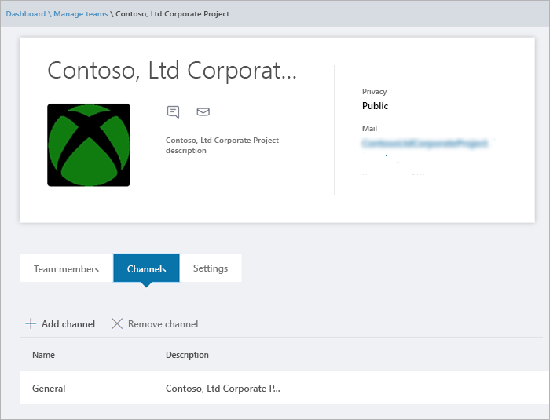

Gestire team nell'interfaccia di amministrazione di Microsoft Teams
==========================================

## Panoramica

In qualità di amministratore IT, potrebbe essere necessario visualizzare o aggiornare i team che l'organizzazione ha configurato per la collaborazione o può essere necessario eseguire azioni correttive come l'assegnazione di proprietari per team non proprietari. Puoi gestire i team usati nell'organizzazione tramite il modulo Microsoft teams PowerShell e l'interfaccia di amministrazione di Microsoft teams. Per le funzionalità di amministrazione complete che usano questi due set di strumenti, è necessario assicurarsi che sia stato assegnato uno dei ruoli seguenti:

- Amministratore globale
- Amministratore del servizio Teams

Per altre informazioni sui ruoli di amministratore in teams, è possibile [usare i ruoli di amministratore di Microsoft teams per gestire i team](using-admin-roles.md)e altre informazioni su come usare i cmdlet di PowerShell per la gestione dei team nel [riferimento ai cmdlet di Microsoft teams](https://docs.microsoft.com/powershell/teams/?view=teams-ps).  

Questo articolo offre una panoramica degli strumenti di gestione per i team nell'interfaccia di amministrazione di Microsoft teams.

## Griglia Panoramica Teams

Gli strumenti di gestione per i team **** sono inclusi nel nodo teams nell'interfaccia di amministrazione di Microsoft teams. Nell'interfaccia di amministrazione selezionare teams **** > **Manage teams**. Ogni team è supportato da un gruppo di Office 365 e questo nodo offre una visualizzazione dei gruppi che sono stati abilitati da Microsoft teams nell'organizzazione.

  

La griglia Visualizza le proprietà seguenti:

- **Nome del team**
- **Channels** : numero di tutti i canali del team, incluso il canale generale predefinito.
- **Utenti** : numero totale di utenti, inclusi proprietari, Guest e membri del tenant.
- **Proprietari** -numero di proprietari per il team.
- **Clienti** -numero di utenti guest di Azure Active Directory B2B che sono membri di questo team.
- **Privacy** -visibilità/AccessType del gruppo di Office 365 di supporto.
- **Stato** : lo stato archiviato o attivo per il team.  Altre informazioni sull'archiviazione dei team nell' [archivio o sul ripristino di un team](https://support.office.com/article/archive-or-restore-a-team-dc161cfd-b328-440f-974b-5da5bd98b5a7).
- **GroupID** -il GroupID univoco del gruppo di Office 365 di supporto
- **Classificazione** : classificazione (se usata nell'organizzazione) assegnata al gruppo di Office 365 di supporto.  Leggi altre informazioni sulle classificazioni in [creare classificazioni per i gruppi di Office nell'organizzazione](https://docs.microsoft.com/office365/enterprise/powershell/manage-office-365-groups-with-powershell#create-classifications-for-office-groups-in-your-organization).
- **Descrizione** : set di descrizioni per il gruppo di backup di Office 365

### Ricerca

La ricerca attualmente supporta la stringa "inizia con" e cerca il campo **nome Team** .

### Modifica

È possibile modificare le impostazioni specifiche del gruppo e del team selezionando un team dalla griglia e quindi selezionando il pulsante **modifica** .

## Profilo del team

È possibile passare alla pagina del profilo del team di un team dalla griglia Panoramica di team principali facendo clic sul nome del team. La pagina del profilo del team Mostra i membri, i proprietari e gli ospiti che appartengono al team (e il relativo gruppo di Office 365 di supporto), nonché i canali e le impostazioni del team. Nella pagina del profilo del team è possibile:

- Aggiungere o rimuovere membri e proprietari.
- Aggiungere o rimuovere canali (si noti che non è possibile rimuovere il canale generale).
- Aggiornare le impostazioni del team e del gruppo.
 

## Apportare modifiche ai team

È possibile modificare gli elementi seguenti di un team:
- **Utenti del team** : è possibile aggiungere o rimuovere membri e promuovere o abbassare di livello i proprietari
- **Canali** : è possibile aggiungere nuovi canali o rimuovere i canali esistenti.  Non è possibile eliminare il canale "generale" predefinito e, una volta creato, è possibile modificare solo il nome del canale e non la descrizione.
- **Nome del team**
- **Descrizione del team**
- **Privacy del team** -pubblico o privato
- **Classificazione del team** -supportato dalle classificazioni dei gruppi di Office 365
- **Impostazioni** per i membri del team: selezionare impostazioni membro del team

## Altre modifiche supportate ai team

- **Elimina** -l'eliminazione di un team è un'eliminazione morbida del team e del gruppo di Office 365 corrispondente.  Per ripristinare un team eliminato erroneamente, seguire le istruzioni riportate in [ripristinare un gruppo di Office 365 eliminato](https://docs.microsoft.com/office365/admin/create-groups/restore-deleted-group?view=o365-worldwide).
- **Archivio** -archiviazione un team inserisce il team in modalità di sola lettura all'interno di Microsoft teams.  L'amministratore può archiviare e disarchiviare team per conto dell'organizzazione tramite il portale di amministrazione.

Le modifiche apportate a un team vengono registrate. Se si modificano le impostazioni di gruppo (modificando il nome, la descrizione, la foto, la privacy, la classificazione o i membri del team), queste modifiche verranno attribuite all'utente tramite la pipeline di controllo. Se si eseguono azioni per le impostazioni specifiche di un team, le modifiche verranno rilevate e attribuite all'utente nel canale generale del team.

## Risoluzione dei problemi

**Problema: team mancanti nella griglia di panoramica del team**

Quando si immette l'interfaccia di amministrazione di Microsoft teams **** , sotto l'opzione teams alcuni dei team mancanti nell'elenco nella griglia Panoramica teams.

**Causa**: questo problema si verifica quando il team è stato in modo non corretto (o non ancora) profilato dal sistema, che può causare una proprietà mancante che venga riconosciuta.

**Risoluzione: impostare manualmente la proprietà sul valore corretto tramite MS Graph**

Sostituire **{GroupID}** nella query per l'effettivo GroupID in questione, che è possibile ottenere tramite la PowerShell di Exchange Online, con il cmdlet **"[Get-UnifiedGroup](https://docs.microsoft.com/powershell/module/exchange/users-and-groups/get-unifiedgroup?view=exchange-ps)"** , come attributo "**ExternalDirectoryObjectId**".

1. [Esplora grafico](https://developer.microsoft.com/en-us/graph/graph-explorer) di Access

2. Accedere a Esplora grafici nel menu a sinistra

3. Cambiare la riga della query in: PATCH > v 1.0 >https://graph.microsoft.com/v1.0/groups/{groupid}

4. Aggiungere il valore seguente nel corpo della richiesta: {"resourceProvisioningOptions": ["team"]}

5. Eseguire la query in alto a destra.

6. Verificare che il team sia correttamente visualizzato nell'interfaccia di amministrazione di Microsoft teams-Panoramica del team

## Ulteriori informazioni

[Informazioni di riferimento sui cmdlet di Microsoft Teams](https://docs.microsoft.com/powershell/teams/?view=teams-ps)  
[Ruoli di amministratore in Microsoft Teams](using-admin-roles.md)
<!--
[Plan for Teams Lifecycle Management](plan-for-teams-lifecycle-management.md)
-->

