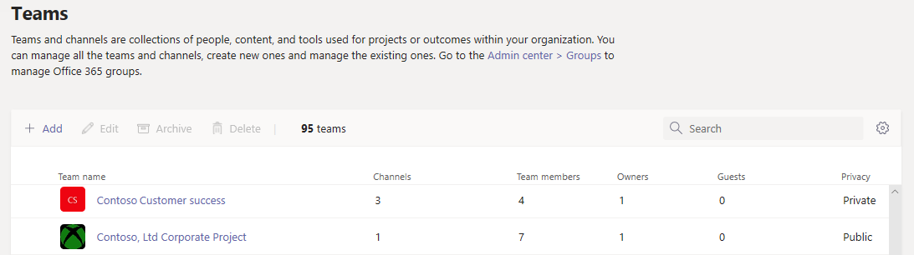

Gestire team nell'interfaccia di amministrazione di Microsoft Teams
==========================================

## Panoramica

Questo articolo offre una panoramica degli strumenti di gestione per i team nell'interfaccia di amministrazione di Microsoft teams.

Come amministratore, potrebbe essere necessario visualizzare o aggiornare i team configurati dall'organizzazione per la collaborazione oppure eseguire azioni correttive come l'assegnazione di proprietari per team non proprietari. Puoi gestire i team usati nell'organizzazione tramite il modulo Microsoft teams PowerShell e l'interfaccia di amministrazione di Microsoft teams. È possibile accedere all'interfaccia di amministrazione <a href="https://go.microsoft.com/fwlink/p/?linkid=2024339" target="_blank">https://admin.microsoft.com</a> . Per le funzionalità di amministrazione complete che usano questi due set di strumenti, è necessario assicurarsi che sia stato assegnato uno dei ruoli seguenti:

- Amministratore globale
- Amministratore del servizio Teams

Per altre informazioni sui ruoli di amministratore in teams, è possibile [usare i ruoli di amministratore di Microsoft teams per gestire i team](using-admin-roles.md)e altre informazioni su come usare i cmdlet di PowerShell per la gestione dei team nel [riferimento ai cmdlet di Microsoft teams](https://docs.microsoft.com/powershell/teams/?view=teams-ps).

## Griglia Panoramica Teams

Gli strumenti di gestione per i team sono inclusi nel nodo **Teams** nell'interfaccia di amministrazione di Microsoft teams. Nell'interfaccia di amministrazione selezionare **Teams**  >  **Gestire teams**.) Ogni team è supportato da un gruppo Microsoft 365 e questo nodo offre una visualizzazione dei gruppi che sono stati abilitati da Microsoft teams nell'organizzazione.

  

La griglia Visualizza le proprietà seguenti:

- **Nome del team**
- **Channels** : numero di tutti i canali del team, incluso il canale generale predefinito.
- **Membri del team** -numero totale di utenti, inclusi proprietari, Guest e membri del tenant.
- **Proprietari** -numero di proprietari per il team.
- **Clienti** -numero di utenti guest di Azure Active Directory B2B che sono membri di questo team.
- **Privacy** -visibilità/AccessType del gruppo Microsoft 365 di supporto.
- **Stato** : lo stato archiviato o attivo per il team. Leggi altre informazioni sull'archiviazione di teams in [Archive o su come ripristinare un team](https://support.office.com/article/archive-or-restore-a-team-dc161cfd-b328-440f-974b-5da5bd98b5a7).
- **Descrizione** : Descrizione del gruppo Microsoft 365 di supporto.
- **Classificazione** : classificazione (se usata nell'organizzazione) assegnata al gruppo Microsoft 365 di supporto. Leggi altre informazioni sulle classificazioni in [creare classificazioni per i gruppi di Office nell'organizzazione](https://docs.microsoft.com/office365/enterprise/powershell/manage-office-365-groups-with-powershell#create-classifications-for-office-groups-in-your-organization).
- **GroupID** : GroupID univoco del gruppo Microsoft 365 di supporto.

> [!NOTE]
> Se non sono visualizzate tutte queste proprietà nella griglia, fare clic sull'icona **modifica colonne** . Nel riquadro **modifica colonne** è possibile usare gli interruttori per attivare o disattivare le colonne nella griglia. Al termine, fare clic su **applica**.

### Aggiungere

Per aggiungere un nuovo team, fare clic su **Aggiungi**. Nel riquadro **Aggiungi un nuovo team** assegna al team un nome e una descrizione, imposta se vuoi renderlo un team privato o pubblico e imposta la classificazione.

### Modifica

Per modificare le impostazioni specifiche per il gruppo e il team, selezionare il team facendo clic a sinistra del nome del team e quindi selezionare **modifica**.

### Archivio

È possibile archiviare un team. L'archiviazione di un team inserisce il team in modalità di sola lettura all'interno di teams. L'amministratore può archiviare e annullare l'archiviazione di team per conto della propria organizzazione nell'interfaccia di amministrazione. 

### Eliminare

L'eliminazione di un team è un'eliminazione morbida del team e del gruppo Microsoft 365 corrispondente. Per ripristinare un team eliminato erroneamente, seguire le istruzioni in [ripristinare un gruppo eliminato](https://docs.microsoft.com/microsoft-365/admin/create-groups/restore-deleted-group).

### Ricerca

La ricerca attualmente supporta la stringa "inizia con" e cerca il campo **nome Team** .

## Profilo del team

È possibile passare alla pagina del profilo del team di un team dalla griglia Panoramica di team principali facendo clic sul nome del team. La pagina del profilo del team Mostra i membri, i proprietari e gli ospiti che appartengono al team (e il suo supporto Microsoft 365 Group), nonché i canali e le impostazioni del team. Nella pagina del profilo del team è possibile:

- Aggiungere o rimuovere membri e proprietari.
- Aggiungere o rimuovere canali (si noti che non è possibile rimuovere il canale generale).
- Modificare le impostazioni del team e del gruppo.
 

## Apportare modifiche ai team

Nella pagina del profilo del team è possibile modificare gli elementi seguenti di un team:

- **Membri** : aggiungere o rimuovere membri e promuovere o abbassare di livello i proprietari.
- **Canali** : aggiungere nuovi canali e modificare o rimuovere i canali esistenti. Tenere presente che non è possibile eliminare il canale generale predefinito.
- **Nome del team**
- **Descrizione**
- **Privacy** : specificare se il team è pubblico o privato.
- **Classificazione** : è supportato dalle classificazioni del gruppo Microsoft 365. Scegliere **riservate**, **altamente riservate**o **generali**.
- **Impostazioni conversazioni** -imposta se i membri possono modificare ed eliminare i messaggi inviati.
- **Impostazioni canali** : imposta se i membri possono creare nuovi canali e modificare quelli esistenti e aggiungere, modificare e rimuovere schede, connettori e app.

Le modifiche apportate a un team vengono registrate. Se si modificano le impostazioni di gruppo (modificando il nome, la descrizione, la foto, la privacy, la classificazione o i membri del team), le modifiche vengono attribuite all'utente tramite la pipeline di controllo. Se si eseguono azioni per le impostazioni specifiche di un team, le modifiche vengono rilevate e attribuite all'utente nel canale generale del team.

## Risoluzione dei problemi

**Problema: team mancanti nella griglia di panoramica del team**

Alcuni dei team sono mancanti nell'elenco dei team nella griglia Panoramica teams.

**Causa**: questo problema si verifica quando il team è stato in modo non corretto (o non ancora) profilato dal sistema, che può causare una proprietà mancante che venga riconosciuta.

**Risoluzione: impostare manualmente la proprietà sul valore corretto tramite MS Graph**

Sostituire **{GroupID}** nella query per l'effettivo GroupID in questione, che è possibile ottenere tramite la PowerShell di Exchange Online, con il cmdlet **"[Get-UnifiedGroup](https://docs.microsoft.com/powershell/module/exchange/users-and-groups/get-unifiedgroup?view=exchange-ps)"** , come attributo "**ExternalDirectoryObjectId**".

1. [Esplora grafico](https://developer.microsoft.com/graph/graph-explorer)di Access.

2. Accedere a Esplora grafici nel menu a sinistra.

3. Modificare la riga della query in: PATCH > v 1.0 > https://graph.microsoft.com/v1.0/groups/{groupid} .

4. Aggiungere il valore seguente nel corpo della richiesta: {"resourceProvisioningOptions": ["team"]}.

5. Eseguire la query in alto a destra.

6. Verificare che il team sia correttamente visualizzato nell'interfaccia di amministrazione di Microsoft teams-Panoramica del team.

## Altre informazioni

- [Informazioni di riferimento sui cmdlet Teams](https://docs.microsoft.com/powershell/teams/?view=teams-ps)  
- [Usare i ruoli di amministratore teams per gestire Teams](using-admin-roles.md)
- [Pianificare la gestione del ciclo di vita in Teams](plan-teams-lifecycle.md)
