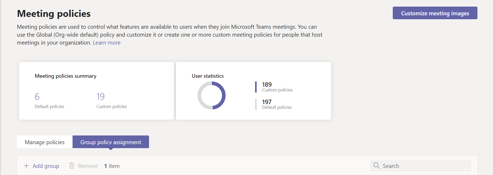
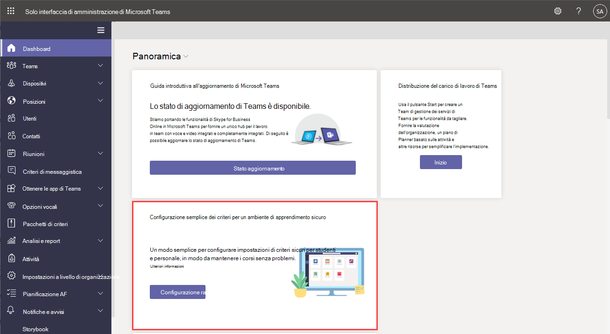

# Gestire Teams con i criteri

I criteri sono una parte importante della gestione Teams. Usare questo articolo per esplorare come usare i criteri a vantaggio dell'organizzazione.

## Per cosa si usano i criteri

I criteri vengono usati per eseguire molte attività nell'organizzazione in aree diverse, ad esempio messaggistica, riunioni e applicazioni. Alcune delle operazioni che è possibile eseguire includono consentire agli utenti di pianificare riunioni in un canale di teams, consentire agli utenti di modificare i messaggi inviati e controllare se gli utenti possono aggiungere app alla barra Teams app.

## Come assegnare criteri

I criteri possono essere assegnati in diversi modi, a seconda delle operazioni che l'organizzazione sta cercando di eseguire. È possibile eseguire e visualizzare le attività nell'Teams di amministrazione.

Per altre informazioni sull'assegnazione di [criteri, vedere](policy-assignment-overview.md).

## Come gestire i criteri

I criteri vengono gestiti con l'Microsoft Teams di amministrazione o [con PowerShell.](./teams-powershell-managing-teams.md#manage-policies-via-powershell)

Ad esempio, i criteri di configurazione delle app possono consentire agli utenti di caricare app personalizzate, installare app per conto degli utenti e aggiungere app alla barra Teams app. Questi criteri sono configurati nell'Teams di amministrazione.

Inoltre, i criteri di riunione possono essere usati per controllare le impostazioni audio e video nelle riunioni Teams, ad esempio trascrizioni, registrazioni cloud e audio/video IP.

### Teams per l'istruzione

È anche possibile usare la procedura [guidata Teams per l'istruzione criteri di](easy-policy-setup-edu.md) apprendimento per configurare e gestire facilmente i criteri per l'ambiente di apprendimento.

## Tipi di criteri

I criteri seguenti possono essere gestiti con Microsoft Teams.

Tipo di criterio | Descrizione
------------|------------
[Pacchetti di criteri](manage-policy-packages.md) | Un pacchetto di criteri in Microsoft Teams è una raccolta di criteri e impostazioni predefiniti che è possibile assegnare agli utenti con ruoli simili nell'organizzazione.
[Criteri riunione](meeting-policies-in-teams.md) | I criteri riunione vengono usati per controllare le funzionalità disponibili per i partecipanti alla riunione per le riunioni pianificate dagli utenti dell'organizzazione. I criteri delle riunioni includono gli argomenti seguenti.  - Criteri audio e video  - Criteri di condivisione del contenuto e dello schermo  - Partecipanti, guest e criteri di accesso  - Criteri generali
[Criteri vocali e chiamate](voice-and-calling-policies.md)| I criteri vocali e chiamate gestiscono queste impostazioni tramite team come chiamate di emergenza, routing delle chiamate e ID chiamante.
[Criteri delle app](app-policies.md)| I criteri delle app vengono usati per controllare le applicazioni in Microsoft Teams. Gli amministratori possono consentire o bloccare le app che gli utenti possono installare, aggiungere applicazioni alla barra delle app Teams di un utente e installare l'applicazione per conto degli utenti.
[Criteri di messaggistica](messaging-policies-in-teams.md)| I criteri di messaggistica controllano la disponibilità delle funzionalità di chat e canali.

## Argomenti correlati

* [Assegnare criteri in Teams - Guida introduttiva](policy-assignment-overview.md)
* [Gestire i criteri di feedback in Microsoft Teams](manage-feedback-policies-in-teams.md)
* [Gestire i criteri dei team in Microsoft Teams](teams-policies.md)
* [Configurare gli eventi live in Microsoft Teams](teams-live-events/set-up-for-teams-live-events.md)
* [Teams per l'istruzione criteri e pacchetti di criteri](policy-packages-edu.md)