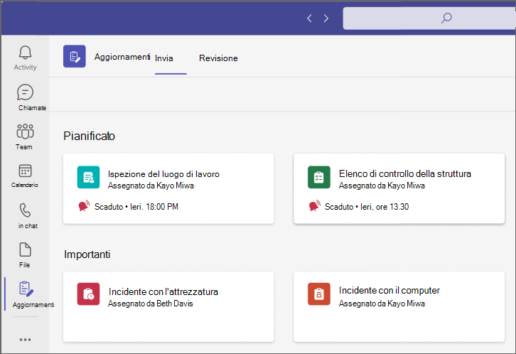
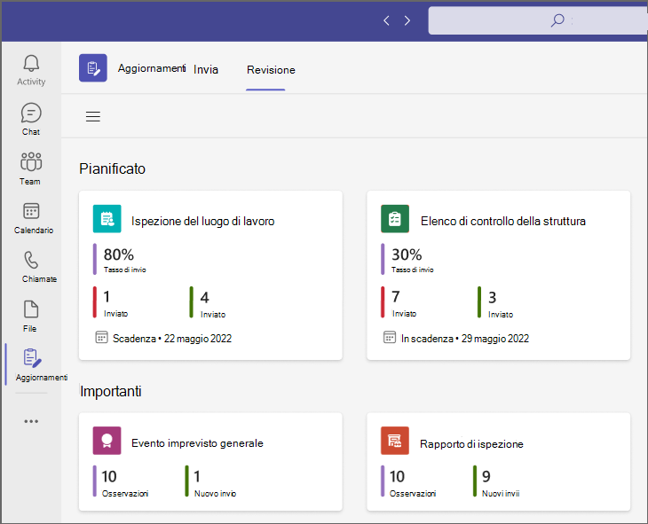
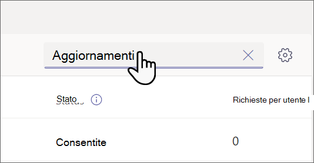
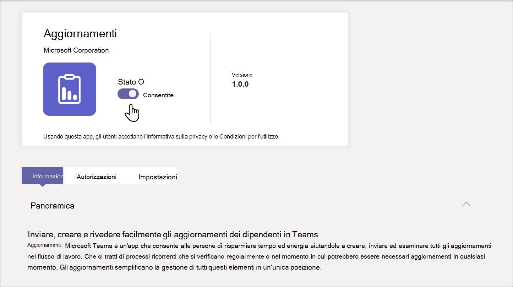

# Gestire l'app Aggiornamenti per l'organizzazione in Microsoft Teams

## Cos'è l'app Aggiornamenti

Il Aggiornamenti nell'app Microsoft Teams offre ai membri dell'organizzazione un posto centralizzato in cui creare, rivedere e inviare gli aggiornamenti. Creando modelli, è possibile usare l'app Aggiornamenti per tenere traccia di tutto ciò di cui l'organizzazione ha bisogno. Aggiornamenti è disponibile sia per il desktop che per i dispositivi mobili.

In Teams, gli utenti possono ottenere Aggiornamenti dall'app store di Teams. Tutti gli aggiornamenti che devono inviare verranno visualizzati nella pagina **Invia** . È possibile condividere [l'articolo Introduzione a Aggiornamenti](https://support.microsoft.com/office/get-started-in-updates-c03a079e-e660-42dc-817b-ca4cfd602e5a) con gli utenti per aiutarli a usare Aggiornamenti.

Gli utenti possono visualizzare gli aggiornamenti assegnati nella pagina **Revisione** .

Quando a un utente viene assegnato un aggiornamento, questo viene visualizzato nel feed attività di Teams. Gli utenti possono anche visualizzare tutte le richieste di aggiornamento correnti e gli invii precedenti nell'app Aggiornamenti. Inoltre, chiunque può creare modelli e inviare richieste di aggiornamento.

Aggiornamenti viene fornito con entrambi i modelli predefiniti per scenari aziendali comuni e l'opzione per creare un modello personalizzato. Chiunque può creare un modello per nuovi tipi di aggiornamenti.

## Scenario di esempio

I dipendenti di un negozio di abbigliamento sono responsabili dell'apertura e della chiusura del negozio ogni giorno. Ogni mattina, il responsabile dei turni compila l'aggiornamento di apertura dello Store, un modello predefinito nell'app Aggiornamenti. In questo aggiornamento, descrivono eventuali problemi con la chiusura della notte precedente, rispondono a domande sulla pulizia del negozio e segnalano eventuali forniture che necessitano di rifornimento. L'invio di un aggiornamento consente loro di comunicare le loro esigenze per lo store e gli eventuali problemi in modo rapido ed efficiente. Gli aggiornamenti giornalieri offrono anche ai collaboratori dello Store l'opportunità di evidenziare ciò che sta andando bene.

Presso le strutture di produzione del negozio, i dipendenti eseguono controlli di sicurezza con Aggiornamenti utilizzando dispositivi mobili.

Nel frattempo, un team di lavoratori remoti sta aggiornando il sito Web dello store. Sono distribuiti in fusi orari, quindi le riunioni di stand-up giornaliere non sono comodi. Ognuno dei membri del team invia al responsabile del team report giornalieri Aggiornamenti sullo stato di avanzamento.

[Scarica il Aggiornamenti lookbook](https://go.microsoft.com/fwlink/?linkid=2197649&clcid=0x409) per vedere altri esempi di cosa puoi fare con Aggiornamenti.

## Autorizzazioni e licenze richieste

Per distribuire Aggiornamenti, è necessaria l'autorizzazione per gli elementi seguenti:

- Autorizzazioni per creare un database Microsoft Dataverse.

- Un account in [powerautomate.microsoft.com](https://powerautomate.microsoft.com/).

- Ruolo di amministratore nell'ambiente di destinazione.

- Licenza per Power Automate, Office 365 o Dynamics 365.

- Per configurare nuovi modelli è necessaria una licenza per Microsoft Forms.

## Archiviazione con Microsoft Dataverse

Il common data model (CDM) è il linguaggio dei dati condiviso usato dalle applicazioni aziendali e analitiche in Microsoft Dataverse. È costituito da un set di schemi di dati estendibili standardizzati pubblicati da Microsoft e dai nostri partner che consentono la coerenza dei dati e il relativo significato tra le applicazioni e i processi aziendali. Altre informazioni sul [modello di dati comune](/common-data-model/).

Aggiornamenti creati da un modello archiviano comunque i dati in Microsoft Dataverse, ad esempio il titolo, i dettagli, l'ID modello e altro ancora. Altre informazioni  [sull'archiviazione dei dati per Microsoft Forms](https://support.microsoft.com/office/data-storage-for-microsoft-forms-97a34e2e-98e1-4dc2-b6b4-7a8444cb1dc3#:~:text=Where%20data%20is%20stored%20for%20Microsoft%20Forms.%20Microsoft,European-based%20tenants%20is%20stored%20on%20servers%20in%20Europe).

>[!Note]
>Se si elimina il modello di modulo nel sito Microsoft Forms, il modello di Aggiornamenti verrà interrotto e gli utenti non saranno in grado di inviare l'aggiornamento. Gli utenti ricevono un errore "CDB TableNotFound" quando provano ad aprire un modello eliminato in Microsoft Forms.

## Aggiornamenti autorizzazioni dell'app Teams

L'app Aggiornamenti Teams consente di accedere alle caratteristiche seguenti:

- Ricevere messaggi e dati forniti dall'utente.

- Invio di messaggi e notifiche dell'utente.

- Render delle app e delle finestre di dialogo personali senza intestazione fornita da Teams.

- Accesso alle informazioni del profilo, ad esempio nome, indirizzo di posta elettronica, nome della società e lingua preferita.

- Ricevere messaggi e dati forniti dai membri del team nel canale.

- Inviare messaggi e notifiche in un canale.

- Accedere alle informazioni del team:
  - nome del team
  - elenco dei canali
  - elenco dei membri del team (nomi e indirizzi di posta elettronica dei membri del team)

- Uso delle informazioni del team per i contatti.

## Disabilitare l'app Aggiornamenti

L'app Aggiornamenti è disponibile per impostazione predefinita. È possibile disabilitarla nell'interfaccia di amministrazione di Teams.

  1. Passare all'interfaccia di amministrazione di Teams.

  2. Passare a **app Teams** >  **Gestisci app**.

  3. Cerca l'app Aggiornamenti.

     

  4. Selezionare **Aggiornamenti**.

  5. Selezionare l'interruttore per disabilitare l'app per l'organizzazione.
    

## Aggiungere Aggiornamenti a Teams

I criteri di configurazione delle app consentono di personalizzare Teams per aggiungere app più importanti per gli utenti degli utenti. Le app vengono aggiunte alla barra dell'app, ovvero la barra sul lato del client desktop di Teams e nella parte inferiore dei client mobili di Teams, dove gli utenti possono accedervi rapidamente e facilmente.

Per aggiungere l'app Aggiornamenti per gli utenti, è possibile modificare il criterio globale (impostazione predefinita a livello di organizzazione) o creare e assegnare criteri di configurazione delle app personalizzati. Per altre informazioni, vedere [Gestire i criteri di configurazione delle app in teams](teams-app-setup-policies.md).

## Criteri di conservazione

Aggiornamenti creati dall'app Aggiornamenti vengono archiviati nell'ambiente predefinito Microsoft Dataverse, che al momento non supporta i backup. Altre informazioni su come eseguire il [Backup e il ripristino di ambienti - Power Platform \|Microsoft Docs](/power-platform/admin/backup-restore-environments).

I dati archiviati in Forms non verranno eliminati finché l'autore del modello non lo pulirà dalla scheda **moduli eliminati** nell'app Web Microsoft Forms.

## Criteri di autorizzazione e accesso condizionale

L'app Aggiornamenti in Teams attualmente non supporta i criteri di accesso condizionale impostati per Microsoft Teams.

È possibile usare i [criteri di autorizzazione dell'app Teams](teams-app-permission-policies.md) per gestire Aggiornamenti.

## Limitazioni dei dati

Ogni utente può creare al massimo 400 modelli di Aggiornamenti e ogni modello può raccogliere un massimo di 50.000 richieste in base alla funzionalità corrente di Microsoft Forms.

## Sicurezza

Dall'app Teams Aggiornamenti, gli utenti hanno accesso per creare nuovi aggiornamenti e visualizzare gli aggiornamenti inviati e ricevuti. Gli utenti non avranno accesso ai Aggiornamenti creati da altri, a meno che non siano visualizzatori della richiesta.

> [!Note]
> A un utente viene assegnato il ruolo di visualizzatore di una richiesta se fa parte della chat o del canale in cui è stato creato il report di aggiornamento o se l'autore del modello li aggiunge manualmente come visualizzatore. Non potranno intervenire sulla richiesta se al momento della creazione del report non è stato assegnato quel ruolo.
