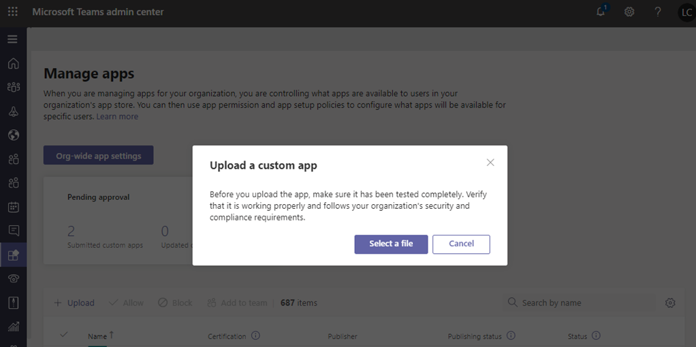
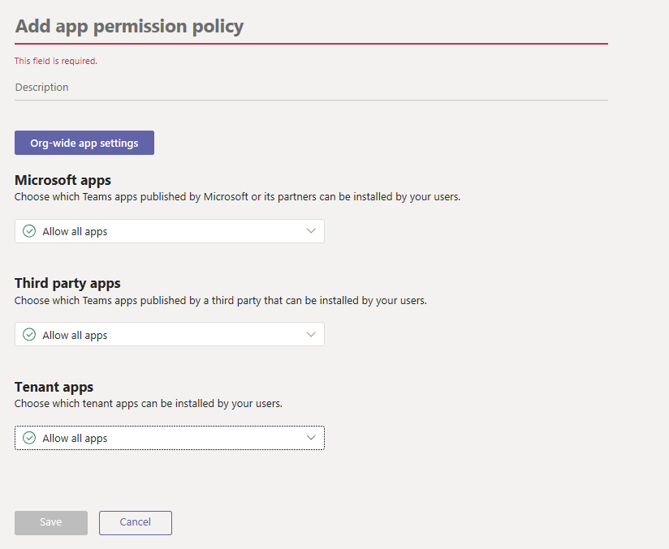
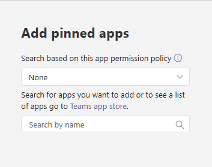
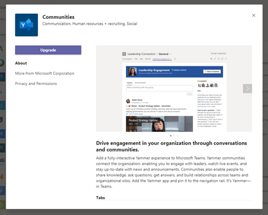

# Gestire le app personalizzate in Microsoft Teams

Questo articolo fornisce indicazioni complete su come usare l'app teams dallo sviluppo alla distribuzione. Questa guida si basa sugli aspetti relativi ai team dell'app ed è destinata ai professionisti IT. Per altre informazioni sullo sviluppo di app per Team, Vedi <a href="https://docs.microsoft.com/microsoftteams/platform" target="_blank">qui</a>.

## Introduzione

Per creare e gestire app personalizzate in teams, sono necessari due tenant: un tenant di test per lo sviluppo e un tenant di produzione.

> [!NOTE]
> Se non si dispone già di un tenant di prova, è possibile crearne rapidamente uno e popolarlo con i dati di test usando il programma per sviluppatori di Office 365. <a href="https://developer.microsoft.com/office/dev-program" target="_blank">Altre informazioni qui</a>.

## Passaggio 1: sviluppare e testare

### Creare utenti di test

Assicurarsi che gli sviluppatori, sia interni che esterni, abbiano account nel tenant di test. Leggi <a href="https://docs.microsoft.com/office365/admin/add-users/add-users" target="_blank">altre informazioni sull'aggiunta di utenti</a>.

### Consentire app personalizzate nel tenant di test

Per offrire agli sviluppatori l'accesso necessario per il test, consentire a tutti gli utenti del tenant di test di caricare app personalizzate (nota anche come sideload). In questo modo gli sviluppatori possono caricare un'app personalizzata per l'uso personale o attraverso il tenant di test senza dover inviare l'app allo Store app teams. Il caricamento di un'app personalizzata consente agli sviluppatori di testare un'app prima di distribuirla più ampiamente.

Per consentire agli utenti di caricare app personalizzate, eseguire le operazioni seguenti:

1. Attivare l'impostazione **Consenti interazione con** le app personalizzate per l'intera organizzazione. Procedi come segue.
    1. Nella barra di spostamento sinistra dell'interfaccia di <a href="https://admin.teams.microsoft.com/" target="_blank">amministrazione di Microsoft teams</a>, passa a **Teams Apps** > **Manage Apps**, quindi fai clic su **impostazioni dell'app a livello di organizzazione**.
    2. In **app personalizzate**attivare Consenti l' **interazione con le app personalizzate**e quindi fare clic su **Salva**.

    

2. Attivare l'impostazione **carica app personalizzate** nei criteri di configurazione dell'app globale. Procedi come segue.
    1. Nella barra di spostamento sinistra dell'interfaccia di <a href="https://admin.teams.microsoft.com/" target="_blank">amministrazione di Microsoft teams</a>, accedere ai**criteri di configurazione**delle **app** > teams e quindi fare clic sul criterio **globale (a livello di organizzazione)** .
    2. Attivare **carica app personalizzate**e quindi fare clic su **Salva**.

    

> [!NOTE]
> C'è anche un'impostazione per l'app carica personalizzata a livello di team. Per impostazione predefinita, questa impostazione è attivata. Tuttavia, se gli sviluppatori non riescono a caricare un'app personalizzata in un team, controlla l'impostazione seguendo la <a href="https://docs.microsoft.com/microsoftteams/teams-custom-app-policies-and-settings#configure-the-team-custom-app-setting" target="_blank">procedura seguente</a>.

### Creare la tua app

Gli sviluppatori dovrebbero ora avere ciò che serve per creare la tua app. Vedere <a href="https://docs.microsoft.com/microsoftteams/platform" target="_blank">qui</a> per indicazioni su questo.

## Passaggio 2: convalidare in produzione

### Ottenere il pacchetto dell'app

Quando l'app è pronta per l'uso in produzione, lo sviluppatore dovrebbe produrre un pacchetto dell'app. Possono usare <a href="https://docs.microsoft.com/microsoftteams/platform/get-started/get-started-app-studio" target="_blank">App Studio</a> per questo. Verrà inviato il file in formato zip.

Microsoft usa <a href="https://docs.microsoft.com/microsoftteams/platform/publishing/office-store-approval" target="_blank">queste linee guida</a> per assicurarti che le app siano conformi agli standard di qualità e sicurezza dello Store Global teams app.

### Consentire agli utenti attendibili di caricare app personalizzate nel tenant di produzione

Per verificare che l'app funzioni correttamente nel tenant di produzione, è necessario consentire a utenti e/o trusted dell'organizzazione di caricare app personalizzate.  Proprio come nel <a href="https://docs.microsoft.com/microsoftteams/manage-your-lob-apps#allow-custom-apps-in-the-test-tenant" target="_blank">passaggio</a>precedente, puoi usare i criteri di configurazione delle app per eseguire questa operazione.

> [!NOTE]
> Se non si è in grado di caricare l'app nel tenant di produzione per la convalida, anche per se stessi o per gli utenti attendibili, è possibile ignorare questo passaggio e seguire i passaggi 3 e 4 per caricare l'app non convalidata nell'App Store del tenant. Limita quindi l'accesso all'app solo a te e agli utenti di cui ti fidi. Questi utenti possono quindi ottenere l'app dall'archivio dell'app tenant per eseguire la convalida. Dopo la convalidazione dell'app, USA gli stessi criteri di autorizzazione per aprire Access ed eseguire il rollback dell'app per l'uso della produzione.

Per consentire agli utenti attendibili di caricare app personalizzate, eseguire le operazioni seguenti:

1. Attivare l'impostazione **Consenti interazione con** le app personalizzate per l'intera organizzazione. Procedi come segue.
    1. Nella barra di spostamento sinistra dell'interfaccia di <a href="https://admin.teams.microsoft.com/" target="_blank">amministrazione di Microsoft teams</a>, passa a **Teams Apps** > **Manage Apps**, quindi fai clic su **impostazioni dell'app a livello di organizzazione**.
    2. In **app personalizzate**attivare Consenti l' **interazione con le app personalizzate**e quindi fare clic su **Salva**.
2. Disattivare l'impostazione **carica app personalizzate** nei criteri di configurazione dell'app globale. Procedi come segue.
    1. Nella barra di spostamento sinistra dell'interfaccia di <a href="https://admin.teams.microsoft.com/" target="_blank">amministrazione di Microsoft teams</a>, accedere ai**criteri di configurazione**delle **app** > teams e quindi fare clic sul criterio **globale (a livello di organizzazione)** .
    2. Disattivare **carica app personalizzate**e quindi fare clic su **Salva**.
3. Crea un nuovo criterio di configurazione dell'app che consente di caricare app personalizzate e assegnarlo al set di utenti attendibili. Procedi come segue.
    1. Nella barra di spostamento sinistra dell'interfaccia di <a href="https://admin.teams.microsoft.com/" target="_blank">amministrazione di Microsoft teams</a>accedere ai**criteri di configurazione**delle **app** > teams e quindi fare clic su **Aggiungi**. Assegnare al nuovo criterio un nome e una descrizione, attivare **carica app personalizzate**e quindi fare clic su **Salva**.
    2. Selezionare il nuovo criterio creato e quindi fare clic su **Gestisci utenti**. Cercare un utente, fare clic su **Aggiungi**e quindi su **applica**. Ripetere questo passaggio per assegnare i criteri a tutti gli utenti attendibili.

        

    Questi utenti possono ora caricare il manifesto dell'app per verificare che l'app funzioni correttamente nel tenant di produzione.

## Passaggio 3: caricare nel catalogo app tenant

Per rendere l'app disponibile per gli utenti nell'App Store tenant, carica l'app. Puoi eseguire questa operazione nella pagina [Gestisci app](manage-apps.md) dell'interfaccia di amministrazione di Microsoft teams.

## Passaggio 4: configurare e assegnare autorizzazioni

### Controllare l'accesso all'app

Per impostazione predefinita, tutti gli utenti hanno accesso a questa app nell'app teams Store. Per limitare e controllare chi ha l'autorizzazione per l'uso dell'app, puoi creare e assegnare un nuovo criterio di autorizzazione per le app. Seguire <a href="https://docs.microsoft.com/microsoftteams/teams-app-permission-policies#create-a-custom-app-permission-policy" target="_blank">questa procedura.</a>

### Aggiungere l'app agli utenti da individuare

Per impostazione predefinita, per consentire agli utenti di trovare l'app, è necessario passare a teams App Store e cercarla. Per semplificare l'accesso all'app da parte degli utenti, puoi aggiungere l'app alla barra dell'app in teams. A questo scopo, crea un nuovo criterio di configurazione dell'app e assegnalo agli utenti. Seguire <a href="https://docs.microsoft.com/microsoftteams/teams-app-setup-policies#create-a-custom-app-setup-policy" target="_blank">questa procedura.</a>

## Passaggio 5: aggiornare l'app

Per aggiornare un'app, gli sviluppatori devono continuare a seguire il [passaggio 1](#step-1-develop-and-test) e il [passaggio 2](#step-2-validate-in-production).

Puoi aggiornare l'app tramite il catalogo app tenant. A questo scopo, nell'interfaccia di amministrazione di Microsoft teams, vai alle >  **app teams****Manage Apps**. Nell'elenco delle app fare clic sul nome dell'app e quindi su **Aggiorna**. Questa operazione sostituisce l'app esistente nel catalogo dell'app tenant e tutti i criteri di autorizzazione per le app e i criteri di configurazione delle app restano applicati per l'app aggiornata.

### Esperienza di aggiornamento degli utenti finali

Nella maggior parte dei casi, dopo aver completato l'aggiornamento di un'app, la nuova versione verrà visualizzata automaticamente per gli utenti finali. Tuttavia, esistono alcuni aggiornamenti al manifesto di <a href="https://docs.microsoft.com/microsoftteams/platform/resources/schema/manifest-schema" target="_blank">Microsoft teams</a> che richiedono l'accettazione da parte dell'utente:

* È stato aggiunto o rimosso un bot
* Modifica della proprietà "botId" di un bot esistente
* Modifica della proprietà "isNotificationOnly" di un bot esistente
* La proprietà "supportsFiles" del bot è cambiata
* È stata aggiunta o rimossa un'estensione della messaggistica
* È stato aggiunto un nuovo connettore
* È stata aggiunta una nuova scheda statica
* È stata aggiunta una nuova scheda configurabile
* Proprietà all'interno di "webApplicationInfo" modificate

## App correlate

- [Gestire le app nell'interfaccia di amministrazione di Microsoft Teams](manage-apps.md)
