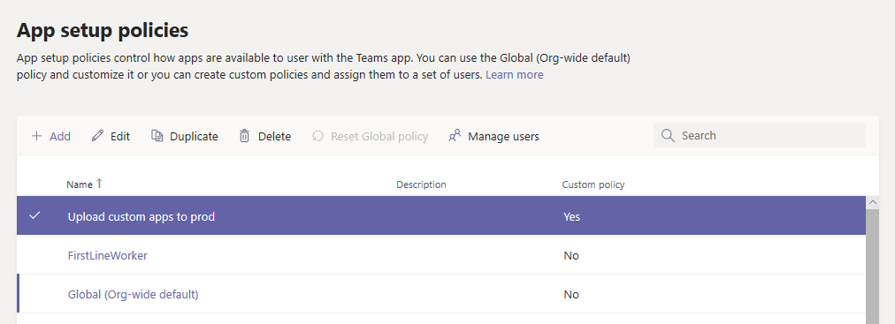

# Gestire le app line-of-business in Microsoft TeamsManage your line-of-business apps in Microsoft Teams

Questo articolo fornisce indicazioni complete su come usare l'app teams dallo sviluppo alla distribuzione.This article provides end-to-end guidance for how to take your Teams app from development to deployment. Questa guida si basa sugli aspetti relativi ai team dell'app ed è destinata ai professionisti IT.This guidance focuses on the Teams aspects of the app and is intended for IT pros. Per altre informazioni sullo sviluppo di app per Team, Vedi <a href="https://docs.microsoft.com/microsoftteams/platform" target="_blank">qui</a>.For more information on developing Teams apps, see <a href="https://docs.microsoft.com/microsoftteams/platform" target="_blank">here</a>.

## IntroduzioneGetting started

Per creare e gestire app line-of-business (LOB) in teams, sono necessari due tenant: un tenant di test per lo sviluppo e un tenant di produzione.To create and manage line-of-business (LOB) apps in Teams, you’ll need two tenants: a test tenant for development and a production tenant.

> [!NOTE]
> Se non si dispone già di un tenant di prova, è possibile crearne rapidamente uno e popolarlo con i dati di test usando il programma per sviluppatori di Office 365.If you don’t already have a test tenant, you can quickly create one and populate it with test data using the Office 365 Developer Program. <a href="https://developer.microsoft.com/office/dev-program" target="_blank">Altre informazioni qui</a>.<a href="https://developer.microsoft.com/office/dev-program" target="_blank">Learn more here</a>.

## Passaggio 1: sviluppare e testareStep 1: Develop and test

### Creare utenti di testCreate test users

Assicurarsi che gli sviluppatori, sia interni che esterni, abbiano account nel tenant di test.Make sure that your developers, whether in-house or external, have accounts in your test tenant. Leggi <a href="https://docs.microsoft.com/office365/admin/add-users/add-users" target="_blank">altre informazioni sull'aggiunta di utenti</a>.<a href="https://docs.microsoft.com/office365/admin/add-users/add-users" target="_blank">Learn more about adding users</a>.

### Consentire app personalizzate nel tenant di testAllow custom apps in the test tenant

Per offrire agli sviluppatori l'accesso necessario per il test, consentire a tutti gli utenti del tenant di test di caricare app personalizzate (nota anche come sideload).To give developers the access they need for testing, allow all users in the test tenant to upload custom apps (also known as sideloading). In questo modo gli sviluppatori possono caricare un'app personalizzata per l'uso personale o attraverso il tenant di test senza dover inviare l'app allo Store app teams.This lets developers upload a custom app to be used personally or across the test tenant without having to submit the app to the Teams apps store. Il caricamento di un'app personalizzata consente agli sviluppatori di testare un'app prima di distribuirla più ampiamente.Uploading a custom app lets developers test an app before you distribute it more widely.

Per consentire agli utenti di caricare app personalizzate, eseguire le operazioni seguenti:To allow users to upload custom apps, follow these steps:

1. Attivare l'impostazione **Consenti interazione con** le app personalizzate per l'intera organizzazione.Turn on the **Allow interaction with custom apps** org-wide app setting. Procedi come segue.To do this:
    1. Nella barra di spostamento sinistra dell'interfaccia di <a href="https://admin.teams.microsoft.com/" target="_blank">amministrazione di Microsoft teams</a>, passa a **Teams Apps** > **Manage Apps**, quindi fai clic su **impostazioni dell'app a livello di organizzazione**.In the left navigation of the <a href="https://admin.teams.microsoft.com/" target="_blank">Microsoft Teams admin center</a>, go to **Teams apps** > **Manage apps**, and then click **Org-wide app settings**.
    2. In **app personalizzate**attivare Consenti l' **interazione con le app personalizzate**e quindi fare clic su **Salva**.Under **Custom apps**, turn on **Allow interaction with custom apps**, and then click **Save**.

    

2. Attivare l'impostazione **carica app personalizzate** nei criteri di configurazione dell'app globale.Turn on the **Upload custom apps** setting in the global app setup policy. Procedi come segue.To do this:
    1. Nella barra di spostamento sinistra dell'interfaccia di <a href="https://admin.teams.microsoft.com/" target="_blank">amministrazione di Microsoft teams</a>, accedere ai**criteri di configurazione**delle **app** > teams e quindi fare clic sul criterio **globale (a livello di organizzazione)** .In the left navigation of the <a href="https://admin.teams.microsoft.com/" target="_blank">Microsoft Teams admin center</a>, go to **Teams apps** > **Setup policies**, and then click the **Global (Org-wide default)** policy.
    2. Attivare **carica app personalizzate**e quindi fare clic su **Salva**.Turn on **Upload custom apps**, and then click **Save**.

    

> [!NOTE]
> C'è anche un'impostazione per l'app carica personalizzata a livello di team.There's also an upload custom app setting at the team level. Per impostazione predefinita, questa impostazione è attivata.By default this setting is on. Tuttavia, se gli sviluppatori non riescono a caricare un'app personalizzata in un team, controlla l'impostazione seguendo la <a href="https://docs.microsoft.com/microsoftteams/teams-custom-app-policies-and-settings#configure-the-team-custom-app-setting" target="_blank">procedura seguente</a>.However, if developers are unable to upload a custom app to a team, check the setting by following the steps <a href="https://docs.microsoft.com/microsoftteams/teams-custom-app-policies-and-settings#configure-the-team-custom-app-setting" target="_blank">here</a>.

### Creare la tua appCreate your app

Gli sviluppatori dovrebbero ora avere ciò che serve per creare la tua app.Developers should now have what they need to create your app. Vedere <a href="https://docs.microsoft.com/microsoftteams/platform" target="_blank">qui</a> per indicazioni su questo.See <a href="https://docs.microsoft.com/microsoftteams/platform" target="_blank">here</a> for guidance on that.

## Passaggio 2: convalidare in produzioneStep 2: Validate in production

### Ottenere il pacchetto dell'appGet the app package

Quando l'app è pronta per l'uso in produzione, lo sviluppatore dovrebbe produrre un pacchetto dell'app.When the app is ready for use in production, the developer should produce an app package. Possono usare <a href="https://docs.microsoft.com/microsoftteams/platform/get-started/get-started-app-studio" target="_blank">App Studio</a> per questo.They can use <a href="https://docs.microsoft.com/microsoftteams/platform/get-started/get-started-app-studio" target="_blank">App Studio</a> for that. Verrà inviato il file in formato zip.They'll send you the file in .zip format.

Microsoft usa <a href="https://docs.microsoft.com/microsoftteams/platform/publishing/office-store-approval" target="_blank">queste linee guida</a> per assicurarti che le app siano conformi agli standard di qualità e sicurezza dello Store Global teams app.Microsoft uses <a href="https://docs.microsoft.com/microsoftteams/platform/publishing/office-store-approval" target="_blank">these guidelines</a> to ensure apps comply with the quality and security standards of the global Teams apps store.

### Consentire agli utenti attendibili di caricare app personalizzate nel tenant di produzioneAllow trusted users to upload custom apps in the production tenant

Per verificare che l'app funzioni correttamente nel tenant di produzione, è necessario consentire a utenti e/o trusted dell'organizzazione di caricare app personalizzate.To validate that the app is working correctly in your production tenant, you need to allow yourself and/or trusted users in your organization to upload custom apps.  Proprio come nel <a href="https://docs.microsoft.com/microsoftteams/manage-your-lob-apps#allow-custom-apps-in-the-test-tenant" target="_blank">passaggio</a>precedente, puoi usare i criteri di configurazione delle app per eseguire questa operazione.Much like in the earlier <a href="https://docs.microsoft.com/microsoftteams/manage-your-lob-apps#allow-custom-apps-in-the-test-tenant" target="_blank">step</a>, you use app setup policies to do this.

> [!NOTE]
> Se non si è in grado di caricare l'app nel tenant di produzione per la convalida, anche per se stessi o per gli utenti attendibili, è possibile ignorare questo passaggio e seguire i passaggi 3 e 4 per caricare l'app non convalidata nell'App Store del tenant.If you’re uncomfortable with uploading the app to your production tenant for validation, even for yourself or trusted users, you can skip this step and follow steps 3 and 4 to upload the unvalidated app to your tenant app store. Limita quindi l'accesso all'app solo a te e agli utenti di cui ti fidi.Then, restrict access to that app to only yourself and users you trust. Questi utenti possono quindi ottenere l'app dall'archivio dell'app tenant per eseguire la convalida.These users can then get the app from the tenant app store to perform validation. Dopo la convalidazione dell'app, USA gli stessi criteri di autorizzazione per aprire Access ed eseguire il rollback dell'app per l'uso della produzione.After the app is validated, use the same permission policies to open access and roll the app out for production use.

Per consentire agli utenti attendibili di caricare app personalizzate, eseguire le operazioni seguenti:To allow trusted users to upload custom apps, follow these steps:

1. Attivare l'impostazione **Consenti interazione con** le app personalizzate per l'intera organizzazione.Turn on the **Allow interaction with custom apps** org-wide app setting. Procedi come segue.To do this:
    1. Nella barra di spostamento sinistra dell'interfaccia di <a href="https://admin.teams.microsoft.com/" target="_blank">amministrazione di Microsoft teams</a>, passa a **Teams Apps** > **Manage Apps**, quindi fai clic su **impostazioni dell'app a livello di organizzazione**.In the left navigation of the <a href="https://admin.teams.microsoft.com/" target="_blank">Microsoft Teams admin center</a>, go to **Teams apps** > **Manage apps**, and then click **Org-wide app settings**.
    2. In **app personalizzate**attivare Consenti l' **interazione con le app personalizzate**e quindi fare clic su **Salva**.Under **Custom apps**, turn on **Allow interaction with custom apps**, and then click **Save**.
2. Disattivare l'impostazione **carica app personalizzate** nei criteri di configurazione dell'app globale.Turn off the **Upload custom apps** setting in the global app setup policy. Procedi come segue.To do this:
    1. Nella barra di spostamento sinistra dell'interfaccia di <a href="https://admin.teams.microsoft.com/" target="_blank">amministrazione di Microsoft teams</a>, accedere ai**criteri di configurazione**delle **app** > teams e quindi fare clic sul criterio **globale (a livello di organizzazione)** .In the left navigation of the <a href="https://admin.teams.microsoft.com/" target="_blank">Microsoft Teams admin center</a>, go to **Teams apps** > **Setup policies**, and then click the **Global (Org-wide default)** policy.
    2. Disattivare **carica app personalizzate**e quindi fare clic su **Salva**.Turn off **Upload custom apps**, and then click **Save**.
3. Crea un nuovo criterio di configurazione dell'app che consente di caricare app personalizzate e assegnarlo al set di utenti attendibili.Create a new app setup policy that allows uploading custom apps and assign it to your set of trusted users. Procedi come segue.To do this:
    1. Nella barra di spostamento sinistra dell'interfaccia di <a href="https://admin.teams.microsoft.com/" target="_blank">amministrazione di Microsoft teams</a>accedere ai**criteri di configurazione**delle **app** > teams e quindi fare clic su **Aggiungi**.In the left navigation of the <a href="https://admin.teams.microsoft.com/" target="_blank">Microsoft Teams admin center</a>, go to **Teams apps** > **Setup policies**, and then click the **Add**. Assegnare al nuovo criterio un nome e una descrizione, attivare **carica app personalizzate**e quindi fare clic su **Salva**.Give the new policy a name and description, turn on **Upload custom apps**, and then click **Save**.
    2. Selezionare il nuovo criterio creato e quindi fare clic su **Gestisci utenti**.Select the new policy you created, and then click **Manage users**. Cercare un utente, fare clic su **Aggiungi**e quindi su **applica**.Search for a user, click **Add**, and then click **Apply**. Ripetere questo passaggio per assegnare i criteri a tutti gli utenti attendibili.Repeat this step to assign the policy to all your trusted users.

        

    Questi utenti possono ora caricare il manifesto dell'app per verificare che l'app funzioni correttamente nel tenant di produzione.These users can now upload the app manifest to validate that the app is working correctly in the production tenant.

## Passaggio 3: caricare nel catalogo app tenantStep 3: Upload to the tenant app catalog

Per rendere l'app disponibile per gli utenti nell'App Store tenant, carica l'app.To make the app available to users in the tenant app store, upload the app. Puoi eseguire questa operazione nella pagina [Gestisci app](manage-apps.md) dell'interfaccia di amministrazione di Microsoft teams.You can do this on the [Manage apps](manage-apps.md) page of the Microsoft Teams admin center.

## Passaggio 4: configurare e assegnare autorizzazioniStep 4: Configure and assign permissions

### Controllare l'accesso all'appControl access to the app

Per impostazione predefinita, tutti gli utenti hanno accesso a questa app nell'app teams Store.By default, all users have access to this app in the the Teams apps store. Per limitare e controllare chi ha l'autorizzazione per l'uso dell'app, puoi creare e assegnare un nuovo criterio di autorizzazione per le app.To restrict and control who has permission to use the app, you can create and assign a new app permission policy. Seguire <a href="https://docs.microsoft.com/microsoftteams/teams-app-permission-policies#create-a-custom-app-permission-policy" target="_blank">questa procedura.</a>Follow the steps <a href="https://docs.microsoft.com/microsoftteams/teams-app-permission-policies#create-a-custom-app-permission-policy" target="_blank">here</a>.

### Aggiungere l'app agli utenti da individuarePin the app for users to discover

Per impostazione predefinita, per consentire agli utenti di trovare l'app, è necessario passare a teams App Store e cercarla.By default, for users to find this app they would have to go to Teams apps store and browse or search for it. Per semplificare l'accesso all'app da parte degli utenti, puoi aggiungere l'app alla barra dell'app in teams.To make it easy for users to get to the app, you can pin the app to the app bar in Teams. A questo scopo, crea un nuovo criterio di configurazione dell'app e assegnalo agli utenti.To do this, create a new app setup policy and assign it to users. Seguire <a href="https://docs.microsoft.com/microsoftteams/teams-app-setup-policies#create-a-custom-app-setup-policy" target="_blank">questa procedura.</a>Follow the steps  <a href="https://docs.microsoft.com/microsoftteams/teams-app-setup-policies#create-a-custom-app-setup-policy" target="_blank">here</a>.

## Passaggio 5: aggiornare l'appStep 5: Update the app

Per aggiornare un'app, gli sviluppatori devono continuare a seguire il [passaggio 1](#step-1-develop-and-test) e il [passaggio 2](#step-2-validate-in-production).To update an app, developers should continue to follow [step 1](#step-1-develop-and-test) and [step 2](#step-2-validate-in-production).

Puoi aggiornare l'app tramite il catalogo app tenant.You can update the app through the tenant app catalog. A questo scopo, nell'interfaccia di amministrazione di Microsoft teams, vai alle >  **app teams\*\*\*\*Manage Apps**.To do this, in the Microsoft Teams admin center, go to **Teams apps** > **Manage apps**. Nell'elenco delle app fare clic sul nome dell'app e quindi su **Aggiorna**.In the list of apps, click the app name, and then click **Update**. Questa operazione sostituisce l'app esistente nel catalogo dell'app tenant e tutti i criteri di autorizzazione per le app e i criteri di configurazione delle app restano applicati per l'app aggiornata.Doing this replaces the existing app in the tenant app catalog, and all app permission policies and app setup policies remain enforced for the updated app.

## App correlateRelated apps

- [Gestire le app nell'interfaccia di amministrazione di Microsoft TeamsManage your apps in the Microsoft Teams admin center](manage-apps.md)