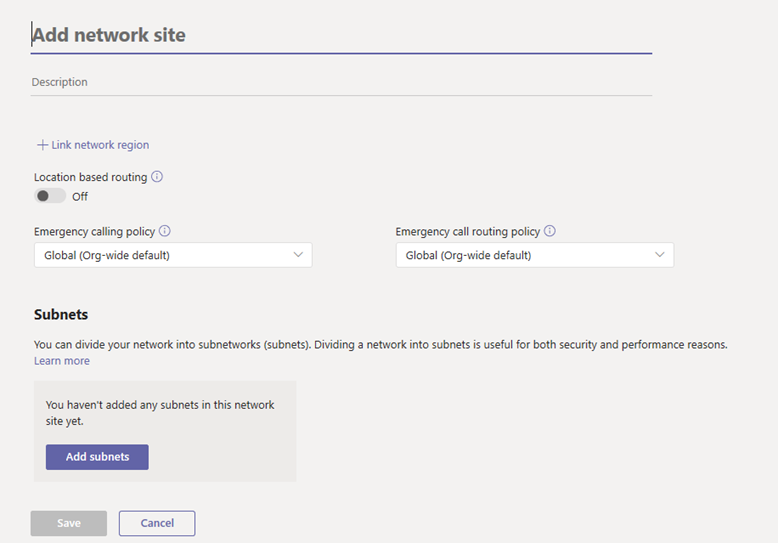

# <a name="manage-your-network-topology-for-cloud-voice-features-in-microsoft-teams"></a>Gestire la topologia di rete per le funzionalità vocali di cloud in Microsoft Teams

Se l'organizzazione sta distribuendo il [routing basato sulla posizione per il routing diretto](location-based-routing-plan.md) o per le [chiamate di emergenza dinamiche](configure-dynamic-emergency-calling.md), è necessario configurare le impostazioni di rete per l'uso con queste funzionalità di cloud Voice in Microsoft teams. Le impostazioni di rete vengono usate per determinare la posizione di un client teams e includere aree di rete, siti di rete, subnet e indirizzi IP attendibili. A seconda della funzionalità cloud Voice e della funzionalità che si sta distribuendo, è possibile configurare alcune o tutte le impostazioni. Per altre informazioni su questi termini, vedere [impostazioni di rete per le caratteristiche vocali del cloud](cloud-voice-network-settings.md).

Le impostazioni di rete vengono configurate nella pagina della **topologia di rete** dell'interfaccia di amministrazione di Microsoft teams o tramite Windows PowerShell.

## <a name="configure-network-settings-in-the-microsoft-teams-admin-center"></a>Configurare le impostazioni di rete nell'interfaccia di amministrazione di Microsoft Teams

[!INCLUDE [preview-feature](includes/preview-feature.md)]

Si definiscono aree di rete, siti di rete e subnet nella scheda **siti di rete** della pagina della **topologia** di rete. In questo caso, è possibile creare o modificare un sito di rete, associare un sito a un'area di rete, associare una subnet al sito, attivare il routing basato sulla posizione e assegnare criteri di emergenza al sito. È anche possibile aggiungere aree di rete che possono essere usate globalmente per tutti i siti.

#### <a name="add-and-configure-a-network-site"></a>Aggiungere e configurare un sito di rete

1. Nella barra di spostamento sinistra dell'interfaccia di amministrazione di Microsoft teams, vai alla**topologia di rete** **locations** > e quindi fai clic sulla scheda **siti di rete** .
2. Fare clic su **nuovo**e quindi immettere un nome e una descrizione per il sito.

    

3. Per associare il sito a un'area di rete, fare clic su **collega area di rete**, selezionare un'area geografica esistente o fare clic su **Aggiungi** per aggiungere un'area geografica e quindi fare clic su **collega**.  
4. Per abilitare il routing basato sulla posizione per il sito, attivare il **routing basato sulla posizione**.
5. Per assegnare i criteri dei servizi di emergenza al sito, eseguire una o entrambe le operazioni seguenti:

    - Se l'organizzazione usa un piano di chiamata o un routing diretto del sistema telefonico, in criteri per le **chiamate di emergenza**selezionare i criteri desiderati.
    - Se l'organizzazione ha distribuito il routing diretto del sistema telefonico, in **criteri di routing delle chiamate di emergenza**selezionare i criteri desiderati.

6. Per associare una subnet al sito, fare clic su **Aggiungi subnet**in **subnet**. Specificare la versione IP, l'indirizzo IP, l'intervallo di rete, aggiungere una descrizione e quindi fare clic su **applica**. Ogni subnet deve essere associata a un sito specifico.
7. Fai clic su **Salva**.

#### <a name="modify-a-network-site"></a>Modificare un sito di rete

1. Nella barra di spostamento sinistra dell'interfaccia di amministrazione di Microsoft teams, vai alla**topologia di rete** **locations** > e quindi fai clic sulla scheda **siti di rete** .
2. Selezionare il sito facendo clic a sinistra del nome del sito, quindi fare clic su **modifica**.
3. Apportare le modifiche desiderate e quindi fare clic su **Salva.**

### <a name="manage-external-trusted-ip-addresses"></a>Gestire indirizzi IP attendibili esterni

Gli indirizzi IP attendibili esterni vengono gestiti nella scheda **IPS attendibile** nella pagina **topologia di rete** dell'interfaccia di amministrazione di Microsoft teams. È possibile aggiungere un numero illimitato di indirizzi IP attendibili esterni.

#### <a name="add-a-trusted-ip-address"></a>Aggiungere un indirizzo IP attendibile

1. Nella barra di spostamento sinistra dell'interfaccia di amministrazione di Microsoft teams, vai alla**topologia di rete** **locations** > e quindi fai clic sulla scheda **IPS attendibile** .
2. Fare clic su **nuovo**.
3. Nel riquadro **Aggiungi indirizzo IP attendibile** specificare la versione IP, l'indirizzo IP, l'intervallo di rete, aggiungere una descrizione e quindi fare clic su **applica**.

    

#### <a name="edit-a-trusted-ip-address"></a>Modificare un indirizzo IP attendibile

1. Nella barra di spostamento sinistra dell'interfaccia di amministrazione di Microsoft teams, vai alla**topologia di rete** **locations** > e quindi fai clic sulla scheda **IPS attendibile** .
2. Selezionare l'indirizzo IP facendo clic a sinistra, quindi fare clic su **modifica**.
3. Nel riquadro **modifica indirizzo IP attendibile** apportare le modifiche desiderate e quindi fare clic su **applica**.

## <a name="configure-network-settings-using-powershell"></a>Configurare le impostazioni di rete tramite PowerShell

Per completare la procedura descritta in questa sezione, è necessaria una certa familiarità con i cmdlet di PowerShell. Per altre informazioni, vedere [Cenni preliminari su teams PowerShell](teams-powershell-overview.md).

### <a name="define-network-regions"></a>Definire le aree di rete

 Usa il cmdlet [New-CsTenantNetworkRegion](https://docs.microsoft.com/powershell/module/skype/New-CsTenantNetworkRegion) per definire le aree di rete. Tieni presente che il parametro RegionID è un nome logico che rappresenta la geografia dell'area geografica e non ha dipendenze o &lt;restrizioni e&gt; il parametro ID sito CentralSite è facoltativo.

```
New-CsTenantNetworkRegion -NetworkRegionID <region ID>  
```

In questo esempio creiamo un'area di rete denominata India.
```
New-CsTenantNetworkRegion -NetworkRegionID "India"  
```

Vedere anche [set-CsTenantNetworkRegion](https://docs.microsoft.com/powershell/module/skype/set-cstenantnetworkregion).

### <a name="define-network-sites"></a>Definire i siti di rete

Usare il cmdlet [New-CsTenantNetworkSite](https://docs.microsoft.com/powershell/module/skype/new-cstenantnetworksite?view=skype-ps) per definire i siti di rete. Ogni sito di rete deve essere associato a un'area di rete.

```
New-CsTenantNetworkSite -NetworkSiteID <site ID> -NetworkRegionID <region ID>
```
In questo esempio creiamo due nuovi siti di rete, Delhi e Hyderabad, nell'area dell'India.
```
New-CsTenantNetworkSite -NetworkSiteID "Delhi" -NetworkRegionID "India"
New-CsTenantNetworkSite -NetworkSiteID "Hyderabad" -NetworkRegionID "India"
```
Nella tabella seguente sono illustrati i siti di rete definiti in questo esempio.

||Sito 1 |Sito 2 |
|---------|---------|---------|
|ID sito    |    Sito 1 (Delhi)     |  Sito 2 (Hyderabad)       |
|ID area  |     Regione 1 (India)    |   Regione 1 (India)      |

Vedere anche [set-CsTenantNetworkRegion](https://docs.microsoft.com/powershell/module/skype/set-cstenantnetworksite).

### <a name="define-network-subnets"></a>Definire le subnet di rete

Utilizzare il cmdlet [New-CsTenantNetworkSubnet](https://docs.microsoft.com/powershell/module/skype/new-cstenantnetworksubnet?view=skype-ps) per definire le subnet di rete e associarle ai siti di rete. Ogni subnet di rete può essere associata a un solo sito.

```
New-CsTenantNetworkSubnet -SubnetID <Subnet IP address> -MaskBits <Subnet bitmask> -NetworkSiteID <site ID>
```

In questo esempio creiamo un'associazione tra subnet 192.168.0.0 e il sito di rete Delhi e tra subnet 2001:4898: E8:25:844E: 926f: 85AD: dd8e e il sito di rete di Hyderabad.
```

New-CsTenantNetworkSubnet -SubnetID "192.168.0.0" -MaskBits "24" -NetworkSiteID "Delhi"
New-CsTenantNetworkSubnet -SubnetID "2001:4898:e8:25:844e:926f:85ad:dd8e" -MaskBits "120" -NetworkSiteID "Hyderabad"

```
La tabella seguente mostra le subnet definite in questo esempio.

||Sito 1 |Sito 2 |
|---------|---------|---------|
|ID subnet   |    192.168.0.0     |  2001:4898: E8:25:844E: 926f: 85AD: dd8e     |
|Maschera  |     24    |   120      |
|ID sito  | Sito (Delhi) | Sito 2 (Hyderabad) |

Per più subnet, è possibile importare un file CSV usando uno script come il seguente.
```
Import-CSV C:\subnet.csv | foreach {New-CsTenantNetworkSubnet –SubnetID $_.SubnetID-MaskBits $_.Mask -NetworkSiteID $_.SiteID}  
```
In questo esempio, il file CSV ha un aspetto simile al seguente:
```
Identity, Mask, SiteID
172.11.12.0, 24, Redmond
172.11.13.0, 24, Chicago
172.11.14.0, 25, Vancouver
172.11.15.0, 28, Paris
```

Vedere anche [set-CsTenantNetworkSubnet](hhttps://docs.microsoft.com/powershell/module/skype/set-cstenantnetworksubnet).

### <a name="define-external-subnets-external-trusted-ip-addresses"></a>Definire subnet esterne (indirizzi IP attendibili esterni)

Usa il cmdlet [New-CsTenantTrustedIPAddress](https://docs.microsoft.com/powershell/module/skype/new-cstenanttrustedipaddress?view=skype-ps) per definire subnet esterne e assegnarle al tenant. Puoi definire un numero illimitato di subnet esterne per un tenant.
```
New-CsTenantTrustedIPAddress -IPAddress <External IP address> -MaskBits <Subnet bitmask> -Description <description> 
```
Ad esempio:
```
New-CsTenantTrustedIPAddress -IPAddress 198.51.100.0 -MaskBits 30 -Description "Contoso address"  
```

Vedere anche [set-CsTenantTrustedIPAddress](https://docs.microsoft.com/powershell/module/skype/set-cstenanttrustedipaddress).

## <a name="related-topics"></a>Argomenti correlati

- [Impostazioni di rete per le funzionalità vocali di cloud in teams](cloud-voice-network-settings.md)
