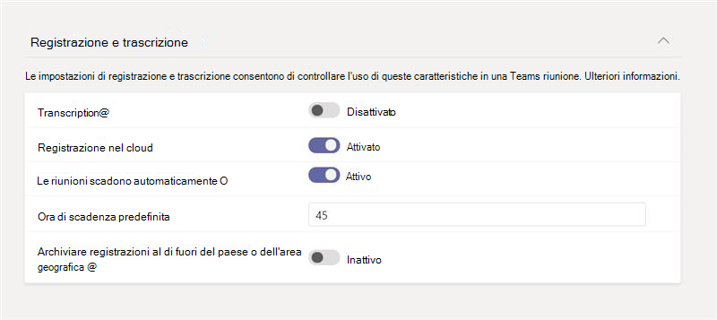

# <a name="meeting-policies-and-meeting-expiration-in-microsoft-teams"></a>Criteri di riunione e scadenza della riunione in Microsoft Teams

[I criteri](meeting-policies-overview.md) riunione in Microsoft Teams vengono usati per controllare se gli utenti dell'organizzazione possono avviare e pianificare le riunioni e le funzionalità disponibili per i partecipanti alle riunioni pianificate dagli utenti. È possibile usare il criterio globale (predefinito a livello di organizzazione) o creare e assegnare criteri personalizzati. È possibile gestire i criteri riunione nell'interfaccia di amministrazione di Microsoft Teams o usando i cmdlet di PowerShell [Get](/powershell/module/skype/get-csteamsmeetingpolicy), [New](/powershell/module/skype/new-csteamsmeetingpolicy), [Set](/powershell/module/skype/set-csteamsmeetingpolicy), [Remove](/powershell/module/skype/remove-csteamsmeetingpolicy), [Grant](/powershell/module/skype/grant-csteamsmeetingpolicy) -CsTeamsMeetingPolicy.

Le impostazioni dei criteri di riunione che controllano se gli utenti possono avviare e pianificare riunioni e controllano anche la scadenza delle riunioni pianificate dagli utenti. Quando un collegamento di partecipazione alla riunione e l'ID conferenza per una riunione scadono, nessuno può partecipare alla riunione. Le impostazioni dei criteri di riunione seguenti determinano se gli utenti possono avviare e pianificare riunioni in Teams. Questo articolo illustra le impostazioni della riunione.

- [Riunione nei canali](meeting-policies-in-teams-general.md#meet-now-in-channels): controlla se un utente può avviare una riunione esemptuosa in un canale.
- [Pianificazione delle riunioni del canale](meeting-policies-in-teams-general.md#channel-meeting-scheduling): controlla se un utente può pianificare una riunione in un canale.
- [Pianificazione di riunioni private](meeting-policies-in-teams-general.md#private-meeting-scheduling): controlla se un utente può pianificare una riunione privata in Teams. Una riunione è privata quando non viene pubblicata in un canale in un team.
- [Outlook componente aggiuntivo](meeting-policies-in-teams-general.md#outlook-add-in): controlla se un utente può pianificare una riunione privata da Outlook. Una riunione è privata quando non viene pubblicata in un canale in un team.
- [Riunione ora in riunioni private](meeting-policies-in-teams-general.md#meet-now-in-private-meetings): controlla se un utente può avviare una riunione privata improvvisata.

Per impostazione predefinita, queste impostazioni sono disponibili. Quando una di queste impostazioni è disattivata, qualsiasi utente a cui è assegnato il criterio non può avviare o pianificare nuove riunioni di quel tipo. Allo stesso tempo, i collegamenti di partecipazione alla riunione e gli ID conferenza di tutte le riunioni esistenti di quel tipo che l'utente ha avviato o pianificato in precedenza scadono.

Ad esempio, se a un utente viene assegnato un criterio di riunione in cui queste impostazioni dei criteri riunione sono impostate su **Attivata e** quindi si disattiva l'impostazione Consenti riunione ora **nei** canali, l'utente non può più avviare riunioni esromptu nei canali e il canale Riunione ora partecipa ai collegamenti creati dall'utente in precedenza sono scaduti. L'utente può comunque avviare e pianificare altri tipi di riunione e partecipare a riunioni organizzate da altre persone.

## <a name="what-happens-when-the-meeting-join-link-and-conference-id-expire"></a>Cosa succede quando il collegamento di partecipazione alla riunione e l'ID conferenza scadono?

Quando il collegamento per partecipare alla riunione e l'ID conferenza per una riunione scadono, nessuno può partecipare alla riunione. Quando un utente prova a partecipare alla riunione tramite il collegamento o tramite telefono, viene visualizzato un messaggio che indica che la riunione non è più disponibile. Le conversazioni, i file, le lavagne, le registrazioni, le trascrizioni e altri contenuti correlati alla riunione vengono mantenuti e gli utenti possono comunque accedervi.

## <a name="what-happens-when-you-turn-on-and-turn-off-a-meeting-policy-setting"></a>Cosa succede quando si attiva e si disattiva un'impostazione dei criteri riunione?

### <a name="switch-a-meeting-policy-setting-from-on-to-off"></a>Attivare o disattivare un'impostazione dei criteri per le riunioni

Quando un'impostazione dei criteri riunione è impostata su **Attivata**, gli utenti a cui è assegnato il criterio possono avviare o pianificare riunioni di questo tipo e tutti possono partecipare. Quando si imposta il criterio riunione su **Disattivato, gli** utenti a cui è assegnato il criterio non possono avviare o pianificare nuove riunioni di questo tipo e i collegamenti per la partecipazione alla riunione e gli ID conferenza delle riunioni esistenti pianificate in precedenza dall'utente sono scaduti.

Tenere presente che l'utente può comunque partecipare a riunioni organizzate da altre persone.

### <a name="switch-a-meeting-policy-setting-from-off-to-on"></a>Attivare o disattivare un'impostazione dei criteri per le riunioni

Quando si cambia l'impostazione dei criteri  di una riunione da Disattivato a **Attivata**, gli utenti a cui è assegnato il criterio possono avviare o pianificare riunioni di quel tipo. Se un'impostazione dei criteri riunione è disattivata e quindi nuovamente attivata per un utente, tutte le riunioni pianificate (e scadute) precedentemente organizzate dall'utente diventano attive e le persone possono partecipare usando il collegamento di partecipazione alla riunione o tramite telefono.  

## <a name="meeting-expiration-scenarios"></a>Scenari di scadenza delle riunioni

Ecco un riepilogo del funzionamento della scadenza della riunione per ognuna delle impostazioni dei criteri di riunione descritte in questo articolo.

|Se si vuole...&nbsp;&nbsp; |Eseguire questa operazione&nbsp;&nbsp;&nbsp;&nbsp;  |Comportamento di partecipazione alla riunione&nbsp;&nbsp;&nbsp;&nbsp;  |
|---------------------------|---------------------|---------|
|Scadenza riunione privata ora riunioni avviate da un utente&nbsp;&nbsp;|Disattivare **Riunione ora nelle riunioni private**.&nbsp;&nbsp;|Nessuno può partecipare alle riunioni **private di Meet now** avviate dall'utente.|
|Scadere le riunioni private pianificate da un utente&nbsp;&nbsp;|Disattivare **la pianificazione delle riunioni private** _e_ disattivare **Outlook componente aggiuntivo**. &nbsp;&nbsp;|Nessuno può partecipare a riunioni private pianificate dall'utente. In questo modo si impedisce agli utenti di partecipare alle riunioni seguenti:<ul><li>Riunioni private avvenute in passato.</li><li>Riunioni private pianificate per il futuro e non ancora avvenute.</li><li>Istanze future di riunioni private ricorrenti.</li></ul><br>La **pianificazione delle riunioni private** **e Outlook componente** aggiuntivo deve essere disattivata per scadere le riunioni private pianificate da un utente. Se un'impostazione è disattivata e l'altra è attivata, i collegamenti e gli ID conferenza delle riunioni esistenti rimangono attivi e non saranno scaduti.|
|Scadenza del canale **Riunione ora riunioni** avviate da un utente&nbsp;&nbsp;|Disattiva **Riunione ora nei canali e** _disattiva_ la **pianificazione delle riunioni del Canale**.&nbsp;&nbsp;|Nessuno può partecipare al canale **Riunione ora** le riunioni avviate dall'utente.|
|Scadere le riunioni del canale pianificate da un utente&nbsp;&nbsp;|Disattivare la **pianificazione delle riunioni del Canale**.&nbsp;&nbsp;|Nessuno può partecipare alle riunioni del canale pianificate dall'utente. In questo modo si impedisce agli utenti di partecipare alle riunioni seguenti:<ul><li>Riunioni del canale avvenute in passato.</li><li>Riunioni del canale pianificate per il futuro e non ancora avvenute.</li><li>Istanze future di riunioni di canale ricorrenti.</li></ul>|

Se si vuole che gli utenti accertano le riunioni pianificate o avviate in precedenza da un determinato utente, è possibile:

- Attivare l'impostazione dei criteri riunione per l'utente.
- Disattivare l'impostazione dei criteri riunione per l'utente e impostare un altro utente con l'impostazione dei criteri abilitata per creare una nuova riunione per sostituire la riunione scaduta.

> [!NOTE]
> Se la riunione è stata inviata da un delegato, a cui sono state concesse le autorizzazioni per inviare inviti alle riunioni per conto di un'altra persona, ad esempio un responsabile, l'impostazione dei criteri di riunione viene applicata alla persona che ha concesso l'autorizzazione (il responsabile).

## <a name="changes-to-meeting-expiration"></a>Modifiche alla scadenza della riunione

> [!IMPORTANT]
> Se si vuole abilitare la scadenza Teams riunione nel tenant in anticipo, applicare al programma Microsoft Teams per l'adozione anticipata della [riunione](https://forms.office.com/pages/responsepage.aspx?id=v4j5cvGGr0GRqy180BHbR8YMDA0A9INMv_DZ8yW5uG1URDc3U1VVMklPTzVMS0RLR0pUQTlWU1BEVC4u).

Tutte le registrazioni Teams riunione appena create avranno una scadenza predefinita di 120 giorni. Questa opzione è disponibile per impostazione predefinita per tutti i tenant. Questo significa che, per impostazione predefinita, tutti i TMR creati dopo l'accosto di questa caratteristica verranno eliminati 120 giorni dopo la data di creazione. Gli amministratori possono anche impostare le riunioni in modo che **non scadano mai automaticamente**. Il sistema OneDrive e SharePoint monitorerà la data di scadenza impostata in tutti i TMR e sposterà automaticamente i TMR nel Cestino alla data di scadenza.

> [!NOTE]
> Una copia della trascrizione della riunione viene salvata in OneDrive SharePoint e una seconda copia viene salvata in Exchange nello spazio di archiviazione temporaneo. La copia OSDP scade alla scadenza automatica di TMR.

La scadenza automatica delle riunioni è un meccanismo di pulizia leggero per ridurre i disordini di archiviazione creati da TMR meno recenti. In media, in tutti i clienti, il 96% dei TMR non viene osservato dopo 60 giorni e il 99% non viene osservato dopo 110 giorni. Riteniamo che quasi tutti i clienti trarranno vantaggio dal carico di archiviazione ridotto nel tenant rimuovendo le registrazioni che probabilmente non verranno più visualizzate dopo 60 giorni. Il nostro obiettivo è offrire un'esperienza il più pulita possibile a tutti i clienti per impostazione predefinita.

Usare la scadenza della riunione per limitare OneDrive o SharePoint consumo di spazio di archiviazione nel cloud basato sui record Teams riunione. Una tipica registrazione della riunione consuma circa 400 MB all'ora di registrazione.

> [!NOTE]
> La data di scadenza predefinita massima per gli utenti di A1 è 30 giorni.

### <a name="expiration-date"></a>Data di scadenza

- La data di scadenza viene calcolata come il giorno in cui viene creata più il numero predefinito di giorni impostato nel criterio di Teams **dall'amministratore**.
- La riproduzione non influisce sulla data di scadenza.

### <a name="change-the-default-expiration-date"></a>Modificare la data di scadenza predefinita

Gli amministratori possono modificare l'impostazione di scadenza predefinita in PowerShell o nell'Teams di amministrazione. Tutte le modifiche avranno effetto solo *sui TMR* appena creati da quel punto in poi. Non influisce sulle registrazioni create prima di tale data. Gli amministratori non possono modificare la data di scadenza nei TMR esistenti. Questa operazione viene eseguita per proteggere la decisione dell'utente proprietario del TMR. Sia le riunioni che le chiamate possono essere controllate da questa impostazione.

Il valore della data di scadenza può essere impostato nel modo seguente:

- Valore minimo: **1 giorno**
- Valore massimo: **99.999 giorni**
- È anche possibile impostare la data di scadenza **su -1** in modo che le registrazioni non scadano mai.

Esempio di comando di PowerShell:

```powershell
Set-CsTeamsMeetingPolicy -Identity Global -NewMeetingRecordingExpirationDays 50
```

È possibile impostare la data di scadenza nell'Teams di amministrazione in **Criteri riunione.** Dopo aver impostato la **scadenza** automatica delle riunioni, si otterrà l'opzione per impostare la scadenza della registrazione.



### <a name="security-and-compliance"></a>Sicurezza e conformità

#### <a name="should-i-rely-on-this-feature-for-strict-security-and-compliance-adherence"></a>È consigliabile affidarsi a questa caratteristica per una rigorosa conformità alla sicurezza e alla conformità?

No, non è consigliabile affidarsi a questa opzione per la protezione legale, perché gli utenti finali possono modificare la data di scadenza di tutte le registrazioni che controllano.

#### <a name="will-a-retention-andor-deletion-policy-ive-set-in-the-security--compliance-center-override-the-teams-meeting-recording-expiration-setting"></a>I criteri di conservazione e/o eliminazione impostati nel Centro sicurezza & conformità sovrascriveranno l'impostazione di scadenza della registrazione Teams riunione?

Sì, tutti i criteri impostati nel Centro conformità avranno la precedenza completa.

Ad esempio:

- Se si dispone di un criterio che indica che tutti i file di un sito devono essere conservati per 100 giorni e che l'impostazione di scadenza per la registrazione di una riunione di Teams è di 30 giorni, la registrazione verrà mantenuta per tutti i 100 giorni.
- Se si dispone di un criterio di eliminazione che indica che tutte le registrazioni delle riunioni di Teams verranno eliminate dopo cinque giorni e si ha un'impostazione di scadenza per una registrazione di una riunione Teams di 30 giorni, la registrazione verrà eliminata dopo cinque giorni.

### <a name="will-this-feature-enforce-file-retention"></a>Questa funzionalità implicherà la conservazione dei file?

No, i file non verranno mantenuti a causa di questa caratteristica o delle relative impostazioni. Se un utente con autorizzazioni di eliminazione tenta di eliminare una registrazione di una riunione di Teams con l'impostazione di scadenza attiva, l'azione da parte dell'utente verrà eseguita.

### <a name="what-skus-are-required-for-this-feature"></a>Quali SKU sono necessari per questa funzionalità?

- Per impostazione predefinita, tutti gli SKU avranno questa funzionalità.
- Per impostazione predefinita, gli utenti di A1 avranno un periodo di scadenza massimo di 30 giorni, ma potranno modificare la data di scadenza in base alle esigenze.

### <a name="what-if-i-want-the-admin-to-have-full-control-over-the-lifecycle-of-meeting-recordings-and-dont-want-to-give-end-users-the-ability-to-override-the-expiration-date"></a>Cosa succede se si vuole che l'amministratore abbia il controllo completo sul ciclo di vita delle registrazioni delle riunioni e non si voglia offrire agli utenti finali la possibilità di ignorare la data di scadenza?

È consigliabile usare i criteri di conservazione e/o eliminazione di Sicurezza e conformità. Questa offerta è destinata a risolvere problemi legali amministrativi complessi e basati sul contratto di servizio.

La funzionalità di scadenza automatica è pensata esclusivamente come meccanismo di pulizia leggero per ridurre i disordini di archiviazione creati dalle registrazioni Teams riunioni.

### <a name="will-future-tmrs-migrated-from-classic-stream-after-this-feature-is-released-have-auto-expiration-applied-to-them-too"></a>Le future richieste di registrazione migrate da Stream (versione classica) dopo il rilascio di questa funzionalità avranno anche la scadenza automatica?

No, le registrazioni migrate non avranno una scadenza. Al contrario, si consiglia agli amministratori di eseguire la migrazione solo delle registrazioni che vogliono conservare. Verranno forniti maggiori dettagli nella documentazione sulla migrazione.

### <a name="how-is-this-feature-different-from-the-expiration-message-i-see-when-a-tmr-upload-to-onedrive-and-sharepoint-fails"></a>In che modo questa funzionalità è diversa dal messaggio di scadenza visualizzato quando un caricamento TMR in OneDrive e SharePoint non riesce?

Quando una registrazione non viene caricata in OneDrive o SharePoint, l'applicazione Teams visualizza nella chat un messaggio che indica che gli utenti hanno fino a 21 giorni per scaricare il TMR prima di essere eliminati definitivamente dal server Teams. Questa esperienza di scadenza esistente a causa di caricamenti TMR non riusciti non è correlata alla funzionalità di OneDrive e SharePoint di scadenza automatica discussa nel documento della Guida.

### <a name="how-do-i-know-the-distribution-of-tmr-playbacks-so-i-know-what-the-optimal-auto-expiration-default-should-be-for-my-tenant"></a>Come si conosce la distribuzione delle riproduzioni TMR in modo da sapere quale dovrebbe essere la scadenza automatica ottimale predefinita per il tenant?

1. Trovare il video nella raccolta.
1. Selezionare **...** >  **Dettagli**
1. Selezionare il numero di visualizzazioni nella parte superiore del riquadro dei dettagli.

Verranno visualizzate le statistiche sui file che mostrano:

- Il numero di visualizzatori univoci
- Numero di visualizzazioni totali
- La tendenza degli spettatori e delle visualizzazioni giorno per giorno per gli ultimi 90 giorni
- Conservazione della visualizzazione (quale parte del video è stata visualizzata o non è stata visualizzata)

## <a name="related-topics"></a>Argomenti correlati

[Modificare la data di scadenza della riunione - controlli per l'utente finale](https://support.microsoft.com/office/record-a-meeting-in-teams-34dfbe7f-b07d-4a27-b4c6-de62f1348c24#bkmk_view_change_expiration_date)

[Gestire i criteri di riunione in Teams](meeting-policies-overview.md)

[Assegnare i criteri agli utenti in Teams](policy-assignment-overview.md)

[Panoramica di PowerShell per Teams](teams-powershell-overview.md)


