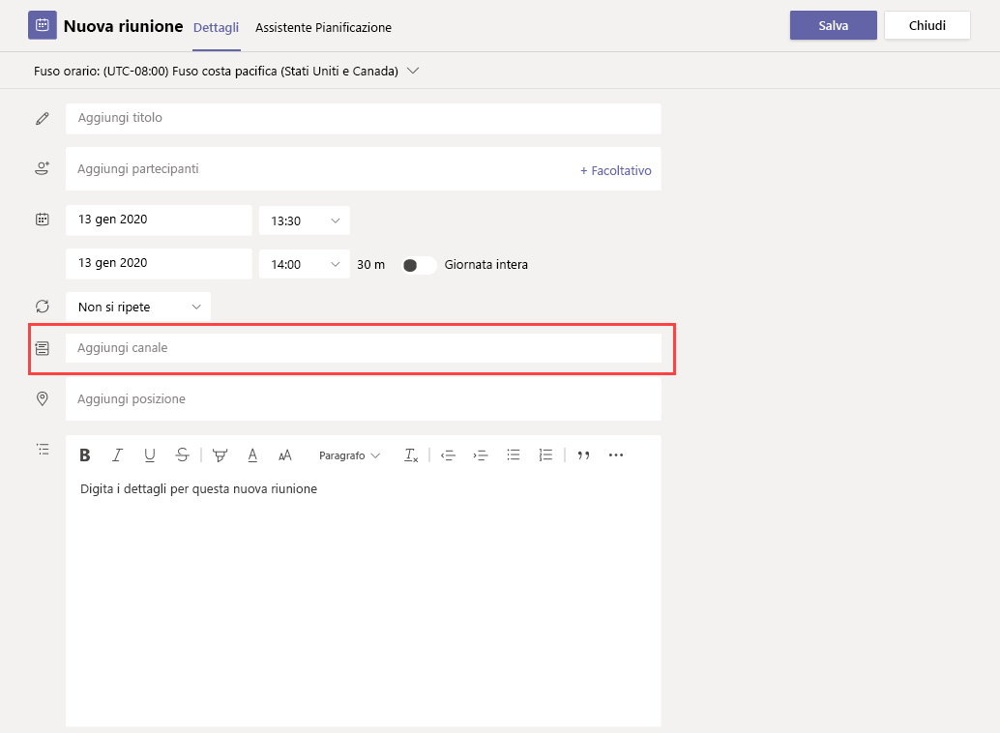

# Impostazioni dei criteri di riunione - Generale

Questo articolo descrive le seguenti impostazioni dei criteri generali per le riunioni di Teams:

- [Riunione immediata nei canali](#meet-now-in-channels)
- [Componente aggiuntivo di Outlook](#outlook-add-in)
- [Pianificazione delle riunioni di canale](#channel-meeting-scheduling)
- [Pianificazione riunione privata](#private-meeting-scheduling)
- [Report sull'impegno](#engagement-report)
- [Registrazione riunione](#meeting-registration)
- [Webinar](#webinars)
- [Provider di riunioni per la modalità Isole](#meeting-provider-for-islands-mode)
- [Reazioni delle riunioni](#meeting-reactions)
- [Speaker Coach](#speaker-coach)

## Riunione immediata nei canali

Questo è un criterio per utente e si applica prima dell'inizio di una riunione. Questa impostazione controlla se un utente può avviare una riunione non pianificata in un canale di Teams. Se si attiva questa impostazione, gli utenti possono fare clic sul pulsante **Riunione** per avviare una riunione non pianificata o pianificare una riunione nel canale. Questa impostazione è attivata per impostazione predefinita.

## Componente aggiuntivo di Outlook

Questo è un criterio per utente e si applica prima dell'inizio di una riunione. Questa impostazione consente di controllare se è possibile pianificare riunioni di Teams dall'interno di Outlook (Windows, Mac, Web e Mobile).

Se si disattiva questa impostazione, gli utenti non sono in grado di pianificare le riunioni di Teams quando creano una nuova riunione in Outlook. In Outlook per Windows, ad esempio, l'opzione **Nuova riunione di Teams** non comparirà sulla barra multifunzione.

## Pianificazione delle riunioni di canale

Usare il criterio AllowChannelMeetingScheduling esistente per controllare i tipi di eventi che è possibile creare nei calendari del canale di un team. Questo è un criterio per utente e si applica prima dell'inizio di una riunione. Questa impostazione controlla se gli utenti possono pianificare una riunione in un canale di Teams. Per impostazione predefinita, questa impostazione è attivata.

Se questo criterio è disattivato, gli utenti non potranno creare nuove riunioni di canale. Tuttavia, le riunioni di canale esistenti possono essere modificate dall'organizzatore dell'evento.

L'opzione Pianifica una riunione sarà disabilitata.

La selezione del canale è disabilitata.

Nella pagina dei post del canale verranno disabilitate le funzionalità seguenti:

- Pulsante **Pianifica una riunione** nella casella per comporre una risposta del canale.
  
  
- Pulsante **Pianifica una riunione** nell'intestazione del canale.
  

Nel calendario del canale:

- Il pulsante **Aggiungi nuovo evento** nell'intestazione del calendario del canale sarà disabilitato.
  

- Gli utenti non saranno in grado di trascinare e selezionare un intervallo di tempo nel calendario del canale per creare una riunione di canale.

- Gli utenti non possono usare le scelte rapide da tastiera per creare una riunione nel calendario del canale.

Nell'interfaccia di amministrazione:

L'app del calendario del canale sarà visualizzata nella sezione **App Microsoft** nella pagina dei criteri di autorizzazione delle app.

## Pianificazione riunione privata

Questo è un criterio per utente e si applica prima dell'inizio di una riunione. Questa impostazione controlla se gli utenti possono pianificare riunioni private in Teams. Una riunione è privata quando non viene pubblicata in un canale in un team. **La pianificazione delle riunioni private** è attivata per impostazione predefinita.

Se si disattivano sia le impostazioni **di pianificazione delle riunioni private** che di **quella del canale** , le opzioni **Aggiungi partecipanti obbligatori** e **Aggiungi canale** sono disabilitate per gli utenti in Teams.

## Report sull'impegno

Questo è un criterio per utente. Questa impostazione controlla se gli organizzatori della riunione possono scaricare il [report sull'impegno della riunione](teams-analytics-and-reports/meeting-attendance-report.md).

Questo criterio è attivato per impostazione predefinita e consente agli organizzatori di vedere chi si è registrato e ha partecipato alle riunioni e ai webinar configurati. Per disattivarlo nell'interfaccia di amministrazione di Teams, passare a Criteri **riunione** **riunioni** >  e impostare l'impostazione **Report impegni** su **Disattivato**.

È anche possibile modificare un criterio riunione di Teams esistente utilizzando il cmdlet [Set-CsTeamsMeetingPolicy](/powershell/module/skype/set-csteamsmeetingpolicy) . In alternativa, è possibile creare un nuovo criterio per le riunioni di Teams usando il cmdlet [New-CsTeamsMeetingPolicy](/powershell/module/skype/new-csteamsmeetingpolicy) e assegnarlo agli utenti.

Per impostazione predefinita, il parametro **AllowEngagementReport** è impostato su **Abilitato** in PowerShell. Per impedire a un organizzatore della riunione di scaricare il report sull'impegno della riunione, impostare il parametro **AllowEngagementReport** su **Disabled**.

Quando questo criterio è abilitato, l'opzione per scaricare il report sull'impegno della riunione viene visualizzata nel riquadro **Partecipanti** .

> [!NOTE]
> Gli amministratori non possono visualizzare il report presenze per le riunioni che non si organizzano. Tuttavia, è possibile visualizzare i dettagli dei partecipanti per una determinata riunione entro 24 ore dalla riunione. Nell'interfaccia di amministrazione di Teams passare a **Gestisci utenti** > **.** Scegliere il nome visualizzato per l'organizzatore della riunione. Selezionare la scheda **Riunioni & chiamate** e quindi scegliere l'ID riunione o l'ID chiamata appropriato. Selezionare quindi **Dettagli partecipante**.

Per altre informazioni, inclusi i limiti del report sull'impegno, vedere [Visualizzare e scaricare i report sulla partecipazione alle riunioni in Teams](https://support.microsoft.com/office/ae7cf170-530c-47d3-84c1-3aedac74d310).

## Registrazione riunione

Questo è un criterio per utente. Se si attiva questa impostazione, gli utenti dell'organizzazione possono aggiungere la registrazione a una riunione. Questo criterio è abilitato per impostazione predefinita.

Per altre informazioni sulla registrazione della riunione, vedere [Configurare la registrazione della riunione](set-up-webinars.md#configure-meeting-registration).

## Webinar

Questo è un criterio per utente. Se si abilitano webinar, gli utenti dell'organizzazione possono creare webinar con una solida gestione delle registrazioni, siti di registrazione e eventi personalizzabili e opzioni predefinite per le riunioni orientate agli eventi. Questo criterio è abilitato per impostazione predefinita.

Per altre informazioni sui webinar, vedere [Configurare webinar](set-up-webinars.md).

Per altre informazioni sulle differenze tra riunioni, webinar ed eventi live, vedere [Riunioni, webinar ed eventi live](quick-start-meetings-live-events.md).

## Provider di riunioni per la modalità Isole

Questo è un criterio per utente. Questa impostazione controlla se il componente aggiuntivo di Outlook viene usato per gli *utenti in modalità Isole*. È possibile specificare se gli utenti possono usare solo il componente aggiuntivo Riunione di Teams o sia Riunione di Teams che Riunione di Skype for Business per programmare le riunioni in Outlook.

È possibile applicare questo criterio agli utenti in modalità Isole e che hanno impostato il parametro **AllowOutlookAddIn** su **True** nel loro criterio per le riunioni di Teams.

Attualmente, è possibile usare solo PowerShell per impostare questo criterio. È possibile modificare un criterio di riunione di Teams esistente usando il cmdlet [Set-CsTeamsMeetingPolicy](/powershell/module/skype/set-csteamsmeetingpolicy). In alternativa, è possibile creare un nuovo criterio per le riunioni di Teams usando il cmdlet [New-CsTeamsMeetingPolicy](/powershell/module/skype/new-csteamsmeetingpolicy) e assegnarlo agli utenti.

Per specificare il componente aggiuntivo per le riunioni da rendere disponibile per gli utenti, impostare il parametro **PreferredMeetingProviderForIslandsMode** come indicato di seguito:

- Impostare il parametro su **TeamsAndSfB** per abilitare il componente aggiuntivo Riunione di Teams e il componente aggiuntivo Skype for Business in Outlook. **TeamsAndSfB** è il valore predefinito.
- Impostare il parametro su **Teams** per abilitare solo il componente aggiuntivo Riunione di Teams in Outlook. Questa impostazione dei criteri garantisce che tutte le riunioni future abbiano un collegamento per accedere a una riunione di Teams. Non viene eseguita la migrazione dei collegamenti di accesso alle riunioni di Skype for Business esistenti in Teams. Questa impostazione dei criteri non influisce su presenza, chat, chiamate PSTN o altre funzionalità di Skype for Business, il che significa che gli utenti continueranno a usare Skype for Business per queste funzioni.

  Se si imposta il parametro su **Teams** e poi di nuovo su **TeamsAndSfB**, entrambi i componenti aggiuntivi per le riunioni saranno abilitati. Tuttavia, i collegamenti di accesso alle riunioni di Teams esistenti non verranno migrati in Skype for Business. Solo le riunioni di Skype for Business pianificate dopo la modifica avranno un collegamento di accesso a una riunione di Skype for Business.

## Reazioni delle riunioni

La disponibilità delle reazioni alle riunioni può essere configurata tramite l'interfaccia di amministrazione di Teams o tramite PowerShell. Le reazioni alle riunioni sono abilitate per impostazione predefinita.

Nell'interfaccia di amministrazione di Teams, le reazioni alle riunioni possono essere abilitate o disabilitate in base ai **criteri delle riunioni**  >  nella sezione **Partecipanti & guest** dei criteri per le riunioni.

Per configurare l'impostazione in PowerShell, utilizzare il cmdlet [Set-CsTeamsMeetingPolicy](/powershell/module/skype/set-csteamsmeetingpolicy) . Per disattivarlo, impostare **AllowMeetingReactions** **su False**.

Disattivare le reazioni per un utente non significa che un utente non può usare le reazioni nelle riunioni pianificate. L'organizzatore della riunione può comunque attivare le reazioni dalla pagina delle opzioni della riunione, indipendentemente dall'impostazione predefinita.

## Speaker Coach

Questa impostazione consente agli utenti di attivare Speaker Coach durante una riunione di Teams. Speaker Coach ascolta l'audio dell'utente durante la presentazione e fornisce feedback privati in tempo reale e suggerimenti per il miglioramento. L'utente riceve anche un riepilogo del feedback dopo la riunione.

> [!NOTE]
> L'utente che ha attivato Speaker Coach durante la riunione è l'unico che può vedere il report di riepilogo del feedback. Gli amministratori non avranno accesso a questi dati.

Attualmente, è possibile impostare e modificare questo criterio solo in PowerShell. utilizzando il cmdlet [Set-CsTeamsMeetingPolicy](/powershell/module/skype/set-csteamsmeetingpolicy) . In alternativa, è possibile creare un nuovo criterio per le riunioni di Teams usando il cmdlet [New-CsTeamsMeetingPolicy](/powershell/module/skype/new-csteamsmeetingpolicy) e assegnarlo agli utenti.

Questa impostazione è abilitata per impostazione predefinita. Per disattivarlo, impostare **AllowMeetingCoach** **su False**.

## Argomenti correlati

- [Panoramica di PowerShell per Teams](teams-powershell-overview.md)
- [Assegnare criteri in Teams](policy-assignment-overview.md)
- [Rimuovere dagli utenti il criterio RestrictedAnonymousAccess per le riunioni di Teams](meeting-policies-restricted-anonymous-access.md)
