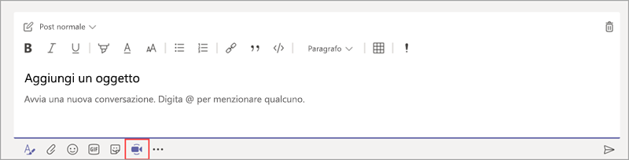
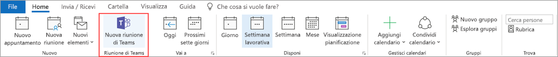
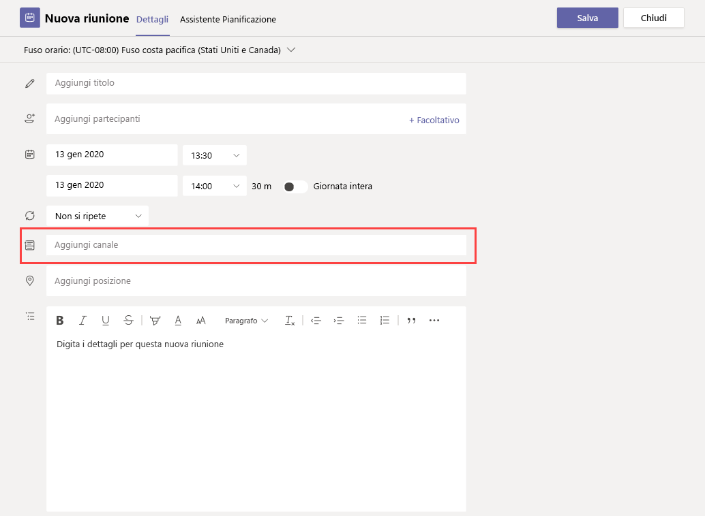
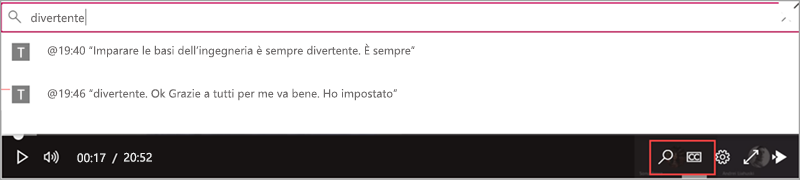
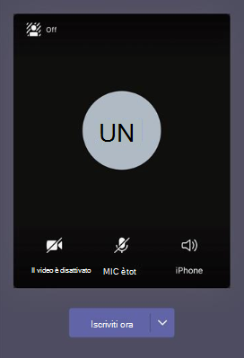
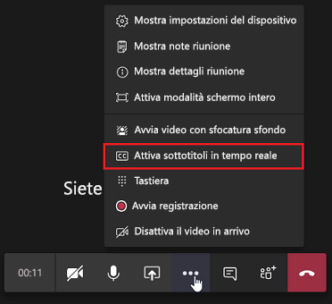

# Gestire i criteri di riunione in Teams

::: zone target="docs"
I criteri riunione vengono usati per controllare le funzionalità disponibili per i partecipanti alle riunioni programmate dagli utenti nell'organizzazione. È possibile usare il criterio globale (predefinito a livello di organizzazione) creato automaticamente oppure creare e assegnare criteri personalizzati. Si possono gestire i criteri di riunione nell'interfaccia di amministrazione di Microsoft Teams o tramite [PowerShell](teams-powershell-overview.md).

> [!NOTE]
> Per informazioni sull'utilizzo dei ruoli per gestire le autorizzazioni dei relatori e dei partecipanti delle riunioni, vedere [Ruoli in una riunione di Teams](https://support.microsoft.com/office/roles-in-a-teams-meeting-c16fa7d0-1666-4dde-8686-0a0bfe16e019?ui=en-us&rs=en-us&ad=us).

È possibile implementare i criteri nei modi descritti di seguito. La scelta influisce sull'esperienza di riunione per gli utenti prima, durante o dopo una riunione.

|Tipo di implementazione  |Descrizione  |
|---------|---------|
|Per organizzatore    |Quando si implementa un criterio per organizzatore, tutti i partecipanti alla riunione ereditano il criterio dell'organizzatore. Ad esempio, **Ammetti automaticamente le persone** è un criterio per organizzatore e controlla se gli utenti accedono direttamente alla riunione oppure attendono nella sala di attesa per le riunioni pianificate dall'utente a cui è assegnato il criterio.          |
|Per utente    |Quando si implementano criteri per utente, viene applicato solo il criterio per utente per limitare l'uso di determinate funzionalità da parte dell'organizzatore e/o dei partecipanti alla riunione. Ad esempio, **Consenti l'uso di Riunione immediata nei canali** è un criterio per utente.     |
|Per organizzatore e per utente     |Quando si implementa una combinazione di criteri per organizzatore e per utente, l'uso di alcune funzionalità da parte dei partecipanti alla riunione è limitato, in base ai criteri applicati al singolo utente e ai criteri dell'organizzatore. Ad esempio, **Consenti registrazione cloud** è un criterio per organizzazione e per utente. Attivare questa impostazione per consentire agli utenti di avviare e arrestare una registrazione.

È possibile modificare le impostazioni nel criterio globale o creare e assegnare uno o più criteri personalizzati. Se non si creano e assegnano criteri personalizzati, gli utenti riceveranno il criterio globale.

> [!NOTE]
> Il pulsante Dettagli riunione sarà disponibile se un utente ha le licenze di audioconferenza abilitate o se l'utente è autorizzato a partecipare alle audioconferenze; in caso contrario, i dettagli della riunione non saranno disponibili.

## Creare un criterio di riunione personalizzato

1. Nel riquadro di spostamento sinistro dell'interfaccia di amministrazione di Microsoft Teams passare a **Riunioni** > **Criteri riunione**.
2. Selezionare **Aggiungi**.
3. Immettere un nome e una descrizione per il criterio. Il nome non può contenere caratteri speciali o più di 64 caratteri.
4. Scegliere le impostazioni desiderate.
5. Selezionare **Salva**.

Ad esempio, si supponga di avere un gruppo di utenti e di voler limitare la larghezza di banda necessaria per la riunione. È possibile creare un nuovo criterio personalizzato denominato "Larghezza di banda limitata" e disabilitare le impostazioni seguenti:

In **Audio e video**:

- Disattivare Consenti registrazione cloud.
- Disattivare Consenti video IP.

In **Condivisione di contenuti**:

- Disabilitare la modalità di condivisione dello schermo.
- Disattivare Consenti la lavagna.
- Disattivare Consenti note condivise.

Assegnare poi il criterio agli utenti.

## Modificare un criterio di riunione

È possibile modificare il criterio globale e i criteri personalizzati creati.

1. Nel riquadro di spostamento sinistro dell'interfaccia di amministrazione di Microsoft Teams passare a **Riunioni** > **Criteri riunione**.
2. Selezionare il criterio facendo clic a sinistra del nome del criterio, quindi selezionare **Modifica**.
3. Da lì, apportare le modifiche desiderate.
4. Selezionare **Salva**.

> [!NOTE]
> A ogni utente può essere assegnato un solo criterio di riunione per volta.

## Assegnare un criterio riunione agli utenti

[!INCLUDE [assign-policy](includes/assign-policy.md)]

> [!NOTE]
> Non è possibile eliminare un criterio a cui sono utenti. È prima di tutto necessario assegnare un criterio diverso a tutti gli utenti interessati, quindi sarà possibile eliminare il criterio originale.

## Impostazioni dei criteri di riunione

Quando si seleziona un criterio esistente nella pagina **Criteri riunione** o si seleziona **Aggiungi** per aggiungere un nuovo criterio, è possibile configurare le impostazioni per gli elementi seguenti.

- [Generale](#meeting-policy-settings---general)
- [Audio e video](#meeting-policy-settings---audio--video)
- [Condivisione di contenuti](#meeting-policy-settings---content-sharing)
- [Partecipanti e ospiti](#meeting-policy-settings---participants--guests)

::: zone-end

## Impostazioni dei criteri di riunione - Generale

- [Consenti l'uso di Riunione immediata nei canali](#allow-meet-now-in-channels)
- [Consenti il componente aggiuntivo per Outlook](#allow-the-outlook-add-in)
- [Consenti la pianificazione delle riunioni di canale](#allow-channel-meeting-scheduling)
- [Consenti la pianificazione di riunioni private](#allow-scheduling-private-meetings)
- [Consenti l'uso di Riunione immediata nelle riunioni private](#allow-meet-now-in-private-meetings)

### Consenti l'uso di Riunione immediata nei canali

Consenti **Riunione immediata** è un criterio per utente e si applica prima dell'inizio di una riunione. Questa impostazione controlla se un utente può avviare una riunione non pianificata in un canale di Teams. Se si attiva questa impostazione, gli utenti possono selezionare il pulsante **incontra** per avviare una riunione non pianificata o pianificare una riunione nel canale. Il valore predefinito è True.

### Consenti il componente aggiuntivo per Outlook

Questo è un criterio per utente e si applica prima dell'inizio di una riunione. Questa impostazione consente di controllare se è possibile pianificare riunioni di Teams dall'interno di Outlook (Windows, Mac, Web e Mobile).

Se si disattiva questa impostazione, gli utenti non potranno pianificare riunioni di Teams durante la creazione di una nuova riunione in Outlook. In Outlook per Windows, ad esempio, l'opzione **Nuova riunione di Teams** non comparirà sulla barra multifunzione.

### Consenti la pianificazione delle riunioni di canale

Usare il criterio AllowChannelMeetingScheduling esistente per controllare i tipi di eventi che è possibile creare nei calendari del canale di un team. Questo è un criterio per utente e si applica prima dell'inizio di una riunione. Questa impostazione controlla se gli utenti possono pianificare una riunione in un canale di Teams. Per impostazione predefinita, questa impostazione è attivata.

Se questo criterio è disattivato, gli utenti non potranno creare nuove riunioni di canale. Tuttavia, le riunioni di canale esistenti possono essere modificate dall'organizzatore dell'evento.

L'opzione Pianifica una riunione sarà disabilitata.

 

La selezione del canale è disabilitata.

Nella pagina dei post del canale, le funzionalità seguenti saranno disabilitate:

- Pulsante **Pianifica una riunione** nella casella per comporre una risposta del canale.
  
  
- Pulsante **Pianifica una riunione** nell'intestazione del canale.
  

Nel calendario del canale:

- Il pulsante **Aggiungi nuovo evento** nell'intestazione del calendario del canale sarà disabilitato.
  

- Gli utenti non saranno in grado di trascinare e selezionare un intervallo di tempo nel calendario del canale per creare una riunione di canale.

- Gli utenti non possono usare le scelte rapide da tastiera per creare una riunione nel calendario del canale.

Nell'interfaccia di amministrazione:

L'app del calendario del canale sarà visualizzata nella sezione **App Microsoft** nella pagina dei criteri di autorizzazione delle app.

 

### Consenti la pianificazione di riunioni private

Questo è un criterio per utente e si applica prima dell'inizio di una riunione. Questa impostazione controlla se gli utenti possono pianificare riunioni private in Teams. Una riunione è privata quando non viene pubblicata in un canale in un team.

Si noti che, disattivando **Consenti la pianificazione di riunioni private** e **Consenti la pianificazione delle riunioni di canale**, le opzioni **Aggiungi partecipanti obbligatori** e **Aggiungi canale** vengono disabilitate per gli utenti in Teams. Per impostazione predefinita, questa impostazione è attivata.

### Consenti l'uso di Riunione immediata nelle riunioni private

Questo è un criterio per utente e si applica prima dell'inizio di una riunione. Questa impostazione controlla se un utente può avviare una riunione privata non pianificata.  Per impostazione predefinita, questa impostazione è attivata.

## Impostazioni dei criteri di riunione - Audio e video

- [Consenti la trascrizione](#allow-transcription)
- [Consenti registrazione cloud](#allow-cloud-recording)
- [Modalità per audio IP](#mode-for-ip-audio)
- [Modalità per video IP](#mode-for-ip-video)
- [Consenti video IP](#allow-ip-video)
- [Velocità in bit supporto (Kbs)](#media-bit-rate-kbs)

### Consenti la trascrizione

Questa è una combinazione di criterio per organizzatore e criterio per utente. Questa impostazione controlla la disponibilità di didascalie e funzionalità di trascrizione durante la riproduzione di registrazioni delle riunioni. Se si disattiva questa opzione, durante la riproduzione di una registrazione di riunione non saranno disponibili le opzioni **Cerca** e **Cc**. La persona che ha avviato la registrazione ha bisogno che questa impostazione sia attivata perché la registrazione includa anche una trascrizione.

Si noti che la trascrizione per le riunioni registrate è attualmente supportata solo per gli utenti che hanno la lingua di Teams impostata sull'inglese e quando durante la riunione si usa l'inglese.

### Consenti registrazione cloud

Questa operazione viene controllata in base a un criterio per utente. Questa impostazione controlla se un utente può registrare. La registrazione può essere avviata dall'organizzatore della riunione o da un altro partecipante alla riunione se l'impostazione del criterio specifico è attivata e se si tratta di un utente autenticato della stessa organizzazione dell'organizzatore.

Le persone esterne all'organizzazione, ad esempio gli utenti federati e anonimi, non possono avviare la registrazione. Gli utenti guest non possono avviare o interrompere la registrazione.

Osserviamo l'esempio seguente.

|Utente |Criterio di riunione  |Consenti registrazione cloud |
|---------|---------|---------|
|Daniela | Globale   | Disattivato |
|Amanda | CriterioRiunionePosizione1 | Attivato|
|Luca (utente esterno) | Non applicabile | Non applicabile|

Daniela, anche se l'organizzatore non è in grado di registrare perché i criteri sono impostati su disattivato. Amanda, che ha attivato l'impostazione dei criteri, può registrare le riunioni anche quelle organizzate da Daniela. Se Amanda organizzerà una riunione, sarà in grado di registrare la riunione, ma Daniela, che ha l'impostazione del criterio disabilitata e John che è un utente esterno, non può registrare la riunione.

Per altre informazioni sulla registrazione di una riunione cloud, vedere [Registrazione delle riunioni cloud di Teams](cloud-recording.md).

### Modalità per audio IP

Questo è un criterio per utente. Questa impostazione controlla se l'audio può essere attivato nelle riunioni e nelle chiamate di gruppo. Ecco i valori per questa impostazione.

|Valore dell'impostazione |Comportamento  |
|---------|---------|
|**Audio in uscita e in arrivo abilitato**    |L'audio in uscita e in arrivo è consentito nella riunione. Questa è l'impostazione predefinita. |
|**Disattiva**     |L'audio in uscita e in arrivo è disattivato nella riunione.     |

Se l'opzione è impostata su **Disabilitato** per un utente, tale utente può comunque pianificare e organizzare riunioni ma senza poter usare l'audio. Per partecipare a una riunione, deve connettersi telefonicamente tramite la rete PSTN (Public Switched Telephone Network) o dal telefono. Per i partecipanti alla riunione che non hanno criteri assegnati (ad esempio, i partecipanti anonimi), questa opzione è impostata su **Audio in uscita e in arrivo abilitato** per impostazione predefinita. Nei client per dispositivi mobili di Teams, se questa impostazione è disabilitata, l'utente deve connettersi telefonicamente alla riunione tramite PSTN.

Questa impostazione non si applica alle chiamate tra due persone. Per limitare le chiamate tra due persone, configurare un [criterio di chiamata](teams-calling-policy.md) di Teams e disabilitare l'impostazione **Effettua chiamate private**. Questa impostazione non si applica nemmeno ai dispositivi delle sale riunioni come i dispositivi Surface Hub e Microsoft Teams Rooms.

Questa impostazione non è ancora disponibile per gli ambienti Microsoft 365 Government Community Cloud (GCC), GCC High o Department of Defense (DoD).

Per altre informazioni, vedere [Gestire audio/video per i partecipanti alle riunioni](#manage-audiovideo-for-meeting-participants).

### Modalità per video IP

Questo è un criterio per utente. Questa impostazione controlla se il video può essere attivato nelle riunioni e nelle chiamate di gruppo. Ecco i valori per questa impostazione.

|Valore dell'impostazione |Comportamento  |
|---------|---------|
|**Video in uscita e in arrivo abilitato**    | Il video in uscita e in arrivo è consentito nella riunione. Questa è l'impostazione predefinita. |
|**Disattiva**     | Il video in uscita e in arrivo è disattivato nella riunione. Nei client per dispositivi mobili di Teams, gli utenti non possono condividere video o foto nella riunione.   Se l'impostazione **Modalità per audio IP** è disabilitata, anche l'impostazione **Modalità per video IP** resterà disabilitata.  |

Se impostata su **Disabilitato** per un utente, tale utente non può attivare il video o visualizzare i video condivisi dagli altri partecipanti alla riunione. Per i partecipanti alla riunione che non hanno criteri assegnati (ad esempio, i partecipanti anonimi), questa opzione è impostata su **Video in uscita e in arrivo abilitato** per impostazione predefinita.

Questa impostazione non si applica ai dispositivi delle sale riunioni come i dispositivi Surface Hub e Microsoft Teams Rooms.

Questa impostazione non è ancora disponibile per gli ambienti Microsoft 365 Government Community Cloud (GCC), GCC High o Department of Defense (DoD).

> [!NOTE]
> Questa impostazione controlla il video in uscita e in arrivo, mentre l'impostazione **Consenti video IP** controlla solo il video in uscita. Per altre informazioni, vedere [Quale impostazione dei criteri per video IP ha la precedenza?](#which-ip-video-policy-setting-takes-precedence) e [Gestire audio/video per i partecipanti alle riunioni](#manage-audiovideo-for-meeting-participants).

Per altre informazioni, vedere [Gestire audio/video per i partecipanti alle riunioni](#manage-audiovideo-for-meeting-participants).

### Consenti video IP

Questa è una combinazione di criterio per organizzatore e criterio per utente. Il video è un componente chiave per le riunioni. In alcune organizzazioni, gli amministratori possono volere un maggiore controllo sugli utenti che possono usare il video nelle riunioni. Questa impostazione controlla se è possibile attivare il video nelle riunioni ospitate da un utente e nelle chiamate tra due persone e di gruppo avviate da un utente. Nei client per dispositivi mobili di Teams, questa impostazione controlla se gli utenti possono condividere foto e video in una riunione.

Le riunioni organizzate da un utente che ha questa impostazione di criteri abilitata consentono la condivisione di video nella riunione da parte dei partecipanti, se anche questi ultimi hanno l'impostazione di criteri abilitata. I partecipanti alla riunione a cui non sono assegnati criteri, ad esempio i partecipanti anonimi e federati, ereditano i criteri dell'organizzatore della riunione.

> [!NOTE]
> Questa impostazione controlla solo il video in uscita, mentre l'impostazione **Modalità per video IP** controlla il video in uscita e in arrivo. Per altre informazioni, vedere [Quale impostazione dei criteri per video IP ha la precedenza?](#which-ip-video-policy-setting-takes-precedence) e [Gestire audio/video per i partecipanti alle riunioni](#manage-audiovideo-for-meeting-participants).

| Client Web e desktop di Teams |Client per dispositivi mobili di Teams  |
|:-------:|:-------:|
|    |          |

Osserviamo l'esempio seguente.

|Utente |Criterio di riunione  |Consenti video IP |
|---------|---------|---------|
|Daniela   | Globale   | Attivato       |
|Amanda    | CriterioRiunionePosizione1        | Disattivato      |

Le riunioni ospitate da Daniela consentono di attivare il video. Daniela può partecipare alla riunione e attivare il video. Amanda non può attivare il video nella riunione di Daniela poiché il criterio di Amanda è impostato in modo da non consentire il video. Amanda può vedere i video condivisi da altri partecipanti alla riunione.

Nelle riunioni ospitate da Amanda nessuno può attivare il video, indipendentemente dai criteri video assegnati. Questo significa che Daniela non può attivare il video nelle riunioni di Amanda.  

Se Daniela chiama Amanda con il video, Amanda può rispondere alla chiamata solo con l'audio.  Una volta connessa la chiamata, Amanda potrà vedere il video di Daniela, ma non potrà attivare il video. Se Amanda chiama Daniela, Daniela può rispondere alla chiamata con il video e l'audio. Una volta connessa la chiamata, Daniela può attivare o disattivare suo video come desidera.

Per altre informazioni, vedere [Gestire audio/video per i partecipanti alle riunioni](#manage-audiovideo-for-meeting-participants).

#### Quale impostazione dei criteri per video IP ha la precedenza?

Per un utente, l'impostazione di criteri più restrittiva per il video ha la precedenza. Ecco alcuni esempi.

|Consenti video IP|Modalità per video IP|Esperienza di riunione|
|---------|---------|---------|
|Organizzatore: **Attivato**  Partecipante: **Attivato** |Partecipante: **Disabilitato**        |L'impostazione **Modalità per video IP** ha la precedenza. Il partecipante al quale è assegnato questo criterio non può attivare o visualizzare i video condivisi dagli altri.|
|Organizzatore: **Attivato**  Partecipante: **Attivato** |Partecipante: **Video in uscita e in arrivo abilitato**          |Il partecipante al quale è assegnato questo criterio può attivare o visualizzare i video condivisi dagli altri.         |
|Organizzatore: **Attivato**  Partecipante: **Disattivato** |Partecipante: **Video in uscita e in arrivo abilitato**         |L'impostazione **Consenti video IP** ha la precedenza. I partecipanti possono solo visualizzare video in arrivo e non inviare video in uscita.         |
|Organizzatore: **Attivato**  Partecipante: **Disattivato** |Partecipante: **Disabilitato**         |L'impostazione **Modalità per video IP** ha la precedenza. Il partecipante non può visualizzare il video in arrivo o in uscita.|
|Organizzatore: **Disattivato**    |       |L'opzione **Consenti video IP** ha la precedenza poiché è disattivata per l'organizzatore. Nessuno può attivare il video nelle riunioni organizzate dall'utente a cui è assegnato questo criterio.         |

### Gestire audio/video per i partecipanti alle riunioni

|Per:  |Impostare le impostazioni di criteri seguenti  |
|---------|---------|
|Disabilitare audio e video per i partecipanti nelle riunioni  |Modalità per audio IP: **Disabilitata**  Modalità per video IP: **Disabilitato** Consenti video IP: N/D       |
|Abilitare solo video e audio in arrivo per i partecipanti nelle riunioni  |Modalità per audio IP: **Audio in uscita e in arrivo abilitato**  Modalità per video IP: **Video in uscita e in arrivo abilitato** Consenti video IP: **Disattivato**       |
|Disabilitare video per i partecipanti nelle riunioni (i partecipanti hanno solo audio)|  Modalità per audio IP: **Abilita audio in uscita e in arrivo**  Modalità per video IP: **Disabilitato** Consenti video IP: N/D
|Abilitare audio e video per i partecipanti nelle riunioni    |Modalità per audio IP: **Audio in uscita e in arrivo abilitato** (impostazione predefinita)  Modalità per video IP: **Video in uscita e in arrivo abilitato** (impostazione predefinita) Consenti video IP: **Attivata** (impostazione predefinita)    |

Vengono applicati i criteri più restrittivi tra i criteri dell'organizzatore della riunione e i criteri dell'utente. Ad esempio, se un organizzatore ha un criterio che limita il video e un criterio di un utente non limita il video, i partecipanti alla riunione ereditano il criterio dell'organizzatore della riunione e non hanno accesso al video nelle riunioni. Ciò significa che possono partecipare alla riunione solo con l'audio.

> [!NOTE]
> Quando un utente avvia una chiamata di gruppo per partecipare tramite telefono, la schermata **Usa il telefono per l'audio** non viene visualizzata. Si tratta di un problema noto per il quale stiamo cercando di trovare una soluzione. Per ovviare a questo problema, selezionare **Audio telefono** in **Altre opzioni di partecipazione**.  

#### Client Teams per dispositivi mobili

Per gli utenti di client Teams per dispositivi mobili, la possibilità di condividere foto e video durante una riunione dipende anche dall'impostazione **Consenti video IP** o **Modalità video IP**. A seconda dell'impostazione di criteri che ha la precedenza, la possibilità di condividere video e foto non sarà disponibile. Questa impostazione non interessa la condivisione dello schermo, che si configura usando un'impostazione [Modalità di condivisione dello schermo](#screen-sharing-mode) separata. Inoltre, è possibile impostare un [criterio per dispositivi mobili di Teams](https://docs.microsoft.com/powershell/module/skype/new-csteamsmobilitypolicy) per impedire agli utenti di dispositivi mobili di usare il video IP tramite una rete cellulare, il che significa che devono usare una connessione WiFi.

### Velocità in bit supporto (KB)

Questo è un criterio per utente. Questa impostazione determina la velocità in bit per le trasmissioni audio, video e di condivisione di app basate su video nelle chiamate e riunioni dell'utente. Si applica ai flussi multimediali in uplink o downlink per gli utenti nella chiamata o riunione. Questa impostazione consente di controllare in modo granulare la gestione della larghezza di banda dell'organizzazione. In base agli scenari di riunione necessari per gli utenti, è necessario disporre di una larghezza di banda sufficiente per fornire un'esperienza di buona qualità. Il valore minimo è 30 Kbps e il valore massimo dipende dallo scenario della riunione. Per altre informazioni sulla larghezza di banda minima consigliata per una buona qualità di riunioni, chiamate ed eventi live in Teams, vedere [Requisiti di larghezza di banda](prepare-network.md#bandwidth-requirements).

Se la larghezza di banda non è sufficiente per una riunione, i partecipanti vedranno un messaggio che indica una scarsa qualità della rete.

Per le riunioni che necessitano di un'esperienza video di qualità ottimale, ad esempio le riunioni del consiglio di amministrazione e gli eventi live di Teams, è consigliabile impostare la larghezza di banda su 10 Mbps. Anche se è stata impostata la massima qualità dell'esperienza, lo stack multimediale di Teams si adatta alle condizioni di larghezza di banda ridotte quando vengono rilevate determinate condizioni di rete, a seconda dello scenario.

## Impostazioni dei criteri di riunione - Condivisione di contenuti

- [Modalità condivisione schermo](#screen-sharing-mode)
- [Consenti a un partecipante di fornire o richiedere il controllo](#allow-a-participant-to-give-or-request-control)
- [Consenti a un partecipante esterno di fornire o richiedere il controllo](#allow-an-external-participant-to-give-or-request-control)
- [Consenti la condivisione di PowerPoint](#allow-powerpoint-sharing)
- [Consenti la lavagna](#allow-whiteboard)
- [Consenti note condivise](#allow-shared-notes)

### Modalità condivisione schermo

> [!NOTE]
> Questa funzionalità è ancora in fase di sviluppo. La condivisione dello schermo è un criterio per partecipante, ma può essere influenzato dalle impostazioni di condivisione dello schermo dell'organizzatore, come descritto in questa sezione.

Questa impostazione determina se la condivisione del desktop o della finestra è consentita nella riunione dell'utente. I partecipanti alla riunione a cui non sono assegnati criteri, ad esempio i partecipanti anonimi, guest, B2B e federati, ereditano i criteri dell'organizzatore della riunione.

|Valore dell'impostazione |Comportamento  |
|---------|---------|
|**Schermo intero**    | È consentita la condivisione completa del desktop e delle applicazioni nella riunione |
|**Applicazione singola**   | È consentita la condivisione di applicazioni nella riunione        |
|**Disattiva**     |Condivisione dello schermo e delle applicazioni disattivata nella riunione.       |

Osserviamo l'esempio seguente.

|Utente |Criterio di riunione |Modalità condivisione schermo |
|---------|---------|---------|
|Daniela  | Globale   | Schermo intero |
|Amanda   | CriterioRiunionePosizione1  | Disattiva |

Le riunioni ospitate da Daniela consentono ai partecipanti alla riunione di condividere l'intero schermo o una specifica applicazione. Se Amanda partecipa a una riunione di Daniela, non può condividere il suo schermo o una specifica applicazione, perché l'impostazione del suo criterio non lo consente. Nelle riunioni ospitate da Amanda nessuno può condividere lo schermo o una singola applicazione, indipendentemente dal criterio di condivisione dello schermo assegnati. Ciò significa che Daniela non può condividere il suo schermo o una singola applicazione nelle riunioni di Amanda.  

Al momento, gli utenti non possono riprodurre video o condividere il proprio schermo in una riunione di Teams se usano Google Chrome.

### Consenti a un partecipante di fornire o richiedere il controllo

Questo è un criterio per utente. Questa impostazione controlla se l'utente può assegnare il controllo del desktop o della finestra condivisa ad altri partecipanti della riunione. Per concedere il controllo, posizionare il puntatore del mouse nella parte superiore dello schermo.

Se questa impostazione è attivata per l'utente, nella barra superiore di una sessione di condivisione compare l'opzione **Concedi controllo**.

Se l'impostazione è disattivata per l'utente, l'opzione **assegna controllo** non è disponibile.

Osserviamo l'esempio seguente.

|Utente |Criterio di riunione  |Consenti a un partecipante di fornire o richiedere il controllo |
|---------|---------|---------|
|Daniela   | Globale   | Attivato       |
|Pio    | CriterioRiunionePosizione1        | Disattivato   |

Daniela può assegnare il controllo del desktop o della finestra condivisa ad altri partecipanti a una riunione organizzata da Pio, mentre Pio non può concedere il controllo ad altri partecipanti.

Per usare PowerShell per controllare gli utenti autorizzati a concedere il controllo o accettare richieste di controllo, usare il cmdlet AllowParticipantGiveRequestControl.

> [!NOTE]
> Per concedere e assumere il controllo del contenuto condiviso durante la condivisione, entrambe le parti devono usare il client desktop di Teams. Il controllo non è supportato se una delle parti esegue Teams in un browser. Ciò è dovuto a una limitazione tecnica che si prevede di risolvere.

### Consenti a un partecipante esterno di fornire o richiedere il controllo

Questo è un criterio per utente. Se un'organizzazione ha impostato questa opzione per un utente, non controlla cosa possono fare i partecipanti esterni, indipendentemente dall'impostazione configurata dall'organizzatore della riunione. Questo parametro controlla se i partecipanti esterni possono ricevere o richiedere il controllo dello schermo del relatore, a seconda delle impostazioni configurate dal relatore nei criteri di riunione dell'organizzazione. I partecipanti esterni nelle riunioni di Teams possono essere classificati come segue:  

- Utente anonimo
- Utenti guest  
- Utente B2B
- Utente federato  

La possibilità per gli utenti federati di concedere il controllo a utenti esterni durante la condivisione è controllata dall'impostazione **Consenti a un partecipante esterno di fornire o richiedere il controllo** della loro organizzazione.

Per usare PowerShell per controllare i partecipanti esterni autorizzati a concedere il controllo o accettare richieste di controllo, usare il cmdlet AllowExternalParticipantGiveRequestControl.

### Consenti la condivisione di PowerPoint

Questo è un criterio per utente. Questa impostazione controlla se l'utente può condividere le presentazioni di PowerPoint in una riunione. Gli utenti esterni, inclusi gli utenti anonimi, guest e federati, ereditano i criteri dell'organizzatore della riunione.

Osserviamo l'esempio seguente.

|Utente |Criterio di riunione  |Consenti la condivisione di PowerPoint |
|---------|---------|---------|
|Daniela   | Globale   | Attivato       |
|Amanda   | CriterioRiunionePosizione1        | Disattivato   |

Amanda non può condividere le presentazioni di PowerPoint nelle riunioni, anche se è l'organizzatrice della riunione. Daniela può condividere le presentazioni di PowerPoint anche se la riunione è organizzata da Amanda. Amanda può visualizzare le presentazioni di PowerPoint condivise da altri nella riunione, anche se non può condividere presentazioni di PowerPoint.

### Consenti la lavagna

Questo è un criterio per utente. Questa impostazione controlla se un utente può condividere la lavagna in una riunione. Gli utenti esterni, inclusi gli utenti anonimi, B2B e federati, ereditano i criteri dell'organizzatore della riunione.

Osserviamo l'esempio seguente.

|Utente |Criterio di riunione  |Consenti la lavagna|
|---------|---------|---------|
|Daniela   | Globale   | Attivato       |
|Amanda   | CriterioRiunionePosizione1        | Disattivato   |

Amanda non può condividere la lavagna in una riunione, anche se è l'organizzatrice della riunione. Daniela può condividere la lavagna anche se una riunione è organizzata da Amanda.  

### Consenti note condivise

Questo è un criterio per utente. Questa impostazione controlla se un utente può creare e condividere note in una riunione. Gli utenti esterni, inclusi gli utenti anonimi, B2B e federati, ereditano i criteri dell'organizzatore della riunione. La scheda **Note riunione** è supportata in riunioni con un massimo di 100 partecipanti.

Osserviamo l'esempio seguente.

|Utente |Criterio di riunione  |Consenti note condivise |
|---------|---------|---------|
|Daniela   | Globale   | Attivato       |
|Amanda   | CriterioRiunionePosizione1 | Disattivato |

Daniela può creare note nelle riunioni di Amanda, mentre Amanda non può creare note in alcuna riunione.

## Impostazioni dei criteri di riunione - Partecipanti e ospiti

Queste impostazioni controllano i partecipanti che devono aspettare nella sala di attesa prima di essere ammessi alla riunione e il livello di partecipazione consentito in una riunione.

- [Consenti alle persone anonime di avviare una riunione](#let-anonymous-people-start-a-meeting)
- [Ammetti automaticamente le persone](#automatically-admit-people)
- [Consenti agli utenti che chiamano di ignorare la sala di attesa](#allow-dial-in-users-to-bypass-the-lobby)
- [Abilita i sottotitoli in tempo reale](#enable-live-captions)
- [Consenti l'uso della chat nelle riunioni](#allow-chat-in-meetings)

> [!NOTE]
>Le opzioni per partecipare a una riunione variano in base alle impostazioni di ogni gruppo di Teams e al metodo di connessione. Se il gruppo ha le funzionalità di audioconferenza e le usa per la connessione, vedere [Audioconferenza](https://docs.microsoft.com/microsoftteams/audio-conferencing-in-office-365). Se il gruppo di Teams non ha le funzionalità di audioconferenza, vedere [Partecipare a una riunione in Teams](https://support.office.com/article/join-a-meeting-in-teams-1613bb53-f3fa-431e-85a9-d6a91e3468c9).

### Consenti alle persone anonime di avviare una riunione

Si tratta di un criterio per organizzatore che consente riunioni di audioconferenza telefonica senza un rappresentante dell'organizzazione. Questa impostazione controlla se gli utenti con accesso esterno possono partecipare alla riunione in assenza di un utente autenticato dell'organizzazione. Per impostazione predefinita, questa impostazione è disattivata, il che significa che gli utenti con accesso esterno aspetteranno nella sala di attesa finché un utente autenticato dall'organizzazione non accede alla riunione.

> [!NOTE]
> Se questa impostazione è disattivata e un utente con accesso esterno accede alla riunione e viene inserito nella sala di attesa, un utente dell'organizzazione deve partecipare alla riunione con un cliente di Teams per consentire l'accesso all'utente dalla sala di attesa. Non sono disponibili controlli di sala di attesa per gli utenti che hanno effettuato l'accesso.

### Ammetti automaticamente le persone

Questo è un criterio per organizzatore. Questa impostazione controlla se gli utenti si uniscono direttamente a una riunione o restano in sala di attesa finché non vengono ammessi da un utente autenticato. Questa impostazione non si applica agli utenti con accesso esterno.

 Gli organizzatori della riunione possono selezionare le **Opzioni** della riunione nell'invito alla riunione per modificare questa impostazione per ogni riunione pianificata.

> [!NOTE]
> Questa opzione della riunione è denominata "Chi può evitare la sala di attesa?". Se si modifica l'impostazione predefinita per un utente, questa viene applicata a tutte le nuove riunioni organizzate da tale utente e alle riunioni precedenti in cui l'utente non ha modificato le opzioni per le riunioni.
  
|Valore dell'impostazione  |Comportamento di partecipazione |
|---------|---------|
|**Tutti**   |Tutti i partecipanti accedono direttamente alla riunione senza passare dalla sala di attesa. Sono inclusi utenti autenticati, utenti esterni di organizzazioni attendibili (federati), guest e utenti anonimi.     |
|**Tutti gli utenti dell'organizzazione e delle organizzazioni federate**     |Gli utenti autenticati all'interno dell'organizzazione, inclusi gli utenti guest e gli utenti di organizzazioni attendibili, accedono direttamente alla riunione senza passare dalla sala di attesa.  Gli utenti anonimi attendono nella sala di attesa.   |
|**Tutti gli utenti dell'organizzazione**    |Gli utenti autenticati all'interno dell'organizzazione, inclusi gli utenti guest, accedono direttamente alla riunione senza passare dalla sala di attesa.  Gli utenti di organizzazioni attendibili e gli utenti anonimi attendono nella sala di attesa. Questa è l'impostazione predefinita.           |
|**Solo organizzatore**    |Solo gli organizzatori possono accedere direttamente alla riunione senza passare dalla sala di attesa. Tutti gli altri utenti, inclusi quelli autenticati all'interno dell'organizzazione, gli utenti guest, gli utenti di organizzazioni attendibili e gli utenti anonimi devono attendere nella sala di attesa.           |

### Consenti agli utenti che chiamano di ignorare la sala di attesa

Questo è un criterio per organizzatore. Questa impostazione consente di controllare se le persone che effettuano l'accesso tramite telefono si uniscono direttamente alla riunione oppure aspettano in sala d'attesa, indipendentemente dall'impostazione **Ammetti automaticamente le persone**. Per impostazione predefinita, questa impostazione è disattivata. Quando questa impostazione è disattivata, gli utenti con accesso esterno aspetteranno nella sala di attesa fino a quando un utente dell'organizzazione non partecipa alla riunione con un client teams e li ammette. Quando questa impostazione è attivata, gli utenti con accesso esterno potranno accedere automaticamente alla riunione quando un utente dell'organizzazione accede alla riunione.

> [!NOTE]
> Se un utente con accesso esterno partecipa a una riunione prima che un utente dell'organizzazione acceda alla riunione, verrà inserito nella sala di attesa finché un utente dell'organizzazione non accede alla riunione usando un client di Teams e gli consente di accedere. Se si modifica l'impostazione predefinita per un utente, questa viene applicata a tutte le nuove riunioni organizzate da tale utente e alle riunioni precedenti in cui l'utente non ha modificato le opzioni per le riunioni.

### Abilita i sottotitoli in tempo reale

Questo è un criterio per utente e si applica durante una riunione. Questa impostazione controlla se, l'opzione **Abilita i sottotitoli in tempo reale** è disponibile nelle riunioni a cui l'utente partecipa, per l'attivazione e la disattivazione dei sottotitoli in tempo reale.  

|Valore dell'impostazione |Comportamento  |
|---------|---------|
|**Disabilitato, ma l'organizzatore può eseguire l'override**     | I sottotitoli in tempo reale non sono attivati automaticamente per l'utente durante una riunione. L'utente vede l'opzione **Abilita i sottotitoli in tempo reale** nel menu di riversamento (**...**). Questa è l'impostazione predefinita. |
|**Disattiva**     | I sottotitoli in tempo reale sono disabilitati per l'utente durante le riunioni. L'utente non ha a disposizione l'opzione per attivarli.          |

### Consenti l'uso della chat nelle riunioni 

Si tratta di un'impostazione per partecipante. Questa impostazione determina se la chat della riunione è consentita nella riunione dell'utente.

## Impostazioni dei criteri di riunione - Modalità ruolo relatore designato

Questo è un criterio per utente. Questa impostazione consente di modificare il valore predefinito dell'impostazione **Chi può essere un relatore?** in **Opzioni riunione** nel client di Teams. Questa impostazione di criteri influisce su tutte le riunioni, incluse quelle immediate.

L'impostazione **Chi può essere un relatore?** consente agli organizzatori di scegliere chi può essere un relatore in una riunione. Per altre informazioni, vedere [Modificare le impostazioni dei partecipanti per una riunione Teams](https://support.microsoft.com/article/change-participant-settings-for-a-teams-meeting-53261366-dbd5-45f9-aae9-a70e6354f88e) e [Ruoli in una riunione di Teams](https://support.microsoft.com/article/roles-in-a-teams-meeting-c16fa7d0-1666-4dde-8686-0a0bfe16e019).

È possibile modificare un criterio di riunione di Teams esistente usando il cmdlet [Set-CsTeamsMeetingPolicy](https://docs.microsoft.com/powershell/module/skype/set-csteamsmeetingpolicy). In alternativa, è possibile creare un nuovo criterio per le riunioni di Teams usando il cmdlet [New-CsTeamsMeetingPolicy](https://docs.microsoft.com/powershell/module/skype/new-csteamsmeetingpolicy) e assegnarlo agli utenti.

Per specificare il valore predefinito dell'impostazione **Chi può essere un relatore?** in Teams, impostare il parametro **DesignatedPresenterRoleMode** su uno dei parametri seguenti:

- **EveryoneUserOverride**: tutti i partecipanti alla riunione possono essere relatori. Questo è il valore predefinito. Questo parametro corrisponde all'impostazione **Tutti** in Teams.
- **EveryoneInCompanyUserOverride**: gli utenti autenticati nell'organizzazione, inclusi gli utenti guest, possono essere relatori. Questo parametro corrisponde all'impostazione **Persone dell'organizzazione** in Teams.
- **OrganizerOnlyUserOverride**: solo l'organizzatore della riunione può essere un relatore, mentre tutti gli altri partecipanti alla riunione sono designati come partecipanti. Questo parametro corrisponde all'impostazione **Solo io** in Teams.

È inoltre possibile modificare questi criteri nell'interfaccia di amministrazione di teams. 

Dopo aver impostato il valore predefinito, gli organizzatori delle riunioni possono ancora modificare questa impostazione in Teams e scegliere chi può essere un relatore nelle riunioni pianificate.

## Impostazioni dei criteri di riunione - Rapporto partecipazione a riunione

Questo è un criterio per utente. Questa impostazione controlla se gli organizzatori delle riunioni possono scaricare il [Rapporto partecipazione a riunione](teams-analytics-and-reports/meeting-attendance-report.md).

Attualmente, è possibile usare solo PowerShell per configurare questa impostazione di criteri. È possibile modificare un criterio di riunione di Teams esistente usando il cmdlet [Set-CsTeamsMeetingPolicy](https://docs.microsoft.com/powershell/module/skype/set-csteamsmeetingpolicy). In alternativa, è possibile creare un nuovo criterio per le riunioni di Teams usando il cmdlet [New-CsTeamsMeetingPolicy](https://docs.microsoft.com/powershell/module/skype/new-csteamsmeetingpolicy) e assegnarlo agli utenti.

Per consentire a un organizzatore di scaricare il rapporto sulla partecipazione alle riunioni, impostare il parametro **AllowEngagementReport** su **Abilitato**. Se abilitata, l'opzione per scaricare il rapporto viene visualizzata nel riquadro **Partecipanti**.

Per evitare che un organizzatore della riunione scarichi il rapporto, impostare il parametro su **Disabilitato**. Per impostazione predefinita, questa impostazione è disabilitata e l'opzione per scaricare il rapporto non è disponibile.

## Impostazioni dei criteri di riunione - Provider dei servizi di riunione per la modalità Isole

Questo è un criterio per utente. Questa impostazione controlla se il componente aggiuntivo di Outlook viene usato per gli *utenti in modalità Isole*. È possibile specificare se gli utenti possono usare solo il componente aggiuntivo Riunione di Teams o sia Riunione di Teams che Riunione di Skype for Business per programmare le riunioni in Outlook.

È possibile applicare questo criterio agli utenti in modalità Isole e che hanno impostato il parametro **AllowOutlookAddIn** su **True** nel loro criterio per le riunioni di Teams.

Attualmente, è possibile usare solo PowerShell per impostare questo criterio. È possibile modificare un criterio di riunione di Teams esistente usando il cmdlet [Set-CsTeamsMeetingPolicy](https://docs.microsoft.com/powershell/module/skype/set-csteamsmeetingpolicy). In alternativa, è possibile creare un nuovo criterio per le riunioni di Teams usando il cmdlet [New-CsTeamsMeetingPolicy](https://docs.microsoft.com/powershell/module/skype/new-csteamsmeetingpolicy) e assegnarlo agli utenti.

Per specificare il componente aggiuntivo per le riunioni da rendere disponibile per gli utenti, impostare il parametro **PreferredMeetingProviderForIslandsMode** come indicato di seguito:

- Impostare il parametro su **TeamsAndSfB** per abilitare il componente aggiuntivo Riunione di Teams e il componente aggiuntivo Skype for Business in Outlook. Questo è il valore predefinito.
- Impostare il parametro su **Teams** per abilitare solo il componente aggiuntivo Riunione di Teams in Outlook. Questa impostazione dei criteri garantisce che tutte le riunioni future abbiano un collegamento per accedere a una riunione di Teams. Non viene eseguita la migrazione dei collegamenti di accesso alle riunioni di Skype for Business esistenti in Teams. Questa impostazione dei criteri non influisce su presenza, chat, chiamate PSTN o altre funzionalità di Skype for Business, il che significa che gli utenti continueranno a usare Skype for Business per queste funzioni.

  Se si imposta il parametro su **Teams** e poi di nuovo su **TeamsAndSfB**, entrambi i componenti aggiuntivi per le riunioni saranno abilitati. Tuttavia, i collegamenti di accesso alle riunioni di Teams esistenti non verranno migrati in Skype for Business. Solo le riunioni di Skype for Business pianificate dopo la modifica avranno un collegamento di accesso a una riunione di Skype for Business.

## Impostazioni dei criteri di riunione - Modalità filtri video

Questo è un criterio per utente. Questa impostazione controlla se gli utenti possono personalizzare lo sfondo del video in una riunione.

Attualmente, è possibile usare solo PowerShell per impostare questo criterio. È possibile modificare un criterio di riunione di Teams esistente usando il cmdlet [Set-CsTeamsMeetingPolicy](https://docs.microsoft.com/powershell/module/skype/set-csteamsmeetingpolicy). In alternativa, è possibile creare un nuovo criterio per le riunioni di Teams usando il cmdlet [New-CsTeamsMeetingPolicy](https://docs.microsoft.com/powershell/module/skype/new-csteamsmeetingpolicy) e quindi assegnarlo agli utenti.

Per specificare se gli utenti possono personalizzare lo sfondo del video in una riunione, impostare il parametro **VideoFiltersMode** come indicato di seguito:

|Valore dell'impostazione in PowerShell |Comportamento  |
|---------|---------|
|**NoFilters**     |Un utente non può personalizzare lo sfondo del video.|
|**BlurOnly**     |Gli utenti hanno la possibilità di sfocare lo sfondo del video. |
|**BlurandDefaultBackgrounds**     |Gli utenti hanno la possibilità di sfocare lo sfondo del video o di scegliere il set predefinito di immagini da usare come sfondo. |
|**AllFilters**     |L'utente ha la possibilità di sfocare lo sfondo del video, scegliere dal set di immagini predefinito o caricare immagini personalizzate da usare come sfondo. |

> [!IMPORTANT]
> Le immagini caricate dagli utenti non vengono analizzate da Teams. Se si usa l'impostazione **AllFilters**, sono previsti criteri interni dell'organizzazione per impedire agli utenti di caricare immagini offensive o inappropriate o di cui l'organizzazione non dispone dei diritti di utilizzo per gli sfondi delle riunioni di Teams.

> [!NOTE]
> Queste funzionalità non sono disponibili per tutti i client di teams. Per altre informazioni, vedere il titolo di _video e sfondi_ in [riunioni ed eventi dinamici](https://support.microsoft.com/office/meetings-and-live-events-5c3e0646-dc37-45ad-84a4-1666fac62d4e).

## Argomenti correlati

- [Panoramica di PowerShell per Teams](teams-powershell-overview.md)
- [Assegnare i criteri agli utenti in Teams](assign-policies.md)
- [Rimuovere dagli utenti il criterio RestrictedAnonymousAccess per le riunioni di Teams](meeting-policies-restricted-anonymous-access.md)
