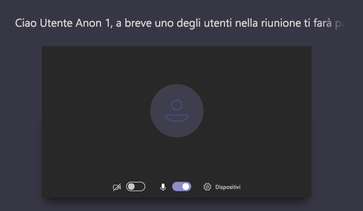

# Gestire i criteri delle riunioni in teams

::: zone target="docs"
I criteri per le riunioni vengono usati per controllare le caratteristiche disponibili per i partecipanti alla riunione per le riunioni pianificate dagli utenti dell'organizzazione. Dopo aver creato un criterio e aver apportato le modifiche, è possibile assegnare gli utenti ai criteri. Puoi gestire i criteri delle riunioni nell'interfaccia di amministrazione di Microsoft teams oppure [usando PowerShell](teams-powershell-overview.md).

È possibile implementare i criteri nei modi seguenti, che influiscono sull'esperienza di riunione per gli utenti prima che venga avviata una riunione, durante una riunione o dopo una riunione. 

|Tipo di implementazione  |Descrizione  |
|---------|---------|
|Per-Organizer    |Quando si implementa un criterio per ogni organizzazione, tutti i partecipanti alla riunione erediteranno i criteri dell'organizzatore. Ad esempio, **ammetti automaticamente che people** sia un criterio per Organizzatore e controlla se gli utenti partecipano alla riunione direttamente o attendono nella sala di attesa per le riunioni pianificate dall'utente a cui è assegnato il criterio.          |
|Per utente    |Quando si implementa un criterio per utente, solo i criteri per utente si applicano per limitare determinate funzionalità per l'Organizzatore e/o i partecipanti alla riunione. Ad esempio, **Consenti riunione ora** è un criterio per utente.     |
|Per-Organizer e per utente     |Quando si implementa una combinazione di criteri per ogni organizzazione e per utente, alcune caratteristiche sono limitate per i partecipanti alla riunione in base ai criteri e ai criteri dell'organizzatore. Ad esempio, **Consenti la registrazione cloud** è un criterio per ogni organizzazione e per utente. Attivare questa impostazione per consentire all'organizzatore della riunione e ai partecipanti di avviare e arrestare una registrazione. 

Per impostazione predefinita, viene creato un criterio denominato globale (impostazione predefinita a livello di organizzazione). Per impostazione predefinita, a tutti gli utenti dell'organizzazione verrà assegnato questo criterio di riunione. È possibile apportare modifiche a questo criterio o creare uno o più criteri personalizzati e assegnarvi gli utenti. Quando si creano criteri personalizzati, è possibile consentire o impedire che determinate funzionalità siano disponibili per gli utenti e quindi assegnarla a uno o più utenti a cui saranno applicate le impostazioni. 

## Modificare o creare un criterio per la riunione

Per modificare o creare un criterio per la riunione, passare all'interfaccia di amministrazione di Microsoft teams >**criteri riunione** **riunioni** > . Selezionare un criterio nell'elenco o selezionare **nuovo criterio**. Se si sta creando un nuovo criterio, aggiungere un nome e una descrizione. Il nome non può contenere caratteri speciali o avere più di 64 caratteri. Scegliere le impostazioni e quindi fare clic su **Salva**.

Ad esempio, supponiamo di avere un gruppo di utenti e di voler limitare la larghezza di banda necessaria per la riunione. Si creerebbe un nuovo criterio personalizzato denominato "larghezza di banda limitata" e si disabilitano le impostazioni seguenti:

In **Audio & video**:
- Disattivare la registrazione cloud
- Disattivare Consenti video IP

In **condivisione contenuto**:
- Disabilitare la modalità di condivisione dello schermo
- Disattivare la lavagna
- Disattivare le note condivise

Assegna quindi il criterio agli utenti.

> [!NOTE] 
> A un utente possono essere assegnati solo i criteri di una riunione alla volta. 

## Assegnare un criterio di riunione agli utenti

Se si applicano i criteri a un solo utente, selezionare **utenti** nel riquadro di spostamento sinistro e quindi fare clic sul nome visualizzato dell'utente. Nella pagina dell'utente, accanto a **criteri assegnati**, selezionare **modifica**. Nel riquadro **modifica criteri utente** , quindi, in **criteri riunione**Selezionare i criteri riunione nell'elenco a discesa e quindi selezionare **Salva**. È anche possibile assegnare criteri dall'elenco di utenti. A questo scopo, seleziona l'utente facendo clic a sinistra del nome visualizzato dell'utente. Selezionare **Modifica impostazioni**. Nel riquadro **Modifica impostazioni** , in **criteri riunione**, selezionare il criterio nell'elenco a discesa e quindi selezionare **Salva**. 
 
Se si applica un criterio a più utenti, selezionare **utenti** nel riquadro di spostamento sinistro e quindi selezionare ogni utente facendo clic a sinistra del nome utente e quindi su **Modifica impostazioni**. Nel riquadro **Modifica impostazioni** , in **criteri riunione**, selezionare il criterio nell'elenco a discesa e quindi selezionare **Salva**.
 
È anche possibile assegnare un criterio di riunione a uno o più utenti, come indicato di seguito:

1. Accedere ai**criteri di riunione**delle**riunioni** > dell'interfaccia di **Amministrazione** > di Microsoft teams.
2. Selezionare il criterio facendo clic a sinistra del nome del criterio.
3. Selezionare **Gestisci utenti**.
4. Nel riquadro **Gestisci utenti** cercare l'utente per nome visualizzato o per nome utente, selezionare il nome e quindi fare clic su **Aggiungi**. Ripetere questo passaggio per ogni utente che si vuole aggiungere.
5. Al termine dell'aggiunta di utenti, selezionare **Salva**.
 
> [!NOTE] 
> Non è possibile eliminare un criterio se gli utenti sono assegnati. Devi prima assegnare un criterio diverso a tutti gli utenti interessati, quindi puoi eliminare il criterio originale.
 
## Impostazioni dei criteri per le riunioni

Quando si seleziona un criterio esistente nella pagina **criteri riunione** o si seleziona **nuovo criterio** per aggiungere un nuovo criterio, è possibile configurare le impostazioni seguenti.

- [Generale](#meeting-policy-settings---general)
- [Video & audio](#meeting-policy-settings---audio--video)
- [Condivisione del contenuto](#meeting-policy-settings---content-sharing)
- [Partecipanti & ospiti](#meeting-policy-settings---participants--guests)

::: zone-end 

## Impostazioni dei criteri riunione-generale

- [Consenti riunione ora nei canali](#allow-meet-now-in-channels)
- [Consenti riunione privata ora (disponibile a breve)](#allow-private-meet-now-coming-soon)
- [Consentire il componente aggiuntivo per Outlook](#allow-the-outlook-add-in)
- [Consentire la programmazione di una riunione di canale](#allow-channel-meeting-scheduling)
- [Consentire la pianificazione di riunioni private](#allow-scheduling-private-meetings)

### Consenti riunione ora nei canali

Si tratta di un criterio per utente e si applica prima che venga avviata una riunione. Questa impostazione controlla se un utente può avviare una riunione ad hoc in un canale di teams. Se si attiva questa opzione, quando un utente inserisce un messaggio in un canale di teams, l'utente può fare clic su riunione **ora** sotto la casella di composizione per avviare un incontro ad hoc nel canale.

### Consenti riunione privata ora (disponibile a breve)

Si tratta di un criterio per utente e si applica prima che venga avviata una riunione. Questa impostazione controlla se un utente può avviare una riunione privata ad hoc.  

### Consentire il componente aggiuntivo per Outlook

Si tratta di un criterio per utente e si applica prima che venga avviata una riunione. Questa impostazione controlla se le riunioni dei team possono essere pianificate in Outlook (Windows, Mac, Web e mobile).

Se si disattiva questa opzione, gli utenti non potranno pianificare le riunioni dei team quando creano una nuova riunione in Outlook. Ad esempio, in Outlook su Windows l'opzione **nuova riunione teams** non viene visualizzata sulla barra multifunzione.

### Consentire la programmazione di una riunione di canale

Si tratta di un criterio per utente e si applica prima che venga avviata una riunione. Questa impostazione controlla se gli utenti possono pianificare una riunione in un canale di teams.  Se si disattiva questa impostazione, l'opzione **Pianifica una riunione** non sarà disponibile per l'utente quando avvia una riunione in un canale di teams e l'opzione **Seleziona un canale da soddisfare** non sarà disponibile per l'utente quando pianifica una riunione da riunioni in teams.

### Consentire la pianificazione di riunioni private

Si tratta di un criterio per utente e si applica prima che venga avviata una riunione. Questa impostazione controlla se gli utenti possono pianificare riunioni private in teams. Una riunione è privata quando non viene pubblicata in un canale di un team.

Tieni presente che se disattivi Consenti la pianificazione di **riunioni private** e **Consenti la pianificazione della riunione di canale**, l'opzione **Pianifica una riunione** non sarà disponibile e gli utenti non potranno pianificare le riunioni in teams.

## Impostazioni dei criteri per le riunioni-audio & video

- [Consenti trascrizione](#allow-transcription)
- [Consenti registrazione cloud](#allow-cloud-recording)
- [Consenti video IP](#allow-ip-video)
- [Velocità in bit media (KBs)](#media-bit-rate-kbs)
- [Abilitare le didascalie Live (presto disponibile)](#enable-live-captions-coming-soon)

### Consenti trascrizione

Si tratta di una combinazione di criteri per ogni organizzazione e per utente. Questa impostazione controlla se le didascalie e le caratteristiche di trascrizione sono disponibili durante la riproduzione delle registrazioni delle riunioni. Se si disattiva questa opzione, le opzioni di **ricerca** e **CC** non saranno disponibili durante la riproduzione di una registrazione di una riunione. La persona che ha avviato la registrazione richiede questa impostazione attivata in modo che la registrazione includa anche la trascrizione. 

Tieni presente che la trascrizione per le riunioni registrate è attualmente supportata solo per gli utenti che hanno la lingua in teams impostati per l'inglese e quando l'inglese viene pronunciato nella riunione.

### Consenti registrazione cloud

Si tratta di una combinazione di criteri per ogni organizzazione e per utente. Questa impostazione controlla se le riunioni dell'utente possono essere registrate. La registrazione può essere avviata dall'organizzatore della riunione o da un altro partecipante alla riunione se l'impostazione del criterio è attivata per il partecipante e se è un utente autenticato della stessa organizzazione.

Le persone esterne all'organizzazione, ad esempio utenti federati e anonimi, non possono avviare la registrazione. Gli utenti guest non possono avviare o interrompere la registrazione. 

Esaminiamo l'esempio seguente.

|Utente |Criteri riunione  |Consenti registrazione cloud |
|---------|---------|---------|
|Daniela | Globale   | False |
|Amanda | Location1MeetingPolicy | True|
|John (utente esterno) | Non applicabile | Non applicabile|

Le riunioni organizzate da Daniela non possono essere registrate e Amanda, che ha l'impostazione dei criteri abilitata, non può registrare le riunioni organizzate da Daniela. Le riunioni organizzate da Amanda possono essere registrate, tuttavia, Daniela, che ha l'impostazione del criterio disabilitata e John che è un utente esterno, non può registrare le riunioni organizzate da Amanda.

Per altre informazioni sulla registrazione di Cloud Meeting, vedere [registrazione di teams Cloud Meeting](cloud-recording.md).

### Consenti video IP

Si tratta di una combinazione di criteri per ogni organizzazione e per utente. Video è un componente chiave per le riunioni. In alcune organizzazioni gli amministratori potrebbero volere un maggiore controllo sulle riunioni degli utenti che hanno un video. Questa impostazione controlla se il video può essere attivato in riunioni ospitate da un utente e in chiamate di 1:1 e di gruppo avviate da un utente. Riunioni organizzate da un utente che ha attivato questo criterio, consentire la condivisione di video nella riunione da parte dei partecipanti alla riunione, se i partecipanti alla riunione hanno anche il criterio abilitato. I partecipanti alla riunione che non dispongono di criteri assegnati, ad esempio i partecipanti anonimi e federati, ereditano i criteri dell'organizzatore della riunione.

Esaminiamo l'esempio seguente.

|Utente |Criteri riunione  |Consenti video IP |
|---------|---------|---------|
|Daniela   | Globale   | True        |
|Amanda    | Location1MeetingPolicy        | False      |

Le riunioni ospitate da Daniela permettono di attivare il video. Daniela può partecipare alla riunione e attivare il video. Amanda non può attivare il video nella riunione di Daniela perché la politica di Amanda è impostata su non consentire il video. Amanda può visualizzare i video condivisi da altri partecipanti alla riunione.

Nelle riunioni ospitate da Amanda, nessuno può attivare il video, indipendentemente dai criteri video assegnati. Questo significa che Daniela non può attivare il video nelle riunioni di Amanda.  

Se Daniela chiama Amanda con il video, Amanda può rispondere alla chiamata solo con l'audio.  Quando la chiamata è connessa, Amanda può vedere il video di Daniela, ma non può attivare il video. Se Amanda chiama Daniela, Daniela può rispondere alla chiamata con video e audio. Quando la chiamata è connessa, Daniela può attivare o disattivare il video, se necessario.

### Velocità in bit media (KBs)

Si tratta di un criterio per utente. Questa impostazione determina la velocità in bit media per le trasmissioni di condivisione delle app basate su audio, video e video in chiamate e riunioni per l'utente. Viene applicato sia all'attraversamento di uplink che al supporto per gli utenti della chiamata o della riunione. Questa impostazione consente di controllare in modo granulare la gestione della larghezza di banda nell'organizzazione. A seconda degli scenari di riunione richiesti dagli utenti, è consigliabile disporre di una larghezza di banda sufficiente per ottenere una buona esperienza di qualità. Il valore minimo è 30 Kbps e il valore massimo dipende dallo scenario della riunione. Per altre informazioni sulla larghezza di banda minima consigliata per riunioni di buona qualità, chiamate e eventi dinamici in team, vedere [requisiti di larghezza di banda](prepare-network.md#bandwidth-requirements).

Se non è disponibile una larghezza di banda sufficiente per una riunione, i partecipanti vedranno un messaggio che indica una qualità di rete scadente.

Per le riunioni che richiedono un'esperienza video di altissima qualità, ad esempio riunioni di CEO e teams Live Events, è consigliabile impostare la larghezza di banda su 10 Mbps. Anche quando viene impostata l'esperienza massima, lo stack multimediale di teams si adatta alle condizioni di larghezza di banda ridotta quando vengono rilevate determinate condizioni di rete, a seconda dello scenario. 

### Abilitare le didascalie Live (presto disponibile)

Si tratta di un criterio per utente e si applica durante una riunione. Se questa impostazione è attivata, l'utente vedrà un'opzione per visualizzare le didascalie durante una riunione.

## Impostazioni dei criteri riunione-condivisione contenuto

- [Modalità di condivisione dello schermo](#screen-sharing-mode)
- [Consentire a un partecipante di dare o richiedere il controllo](#allow-a-participant-to-give-or-request-control)
- [Consentire a un partecipante esterno di dare o richiedere il controllo](#allow-an-external-participant-to-give-or-request-control)
- [Consentire la condivisione di PowerPoint](#allow-powerpoint-sharing)
- [Consenti lavagna](#allow-whiteboard)
- [Consenti note condivise](#allow-shared-notes)
- [Consentire la chat in riunioni (disponibile a breve)](#allow-chat-in-meetings-coming-soon)

### Modalità di condivisione dello schermo

Si tratta di una combinazione di criteri per ogni organizzazione e per utente. Questa impostazione controlla se la condivisione del desktop e/o della finestra è consentita nella riunione dell'utente. I partecipanti alla riunione che non dispongono di criteri assegnati, ad esempio i partecipanti anonimi, Guest, B2B e federati, ereditano i criteri dell'organizzatore della riunione.

|Valore di impostazione |Comportamento  |
|---------|---------|
|**Intero schermo**    | La condivisione completa del desktop e la condivisione delle applicazioni sono consentite nella riunione |
|**Singola applicazione**   | La condivisione delle applicazioni è consentita nella riunione        |
|**Disabilitata**     |Condivisione dello schermo e condivisione delle applicazioni disattivati durante la riunione.       |

Esaminiamo l'esempio seguente.

|Utente |Criteri riunione |Modalità di condivisione dello schermo |
|---------|---------|---------|
|Daniela  | Globale   | Intero schermo |
|Amanda   | Location1MeetingPolicy  | Disabilitata |

Le riunioni ospitate da Daniela consentono ai partecipanti alla riunione di condividere l'intero schermo o un'applicazione specifica. Se Amanda si unisce alla riunione di Daniela, Amanda non può condividere il suo schermo o un'applicazione specifica perché l'impostazione dei criteri è disabilitata. Nelle riunioni ospitate da Amanda, nessuno può condividere il proprio schermo o una singola applicazione, indipendentemente dai criteri di modalità di condivisione dello schermo assegnati. Questo significa che Daniela non può condividere il suo schermo o una singola applicazione nelle riunioni di Amanda.  

Attualmente gli utenti non possono riprodurre video o condividere il loro schermo in una riunione di teams se usano Google Chrome.

### Consentire a un partecipante di dare o richiedere il controllo

Si tratta di un criterio per utente. Questa impostazione controlla se l'utente può dare il controllo del desktop o della finestra condivisa ad altri partecipanti alla riunione. Per dare il controllo, posizionare il puntatore del mouse sopra la parte superiore dello schermo. 

Se questa impostazione è attivata per l'utente, l'opzione **assegna controllo** viene visualizzata nella barra superiore in una sessione di condivisione. 

Se le impostazioni sono disattivate per l'utente, l'opzione **assegna controllo** non è disponibile.

Esaminiamo l'esempio seguente.

|Utente |Criteri riunione  |Consentire ai partecipanti di dare o richiedere il controllo |
|---------|---------|---------|
|Daniela   | Globale   | True       |
|Babek    | Location1MeetingPolicy        | False   |

Daniela può dare il controllo del desktop o della finestra condivisa ad altri partecipanti a una riunione organizzata da Babek, mentre Babek non può dare il controllo ad altri partecipanti.

### Consentire a un partecipante esterno di dare o richiedere il controllo

Si tratta di un criterio per utente. Questa impostazione controlla se i partecipanti esterni a una riunione possono dare il controllo del desktop o della finestra condivisa ad altri partecipanti alla riunione. I partecipanti esterni alle riunioni di team possono essere categorizzati come segue:  

   - Utente anonimo
   - Utenti Guest  
   - Utenti B2B
   - Utente federato  

Se gli utenti federati possono dare il controllo agli utenti esterni mentre la condivisione è controllata dal **consentire a un partecipante esterno di dare o richiedere** l'impostazione del controllo nella propria organizzazione.

### Consentire la condivisione di PowerPoint

Si tratta di un criterio per utente. Questa impostazione controlla se l'utente può condividere i deck di diapositive di PowerPoint in una riunione. Gli utenti esterni, inclusi gli utenti anonimi, Guest e federati, ereditano i criteri dell'organizzatore della riunione.

Esaminiamo l'esempio seguente.

|Utente |Criteri riunione  |Consentire la condivisione di PowerPoint |
|---------|---------|---------|
|Daniela   | Globale   | True       |
|Amanda   | Location1MeetingPolicy        | False   |

Amanda non può condividere presentazioni di PowerPoint in riunioni anche se è l'organizzatore della riunione. Daniela può condividere le piattaforme di diapositive di PowerPoint anche se la riunione è organizzata da Amanda. Amanda può visualizzare i deck di diapositive di PowerPoint condivisi da altri partecipanti alla riunione, anche se non è in grado di condividere i deck diapositiva di PowerPoint.

### Consenti lavagna

Si tratta di un criterio per utente. Questa impostazione controlla se un utente può condividere la lavagna in una riunione. Gli utenti esterni, inclusi gli utenti anonimi, B2B e federati, ereditano i criteri dell'organizzatore della riunione. 

Esaminiamo l'esempio seguente.

|Utente |Criteri riunione  |Consenti lavagna|
|---------|---------|---------|
|Daniela   | Globale   | True       |
|Amanda   | Location1MeetingPolicy        | False   |

Amanda non può condividere la lavagna in una riunione, anche se è l'organizzatore della riunione. Daniela può condividere la lavagna anche se una riunione è organizzata da Amanda.  

### Consenti note condivise

Si tratta di un criterio per utente. Questa impostazione controlla se un utente può creare e condividere note in una riunione. Gli utenti esterni, inclusi gli utenti anonimi, B2B e federati, ereditano i criteri dell'organizzatore della riunione. La scheda **Note riunione** è attualmente supportata solo nelle riunioni con meno di 20 partecipanti. 

Esaminiamo l'esempio seguente.

|Utente |Criteri riunione  |Consenti note condivise |
|---------|---------|---------|
|Daniela   | Globale   | True       |
|Amanda   | Location1MeetingPolicy | False |

Daniela può prendere appunti nelle riunioni di Amanda e Amanda non può prendere appunti in nessuna riunione.

### Consentire la chat in riunioni (disponibile a breve)

Si tratta di un criterio per organizzatore. Questa impostazione controlla se la chat riunione è consentita nella riunione dell'utente. 

## Impostazioni dei criteri di riunione-partecipanti & Guest

Queste impostazioni controllano quali partecipanti alla riunione attendono nella sala di attesa prima di essere ammessi alla riunione e del livello di partecipazione consentiti in una riunione.

- [Ammettere automaticamente le persone](#automatically-admit-people)
- [Consentire agli utenti anonimi di avviare una riunione](#allow-anonymous-people-to-start-a-meeting)
- [Consenti agli utenti con accesso esterno di ignorare la sala d'attesa](#allow-dial-in-users-to-bypass-the-lobby-coming-soon)
- [Consentire agli organizzatori di ignorare le impostazioni della sala di attesa](#allow-organizers-to-override-lobby-settings-coming-soon)

> [!NOTE]
>Le opzioni per partecipare a una riunione variano a seconda delle impostazioni per ogni gruppo di team e del metodo di connessione. Se il gruppo dispone di servizi di audioconferenza e lo usa per la connessione, vedere Servizi di audioconferenza [in Office 365](https://docs.microsoft.com/microsoftteams/audio-conferencing-in-office-365). Se il gruppo teams non dispone di servizi di audioconferenza, vedere [partecipare a una riunione in teams](https://support.office.com/article/join-a-meeting-in-teams-1613bb53-f3fa-431e-85a9-d6a91e3468c9).

### Ammettere automaticamente le persone

Si tratta di un criterio per organizzatore. Questa impostazione controlla se gli utenti partecipano a una riunione direttamente o attendono nella sala di attesa finché non vengono ammessi da un utente autenticato.

 Gli organizzatori della riunione possono fare clic su **Opzioni riunione** nell'invito alla riunione per modificare questa impostazione per ogni riunione pianificata. **(presto disponibile)**
  
|Valore di impostazione  |Comportamento di join |
|---------|---------|
|**Tutti**   |Tutti i partecipanti alla riunione partecipano direttamente alla riunione senza attendere nella sala di attesa. Ciò include gli utenti autenticati, gli utenti federati, gli ospiti, gli utenti anonimi e le persone che effettuano la chiamata tramite telefono.       |
|**Tutti gli utenti dell'organizzazione e delle organizzazioni federate**     |Gli utenti autenticati all'interno dell'organizzazione, inclusi gli utenti guest e gli utenti provenienti da organizzazioni federate, partecipano direttamente alla riunione senza attendere nella sala di attesa.  Utenti anonimi e utenti che effettuano la chiamata tramite telefono attendono nella sala di attesa.   |
|**Tutti gli utenti dell'organizzazione**    |Gli utenti autenticati dall'interno dell'organizzazione, inclusi gli utenti guest, partecipano direttamente alla riunione senza attendere nella sala di attesa.  Gli utenti federati, gli utenti anonimi e gli utenti che effettuano la chiamata tramite telefono attendono nella sala di attesa.           |

### Consentire agli utenti anonimi di avviare una riunione

Si tratta di un criterio per organizzatore. Questa impostazione controlla se gli utenti anonimi, inclusi quelli B2B e federati, possono partecipare alla riunione dell'utente senza un utente autenticato dall'organizzazione in presenza. 

Ecco il comportamento di join di persone anonime quando gli utenti autenticati sono presenti nella riunione.

|Consentire agli utenti anonimi di avviare una riunione  |Ammettere automaticamente le persone |Comportamento di join degli utenti anonimi |
|---------|---------|---------|
|True    | Tutti      | Partecipare direttamente         |
|   | Tutti gli utenti dell'organizzazione       | Attendere nella sala di attesa        |
|   | Tutti gli utenti dell'organizzazione e delle organizzazioni federate       | Attendere nella sala di attesa         |
|False    | Tutti        | Partecipare direttamente        |
|   | Tutti gli utenti dell'organizzazione     | Attendere nella sala di attesa        |
|   | Tutti gli utenti dell'organizzazione e delle organizzazioni federate      | Attendere nella sala di attesa         |

Ecco il comportamento di join di persone anonime quando nella riunione non sono presenti utenti autenticati.

|Consentire agli utenti anonimi di avviare una riunione |Ammettere automaticamente le persone  |Comportamento di join degli utenti anonimi |
|---------|---------|---------|
|True    | Tutti      | Partecipare direttamente         |
|   | Tutti gli utenti dell'organizzazione       | Attendere nella sala di attesa        |
|   | Tutti gli utenti dell'organizzazione e delle organizzazioni federate       | Attendere nella sala di attesa         |
|False    | Tutti        | Attendere nella sala di attesa. Gli utenti vengono ammessi automaticamente quando il primo utente autenticato partecipa alla riunione.        |
|   | Tutti gli utenti dell'organizzazione     |Attendere nella sala di attesa         |
|   | Tutti gli utenti dell'organizzazione e delle organizzazioni federate      | Attendere nella sala di attesa         |

### Consenti agli utenti con accesso esterno di ignorare la sala d'attesa (disponibile a breve)

Si tratta di un criterio per organizzatore. Questa impostazione controlla se le persone che effettuano la chiamata tramite telefono accedono direttamente alla riunione o attendono la sala di attesa indipendentemente dall'impostazione di **ammetti automaticamente persone** .

Ecco il comportamento di join delle persone che effettuano la chiamata tramite telefono.

|Consenti agli utenti con accesso esterno di ignorare la sala d'attesa  |Ammettere automaticamente gli utenti  |Comportamento di join degli utenti con accesso esterno |
|---------|---------|---------|
|True    | Tutti      | Partecipare direttamente         |
|   | Tutti gli utenti dell'organizzazione       | Partecipare direttamente        |
|   | Tutti gli utenti dell'organizzazione e delle organizzazioni federate       | Partecipare direttamente         |
|False    | Tutti        | Partecipare direttamente        |
|   | Tutti gli utenti dell'organizzazione     |Attendere nella sala di attesa         |
|   | Tutti gli utenti dell'organizzazione e delle organizzazioni federate      | Attendere nella sala di attesa         |

### Consentire agli organizzatori di ignorare le impostazioni della sala di attesa (presto disponibile)

Si tratta di un criterio per organizzatore. Questa impostazione controlla se l'organizzatore della riunione può eseguire l'override delle impostazioni della sala di attesa che un amministratore ha impostato per **ammettere automaticamente le persone** e **consentire agli utenti con accesso esterno di ignorare la sala** d'attesa quando pianificano una nuova riunione. 

Gli organizzatori della riunione possono fare clic su **Opzioni riunione** nell'invito alla riunione per modificare le impostazioni della sala di attesa per ogni riunione pianificata. 

Ecco come questa impostazione interessa se l'organizzatore della riunione può modificare l'impostazione **ammetti automaticamente persone** per ogni riunione pianificata dall'organizzatore.

|Consentire agli organizzatori di ignorare le impostazioni della sala di attesa  |Ammettere automaticamente le persone  |Comportamento |
|---------|---------|---------|
|True    | Tutti      | L'organizzatore può modificare l'impostazione in qualsiasi altro valore. |
|   | Tutti gli utenti dell'organizzazione       | L'organizzatore può modificare l'impostazione in qualsiasi altro valore.|
|   | Tutti gli utenti dell'organizzazione e delle organizzazioni federate       | L'organizzatore può modificare l'operazione in qualsiasi altro valore.         |
|False    | Tutti        | L'organizzatore può modificare l'impostazione in qualsiasi altro valore.|
|   | Tutti gli utenti dell'organizzazione     |L'organizzatore può modificare l'impostazione per **tutti gli utenti dell'organizzazione**. |
|   | Tutti gli utenti dell'organizzazione e delle organizzazioni federate      | L'organizzazione non può ignorare l'impostazione della sala di attesa. |

Ecco come questa impostazione interessa se l'organizzatore della riunione può modificare l'impostazione **Consenti agli utenti con accesso esterno di ignorare le** impostazioni della sala di attesa per ogni riunione pianificata dall'organizzatore.
    
|Consentire agli organizzatori di ignorare le impostazioni della sala di attesa  |Consenti agli utenti con accesso esterno di ignorare la sala d'attesa  |Comportamento |
|---------|---------|---------|
|True    |  True        | L'impostazione può essere modificata in false.       |
|True      | False         | Organizer può modificare l'impostazione su true.        |
|False     | True        |L'impostazione può essere modificata in false.         |
|False      |False          |L'organizzatore non può ignorare l'impostazione della sala di attesa e non può consentire agli utenti con accesso esterno di ignorare la sala d'attesa nella riunione.        |

[Articolo completo](meeting-policies-in-teams.md)

## Argomenti correlati
[Criteri di messaggistica in teams](messaging-policies-in-teams.md)
