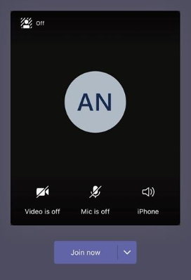

# Gestire i criteri di riunione in TeamsManage meeting policies in Teams

::: zone target="docs"
I criteri riunione vengono usati per controllare le funzionalità disponibili per i partecipanti alle riunioni programmate dagli utenti nell'organizzazione.Meeting policies are used to control the features that are available to meeting participants for meetings that are scheduled by users in your organization. Puoi usare il criterio globale (predefinito per l'intera organizzazione) creato automaticamente o crea e assegna criteri personalizzati.You can use the global (Org-wide default) policy that's automatically created or create and assign custom policies. Si possono gestire i criteri di riunione nell'interfaccia di amministrazione di Microsoft Teams o tramite [PowerShell](teams-powershell-overview.md).You manage meeting policies in the Microsoft Teams admin center or by using [PowerShell](teams-powershell-overview.md).

> [!NOTE]
> Per informazioni sull'uso dei ruoli per gestire le autorizzazioni di relatori e partecipanti alla riunione, vedere [ruoli in una riunione di teams](https://support.microsoft.com/office/roles-in-a-teams-meeting-c16fa7d0-1666-4dde-8686-0a0bfe16e019?ui=en-us&rs=en-us&ad=us).For information about using roles to manage the permissions of meeting presenters and attendees, see [Roles in a Teams meeting](https://support.microsoft.com/office/roles-in-a-teams-meeting-c16fa7d0-1666-4dde-8686-0a0bfe16e019?ui=en-us&rs=en-us&ad=us).

È possibile implementare i criteri nei modi descritti di seguito. La scelta influisce sull'esperienza di riunione per gli utenti prima, durante o dopo una riunione.You can implement policies in the following ways, which affect the meeting experience for users before a meeting starts, during a meeting, or after a meeting.

|Tipo di implementazioneImplementation type  |DescrizioneDescription  |
|---------|---------|
|Per organizzatorePer-organizer    |Quando si implementa un criterio per organizzatore, tutti i partecipanti alla riunione ereditano il criterio dell'organizzatore.When you implement a per-organizer policy, all meeting participants inherit the policy of the organizer. Ad esempio, **Ammetti automaticamente le persone** è un criterio per organizzatore e controlla se gli utenti accedono direttamente alla riunione oppure attendono nella sala di attesa per le riunioni pianificate dall'utente a cui è assegnato il criterio.For example, **Automatically admit people** is a per-organizer policy and controls whether users join the meeting directly or wait in the lobby for meetings scheduled by the user who is assigned the policy.          |
|Per utentePer-user    |Quando si implementano criteri per utente, viene applicato solo il criterio per utente per limitare l'uso di determinate funzionalità da parte dell'organizzatore e/o dei partecipanti alla riunione.When you implement a per-user policy, only the per-user policy applies to restrict certain features for the organizer and/or meeting participants. Ad esempio, **Consenti l'uso di Riunione immediata nei canali** è un criterio per utente.For example, **Allow Meet now in channels** is a per-user policy.     |
|Per organizzatore e per utentePer-organizer and per-user     |Quando si implementa una combinazione di criteri per organizzatore e per utente, l'uso di alcune funzionalità da parte dei partecipanti alla riunione è limitato, in base ai criteri applicati al singolo utente e ai criteri dell'organizzatore.When you implement a combination of a per-organizer and per-user policy, certain features are restricted for meeting participants based on their policy and the organizer's policy. Ad esempio, **Consenti registrazione cloud** è un criterio per organizzazione e per utente.For example, **Allow cloud recording** is a per-organizer and per-user policy. Attivare questa impostazione per consentire all'organizzatore della riunione e ai partecipanti di avviare o interrompere una registrazione.Turn on this setting to allow the meeting organizer and participants to start and stop a recording.

È possibile modificare le impostazioni dei criteri globali oppure creare e assegnare uno o più criteri personalizzati.You can edit the settings in the global policy or create and assign one or more custom policies. Gli utenti otterranno i criteri globali a meno che non si creino e si assegnano criteri personalizzati.Users will get the global policy unless you create and assign a custom policy.

> [!NOTE]
> Il pulsante Dettagli riunione sarà disponibile se l'utente ha abilitato le licenze per le conferenze audio o se l'utente è autorizzato a ricevere servizi di audioconferenza, in caso contrario, i dettagli della riunione non saranno disponibili.Meeting details button will be available if a user has the audio conference licenses enabled or the user is allow for audio conferencing, if not, the meeting details will not be available.

## Creare un criterio di riunione personalizzatoCreate a custom meeting policy

1. Nel riquadro di spostamento sinistro dell'interfaccia di amministrazione di Microsoft Teams passare a **Riunioni** > **Criteri riunione**.In the left navigation of the Microsoft Teams admin center, go to **Meetings** > **Meeting policies**.
2. Fare clic su **Aggiungi**.Click **Add**.
3. Immettere un nome e una descrizione per il criterio.Enter a name and description for the policy. Il nome non può contenere caratteri speciali o più di 64 caratteri.The name can't contain special characters or be longer than 64 characters.
4. Scegliere le impostazioni desiderate.Choose the settings that you want.
5. Fare clic su **Salva**.Click **Save**.

Ad esempio, si supponga di avere un gruppo di utenti e di voler limitare la larghezza di banda necessaria per la riunione.For example, say you have a bunch of users and you want to limit the amount of bandwidth that their meeting would require. È possibile creare un nuovo criterio personalizzato denominato "Larghezza di banda limitata" e disabilitare le impostazioni seguenti:You would create a new custom policy named "Limited bandwidth" and disable the following settings:

In **Audio e video**:Under **Audio & video**:

- Disattivare Consenti registrazione cloud.Turn off Allow cloud recording.
- Disattivare Consenti video IP.Turn off Allow IP video.

In **Condivisione di contenuti**:Under **Content sharing**:

- Disabilitare la modalità di condivisione dello schermo.Disable screen sharing mode.
- Disattivare Consenti la lavagna.Turn off Allow whiteboard.
- Disattivare Consenti note condivise.Turn off Allow shared notes.

Assegnare poi il criterio agli utenti.Then assign the policy to the users.

## Modificare i criteri di una riunioneEdit a meeting policy

È possibile modificare i criteri globali e i criteri personalizzati creati.You can edit the global policy and any custom policies that you create.

1. Nel riquadro di spostamento sinistro dell'interfaccia di amministrazione di Microsoft Teams passare a **Riunioni** > **Criteri riunione**.In the left navigation of the Microsoft Teams admin center, go to **Meetings** > **Meeting policies**.
2. Selezionare il criterio facendo clic a sinistra del nome del criterio, quindi fare clic su **modifica**.Select the policy by clicking to the left of the policy name, and then click **Edit**.
3. Da qui apportare le modifiche desiderate.From here, make the changes that you want.
4. Fare clic su **Salva**.Click **Save**.

> [!NOTE]
> A ogni utente può essere assegnato un solo criterio di riunione per volta.A user can be assigned only one meeting policy at a time.

## Assegnare un criterio riunione agli utentiAssign a meeting policy to users

[!INCLUDE [assign-policy](includes/assign-policy.md)]

> [!NOTE]
> Non è possibile eliminare un criterio a cui sono utenti.You can't delete a policy if users are assigned to it. È prima di tutto necessario assegnare un criterio diverso a tutti gli utenti interessati, quindi sarà possibile eliminare il criterio originale.You must first assign a different policy to all affected users, and then you can delete the original policy.

## Impostazioni dei criteri di riunioneMeeting policy settings

Quando si seleziona un criterio esistente nella pagina **Criteri riunione** o si seleziona **Aggiungi** per aggiungere un nuovo criterio, è possibile configurare le impostazioni per gli elementi seguenti.When you select an existing policy on the **Meeting policies** page or select **Add** to add a new policy, you can configure settings for the following.

- [GeneraleGeneral](#meeting-policy-settings---general)
- [Audio e videoAudio & video](#meeting-policy-settings---audio--video)
- [Condivisione di contenutiContent sharing](#meeting-policy-settings---content-sharing)
- [Partecipanti e ospitiParticipants & guests](#meeting-policy-settings---participants--guests)

::: zone-end

## Impostazioni dei criteri di riunione - GeneraleMeeting policy settings - General

- [Consenti l'uso di Riunione immediata nei canaliAllow Meet now in channels](#allow-meet-now-in-channels)
- [Consenti il componente aggiuntivo per OutlookAllow the Outlook add-in](#allow-the-outlook-add-in)
- [Consenti la pianificazione delle riunioni di canaleAllow channel meeting scheduling](#allow-channel-meeting-scheduling)
- [Consenti la pianificazione di riunioni privateAllow scheduling private meetings](#allow-scheduling-private-meetings)
- [Consenti l'uso di Riunione immediata nelle riunioni privateAllow Meet now in private meetings](#allow-meet-now-in-private-meetings)

### Consenti l'uso di Riunione immediata nei canaliAllow Meet now in channels

Questo è un criterio per utente e si applica prima dell'inizio di una riunione.This is a per-user policy and applies before a meeting starts. Questa impostazione controlla se un utente può avviare una riunione ad hoc in un canale di Teams.This setting controls whether a user can start an ad hoc meeting in a Teams channel. Se si attiva questa opzione, gli utenti possono fare clic sul pulsante **incontra** per avviare una riunione ad hoc o pianificare una riunione nel canale.If you turn this on, users can click the **Meet** button to start an ad hoc meeting or schedule a meeting in the channel. Il valore predefinito è True.The default value is True.

### Consenti il componente aggiuntivo per OutlookAllow the Outlook add-in

Questo è un criterio per utente e si applica prima dell'inizio di una riunione.This is a per-user policy and applies before a meeting starts. Questa impostazione consente di controllare se è possibile pianificare riunioni di Teams dall'interno di Outlook (Windows, Mac, Web e Mobile).This setting controls whether Teams meetings can be scheduled from within Outlook (Windows, Mac, web, and mobile).

Se si disattiva questa impostazione, gli utenti non potranno pianificare riunioni di Teams durante la creazione di una nuova riunione in Outlook.If you turn this off, users are unable to schedule Teams meetings when they create a new meeting in Outlook. In Outlook per Windows, ad esempio, l'opzione \*\*Nuova riunione di Teams \*\* non comparirà sulla barra multifunzione.For example, in Outlook on Windows, the **New Teams Meeting** option won't show up in the ribbon.

### Consenti la pianificazione delle riunioni di canaleAllow channel meeting scheduling

Usare i criteri di AllowChannelMeetingScheduling esistenti per controllare i tipi di eventi che è possibile creare nei calendari del canale del team.Use the existing AllowChannelMeetingScheduling policy to control the types of events that can be created on the team channel calendars. Questo è un criterio per utente e si applica prima dell'inizio di una riunione.This is a per-user policy and applies before a meeting starts. Questa impostazione controlla se gli utenti possono pianificare una riunione in un canale di Teams.This setting controls whether users can schedule a meeting in a Teams channel. Per impostazione predefinita, questa impostazione è attivata.By default, this setting is turned on. 

Se questo criterio è disattivato, gli utenti non saranno in grado di creare nuove riunioni di canale.If this policy is turned off, users will not be able to create new channel meetings. Tuttavia, le riunioni di canale esistenti possono essere modificate dall'organizzatore dell'evento.However, existing channel meetings can be edited by the organizer of the event.

Pianificare una riunione verrà disabilitata.Schedule a meeting will be disabled.

La selezione del canale è disabilitata.Channel selection is disabled.

Nella pagina post di canale, la seguente verrà disabilitata:In the channel posts page, the following will be disabled:

- **Pianificare un pulsante riunione** nella casella di composizione canale Rispondi.**Schedule a meeting** button on the channel reply compose box.
  
  
- **Pianificare un pulsante riunione** nell'intestazione del canale.**Schedule a meeting** button on the channel header.
  

Nel calendario del canale:In the channel calendar:

- Il pulsante **Aggiungi nuovo evento** nell'intestazione del calendario del canale verrà disabilitato.**Add new event** button on channel calendar header will be disabled.
  

- Gli utenti non potranno trascinare e selezionare un blocco di tempo nel calendario del canale per creare una riunione del canale.Users will not be able to drag and select a time block on the channel calendar to create a channel meeting.

- Gli utenti non possono usare le scelte rapide da tastiera per creare una riunione nel calendario del canale.Users cannot use Keyboard shortcuts to create a meeting on the channel calendar.

Nell'interfaccia di amministrazione:In the Admin Center:

L'app calendario canale verrà visualizzata nella sezione **app Microsoft** nel pannello di amministrazione per i criteri di autorizzazione.The channel calendar app will show up under the **Microsoft apps** section in the admin panel for permission policies.

### Consenti la pianificazione di riunioni privateAllow scheduling private meetings

Questo è un criterio per utente e si applica prima dell'inizio di una riunione.This is a per-user policy and applies before a meeting starts. Questa impostazione controlla se gli utenti possono pianificare riunioni private in Teams.This setting controls whether users can schedule private meetings in Teams. Una riunione è privata quando non viene pubblicata in un canale in un team.A meeting is private when it's not published to a channel in a team.

Si noti che, disattivando **Consenti la pianificazione di riunioni private** e **Consenti la pianificazione delle riunioni di canale**, le opzioni **Aggiungi partecipanti obbligatori** e **Aggiungi canale** vengono disabilitate per gli utenti in Teams.Note that if you turn off **Allow scheduling private meetings** and **Allow channel meeting scheduling**,  the **Add required attendees** and **Add channel** options are disabled for users in Teams. Per impostazione predefinita, questa impostazione è attivata.By default, this setting is turned on.

### Consenti l'uso di Riunione immediata nelle riunioni privateAllow Meet now in private meetings

Questo è un criterio per utente e si applica prima dell'inizio di una riunione.This is a per-user policy and applies before a meeting starts. Questa impostazione controlla se un utente può avviare una riunione privata ad hoc.This setting controls whether a user can start an ad hoc private meeting.  Per impostazione predefinita, questa impostazione è attivata.By default, this setting is turned on.

## Impostazioni dei criteri di riunione - Audio e videoMeeting policy settings - Audio & video

- [Consenti la trascrizioneAllow transcription](#allow-transcription)
- [Consenti registrazione cloudAllow cloud recording](#allow-cloud-recording)
- [Modalità per l'audio IPMode for IP audio](#mode-for-ip-audio) 
- [Modalità per il video IPMode for IP video](#mode-for-ip-video) 
- [Consenti video IPAllow IP video](#allow-ip-video)
- [Velocità in bit media (KBS)Media bit rate (Kbs)](#media-bit-rate-kbs)

### Consenti la trascrizioneAllow transcription

Questa è una combinazione di criterio per organizzatore e criterio per utente.This is a combination of a per-organizer and per-user policy. Questa impostazione controlla la disponibilità di didascalie e funzionalità di trascrizione durante la riproduzione di registrazioni delle riunioni.This setting controls whether captions and transcription features are available during playback of meeting recordings. Se si disattiva questa opzione, durante la riproduzione di una registrazione di riunione non saranno disponibili le opzioni **Cerca** e **Cc**.If you turn this off, the **Search** and **CC** options won't be available during playback of a meeting recording. La persona che ha avviato la registrazione ha bisogno che questa impostazione sia attivata perché la registrazione includa anche una trascrizione.The person who started the recording needs this setting turned on so that the recording also includes transcription.

Si noti che la trascrizione per le riunioni registrate è attualmente supportata solo per gli utenti che hanno la lingua di Teams impostata sull'inglese e quando durante la riunione si usa l'inglese.Note that transcription for recorded meetings is currently only supported for users who have the language in Teams set to English and when English is spoken in the meeting.

### Consenti registrazione cloudAllow cloud recording

Questa è una combinazione di criterio per organizzatore e criterio per utente.This is a combination of a per-organizer and per-user policy. Questa impostazione controlla se è possibile registrare le riunioni di quest'utente.This setting controls whether this user's meetings can be recorded. La registrazione può essere avviata dall'organizzatore della riunione o da un altro partecipante alla riunione, se l'impostazione dei criteri è attivata per il partecipante e se si tratta di un utente autenticato della stessa organizzazione.The recording can be started by the meeting organizer or by another meeting participant if the policy setting is turned on for the participant and if they're an authenticated user from the same organization.

Le persone esterne all'organizzazione, ad esempio gli utenti federati e anonimi, non possono avviare la registrazione.People outside your organization, such as federated and anonymous users, can't start the recording. Gli utenti guest non possono avviare o interrompere la registrazione.Guest users can't start or stop the recording.

Osserviamo l'esempio seguente.Let's look at the following example.

|UtenteUser |Criterio di riunioneMeeting policy  |Consenti registrazione cloudAllow cloud recording |
|---------|---------|---------|
|DanielaDaniela | GlobaleGlobal   | DisattivareOff |
|AmandaAmanda | CriterioRiunionePosizione1Location1MeetingPolicy | NellaOn|
|Luca (utente esterno)John (external user) | Non applicabileNot applicable | Non applicabileNot applicable|

Non è possibile registrare le riunioni organizzate da Daniela e Amanda che ha l'impostazione del criterio attivata, non può registrare le riunioni organizzate da Daniela.Meetings organized by Daniela can't be recorded and Amanda, who has the policy setting enabled, can't record meetings organized by Daniela. Le riunioni organizzate da Amanda possono essere registrate, tuttavia Daniela, che ha l'impostazione del criterio disabilitata, e John, che è un utente esterno, non possono registrare le riunioni organizzate da Amanda.Meetings organized by Amanda can be recorded, however,  Daniela, who has the policy setting disabled and John who is an external user, can't record meetings organized by Amanda.

Per altre informazioni sulla registrazione di una riunione cloud, vedere [Registrazione delle riunioni cloud di Teams](cloud-recording.md).To learn more about cloud meeting recording, see [Teams cloud meeting recording](cloud-recording.md).

### Modalità per l'audio IPMode for IP audio

Questo è un criterio per utente.This is a per-user policy. Questa impostazione controlla se l'audio può essere attivato in riunioni e chiamate di gruppo.This setting controls whether audio can be turned on in meetings and group calls. Ecco i valori per questa impostazione.Here are the values for this setting.

|Valore dell'impostazioneSetting value |ComportamentoBehavior  |
|---------|---------|
|**Audio in uscita e in ingresso abilitato****Outgoing and incoming audio enabled**    |La riunione è consentita per l'audio in uscita e in ingresso.Outgoing and incoming audio is allowed in the meeting. Questa è l'impostazione predefinita.This is the default setting. |
|**Disattiva****Disabled**     |L'audio in uscita e in entrata è disattivato durante la riunione.Outgoing and incoming audio is turned off in the meeting.     |

Se impostato su **disabilitato** per un utente, l'utente può comunque pianificare e organizzare le riunioni ma non può usare l'audio.If set to **Disabled** for a user, that user can still schedule and organize meetings but they can't use audio. Per partecipare a una riunione, è necessario effettuare l'accesso tramite la rete PSTN (Public Switched Telephone Network) o avere la chiamata di riunione e partecipare tramite telefono.To join a meeting, they have to dial in through the Public Switched Telephone Network (PSTN) or have the meeting call and join them by phone. I partecipanti alla riunione che non hanno un criterio assegnato, ad esempio i partecipanti anonimi, hanno questo set per l' **audio in uscita e in entrata abilitato** per impostazione predefinita.Meeting participants who don't have any policies assigned (for example, anonymous participants) have this set to **Outgoing and incoming audio enabled** by default. Nei client di teams mobile, se questa impostazione è disabilitata, l'utente deve connettersi alla riunione tramite la rete PSTN.On Teams mobile clients, if this setting is disabled, the user has to dial in to the meeting through the PSTN.

Questa impostazione non si applica alle chiamate 1:1.This setting doesn't apply to 1:1 calls. Per limitare le chiamate di 1:1, configurare un [criterio di chiamata](teams-calling-policy.md) per i team e disattivare l'impostazione imposta **chiamate private** .To restrict 1:1 calls, configure a Teams [calling policy](teams-calling-policy.md) and turn off the **Make private calls** setting. Questa impostazione non si applica anche ai dispositivi della sala riunioni, ad esempio i dispositivi Surface Hub e Microsoft teams rooms.This setting also doesn't apply to conference room devices such as Surface Hub and Microsoft Teams Rooms devices.

Per altre informazioni, vedere [gestire l'audio/video per i partecipanti alla riunione](#manage-audiovideo-for-meeting-participants).To learn more, see [Manage audio/video for meeting participants](#manage-audiovideo-for-meeting-participants).

### Modalità per il video IPMode for IP video

Questo è un criterio per utente.This is a per-user policy. Questa impostazione controlla se il video può essere attivato in riunioni e chiamate di gruppo.This setting controls whether video can be turned on in meetings and group calls. Ecco i valori per questa impostazione.Here are the values for this setting.

|Valore dell'impostazioneSetting value |ComportamentoBehavior  |
|---------|---------|
|**Video in uscita e in arrivo abilitato****Outgoing and incoming video enabled**    | La riunione è consentita per il video in uscita e in arrivo.Outgoing and incoming video is allowed in the meeting. Questa è l'impostazione predefinita.This is the default setting. |
|**Disattiva****Disabled**     | Il video in uscita e in arrivo è disattivato durante la riunione.Outgoing and incoming video is turned off in the meeting. Nei client di teams mobile gli utenti non possono condividere video o foto nella riunione.On Teams mobile clients, users can't share videos or photos in the meeting.   Tieni presente che se la **modalità per l'audio IP** è disabilitata, anche **la modalità per il video IP** rimarrà disabilitata.Note that if **Mode for IP audio** is disabled, then **Mode for IP video** will also remain disabled.  |

Se impostato su **disabled** per un utente, l'utente non può attivare video o visualizzare i video condivisi da altri partecipanti alla riunione.If set to **Disabled** for a  user, that user can't turn on video or view videos shared by other meeting participants. I partecipanti alla riunione che non hanno un criterio assegnato, ad esempio i partecipanti anonimi, hanno questo set per il **video in uscita e in arrivo abilitato** per impostazione predefinita.Meeting participants who don't have any policies assigned (for example, anonymous participants) have this set to **Outgoing and incoming video enabled** by default.

Questa impostazione non si applica ai dispositivi della sala riunioni, ad esempio i dispositivi Surface Hub e Microsoft teams rooms.This setting doesn't apply to conference room devices such as Surface Hub and Microsoft Teams Rooms devices.

> [!NOTE]
> Tieni presente che questa impostazione controlla il video in uscita e in arrivo mentre l'impostazione **Consenti video IP consente** di controllare il video in uscita.Keep in mind that this setting controls both outgoing and incoming video whereas the **Allow IP video** setting controls outgoing video. Per altre informazioni, vedere [quali impostazioni dei criteri video IP hanno la precedenza?](#which-ip-video-policy-setting-takes-precedence) e [gestire audio/video per i partecipanti alla riunione](#manage-audiovideo-for-meeting-participants).To learn more, see [Which IP video policy setting takes precedence?](#which-ip-video-policy-setting-takes-precedence) and [Manage audio/video for meeting participants](#manage-audiovideo-for-meeting-participants).

### Consenti video IPAllow IP video

Questa è una combinazione di criterio per organizzatore e criterio per utente.This is a combination of a per-organizer and per-user policy. Il video è un componente chiave per le riunioni.Video is a key component to meetings. In alcune organizzazioni gli amministratori potrebbero volere un maggiore controllo sulle riunioni degli utenti che hanno un video.In some organizations, admins might want more control over which users' meetings have video. Questa impostazione controlla se il video può essere attivato nelle riunioni ospitate da un utente e in 1:1 e raggruppa le chiamate avviate da un utente.This setting controls whether video can be turned on in meetings hosted by a user and in 1:1 and group calls started by a user. Nei client di teams mobile questa impostazione controlla se gli utenti possono condividere foto e video in una riunione.On Teams mobile clients, this setting controls whether users can share photos and videos in a meeting. 

Riunioni organizzate da un utente con questa impostazione di criterio abilitata, Consenti la condivisione di video nella riunione da parte dei partecipanti alla riunione, se i partecipanti hanno anche l'impostazione del criterio abilitata.Meetings organized by a user who has this policy setting enabled, allow video sharing in the meeting by the meeting participants, if the participants also have the policy setting enabled. I partecipanti alla riunione a cui non sono assegnati criteri, ad esempio i partecipanti anonimi e federati, ereditano i criteri dell'organizzatore della riunione.Meeting participants who don't have any policies assigned (for example, anonymous and federated participants) inherit the policy of the meeting organizer.

> [!NOTE]
> Tieni presente che questa impostazione controlla il video in uscita mentre la **modalità per** l'impostazione del video IP controlla sia il video in uscita che in arrivo.Keep in mind that this setting controls outgoing video whereas the **Mode for IP video** setting controls both outgoing and incoming video. Per altre informazioni, vedere [quali impostazioni dei criteri video IP hanno la precedenza?](#which-ip-video-policy-setting-takes-precedence) e [gestire audio/video per i partecipanti alla riunione](#manage-audiovideo-for-meeting-participants).To learn more, see [Which IP video policy setting takes precedence?](#which-ip-video-policy-setting-takes-precedence) and [Manage audio/video for meeting participants](#manage-audiovideo-for-meeting-participants).

| Client desktop e Web TeamsTeams desktop and web client |Client per dispositivi mobili TeamsTeams mobile client  |
|:-------:|:-------:|
|    |          |

Osserviamo l'esempio seguente.Let's look at the following example.

|UtenteUser |Criterio di riunioneMeeting policy  |Consentire video IPAllow IP video |
|---------|---------|---------|
|DanielaDaniela   | GlobaleGlobal   | NellaOn       |
|AmandaAmanda    | CriterioRiunionePosizione1Location1MeetingPolicy        | DisattivareOff      |

Le riunioni ospitate da Daniela consentono di attivare il video.Meetings hosted by Daniela allow video to be turned on. Daniela può partecipare alla riunione e attivare il video.Daniela can join the meeting and turn on video. Amanda non può attivare il video nella riunione di Daniela perché la politica di Amanda è impostata su non consentire il video.Amanda can't turn on video in Daniela's meeting because Amanda's policy is set to not allow video. Amanda può vedere i video condivisi da altri partecipanti alla riunione.Amanda can see videos shared by other participants in the meeting.

Nelle riunioni ospitate da Amanda nessuno può attivare il video, indipendentemente dai criteri video assegnati.In meetings hosted by Amanda, no one can turn on video, regardless of the video policy assigned to them. Questo significa che Daniela non può attivare il video nelle riunioni di Amanda.This means Daniela can't turn on video in Amanda's meetings.  

Se Daniela chiama Amanda con il video, Amanda può rispondere alla chiamata solo con l'audio.If Daniela calls Amanda with video on, Amanda can answer the call with audio only.  Quando la chiamata è connessa, Amanda può vedere il video di Daniela, ma non può attivare il video.When the call is connected, Amanda can see Daniela's video, but can't turn on video. Se Amanda chiama Daniela, Daniela può rispondere alla chiamata con il video e l'audio.If Amanda calls Daniela, Daniela can answer the call with video and audio. Una volta connessa la chiamata, Daniela può attivare o disattivare suo video come desidera.When the call is connected, Daniela can turn on or turn off her video, as needed.

#### Quale impostazione del criterio video IP ha la precedenza?Which IP video policy setting takes precedence?

Per un utente, l'impostazione del criterio più restrittiva per il video ha la precedenza.For a user, the most restrictive policy setting for video takes precedence. Ecco alcuni esempi.Here's some examples.

|Consentire video IPAllow IP video|Modalità per il video IPMode for IP video|Esperienza di riunioneMeeting experience|
|---------|---------|---------|
|Organizer **: attivato**Organizer: **On**  Partecipante: **attivato**Participant: **On** |Partecipante: **disabilitato**Participant: **Disabled**        |La **modalità per** l'impostazione del video IP ha la precedenza.The **Mode for IP video** setting takes precedence. Il partecipante a cui è assegnato questo criterio non può attivare o visualizzare i video condivisi da altri.The participant who is assigned this policy can't turn on or view videos shared by others.|
|Organizer **: attivato**Organizer: **On**  Partecipante: **attivato**Participant: **On** |Partecipante: **video in uscita e in arrivo abilitato**Participant: **Outgoing and incoming video enabled**          |Il partecipante a cui è assegnato questo criterio può attivare o visualizzare i video condivisi da altri.The participant who is assigned this policy can turn on or view videos shared by others.         |
|Organizer **: attivato**Organizer: **On**  Partecipante: **disattivato**Participant: **Off** |Partecipante: **video in uscita e in arrivo abilitato**Participant: **Outgoing and incoming video enabled**         |Prevale l'impostazione **Consenti video IP** .The **Allow IP video** setting takes precedence. I partecipanti possono vedere solo video in arrivo e non possono inviare video in uscita.Participants can only see incoming video and can't send outgoing video.         |
|Organizer **: attivato**Organizer: **On**  Partecipante: **disattivato**Participant: **Off** |Partecipante: **disabilitato**Participant: **Disabled**         |La **modalità per** l'impostazione del video IP ha la precedenza.The **Mode for IP video** setting takes precedence. Il partecipante non può visualizzare il video in arrivo o in uscita.The participant can't see incoming or outgoing video.|
|Organizer: **disattivato**Organizer: **Off**    |       |L'impostazione **Consenti video IP** ha la precedenza perché è disattivata per l'organizzatore.The **Allow IP video** setting takes precedence because it's turned off for the organizer. Nessuno può attivare il video nelle riunioni organizzate dall'utente a cui è stato assegnato questo criterio.No one can turn on video in meetings organized by the user who is assigned this policy.         |

### Gestire audio/video per i partecipanti alla riunioneManage audio/video for meeting participants

|Se vuoi...If you want to...  |Impostare le impostazioni dei criteri seguentiSet the following policy settings  |
|---------|---------|
|Disabilitare l'audio e il video per i partecipanti alle riunioniDisable audio and video for participants in meetings  |Modalità per l'audio IP: **disabilitato**Mode for IP audio: **Disabled**  Modalità per IP video: **disabilitato**Mode for IP video: **Disabled** Consenti video IP: N/dAllow IP video: N/A       |
|Abilitare solo video e audio in entrata per i partecipanti alle riunioniEnable only incoming video and audio for participants in meetings  |Modalità per l'audio IP: **audio in uscita e in ingresso abilitato**Mode for IP audio: **Outgoing and incoming audio enabled**  Modalità per IP video: **video in uscita e in arrivo abilitato**Mode for IP video: **Outgoing and incoming video enabled** Consenti video IP: **disattivato**Allow IP video: **Off**       |
|Disabilitare il video per i partecipanti alle riunioni (i partecipanti hanno solo audio)Disable video for participants in meetings (participants have audio only)|  Modalità per l'audio IP: **abilitare l'audio in uscita e in ingresso**Mode for IP audio: **Enable outgoing and incoming audio**  Modalità per IP video: **disabilitato**Mode for IP video: **Disabled** Consenti video IP: N/dAllow IP video: N/A        
|Abilitare l'audio e il video per i partecipanti alle riunioniEnable audio and video for participants in meetings    |Modalità per l'audio IP: abilitato per l' **audio in uscita e in ingresso** (impostazione predefinita)Mode for IP audio: **Outgoing and incoming audio enabled** (default)  Modalità per IP video: **video in uscita e in arrivo abilitato** (impostazione predefinita)Mode for IP video: **Outgoing and incoming video enabled** (default) Consenti video **IP: attivato** (impostazione predefinita)Allow IP video: **On** (default)    |

Si applicano i criteri più restrittivi tra i criteri dell'organizzatore della riunione e i criteri dell'utente.The most restrictive policy between the meeting organizer’s policy and the user’s policy applies. Ad esempio, se un organizzatore ha un criterio che limita il video e i criteri di un utente non limitano il video, i partecipanti alla riunione ereditano i criteri dell'organizzatore della riunione e non hanno accesso al video nelle riunioni.For example, if an organizer has a policy that restricts video and a user’s policy doesn't restrict video, meeting participants inherit the policy of the meeting organizer and don't have access to video in meetings. Questo significa che possono partecipare alla riunione solo con l'audio.This means that they can join the meeting with audio only.

> [!NOTE]
> Quando un utente avvia una chiamata di gruppo a partecipare tramite telefono, il **telefono usa per** la schermata audio non viene visualizzato.When a user starts a group call to join by phone, the **Use phone for audio** screen doesn't appear. Si tratta di un problema noto che stiamo lavorando per risolvere.This is a known issue that we're working to resolve. Per risolvere il problema, selezionare **audio telefono** in **altre opzioni di join**.To work around this issue, select **Phone audio** under **Other join options**.  

#### Client per dispositivi mobili TeamsTeams mobile clients

Per gli utenti dei client di teams mobile, la possibilità di condividere foto e video durante una riunione è determinata anche dall'impostazione **Consenti video IP** o **IP video** .For users on Teams mobile clients, the ability to share photos and videos during a meeting is also determined by the **Allow IP video** or **IP video mode** setting. A seconda dell'impostazione del criterio ha la precedenza, la possibilità di condividere video e foto non sarà disponibile.Depending on which policy setting takes precedence, the ability to share videos and photos won't be available. Questa operazione non ha effetto sulla condivisione dello schermo, che viene configurata usando un'impostazione separata della [modalità di condivisione dello schermo](#screen-sharing-mode) .This doesn't affect screen sharing, which you configure using a separate [Screen sharing mode](#screen-sharing-mode) setting. Inoltre, puoi impostare un [criterio di mobilità di teams](https://docs.microsoft.com/powershell/module/skype/new-csteamsmobilitypolicy) per impedire agli utenti di dispositivi mobili di usare il video IP tramite una connessione cellulare, il che significa che devono usare una connessione WiFi.Additionally, you can set a [Teams mobility policy](https://docs.microsoft.com/powershell/module/skype/new-csteamsmobilitypolicy) to prevent mobile users from using IP video over a cellular connection, which means they must use a WiFi connection.

### Velocità in bit media (KBS)Media bit rate (Kbs)

Questo è un criterio per utente.This is a per-user policy. Questa impostazione determina la velocità in bit per le trasmissioni audio, video e di condivisione di app basate su video nelle chiamate e riunioni dell'utente.This setting determines the media bit rate for audio, video, and video-based app sharing transmissions in calls and meetings for the user. Si applica ai flussi multimediali in uplink o downlink per gli utenti nella chiamata o riunione.It's applied to both the uplink and downlink media traversal for users in the call or meeting. Questa impostazione consente di controllare in modo granulare la gestione della larghezza di banda dell'organizzazione.This setting gives you granular control over managing bandwidth in your organization. In base agli scenari di riunione necessari per gli utenti, è necessario disporre di una larghezza di banda sufficiente per fornire un'esperienza di buona qualità.Depending on the meetings scenarios required by users, we recommend having enough bandwidth in place for a good quality experience. Il valore minimo è 30 Kbps e il valore massimo dipende dallo scenario della riunione.The minimum value is 30 Kbps and the maximum value depends on the meeting scenario. Per altre informazioni sulla larghezza di banda minima consigliata per una buona qualità di riunioni, chiamate ed eventi live in Teams, vedere [Requisiti di larghezza di banda](prepare-network.md#bandwidth-requirements).To learn more about the minimum recommended bandwidth for good quality meetings, calls, and live events in Teams, see [Bandwidth requirements](prepare-network.md#bandwidth-requirements).

Se non è disponibile una larghezza di banda sufficiente per una riunione, i partecipanti vedranno un messaggio che indica una qualità di rete scadente.If there isn't enough bandwidth for a meeting, participants see a message that indicates poor network quality.

Per le riunioni che necessitano di un'esperienza video di qualità superiore, ad esempio riunioni di CEO e teams Live Events, è consigliabile impostare la larghezza di banda su 10 Mbps.For meetings that need the highest-quality video experience, such as CEO board meetings and Teams live events, we recommend you set the bandwidth to 10 Mbps. Anche quando viene impostata l'esperienza massima, lo stack multimediale di teams si adatta alle condizioni di larghezza di banda ridotta quando vengono rilevate determinate condizioni di rete, a seconda dello scenario.Even when the maximum experience is set, the Teams media stack adapts to low-bandwidth conditions when certain network conditions are detected, depending on the scenario.

## Impostazioni dei criteri di riunione - Condivisione di contenutiMeeting policy settings - Content sharing

- [Modalità condivisione schermoScreen sharing mode](#screen-sharing-mode)
- [Consenti a un partecipante di fornire o richiedere il controlloAllow a participant to give or request control](#allow-a-participant-to-give-or-request-control)
- [Consenti a un partecipante esterno di fornire o richiedere il controlloAllow an external participant to give or request control](#allow-an-external-participant-to-give-or-request-control)
- [Consenti la condivisione di PowerPointAllow PowerPoint sharing](#allow-powerpoint-sharing)
- [Consenti la lavagnaAllow whiteboard](#allow-whiteboard)
- [Consenti note condiviseAllow shared notes](#allow-shared-notes)

### Modalità condivisione schermoScreen sharing mode

Questa è una combinazione di criterio per organizzatore e criterio per utente.This is a combination of a per-organizer and per-user policy. Questa impostazione determina se la condivisione del desktop o della finestra è consentita nella riunione dell'utente.This setting controls whether desktop and/or window sharing is allowed in the user's meeting. I partecipanti alla riunione a cui non sono assegnati criteri, ad esempio i partecipanti anonimi, guest, B2B e federati, ereditano i criteri dell'organizzatore della riunione.Meeting participants who don't have any policies assigned (for example, anonymous, guest, B2B, and federated participants) inherit the policy of the meeting organizer.

|Valore dell'impostazioneSetting value |ComportamentoBehavior  |
|---------|---------|
|**Schermo intero****Entire screen**    | La condivisione desktop completo e la condivisione delle applicazioni sono consentite nella riunioneFull desktop sharing and application sharing are allowed in the meeting |
|**Applicazione singola****Single application**   | È consentita la condivisione di applicazioni nella riunioneApplication sharing is allowed in the meeting        |
|**Disattiva****Disabled**     |Condivisione dello schermo e delle applicazioni disattivata nella riunione.Screen sharing and application sharing turned off in the meeting.       |

Osserviamo l'esempio seguente.Let's look at the following example.

|UtenteUser |Criterio di riunioneMeeting policy |Modalità condivisione schermoScreen sharing mode |
|---------|---------|---------|
|DanielaDaniela  | GlobaleGlobal   | Schermo interoEntire screen |
|AmandaAmanda   | CriterioRiunionePosizione1Location1MeetingPolicy  | DisattivaDisabled |

Le riunioni ospitate da Daniela consentono ai partecipanti alla riunione di condividere l'intero schermo o una specifica applicazione.Meetings hosted by Daniela allow meeting participants to share their entire screen or a specific application. Se Amanda si unisce alla riunione di Daniela, Amanda non può condividere il suo schermo o un'applicazione specifica perché l'impostazione dei criteri è disabilitata.If Amanda joins Daniela's meeting, Amanda can't share her screen or a specific application as her policy setting is disabled. Nelle riunioni ospitate da Amanda nessuno può condividere lo schermo o una singola applicazione, indipendentemente dal criterio di condivisione dello schermo assegnati.In meetings hosted by Amanda, no one is allowed to share their screen or a single application, regardless of the screen sharing mode policy assigned to them. Questo significa che Daniela non può condividere il suo schermo o una singola applicazione nelle riunioni di Amanda.This means that Daniela can't share her screen or a single application in Amanda's meetings.  

Al momento, gli utenti non possono riprodurre video o condividere il proprio schermo in una riunione di Teams se usano Google Chrome.Currently, users can't play video or share their screen in a Teams meeting if they're using Google Chrome.

### Consenti a un partecipante di fornire o richiedere il controlloAllow a participant to give or request control

Questo è un criterio per utente.This is a per-user policy. Questa impostazione controlla se l'utente può assegnare il controllo del desktop o della finestra condivisa ad altri partecipanti della riunione.This setting controls whether the user can give control of the shared desktop or window to other meeting participants. Per concedere il controllo, posizionare il puntatore del mouse nella parte superiore dello schermo.To give control, hover over the top of the screen.

Se questa impostazione è attivata per l'utente, nella barra superiore di una sessione di condivisione compare l'opzione **Concedi controllo**.If this setting is turned on for the user, the **Give Control** option is displayed in the top bar in a sharing session.

Se l'impostazione è disattivata per l'utente, l'opzione **Concedi controllo** non è disponibile.If the settings is turned off for the user, the **Give Control** option isn't available.

Osserviamo l'esempio seguente.Let's look at the following example.

|UtenteUser |Criterio di riunioneMeeting policy  |Consenti a un partecipante di fornire o richiedere il controlloAllow participant to give or request control |
|---------|---------|---------|
|DanielaDaniela   | GlobaleGlobal   | NellaOn       |
|PioBabek    | CriterioRiunionePosizione1Location1MeetingPolicy        | DisattivareOff   |

Daniela può assegnare il controllo del desktop o della finestra condivisa ad altri partecipanti a una riunione organizzata da Pio, mentre Pio non può concedere il controllo ad altri partecipanti.Daniela can give control of the shared desktop or window to other participants in a meeting organized by Babek whereas Babek can't give control to other participants.

Per usare PowerShell per controllare gli utenti autorizzati a concedere il controllo o accettare richieste di controllo, usare il cmdlet AllowParticipantGiveRequestControl.To use PowerShell to control who can give control or accept requests for control, use the AllowParticipantGiveRequestControl cmdlet.

> [!NOTE]
> Per concedere e assumere il controllo del contenuto condiviso durante la condivisione, entrambe le parti devono usare il client desktop di Teams.To give and take control of shared content during sharing, both parties must be using the Teams desktop client. Il controllo non è supportato se una delle parti esegue Teams in un browser.Control isn't supported when either party is running Teams in a browser. Ciò è dovuto a una limitazione tecnica che si prevede di risolvere.This is due to a technical limitation that we're planning to fix.

### Consenti a un partecipante esterno di fornire o richiedere il controlloAllow an external participant to give or request control

Questo è un criterio per utente.This is a per-user policy. Indipendentemente dal modo in cui l'organizzatore della riunione ha impostato, l'organizzazione ha impostato questo set per un utente non controlla quali partecipanti esterni possono eseguire.Whether an organization has this set for a user doesn't control what external participants can do, regardless of what the meeting organizer has set. Questo parametro controlla se i partecipanti esterni possono avere il controllo o richiedere il controllo dello schermo del condivisore, a seconda di quello che il condivisore ha impostato nei criteri della riunione dell'organizzazione.This parameter controls whether external participants can be given control or request control of the sharer's screen, depending on what the sharer has set within their organization's meeting policies. I partecipanti esterni nelle riunioni di Teams possono essere classificati come segue:External participants in Teams meetings can be categorized as follows:  

- Utente anonimoAnonymous user
- Utenti guestGuest users  
- Utente B2BB2B user
- Utente federatoFederated user  

La possibilità per gli utenti federati di concedere il controllo a utenti esterni durante la condivisione è controllata dall'impostazione **Consenti a un partecipante esterno di fornire o richiedere il controllo** della loro organizzazione.Whether federated users can give control to external users while sharing is controlled by the **Allow an external participant to give or request control** setting in their organization.

Per usare PowerShell per controllare i partecipanti esterni autorizzati a concedere il controllo o accettare richieste di controllo, usare il cmdlet AllowExternalParticipantGiveRequestControl.To use PowerShell to control whether external participants can give control or accept requests for control, use the AllowExternalParticipantGiveRequestControl cmdlet.

### Consenti la condivisione di PowerPointAllow PowerPoint sharing

Questo è un criterio per utente.This is a per-user policy. Questa impostazione controlla se l'utente può condividere le presentazioni di PowerPoint in una riunione.This setting controls whether the user can share PowerPoint slide decks in a meeting. Gli utenti esterni, inclusi gli utenti anonimi, guest e federati, ereditano i criteri dell'organizzatore della riunione.External users, including anonymous, guest, and federated users, inherit the policy of the meeting organizer.

Osserviamo l'esempio seguente.Let's look at the following example.

|UtenteUser |Criterio di riunioneMeeting policy  |Consenti la condivisione di PowerPointAllow PowerPoint sharing |
|---------|---------|---------|
|DanielaDaniela   | GlobaleGlobal   | NellaOn       |
|AmandaAmanda   | CriterioRiunionePosizione1Location1MeetingPolicy        | DisattivareOff   |

Amanda non può condividere le presentazioni di PowerPoint nelle riunioni, anche se è l'organizzatrice della riunione.Amanda can't share PowerPoint slide decks in meetings even if she's the meeting organizer. Daniela può condividere le presentazioni di PowerPoint anche se la riunione è organizzata da Amanda.Daniela can share PowerPoint slide decks even if the meeting is organized by Amanda. Amanda può visualizzare le presentazioni di PowerPoint condivise da altri nella riunione, anche se non può condividere presentazioni di PowerPoint.Amanda can view the PowerPoint slide decks shared by others in the meeting, even though she can't share PowerPoint slide decks.

### Consenti la lavagnaAllow whiteboard

Questo è un criterio per utente.This is a per-user policy. Questa impostazione controlla se un utente può condividere la lavagna in una riunione.This setting controls whether a user can share the whiteboard in a meeting. Gli utenti esterni, inclusi gli utenti anonimi, B2B e federati, ereditano i criteri dell'organizzatore della riunione.External users, including anonymous, B2B, and federated users, inherit the policy of the meeting organizer.

Osserviamo l'esempio seguente.Let's look at the following example.

|UtenteUser |Criterio di riunioneMeeting policy  |Consenti la lavagnaAllow whiteboard|
|---------|---------|---------|
|DanielaDaniela   | GlobaleGlobal   | NellaOn       |
|AmandaAmanda   | CriterioRiunionePosizione1Location1MeetingPolicy        | DisattivareOff   |

Amanda non può condividere la lavagna in una riunione, anche se è l'organizzatrice della riunione.Amanda can't share the whiteboard in a meeting even if she's the meeting organizer. Daniela può condividere la lavagna anche se una riunione è organizzata da Amanda.Daniela can share the whiteboard even if a meeting is organized by Amanda.  

### Consenti note condiviseAllow shared notes

Questo è un criterio per utente.This is a per-user policy. Questa impostazione controlla se un utente può creare e condividere note in una riunione.This setting controls whether a user can create and share notes in a meeting. Gli utenti esterni, inclusi gli utenti anonimi, B2B e federati, ereditano i criteri dell'organizzatore della riunione.External users, including anonymous, B2B, and federated users, inherit the policy of the meeting organizer. La scheda **Note riunione** è attualmente supportata solo nelle riunioni con meno di 20 partecipanti.The **Meeting Notes** tab is currently only supported in meetings that have fewer than 20 participants.

Osserviamo l'esempio seguente.Let's look at the following example.

|UtenteUser |Criterio di riunioneMeeting policy  |Consenti note condiviseAllow shared notes |
|---------|---------|---------|
|DanielaDaniela   | GlobaleGlobal   | NellaOn       |
|AmandaAmanda   | CriterioRiunionePosizione1Location1MeetingPolicy | DisattivareOff |

Daniela può creare note nelle riunioni di Amanda, mentre Amanda non può creare note in alcuna riunione.Daniela can take notes in Amanda's meetings and Amanda can't take notes in any meetings.

## Impostazioni dei criteri di riunione - Partecipanti e ospitiMeeting policy settings - Participants & guests

Queste impostazioni controllano i partecipanti che devono aspettare nella sala di attesa prima di essere ammessi alla riunione e il livello di partecipazione consentito in una riunione.These settings control which meeting participants wait in the lobby before they are admitted to the meeting and the level of participation they are allowed in a meeting.

- [Consenti alle persone anonime di avviare una riunioneLet anonymous people start a meeting](#let-anonymous-people-start-a-meeting)
- [Ammetti automaticamente le personeAutomatically admit people](#automatically-admit-people)
- [Consenti agli utenti che chiamano di ignorare la sala di attesaAllow dial-in users to bypass the lobby](#allow-dial-in-users-to-bypass-the-lobby)
- [Abilita i sottotitoli in tempo realeEnable live captions](#enable-live-captions)
- [Consentire la chat in riunioniAllow chat in meetings](#allow-chat-in-meetings)

> [!NOTE]
>Le opzioni per partecipare a una riunione variano in base alle impostazioni di ogni gruppo di Teams e al metodo di connessione.Options to join a meeting will vary, depending on the settings for each Teams group, and the connection method. Se il gruppo dispone di servizi di audioconferenza e lo usa per la connessione [, vedere audioconferenza](https://docs.microsoft.com/microsoftteams/audio-conferencing-in-office-365).If your group has audio conferencing, and uses it to connect, see [Audio Conferencing](https://docs.microsoft.com/microsoftteams/audio-conferencing-in-office-365). Se il gruppo teams non dispone di servizi di audioconferenza, vedere [partecipare a una riunione in teams](https://support.office.com/article/join-a-meeting-in-teams-1613bb53-f3fa-431e-85a9-d6a91e3468c9).If your Teams group doesn't have audio conferencing, refer to [Join a meeting in Teams](https://support.office.com/article/join-a-meeting-in-teams-1613bb53-f3fa-431e-85a9-d6a91e3468c9).

### Consenti alle persone anonime di avviare una riunioneLet anonymous people start a meeting

Si tratta di un criterio per organizzatore che consente le riunioni di conferenza telefonica con accesso esterno di primo livello.This is a per-organizer policy that allows for leaderless dial-in conferencing meetings. Questa impostazione controlla se gli utenti con accesso esterno possono partecipare alla riunione senza un utente autenticato dall'organizzazione in presenza.This setting controls whether dial-in users can join the meeting without an authenticated user from the organization in attendance. Per impostazione predefinita, questa impostazione è disattivata, che indica che gli utenti con accesso esterno aspetteranno nella sala di attesa fino a quando un utente autenticato dell'organizzazione non si unisce alla riunione.By default, this setting is turned off which means dial-in users will wait in the lobby until an authenticated user from the organization joins the meeting.

> [!NOTE]
> Se questa impostazione è disattivata e un utente con accesso esterno si unisce prima alla riunione e viene inserito nella sala di attesa, un utente dell'organizzazione deve partecipare alla riunione con un client di teams per ammettere l'utente dalla sala di attesa.If this setting is turned off and a dial-in user joins the meeting first and is placed in the lobby, an organization user must join the meeting with a Teams client to admit the user from the lobby. Non sono disponibili controlli della sala di attesa per gli utenti con accesso esterno.There are no lobby controls available for dialed in users.

### Ammetti automaticamente le personeAutomatically admit people

Questo è un criterio per organizzatore.This is a per-organizer policy. Questa impostazione controlla se gli utenti si uniscono direttamente a una riunione o restano in sala di attesa finché non vengono ammessi da un utente autenticato.This setting controls whether people join a meeting directly or wait in the lobby until they are admitted by an authenticated user. Questa impostazione non è applicabile agli utenti con accesso esterno.This setting does not apply to dial-in users.

 Gli organizzatori di riunioni possono fare clic **Opzioni riunione** nell'invito alla riunione per modificare questa impostazione per ogni riunione pianificata.Meeting organizers can click **Meeting Options** in the meeting invitation to change this setting for each meeting they schedule.

> [!NOTE]
> Nelle opzioni della riunione l'impostazione è denominata "chi può bypassare la sala d'attesa".In the meeting options the setting is labeled "Who can bypass the lobby". Se si modifica l'impostazione predefinita per qualsiasi utente, questa verrà applicata a tutte le nuove riunioni organizzate dall'utente e a tutte le riunioni precedenti in cui l'utente non ha modificato le opzioni di riunione.If you change the default setting for any user, it will apply to all new meetings organized by that user and any prior meetings where the user didn't modify Meeting options.
  
|Valore dell'impostazioneSetting value  |Comportamento di partecipazioneJoin behavior |
|---------|---------|
|**Tutti****Everyone**   |Tutti i partecipanti accedono direttamente alla riunione senza passare dalla sala di attesa.All meeting participants join the meeting directly without waiting in the lobby. Sono inclusi utenti autenticati, utenti esterni di organizzazioni attendibili (federati), Guest e utenti anonimi.This includes authenticated users, external users from trusted organizations (federated), guests, and anonymous users.     |
|**Tutti gli utenti dell'organizzazione e delle organizzazioni federate****Everyone in your organization and federated organizations**     |Gli utenti autenticati all'interno dell'organizzazione, inclusi gli utenti guest e gli utenti provenienti da organizzazioni attendibili, partecipano direttamente alla riunione senza attendere nella sala di attesa.Authenticated users within the organization, including guest users and the users from trusted organizations, join the meeting directly without waiting in the lobby.  Gli utenti anonimi attendono nella sala di attesa.Anonymous users wait in the lobby.   |
|**Tutti gli utenti dell'organizzazione****Everyone in your organization**    |Gli utenti autenticati all'interno dell'organizzazione, inclusi gli utenti guest, accedono direttamente alla riunione senza passare dalla sala di attesa.Authenticated users from within the organization, including guest users, join the meeting directly without waiting in the lobby.  Gli utenti di organizzazioni attendibili e utenti anonimi attendono nella sala di attesa.Users from trusted organizations and anonymous users wait in the lobby. Questa è l'impostazione predefinita.This is the default setting.           |
|**Solo organizzatore****Organizer only**    |Solo gli organizzatori della riunione possono partecipare alla riunione direttamente senza attendere nella sala di attesa.Only meeting organizers can join the meeting directly without waiting in the lobby. Tutti gli altri utenti, inclusi quelli autenticati all'interno dell'organizzazione, gli utenti guest, gli utenti di organizzazioni attendibili e gli utenti anonimi devono attendere nella sala di attesa.Everyone else, including authenticated users within the organization, guest users, users from trusted organizations and anonymous users must wait in the lobby.           |

### Consenti agli utenti che chiamano di ignorare la sala di attesaAllow dial-in users to bypass the lobby

Questo è un criterio per organizzatore.This is a per-organizer policy. Questa impostazione consente di controllare se le persone che effettuano l'accesso tramite telefono si uniscono direttamente alla riunione oppure aspettano in sala d'attesa, indipendentemente dall'impostazione **Ammetti automaticamente le persone**.This setting controls whether people who dial in by phone join the meeting directly or wait in the lobby regardless of the **Automatically admit people** setting. Per impostazione predefinita, questa impostazione è disattivata.By default, this setting is turned off. Quando questa impostazione è disattivata, gli utenti con accesso esterno aspetteranno nella sala di attesa fino a quando un utente dell'organizzazione non partecipa alla riunione con un client teams e li ammette.When this setting is turned off, dial-in users will wait in the lobby until a organization user joins the meeting with a Teams client and admits them. Quando questa impostazione è attivata, gli utenti con accesso esterno si uniranno automaticamente alla riunione quando un utente dell'organizzazione partecipa alla riunione.When this setting is turned on, dial-in users will automatically join the meeting when an organization user joins the meeting.

> [!NOTE]
> Se un utente con accesso esterno entra in una riunione prima che un utente dell'organizzazione partecipi alla riunione, verrà inserito nella sala di attesa fino a quando un utente dell'organizzazione non partecipa alla riunione usando un client di teams e li ammette.If a dial-in user joins a meeting before an organization user joins the meeting, they will be placed in the lobby until an organization user joins the meeting using a Teams client and admits them. Se si modifica l'impostazione predefinita per qualsiasi utente, questa verrà applicata a tutte le nuove riunioni organizzate dall'utente e a tutte le riunioni precedenti in cui l'utente non ha modificato le opzioni di riunione.If you change the default setting for any user, it will apply to all new meetings organized by that user and any prior meetings where the user didn't modify Meeting options.

### Abilita i sottotitoli in tempo realeEnable live captions

Questo è un criterio per utente e si applica durante una riunione.This is a per-user policy and applies during a meeting. Questa impostazione controlla se, l'opzione **Abilita i sottotitoli in tempo reale** è disponibile nelle riunioni a cui l'utente partecipa, per l'attivazione e la disattivazione dei sottotitoli in tempo reale.This setting controls whether the **Turn on live captions** option is available for the user to turn on and turn off live captions in meetings that the user attends.  

|Valore dell'impostazioneSetting value |ComportamentoBehavior  |
|---------|---------|
|**Disabilitato ma l'utente può eseguire l'override****Disabled but the user can override**     | I sottotitoli in tempo reale non sono attivati automaticamente per l'utente durante una riunione.Live captions aren't automatically turned on for the user during a meeting. L'utente vede l'opzione **Abilita i sottotitoli in tempo reale** nel menu di riversamento (**...**).The user sees the **Turn on live captions** option in the overflow (**...**) menu to turn them on. Questa è l'impostazione predefinita.This is the default setting. |
|**Disattiva****Disabled**     | I sottotitoli in tempo reale sono disabilitati per l'utente durante le riunioni.Live captions are disabled for the user during a meeting. L'utente non ha a disposizione l'opzione per attivarli.The user doesn't have the option to turn them on.          |

### Consenti l'uso della chat nelle riunioni Allow chat in meetings

Si tratta di un'impostazione per partecipante.This is a per-participant setting. Questa impostazione determina se la chat della riunione è consentita nella riunione dell'utente.This setting controls whether meeting chat is allowed in the user's meeting.

## Impostazioni dei criteri riunione-modalità ruolo relatore designatoMeeting policy settings - Designated presenter role mode

Questo è un criterio per utente.This is a per-user policy. Questa impostazione consente di modificare il valore predefinito dell'utente **che può presentare** l'impostazione in **Opzioni riunione** nel client teams.This setting lets you change the default value of the **Who can present?** setting in **Meeting options** in the Teams client. Questa impostazione del criterio ha effetto su tutte le riunioni, incluse le riunioni di riunione ora.This policy setting affects all meetings, including Meet Now meetings.

**Chi può presentarsi?** l'impostazione consente agli organizzatori della riunione di scegliere chi può essere relatore in una riunione.The **Who can present?** setting lets meeting organizers choose who can be presenters in a meeting. Per altre informazioni, vedere [modificare le impostazioni dei partecipanti per una riunione di Team](https://support.microsoft.com/article/change-participant-settings-for-a-teams-meeting-53261366-dbd5-45f9-aae9-a70e6354f88e) e [ruoli in una riunione teams](https://support.microsoft.com/article/roles-in-a-teams-meeting-c16fa7d0-1666-4dde-8686-0a0bfe16e019).To learn more, see [Change participant settings for a Teams meeting](https://support.microsoft.com/article/change-participant-settings-for-a-teams-meeting-53261366-dbd5-45f9-aae9-a70e6354f88e) and [Roles in a Teams meeting](https://support.microsoft.com/article/roles-in-a-teams-meeting-c16fa7d0-1666-4dde-8686-0a0bfe16e019).

Al momento, è possibile usare PowerShell solo per configurare questa impostazione di criteri.Currently, you can only use PowerShell to configure this policy setting. È possibile modificare un criterio di riunione di team esistenti usando il cmdlet [set-CsTeamsMeetingPolicy](https://docs.microsoft.com/powershell/module/skype/set-csteamsmeetingpolicy) .You can edit an existing Teams meeting policy by using the [Set-CsTeamsMeetingPolicy](https://docs.microsoft.com/powershell/module/skype/set-csteamsmeetingpolicy) cmdlet. In alternativa, crea un nuovo criterio riunione teams usando il cmdlet [New-CsTeamsMeetingPolicy](https://docs.microsoft.com/powershell/module/skype/new-csteamsmeetingpolicy) e assegnalo agli utenti.Or, create a new Teams meeting policy by using the [New-CsTeamsMeetingPolicy](https://docs.microsoft.com/powershell/module/skype/new-csteamsmeetingpolicy) cmdlet and assign it to users.

Per specificare il valore predefinito dell'utente **che può presentare** l'impostazione in teams, imposta il parametro **DesignatedPresenterRoleMode** su una delle opzioni seguenti:To specify the default value of the **Who can present?** setting in Teams, set the **DesignatedPresenterRoleMode** parameter to one of the following:

- **EveryoneUserOverride**: tutti i partecipanti alla riunione possono essere relatori.**EveryoneUserOverride**:  All meeting participants can be presenters. Questo è il valore predefinito.This is the default value. Questo parametro corrisponde all'impostazione **Everyone** in teams.This parameter corresponds to the **Everyone** setting in Teams.
- **EveryoneInCompanyUserOverride**: gli utenti autenticati dell'organizzazione, inclusi gli utenti guest, possono essere relatori.**EveryoneInCompanyUserOverride**: Authenticated users in the organization, including guest users, can be presenters. Questo parametro corrisponde all'impostazione **utenti nell'organizzazione** in teams.This parameter corresponds to the **People in my organization** setting in Teams.
- **OrganizerOnlyUserOverride**: solo l'organizzatore della riunione può essere un relatore e tutti i partecipanti alla riunione sono designati come partecipanti.**OrganizerOnlyUserOverride**: Only the meeting organizer can be a presenter and all meeting participants are designated as attendees. Questo parametro corrisponde all'impostazione **solo me** in teams.This parameter corresponds to the **Only me** setting in Teams.

Tieni presente che dopo aver impostato il valore predefinito, gli organizzatori della riunione possono comunque modificare questa impostazione in teams e scegliere chi può presentare nelle riunioni che pianificano.Keep in mind that after you set the default value, meeting organizers can still change this setting in Teams and choose who can present in the meetings that they schedule.

## Impostazioni dei criteri riunione-report presenza riunioneMeeting policy settings - Meeting attendance report

Questo è un criterio per utente.This is a per-user policy. Questa impostazione controlla se gli organizzatori della riunione possono scaricare il [report presenza riunione](teams-analytics-and-reports/meeting-attendance-report.md).This setting controls whether meeting organizers can download the [meeting attendance report](teams-analytics-and-reports/meeting-attendance-report.md).

Al momento, è possibile usare PowerShell solo per configurare questa impostazione di criteri.Currently, you can only use PowerShell to configure this policy setting. È possibile modificare un criterio di riunione di team esistenti usando il cmdlet [set-CsTeamsMeetingPolicy](https://docs.microsoft.com/powershell/module/skype/set-csteamsmeetingpolicy) .You can edit an existing Teams meeting policy by using the [Set-CsTeamsMeetingPolicy](https://docs.microsoft.com/powershell/module/skype/set-csteamsmeetingpolicy) cmdlet. In alternativa, crea un nuovo criterio riunione teams usando il cmdlet [New-CsTeamsMeetingPolicy](https://docs.microsoft.com/powershell/module/skype/new-csteamsmeetingpolicy) e assegnalo agli utenti.Or, create a new Teams meeting policy by using the [New-CsTeamsMeetingPolicy](https://docs.microsoft.com/powershell/module/skype/new-csteamsmeetingpolicy) cmdlet and assign it to users.

Per consentire a un organizzatore di una riunione di scaricare il report presenza riunione, imposta il parametro **AllowEngagementReport** su **Enabled**.To enable a meeting organizer to download the meeting attendance report, set the **AllowEngagementReport** parameter  to **Enabled**. Quando è abilitata, l'opzione per scaricare il report viene visualizzata nel riquadro **partecipanti** .When enabled, the option to download the report is displayed in the **Participants** pane.

Per impedire a un organizzatore di una riunione di scaricare il report, imposta il parametro su **disabled**.To prevent a meeting organizer from downloading the report, set the parameter to **Disabled**. Per impostazione predefinita, questa impostazione è disabilitata e l'opzione per scaricare il report non è disponibile.By default, this setting is disabled and the option to download the report isn't available.

## Impostazioni dei criteri riunione-provider riunione per la modalità IsoleMeeting policy settings - Meeting provider for Islands mode

Questo è un criterio per utente.This is a per-user policy. Questa impostazione controlla il componente aggiuntivo riunione di Outlook usato per *gli utenti che si trovano in modalità isole*.This setting controls which Outlook meeting add-in is used for *users who are in Islands mode*. Puoi specificare se gli utenti possono usare solo il componente aggiuntivo riunione teams o sia la riunione teams che i componenti aggiuntivi per le riunioni di Skype for business per pianificare le riunioni in Outlook.You can specify whether users can only use the Teams Meeting add-in or both the Teams Meeting and Skype for Business Meeting add-ins to schedule meetings in Outlook.

Puoi applicare questo criterio solo agli utenti che si trovano in modalità isole e avere il parametro **AllowOutlookAddIn** impostato su **true** nei criteri della riunione teams.You can only apply this policy to users who are in Islands mode and have the **AllowOutlookAddIn** parameter set to **True** in their Teams meeting policy.

Al momento, è possibile usare PowerShell solo per impostare questo criterio.Currently, you can only use PowerShell to set this policy. È possibile modificare un criterio di riunione di team esistenti usando il cmdlet [set-CsTeamsMeetingPolicy](https://docs.microsoft.com/powershell/module/skype/set-csteamsmeetingpolicy) .You can edit an existing Teams meeting policy by using the [Set-CsTeamsMeetingPolicy](https://docs.microsoft.com/powershell/module/skype/set-csteamsmeetingpolicy) cmdlet. In alternativa, crea un nuovo criterio riunione teams usando il cmdlet [New-CsTeamsMeetingPolicy](https://docs.microsoft.com/powershell/module/skype/new-csteamsmeetingpolicy) e assegnalo agli utenti.Or, create a new Teams meeting policy by using the [New-CsTeamsMeetingPolicy](https://docs.microsoft.com/powershell/module/skype/new-csteamsmeetingpolicy) cmdlet and assign it to users.

Per specificare il componente aggiuntivo per la riunione che si desidera sia disponibile per gli utenti, impostare il parametro **PreferredMeetingProviderForIslandsMode** nel modo seguente:To specify which meeting add-in you want to be available to users, set the **PreferredMeetingProviderForIslandsMode** parameter as follows:

- Imposta il parametro su **TeamsAndSfB** per abilitare sia il componente aggiuntivo riunioni teams che Skype for business in Outlook.Set the parameter to **TeamsAndSfB** to enable both the Teams Meeting add-in and Skype for Business add-in in Outlook. Questo è il valore predefinito.This is the default value.
- Imposta il parametro su **Teams** per abilitare solo il componente aggiuntivo riunione teams in Outlook.Set the parameter to **Teams** to enable only the Teams Meeting add-in in Outlook. Questa impostazione dei criteri garantisce che tutte le riunioni future abbiano un collegamento per la riunione di teams.This policy setting ensures that all future meetings have a Teams meeting join link. Non esegue la migrazione dei collegamenti alle riunioni di Skype for business esistenti in teams.It doesn't migrate existing Skype for Business meeting join links to Teams. Questa impostazione dei criteri non influisce sulla presenza, la chat, le chiamate PSTN o altre funzionalità di Skype for business, quindi gli utenti continueranno a usare Skype for business per queste funzionalità.This policy setting doesn't affect presence, chat, PSTN calling, or any other capabilities in Skype for Business, which means that users will continue to use Skype for Business for these capabilities.

  Se si imposta il parametro su **Teams**e quindi si torna a **TeamsAndSfB**, entrambi i componenti aggiuntivi per le riunioni sono abilitati.If you set the parameter to **Teams**, and then switch back to **TeamsAndSfB**, both meeting add-ins are enabled. Tuttavia, tieni presente che i collegamenti alle riunioni di join di teams esistenti non verranno migrati in Skype for business.However, note that existing Teams meeting join links won't be migrated to Skype for Business. Solo le riunioni di Skype for business programmate dopo la modifica avranno un collegamento a una riunione Skype for business.Only Skype for Business meetings scheduled after the change will have a Skype for Business meeting join link.

## Impostazioni dei criteri riunione-modalità filtri videoMeeting policy settings - Video filters mode

Questo è un criterio per utente.This is a per-user policy. Questa impostazione controlla se gli utenti possono personalizzare lo sfondo del video in una riunione.This setting controls whether users can customize their video background in a meeting.

Al momento, è possibile usare PowerShell solo per impostare questo criterio.Currently, you can only use PowerShell to set this policy. È possibile modificare un criterio di riunione di team esistenti usando il cmdlet [set-CsTeamsMeetingPolicy](https://docs.microsoft.com/powershell/module/skype/set-csteamsmeetingpolicy) .You can edit an existing Teams meeting policy by using the [Set-CsTeamsMeetingPolicy](https://docs.microsoft.com/powershell/module/skype/set-csteamsmeetingpolicy) cmdlet. In alternativa, crea un nuovo criterio riunione teams usando il cmdlet [New-CsTeamsMeetingPolicy](https://docs.microsoft.com/powershell/module/skype/new-csteamsmeetingpolicy) e quindi assegna il criterio agli utenti.Or, create a new Teams meeting policy by using the [New-CsTeamsMeetingPolicy](https://docs.microsoft.com/powershell/module/skype/new-csteamsmeetingpolicy) cmdlet, and then assign the policy to users.

Per specificare se gli utenti possono personalizzare lo sfondo del video in una riunione, imposta il parametro **VideoFiltersMode** nel modo seguente:To specify whether users can customize their video background in a meeting, set the **VideoFiltersMode** parameter as follows:

|Valore di impostazione in PowerShellSetting value in PowerShell |ComportamentoBehavior  |
|---------|---------|
|**Nofilters****NoFilters**     |L'utente non può personalizzare lo sfondo del video.User can't customize their video background.|
|**BlurOnly****BlurOnly**     |L'utente ha la possibilità di sfocare lo sfondo del video.User has the option to blur their video background. |
|**BlurandDefaultBackgrounds****BlurandDefaultBackgrounds**     |L'utente ha la possibilità di sfocare lo sfondo del video o scegliere il set predefinito di immagini da usare come sfondo.User has the option to blur their video background or choose from the default set of images to use as their background. |
|**AllFilters****AllFilters**     |Use ha la possibilità di sfocare lo sfondo del video, scegliere dal set di immagini predefinito o caricare immagini personalizzate da usare come sfondo.Use has the option to blur their video background, choose from the default set of images, or upload custom images to use as their background. |

> [!NOTE]
> Le immagini caricate dagli utenti non vengono visualizzate dai team.Images uploaded by users aren't screened by Teams. Quando si usa l'impostazione **AllFilters** , è necessario disporre di criteri di organizzazione interni per impedire agli utenti di caricare immagini offensive o inappropriate o immagini che l'organizzazione non ha diritto di usare per gli sfondi delle riunioni di teams.When you use the **AllFilters** setting, you should have internal organization policies to prevent users from uploading offensive or inappropriate images, or images your organization don't have rights to use for Teams meeting backgrounds.

## Argomenti correlatiRelated topics

- [Panoramica di PowerShell per TeamsTeams PowerShell overview](teams-powershell-overview.md)
- [Assegnare criteri agli utenti in teamsAssign policies to your users in Teams](assign-policies.md)
- [Rimuovere i criteri di riunione di RestrictedAnonymousAccess teams dagli utentiRemove the RestrictedAnonymousAccess Teams meeting policy from users](meeting-policies-restricted-anonymous-access.md)
