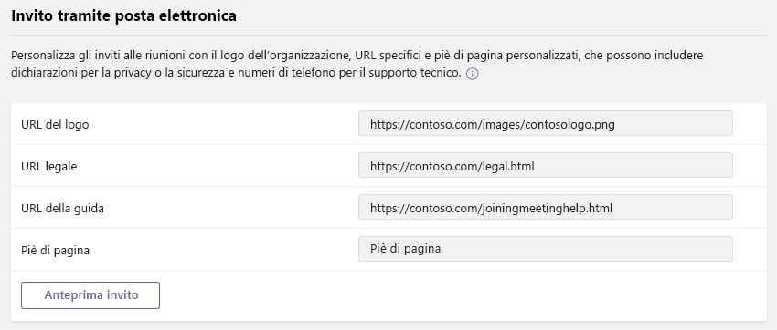
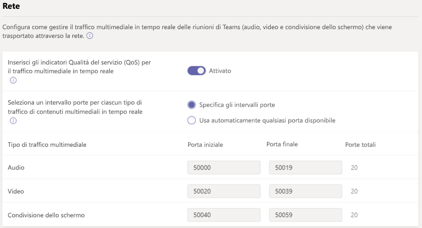

# Gestire le impostazioni di riunione in Microsoft Teams

L’amministratore usa le impostazioni delle riunioni di Teams per controllare se gli utenti anonimi possono partecipare alle riunioni di Teams, personalizzare gli inviti alle riunioni e, se si vuole attivare la Qualità del servizio (QoS), impostare gli intervalli di porte per il traffico in tempo reale. Queste impostazioni si applicano a tutte le riunioni di Teams che gli utenti pianificano nell'organizzazione. È possibile gestire le impostazioni da **Riunioni** > **Impostazioni riunione** nell'interfaccia di amministrazione di Microsoft Teams.

## Consentire agli utenti anonimi di partecipare alle riunioni

Con la partecipazione anonima, chiunque può partecipare alla riunione come utente anonimo facendo clic sul collegamento nell'invito alla riunione. Per altre informazioni, vedere [Partecipare a una riunione senza un account di Teams](https://support.office.com/article/join-a-meeting-without-a-teams-account-c6efc38f-4e03-4e79-b28f-e65a4c039508).

 **Utilizzo dell'interfaccia di amministrazione di Microsoft Teams.**

Per apportare queste modifiche, è necessario essere un amministratore del servizio Teams. Vedere [Usare i ruoli di amministratore di Teams per gestire Teams](./using-admin-roles.md) per informazioni su come ottenere ruoli e autorizzazioni di amministratore.

1. Passare all’interfaccia di amministrazione.

2. Nel riquadro di spostamento sinistro, andare a **Riunioni** > **Impostazioni di riunione**.

3. In **Partecipanti**, attivare **Gli utenti anonimi possono partecipare a una riunione**.

    

> [!CAUTION]
> Se non si vuole consentire agli utenti anonimi di partecipare alle riunioni pianificate dagli utenti dell'organizzazione, disattivare questa impostazione.

## Consentire agli utenti anonimi di interagire con le app nelle riunioni

Gli utenti anonimi ora erediteranno i criteri di autorizzazione predefiniti globali a livello di utente. Questo controllo consentirà agli utenti anonimi di interagire con le app nelle riunioni Teams se i criteri di autorizzazione predefiniti globali a livello di utente sono stati abilitati. Si noti che tutti gli utenti anonimi possono interagire solo con le app già disponibili in una riunione e non possono acquisire e/o gestire tali app. 

> [!IMPORTANT]
> Per impostazione predefinita, l'impostazione per consentire agli utenti anonimi di interagire con le app nelle riunioni è abilitata.

 **Utilizzo dell'interfaccia di amministrazione di Microsoft Teams.**

Per accedere a questa impostazione è necessario essere un amministratore del servizio Teams. Vedere [Usare i ruoli di amministratore di Teams per gestire Teams](./using-admin-roles.md) per informazioni su come ottenere ruoli e autorizzazioni di amministratore.

1. Passare all’interfaccia di amministrazione.

2. Nel riquadro di spostamento sinistro, andare a **Riunioni** > **Impostazioni di riunione**.

3. In **Partecipanti**, l'impostazione per **Gli utenti anonimi possono interagire con le app nelle riunioni** può essere modificata.

> [!CAUTION]
> Se non si vuole consentire agli utenti anonimi di interagire con le app nelle riunioni pianificate dagli utenti dell'organizzazione, disattivare questa impostazione.

## Personalizzare gli inviti alle riunioni

È possibile personalizzare gli inviti alle riunioni di Teams per soddisfare le esigenze dell’organizzazione. È possibile aggiungere il logo dell'organizzazione e includere informazioni utili, come i collegamenti al sito Web dell’assistenza e il dichiarazione legale di non responsabilità, oltre a un piè di pagina di solo testo.

### Suggerimenti per la creazione di un logo per gli inviti alle riunioni  

1. È possibile creare un'immagine di dimensioni non superiori a 188 pixel di larghezza e 30 pixel di altezza (immagine di dimensioni ridotte).
2. Salvare l'immagine in formato JPG o PNG.
3. Archiviare l'immagine in una posizione accessibile da tutti gli utenti che ricevono l’invito, ad esempio un sito Web pubblico.

    Ora è possibile aggiungerla agli inviti alle riunioni. Vedere i passaggi successivi.

### Personalizzare gli inviti alle riunioni

 **Utilizzo dell'interfaccia di amministrazione di Microsoft Teams.**

1. Passare all’interfaccia di amministrazione.
2. Nel riquadro di spostamento sinistro, andare a **Riunioni** > **Impostazioni di riunione**.
3. In **Invito tramite posta elettronica**, eseguire quanto descritto di seguito:

    

    - **URL logo** Immettere l'URL in cui è archiviato il logo.
    - **URL informazioni legali** Se l'organizzazione ha un sito Web legale che gli utenti possono visitare per qualsiasi questione legale, immettere l'URL qui.
    - **URL assistenza** Se l'organizzazione ha un sito Web di assistenza che gli utenti possono visitare in caso di problemi, immettere l'URL qui.
    - **Piè di pagina** Immettere il testo da includere come piè di pagina.
4. Fare clic su **Invito di anteprima** per visualizzare un'anteprima dell'invito alla riunione.
5. Al termine fare clic su **Salva**.
6. Attendere un'ora o il tempo necessario per consentire la propagazione delle modifiche. Quindi, pianificare una riunione di Teams per vedere l'aspetto dell'invito alla riunione.  

## Impostare il modo in cui si vuole gestire il traffico multimediale in tempo reale per le riunioni di Teams

Se si usa la Qualità del servizio (QoS) per assegnare la priorità al traffico di rete, è possibile abilitare gli indicatori QoS e impostare gli intervalli porta per ogni tipo di traffico multimediale. L’impostazione dell'intervallo di porte per diversi tipi di traffico è un unico passaggio per gestire i contenuti multimediali in tempo reale; per altre informazioni, vedere [Qualità del servizio (QoS) in Teams](qos-in-teams.md).

> [!IMPORTANT]
> Sistemi basati su Apple: l'unica istanza in cui i dispositivi basati su Apple impostano effettivamente il valore DSCP è se vengono soddisfatte tutte le condizioni seguenti:
> - iOS.
> - Rete WiFi.
> - Interruttori Cisco.
> - L'amministratore di rete ha aggiunto l'app all'elenco approvato.
>
> Sistemi basati su Android: non esistono limitazioni note.
>
> Se si attiva la Qualità del servizio (QoS) o si modificano le impostazioni nell'interfaccia di amministrazione di Microsoft Teams per il servizio di Teams, sarà anche necessario [applicare le impostazioni di corrispondenza a tutti i dispositivi degli utenti](QoS-in-Teams-clients.md) e a tutti i dispositivi di rete interni per implementare completamente le modifiche apportate alla Qualità del servizio (QoS) in Teams.

  **Utilizzo dell'interfaccia di amministrazione di Microsoft Teams.**
1. Passare all’interfaccia di amministrazione.
2. Nel riquadro di spostamento sinistro, andare a **Riunioni** > **Impostazioni di riunione**.
3. In **Rete**, eseguire quanto descritto di seguito:

    

    - Per consentire l'uso dei contrassegni DSCP per la Qualità del servizio (QoS), attivare **Inserire gli indicatori della Qualità del servizio (QoS) per il traffico multimediale in tempo reale**. È possibile solo usare o non usare gli indicatori; non è possibile quindi impostare indicatori personalizzati per ciascun tipo di traffico. Per altre informazioni sugli indicatori DSCP, vedere [Selezionare un metodo di implementazione QoS](QoS-in-Teams.md#select-a-qos-implementation-method).

        > [!IMPORTANT]
        > Si noti che l'abilitazione di QoS viene eseguita solo sugli endpoint per contrassegnare i pacchetti che lasciano il client. È comunque consigliabile applicare regole QoS corrispondenti in tutti i dispositivi di rete interna per il traffico in arrivo.
        
        > [!NOTE]
        > Il contrassegno degli indicatori DSCP viene eseguito solitamente tramite le porte di origine e il traffico UDP porterà a un inoltro del trasporto con la porta di destinazione 3478 per impostazione predefinita. Se la società necessita del contrassegno sulle porte di destinazione, contattare il supporto per abilitare la comunicazione verso l'inoltro del trasporto con le porte UDP 3479 (Audio), 3480 (Video) e 3481 (Condivisione).
    - Per specificare gli intervalli di porte, accanto a **Seleziona un intervallo di porta per ogni tipo di traffico multimediale in tempo reale** selezionare **Specifica gli intervalli di porta** e quindi immettere la porta iniziale e quella finale per la condivisione audio, video e dello schermo. Selezionare questa opzione è necessario per implementare QoS. 
        > [!Note]
        > Se gli **indicatori di Qualità del servizio (QoS) per il traffico multimediale in tempo reale** sono attivi, sarà necessario gestire le impostazioni delle porte, che non vengono gestite automaticamente.
        
        > [!IMPORTANT]
        > Se si seleziona **Utilizzare automaticamente qualsiasi porta disponibile**, vengono usate le porte disponibili tra 1024 e 65535. Usare questa opzione solo quando non si implementa la Qualità del servizio (QoS).
        >
        > Se si seleziona un intervallo di porte troppo ridotto, si avranno interruzioni di chiamata e una scarsa qualità delle chiamate. Le raccomandazioni riportate di seguito devono essere il minimo necessario.

Se non si è certi di quale intervallo di porte usare nel proprio ambiente, le impostazioni seguenti rappresentano un buon punto di partenza. Per altre informazioni, vedere [Implementare la Qualità del servizio (QoS) in Microsoft Teams. Di seguito, si trovano i contrassegni DSCP necessari e gli intervalli di porte dei contenuti multimediali consigliati, usati sia da Teams che da ExpressRoute.

### Intervalli di porte e contrassegni DSCP

Tipo di traffico multimediale| Intervallo di porte di origine client \* |Protocollo|Valore DSCP|Classe DSCP|
|:---             |:---                         |:---    |:---      |:---      |
|Audio            | 50.000–50.019               |TCP/UDP |46        |Expedited Forwarding (EF)|
|Video            | 50.020–50.039               |TCP/UDP |34        |Assured Forwarding (AF41)|
|Condivisione di applicazioni/schermi| 50.040–50.059      |TCP/UDP |18        |Assured Forwarding (AF21)|
| | | | |

\* Gli intervalli porta assegnati non possono sovrapporsi e dovrebbero trovarsi uno accanto all'altro.

Dopo che QoS sarà stato usato per un certo periodo tempo, si avranno informazioni di utilizzo sulla richiesta per ognuno di questi tre carichi di lavoro e si potrà scegliere quali modifiche apportare in base alle proprie specifiche esigenze. Il [Dashboard Qualità della chiamata](turning-on-and-using-call-quality-dashboard.md) sarà utile a questo scopo.
