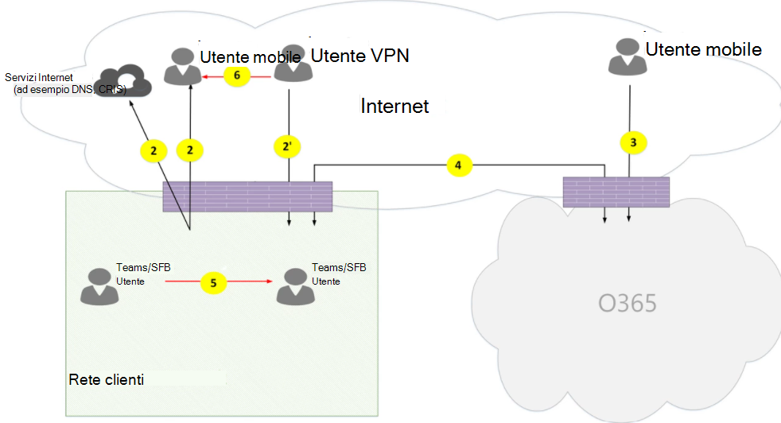
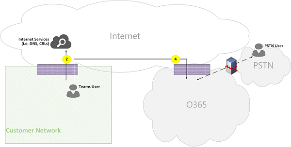
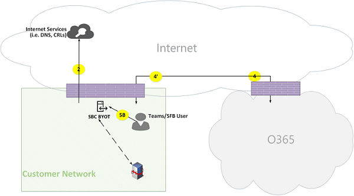

# Flussi di chiamata in Microsoft Teams

> [!TIP]
> Guarda questa sessione per scoprire in che modo i team sfruttano la rete e come pianificare la connettività di rete ottimale: [pianificazione della rete teams](https://aka.ms/teams-networking).

## Panoramica

Questo articolo descrive in che modo i team usano flussi di chiamate di Office 365 in varie topologie. Descrive inoltre i flussi di Team univoci usati per le comunicazioni multimediali peer-to-peer. Il documento descrive questi flussi, il loro scopo e l'origine e la terminazione della rete. Per gli scopi di questo articolo, presupporre quanto segue:

- Il flusso X viene usato dal client di Office 365 locale per comunicare con il servizio Office 365 nel cloud. Viene originato dalla rete del cliente e termina come endpoint in Office 365.

- Il flusso Y viene usato dal client di Office 365 locale per comunicare con un servizio su Internet a cui è associata la dipendenza da Office 365. Viene originato dalla rete del cliente e termina come endpoint su Internet.

Questo articolo illustra le informazioni seguenti:

- **Sfondo**. Fornisce informazioni di base, ad esempio le reti che i flussi di Office 365 possono attraversare, tipi di traffico, indicazioni di connettività dalla rete clienti agli endpoint di servizio di Office 365, interoperabilità con componenti di terze parti e principi usati in teams per selezionare i flussi multimediali.

- **Flussi di chiamata in diverse topologie**. Illustra l'uso dei flussi delle chiamate in diverse topologie. Per ogni topologia, la sezione enumera tutti i flussi supportati e illustra come vengono usati questi flussi in diversi casi di utilizzo. Per ogni caso di utilizzo, descrive la sequenza e la selezione dei flussi usando un diagramma di flusso.

- **Team con ottimizzazione Route espressa**. Descrive il modo in cui vengono usati questi flussi quando la Route Express viene distribuita per l'ottimizzazione, illustrata con una semplice topologia.

## Sfondo

### Segmenti di rete

**Rete di clienti**. Questo è il segmento di rete che controlli e Gestisci. Ciò include tutte le connessioni dei clienti all'interno degli uffici dei clienti, sia wired che wireless, connessioni tra edifici di Office, connessioni ai datacenter locali e le connessioni a provider Internet, Route Express o altri peering privati.

In genere, una rete di clienti ha diversi perimetri di rete con firewall e/o server proxy, che applicano i criteri di sicurezza dell'organizzazione e che consentono solo un determinato traffico di rete impostato e configurato. Poiché Gestisci questa rete, hai il controllo diretto sulle prestazioni della rete e ti consigliamo di completare le valutazioni della rete per convalidare le prestazioni sia all'interno dei siti della rete che dalla rete alla rete di Office 365.

**Internet**. Si tratta del segmento di rete che fa parte della rete globale che verrà usata dagli utenti che si connettono a Office 365 dall'esterno della rete del cliente. Viene usato anche da un traffico dalla rete clienti a Office 365.

**Rete privata visitata o Guest**. Si tratta del segmento di rete all'esterno della rete di clienti, ma non in Internet pubblico, che gli utenti e i loro ospiti possono visitare, ad esempio una rete privata domestica o una rete privata aziendale, che non distribuisce Team, in cui gli utenti e i loro clienti che interagiscono con i servizi teams possono risiedere).

> [!NOTE]
> La connettività a Office 365 è applicabile anche a queste reti.

**Office 365**. Questo è il segmento di rete che supporta i servizi di Office 365. È distribuito in tutto il mondo con i bordi in prossimità della rete del cliente nella maggior parte delle posizioni. Le funzioni includono inoltro di trasporto, server di conferenza e processore multimediale.

**Route Express (facoltativa)**. Questo è il segmento di rete che fa parte della tua rete globale che ti darà una connessione privata dedicata alla rete Office 365.

### Tipi di traffico

**Elementi multimediali in tempo reale**. Dati incapsulati nel protocollo RTP (Real-Time Transport Protocol) che supporta i carichi di lavoro di condivisione audio, video e dello schermo. In generale, il traffico multimediale è molto sensibile alla latenza, quindi vorresti che il traffico perseguisse il percorso più diretto possibile e per usare UDP e TCP come protocollo di livello di trasporto, che è il miglior mezzo di trasporto per i media in tempo reale interattivo da una prospettiva di qualità . Si noti che, come ultima risorsa, i file multimediali possono usare TCP/IP e anche essere tunnel nel protocollo HTTP, ma non è consigliabile a causa di conseguenze di qualità errate. Il flusso RTP viene protetto con SRTP, in cui solo il payload viene crittografato.

**Segnalazione**. Il collegamento di comunicazione tra il client e il server o altri client usati per controllare le attività, ad esempio quando viene avviata una chiamata, e recapitare i messaggi istantanei. La maggior parte del traffico di segnalazione usa le interfacce REST basate su HTTPS, ma in alcuni scenari, ad esempio la connessione tra Office 365 e un controller di bordo della sessione, usa il protocollo SIP. È importante comprendere che il traffico è molto meno sensibile alla latenza, ma può causare interruzioni dei servizi o timeout delle chiamate se la latenza tra gli endpoint supera alcuni secondi.

### Connettività a Office 365

I team richiedono [la connettività a Internet](https://docs.microsoft.com/office365/enterprise/assessing-network-connectivity). Gli URL endpoint di teams e gli intervalli di indirizzi IP sono elencati negli [intervalli di URL e indirizzi IP di Office 365](https://docs.microsoft.com/office365/enterprise/urls-and-ip-address-ranges). (Si noti che è necessario aprire la connettività alle porte TCP 80 e 443 e alle porte UDP da 3478 a 3481). Inoltre, Teams ha una dipendenza da Skype for business online, che deve essere collegato anche a Internet.

La connettività dei flussi multimediali di team viene implementata usando le procedure standard IETF Interactive Connectivity Establishment (ICE).

### Restrizioni di interoperabilità

**Relay multimediali di terze parti**. Un flusso multimediale di Teams (ovvero, in cui uno degli endpoint multimediali è Teams) può attraversare solo i team o i relay multimediali nativi di Skype for business. L'interoperabilità con un relay multimediale di terze parti non è supportata. Tieni presente che un SBC di terze parti sul confine con PSTN deve terminare il flusso RTP/RTCP, protetto con SRTP, e non inoltrarlo all'hop successivo.

**Server proxy SIP di terze parti**. Un team che segnala la finestra di dialogo SIP con un SBC di terze parti e/o un gateway può attraversare i proxy SIP nativi di Skype for business. L'interoperabilità con un proxy SIP di terze parti non è supportata.

**B2BUA di terze parti (o SBC)**. Un flusso multimediale di Teams da e verso la rete PSTN viene terminato da un SBC di terze parti. Tuttavia, l'interoperabilità con un SBC di terze parti all'interno della rete Teams (dove un SBC di terze parti media due team o endpoint Skype for business) non è supportato.

### Tecnologie che non sono consigliate con Microsoft Teams

**Rete VPN**. Non è consigliabile per il traffico multimediale (o flusso 2'). Il client VPN deve usare la divisione VPN e instradare il traffico multimediale come qualsiasi utente esterno non VPN, come specificato in [abilitare Lync media per aggirare un tunnel VPN](https://techcommunity.microsoft.com/t5/Skype-for-Business-Blog/Enabling-Lync-Media-to-Bypass-a-VPN-Tunnel/ba-p/620210).

> [!NOTE]
> Anche se il titolo indica Lync, è applicabile anche ai team.

**Formatori di pacchetti**. È sconsigliabile qualsiasi tipo di pacchetto Snippers, controllo pacchetti o strumenti di shaper di pacchetti e può degradare significativamente la qualità.

### Principi

Sono disponibili quattro principi generali che consentono di comprendere i flussi delle chiamate per Microsoft teams:

- Una conferenza di Microsoft teams è ospitata da Office 365 nella stessa area in cui è stato aggiunto il primo partecipante. Si noti che, se sono presenti eccezioni a questa regola in alcune topologie, queste verranno descritte in questo documento e illustrate da un flusso di chiamata appropriato.

- Un endpoint multimediale di teams in Office 365 viene usato in base alle esigenze di elaborazione multimediale e non in base al tipo di chiamata. Ad esempio, una chiamata Point-to-Point può usare un endpoint multimediale nel cloud per elaborare elementi multimediali per la trascrizione o la registrazione, mentre una conferenza con due partecipanti potrebbe non usare alcun endpoint multimediale nel cloud. Tuttavia, la maggior parte delle conferenze utilizzerà un endpoint multimediale per scopi di mixaggio e routing, allocato in cui è ospitata la conferenza. Il traffico multimediale inviato da un client all'endpoint multimediale può essere indirizzato direttamente o usare un relay di trasporto in Office 365, se necessario a causa delle restrizioni del firewall di rete del cliente.

- Il traffico multimediale per le chiamate peer-to-peer prende la route più diretta disponibile, presupponendo che la chiamata non imposti un endpoint multimediale nel cloud (Vedi principio precedente). La route preferita è diretta al peer remoto (client), ma se tale route non è disponibile, uno o più relay di trasporto rilasceranno il traffico. È consigliabile che il traffico multimediale non consentirà di server trasversali, ad esempio formatori di pacchetti, server VPN e così via, poiché questo influisce sulla qualità del supporto.

- Il traffico di segnalazione passa sempre al server più vicino all'utente.

Per altre informazioni sui dettagli nel percorso multimediale scelto, vedere [informazioni sui flussi multimediali in Microsoft teams-BRK4016](https://www.youtube.com/watch?v=1tmHMIlAQdo).

## Flussi delle chiamate in diverse topologie

### Topologia Teams

Questa topologia viene usata dai clienti che sfruttano i servizi teams dal cloud senza una distribuzione locale, come il routing diretto di Skype for Business Server o il sistema telefonico. Inoltre, l'interfaccia di Office 365 viene eseguita tramite Internet senza Route Azure Express.

*Figura 1-topologia Teams*

Tieni presente che:

- La direzione delle frecce nel diagramma precedente rispecchia la direzione di apertura della comunicazione che influenza la connettività nei perimetri dell'organizzazione. Nel caso di UDP per gli elementi multimediali, il primo pacchetto può fluire nella direzione opposta, ma questi pacchetti potrebbero essere bloccati fino a quando i pacchetti nell'altra direzione non verranno riversati.
- Teams è distribuito affiancato a Skype for business online, quindi i clienti vengono visualizzati come "Teams/SFB User".

Per altre informazioni, vedere le seguenti topologie facoltative più avanti nell'articolo:

- La distribuzione locale di Skype for business è descritta nella **topologia ibrida di teams**.
- Il routing diretto del sistema telefonico (per la connettività PSTN) è descritto in **Teams con topologia di routing diretta**.
- Express route è descritto in **Teams con Express Route Optimization**.

**Descrizioni dei flussi**:

- **Flusso 2** : rappresenta un flusso avviato da un utente nella rete di clienti a Internet come parte dell'esperienza Teams dell'utente. Esempi di questi flussi sono il DNS e il supporto peer-to-peer.
- **Flusso 2'** : rappresenta un flusso avviato da un utente di team mobili remoto, con VPN alla rete del cliente.
- **Flusso 3** -rappresenta un flusso avviato da un utente di team mobili remoti agli endpoint di Office 365/teams.
- **Flusso 4** : rappresenta un flusso avviato da un utente nella rete del cliente agli endpoint di Office 365/teams.
- **Flusso 5** : rappresenta un flusso multimediale peer-to-peer tra un utente di teams e un altro teams o un utente Skype for business all'interno della rete del cliente.
- **Flusso 6** : rappresenta un flusso multimediale peer-to-peer tra un utente di team mobili remoto e un altro team di dispositivi mobili remoti o un utente Skype for business tramite Internet.

#### Caso di utilizzo: uno-a-uno

Le chiamate uno-a-uno usano un modello comune in cui il chiamante otterrà un set di candidati costituito da indirizzi IP/porte, tra cui local, Relay e riflessivo (indirizzo IP pubblico del client visto dall'inoltro) candidate. Il chiamante invia questi candidati alla festa chiamata; l'entità chiamata ottiene anche un set di candidati simile e li invia al chiamante. I messaggi di controllo della connettività STUN vengono usati per individuare i percorsi del chiamante o del gruppo denominato e il percorso di lavoro migliore selezionato. Gli elementi multimediali, ovvero i pacchetti RTP/RTCP protetti tramite SRTP, vengono quindi inviati tramite la coppia di candidati selezionata. L'inoltro di trasporto viene distribuito come parte di Office 365.

Se l'indirizzo IP locale/i candidati alla porta o i candidati riflessivi hanno connettività, verrà selezionato il percorso diretto tra i client (o usando un NAT) per l'elemento multimediale. Se i client sono entrambi nella rete del cliente, il percorso diretto deve essere selezionato. Questo richiede la connettività UDP diretta all'interno della rete del cliente. Se i client sono entrambi utenti di cloud nomadi, a seconda del NAT/firewall, media può usare la connettività diretta.

Se un client è interno nella rete di clienti e un client è esterno, ad esempio un utente di Cloud Mobile, è improbabile che la connettività diretta tra i candidati locali o riflessivi funzioni. In questo caso, un'opzione consiste nell'usare uno dei candidati di inoltro di trasporto da un client (ad esempio, il client interno ha ottenuto una candidata di inoltro dal relay di trasporto in Office 365; il client esterno deve essere in grado di inviare pacchetti STUN/RTP/RTCP al relay di trasporto). Un'altra opzione è il client interno inviato al candidato di inoltro ottenuto dal client Cloud Mobile. Tieni presente che, anche se la connettività UDP per gli elementi multimediali è altamente consigliata, TCP è supportato.

**Passaggi di alto livello**:

1. L'utente teams A risolve il DNS (Domain Name) URL usando il flusso 2.
1. Utenti teams A alloca una porta di inoltro multimediale sull'inoltro del trasporto di teams tramite flusso 4.
1. Un utente di teams Invia "invita" con i candidati ICE con flusso 4 a Office 365.
1. Office 365 invia una notifica all'utente di teams B con flusso 4.
1. L'utente teams B alloca una porta di inoltro multimediale nell'inoltro del trasporto di teams usando il flusso 4.
1. L'utente teams B invia "answer" con i candidati ICE usando il flusso 4, che viene inoltrato di nuovo a teams User A con Flow 4.
1. I team utenti A e teams User B invocano i test di connettività ICE e viene selezionato il percorso multimediale migliore disponibile (vedi diagrammi sotto per vari casi di utilizzo).
1. Gli utenti di teams inviano la telemetria a Office 365 usando il flusso 4.

**All'interno della rete del cliente:**

*Figura 2-all'interno della rete del cliente*

Nel passaggio 7 viene selezionato il flusso multimediale peer-to-peer 5.

Il supporto è bidirezionale. La direzione del flusso 5 indica che un lato avvia la comunicazione da una prospettiva di connettività, coerente con tutti i flussi di questo documento. In questo caso, non importa quale direzione viene usata perché entrambi gli endpoint si trovano all'interno della rete del cliente.

**Rete di clienti per utenti esterni (supporto inoltrato dall'inoltro del trasporto Teams):**

*Figura 3-Customer network to External User (supporto inoltrato dall'inoltro del trasporto di Teams)*

Nel passaggio 7, flusso 4, da rete clienti a Office 365 e flusso 3, da utenti di team mobili remoti a Office 365, sono selezionati. Questi flussi vengono inoltrati dall'inoltro di trasporto teams all'interno di Office 365.

Il supporto è bidirezionale, dove indica il lato che avvia la comunicazione da una prospettiva di connettività. In questo caso, questi flussi vengono usati per la segnalazione e l'elemento multimediale, usando protocolli e indirizzi di trasporto diversi.

**Rete clienti per utenti esterni (Direct Media):**

*Figura 4-Customer network to External User (Direct Media)*

Nel passaggio 7 è selezionato flusso 2, dalla rete clienti a Internet (peer del cliente).

- Il supporto diretto con l'utente di un dispositivo mobile remoto (non inoltrato tramite Office 365) è facoltativo. In altre parole, il cliente può bloccare questo percorso per applicare un percorso multimediale tramite Relay di trasporto in Office 365.

- Il supporto è bidirezionale. La direzione del flusso 2 all'utente di dispositivi mobili remoti indica che un lato avvia la comunicazione da una prospettiva di connettività.

**Utente VPN per utenti interni (supporto inoltrato dall'inoltro di trasporto Teams)**

*Figura 5-utente VPN per utenti interni (supporto inoltrato dall'inoltro del trasporto Teams)*

La segnalazione tra la VPN alla rete del cliente usa il flusso 2'. La segnalazione tra la rete del cliente e Office 365 utilizza il flusso 4. Tuttavia, l'elemento multimediale ignora la VPN e viene instradata usando i flussi 3 e 4 tramite teams Media Relay in Office 365.

**Utente VPN per utenti interni (Direct Media)**

*Figura 6-utente VPN per utenti interni (supporto diretto)*

La segnalazione tra la VPN alla rete del cliente usa il flusso 2'. La segnalazione tra la rete del cliente e Office 365 utilizza il flusso 4. Tuttavia, l'elemento multimediale ignora la VPN e viene instradata con il flusso 2 dalla rete del cliente a Internet.

Il supporto è bidirezionale. La direzione del flusso 2 per l'utente di dispositivi mobili remoti indica che un lato avvia la comunicazione da una prospettiva di connettività.

**Utente VPN per utenti esterni (Direct Media)**

*Figura 7-utente VPN per utenti esterni (supporto diretto)*

La segnalazione tra l'utente VPN e la rete del cliente USA flusso 2' e l'uso di Flow 4 in Office 365. Tuttavia, media bypassa la VPN e viene instradata con il flusso 6.

Il supporto è bidirezionale. La direzione del flusso 6 per l'utente di dispositivi mobili remoti indica che un lato avvia la comunicazione da una prospettiva di connettività.

#### Caso di utilizzo: teams da PSTN tramite trunk di Office 365

Office 365 dispone di un sistema telefonico che consente l'immissione e la ricezione di chiamate dalla rete PSTN (Public Switched Telephone Network). Se il trunk PSTN è connesso tramite il piano di chiamata del sistema telefonico, non esistono requisiti di connettività speciali per questo caso di utilizzo. Se si vuole connettere il proprio trunk PSTN locale a Office 365, è possibile usare il routing diretto del sistema telefonico.

*Figura 8-Teams da PSTN tramite trunk di Office 365*

#### Caso di utilizzo: riunione Teams

Il server dei servizi di conferenza audio/video/condivisione dello schermo (VBSS) fa parte di Office 365. Ha un indirizzo IP pubblico che deve essere raggiungibile dalla rete clienti e deve essere raggiungibile da un client di cloud nomadi. Ogni client/endpoint deve essere in grado di connettersi al server dei servizi di conferenza.

I client interni otterranno candidati locali, riflessivi e di inoltro nello stesso modo descritto per le chiamate uno-a-uno. I client invieranno questi candidati al server dei servizi di conferenza in un invito. Il server dei servizi di conferenza non usa un relay perché ha un indirizzo IP accessibile pubblicamente, quindi risponde con il candidato indirizzo IP locale. Il client e il server dei servizi di conferenza verificheranno la connettività nello stesso modo descritto per le chiamate uno-a-uno.

Tieni presente che:

- I client di team non possono partecipare a riunioni Skype for business e i client Skype for business non possono partecipare alle riunioni di teams.

- Un utente PSTN facoltativamente "compone" o viene "chiamato fuori", a seconda delle chiamate PSTN dell'organizzatore della riunione e/o del provisioning delle conferenze.

- Un utente Guest o un utente del cliente può partecipare da una rete privata Guest, che è protetta con FW/NAT con regole rigorose.

*Figura 9-riunione Teams*

#### Caso di utilizzo: Federazione con Skype for business in locale

**Supporto inoltrato dall'inoltro di trasporto teams in Office 365**

*Figura 10-elementi multimediali inoltrati dall'inoltro di trasporto teams in Office 365*

Tieni presente che:

- La Federazione è, per definizione, una comunicazione tra due tenant. In questo caso, tenant A, che usa teams, federa con tenant B, che usa Skype for business in locale. Se il tenant B usa anche Office 365, il client Skype for business avrebbe usato il flusso 3 per connettersi con Office 365.

- La segnalazione e l'elemento multimediale proveniente dal client federativo di Skype for business a Skype for Business Server locale non è più compreso nell'ambito del documento. Tuttavia, è illustrato qui per chiarezza.

- La segnalazione tra teams e Skype for business è colmata da un gateway in Office 365.

- Il contenuto multimediale in questo caso viene inoltrato dall'inoltro di trasporto teams in Office 365 alla rete clienti e client Skype for business remoto tramite flusso 4.

**Elementi multimediali inoltrati da relay multimediale Skype for business nel tenant federato**

*Figura 11-elementi multimediali inoltrati da relay multimediale Skype for business nel tenant federato*

Tieni presente che:

- Le segnalazioni e i contenuti multimediali del client di Skype for business federati a un server Skype for business locale non hanno l'ambito di questo documento. Tuttavia, è illustrato qui per chiarezza.

- La segnalazione tra teams e Skype for business è colmata da un gateway in Office 365.

- Il contenuto multimediale in questo caso viene inoltrato dall'inoltro multimediale locale di Skype for business alla rete del cliente tramite flusso 2. Si noti che il traffico da parte dell'utente di teams all'inoltro multimediale remoto nella rete di clienti federati verrà inizialmente bloccato dall'inoltro multimediale fino a quando il traffico nella direzione inversa inizia a fluire. Tuttavia, il flusso bidirezionale aprirà la connettività in entrambe le direzioni.

**Direct (peer-to-peer)**

*Figura 12-Direct (peer-to-peer)*

### Topologia ibrida Teams

Questa topologia include team con una distribuzione locale di Skype for business.

*Figura 13-topologia ibrida di Teams*

- La direzione delle frecce nel diagramma precedente rispecchia la direzione di apertura della comunicazione che influenza la connettività nei perimetri dell'organizzazione. Nel caso di UDP per gli elementi multimediali, il primo pacchetto può fluire nella direzione opposta, ma questi pacchetti potrebbero essere bloccati fino a quando i pacchetti nell'altra direzione non verranno riversati.

- Teams è distribuito affiancato a Skype for business online, quindi i clienti vengono visualizzati come "Teams/SFB User".

Flusso aggiuntivo (nella parte superiore della topologia di Teams):

- **Flusso 5a** : rappresenta un flusso di elementi multimediali peer-to-peer tra un utente di teams all'interno della rete del cliente e un relay multimediale locale di Skype for Business presso il Edge della rete del cliente.

#### Caso di utilizzo: teams per Skype for business uno-a-uno

**Ibrido all'interno della rete del cliente**

*Figura 14-ibrida all'interno della rete del cliente*

La segnalazione tra teams e Skype for business è colmata da un gateway in Office 365. Tuttavia, l'elemento multimediale viene indirizzato direttamente al peer-to-peer all'interno della rete del cliente usando il flusso 5.

**Rete di clienti ibridi con utenti Skype for business esterni-inoltrati da Office 365**

*Figura 15-rete clienti ibrida con utenti esterni di Skype for business-inoltrati da Office 365*

Tieni presente che:

- La segnalazione e l'elemento multimediale dal client Skype for business a un server Skype for business locale non hanno un ambito di questo documento. Tuttavia, è illustrato qui per chiarezza.

- La segnalazione tra teams e Skype for business è colmata da un gateway in Office 365.

- L'elemento multimediale viene inoltrato tramite inoltro di trasporto teams in Office 365 alla rete del cliente tramite flusso 4.

**Rete di clienti ibridi con utenti Skype for business esterni-inoltrati per Edge locale**

*Figura 16-rete clienti ibrida con l'utente esterno di Skype for business-inoltrato per Edge locale*

Tieni presente che:

- La segnalazione e l'elemento multimediale dal client Skype for business a un server Skype for business locale non hanno ambito di questo documento. Tuttavia, è illustrato qui per chiarezza.

- La segnalazione è colmata da un gateway in Office 365.

- Il supporto viene inoltrato da Skype for Business Media Relay in Skype for business in locale Edge per l'utente di teams all'interno della rete del cliente tramite Media Flow 5A.

### Team con la topologia di routing diretta del sistema telefonico

Questa topologia include team con routing diretto del sistema telefonico.

Il routing diretto consente di usare un provider di servizi PSTN (Public Switched Telephone Network) di terze parti associando un dispositivo hardware SBC (Session Border Controller) di proprietà del cliente supportato in locale a Office 365 e quindi connettendo il trunk della telefonia a tale dispositivo.

Per supportare questo scenario, il cliente deve distribuire un SBC certificato per il routing diretto da uno dei partner certificati Microsoft. SBC deve essere configurato come consigliato dal fornitore e instradabile da Office 365 per il traffico UDP diretto. Il flusso di lavoro può essere eseguito direttamente da team e/o dal client Skype for business al SBC (bypassando il gateway Teams) o attraversando il gateway teams. La connettività con SBC, quando il trunk è configurato per aggirare il gateway di teams, è basato su ICE, dove SBC supporta ICE-Lite, mentre l'endpoint multimediale di teams/Skype for business supporta l'intero modulo ICE.

* Figura 17-teams con la topologia di routing Direct del sistema telefonico

Tieni presente che:

- La direzione delle frecce nel diagramma precedente rispecchia la direzione di apertura della comunicazione che influenza la connettività nei perimetri dell'organizzazione. Nel caso di UDP per gli elementi multimediali, il primo pacchetto può fluire nella direzione opposta, ma questi pacchetti potrebbero essere bloccati fino a quando i pacchetti nell'altra direzione non verranno riversati.

- Teams è distribuito affiancato a Skype for business online, quindi i clienti vengono visualizzati come "Teams/SFB User".

Flussi aggiuntivi (nella parte superiore della topologia di teams online):

- **Flusso 4'** -rappresenta un flusso da Office 365 alla rete del cliente, usato per stabilire una connessione tra il server multimediale Teams nel cloud con il SBC locale.
- **Flusso 5b** : rappresenta un flusso multimediale tra l'utente teams all'interno della rete Customer con il Direct routing SBC in modalità bypass.
- **Flusso 5C** : rappresenta un flusso multimediale tra l'SBC di routing diretto e un altro SBC di routing diretto in una modalità di esclusione di un tornante PSTN.

**Utente interno con routing diretto (supporto inoltrato dall'inoltro del trasporto teams in Office 365)**

*Figura 18-utente interno con routing diretto (supporto inoltrato dall'inoltro del trasporto teams in Office 365)*

Tieni presente che:

- L'SBC deve avere un indirizzo IP pubblico instradabile da Office 365.

- La segnalazione e l'elemento multimediale da SBC a Office 365 e viceversa usano flusso 4 e/o flusso 4'.

- Segnalazione e elementi multimediali dal client all'interno della rete del cliente a Office 365 usare il flusso 4.

**Utente remoto con routing diretto (il supporto viene instradato tramite un server multimediale (MP) in Office 365)**

*Figura 19-utente remoto con routing diretto (il supporto viene instradato tramite un server multimediale (MP) in Office 365)*

Tieni presente che:

- L'SBC deve avere un indirizzo IP pubblico instradabile da Office 365.

- La segnalazione e l'elemento multimediale da SBC a Office 365 e viceversa usano flusso 4 e/o flusso 4'.

- Segnalazione e elementi multimediali dal client su Internet a Office 365 usare il flusso 3.

**Routing diretto degli utenti interni (bypass multimediale)**

*Figura 20-routing diretto degli utenti interni (bypass multimediale)*

Tieni presente che:

- L'SBC deve avere un indirizzo IP pubblico instradabile da Office 365.

- La segnalazione da SBC a Office 365 e viceversa USA flusso 4 e/o flusso 4'.

- Segnalazione da client all'interno della rete del cliente a Office 365 usare il flusso 4.

- I contenuti multimediali dal client all'interno della rete del cliente a SBC nella rete clienti usano Flow 5B.

**Utente remoto con routing diretto (bypass multimediale inoltrato dall'inoltro di trasporto teams in Office 365)**

*Figura 21-utente remoto con routing diretto (bypass multimediale inoltrato dall'inoltro di trasporto teams in Office 365)*

Tieni presente che:

- L'SBC deve avere un indirizzo IP pubblico instradabile da Office 365 e Internet.

- La segnalazione da SBC a Office 365 e viceversa USA flusso 4 e/o flusso 4'.

- La segnalazione dal client su Internet a Office 365 usa il flusso 3.

- Gli elementi multimediali del client su Internet con il servizio SBC all'interno della rete clienti usano i flussi 3 e 4 inoltrati dall'inoltro di trasporto teams in Office 365.

**Routing diretto degli utenti remoti (bypass multimediale Direct)**

*Figura 22-routing diretto degli utenti remoti (bypass multimediale Direct)*

Tieni presente che:

- Il servizio SBC deve avere un indirizzo IP pubblico instradabile da Office 365 e Internet.

- La segnalazione da SBC a Office 365 e viceversa USA flusso 4 e/o flusso 4'.

- La segnalazione dal client su Internet a Office 365 usa il flusso 3.

- Gli elementi multimediali del client su Internet con il servizio SBC all'interno della rete del cliente usano il flusso 2.

**Routing diretto (bypass multimediale)-chiamata a tornanti PSTN (a causa di inoltro di chiamata/trasferimento)**

*Figura 23-routing diretto (bypass multimediale)-richiamata PSTN (a causa di inoltro di chiamata/trasferimento)*

Tieni presente che:

- L'SBC deve avere un indirizzo IP pubblico instradabile da Office 365.

- La segnalazione da SBC a Office 365 e viceversa USA flusso 4 e/o flusso 4'.

- Il client è fuori dal ciclo di segnalazione e media dopo che la chiamata è hairpinned da PSTN a PSTN.

- Elementi multimediali dall'istanza SBC a all'interno della rete del cliente all'istanza SBC B all'interno della rete del cliente (dove, A e B può essere la stessa istanza) USA Flow 5C.

**Routing diretto (media tramite Office 365)-chiamata a tornanti PSTN tra due tenant**

*Figura 24-routing diretto (media tramite Office 365)-chiamata a tornanti PSTN tra due tenant*

Tieni presente che:

- L'SBC deve avere un indirizzo IP pubblico instradabile da Office 365.

- La segnalazione da SBC a Office 365 e viceversa USA flusso 4 e/o flusso 4'.

- Il client è fuori dal ciclo di segnalazione e media dopo che la chiamata è hairpinned da PSTN a PSTN.

- Gli elementi multimediali dall'istanza SBC A all'interno della rete cliente X all'istanza SBC B devono essere inoltrati tramite il server multimediale di Office 365 e non possono usare la modalità di bypass.

## Team con ottimizzazione Route espressa

*Figura 25-teams con ottimizzazione Route espressa*

Nel caso in cui l'itinerario espresso sia giustificato e distribuito, i flussi di team potrebbero essere reindirizzati dal flusso 4 al flusso 1 e dal flusso 4' al flusso 1'. Tuttavia, l'applicazione Teams ha una dipendenza difficile da altri flussi di Office 365 su Internet usando i flussi 4 e 4'; i flussi non devono quindi essere bloccati.

Tieni presente che il traffico Edge ibrido di Skype for business viene instradato a Internet e non per esprimere la route per comunicare con utenti esterni e federarsi con altri tenant.

Per evitare flussi asimmetrici, il reindirizzamento deve essere in entrambe le direzioni. In altre parole, un indirizzo all'interno della rete del cliente può essere instradato tramite Internet o via Express, in base all'ottimizzazione, ma non a entrambe.

**Rete di clienti per utenti esterni (supporto inoltrato dall'inoltro del trasporto Teams):**

*Figura 26-Customer network to External User (supporto inoltrato dall'inoltro di teams Transport)*

**Passaggi ad alto livello:**

1. L'utente teams all'interno della rete cliente risolve il DNS (URL Domain Name) usando Flow2.
1. L'utente teams all'interno della rete del cliente alloca una porta di inoltro multimediale sull'inoltro del trasporto di teams usando il flusso 1.
1. L'utente di teams all'interno della rete del cliente invia "invita" con i candidati ICE usando il flusso 1 a Office 365.
1. Office 365 invia una notifica all'utente di team esterni con il flusso 3.
1. L'utente esterno di teams alloca una porta di inoltro multimediale sull'inoltro del trasporto di teams usando il flusso 3.
1. L'utente esterno di teams Invia "answer" con i candidati ICE usando il flusso 3, che viene inoltrato di nuovo all'utente teams A usando il flusso 1.
1. I team utenti A e teams User B richiamano i test di connettività ICE e selezionano i flussi 1 e 3, inoltrati dall'inoltro di trasporto teams in Office 365.
1. Gli utenti di teams inviano la telemetria a Office 365 usando i flussi 1 e 3.

> [!NOTE]
> Il flusso 4 deve essere abilitato per supportare le dipendenze dell'applicazione teams su altri micro-servizi che mandate il flusso 4.
