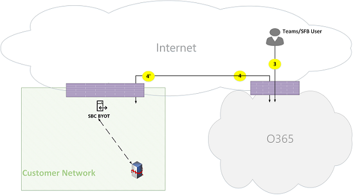

# Flussi di chiamata in Microsoft Teams

> [!TIP]
> Guardare questa sessione per scoprire come Teams sfrutta la rete e come pianificare la connettività di rete ottimale: [Pianificazione della rete di Teams.](https://aka.ms/teams-networking)

## Panoramica

Questo articolo descrive come Teams usa i flussi delle chiamate di Microsoft 365 o Office 365 in varie topologie. Descrive inoltre flussi di Teams univoci usati per la comunicazione multimediale peer-to-peer. Il documento descrive questi flussi, il loro scopo e la loro origine e terminazione nella rete. Ai fini di questo articolo, si supponga che:

- Flow X viene usato dal client locale per comunicare con il servizio Microsoft 365 o Office 365 nel cloud. Proviene dalla rete del cliente e termina come endpoint in Microsoft 365 o Office 365.

- Il flusso Y viene usato dal client locale per comunicare con un servizio su Internet da cui Microsoft 365 o Office 365 ha una dipendenza. Proviene dalla rete del cliente e termina come endpoint su Internet.

Questo articolo illustra le informazioni seguenti:

- **Sfondo**. Fornisce informazioni di base, ad esempio reti che i flussi possono attraversare, tipi di traffico, indicazioni sulla connettività dalla rete del cliente agli endpoint del servizio Microsoft 365 o Office 365, interoperabilità con componenti di terze parti e principi usati da Teams per selezionare i flussi multimediali.

- **I flussi delle chiamate in varie topologie**. Illustra l'uso dei flussi di chiamata in varie topologie. Per ogni topologia, la sezione enumera tutti i flussi supportati e illustra come questi flussi vengono usati in diversi casi di utilizzo. Per ogni caso di utilizzo, descrive la sequenza e la selezione dei flussi usando un diagramma di flusso.

- **Teams con ottimizzazione Express Route**. Descrive come vengono usati questi flussi quando Express Route viene distribuito per l'ottimizzazione, illustrato usando una topologia semplice.

## Sfondo

### Segmenti di rete

**Rete clienti**. Questo è il segmento di rete che controlli e gestisci. Sono incluse tutte le connessioni dei clienti all'interno degli uffici dei clienti, sia cablate che wireless, connessioni tra edifici di uffici, connessioni a data center locali e connessioni a provider Internet, Express Route o qualsiasi altro peering privato.

In genere, una rete clienti ha diversi perimetri di rete con firewall e/o server proxy, che applicano i criteri di sicurezza dell'organizzazione e che consentono solo il traffico di rete configurato e configurato. Poiché si gestisce questa rete, si ha il controllo diretto sulle prestazioni della rete ed è consigliabile completare le valutazioni della rete per convalidare le prestazioni sia all'interno dei siti della rete che dalla rete alla rete Microsoft 365 o Office 365.

**Internet**. Questo è il segmento di rete che fa parte della rete generale che verrà usato dagli utenti che si connettono a Microsoft 365 o Office 365 dall'esterno della rete del cliente. Viene usato anche da parte del traffico dalla rete del cliente a Microsoft 365 o Office 365.

**Rete privata visitata o guest**. Si tratta del segmento di rete esterno alla rete dei clienti, ma non in Internet pubblico, che gli utenti e i loro guest possono visitare ,ad esempio una rete privata domestica o una rete privata aziendale, che non distribuisce Teams, in cui possono risiedere gli utenti e i clienti che interagiscono con i servizi di Teams.

> [!NOTE]
> La connettività a Microsoft 365 o Office 365 è applicabile anche a queste reti.

**Microsoft 365 o Office 365**. Questo è il segmento di rete che supporta i servizi di Microsoft 365 o Office 365. È distribuito in tutto il mondo con bordi vicini alla rete dei clienti nella maggior parte delle località. Le funzioni includono Transport Relay, Conferencing Server e Media Processor.

**Express Route (facoltativo)**. Questo è il segmento di rete che fa parte della rete generale che offrirà una connessione privata dedicata alla rete Microsoft 365 o Office 365.

### Tipi di traffico

**Elementi multimediali in tempo reale**. Dati incapsulati all'interno del protocollo RTP (Real-time Transport Protocol) che supportano i carichi di lavoro audio, video e di condivisione dello schermo. In generale, il traffico multimediale è altamente sensibile alla latenza, quindi è consigliabile che il traffico prenda il percorso più diretto possibile e usi UDP e TCP come protocollo a livello di trasporto, che è il trasporto migliore per supporti interattivi in tempo reale da una prospettiva qualitativa. Si noti che, come ultima risorsa, i supporti multimediali possono usare TCP/IP ed essere anche oggetto di tunneling all'interno del protocollo HTTP, ma non è consigliabile a causa di implicazioni di qualità scarsa. Il flusso RTP è protetto tramite SRTP, in cui solo il payload è crittografato.

**Segnalazione**. Il collegamento di comunicazione tra il client e il server o altri client usati per controllare le attività, ad esempio quando viene avviata una chiamata, e recapitare messaggi istantanei. La maggior parte del traffico di segnalazione usa le interfacce REST basate su HTTPS, anche se in alcuni scenari, ad esempio la connessione tra Microsoft 365 o Office 365 e un session border controller, usa il protocollo SIP. È importante tenere presente che questo traffico è molto meno sensibile alla latenza, ma può causare interruzioni del servizio o timeout delle chiamate se la latenza tra gli endpoint supera alcuni secondi.

### Connettività a Microsoft 365 o Office 365

Teams richiede [la connettività a Internet.](/office365/enterprise/assessing-network-connectivity) Gli URL degli endpoint di Teams e gli intervalli di indirizzi IP sono elencati negli URL e negli intervalli di indirizzi [IP di Office 365.](/office365/enterprise/urls-and-ip-address-ranges) Tenere presente che è necessaria la connettività aperta alle porte TCP 80 e 443 e alle porte UDP da 3478 a 3481. Inoltre, Teams ha una dipendenza da Skype for Business online, che deve essere connesso anche a Internet.

La connettività dei flussi multimediali di Teams viene implementata usando le procedure ice (Interactive Connectivity Establishment) standard di IETF.

### Restrizioni di interoperabilità

**Relè multimediali di terze parti**. Un flusso multimediale di Teams(ovvero, dove uno degli endpoint multimediali è Teams) può attraversare solo gli inoltri multimediali nativi di Teams o Skype for Business. L'interoperabilità con un relay multimediale di terze parti non è supportata. Si noti che un SBC di terze parti sul confine con PSTN deve terminare lo stream RTP/RTCP, protetto con SRTP e non inoltrarlo all'hop successivo.

**Server proxy SIP di terze parti**. Una finestra di dialogo SIP di segnalazione di Teams con un SBC e/o un gateway di terze parti può attraversare i proxy SIP nativi di Teams o Skype for Business. L'interoperabilità con un proxy SIP di terze parti non è supportata.

**B2BUA (o SBC)** di terze parti. Un flusso multimediale di Teams da e verso la rete PSTN viene terminato da un SBC di terze parti. Tuttavia, l'interoperabilità con un SBC di terze parti all'interno della rete Teams (in cui una SBC di terze parti media due endpoint Teams o Skype for Business) non è supportata.

### Tecnologie non consigliate con Microsoft Teams

**Rete VPN**. Non è consigliabile per il traffico multimediale (o il flusso 2'). Il client VPN deve usare il split tunneling e instradare il traffico multimediale di Teams come qualsiasi utente esterno non VPN, come specificato in Abilitazione dei supporti multimediali di Lync per bypassare [un tunnel VPN.](https://techcommunity.microsoft.com/t5/Skype-for-Business-Blog/Enabling-Lync-Media-to-Bypass-a-VPN-Tunnel/ba-p/620210)

> [!NOTE]
> Anche se il titolo indica Lync, è applicabile anche a Teams.

**Formatori di pacchetti**. Qualsiasi tipo di dispositivo di snipper di pacchetti, ispezione pacchetti o shaper di pacchetti non è consigliato per il traffico multimediale di Teams e può ridurre notevolmente la qualità.

### Principi

Esistono quattro principi generali che consentono di comprendere i flussi delle chiamate per Microsoft Teams:

- Una conferenza di Microsoft Teams è ospitata da Microsoft 365 o Office 365 nella stessa area geografica in cui si è unito il primo partecipante. Se in alcune topologie sono presenti eccezioni a questa regola, queste verranno descritte in questo documento e illustrate da un flusso di chiamate appropriato.

- Un endpoint multimediale di Teams in Microsoft 365 o Office 365 viene usato in base alle esigenze di elaborazione multimediale e non in base al tipo di chiamata. Ad esempio, una chiamata point-to-point può usare un endpoint multimediale nel cloud per elaborare elementi multimediali per la trascrizione o la registrazione, mentre una conferenza con due partecipanti potrebbe non usare alcun endpoint multimediale nel cloud. Tuttavia, la maggior parte delle conferenze userà un endpoint multimediale per la combinazione e il routing, allocato dove è ospitata la conferenza. Il traffico multimediale inviato da un client all'endpoint multimediale può essere instradato direttamente o usare un inoltro di trasporto in Microsoft 365 o Office 365, se necessario a causa delle restrizioni del firewall di rete del cliente.

- Il traffico multimediale per le chiamate peer-to-peer prende il percorso più diretto disponibile, presupponendo che la chiamata non impone un endpoint multimediale nel cloud (vedere il principio precedente). La route preferita è diretta al peer remoto (client), ma se tale route non è disponibile, uno o più inoltro di trasporto inoltrano il traffico. È consigliabile che il traffico multimediale non inverti server come i packet shaper, i server VPN e così via, in quanto questo influisce sulla qualità dei supporti.

- Il traffico di segnalazione passa sempre al server più vicino all'utente.

Per altre informazioni sui dettagli sul percorso multimediale scelto, vedere Informazioni sui flussi multimediali [in Microsoft Teams - BRK4016.](https://www.youtube.com/watch?v=1tmHMIlAQdo)

## Flussi delle chiamate in varie topologie

### Topologia di Teams

Questa topologia viene usata dai clienti che sfruttano i servizi di Teams dal cloud senza alcuna distribuzione locale, ad esempio Skype for Business Server o Phone System Direct Routing. Inoltre, l'interfaccia di Microsoft 365 o Office 365 viene eseguita tramite Internet senza Azure Express Route.

*Figura 1 - Topologia di Teams*

Tenere presente che:

- La direzione delle frecce nel diagramma precedente riflette la direzione di avvio della comunicazione che influisce sulla connettività ai perimetri aziendali. Nel caso di UDP per i supporti multimediali, i primi pacchetti potrebbero fluire nella direzione inversa, ma questi pacchetti potrebbero essere bloccati fino a quando non scorrono pacchetti nella direzione opposta.
- Teams viene distribuito affiancato a Skype for Business Online, quindi i clienti vengono visualizzati come "utente Teams/SFB".

Altre informazioni sulle topologie facoltative seguenti sono disponibili più avanti nell'articolo:

- La distribuzione locale di Skype for Business è descritta nella topologia **ibrida di Teams.**
- Phone System Direct Routing (per la connettività PSTN) è descritto in **Teams with Direct Routing topology**.
- Express Route è descritto in **Teams with Express Route optimization**.

**Descrizioni del flusso:**

- **Flusso 2:** rappresenta un flusso avviato da un utente nella rete del cliente su Internet come parte dell'esperienza di Teams dell'utente. Esempi di questi flussi sono i supporti DNS e peer-to-peer.
- **Flusso 2':** rappresenta un flusso avviato da un utente remoto di Teams per dispositivi mobili, con VPN alla rete del cliente.
- **Flusso 3:** rappresenta un flusso avviato da un utente di Teams per dispositivi mobili remoto agli endpoint di Microsoft 365 o Office 365/Teams.
- **Flusso 4:** rappresenta un flusso avviato da un utente nella rete del cliente verso gli endpoint Microsoft 365 o Office 365/Teams.
- **Flusso 5:** rappresenta un flusso multimediale peer-to-peer tra un utente di Teams e un altro utente di Teams o Skype for Business all'interno della rete del cliente.
- **Flusso 6:** rappresenta un flusso multimediale peer-to-peer tra un utente di Teams mobile remoto e un altro utente remoto di Teams o Skype for Business tramite Internet.

#### Caso d'uso: uno-a-uno

Le chiamate uno-a-uno usano un modello comune in cui il chiamante o ottiene un set di candidati costituiti da indirizzi IP/porte, inclusi i candidati locali, di inoltro e riflessivi (indirizzo IP pubblico del client come visto dall'inoltro). Il chiamante invia questi candidati alla parte chiamata; la parte chiamata ottiene anche un set simile di candidati e li invia al chiamante. I messaggi di controllo della connettività STUN vengono usati per trovare i percorsi multimediali del chiamante o della parte e il percorso di lavoro migliore è selezionato. I supporti multimediali, ovvero i pacchetti RTP/RTCP protetti con SRTP, vengono quindi inviati usando la coppia di candidati selezionata. L'inoltro di trasporto viene distribuito come parte di Microsoft 365 e Office 365.

Se l'indirizzo IP locale/i candidati di porta o i candidati riflessivi hanno connettività, il percorso diretto tra i client (o con un NAT) verrà selezionato per i supporti multimediali. Se i client sono entrambi nella rete del cliente, è necessario selezionare il percorso diretto. Questa operazione richiede la connettività UDP diretta all'interno della rete del cliente. Se i client sono entrambi utenti del cloud nomadi, a seconda del NAT/firewall, i supporti multimediali possono usare la connettività diretta.

Se un cliente è interno alla rete del cliente e un cliente è esterno (ad esempio, un utente cloud mobile), è improbabile che la connettività diretta tra i candidati locali o riflessivi funzioni. In questo caso, un'opzione è usare uno dei candidati dell'inoltro di trasporto da uno dei due client (ad esempio, il client interno ha ottenuto un candidato di inoltro dall'inoltro di trasporto in Microsoft 365 o Office 365; il client esterno deve essere in grado di inviare pacchetti STUN/RTP/RTCP all'inoltro di trasporto). Un'altra opzione è che il client interno invia al candidato di inoltro ottenuto dal client cloud mobile. Si noti che, anche se è altamente consigliata la connettività UDP per i supporti multimediali, è supportato TCP.

**Passaggi di alto livello:**

1. Teams User A risolve il nome di dominio URL (DNS) usando il flusso 2.
1. Teams User A alloca una porta media Relay su Teams Transport Relay usando il flusso 4.
1. L'utente di Teams A invia "invito" con i candidati ICE usando il flusso 4 a Microsoft 365 o Office 365.
1. Microsoft 365 o Office 365 invia una notifica all'utente B di Teams usando il flusso 4.
1. Teams User B alloca una porta media Relay su Teams Transport Relay usando il flusso 4.
1. Teams User B invia "risposta" con i candidati ICE usando il flusso 4, che viene inoltrato di nuovo a Teams User A usando Flow 4.
1. Teams User A e Teams User B richiamano i test di connettività ICE ed è selezionato il percorso multimediale migliore disponibile (vedere i diagrammi seguenti per i vari casi di utilizzo).
1. Gli utenti di Teams inviano telemetria a Microsoft 365 o Office 365 usando il flusso 4.

**All'interno della rete del cliente:**

*Figura 2 - All'interno della rete dei clienti*

Nel passaggio 7 è selezionato il flusso multimediale peer-to-peer 5.

L'elemento multimediale è bidirezionale. La direzione del flusso 5 indica che un lato avvia la comunicazione dal punto di vista della connettività, coerente con tutti i flussi in questo documento. In questo caso, non importa quale direzione viene usata perché entrambi gli endpoint si trova all'interno della rete del cliente.

**Rete del cliente a utente esterno (file multimediali inoltrati da Teams Transport Relay):**

*Figura 3 - Rete del cliente a utente esterno (elementi multimediali inoltrati da Teams Transport Relay)*

Nel passaggio 7, il flusso 4, dalla rete dei clienti a Microsoft 365 o Office 365, e il flusso 3, dall'utente di Teams mobile remoto a Microsoft 365 o Office 365, sono selezionati. Questi flussi vengono inoltrati da Teams Transport Relay all'interno di Microsoft 365 o Office 365.

L'elemento multimediale è bidirezionale, dove la direzione indica quale lato avvia la comunicazione dal punto di vista della connettività. In questo caso, questi flussi vengono usati per la segnalazione e i supporti multimediali, usando protocolli e indirizzi di trasporto diversi.

**Rete del cliente a utente esterno (supporti diretti):**

*Figura 4 - Rete dei clienti verso utenti esterni (supporti diretti)*

Nel passaggio 7 è selezionato il flusso 2, dalla rete del cliente a Internet (peer del cliente).

- Gli elementi multimediali diretti con utenti mobili remoti (non inoltrati tramite Microsoft 365 o Office 365) sono facoltativi. In altre parole, il cliente può bloccare questo percorso per applicare un percorso multimediale tramite l'inoltro di trasporto in Microsoft 365 o Office 365.

- L'elemento multimediale è bidirezionale. La direzione del flusso 2 per l'utente mobile remoto indica che un lato avvia la comunicazione dal punto di vista della connettività.

**Utente VPN a utente interno (file multimediali inoltrati da Teams Transport Relay)**

*Figura 5 - Utente VPN a utente interno (elementi multimediali inoltrati da Teams Transport Relay)*

La segnalazione tra la VPN e la rete del cliente usa il flusso 2'. La segnalazione tra la rete del cliente e Microsoft 365 o Office 365 usa il flusso 4. Tuttavia, i supporti multimediali ignorano la VPN e vengono instradati usando i flussi 3 e 4 tramite l'inoltro multimediale di Teams in Microsoft 365 o Office 365.

**Da utente VPN a utente interno (supporto diretto)**

*Figura 6 - Da utente VPN a utente interno (supporto diretto)*

La segnalazione tra la VPN e la rete del cliente usa il flusso 2'. La segnalazione tra la rete del cliente e Microsoft 365 o Office 365 usa il flusso 4. Tuttavia, i supporti multimediali ignorano la VPN e vengono instradati usando il flusso 2 dalla rete del cliente a Internet.

L'elemento multimediale è bidirezionale. La direzione del flusso 2 per l'utente mobile remoto indica che un lato avvia la comunicazione dal punto di vista della connettività.

**Da utente VPN a utente esterno (supporto diretto)**

*Figura 7 - Da utente VPN a utente esterno (supporto diretto)*

La segnalazione tra l'utente VPN alla rete del cliente usa il flusso 2' e il flusso 4 per Microsoft 365 o Office 365. Tuttavia, i supporti multimediali ignorano la VPN e vengono instradati usando il flusso 6.

L'elemento multimediale è bidirezionale. La direzione del flusso 6 per l'utente mobile remoto indica che un lato avvia la comunicazione dal punto di vista della connettività.

#### Use Case: Da Teams a PSTN tramite Microsoft 365 o Office 365 Trunk

Microsoft 365 e Office 365 hanno un sistema telefonico che consente di effettuare e ricevere chiamate dalla rete PSTN (Public Switched Telephone Network). Se il trunk PSTN è connesso usando il piano per le chiamate del sistema telefonico, non ci sono requisiti di connettività speciali per questo caso d'uso. Se si vuole connettere il proprio trunk PSTN locale a Microsoft 365 o Office 365, è possibile usare Il routing diretto del sistema telefonico.

*Figura 8 - Da Teams a PSTN tramite Trunk di Office 365*

#### Caso d'uso: riunione di Teams

Il server di conferenza audio/video/condivisione dello schermo (VBSS) fa parte di Microsoft 365 e Office 365. Ha un indirizzo IP pubblico che deve essere raggiungibile dalla rete del cliente e deve essere raggiungibile da un client Cloud Nomadic. Ogni client/endpoint deve essere in grado di connettersi al server delle conferenze.

I client interni ottengono candidati locali, riflessivi e di inoltro nello stesso modo descritto per le chiamate uno-a-uno. I client invieranno questi candidati al server delle conferenze in un invito. Il server di conferenza non usa un inoltro perché ha un indirizzo IP accessibile pubblicamente, quindi risponde con il candidato dell'indirizzo IP locale. Il client e il server delle conferenze controllano la connettività nello stesso modo descritto per le chiamate uno-a-uno.

Tenere presente che:

- I clienti di Teams non possono partecipare alle riunioni Skype for Business e i client Skype for Business non possono partecipare alle riunioni di Teams.

- Un utente PSTN facoltativamente "Chiama IN" o è "Dialed OUT", a seconda del provisioning delle chiamate PSTN e/o dei servizi di conferenza dell'organizzatore della riunione.

- Un utente guest o un utente cliente può partecipare da una rete privata guest, che è protetta con FW/NAT con regole rigorose.

*Figura 9 - Riunione di Teams*

#### Caso d'uso: Federazione con Skype for Business locale

**Elementi multimediali inoltrati da Teams Transport Relay in Microsoft 365 o Office 365**

*Figura 10 - Elementi multimediali inoltrati da Teams Transport Relay in Office 365*

Tenere presente che:

- La federazione è, per definizione, una comunicazione tra due tenant. In questo caso, il tenant A, che usa Teams, si federate con il tenant B, che usa Skype for Business in locale. Se il tenant B usa anche Microsoft 365 o Office 365, il client Skype for Business avrebbe usato il flusso 3 per connettersi a Microsoft 365 o Office 365.

- La segnalazione e i supporti multimediali dal client Skype for Business federato a Skype for Business Server locale non sono nell'ambito di questo documento. Tuttavia, è illustrato qui per chiarezza.

- La segnalazione tra Teams e Skype for Business viene con bridge da un gateway.

- I supporti multimediali in questo caso vengono inoltrati da Teams Transport Relay alla rete del cliente e al client remoto Skype for Business usando il flusso 4.

**Elementi multimediali inoltrati da Skype for Business Media Relay nel tenant federato**

*Figura 11 - Elementi multimediali inoltrati da Skype for Business Media Relay nel tenant federato*

Tenere presente che:

- La segnalazione e i supporti multimediali dal client Skype for Business federato a un server Skype for Business locale non sono contenuti nell'ambito di questo documento. Tuttavia, è illustrato qui per chiarezza.

- La segnalazione tra Teams e Skype for Business viene con bridge da un gateway.

- I supporti multimediali in questo caso vengono inoltrati da Media Relay locale di Skype for Business alla rete del cliente usando il flusso 2. Si noti che il traffico dall'utente di Teams all'inoltro multimediale remoto nella rete del cliente federato verrà inizialmente bloccato dal Media Relay finché il traffico nella direzione inversa non inizia a fluire. Tuttavia, il flusso bidirezionale aprirà la connettività in entrambe le direzioni.

**Direct (peer-to-peer)**

*Figura 12 - Direct (peer-to-peer)*

### Topologia ibrida di Teams

Questa topologia include Teams con una distribuzione locale di Skype for Business.

*Figura 13 - Topologia ibrida di Teams*

- La direzione delle frecce nel diagramma precedente riflette la direzione di avvio della comunicazione che influisce sulla connettività ai perimetri aziendali. Nel caso di UDP per i supporti multimediali, i primi pacchetti potrebbero fluire nella direzione inversa, ma questi pacchetti potrebbero essere bloccati fino a quando non scorrono pacchetti nella direzione opposta.

- Teams viene distribuito affiancato a Skype for Business Online, quindi i clienti vengono visualizzati come "utente Teams/SFB".

Flusso aggiuntivo (sopra la topologia di Teams):

- **Flusso 5A:** rappresenta un flusso multimediale peer-to-peer tra un utente di Teams all'interno della rete del cliente e un inoltro multimediale locale Skype for Business all'edge della rete del cliente.

#### Caso d'uso: da Teams a Skype for Business uno-a-uno

**Ibrida all'interno della rete del cliente**

*Figura 14 - Ibrida all'interno della rete dei clienti*

La segnalazione tra Teams e Skype for Business viene con bridge da un gateway. Tuttavia, i supporti multimediali vengono instradati direttamente peer-to-peer all'interno della rete del cliente usando il flusso 5.

**Rete ibrida con utenti skype for business esterni, inoltrati da Microsoft 365 o Office 365**

*Figura 15 - Rete ibrida dei clienti con utenti esterni di Skype for Business - inoltrati da Office 365*

Tenere presente che:

- La segnalazione e i supporti multimediali dal client Skype for Business a un server Skype for Business locale non sono contenuti nell'ambito di questo documento. Tuttavia, è illustrato qui per chiarezza.

- La segnalazione tra Teams e Skype for Business viene con bridge da un gateway.

- I supporti multimediali vengono inoltrati tramite Teams Transport Relay alla rete del cliente tramite il flusso 4.

**Rete ibrida dei clienti con utenti skype for business esterni , inoltrati da Edge locale**

*Figura 16 - Rete ibrida dei clienti con utenti esterni di Skype for Business - inoltrati da Edge locale*

Tenere presente che:

- La segnalazione e i supporti multimediali dal client Skype for Business a un server Skype for Business locale non sono contenuti nell'ambito di questo documento. Tuttavia, è illustrato qui per chiarezza.

- La segnalazione viene con bridge da un gateway.

- I contenuti multimediali vengono inoltrati da Skype for Business Media Relay all'interno di Edge locale di Skype for Business agli utenti di Teams all'interno della rete del cliente usando il flusso multimediale 5A.

### Topologia routing diretto di Teams con sistema telefonico

Questa topologia include Teams con Phone System Direct Routing.

Il routing diretto consente di usare un provider di servizi PSTN (Public Switched Telephone Network) di terze parti associando un dispositivo hardware SBC (Session Border Controller) di proprietà del cliente supportato a Microsoft 365 o Office 365 e quindi connettendo il trunk di telefonia a tale dispositivo.

Per supportare questo scenario, il cliente deve distribuire un SBC certificato per il routing diretto da uno dei partner certificati Microsoft. L'SBC deve essere configurato come consigliato dal fornitore ed essere instradabile da Microsoft 365 o Office 365 per il traffico UDP diretto. I supporti multimediali possono fluire direttamente da Teams e/o dal client Skype for Business alla SBC (bypassando il gateway di Teams) o attraversare il gateway di Teams. La connettività con SBC, quando il trunk è configurato per ignorare il gateway di Teams, si basa su ICE, dove SBC supporta ICE-Lite, mentre l'endpoint multimediale Teams/Skype for Business supporta ICE Full Form.

*Figura 17 - Topologia di Routing diretto di Teams con sistema telefonico

Tenere presente che:

- La direzione delle frecce nel diagramma precedente riflette la direzione di avvio della comunicazione che influisce sulla connettività ai perimetri aziendali. Nel caso di UDP per i supporti multimediali, i primi pacchetti potrebbero fluire nella direzione inversa, ma questi pacchetti potrebbero essere bloccati fino a quando non scorrono pacchetti nella direzione opposta.

- Teams viene distribuito affiancato a Skype for Business Online, quindi i clienti vengono visualizzati come "utente Teams/SFB".

Flussi aggiuntivi (nella topologia online di Teams):

- **Flusso 4'** - Rappresenta un flusso da Microsoft 365 o Office 365 alla rete del cliente, usato per stabilire una connessione tra il server multimediale di Teams nel cloud con SBC locale.
- **Flusso 5B:** rappresenta un flusso multimediale tra l'utente di Teams all'interno della rete del cliente con direct routing SBC in modalità bypass.
- **Flusso 5C:** rappresenta un flusso multimediale tra il routing diretto SBC e un altro SBC di routing diretto in una modalità di bypass delle chiamate per tornanti PSTN.

**Utente interno con routing diretto (supporti inoltrati da Teams Transport Relay)**

*Figura 18 - Utente interno con routing diretto (elementi multimediali inoltrati da Teams Transport Relay)*

Tenere presente che:

- L'SBC deve avere un indirizzo IP pubblico instradabile da Microsoft 365 o Office 365.

- La segnalazione e i supporti multimediali da SBC a Microsoft 365 o Office 365 e viceversa usano il flusso 4 e/o il flusso 4'.

- La segnalazione e i supporti multimediali dal client all'interno della rete del cliente a Microsoft 365 o Office 365 usano il flusso 4.

**Utente remoto con routing diretto (i supporti vengono instradati tramite un server multimediale (MP))**

*Figura 19 - Utente remoto con routing diretto (i supporti vengono instradati tramite un server multimediale (MP))*

Tenere presente che:

- L'SBC deve avere un indirizzo IP pubblico instradabile da Microsoft 365 o Office 365.

- La segnalazione e i supporti multimediali da SBC a Microsoft 365 o Office 365 e viceversa usano il flusso 4 e/o il flusso 4'.

- La segnalazione e i supporti multimediali dal client su Internet a Microsoft 365 o Office 365 usano il flusso 3.

**Routing diretto dell'utente interno (bypass multimediale)**

*Figura 20 - Routing diretto dell'utente interno (bypass multimediale)*

Tenere presente che:

- L'SBC deve avere un indirizzo IP pubblico instradabile da Microsoft 365 o Office 365.

- La segnalazione da SBC a Microsoft 365 o Office 365 e viceversa usa il flusso 4 e/o il flusso 4'.

- La segnalazione dal client all'interno della rete del cliente a Microsoft 365 o Office 365 usa il flusso 4.

- I supporti multimediali provenienti dal client all'interno della rete del cliente fino a SBC all'interno della rete del cliente usano il flusso 5B.

**Utente remoto con Routing diretto (bypass multimediale inoltrato da Teams Transport Relay)**

*Figura 21 - Utente remoto con Routing diretto (bypass multimediale inoltrato da Teams Transport Relay)*

Tenere presente che:

- L'SBC deve avere un indirizzo IP pubblico instradabile da Microsoft 365 o Office 365 e Internet.

- La segnalazione da SBC a Microsoft 365 o Office 365 e viceversa usa il flusso 4 e/o il flusso 4'.

- La segnalazione dal client su Internet a Microsoft 365 o Office 365 usa il flusso 3.

- I supporti multimediali dal client su Internet alla SBC all'interno della rete del cliente utilizzano i flussi 3 e 4, inoltrati da Teams Transport Relay.

**Routing diretto dell'utente remoto (bypass multimediale diretto)**

*Figura 22 - Routing diretto dell'utente remoto (bypass multimediale diretto)*

Tenere presente che:

- L'SBC deve avere un indirizzo IP pubblico instradabile da Microsoft 365 o Office 365 e da Internet.

- La segnalazione da SBC a Microsoft 365 o Office 365 e viceversa usa il flusso 4 e/o il flusso 4'.

- La segnalazione dal client su Internet a Microsoft 365 o Office 365 usa il flusso 3.

- I supporti multimediali dal client su Internet alla SBC all'interno della rete del cliente utilizzano il flusso 2.

**Routing diretto (bypass multimediale): chiamata per tornante PSTN (a causa di inoltro/trasferimento di chiamata)**

*Figura 23 - Routing diretto (bypass multimediale) - chiamata per tornanti PSTN (a causa di inoltro/trasferimento di chiamata)*

Tenere presente che:

- L'SBC deve avere un indirizzo IP pubblico instradabile da Microsoft 365 o Office 365.

- La segnalazione da SBC a Microsoft 365 o Office 365 e viceversa usa il flusso 4 e/o il flusso 4'.

- Il client è fuori dal ciclo di segnalazione e supporto dopo che la chiamata è stata bloccata da PSTN a PSTN.

- I supporti dall'istanza SBC A all'interno della rete del cliente all'istanza SBC B all'interno della rete del cliente (dove A e B possono essere la stessa istanza) usa il flusso 5C.

**Routing diretto (supporti tramite Microsoft 365 o Office 365) - Chiamata per tornanti PSTN in due tenant**

*Figura 24 - Routing diretto (supporti tramite Microsoft 365 o Office 365) - Chiamata per tornanti PSTN tra due tenant*

Tenere presente che:

- L'SBC deve avere un indirizzo IP pubblico instradabile da Microsoft 365 o Office 365.

- La segnalazione da SBC a Microsoft 365 o Office 365 e viceversa usa il flusso 4 e/o il flusso 4'.

- Il client è fuori dal ciclo di segnalazione e supporto dopo che la chiamata è stata bloccata da PSTN a PSTN.

- I supporti dell'istanza SBC A all'interno della rete del cliente X all'istanza B di SBC devono essere inoltrati tramite il server multimediale Microsoft 365 o Office 365 e non possono usare la modalità bypass.

## Teams con ottimizzazione Express Route

*Figura 25 - Teams con ottimizzazione Express Route*

Nel caso in cui Express Route sia giustificato e distribuito, i flussi di Teams potrebbero essere ri-instradati dal flusso 4 al flusso 1 e dal flusso 4' al flusso 1'. Tuttavia, l'applicazione Teams ha una dipendenza difficile da altri flussi di Microsoft 365 o Office 365 su Internet usando i flussi 4 e 4'; quindi questi flussi non devono essere bloccati.

Tenere presente che il traffico edge ibrido di Skype for Business viene instradato a Internet e non a Express Route per comunicare con utenti esterni e federatire con altri tenant.

Per evitare flussi asimmetrici, il ri-routing deve essere in entrambe le direzioni. In altre parole, un indirizzo all'interno della rete del cliente è instradabile tramite Internet o Express Route, in base all'ottimizzazione, ma non tramite entrambi.

**Rete del cliente a utente esterno (file multimediali inoltrati da Teams Transport Relay):**

*Figura 26 - Rete dei clienti a utenti esterni (elementi multimediali inoltrati da Teams Transport Relay)*

**Passaggi di alto livello:**

1. Teams L'utente all'interno della rete del cliente risolve il nome di dominio URL (DNS) usando flow2.
1. Teams L'utente all'interno della rete del cliente assegna una porta media Relay su Teams Transport Relay usando il flusso 1.
1. Teams L'utente all'interno della rete del cliente invia "invito" con i candidati ICE usando il flusso 1 a Microsoft 365 o Office 365.
1. Microsoft 365 o Office 365 invia una notifica all'utente di Teams esterno usando il flusso 3.
1. L'utente esterno di Teams assegna una porta media Relay su Teams Transport Relay usando il flusso 3.
1. L'utente esterno di Teams invia "risposta" con i candidati ICE usando il flusso 3, che viene inoltrato di nuovo all'utente teams A usando Flow 1.
1. Teams User A and Teams User B invoke ICE connectivity tests and selects flows 1 and 3, which are relayed by Teams Transport Relay.
1. Gli utenti di Teams inviano telemetria a Microsoft 365 o Office 365 usando i flussi 1 e 3.

> [!NOTE]
> Il flusso 4 deve essere abilitato per supportare le dipendenze dell'applicazione Teams da altri microservizi che impone il flusso 4.
