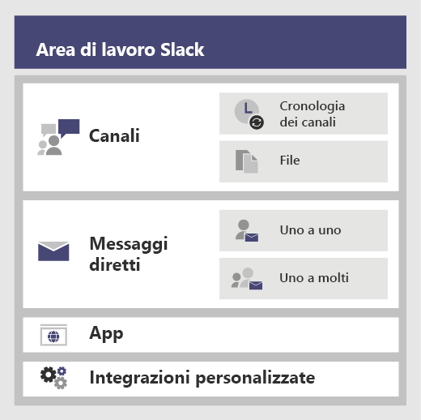
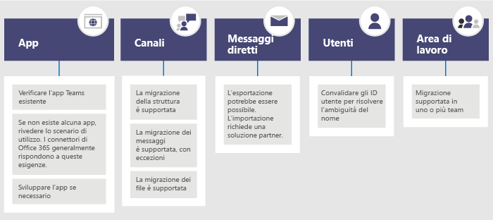

# <a name="migrate-from-slack-to-microsoft-teams"></a>Effettuare la migrazione da Slack a Microsoft Teams

Questo articolo illustra il passaggio da Slack a Microsoft Teams.

Quando si pianifica il passaggio dell'organizzazione da Slack a Teams, è importante stabilire cosa è necessario eventualmente mantenere. Verranno innanzitutto descritti i tipi di dati che possono essere migrati, quindi verrà illustrato come valutare le esigenze, pianificare il passaggio e infine eseguirlo.

Il diagramma di seguito riportato mostra l'architettura di Slack a un livello elevato.



## <a name="plan-your-migration-from-slack"></a>Pianificare la migrazione da Slack
### <a name="what-you-can-and-cant-migrate"></a>Cosa è possibile e cosa non è possibile migrare
Il piano di servizio di Slack determina cosa è possibile e cosa non è possibile migrare. Ad esempio, alcuni piani di servizio di Slack consentono di esportare solo la cronologia e i file dei canali pubblici, altri necessitano di una richiesta di DocuSign per includere canali privati e messaggi diretti. 

Per stabilire il livello di servizio dell'area di lavoro di Slack, accedere a Slack e prendere nota del tipo di piano riportato nella pagina **Informazioni sull'area di lavoro**.

Per altre informazioni sulle opzioni di esportazione di Slack, visitare il sito Web di Slack: https://get.slack.help/hc/articles/204897248-Guide-to-Slack-import-and-export-tools 

Il diagramma che segue offre una panoramica generale della migrazione di Slack illustrata in questo articolo. 



Al termine di questa sezione, il lettore sarà in grado di comprendere i seguenti concetti:
- Il livello di servizio delle aree di lavoro di Slack
- Cosa può e cosa non può essere esportato
- Approcci comuni all'esportazione

### <a name="assess-your-slack-workspaces"></a>Valutare le aree di lavoro di Slack
Per poter pianificare il piano di migrazione dell'organizzazione, è necessario raccogliere alcune informazioni sulle aree di lavoro di Slack. Comprendere come vengono utilizzate le aree di lavoro di Slack consente di determinare l'ambito della migrazione. Ad esempio, quante aree di lavoro verranno spostate? Le aree di lavoro vengono utilizzate da un reparto specifico, da molti reparti o da un'intera organizzazione?

Se si è membri delle aree di lavoro di Slack che si desidera migrare, è possibile analizzarne l'uso andando su *<your Slack workspace>.slack.com/stats*. Esaminare le schede Canali e Membri per cercare i modelli di utilizzo. Stabilire quali aree di lavoro si desidera migrare e quali si desidera lasciare. 

> [!NOTE]
> Solo gli amministratori o i proprietari dispongono dell'accesso alla pagina stats. 

### <a name="export-channels"></a>Esportare canali

Gli utenti di Slack entrano in un canale che fa parte di un'area di lavoro di Slack, mentre gli utenti di Teams entrano in un team che rappresenta una raccolta di canali. Si consiglia di utilizzare l'analisi di Slack per calcolare l'attività che avviene in ogni canale e stabilire quali canali spostare. L'elenco risultante potrà essere utilizzato per comprendere come raggruppare i canali di Slack in team di Teams, nonché per stabilire i membri di ciascun team.

Se si dispone di un piano di servizio di Slack a pagamento (qualsiasi piano diverso da Free), è possibile utilizzare l'analisi di Slack (<your Slack workspace>.slack.com/admin/stats#channels) per verificare quanto un canale è attivo, quando è stato utilizzato l'ultima volta e quante persone ne sono membri. In questo modo è possibile stabilire se migrare il canale o meno. Per impostazione predefinita, il contenuto pubblico di un canale (messaggi e file) può essere esportato. In base al piano di servizio di Slack e a seconda che siano stati richiesti o meno, canali privati e messaggi diretti di Slack possono essere esportati.

Per altre informazioni sulle opzioni di esportazione di Slack, visitare il sito Web di Slack: https://get.slack.help/hc/articles/204897248-Guide-to-Slack-import-and-export-tools 

> [!IMPORTANT]
> Controllare i requisiti di privacy e conformità dell'organizzazione per quanto riguarda i dati del canale. L'organizzazione potrebbe avere requisiti di conformità relativi alla gestione, all'archiviazione e all'elaborazione di tali dati, oltre a dover rispettare il ciclo di vita dei contenuti identificabili dell'utente finale (EUII).

### <a name="export-direct-messages"></a>Esportare messaggi diretti
I messaggi diretti corrispondono alle chat di Teams, vale a dire conversazioni uno-a-uno o uno-a-molti che non avvengono sul canale. La capacità di esportazione dipende dal piano di servizio di Slack e dal fatto che sia stato richiesto o meno che i messaggi diretti fossero inclusi nell'esportazione di Slack. Teams non supporta attualmente l'importazione di messaggi diretti. Rivolgersi a un partner Microsoft per conoscere le soluzioni di terze parti che possono essere esaminate per visualizzare il contenuto dei messaggi diretti in Teams.

Per esportare i messaggi diretti, controllare strumenti come Esporta nell'App Store di Slack.

### <a name="apps-and-custom-integrations"></a>App e integrazioni personalizzate

Le app in Slack sono come le app in Teams. Una volta ottenuto un elenco di app e delle relative configurazioni nell'area di lavoro, è possibile verificare nell'App Store di Teams se sono disponibili per Teams*. 

Accedere a <your Slack workspace>.slack.com/apps/manage per ottenere un elenco di app e integrazioni personalizzate. In questa pagina viene riportato anche il numero di configurazioni utilizzate da ciascuna app. Le integrazioni personalizzate variano in base alla capacità di migrazione. Se si tratta di un hook Web, in genere è possibile inviarlo a un connettore di Office 365 per spostare il flusso di lavoro in Teams. Valutare bot e altre app caso per caso, per pianificarne il passaggio a Teams.

\*Se l'amministratore ha limitato l'utilizzo delle app, è possibile che l'elenco completo delle app disponibili non sia visibile.

### <a name="users"></a>Utenti
Gli schemi di identità utilizzati in Slack potrebbero non essere direttamente corrispondenti a Office 365. Ad esempio, gli indirizzi e-mail degli utenti di Slack potrebbero non essere associati agli account aziendali o dell'istituto di istruzione di Office 365. Per iniziare a pianificare l'implementazione di Teams, è consigliabile creare una mappa di ID utente.

Se si dispone di un piano di servizio di Slack a pagamento, è possibile passare a *<your Slack workspace>.slack.com/admin/stats#members* per ottenere informazioni dettagliate sui membri, come l'indirizzo e-mail e il tipo di account per ogni utente, ad esempio guest singolo o multicanale.

Di seguito viene riportato uno script che è possibile utilizzare per confrontare gli indirizzi e-mail di un'esportazione di Slack con Azure AD per risolvere l'ambiguità del nome. Lo script indica anche se l'utente è abilitato per Teams. Se è necessaria assistenza con PowerShell, consultare [Introduzione ad Azure PowerShell](https://docs.microsoft.com/powershell/azure/get-started-azureps).

```azurepowershell
Connect-AzureAD
Function Get-TimeStamp {
    return "[{0:MM/dd/yy} {0:HH:mm:ss}]" -f (Get-Date)
}

class User {
    [ValidateNotNullOrEmpty()] $ID
    [ValidateNotNullOrEmpty()] $FullName
    [string] $Email
    [string] $UPN
    [ValidateNotNullOrEmpty()][bool] $ExistsAzureAD
    [ValidateNotNullOrEmpty()][bool] $TeamsEnabled
}

$output = New-Object -type System.Collections.ObjectModel.Collection["User"]

$users = Get-Content -Raw -Path .\slackHistory\users.json | ConvertFrom-Json

Write-Host -ForegroundColor Green "$(Get-Timestamp) User Count: " $users.Count

$i=1
Write-Host "$(Get-Timestamp) Attempting direct email match.. `n"
foreach ($slackUser in $users) {
    $user = New-Object User
    $user.id = $slackUser.id
    $user.FullName = $slackUser.name
    try {
        if ($null -ne $slackUser.profile.email) {
            $user.email = $slackUser.profile.email
            $emailSplit = $slackUser.profile.email.Split('@')
            $mailNickName = $emailSplit[0]
            $result = Get-AzureADUser -Filter "MailNickName eq '$($mailNickName)' or UserPrincipalName eq '$($slackUser.profile.email)' or proxyAddresses/any(c:c eq 'smtp:$($slackUser.profile.email)')"
            if ($null -ne $result) {
                $user.ExistsAzureAD = $true
                $user.UPN = $result.UserPrincipalName
                $assignedPlans = $result.assignedPlans
                foreach ($plan in $assignedPlans) {
                    if ($plan.ServicePlanId -eq "57ff2da0-773e-42df-b2af-ffb7a2317929") {
                        if ($plan.CapabilityStatus -eq "Enabled") {
                            $user.TeamsEnabled = $true
                        }
                        else {
                            $user.TeamsEnabled = $false
                        }
                    }
                }
                Write-Host -ForegroundColor Green "$(Get-Timestamp) Current User $($i) - AzureAD object found:" $result.MailNickName
                Write-Host -ForegroundColor Green "$(Get-Timestamp) Current User $($i) - Teams Enabled:" $user.TeamsEnabled
            }
            else {
                $user.ExistsAzureAD = $false
                Write-Host -ForegroundColor Yellow "$(Get-Timestamp) Current User $($i) - AzureAD object not found: " $slackUser.profile.email
            }
        }
        $i++
    }   
    catch
    {
        $user.ExistsAzureAD = $false
        Write-Host -ForegroundColor Yellow "$(Get-Timestamp) Current User $($i) - AzureAD object not found: $($i)" $user.profile.email
        $i++
    }
    $output.Add($user)
}

$output | Export-Csv -Path .\SlackToAzureADIdentityMapping.csv -NoTypeInformation
Write-Host "`n $(Get-Timestamp) Generated SlackToAzureADIdentityMapping.csv. Exiting..."
$output | Export-Csv -Path .\SlackToAzureADIdentityMapping.csv -NoTypeInformation
Write-Host "`n $(Get-Timestamp) Generated SlackToAzureADIdentityMapping.csv. Exiting..."
```

Al termine di questa sezione, il lettore avrà acquisito i seguenti elementi:
- Un elenco di canali per ciascuna area di lavoro con statistiche di utilizzo.
- Un elenco di app di Slack con configurazioni per ciascun canale.
- Avrà stabilito quale tipo di cronologia dei messaggi di Slack esportare (se disponibile).
- Un elenco di utenti i cui account Slack sono associati agli account aziendali o dell'istituto di formazione Microsoft e le licenze Teams di cui dispongono.

## <a name="plan-your-teams-deployment"></a>Pianificare la distribuzione di Teams
Gli elementi necessari di Slack sono stati esportati tralasciando tutto ciò di cui non si ha bisogno. Ora è il momento di pianificare come distribuire Teams e importare i dati di Slack. Si tratta di una grande opportunità per valutare gli elementi che hanno funzionato per il team in base all'utilizzo e includere tali elementi nel piano di distribuzione di Teams. Al termine di questa sezione, sarà disponibile un progetto per gli utenti, i canali e le app di Teams. 

Il diagramma di seguito riportato fornisce una panoramica di livello elevato delle questioni che verranno affrontate durante la distribuzione di Teams.

:::image type="content" source="media/migrate-slack-to-teams-image3.png" alt-text="Panoramica di livello elevato della pianificazione di una distribuzione di Teams da Slack.":::

### <a name="team-and-channel-structure"></a>Struttura del team e del canale

Un'area di lavoro di Slack potrebbe rappresentare un singolo team, più team o un'intera organizzazione. È importante comprendere l'ambito delle aree di lavoro nel momento in cui si determina la struttura. La relazione più stretta con un team di Teams in Slack è l'area di lavoro, che contiene una raccolta di canali. Il diagramma di seguito riportato mostra 3 diverse associazioni tra Slack e Teams e una guida per la scelta dell'associazione giusta per ogni area di lavoro.


|Associazione tra Slack e Teams |  |
|---------|---------|
|1 area di lavoro di Slack :arrow_right: 1 team   | Per aree di lavoro di Slack più piccole che richiedono un numero inferiore a 200 canali<br>Includere un buffer per la crescita e la pianificazione del canale privato  |
|1 area di lavoro di Slack :arrow_right: più team     | Utilizzare i dati di analisi dell'area di lavoro di Slack per creare raggruppamenti logici di canali, che diventano la base dei team        |
|Più di 2 aree di lavoro di Slack :arrow_right: più team     | Utilizzare i dati di analisi dell'area di lavoro di Slack per creare raggruppamenti logici di team e canali, che diventano la base dei team        |

Le soluzioni di terze parti includono statistiche di utilizzo che consentono di valutare l'attività del canale e il numero di post. In genere, i canali usati di frequente verranno inclusi nella pianificazione del team.

> [!TIP]
> Mantenere solo gli elementi necessari nell'approccio per determinare quali canali ricreare in Teams. Per ulteriori informazioni, consultare [Panoramica su team e canali](teams-channels-overview.md). 

#### <a name="team-planning"></a>Pianificazione di team
Utilizzando l'inventario dei canali compilato nella sezione Pianificazione illustrata in precedenza, collaborare con i proprietari e gli amministratori di Slack per individuare i canali che devono diventare team e i canali che devono diventare canali di un team. Utilizzare Excel o PowerBI per semplificare l'analisi; entrambe le applicazioni forniscono ulteriori informazioni su quali canali mantenere.

> [!TIP]
> Teams ha attualmente un limite di 200 canali per ciascun team. Se l'elenco di canali si avvicina a quel limite, è consigliabile suddividere i canali in due team diversi.

### <a name="channel-history"></a>Cronologia dei canali

Per mantenere la cronologia dei canali pubblici e privati, è possibile utilizzare sia soluzioni gratuite su GitHub che soluzioni a pagamento, a seconda delle esigenze dell'organizzazione.  Queste informazioni potrebbero essere riportate anche in Teams.

Una volta configurata la nuova struttura di team e canali in Teams, è possibile copiare i file esportati nelle librerie di documenti appropriate nei canali di Teams.

Per automatizzare l'importazione dei contenuti, è possibile prendere in considerazione diversi approcci. Sono disponibili soluzioni gratuite su GitHub ([ChannelSurf](https://github.com/tamhinsf/ChannelSurf) o [Slack Export Viewer](https://github.com/hfaran/slack-export-viewer)) e soluzioni partner. Scegliere una soluzione in base alle esigenze dell'organizzazione. 

### <a name="channel-files"></a>File di canale

La maggior parte delle soluzioni esportano i file. Tuttavia, sono in genere fornite nella cronologia dei canali come link che richiedono una chiave API per essere recuperati in modo programmatico.

Per quanto riguarda i file archiviati in Slack, dopo aver configurato i team e i canali in Teams, è possibile copiare tali file da Slack nel canale Teams di destinazione in modo programmatico.

Nello script che segue vengono recuperati file da Slack. Viene cercata nel computer l'esportazione di Slack specificata, viene creata una cartella in ogni canale di destinazione e vengono scaricati tutti i file nella posizione desiderata. Esistono soluzioni di terze parti in grado di estrarre i dati. Se è necessaria assistenza con PowerShell, consultare [Introduzione ad Azure PowerShell](https://docs.microsoft.com/powershell/azure/get-started-azureps).


```azurepowershell
$ExportPath = ".\slackHistory"
$ExportContents = Get-ChildItem -path $ExportPath -Recurse
Function Get-TimeStamp {
    return "[{0:MM/dd/yy} {0:HH:mm:ss}]" -f (Get-Date)
}

class File {
    [string] $Name
    [string] $Title
    [string] $Channel
    [string] $DownloadURL
    [string] $MimeType
    [double] $Size
    [string] $ParentPath
    [string] $Time
}

$channelList = Get-Content -Raw -Path .\slackHistory\channels.json | ConvertFrom-Json
$Files = New-Object -TypeName System.Collections.ObjectModel.Collection["File"]

Write-Host -ForegroundColor Green "$(Get-TimeStamp) Starting Step 1 (processing channel export for files) of 2. Total Channel Count: $($channelList.Count)"
#Iterate through each Channel listed in the Archive
foreach ($channel in $channelList) {
    #Iterate through Channel folders from the Export
    foreach ($folder in $ExportContents)
    {
        #If Channel Name matches..
        if ($channel.name -eq $folder){
            $channelJsons = Get-ChildItem -Path $folder.FullName -File
            Write-Host -ForegroundColor White "$(Get-TimeStamp) Info: Starting to process $($channelJsons.Count) days of content for #$($channel.name)."
            #Start processing the daily JSON for files
            foreach ($json in $channelJsons){
                $currentJson = Get-Content -Raw -Path $json.FullName | ConvertFrom-Json
                #Write-Host -ForegroundColor Yellow "$(Get-TimeStamp) Info: Processing $($json.Name) in #$($channel.name).."
                #Iterate through every action
                foreach ($entry in $currentJson){
                    #If the action contained file(s)..
                    if($null -ne $entry.files){
                        #Iterate through each file and add it to the List of Files to download
                        foreach ($item in $entry.Files) {
                        $file = New-Object -TypeName File
                            if ($null -ne $item.url_private_download){
                                $file.Name = $item.name
                                $file.Title = $item.Title
                                $file.Channel = $channel.name
                                $file.DownloadURL = $item.url_private_download
                                $file.MimeType = $item.mimetype
                                $file.Size = $item.size
                                $file.ParentPath = $folder.FullName
                                $file.Time = $item.created
                                $files.Add($file)
                            }
                        }
                    }
                }
            }
        }
    }
}
Write-Host -ForegroundColor Green "$(Get-TimeStamp) Step 1 of 2 complete. `n"

Write-Host -ForegroundColor Green "$(Get-TimeStamp) Starting step 2 (creating folders and downloading files) of 2."
#Determine which Files folders need to be created
$FoldersToMake = New-Object System.Collections.ObjectModel.Collection["string"]
foreach ($file in $files){
    if ($FoldersToMake -notcontains $file.Channel){
        $FoldersToMake.Add($file.Channel)
    }
}

#Create Folders
foreach ($folder in $FoldersToMake){
    #$fullFolderPath = $file.ParentPath + "\Files"
    $fullFolderPath = $ExportPath +"\$($folder)"
    $fullFilesPath = $ExportPath +"\$($folder)\Files"
    if (-not (Test-Path $fullFilesPath)){
        New-Item -Path $fullFolderPath  -Name "Files" -ItemType "directory"
    }
}

#Downloading Files
foreach ($file in $files)
{
    Write-Host -ForegroundColor Yellow "$(Get-TimeStamp) Downloading $($file.Name)."
    $fullFilePath = $file.ParentPath + "\Files\" + $file.Name
        if (-not (Test-Path $fullFilePath)){
            try{
                $request = (New-Object System.Net.WebClient).DownloadFile($file.DownloadURL, $fullFilePath)
            }
            catch [System.Net.WebException]{
                Write-Host -ForegroundColor Red "$(Get-TimeStamp) Error: Unable to download $($file.Name) to $($fullFilePath)"
            }   
        }
        else {
            try{
                $extensionPosition = $file.name.LastIndexOf('.')
                $splitFileName = $file.name.Substring(0,$extensionPosition)
                $splitFileExtention = $file.name.Substring($extensionPosition)
                $newFileName = $splitFileName + $file.Time + $splitFileExtention
                $fullFilePath = $file.ParentPath + "\Files\" + $newFileName
                $request = (New-Object System.Net.WebClient).DownloadFile($file.DownloadURL, $fullFilePath)
            }
            catch [System.Net.WebException]{
                Write-Host -ForegroundColor Red "$(Get-TimeStamp) Error: Unable to download $($file.Name) to $($fullFilePath)"
            }   
        }
}
Write-Host -ForegroundColor Green "$(Get-TimeStamp) Step 2 of 2 complete. `n"
Write-Host -ForegroundColor Green "$(Get-TimeStamp) Exiting.."
```


### <a name="apps-and-custom-integrations"></a>App e integrazioni personalizzate
Esaminare l'elenco delle app e delle integrazioni personalizzate di Slack con le relative configurazioni e stabilire quali spostare in Teams. Controllare il Marketplace di Teams per verificare se è disponibile un'app. In caso contrario, è probabile che esistano delle alternative. 

Per individuare le app da aggiungere a Teams, è importante sapere come viene utilizzata l'app. Ponendo la domanda "quale funzionalità fornisce l'app a questo canale?", si potrà conoscere il risultato dell'utilizzo dell'app. 

In molti casi, le app ricevono dati in base agli eventi da un servizio esterno, ad esempio un sistema di monitoraggio, e inseriscono un messaggio in Slack. È possibile ottenere lo stesso risultato utilizzando un connettore di Microsoft 365, che consente di inviare messaggi in Teams in base agli eventi.

Di seguito sono riportati alcuni esempi di soluzioni di Slack in cui è stato utilizzato un connettore di Office 365 in Teams per l'integrazione.
- Ansible
  - È possibile inviare avvisi a Teams tramite il [webhook di Ansible](https://docs.ansible.com/ansible-tower/latest/html/userguide/notifications.html#webhook)
- New Relic
  - Verificare questa soluzione utente per [l'invio di nuovi avvisi Relic a Teams](https://discuss.newrelic.com/t/new-relic-alerts-not-working-with-microsoft-teams/48609/3)
- Nagios
  - Oggi gli avvisi possono essere integrati tramite connettori. https://github.com/isaac-galvan/nagios-teams-notify
- ZenDesk
  - L'app è disponibile in Teams Store
- Jenkins
  - È possibile inviare avvisi a Teams utilizzando [Connettore di Office 365 di Jenkins](https://plugins.jenkins.io/Office-365-Connector)


### <a name="user-readiness-and-adoption-plan"></a>Piano di disponibilità e adozione dell'utente
L'elemento essenziale per l'esito positivo della distribuzione del software dipende da quanto gli utenti sono pronti al cambiamento. Gli utenti dell'organizzazione che utilizzano Slack potranno comprendere facilmente i concetti relativi a Teams, ma una formazione è comunque necessaria per facilitare la transizione. Per un set completo di risorse di adozione di Teams, passare [all'hub di adozione di Teams](adopt-microsoft-teams-landing-page.md).

Ad esempio, entrambi i prodotti dispongono di canali, ma vengono usati in modo diverso in ogni prodotto. Spesso un canale di Stack viene usato, ad esempio, come una chat in Teams per le conversazioni transazionali a breve termine. Altre importanti differenze sono relative alle conversazioni in thread e non in thread e alle impostazioni di notifica dell'ottimizzazione.

Controllare la libreria completa di [formazione per gli utenti finali di Teams.](enduser-training.md) 

## <a name="move-to-teams"></a>Passare a Teams 
Una volta definito il piano di transizione, è possibile iniziare a creare team e canali in Teams. 

Dopo aver creato team e canali, iniziare a copiare i file dai canali di Slack in Teams e a configurare le app. Se si utilizza una soluzione per conservare la cronologia, è possibile configurarla ora. Quindi, si è pronti a concedere licenze agli utenti (se non hanno già una licenza) e ad aggiungerli ai team appropriati. Per ridurre la necessità di ulteriori esportazioni e copie di file, è consigliabile rimuovere l'accesso di Slack in una data concordata che coincide con l'aggiunta di ciascun utente al team. In questo modo si evita di dover riesportare e importare le modifiche delta in file e cronologia.

Seguire i passaggi descritti nel diagramma seguente per distribuire Teams nell'organizzazione. Per altre informazioni, consultare [Come distribuire Teams](How-to-roll-out-teams.md).


:::image type="content" source="media/migrate-slack-to-teams-image4.png" alt-text="Diagramma che elenca le fasi del passaggio da Slack a Teams.":::
