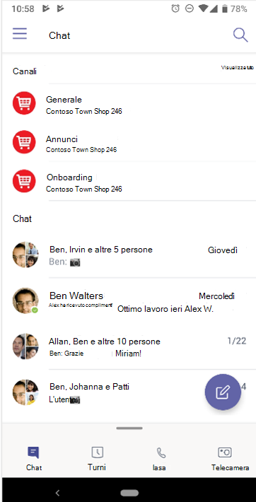

# Spostarsi Microsoft Teams

Ora che si comprende chiaramente il percorso e le esigenze specifiche dell'organizzazione, è il momento di iniziare a collaborare con Microsoft Teams. Usare la sezione seguente per informazioni su come esplorare le funzionalità di Kaizala complimentate all'interno di Teams.

| Da Kaizala | Per Teams |
|---------|-----------------------|
| Guida introduttiva: accesso e configurazione del profilo| [Introduzione a Teams](#getting-started) |
| Avvio di nuove chat, chiamate audio e video 1:1 | [Chat in Teams, chiamate audio e videochiamate](#starting-new-chats-11-audio-and-video-calls) |
| I gruppi di Kaizala| [Spostamento dei gruppi di Kaizala in Teams](#moving-your-kaizala-groups-to-microsoft-teams) |
| Imitare l'esperienza di messaggistica delle app consumer| [Imitare l'esperienza di messaggistica delle app consumer](#mimic-the-consumer-app-messaging-experience) |
| Schede azione fuori controllo |  [Lavorare in Teams](#getting-work-done-in-teams) |
| Sondaggi, sondaggi, elenchi di controllo| [Esecuzione di sondaggi, sondaggi, elenchi di controllo in Teams](#polls-surveys-and-checklists-in-teams) |
| Riunioni - Scheda azione| [Let's Meet - Riunioni in Teams](#getting-work-done-in-teams) |
| Annunci - Scheda azione| [Annunci in Teams](#announcements-in-teams) |
| Scheda azione check-in con foto| [Check-in con foto in Teams](#photo-check-ins)
| Quiz - Scheda azione| [Quiz in Teams](#quiz-in-teams)
| Formazione - Scheda azione| [Formazione in Teams](#training-in-teams) |
| Schede azioni personalizzate | [Soluzioni personalizzate in Teams](#moving-kaizala-custom-solutions-to-microsoft-teams) |
| portale di gestione Kaizala| [Per i professionisti IT](#it-professionals) |
| | [Per gli utenti finali](#end-user-guidance) |
| Kaizala gruppo di dissoluzione| [Kaizala gruppo di dissoluzione](#kaizala-group-dissolution) |
| esportazione di dati tenant Kaizala| [Esportare Kaizala dati del tenant](#export-kaizala-tenant-data)  |
| Collaborazione con utenti esterni (fornitori/partner)| [Aggiungere o invitare persone esterne all'organizzazione Teams a una chat](#collaborating-with-external-usersvendorssupplierspartners) |

## Introduzione

Iniziare a spostarsi da Kaizala a Teams è più facile che mai con la nostra guida introduttiva. Per altre informazioni sull'avvio del Microsoft Teams, vedere [Introduzione a Teams](https://support.microsoft.com/office/start-and-pin-chats-a864b052-5e4b-4ccf-b046-2e26f40e21b5?wt.mc_id=otc_microsoft_teams&ui=en-us&rs=en-us&ad=us).

## Avvio di nuove chat, chiamate audio e video 1:1

Creare chat 1:1 o di gruppo per collaborare con un gruppo più piccolo o per parlare in privato all'interno di Teams. Puoi aggiungere chat e salvare i messaggi per accedervi rapidamente. Per iniziare a chattare con la formattazione RTF, le emoji e le gif, vedi [Chat in Teams](https://support.microsoft.com/office/start-and-pin-chats-a864b052-5e4b-4ccf-b046-2e26f40e21b5?wt.mc_id=otc_microsoft_teams&ui=en-us&rs=en-us&ad=us).

Comunicare in modo efficiente avviando chiamate 1:1 o di gruppo con chiunque nell'organizzazione. Con Teams, hai la flessibilità di effettuare chiamate sia audio che video.  Per iniziare, vedi [Effettuare chiamate](https://www.microsoft.com/videoplayer/embed/RE4rxv0?pid=ocpVideo0-innerdiv-oneplayer&postJsllMsg=true&maskLevel=20&market=en-us).

È possibile passare da Kaizala gruppi a Microsoft Teams attraverso la creazione di Teams, canali e chat di gruppo in Teams.

Teams è una raccolta di persone, contenuti e strumenti che circondano diversi progetti e risultati all'interno di un'organizzazione.

Teams è costituito da **canali**, che sono le conversazioni specifiche per argomento che hai con i membri del team. Ogni canale è dedicato a un argomento, reparto o progetto specifico. I canali sono particolarmente utili se estesi con le applicazioni. Per altre informazioni, vedere [Lavorare nei canali](https://support.microsoft.com/office/teams-and-channels-df38ae23-8f85-46d3-b071-cb11b9de5499?ui=en-us&rs=en-us&ad=us#ID0EAABAAA=Work_in_channels).

**Le chat di gruppo** consentono di riunire rapidamente i colleghi per discutere rapidamente della messaggistica istantanea.

### Conversazioni in chat di Teams e canale del team

|Conversazioni in chat | Conversazioni nei canali del team |
|---------|---------|
|Per conversazioni leggere, in cui si stanno inviando messaggi diretti ai destinatari.   | Per le interazioni in cui vengono discussi più argomenti in uno spazio aperto.  |
|Le chat private sono visibili solo agli utenti della chat     | Visibile a tutti i membri del team        |
|Una conversazione continua e non in thread     | Conversazioni strutturate in più thread        |
|Fino a 250 persone     | Fino a 25.000 persone        |
|Scegli se vuoi condividere la cronologia chat con i nuovi partecipanti alla chat     | La cronologia viene condivisa con tutti i nuovi membri del team        |
|I nuovi destinatari della chat devono essere aggiunti da quelle persone già in chat     | Gli utenti possono unirsi a un team cercandolo. Nei Teams privati, Teams'amministratore approva i nuovi membri. I membri del canale possono generare codice per consentire ai nuovi membri di partecipare direttamente senza l'approvazione dell'amministratore.        |
|Condivisione dello schermo sul posto e chiamata audio e video. Facile pianificazione delle riunioni Teams con tutti i partecipanti alla chat     | Chiamate audio e video pianificate sul posto        |
|Estendibilità con le app     | Estendibilità completa e personalizzazione con le app        |

Per una panoramica su Teams, canali e chat di gruppo, vedere [team e canali in Microsoft Teams](teams-channels-overview.md).

## Spostamento dei gruppi di Kaizala in Microsoft Teams

In Kaizala, i gruppi sono una raccolta di persone. Esistono tre tipi di strutture di gruppi all'interno di Kaizala: gruppi flat, gruppi gerarchici e gruppi di trasmissione. Quando si passa a Microsoft Teams, è possibile usare Teams, canali e chat di gruppo per creare strutture di comunicazione simili per l'organizzazione.

Usare le indicazioni seguenti per istruzioni sul passaggio da Gruppi a Teams, Canali e chat di gruppo.

Esistono due modi per spostare i Kaizala gruppi piatti in Teams:

- Opzione 1: passaggio da un gruppo Kaizala piatto a una chat di gruppo in Teams

- Opzione 2: passare da un gruppo piatto Kaizala a un team Teams

**Opzione 1: passare da un gruppo Kaizala piatto a una chat di gruppo in Teams**

È possibile creare una Teams chat di gruppo per tenere conversazioni rapide e transitoria con un massimo di 250 partecipanti. Le chat di gruppo consentono agli utenti dell'organizzazione di avere una posizione centrale per le conversazioni aperte in cui chiunque può essere aggiunto alla chat.

1. Avviare e assegnare un nome a una chat di gruppo.

    

    Chiunque abbia accesso alla chat di gruppo può [inviare messaggi](https://support.microsoft.com/office/send-and-read-messages-in-teams-b29e60ec-76af-4d97-8c3c-a4e36f2b64aa?ui=en-us&rs=en-us&ad=us).

2. Aggiungere persone alla conversazione.

    
    
   Quando si aggiunge qualcuno a una chat di gruppo (non uno-a-uno), è possibile includere la **cronologia della chat** e **la durata della cronologia** che si vuole condividere con loro.

3. Gestire la chat di gruppo.
  
    
    
   Per vedere chi è in una chat di gruppo, passare il puntatore del mouse sul numero di partecipanti nell'intestazione della chat per visualizzare un elenco dei nomi di tutti.

**Opzione 2: passare da un gruppo piatto Kaizala a un team Teams**
   
Per le comunicazioni di gruppo di grandi dimensioni mirate, è possibile creare un team per un gruppo piatto. È possibile aggiungere fino a 25.000 membri per avviare comunicazioni strutturate con conversazioni in thread. Questo tipo di comunicazione consente di ruoli di moderazione e amministrazione per garantire il corretto funzionamento delle attività.

1. Creare un team: per essere subito operativi in Teams, è consigliabile creare un team, aggiungere persone e aggiungere canali. Per altre informazioni, vedere [i primi team](get-started-with-teams-create-your-first-teams-and-channels.md).
2. Rivedere la guida per i proprietari del team:

Il [proprietario del team](https://support.microsoft.com/office/go-to-guide-for-team-owners-92d238e6-0ae2-447e-af90-40b1052c4547?ui=en-us&rs=en-us&ad=us) può aggiungere nuovi membri e guest, cambiare i membri in proprietari, gestire canali e impostazioni e archiviare un team non più in uso.

3. Aggiungere membri in blocco a un team:

    Se sei proprietario del team, vai al nome del team nell'elenco dei team e seleziona il pulsante **Altre opzioni** > quindi **Aggiungi membro**.

    

    È possibile iniziare a digitare una lista di distribuzione, un gruppo di sicurezza o un gruppo di Microsoft 365 da aggiungere al team. Per altre informazioni, vedere [Aggiungere membri a un team in Teams](https://support.microsoft.com/office/add-members-to-a-team-in-teams-aff2249d-b456-4bc3-81e7-52327b6b38e9?ui=en-us&rs=en-us&ad=us).

### Simulare l'esperienza di messaggistica delle app consumer

Se si preferisce un'esperienza semplificata per gli utenti, è possibile scegliere di configurare l'esperienza Teams dell'organizzazione per simulare gli strumenti consumer già in uso.

Ti consigliamo di iniziare il percorso Teams per gli utenti Kaizala con **Mostra canali preferiti in Chat** abilitato per le comunicazioni semplificate e Turni (facoltativo).

Ecco un esempio dell'interfaccia del team con **Turni**:

Ecco un esempio di interfaccia di Team **senza Turni**:

 

> [!NOTE]
> È possibile rimuovere l'accesso al pulsante Teams per creare un'interfaccia semplificata per gli operatori in prima linea con solo canali evidenziati visualizzati sopra le chat. Per altre informazioni, vedere [Gestire i criteri di messaggistica in Teams](messaging-policies-in-teams.md).

### Usare Teams e canali per creare una struttura di gruppo gerarchica

In Kaizala, i gruppi gerarchici consentono all'organizzazione di interagire in strutture di gruppi diverse a seconda del tipo di comunicazione tra i membri.  In Teams è possibile creare Teams e canali corrispondenti all'organigramma e configurare le comunicazioni basate su gerarchie. È possibile usare una struttura gerarchica all'interno di Teams per avvisare i membri delle azioni necessarie, delle notizie importanti e degli aggiornamenti necessari.

Per altre informazioni, vedere [le procedure consigliate per l'organizzazione dei team in Microsoft Teams](best-practices-organizing.md).

### Usare Teams e canali per trasmettere notizie importanti

In un gruppo di Kaizala trasmissione, gli amministratori possono inviare messaggi e azioni a un gruppo di destinazione. Allo stesso modo, puoi pubblicare post su più canali per trasmettere un messaggio in Teams. Per indirizzare l'attenzione a un messaggio importante, creare post annunci.

La moderazione del canale consente di controllare chi può pubblicare e rispondere ai messaggi. I canali possono essere scelti tra i team affinché l'emittente raggiunga un pubblico più ampio. Puoi limitare le interazioni sugli annunci consentendo solo amministratori e moderatori selezionati con la possibilità di rispondere. Seguire questa procedura per stabilire la moderazione del canale all'interno di un canale Teams.

**Passaggio 1**: Configurare la moderazione del canale.

- Selezionare un canale per le trasmissioni

- Selezionare **Impostazioni canale** per configurare la moderazione

- Passa a "Who sono i moderatori?" per selezionare manualmente i moderatori per il canale

**Passaggio 2**: Formattare il messaggio.
Creare un annuncio per informare i membri del team di notizie o azioni importanti.

   

- Nel canale selezionare Formato sotto la casella in cui si digita il messaggio.

- Nella parte superiore della casella visualizzata selezionare la freccia accanto a Nuova conversazione > Annuncio.

- Digitare un titolo, modificarne il colore di sfondo o aggiungere un'immagine di sfondo per l'area del titolo.

- Digitare l'oggetto dell'annuncio nell'area Aggiungi un sottotitolo, quindi il corpo del messaggio e selezionare il pulsante Invia.

    

**Passaggio 3**: Selezionare i canali per la trasmissione di messaggi.

È possibile inserire post su più Teams e canali quando si hanno annunci e informazioni importanti che devono raggiungere grandi gruppi di persone.

  

Per altre informazioni, vedere [Pubblicare una conversazione tra canali in Teams](https://support.microsoft.com/office/cross-post-a-channel-conversation-in-teams-9c1252a3-67ef-498e-a7c1-dd7147b3d295?ui=en-us&rs=en-us&ad=us).

## Lavorare in Teams

Quando si tratta di portare a termine il lavoro, gli strumenti giusti possono consentire l'efficienza. In Kaizala, è possibile usare [le schede azione OOB (Out-of-box)](/kaizala/partnerdocs/kaizalaactioncards) per semplificare ed efficiente la gestione del lavoro quotidiano.
Microsoft Teams offre diverse funzionalità e soluzioni per le schede azione fuori controllo in Kaizala.

La piattaforma Teams consente di usare gli strumenti dell'organizzazione esistenti tramite l'integrazione in Microsoft Teams insieme ad applicazioni Microsoft 365 pronte per l'uso e app di terze parti. In Microsoft Teams sono attualmente disponibili oltre 800 applicazioni esterne.

### Sondaggi, sondaggi ed elenchi di controllo in Teams

[Sondaggi](https://github.com/OfficeDev/microsoft-teams-apps-poll/wiki), [sondaggi](https://github.com/OfficeDev/microsoft-teams-apps-survey) ed [elenchi di controllo](https://github.com/OfficeDev/microsoft-teams-app-checklist) sono ora disponibili come modelli di app per [l'estensione dei messaggi di Teams](/microsoftteams/platform/messaging-extensions/what-are-messaging-extensions) pronti per l'installazione in GitHub.

**Sondaggio** consente agli utenti di creare e inviare rapidamente sondaggi in una chat o in un canale per conoscere il parere del proprio team. L'app Sondaggio è supportata in tutte le piattaforme, Teams desktop, browser, iOS e client Android. È pronto per la distribuzione nell'ambito dell'abbonamento a Microsoft 365 esistente

**Sondaggio** consente agli utenti di creare un sondaggio in una chat o in un canale per porre una serie di domande e ottenere informazioni utili e fruibili. Usa sondaggio per: registrazioni, iscrizioni, feedback, testimonianze, acquisizione di lead, segnalazione, reclami e valutazioni. L'app Sondaggio è supportata in tutte le piattaforme: Teams desktop, browser, iOS e client Android. È pronto per la distribuzione nell'ambito dell'abbonamento a Microsoft 365 esistente.

**L'elenco di controllo** consente di collaborare con il team creando un elenco di controllo condiviso in una chat o in un canale. L'app Elenco di controllo è supportata in tutte le piattaforme, Teams desktop, browser, iOS e client Android. È pronto per la distribuzione nell'ambito dell'abbonamento a Microsoft 365 esistente.

È anche possibile inviare rapidamente sondaggi, sondaggi ed elenchi di controllo al team con app di Microsoft 365 e di terze parti esistenti.

[Microsoft Forms](https://techcommunity.microsoft.com/t5/microsoft-forms-blog/microsoft-forms-works-great-with-microsoft-teams/ba-p/109915) consente di raccogliere informazioni e prendere decisioni rapidamente. Grazie all'integrazione di Forms in Teams, è possibile configurare facilmente una scheda Forms, creare notifiche per il modulo e condurre un sondaggio rapido. Per scoprire come, vedere [Creare, modificare e rivedere moduli in Microsoft Teams](https://support.microsoft.com/office/work-with-colleagues-to-create-edit-and-review-forms-in-microsoft-teams-333b97a3-41d9-48bc-a1cb-84a96bd44e14#:~:text=1%20In%20Teams%2C%20go%20to%20the%20channel%20you,name%20for%20your%20new%20form.%20More%20items...%20).

Le app di terze parti come Polly e SurveyMonkey consentono di condurre ulteriormente sondaggi e sondaggi con il Teams.

- **Polly**  consente di ottenere informazioni dettagliate sui sondaggi in tempo reale per prendere decisioni aziendali più efficaci e misurare il coinvolgimento del team nei sondaggi tramite visualizzazioni dashboard complete.

- **SurveyMonkey** porta i sondaggi nelle aree in cui si stanno già svolgendo attività commerciali in Microsoft Teams, semplificando l'aggiunta di sondaggi al flusso di lavoro quotidiano. Scrivi e invia un breve sondaggio con una sola domanda dall'interno di Microsoft Teams, quindi osserva come arrivano i risultati dei membri del team.

### Posti di lavoro in Teams

Usare **[Microsoft Planner](https://support.microsoft.com/office/organize-your-team-s-tasks-in-microsoft-planner-c931a8a8-0cbb-4410-b66e-ae13233135fb?ui=en-us&rs=en-us&ad=us)** per eseguire processi in Teams. È possibile collaborare a un progetto con un team, visualizzare i report sullo stato di avanzamento e tenere traccia delle singole assegnazioni.

Durante l'uso di Microsoft Teams, è possibile organizzare le attività aggiungendo una o più schede di Planner a un canale del team. È quindi possibile lavorare al piano dall'interno di Teams o in Planner per il Web, rimuovere o eliminare il piano e ricevere una notifica in Teams quando viene assegnata un'attività in Planner.

### Annunci in Teams

Creare e inviare messaggi destinati a più team o a un numero elevato di dipendenti tramite chat con l'app [di comunicazione aziendale](/microsoftteams/platform/samples/app-templates#company-communicator) . La sua semplice interfaccia consente agli utenti designati di creare, visualizzare in anteprima, collaborare e inviare messaggi in modo mirato. Creare funzionalità di comunicazione mirate personalizzate, ad esempio dati personali personalizzati, sul numero di utenti che hanno riconosciuto o interagito con un messaggio con informazioni direttamente legate alle decisioni di gestione.

### Check-in con foto

Usare Teams Smart Fotocamera per acquisire e condividere un'immagine annotata con il team. Condividi facilmente la tua posizione con precisione per tenere informato il tuo team. È necessario avere altre informazioni per comunicare come vengono mappate le caratteristiche di Kaizala a Teams. Sicuramente avere il maggior numero di informazioni dalla presentazione come possiamo nel documento.

Usare il modello di app [Check-in](/microsoftteams/platform/samples/app-templates#staff-check-ins) per personale per consentire al personale in prima linea di fornire facilmente informazioni temporali critiche e aggiornamenti di stato su base pianificata o ad hoc direttamente da Teams. L'app supporta la posizione in tempo reale, foto, note, notifiche di promemoria e flussi di lavoro automatizzati.

### Quiz in Teams

Test è [un'estensione di messaggistica Teams](/microsoftteams/platform/messaging-extensions/what-are-messaging-extensions) personalizzata che consente di creare un test all'interno di una chat o di un canale per il controllo delle conoscenze e risultati istantanei. Puoi usare Quiz per gli esami in corso e offline, il controllo delle conoscenze all'interno del team e per quiz divertenti all'interno di un team. L'app Test è supportata su più piattaforme, ad esempio Teams desktop, browser, iOS e client Android. L'app è pronta per la distribuzione nell'ambito dell'abbonamento a Microsoft 365 esistente.

[Scaricalo su GitHub](https://github.com/OfficeDev/microsoft-teams-apps-quiz)

  

### Formazione in Teams

[Usa il](/microsoftteams/platform/samples/app-templates#staff-check-ins) modello di app Checkins del personale per consentire al personale in prima linea di fornire facilmente informazioni temporali critiche e aggiornamenti di stato su base pianificata o ad hoc direttamente da Teams. L'app supporta la posizione in tempo reale, foto, note, notifiche di promemoria e flussi di lavoro automatizzati.

Usare Teams per semplificare la formazione per l'organizzazione. Formazione è un'app di [estensione di messaggistica Teams](/microsoftteams/platform/what-are-messaging-extensions) personalizzata che consente agli utenti di pubblicare una formazione all'interno di una chat o di un canale per la condivisione offline delle conoscenze e l'upskilling. L'app è supportata in più client della piattaforma Teams, ad esempio desktop, browser, iOS e Android. L'app è pronta per la distribuzione nell'ambito dell'abbonamento a Microsoft 365.

[Scaricalo su GitHub](https://github.com/OfficeDev/microsoft-teams-apps-training)

Puoi semplificare l'onboarding offrendo l'accesso a informazioni contestuali.  Rendi le guide, la formazione e più facilmente disponibili e aggiornate per supportare l'organizzazione attraverso le competenze. Per altre informazioni sugli scenari di formazione, vedi [Aggiungere nuovi dipendenti](https://support.microsoft.com/office/effectively-onboard-new-employees-691faccd-1d1a-4f47-99ac-b6c82973f5ee).

## Spostamento di Kaizala soluzioni personalizzate in Microsoft Teams

Segui questo approccio in tre passaggi per ottenere le soluzioni per Microsoft Teams:

1. Considerare l'utilizzo e la frequenza delle soluzioni.

    L'elevato utilizzo e la frequenza delle soluzioni merita un caso più forte per lo sviluppo personalizzato.

2. Considerare la complessità delle soluzioni.

    Le soluzioni con una complessità maggiore possono giustificare un caso più forte per lo sviluppo personalizzato.

3. Esplora i seguenti approcci per frequenza di utilizzo e complessità.

    - Sfruttare le funzionalità di Microsoft Teams native

    - Usare [l'integrazione di app di terze parti ed esplorare l'App Store](deploy-apps-microsoft-teams-landing-page.md)

    - Individuare [i modelli di app](/microsoftteams/platform/samples/app-templates)

    - Creare [app personalizzate con la piattaforma Teams](/microsoftteams/platform/overview)

## Gestione in Microsoft Teams

### Professionisti IT

Eseguire la transizione amministrativa dal portale di gestione Kaizala al Centro Microsoft Teams Amministrazione. L'interfaccia di amministrazione di Teams serve principalmente per l'uso dei ruoli di amministratore.

Gli amministratori possono gestire l'intero carico di lavoro di Teams o avere autorizzazioni delegate per risolvere i problemi di qualità delle chiamate o gestire le esigenze di telefonia dell'organizzazione.

Per spostarsi nell'interfaccia di amministrazione, visitare [Microsoft Teams Amministrazione Center](https://admin.teams.microsoft.com/).

È possibile monitorare la sicurezza e la conformità dell'organizzazione in Microsoft 365 [con Portale di conformità di Microsoft Purview e](/microsoft-365/compliance/microsoft-365-compliance-center) [Centro sicurezza Microsoft](/microsoft-365/security/defender/overview-security-center).

Proteggere l'azienda e consentire agli utenti di usare [l'interfaccia di amministrazione di Azure Active Directory](https://aad.portal.azure.com/#@microsoft.onmicrosoft.com/dashboard/private/c7736064-7b28-4f3d-b366-2740a8d48020), in cui è possibile esaminare i gruppi, l'identità, le licenze e l'accesso in Microsoft 365.

## Portale di gestione Kaizala al Centro Teams Amministrazione

### Linee guida per l'utente finale

Usare la tabella seguente per spostarsi tra le funzionalità corrispondenti in Microsoft Teams dal portale di gestione di Kaizala.

| Portale di gestione Kaizala | App Microsoft Teams|
|---------|-----------------------|
| Creare gruppi (connessi all'organizzazione) | **Creare team** tramite l'app Desktop o per dispositivi mobili |
| Aggiunta di utenti in blocco | Per aggiungere utenti in blocco al team, è consigliabile creare un team tramite gruppi di Office 365, elenchi di distribuzione di Office 365 o gruppi di sicurezza |
| Directory | Cerca chiunque all'interno dell'organizzazione tramite la **barra di ricerca** nei team. I risultati della ricerca restituiscono anche file, messaggi e post |
| Analisi (schede azione) | **Sondaggi**, **sondaggi** ed **elenchi di controllo sono incorporati** nei report con dati scaricabili. I processi possono anche essere assegnati con l'aiuto dell'app Attività in Teams, disponibile per gli utenti. Per altri scenari, le app di terze parti come **Trello**, **Asana** possono anche essere esplorate per essere usate all'interno di Teams. |
| Estensioni - Connettori | Usare l'opzione **Connettori** del menu (...) per qualsiasi canale per cui è necessario il connettore. |
| [Report sull'adozione di analisi (utilizzo),](teams-analytics-and-reports/view-analytics.md) [report sull'utilizzo](teams-analytics-and-reports/teams-usage-report.md), [report attività](teams-analytics-and-reports/user-activity-report.md) | I proprietari dei team possono accedere ai report per i propri team dal menu (...) per **gestire** **Teamanalytics** > . |

> [!NOTE]
> Teams gli utenti finali possono usare Teams su desktop o dispositivi mobili per gestire i singoli team e canali e non dovranno accedere al centro Teams Amministrazione.

## Kaizala gruppo di dissoluzione

Quando si passa a canali e chat di Teams, è possibile prendere in considerazione Kaizala dissoluzione del gruppo per garantire che l'organizzazione abbia un unico posto centrale per la comunicazione. L'eliminazione di un gruppo di Kaizala rimuove il gruppo dall'elenco Chat. Se si è l'unico amministratore del gruppo, è necessario assegnare il ruolo di amministratore ad almeno una persona del gruppo prima di eliminarlo.

### Per spostare un gruppo di Kaizala in Teams

 1. Condividere il teaser Teams con Kaizala membri del gruppo

 2. Configurare Teams siti

 3. Aggiungere utenti a Teams

 4. Annunciare il passaggio a tutti i membri del gruppo Kaizala

 5. Nelle impostazioni [, impostare Kaizala gruppo](#to-switch-to-kaizala-group-to-read-only) su **Sola lettura**

 6. Condividere i motivi per cui Teams è un'opzione migliore con Kaizala membri del gruppo

 7. Condividere ad esempio le linee guida relative alla disponibilità di Teams e all'uso di Teams

 8. Avvia concorsi di coinvolgimento

 9. Partecipazione alla leadership dell'installazione

 10. Richiedere il feedback dei membri

 11. Seguire il calendario del contenuto

 12. [Eliminare Kaizala gruppo](#to-delete-a-group)

### Per passare a Kaizala gruppo in **sola lettura**

1. Accedere al portale di gestione di Kaizala.

2. Selezionare la scheda **Gruppi** nel riquadro di spostamento sinistro, quindi selezionare il gruppo da impostare come **Di sola lettura**.

    

3. Nell'elenco a discesa selezionare **Modifica criteri**.
  
    

4. Nella **finestra Criteri di gruppo** deselezionare le opzioni seguenti:

     - Consentire ai nuovi partecipanti di visualizzare la cronologia chat. I messaggi inviati d'ora in avanti saranno visibili agli utenti.

     - Consentire ai membri di inviare messaggi e allegati.

       

     > [!NOTE]
     > Gli amministratori possono ancora inserire post nel gruppo.

### Per eliminare un gruppo

1. Nell'elenco Chat, tieni premuta la conversazione di gruppo.

2. Toccare Elimina gruppo.

## Esportare Kaizala dati del tenant

Gli amministratori Kaizala tenant o globali possono esportare Kaizala dati del tenant dal portale di gestione Kaizala. Durante l'uso di Teams, è comunque possibile mantenere il controllo dei dati aziendali in Kaizala. Per altre informazioni, vedere [Esportare i dati del tenant dal portale di gestione](/office365/kaizala/export-or-delete-your-data).

### Per esportare i dati

 1. Selezionare **la scheda Analisi** nel riquadro di spostamento sinistro e scegliere **Esporta dati tenant**.
  
    

 2. Selezionare **Esporta**.

    

 3. Usare il file dei messaggi tenant- con filtri sul nome/timestamp del gruppo per accedere ai dati della chat a livello di gruppo.

    

## Eliminazione di un gruppo di Kaizala

L'eliminazione di un gruppo di Kaizala rimuove il gruppo dall'elenco Chat. Se si è l'unico amministratore del gruppo, è necessario assegnare il ruolo di amministratore ad almeno una persona del gruppo prima di eliminarlo.

Per eliminare un gruppo:

- Nell'elenco Chat, tieni premuta la conversazione di gruppo.

- Toccare Elimina gruppo.

## esportazione di dati tenant Kaizala

Durante l'uso di Teams, è comunque possibile mantenere il controllo dei dati aziendali in Kaizala. Per altre informazioni, vedere [Esportare i dati del tenant dal portale di gestione](/office365/kaizala/export-or-delete-your-data).

## Collaborazione con utenti esterni (fornitori/partner)

Microsoft Teams offre soluzioni sicure per la collaborazione con parti esterne e con Microsoft Teams Connect è ancora più facile lavorare con chiunque all'esterno dell'organizzazione. Teams consente agli utenti commerciali di chattare con utenti commerciali esterni, ovvero con utenti commerciali di altre organizzazioni. Sulla base di questo privilegio, ti stiamo consentendo di chattare con i membri del team all'esterno dell'organizzazione, anche se usano un Teams account personale. Questi account vengono utilizzati spesso da SMB e quindi questa nuova funzionalità consente di rafforzare la relazione con i partner esterni.

Come annunciato in precedenza in [Ignite](https://techcommunity.microsoft.com/t5/microsoft-teams-blog/microsoft-ignite-fall-2021-innovations-coming-to-microsoft-teams/ba-p/2824127), puoi invitare qualsiasi utente Teams chattando l'indirizzo e-mail completo o il numero di telefono che vuoi raggiungere e avviando una chat uno-a-uno o di gruppo con chiunque abbia un account Microsoft personale, senza cambio di tenant richiesto.

Chattare con utenti esterni senza dover cambiare tenant consente di ottenere i risultati desiderati più velocemente. Diamo un'occhiata più da vicino su come funziona.

A seconda delle impostazioni amministrative dell'organizzazione e dell'utente dell'account personale Teams, è possibile avviare conversazioni con utenti esterni Teams personali e utenti esterni Teams account personale possono avviare conversazioni con Teams utenti in ufficio.

Teams gli utenti gestiti da un'organizzazione possono invitare Teams utenti dell'account personale con cui vogliono chattare immettendo l'indirizzo e-mail o il numero di telefono completo. Teams gli utenti personali possono immettere l'indirizzo e-mail dell'organizzazione esatto dell'utente che vogliono raggiungere e tentare di avviare una chat.

Se le persone con cui si vuole chattare non sono già Teams utenti, riceveranno un messaggio di posta elettronica o un SMS che li invita a partecipare alla conversazione con un account personale. Quando si registra e accede al proprio account Teams personale, potrà partecipare alla chat.

Dopo che le persone invitate avranno accettato l'invito, è possibile avviare una nuova chat tra due persone o di gruppo oppure aggiungerle a una chat di gruppo esterna esistente. Questo thread di chat verrà visualizzato insieme alle altre chat, senza che sia necessario cambiare tenant per visualizzare la chat.

Nell'ambito della chat, è possibile esprimere se stessi inviando e ricevendo rich messaggi, GIF ed elementi multimediali.

È possibile scegliere di rimanere solo nelle conversazioni a cui si vuole partecipare. È possibile bloccare i messaggi provenienti da utenti esterni o uscire da una chat di gruppo.

Teams gli utenti gestiti da un'organizzazione e Teams account personale hanno la possibilità di rifiutare un invito esterno. È possibile inviare messaggi a un utente esterno fino a 10 volte prima che accettino, ma se dopo 10 messaggi non viene accettata alcuna accettazione, non sarà possibile inviare altri messaggi a questo utente.

Visualizzare la [pagina del supporto](https://support.microsoft.com/en-us/office/add-or-invite-people-outside-your-teams-org-to-a-chat-6897ab47-9f60-4db6-8b95-18599714fe57) e leggere il [blog](https://techcommunity.microsoft.com/t5/microsoft-teams-blog/microsoft-teams-users-can-now-chat-with-any-teams-user-outside/ba-p/3070832) per altre informazioni su come Teams consente di collaborare facilmente con clienti e partner esterni nell'ambito della sicurezza e della sicurezza dell'area di lavoro di Teams attendibile.

## Passaggi successivi

[Microsoft Teams per gli operatori in prima linea](/MicrosoftTeams/drive-adoption-optimize-kaizala)
