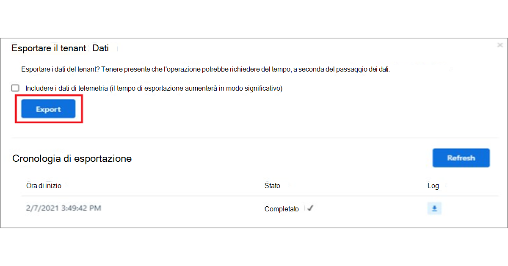

# Spostarsi Microsoft Teams

Ora che si ha una chiara comprensione del percorso e delle esigenze specifiche dell'organizzazione, è il momento di iniziare il viaggio verso una collaborazione efficace con Microsoft Teams. Usare la sezione seguente per informazioni su come esplorare le funzionalità di Kaziala in Teams.

| Da Kaizala | Per Teams |
|---------|-----------------------|
| Guida introduttiva: accesso e configurazione del profilo| [Introduzione a Teams](#getting-started) |
| Avvio di nuove chat, chiamate audio e videochiamate 1:1 | [Chat in Teams, chiamate audio e videochiamate](#starting-new-chats-11-audio-and-video-calls) |
| Gruppi Kaizala utenti| [Spostare i Kaizala di lavoro in Teams](#moving-your-kaizala-groups-to-microsoft-teams) |
| Simulare l'esperienza di messaggistica per le app consumer| [Simulare l'esperienza di messaggistica per le app consumer](#mimic-the-consumer-app-messaging-experience) |
| Schede azioni fuori campo |  [Lavorare in Teams](#getting-work-done-in-teams) |
| Sondaggi, sondaggi, elenchi di controllo| [Esecuzione di sondaggi, sondaggi, elenchi di controllo in Teams](#polls-surveys-and-checklists-in-teams) |
| Riunioni - Scheda azione| [Riunioni in Teams](#getting-work-done-in-teams) |
| Annunci - Scheda azione| [Annunci in Teams](#announcements-in-teams) |
| Scheda azione Archivia foto| [Archiviazioni di foto in Teams](#photo-check-ins)
| Quiz - Scheda azione| [Test in Teams](#quiz-in-teams)
| Formazione - Scheda azione| [Formazione in Teams](#training-in-teams) |
| Schede Azioni personalizzate | [Soluzioni personalizzate in Teams](#moving-kaizala-custom-solutions-to-microsoft-teams) |
| portale di Kaizala Management| [Per i professionisti IT](#it-professionals) |
| | [Per gli utenti finali](#end-user-guidance) |
| Kaizala dissoluzione del gruppo| [Kaizala di gruppo](#kaizala-group-dissolution) |
| Kaizala di dati tenant| [Esportare Kaizala tenant](#export-kaizala-tenant-data)  |
| Collaborazione con utenti esterni (fornitori/fornitori/partner)| [Uso Teams per lavoro e Teams per l'interoperabilità per uso personale](#collaborating-with-external-usersvendorssupplierspartners) |

## Guida introduttiva

Iniziare a spostarsi da Kaizala a Teams è più facile che mai con la nostra guida introduttiva. Per altre informazioni sull'avvio del Microsoft Teams, vedere Guida [introduttiva Teams](https://support.microsoft.com/office/start-and-pin-chats-a864b052-5e4b-4ccf-b046-2e26f40e21b5?wt.mc_id=otc_microsoft_teams&ui=en-us&rs=en-us&ad=us).

## Avvio di nuove chat, chiamate audio e videochiamate 1:1

Crea chat 1:1 o di gruppo per collaborare con un gruppo più piccolo o per parlare privatamente all'interno Teams. È possibile aggiungere chat e salvare messaggi per un accesso rapido. Per iniziare a chattare con la formattazione RTF, le emoji e le gif, vedi [Chat in Teams](https://support.microsoft.com/office/start-and-pin-chats-a864b052-5e4b-4ccf-b046-2e26f40e21b5?wt.mc_id=otc_microsoft_teams&ui=en-us&rs=en-us&ad=us).

Comunicare in modo efficiente avviando chiamate 1:1 o di gruppo con chiunque nell'organizzazione. Con Teams, si ha la flessibilità necessaria per effettuare chiamate sia audio che videochiamate.  Per iniziare, vedere [Effettuare chiamate](https://www.microsoft.com/videoplayer/embed/RE4rxv0?pid=ocpVideo0-innerdiv-oneplayer&postJsllMsg=true&maskLevel=20&market=en-us).

È possibile passare da Kaizala gruppi a Microsoft Teams tramite la creazione di Teams, canali e chat di gruppo in Teams.

Teams è una raccolta di persone, contenuti e strumenti che circondano progetti e risultati diversi all'interno di un'organizzazione.

Teams è costituito da **canali**, che sono le conversazioni specifiche per l'argomento che si hanno con i membri del team. Ogni canale è dedicato a un argomento, un reparto o un progetto specifico. I canali sono particolarmente utili se estesi con le applicazioni. Per altre informazioni, vedi [Lavorare nei canali](https://support.microsoft.com/office/teams-and-channels-df38ae23-8f85-46d3-b071-cb11b9de5499?ui=en-us&rs=en-us&ad=us#ID0EAABAAA=Work_in_channels).

**Le chat di gruppo** consentono di riunire rapidamente i colleghi sulla messaggistica istantanea.

### Conversazioni in Teams Chat vs Canale del team

|Conversazioni in chat | Conversazioni nei canali del team |
|---------|---------|
|Per conversazioni leggere, in cui si stanno messaggizzando direttamente i destinatari.   | Per le interazioni in cui vengono discussi più argomenti in uno spazio aperto.  |
|Le chat private sono visibili solo agli utenti della chat     | Visibile a tutti i membri del team        |
|Una conversazione continua senza thread     | Conversazioni strutturate e in thread multipli        |
|Fino a 250 persone     | Fino a 25.000 persone        |
|Scegliere se si vuole condividere la cronologia della chat con i nuovi partecipanti alla chat     | La cronologia viene condivisa con tutti i nuovi membri del team        |
|I nuovi destinatari della chat devono essere aggiunti da quelle persone già in chat     | Gli utenti possono unirsi a un team cercandolo. In un Teams privato, Teams l'amministratore approva i nuovi membri. I membri del canale possono generare codice per consentire ai nuovi membri di partecipare direttamente senza l'approvazione dell'amministratore.        |
|Condividi sullo schermo spot e chiamate audio e videochiamate. Pianificazione semplice delle riunioni Teams con tutti i partecipanti alla chat     | Sul posto e chiamate audio e video pianificate        |
|Alcune estendibilità con le app     | Estendibilità e personalizzazione completa con le app        |

Per una panoramica su Teams, canali e chat di gruppo, vedi team e canali [in Microsoft Teams](teams-channels-overview.md).

## Spostare i Kaizala di lavoro in Microsoft Teams

In Kaizala, i gruppi sono una raccolta di persone. Esistono tre tipi di strutture di gruppo all'interno Kaizala, ad esempio gruppi flat, gruppi gerarchici e gruppi di trasmissione. Durante la transizione a Microsoft Teams, è possibile usare Teams, canali e chat di gruppo per creare strutture di comunicazione simili per l'organizzazione.

Usare le istruzioni seguenti per istruzioni su come passare da Gruppi a Teams, Canali e chat di gruppo.

Esistono due modi per spostare i gruppi Kaizala in Teams:

- Opzione 1: Passare da un gruppo Kaizala a una chat di gruppo in Teams

- Opzione 2: Passare da un gruppo Kaizala piano a un team Teams team

**Opzione 1: Passare da un gruppo Kaizala a una chat di gruppo in Teams**

Puoi creare una chat Teams di gruppo per tenere conversazioni rapide e temporanee con un massimo di 250 partecipanti. Le chat di gruppo consentono alle persone dell'organizzazione di avere una posizione centrale per la conversazione aperta in cui chiunque può essere aggiunto alla chat.

1. Avviare e assegnare un nome a una chat di gruppo.

    

    Chiunque abbia accesso alla chat di gruppo può [inviare messaggi](https://support.microsoft.com/office/send-and-read-messages-in-teams-b29e60ec-76af-4d97-8c3c-a4e36f2b64aa?ui=en-us&rs=en-us&ad=us).

2. Aggiungere persone alla conversazione.

    
    
   Quando aggiungi qualcuno a una chat di gruppo (non uno-a-uno), puoi includere la cronologia **della chat** e  la durata della cronologia che vuoi condividere con loro.

3. Gestire la chat di gruppo.
  
    
    
   Per vedere chi è in una chat di gruppo, passa il puntatore del mouse sul numero di partecipanti nell'intestazione della chat per visualizzare un elenco dei nomi di tutti.

**Opzione 2: Passare da un gruppo Kaizala piano a un team Teams team**
   
Per le comunicazioni mirate di gruppo di grandi dimensioni, è possibile creare un team per un gruppo semplice. È possibile aggiungere fino a 25.000 membri per comunicare in modo strutturato con le conversazioni in thread. Questo tipo di comunicazione consente la moderazione e i ruoli di amministrazione per garantire che le operazioni funzionino senza problemi.

1. Creare un team: per iniziare a Teams, è consigliabile creare un team, aggiungere persone e aggiungere canali. Per altre informazioni, vedere [i primi team](get-started-with-teams-create-your-first-teams-and-channels.md).
2. Leggere la guida per i proprietari del team:

Il proprietario [del team](https://support.microsoft.com/office/go-to-guide-for-team-owners-92d238e6-0ae2-447e-af90-40b1052c4547?ui=en-us&rs=en-us&ad=us) può aggiungere nuovi membri e guest, cambiare i membri in proprietari, gestire canali e impostazioni e archiviare un team che non è più in uso.

3. Aggiungere membri in blocco a un team:

    Se si è proprietari di un team, passare al nome del team nell'elenco dei team e selezionare  il pulsante Altre opzioni > aggiungi **membro**.

    

    È possibile iniziare a digitare una lista di distribuzione, un gruppo di sicurezza o Microsoft 365 gruppo da aggiungere al team. Per altre informazioni, vedere [Aggiungere membri a un team in Teams](https://support.microsoft.com/office/add-members-to-a-team-in-teams-aff2249d-b456-4bc3-81e7-52327b6b38e9?ui=en-us&rs=en-us&ad=us).

### Simulare l'esperienza di messaggistica per le app consumer

Se si preferisce un'esperienza semplificata per gli utenti, è possibile scegliere di configurare l'esperienza di Teams dell'organizzazione per simulare gli strumenti di consumo già in uso.

È consigliabile iniziare il percorso Teams per gli utenti Kaizala con l'opzione Mostra canali preferiti **in Chat** abilitata per le comunicazioni semplificate e i turni (facoltativo).

Ecco un esempio dell'interfaccia del team con **Turni**:

Ecco un esempio dell'interfaccia del team **senza turni**:

 

> [!NOTE]
> È possibile rimuovere l'accesso al pulsante Teams per creare un'interfaccia semplificata per i lavoratori frontline con solo i canali evidenziati visualizzati sopra le chat. Per altre informazioni, vedere [Gestire i criteri di messaggistica in Teams](messaging-policies-in-teams.md).

### Usare Teams canali per creare una struttura gerarchica di gruppi

In Kaizala, i gruppi gerarchici consentono all'organizzazione di interagire in strutture di gruppo diverse a seconda del tipo di comunicazione tra i membri.  In Teams, è possibile creare Teams canali in modo che corrispondano all'organigramma e configurare la comunicazione basata sulla gerarchia. È possibile usare una struttura gerarchica all'interno Teams per avvisare i membri delle azioni necessarie, delle notizie importanti e degli aggiornamenti.

Per altre informazioni, vedere le [procedure consigliate per l'organizzazione dei team in Microsoft Teams](best-practices-organizing.md).

### Usare Teams canali per trasmettere notizie importanti

In un gruppo Kaizala broadcast, gli amministratori possono inviare messaggi e azioni a un gruppo mirato. Allo stesso modo, è possibile pubblicare post su più canali per trasmettere un messaggio in Teams. Per attirare l'attenzione su un messaggio importante, creare post annunci.

La moderazione dei canali consente di controllare chi può pubblicare e rispondere ai messaggi. I canali possono essere scelti tra i team in modo che l'emittente raggiunga un pubblico più ampio. È possibile limitare le interazioni sugli annunci solo per consentire ad amministratori e moderatori selezionati di rispondere. Seguire questa procedura per stabilire la moderazione dei canali all'interno di un Teams canale.

**Passaggio 1**: Configurare la moderazione dei canali.

- Selezionare un canale per le trasmissioni

- Selezionare **Impostazioni canale per** configurare la moderazione

- Passare a "Who sono i moderatori?" per selezionare manualmente i moderatori per il canale

**Passaggio 2**: Formattare il messaggio.
Creare un annuncio per informare i membri del team di notizie o azioni importanti.

   

- Nel canale selezionare Formato sotto la casella in cui si digita il messaggio.

- Nella parte superiore della casella visualizzata selezionare la freccia accanto a Nuova conversazione > Annuncio.

- Digitare un titolo, modificarne il colore di sfondo o aggiungere un'immagine di sfondo per l'area del titolo.

- Digitare l'oggetto dell'annuncio nell'area Aggiungi un sottotitolo, quindi il corpo del messaggio e selezionare il pulsante Invia.
    

**Passaggio 3**: Selezionare i canali per la trasmissione dei messaggi.

È possibile eseguire il cross-post tra più Teams e canali quando si hanno annunci e informazioni importanti che devono raggiungere grandi gruppi di persone.

  

Per altre informazioni, vedere [Inserire una conversazione tra canali in Teams](https://support.microsoft.com/office/cross-post-a-channel-conversation-in-teams-9c1252a3-67ef-498e-a7c1-dd7147b3d295?ui=en-us&rs=en-us&ad=us).

## Lavorare in Teams

Quando si tratta di lavorare, gli strumenti necessari possono consentire l'efficienza. In Kaizala, è possibile usare le schede azione [Out-of-box (OOB)](/kaizala/partnerdocs/kaizalaactioncards) per semplificare ed efficiente la gestione del lavoro quotidiano.
Microsoft Teams offre diverse funzionalità e soluzioni per le schede Azione predefinita in Kaizala.

La Teams consente di usare gli strumenti dell'organizzazione esistenti tramite l'integrazione in Microsoft Teams insieme ad applicazioni Microsoft 365 e app di terze parti pronte per l'uso. Sono disponibili più di 300 applicazioni esterne in Microsoft Teams.

### Sondaggi, sondaggi ed elenchi di controllo in Teams

[I sondaggi](https://github.com/OfficeDev/microsoft-teams-apps-poll/wiki), [i sondaggi e](https://github.com/OfficeDev/microsoft-teams-apps-survey) le  schede azioni dell'elenco di controllo sono ora disponibili come modelli [di app di](/microsoftteams/platform/messaging-extensions/what-are-messaging-extensions) estensione dei messaggi Teams pronti per l'installazione in GitHub.

**Il** sondaggio consente agli utenti di creare e inviare rapidamente sondaggi in una chat o in un canale per conoscere l'opinione del team. L'app Sondaggio è supportata in tutte le piattaforme, Teams client desktop, browser, iOS e Android. È pronto per la distribuzione come parte dell'abbonamento Microsoft 365 esistente

**Sondaggio** consente agli utenti di creare un sondaggio in una chat o in un canale per porre una serie di domande e ottenere informazioni utili. Usare Sondaggio per: registrazioni, iscrizioni, feedback, testimonianze, acquisizione di clienti potenziale, segnalazione, reclami e valutazioni. L'app Sondaggio è supportata in tutte le piattaforme, Teams client desktop, browser, iOS e Android. È pronto per la distribuzione come parte dell'abbonamento Microsoft 365 esistente.

**Elenco** di controllo consente di collaborare con il team creando un elenco di controllo condiviso in una chat o in un canale. L'app Elenco di controllo è supportata in tutte le piattaforme, Teams client desktop, browser, iOS e Android. È pronto per la distribuzione come parte dell'abbonamento Microsoft 365 esistente.

È anche possibile inviare sondaggi rapidi, sondaggi ed elenchi di controllo al team immediatamente con le app Microsoft 365 e di terze parti.

[Microsoft Forms](https://techcommunity.microsoft.com/t5/microsoft-forms-blog/microsoft-forms-works-great-with-microsoft-teams/ba-p/109915) consente di raccogliere informazioni e prendere decisioni in modo rapido. Con Forms integrato in Teams, è possibile configurare facilmente una scheda Moduli, creare notifiche per il modulo ed eseguire un sondaggio rapido. Per informazioni su come fare, vedere [Creare, modificare e rivedere moduli in Microsoft Teams](https://support.microsoft.com/office/work-with-colleagues-to-create-edit-and-review-forms-in-microsoft-teams-333b97a3-41d9-48bc-a1cb-84a96bd44e14#:~:text=1%20In%20Teams%2C%20go%20to%20the%20channel%20you,name%20for%20your%20new%20form.%20More%20items...%20).

Le app di terze parti come Polly e SurveyMonkey consentono di condurre ulteriormente sondaggi e sondaggi con i Teams.

- **Polly consente**  di ottenere informazioni approfondite in tempo reale sui sondaggi per prendere decisioni aziendali migliori e misurare l'impegno del team nei vari sondaggi tramite visualizzazioni complete del dashboard.

- **SurveyMonkey porta** i sondaggi nella posizione in cui si sta già facendo attività Microsoft Teams, semplificando l'aggiunta di sondaggi al flusso di lavoro quotidiano. Scrivi e invia un rapido sondaggio di una domanda dall'interno Microsoft Teams, quindi guarda come arrivano i risultati dai tuoi membri del team.

### Processi in Teams

Usare **[Microsoft Planner](https://support.microsoft.com/office/organize-your-team-s-tasks-in-microsoft-planner-c931a8a8-0cbb-4410-b66e-ae13233135fb?ui=en-us&rs=en-us&ad=us)** per eseguire processi in Teams. È possibile collaborare a un progetto con un team, visualizzare le relazioni sullo stato di avanzamento e tenere traccia delle singole assegnazioni.

Durante l'Microsoft Teams, è possibile organizzare le attività aggiungendo una o più schede di Planner a un canale del team. È quindi possibile lavorare al piano dall'interno di Teams o in Planner per il Web, rimuovere o eliminare il piano e ricevere una notifica in Teams quando viene assegnata un'attività in Planner.

### Annunci in Teams

Creare e inviare messaggi destinati a più team o a un numero elevato di dipendenti tramite chat con l'app [communicator aziendale](/microsoftteams/platform/samples/app-templates#company-communicator) . La sua interfaccia semplice consente agli utenti designati di creare, visualizzare in anteprima, collaborare e inviare messaggi in modo mirato. Creare funzionalità di comunicazione mirate personalizzate, ad esempio i dati personali personalizzati, in base al numero di utenti che hanno riconosciuto o interagito con un messaggio con informazioni direttamente collegate alle decisioni di gestione.

### Archiviazioni foto

Usare la Teams fotocamera intelligente per acquisire e condividere un'immagine con annotazioni con il team. Condividi facilmente la tua posizione con precisione per tenere il tuo team al corrente. È necessario avere altre informazioni per comunicare come vengono mappate Kaizala caratteristiche di Teams. Sicuramente abbiamo il maggior numero di informazioni dalla presentazione che possiamo nel documento.

[Usare il modello di](/microsoftteams/platform/samples/app-templates#staff-check-ins) app Archiviazioni del personale per consentire al personale in prima linea di fornire facilmente informazioni e aggiornamenti di stato critici in base a tempi pianificati o ad hoc direttamente da Teams. L'app supporta la posizione in tempo reale, le foto, le note, le notifiche dei promemoria e i flussi di lavoro automatizzati.

### Test in Teams

Test è [un'estensione Teams](/microsoftteams/platform/messaging-extensions/what-are-messaging-extensions) messaggistica personalizzata che consente di creare un test all'interno di una chat o di un canale per il controllo delle conoscenze e i risultati istantanei. È possibile usare Test per esami in classe e offline, controllo delle conoscenze all'interno del team e test divertenti all'interno di un team. L'app Test è supportata su più piattaforme, ad esempio Teams client desktop, browser, iOS e Android. Questa app è pronta per la distribuzione nell'ambito dell'abbonamento Microsoft 365 esistente.

[Scaricalo su GitHub](https://github.com/OfficeDev/microsoft-teams-apps-quiz)

  

### Formazione in Teams

[Usare il modello di](/microsoftteams/platform/samples/app-templates#staff-check-ins) app Verifica personale per consentire al personale in prima linea di fornire facilmente informazioni e aggiornamenti di stato critici per il tempo, sia pianificati che ad hoc, direttamente da Teams. L'app supporta la posizione in tempo reale, le foto, le note, le notifiche dei promemoria e i flussi di lavoro automatizzati.

Usare Teams per semplificare la formazione per l'organizzazione. Formazione è un'app [di Teams](/microsoftteams/platform/what-are-messaging-extensions) di messaggistica elettronica personalizzata che consente agli utenti di pubblicare una formazione all'interno di una chat o di un canale per la condivisione e l'upskilling delle conoscenze offline. L'app è supportata in più client Teams piattaforma, ad esempio desktop, browser, iOS e Android. Questa app è pronta per la distribuzione nell'ambito dell'Microsoft 365 abbonamento.

[Scaricalo su GitHub](https://github.com/OfficeDev/microsoft-teams-apps-training)

È possibile semplificare l'onboarding offrendo l'accesso alle informazioni contestuali.  Rendere le guide, la formazione e la formazione dei dipendenti più facilmente disponibili e aggiornate per consentire all'organizzazione di migliorare le competenze. Per altre informazioni sugli scenari di formazione, vedere [Aggiungere nuovi dipendenti](https://support.microsoft.com/office/effectively-onboard-new-employees-691faccd-1d1a-4f47-99ac-b6c82973f5ee).

## Spostamento Kaizala soluzioni personalizzate in Microsoft Teams

Seguire questo approccio in tre passaggi per ottenere le soluzioni Microsoft Teams:

1. Considerare l'utilizzo e la frequenza delle soluzioni.

    L'utilizzo elevato e la frequenza per le soluzioni meritano un caso più avanzato per lo sviluppo personalizzato.

2. Considerare la complessità della soluzione.

    Le soluzioni con maggiore complessità possono giustificare un caso più complesso per lo sviluppo personalizzato.

3. Esplorare gli approcci seguenti per frequenza di utilizzo e complessità.

    - Esplorare soluzioni alternative con [funzionalità Microsoft Teams native](/microsoftteams/platform/concepts/capabilities-overview)

    - Usare [le integrazioni delle app 3P](deploy-apps-microsoft-teams-landing-page.md)

    - Scopri i [modelli di app](/microsoftteams/platform/samples/app-templates)

    - Sviluppo [di soluzioni personalizzate](/microsoftteams/platform/overview)

## Gestione in Microsoft Teams

### Professionisti IT

Eseguire la transizione amministrativa dal portale di Kaizala Management all'interfaccia Microsoft Teams di amministrazione. L Teams di amministrazione è principalmente per l'uso dei ruoli di amministratore.

Gli amministratori possono gestire l'Teams di lavoro o avere autorizzazioni delegate per la risoluzione dei problemi di qualità delle chiamate o per la gestione delle esigenze di telefonia dell'organizzazione.

Per esplorare l'interfaccia di amministrazione, visitare Microsoft Teams [di amministrazione](https://admin.teams.microsoft.com/).

È possibile monitorare la sicurezza e la conformità dell'organizzazione in Microsoft 365 con il Centro Microsoft 365 [conformità](/microsoft-365/compliance/microsoft-365-compliance-center) e il [Centro sicurezza.](/microsoft-365/security/defender/overview-security-center)

Proteggi la tua azienda e consenti agli utenti di [accedere](https://aad.portal.azure.com/#@microsoft.onmicrosoft.com/dashboard/private/c7736064-7b28-4f3d-b366-2740a8d48020) Azure Active Directory'interfaccia di amministrazione di Azure Active Directory, dove puoi rivedere gruppi, identità, licenze e accesso in Microsoft 365.

## Portale di gestione Kaizala a Teams di amministrazione

### Guida per l'utente finale

Usare la tabella seguente per spostarsi tra le funzionalità corrispondenti in Microsoft Teams dal portale Kaizala Management.

| Portale di gestione Kaizala | Microsoft Teams app|
|---------|-----------------------|
| Creare gruppi (connessi all'organizzazione) | **Creare team** tramite l'app desktop o per dispositivi mobili |
| Aggiunta di utenti in blocco | Per aggiungere utenti in blocco al team: è consigliabile creare un team tramite gruppi di O365, DLL di O365 o gruppo di sicurezza |
| Directory | Cercare chiunque nell'organizzazione tramite la barra **di ricerca** nei team. I risultati della ricerca restituiranno anche file, messaggi e post |
| Analisi (schede azioni) | **Sondaggi**, **sondaggi ed elenchi** di controllo sono stati incorporati **in report con dati scaricabili. I processi possono essere assegnati anche con l'aiuto diTasksin** **planner. Anche altre app di terze parti** comeTrello,Wrike** possono essere usate con facilità in Microsoft Teams |
| Estensioni - Connettori | Usare **l'opzione Connettori** dal menu (...) per qualsiasi canale per cui è necessario il connettore. |
| Report Analisi (utilizzo), Report utilizzo, Report attività | I proprietari dei team possono accedere ai report per i loro team passando dal menu (...) per **gestire le** >  **analisi dei team**. |

> [!NOTE]
> Teams gli utenti finali possono usare Teams su desktop o dispositivi mobili per gestire i singoli team e canali e non dovranno accedere all'Teams di amministrazione.

## Kaizala dissoluzione del gruppo

Durante la transizione a Teams canali e chat, è consigliabile Kaizala dissoluzione del gruppo per assicurarsi che l'organizzazione abbia un'unica posizione centrale per la comunicazione. Se si elimina Kaizala gruppo, il gruppo viene rimosso dall'elenco Chat. Se si è l'unico amministratore del gruppo, è necessario assegnare il ruolo di amministratore ad almeno una persona del gruppo prima di eliminarla.

### Per spostare un Kaizala di lavoro in Teams

 1. Condividere il Teams teaser con Kaizala membri del gruppo

 2. Configurare i Teams siti

 3. Aggiungere utenti a Teams

 4. Annunciare il passaggio a tutti i Kaizala del gruppo

 5. Nelle impostazioni, [impostare Kaizala gruppo su](#to-switch-to-kaizala-group-to-read-only) **Sola lettura**

 6. Condividere i motivi per cui la Teams è un'opzione migliore con i Kaizala del gruppo

 7. Condividere le linee guida, ad esempio, da quando Teams sarà disponibile e come usare Teams

 8. Avviare concorsi di coinvolgimento

 9. Partecipazione alla configurazione della leadership

 10. Chiedere feedback ai membri

 11. Seguire il calendario del contenuto

 12. [Eliminare Kaizala gruppo](#to-delete-a-group)

### Per passare al gruppo Kaizala in **sola lettura**

1. Accedere al portale di Kaizala di gestione.

2. Selezionare **la scheda** Gruppi nel riquadro di spostamento sinistro, selezionare il gruppo da impostare come **di sola lettura**.

    

3. Nell'elenco a discesa selezionare **Modifica criteri**.
  
    

4. Nella **finestra Criteri di** gruppo deselezionare le opzioni seguenti:

     - Consenti ai nuovi partecipanti di vedere la cronologia chat. I messaggi inviati d'ora in avanti saranno visibili.

     - Consentire ai membri di inviare messaggi e allegati.

       

     > [!NOTE]
     > Gli amministratori possono comunque pubblicare post nel gruppo.

### Per eliminare un gruppo

1. Nell'elenco Chat, tieni premuta la conversazione di gruppo.

2. Toccare Elimina gruppo.

## Esportare Kaizala tenant

Come amministratore Kaizala tenant/amministratore globale, è possibile esportare i Kaizala tenant dal portale Kaizala di gestione. Durante l'Teams, è comunque possibile mantenere il controllo dei dati aziendali in Kaizala. Per altre informazioni, vedere [Esportare i dati del tenant dal portale di gestione](/office365/kaizala/export-or-delete-your-data).

### Per esportare i dati

 1. Selezionare **la scheda** Analisi nel riquadro di spostamento sinistro e scegliere **Esporta dati tenant**.
  
    

 2. Selezionare **Esporta**.

    

 3. Usare il file Dei messaggi tenant, con filtri su Nome gruppo/timestamp per accedere ai dati della chat a livello di gruppo.

    

## Eliminazione di un Kaizala gruppo

Se si elimina Kaizala gruppo, il gruppo viene rimosso dall'elenco Chat. Se si è l'unico amministratore del gruppo, è necessario assegnare il ruolo di amministratore ad almeno una persona del gruppo prima di eliminarla.

Per eliminare un gruppo:

- Nell'elenco Chat, tieni premuta la conversazione di gruppo.

- Toccare Elimina gruppo.

## Kaizala di dati tenant

Durante l'Teams, è comunque possibile mantenere il controllo dei dati aziendali in Kaizala. Per altre informazioni, vedere [Esportare i dati del tenant dal portale di gestione](/office365/kaizala/export-or-delete-your-data).

## Collaborazione con utenti esterni(Fornitori/fornitori/partner)

Collaborare con fornitori, fornitori, partner e altri utenti esterni è più facile che mai in Microsoft Teams. Con Teams, gli utenti hanno la possibilità di aggiungere utenti esterni con numeri di telefono. Questa funzionalità è supportata con Microsoft Teams Connessione. Gli utenti all'interno dell'organizzazione possono comunicare con utenti esterni usando Teams per lavoro e Teams per l'interoperabilità degli account personali. La collaborazione degli utenti esterni in Teams può essere eseguita anche con l'accesso guest tramite un messaggio di posta elettronica personale o ufficiale. Il cross-posting degli annunci tra team e canali è supportato con Teams. Ad esempio: i fornitori e i fornitori saranno in grado di inviare annunci tra loro a Teams o team. Visita [Invia un annuncio a un canale](https://support.microsoft.com/office/send-an-announcement-to-a-channel-8f244ea6-235a-4dcc-9143-9c5b801b4992) per saperne di più su ciò che supportiamo in Teams.

## Che cos'è l'accesso esterno in Teams?

L'accesso esterno consente agli utenti di Teams appartenenti a un intero dominio esterno di trovare, contattare, chattare e configurare riunioni con la propria organizzazione in Teams. Per altre informazioni sulla gestione dell'accesso esterno, vedere [Gestire l'accesso esterno](/microsoftteams/manage-external-access).

## Che cos'è l'accesso guest in Teams?

Con [l'accesso guest](/MicrosoftTeams/guest-access), è possibile fornire l'accesso a team, documenti in canali, risorse, chat e applicazioni a persone esterne all'organizzazione, mantenendo il controllo sui dati aziendali. Non sono necessarie licenze aggiuntive per aggiungere guest in Teams.

## Who può essere guest in Teams?

Un guest è una persona che non è un dipendente o un membro dell'organizzazione. Non hanno un account aziendale con l'organizzazione. Ad esempio, gli utenti guest possono includere partner, fornitori o consulenti.
Chiunque non fa parte dell'organizzazione può essere [aggiunto come guest in Teams](/MicrosoftTeams/guest-access#how-a-guest-becomes-a-member-of-a-team). Questo significa che chiunque abbia un account aziendale (ovvero un account Azure Active Directory) o un account di posta elettronica consumer (ad esempio outlook.com, gmail.com e così via) può partecipare come guest in Teams con accesso a team ed esperienze di canale.

## Passaggi successivi

[Microsoft Teams per i lavoratori frontline](/MicrosoftTeams/drive-adoption-optimize-kaizala)
