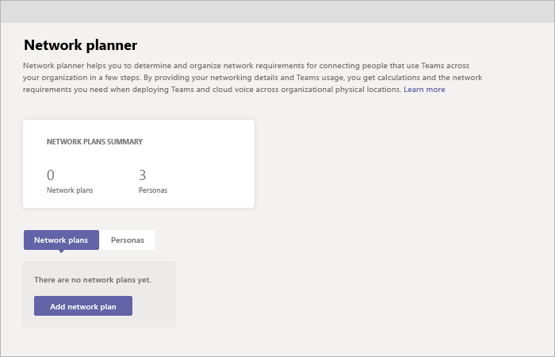

# Usare Pianificazione reti per Microsoft Teams

Network Planner è un nuovo strumento disponibile nell'Teams di amministrazione. È possibile trovare questo sito in **Pianificazione**  >  **della rete.** In pochi passaggi, Network Planner consente di determinare e organizzare i requisiti di rete per la connessione Microsoft Teams utenti all'interno dell'organizzazione. Quando si specificano i dettagli della rete e l'uso di Teams, Network Planner calcola i requisiti di rete per la distribuzione di Teams e Cloud Voice nei luoghi fisici dell'organizzazione.

Network Planner consente di:

- Creare rappresentazioni dell'organizzazione usando i siti e le persone consigliate da Microsoft (office worker, remote worker e Teams room system).

    > [!NOTE]
    > Le persone consigliate sono state sviluppate in base ai dati Teams scenari di utilizzo ottimali e ai modelli di utilizzo tipici. È tuttavia possibile creare fino a tre persone personalizzate oltre alle tre persone consigliate.

- Generare report e calcolare i requisiti di larghezza di banda Teams utilizzo.

Per usare Pianificazione reti, è necessario essere un amministratore globale, Teams amministratore o Teams Communications Administrator.

## Creare una persona personalizzata

Seguire questa procedura per creare una persona personalizzata:

1. Passare a Pianificazione reti nell'Microsoft Teams di amministrazione.

2. Nella scheda **Persona fare** clic su + **Persona personalizzata**. 

3. Nel riquadro **Nuova persona** personalizzata aggiungere un nome e una descrizione per la nuova persona.

4. Selezionare le autorizzazioni che questa persona userà all'interno dell'organizzazione.

5. Fare clic su **Salva**.

## Creare il piano

Seguire questa procedura per iniziare a creare il piano di rete:

1. Passare a Pianificazione reti nell'Microsoft Teams di amministrazione.

2. Nella scheda **Piano di rete** fare clic su Aggiungi piano di **rete.**

3. Immettere un nome e una descrizione per il piano di rete. Il piano di rete verrà visualizzato nell'elenco dei piani disponibili.

4. Fare clic sul nome del piano per selezionare il nuovo piano.

5. Aggiungere siti per creare una rappresentazione della configurazione di rete dell'organizzazione.

    A seconda della rete dell'organizzazione, è possibile usare i siti per rappresentare un edificio, una sede o altro. I siti potrebbero essere connessi da una WAN per consentire la condivisione di connessioni Internet e/o PSTN. Per risultati ottimali, creare siti con connessioni locali prima di creare siti che si connettono in remoto a Internet o PSTN.

    Per creare un sito:

    1. Aggiungere un nome e una descrizione per il sito.

    2. In **Impostazioni di rete** aggiungere il numero di utenti di rete nel sito (obbligatorio).

    3. Aggiungere dettagli di rete: WAN abilitato, capacità WAN, uscita Internet **(** locale o remota **)** e uscita PSTN (nessuna, locale o remota).

      > [!NOTE]
      > È necessario aggiungere numeri di capacità WAN e Internet per visualizzare consigli specifici sulla larghezza di banda quando si genera un report.

    4. Fare clic su **Salva**.

## Creare un report

Dopo aver aggiunto tutti i siti, è possibile creare un report nel modo seguente.

1. Nella scheda **Report** fare clic su **Avvia un report.**

2. Per ogni sito creato, distribuire il numero di utenti tra le persone disponibili. Se si usano le persone consigliate da Microsoft, il numero verrà distribuito automaticamente (80% di office worker e 20% remote worker).

3. Dopo aver completato la distribuzione, fare clic **su Genera report.**

    Il report generato mostrerà i requisiti di larghezza di banda in diverse visualizzazioni, in modo da comprendere chiaramente l'output:
    - Una tabella con singoli calcoli visualizza i requisiti di larghezza di banda per ogni attività consentita.
    - Una visualizzazione aggiuntiva mostra le esigenze complessive di larghezza di banda con consigli.

4. Fare clic su **Salva**. Il report sarà disponibile nell'elenco dei report per la visualizzazione successiva.

## Scenario di esempio

Per un esempio di come usare Pianificazione reti per configurare un piano di rete e generare un report con questa procedura, scaricare la presentazione di Pianificazione reti How-To PowerPoint (solo [in](https://github.com/MicrosoftDocs/OfficeDocs-SkypeForBusiness/blob/live/Teams/downloads/network-planner-how-to.pptx?raw=true) inglese).
