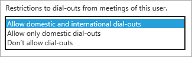

# Criteri di restrizione delle chiamate in uscita per audioconferenze e chiamate PSTN utenteOutbound calling restriction policies for Audio Conferencing and user PSTN calls

Gli amministratori possono usare i controlli per le chiamate in uscita per limitare il tipo di audioconferenze e di chiamate PSTN che possono essere eseguite dagli utenti nell'organizzazione.As an administrator, you can use outbound call controls to restrict the type of audio conferencing and end user PSTN calls that can be made by users in your organization. 

I controlli delle chiamate in uscita possono essere applicati per ogni singolo utente e offrono i due controlli seguenti per limitare in modo indipendente ogni tipo di chiamata in uscita.Outbound call controls can be applied on a per-user basis and provide the following two controls to independently restrict each type of outbound calls. Per impostazione predefinita, entrambi i controlli sono impostati per consentire chiamate in uscita internazionali e nazionali.By default, both controls are set to allow international and domestic outbound calls. 

|ControlloControl|DescrizioneDescription|Opzioni di controlloControl options|
|:-----|:-----|:-----|
|Chiamate PSTN per servizi di audioconferenzaAudio Conferencing PSTN calls|Limita il tipo di in uscitaRestricts the type of outbound  chiamate consentite dall'internocalls that are allowed from within  riunioni organizzate da un utente.meetings organized by a user.|Qualsiasi destinazione (impostazione predefinita)Any destination (default) Nello stesso paese o area geografica di organizorIn the same country or region as the organizor    Area solo paesi o aree geograficheZone A countries or regions only  Non consentireDon't allow|
|Chiamate PSTN degli utenti finaliEnd user PSTN calls|Limita il tipo di chiamateRestricts the type of calls  che possono essere eseguite da un utente.that can be made by a user.|Internazionali e nazionali (impostazione predefinita)International and Domestic (default) NazionaliDomestic NessunoNone|

Per scoprire quali paesi/aree geografiche sono considerate zone A, vedere [zone a paesi/aree geografiche](https://docs.microsoft.com/microsoftteams/calling-plans-for-office-365).To find out which countries/regions are considered Zone A, see [Zone A countries/regions](https://docs.microsoft.com/microsoftteams/calling-plans-for-office-365).

   > [!NOTE]
   > Una chiamata è considerata domestica se il numero composto si trova nello stesso paese/area geografica in cui è stato configurato Office 365 per l'organizzatore della riunione (nel caso di servizi di audioconferenza) o per l'utente finale (nel caso di chiamate PSTN degli utenti finali).A call is considered domestic if the number dialed is in the same country/region where Office 365 has been set up for the organizer of the meeting (in the case of audio conferencing), or the end user (in the case of end user PSTN calls). 

> [!NOTE]
> [!INCLUDE [updating-admin-interfaces](includes/updating-admin-interfaces.md)]

## Limitare le chiamate in uscita per i servizi di audioconferenzaRestrict audio conferencing outbound calls 

 **Usare l'interfaccia di amministrazione di Microsoft Teams** **Using the Microsoft Teams admin center**

1. Nella barra di spostamento sinistra fare clic su **utenti**e quindi selezionare l'utente nell'elenco degli utenti disponibili.In the left navigation, click **Users**, and then select the user from the list of available users.

2. Nella parte superiore della pagina, fai clic su **Modifica**.At the top of the page, click **Edit**.

3. Accanto a servizi di **audioconferenza**fare clic su **modifica**.Next to **Audio Conferencing**, click **Edit**.

4. In **autorizzazioni di accesso esterno da riunioni**selezionare l'opzione di restrizione della chiamata in uscita desiderata.Under **Dial-out permission from meetings**, select the dial-out restriction option you want.

5. Fare clic su **Salva**.Click **Save**. 

 **Uso dell'interfaccia di amministrazione di Skype for Business** **Using the Skype for Business admin center**

1.    Nell'interfaccia di **amministrazione di Skype for business**, nella barra di spostamento sinistra, passa a utenti di servizi di **audioconferenza**  >  **Users**e quindi seleziona l'utente nell'elenco degli utenti disponibili.In the **Skype for Business admin center**, in the left navigation, go to **Audio conferencing** > **Users**, and then select the user from the list of available users.

2.    In the Action pane, click **Edit**.In the Action pane, click **Edit**.

3.    In **restrizioni ai dial-out delle riunioni di questo utente**selezionare l'opzione di restrizione chiamata in uscita desiderata.Under **Restrictions to dial-outs from meetings of this user**, select the dial-out restriction option you want.

    

5. Fare clic su **Salva**.Click **Save**.

> [!Note]
> [!INCLUDE [updating-admin-interfaces](includes/updating-admin-interfaces.md)]

**Utilizzo di PowerShell****Using PowerShell**

Le restrizioni delle chiamate in uscita sono controllate da un singolo criterio denominato OnlineDialOutPolicy che contiene un attributo di restrizione per ogni.Outbound call restrictions are controlled by a single policy called OnlineDialOutPolicy which has a restriction attribute for each. I criteri non possono essere personalizzati, ma esistono istanze di criteri predefinite per ogni combinazione delle impostazioni.The policy cannot be customized, rather there are pre-defined policy instances for each combination of the settings. 

Puoi usare il cmdlet Get-CSOnlineDialOutPolicy per visualizzare i criteri di chiamata in uscita e assegnarli agli utenti usando il cmdlet Grant-CSDialOutPolicy.You can use the Get-CSOnlineDialOutPolicy cmdlet to view the outbound calling policies and assign them to users by using the Grant-CSDialOutPolicy cmdlet. Tieni presente che il cmdlet Grant non contiene la parola "online" come fa il cmdlet Get.(Please note that the Grant cmdlet doesn't contain the word "Online" as the Get cmdlet does.) 

La tabella seguente offre una panoramica di ogni criterio.The following table provides an overview of each policy.

|||
|:-----|:-----|
|Identity =' Tag: DialoutCPCandPSTNInternational 'Identity='tag:DialoutCPCandPSTNInternational'    |    L'utente della conferenza può effettuare chiamate in uscita per i numeri nazionali e internazionali, e questo utente può anche eseguire una chiamata in uscita a numeri nazionali e internazionali.User in the conference can dial out to   international and domestic numbers, and this user can also make outbound calls to international and domestic numbers.    |
|Identity =' Tag: DialoutCPCDomesticPSTNInternational 'Identity='tag:DialoutCPCDomesticPSTNInternational'  |    L'utente nella conferenza può effettuare la chiamata solo ai numeri nazionali e questo utente può eseguire chiamate in uscita a numeri nazionali e internazionali.User in the conference can only dial out to   domestic numbers, and this user can make outbound calls to international and domestic numbers.    |
|    Identity =' Tag: DialoutCPCDisabledPSTNInternational 'Identity='tag:DialoutCPCDisabledPSTNInternational'    |    L'utente della conferenza non può effettuare una chiamata esterna. Questo utente può effettuare chiamate in uscita a numeri nazionali e internazionali.User in the conference cannot make any dial out. This user can make outbound calls to international and domestic numbers.    |
|    Identity =' Tag: DialoutCPCInternationalPSTNDomestic 'Identity='tag:DialoutCPCInternationalPSTNDomestic'    |    L'utente della conferenza può effettuare una chiamata esterna a numeri nazionali e internazionali e questo utente può eseguire chiamate in uscita solo al numero PSTN nazionale.User in the conference can dial out to   international and domestic numbers, and this user can only make outbound calls to domestic PSTN number.    |
|    Identity =' Tag: DialoutCPCInternationalPSTNDisabled 'Identity='tag:DialoutCPCInternationalPSTNDisabled'    |    L'utente della conferenza può effettuare una chiamata esterna a numeri nazionali e internazionali e questo utente non può eseguire chiamate in uscita al numero PSTN oltre ai numeri di emergenza.User in the conference can dial out to   international and domestic numbers, and this user cannot make any outbound calls to PSTN number besides emergency numbers.    |
|    Identity =' Tag: DialoutCPCandPSTNDomestic 'Identity='tag:DialoutCPCandPSTNDomestic'    |    L'utente nella conferenza può effettuare la chiamata solo ai numeri nazionali e questo utente può eseguire solo chiamate in uscita ai numeri PSTN nazionali.User in the conference can only dial out to   domestic numbers, and this user can only make outbound call to domestic PSTN numbers.    |
|    Identity =' Tag: DialoutCPCDomesticPSTNDisabled 'Identity='tag:DialoutCPCDomesticPSTNDisabled'    |    L'utente nella conferenza può effettuare la chiamata solo ai numeri nazionali e questo utente non può eseguire chiamate in uscita al numero PSTN oltre ai numeri di emergenza.User in the conference can only dial out to   domestic numbers, and this user cannot make any outbound calls to PSTN number besides emergency numbers.    |
|    Identity =' Tag: DialoutCPCDisabledPSTNDomestic 'Identity='tag:DialoutCPCDisabledPSTNDomestic'    |    L'utente della conferenza non può effettuare chiamate in uscita e questo utente può solo effettuare una chiamata in uscita ai numeri PSTN nazionali.User in the conference cannot make any dial   out, and this user can only make outbound call to domestic PSTN numbers.    |
|    Identity =' Tag: DialoutCPCandPSTNDisabled 'Identity='tag:DialoutCPCandPSTNDisabled'    |    L'utente della conferenza non può effettuare chiamate in uscita e questo utente non può effettuare alcuna chiamata in uscita al numero PSTN oltre ai numeri di emergenza.User in the conference cannot make any dial   out, and this user cannot make any outbound calls to PSTN number besides emergency numbers.    |
|    Identity =' Tag: DialoutCPCZoneAPSTNInternational 'Identity='tag:DialoutCPCZoneAPSTNInternational'    |    L'utente nella conferenza può effettuare la chiamata solo per la zona di paesi e aree geografiche e questo utente può eseguire chiamate in uscita a numeri nazionali e internazionali.User in the conference can only dial out to Zone A countries and regions, and this user can make outbound calls to international and domestic numbers.    |
|    Identity =' Tag: DialoutCPCZoneAPSTNDomestic 'Identity='tag:DialoutCPCZoneAPSTNDomestic'    |    L'utente nella conferenza può effettuare la chiamata solo per la zona di paesi e aree geografiche e questo utente può eseguire solo chiamate in uscita al numero PSTN nazionale.User in the conference can only dial out to Zone A countries and regions, and this user can only make outbound calls to domestic PSTN number.    |
|    Identity =' Tag: DialoutCPCZoneAPSTNDisabled 'Identity='tag:DialoutCPCZoneAPSTNDisabled'    |    L'utente nella conferenza può effettuare la chiamata solo per la zona di paesi e aree geografiche e questo utente non può eseguire chiamate in uscita al numero PSTN oltre ai numeri di emergenza.User in the conference can only dial out to Zone A countries and regions, and this user cannot make any outbound calls to PSTN number besides emergency numbers.    |
