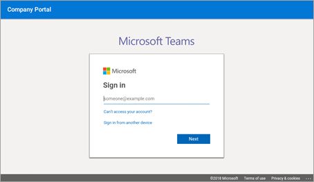
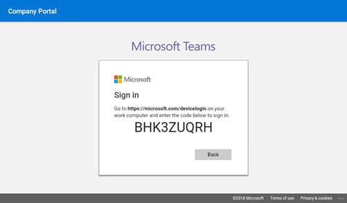
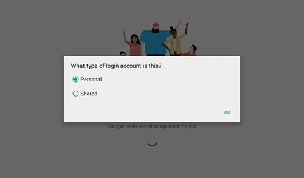
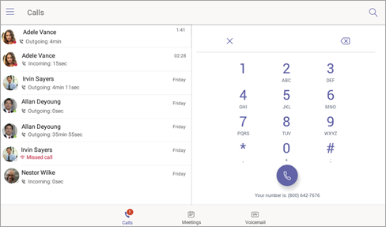
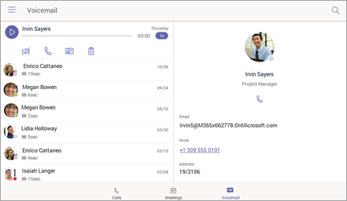
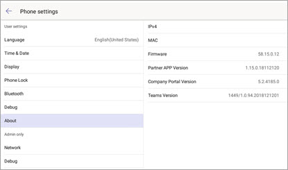

# Telefoni per Microsoft Teams

Microsoft teams supporta un portafoglio di telefoni da tavolo per gli utenti che necessitano di un'esperienza telefonica tradizionale. Questo articolo illustra l'elenco dei telefoni certificati per Microsoft teams e le funzionalità supportate nei telefoni certificati per Microsoft teams. Per ottenere le informazioni più aggiornate sui dispositivi certificati in teams, visitare [Teams Marketplace](https://office.com/teamsdevices).

## Telefoni IP certificati Teams

Per offrire un'esperienza di Microsoft teams di alta qualità e attendibile sui telefoni, stiamo collaborando attivamente con Yealink, Crestron, Polycom e AudioCodes per sviluppare e certificare un ampio portafoglio di telefoni da tavolo e dispositivi audio della sala riunioni. Vedere i [telefoni IP attualmente certificati](teams-ip-phones.md#currently-certified-ip-phones) per i dispositivi supportati correnti.

## Set di funzionalità telefoni Microsoft Teams

Nella tabella seguente sono disponibili un set di caratteristiche di alto livello supportato nei telefoni IP certificati teams.

|Caratteristiche |Telefono da tavolo (modalità personale) |Telefono della sala riunioni (modalità condivisa)|
|---------|---------|---------|
|**Autenticazione** | |  |
|Accedi con le credenziali utente |  Sì | Sì|
|Accedere con PC/smartphone  | Sì |Sì|
|Autenticazione moderna | Sì |Sì |
|Blocco telefono/Sblocca | No |No |
|**Chiamate** |  |  |
|Chiamate P2P in arrivo/in uscita | Sì  |Sì |
|Controlli in chiamata tramite interfaccia utente (mute, attesa/ripresa, trasferimento, fine chiamata)| Sì  |Sì |
|Chiamate PSTN| Sì  |Sì |
|Casella vocale visuale | No | No |
|supporto di 911  | Sì  |Sì |
|**Calendario e presenza**|   | |
|Accesso al calendario e dettagli delle riunioni|Sì |Sì|
|Integrazioni presenza |Sì|Sì|
|Integrazione del calendario di Exchange |Sì|Sì|
|Integrazione immagine contatto  |Sì|Sì|
|Accesso alla directory aziendale | Sì|Sì|
|**Riunioni**|   ||
|Join con un clic per le riunioni  | Sì  |Sì |
|Partecipare a riunioni Skype for business | Sì  | Sì|
|Controlli delle chiamate di riunione (silenziamento/riattivazione, attesa/ripresa, blocco, aggiunta/rimozione partecipante)|Sì|Sì|
|Dettagli riunione|No|No|

Stiamo lavorando per aggiungere continuamente funzionalità per aiutare gli utenti a migliorare l'esperienza dei team sui telefoni. Le schermate seguenti illustrano alcune delle esperienze che sosteniamo oggi.

## Esperienza di accesso

Quando un utente fa clic sul pulsante di accesso in teams, l'accesso viene avviato tramite il portale aziendale. L'utente ha la possibilità di accedere immettendo le credenziali utente nel telefono o scegliendo di accedere da un altro dispositivo. Se l'utente sceglie di accedere da un altro dispositivo, l'utente può completare l'autenticazione dal proprio PC o smartphone.

**Accesso dell'utente con le credenziali**

**Accesso utente tramite PC/smartphone**

## Modalità personale/condivisa

Dopo l'accesso riuscito, l'utente può scegliere se il dispositivo verrà usato per uso personale o in una sala riunioni condivisa.

L'esperienza telefono teams è ottimizzata in base alla selezione dell'utente.

**Modalità personale**

**Modalità condivisa**

## Esperienza di chiamata

L'utente di Microsoft teams può sollevare il ricevitore o premere il pulsante altoparlante per avviare la tastiera del telefono nella schermata chiamante. In alternativa, l'utente può usare i pulsanti hardware (se disponibili) per chiamare un numero.

**Tastierino vocale su schermo**

**Schermata chiamante**

## Esperienza di riunione

L'utente di Microsoft teams può passare alla scheda riunioni per visualizzare le riunioni e usare il pulsante **partecipa** per partecipare alle riunioni del team.

**Visualizzazione Calendario**

**Visualizzazione partecipazione a una riunione**

## Segreteria telefonica

L'utente di Microsoft teams può accedere alla segreteria telefonica quando passa alla scheda **segreteria telefonica** .

## Disconnessione utente

L'utente del telefono teams può scegliere di disconnettersi selezionando l'opzione **Esci** dal menu in alto a sinistra.

## Ricerca della versione del firmware in un dispositivo mobile

La versione minima del firmware può essere selezionata nella pagina di accesso a teams scegliendo l'icona **Impostazioni** nell'angolo in alto a destra e quindi facendo clic **su informazioni su**.

**Pagina di accesso a teams**

**Pagina impostazioni**

## Licenze necessarie

Le licenze di Microsoft teams possono essere acquistate come parte degli [abbonamenti a Office 365](Office-365-licensing.md). Per altre informazioni sulle licenze necessarie per l'uso di Microsoft teams sui telefoni, vedere [licenze di sistema telefonico](https://products.office.com/microsoft-teams/voice-calling)disponibili.

Per altre informazioni su come ottenere teams, vedere [come si accede a Microsoft teams?](https://support.office.com/article/fc7f1634-abd3-4f26-a597-9df16e4ca65b)

## Vedere anche

[Marketplace Teams](https://office.com/teamsdevices)

[Telefoni IP certificati per Microsoft Teams](teams-ip-phones.md)
