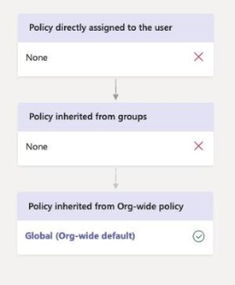

# <a name="assign-policies-in-teams--getting-started"></a>Assegnare criteri in Teams- Guida introduttiva

Gli amministratori usano i criteri per controllare le funzionalità di Teams disponibili per gli utenti dell'organizzazione. Ad esempio, esistono criteri per le chiamate, criteri per le riunioni e criteri di messaggistica, solo per citarne alcuni.

Le organizzazioni hanno diversi tipi di utenti con esigenze specifiche. I criteri personalizzati creati e assegnati consentono di personalizzare le impostazioni dei criteri per diversi set di utenti in base a queste esigenze.

Per gestire facilmente i criteri nell'organizzazione, Teams offre diversi modi per assegnare i criteri agli utenti. Assegnare un criterio direttamente agli utenti, singolarmente o in scala tramite un'assegnazione batch, o a un gruppo di cui gli utenti sono membri. È anche possibile usare i pacchetti di criteri per assegnare una raccolta preimpostata di criteri agli utenti dell'organizzazione con ruoli simili. L'opzione scelta dipende dal numero di criteri da gestire e dal numero di utenti a cui si stanno assegnando i criteri. I criteri globali (predefiniti a livello di organizzazione) si applicano al maggior numero di utenti dell'organizzazione. È necessario assegnare criteri solo agli utenti che richiedono criteri specializzati.

Questo articolo descrive i diversi modi in cui è possibile assegnare criteri agli utenti e gli scenari consigliati per quando usarli.

Per informazioni dettagliate su come **assegnare criteri a utenti e gruppi**, vedere [Assegnazione di criteri a utenti e gruppi](assign-policies-users-and-groups.md). Per informazioni dettagliate su come **assegnare pacchetti di criteri**, vedere [Assegnare pacchetti di criteri](assign-policy-packages.md).

## <a name="which-policy-takes-precedence"></a>Quali criteri hanno la precedenza?

Un utente ha un criterio efficace per ogni tipo di criterio. È possibile, o anche probabile, che a un utente sia assegnato direttamente un criterio e che sia anche membro di uno o più gruppi a cui è assegnato un criterio dello stesso tipo. Quali criteri hanno la precedenza in questi scenari? I criteri efficaci di un utente sono determinati in base alle regole di precedenza, come indicato di seguito.

Se a un utente viene assegnato direttamente un criterio (singolarmente o tramite un'assegnazione batch), tale criterio ha la precedenza. Nell'esempio visivo seguente, il criterio effettivo dell'utente è il criterio riunione Lincoln Square, che viene assegnato direttamente all'utente.


Se a un utente non è assegnato direttamente un criterio di un determinato tipo, ha la precedenza il criterio assegnato a un gruppo di cui l'utente è membro. Se un utente è membro di più gruppi, ha la precedenza il criterio che ha la più alta ([classificazione delle assegnazioni di gruppo](assign-policies-users-and-groups.md#group-assignment-ranking)) per il tipo di criterio specificato.

In questo esempio visivo, il criterio efficace dell'utente è il criterio Exec Teams e HD, che ha la classificazione di assegnazione più alta rispetto ad altri gruppi di cui l'utente è membro e a cui è anche assegnato un criterio dello stesso tipo di criterio.  


Se a un utente non è assegnato direttamente un criterio o non è membro di alcun gruppo a cui è assegnato un criterio, l'utente ottiene il criterio globale (predefinito a livello di organizzazione) per quel tipo di criterio. Ecco un esempio visivo.



Per altre informazioni, vedere ([Regole di precedenza](assign-policies-users-and-groups.md#precedence-rules)).

## <a name="ways-to-assign-policies"></a>Modalità di assegnazione dei criteri

Ecco una panoramica dei modi in cui è possibile assegnare criteri agli utenti e gli scenari consigliati per ognuno di essi. Selezionare i collegamenti per altre informazioni.

Prima di assegnare criteri a singoli utenti o gruppi, iniziare [impostando i criteri globali (predefiniti a livello di organizzazione)](#set-the-global-policies) in modo che vengano applicati al maggior numero di utenti dell'organizzazione.  Dopo aver impostato i criteri globali, è necessario assegnare criteri solo agli utenti che richiedono criteri specializzati.

|Esegui questa operazione  |Se...  | Utilizzando...
|---------|---------|----|
|[Assegnare un criterio ai singoli utenti](assign-policies-users-and-groups.md#assign-a-policy-to-individual-users)   | Non hai familiarità con Teams e hai appena iniziato o devi assegnare solo uno o un paio di criteri a un numero limitato di utenti. |Interfaccia di amministrazione di Microsoft Teams o cmdlet di PowerShell nel modulo di PowerShell di Teams
|[Assegnare un criterio a un gruppo](assign-policies-users-and-groups.md#assign-a-policy-to-a-group) |Assegnare criteri in base all'appartenenza a un gruppo di un utente. Ad esempio, assegnare un criterio a tutti gli utenti di un gruppo di sicurezza o di una lista di distribuzione.| Interfaccia di amministrazione di Microsoft Teams o cmdlet di PowerShell nel modulo di PowerShell di Teams|
|[Assegnare un criterio a un batch di utenti](assign-policies-users-and-groups.md#assign-a-policy-to-a-batch-of-users)   | Assegnare criteri a grandi gruppi di utenti. Ad esempio, assegnare un criterio a centinaia o migliaia di utenti dell'organizzazione alla volta. |Interfaccia di amministrazione di Microsoft Teams o cmdlet di PowerShell nel modulo di PowerShell di Teams|
|[Assegnare un pacchetto di criteri agli utenti](assign-policy-packages.md#assign-a-policy-package-to-users)  |Assegnare più criteri a gruppi specifici di utenti dell'organizzazione che hanno ruoli uguali o simili. Ad esempio, assegnare il pacchetto di criteri Istruzione (docenti) agli insegnanti dell'istituto di istruzione per concedere loro l'accesso completo a chat, chiamate e riunioni. Assegnare il pacchetto di criteri Istruzione (studenti della scuola secondaria) agli studenti secondari per limitare determinate funzionalità, ad esempio le chiamate private.  |Interfaccia di amministrazione di Microsoft Teams o cmdlet di PowerShell nel modulo di PowerShell di Teams|
|[Assegnare un pacchetto di criteri a un gruppo](assign-policy-packages.md#assign-a-policy-package-to-a-group)  |Assegnare più criteri a un gruppo di utenti dell'organizzazione con ruoli uguali o simili. Ad esempio, assegnare un pacchetto di criteri a tutti gli utenti di un gruppo di sicurezza o di una lista di distribuzione. |L'interfaccia di amministrazione di Microsoft Teams (presto disponibile) o i cmdlet di PowerShell nel modulo PowerShell di Teams|
|[Assegnare un pacchetto di criteri a un batch di utenti](assign-policy-packages.md#assign-a-policy-package-to-a-batch-of-users)|Assegnare più criteri a un batch di utenti dell'organizzazione con ruoli uguali o simili. Ad esempio, assegnare il pacchetto di criteri Istruzione (docenti) a tutti gli insegnanti dell'istituto di istruzione usando un'attività batch per concedere loro l'accesso completo a chat, chiamate e riunioni. Assegnare il pacchetto di criteri Istruzione (studenti della scuola secondaria) a un batch di studenti secondari per limitare determinate funzionalità, ad esempio le chiamate private.|Cmdlet di PowerShell nel modulo di Teams PowerShell|

> [!NOTE]
> Per annullare l'assegnazione dei criteri, è possibile rimuovere le assegnazioni in blocco per tutti gli utenti direttamente assegnati a un criterio. Per altre informazioni, vedere [Annullare l'assegnazione di criteri in blocco](assign-policies-users-and-groups.md#unassign-policies-in-bulk).

## <a name="set-the-global-policies"></a>Impostare i criteri globali

Seguire questa procedura per impostare i criteri globali (predefiniti a livello di organizzazione) per ogni tipo di criterio.

### <a name="using-the-microsoft-teams-admin-center"></a>Utilizzo dell'interfaccia di amministrazione di Microsoft Teams.

1. Nel riquadro di spostamento sinistro dell'interfaccia di amministrazione di Microsoft Teams passare alla pagina dei criteri per il tipo di criterio da aggiornare. Ad esempio, criteri **di Teams** > , **criteri riunioni** > , **criteri di messaggistica** o **criteri per le chiamate** **vocali** > .
2. Selezionare il criterio **globale (predefinito a livello di organizzazione)** per visualizzare le impostazioni correnti.
3. Aggiornare il criterio in base alle esigenze e quindi selezionare **Applica**.


### <a name="using-powershell"></a>Utilizzo di PowerShell

Per impostare i criteri globali usando PowerShell, usare l'identificatore globale.  Prima di tutto esaminare i criteri globali correnti per determinare l'impostazione da modificare.

```powershell
Get-CsTeamsMessagingPolicy -Identity Global
 
Identity                      : Global
Description                   :
AllowUrlPreviews              : True
AllowOwnerDeleteMessage       : False
AllowUserEditMessage          : True
AllowUserDeleteMessage        : True
AllowUserChat                 : True
AllowRemoveUser               : True
AllowGiphy                    : True
GiphyRatingType               : Moderate
AllowMemes                    : True
AllowImmersiveReader          : True
AllowStickers                 : True
AllowUserTranslation          : False
ReadReceiptsEnabledType       : UserPreference
AllowPriorityMessages         : True
ChannelsInChatListEnabledType : DisabledUserOverride
AudioMessageEnabledType       : ChatsAndChannels
Expand (20 lines) Collapse 
```

Aggiornare quindi i criteri globali in base alle esigenze.  È necessario specificare solo i valori per le impostazioni da modificare.

```powershell
Set-CsTeamsMessagingPolicy -Identity Global -AllowUserEditMessage $false
```

## <a name="view-your-policy-assignments-in-the-activity-log"></a>Visualizzare le assegnazioni dei criteri nel log attività

Quando si assegnano criteri agli utenti nell'interfaccia di amministrazione di Microsoft Teams, è possibile visualizzare lo stato di queste assegnazioni di criteri nel [log attività](https://admin.teams.microsoft.com/activitylog). Il log attività mostra le informazioni di caricamento dei record di rete, le operazioni dei criteri di gruppo dall'interfaccia di amministrazione di Teams e PowerShell e le operazioni dei criteri batch (per più di 20 utenti) dall'interfaccia di amministrazione di Teams, per gli ultimi 30 giorni.


Per visualizzare le operazioni dei criteri nel log attività:

1. Nel riquadro di spostamento sinistro dell'interfaccia di amministrazione di Microsoft Teams passare a **Dashboard** e quindi in **Log attività** selezionare **Visualizza dettagli**.
2. Verranno visualizzate le informazioni seguenti su ogni operazione dei criteri:
    - **Attività**: nome dell'operazione dei criteri. Ad esempio: **Assegnazione di Criteri di gruppo**
    - **Nome gruppo**: nome del gruppo in cui è stata completata l'operazione dei criteri.
    - **Tipo di** criterio: tipo di criterio.
    - **Nome criterio**: nome dell'operazione del criterio. Per le assegnazioni dei criteri batch, è possibile selezionare il collegamento per visualizzare altri dettagli. Include il numero di utenti a cui è stato assegnato il criterio e il numero di assegnazioni completate, in corso e non iniziate. Verranno inoltre visualizzati l'elenco di utenti nel batch, lo stato e il risultato per ogni utente.
    - **Inviato da**: nome dell'utente che ha inviato l'operazione del criterio.
    - **Inviato il**: data e ora di invio dell'operazione dei criteri.
    - **Completato il**: Data e ora di completamento dell'operazione dei criteri.
    - **Interessato**: numero di utenti nel batch o nel gruppo.
    - **Stato generale**: stato dell'operazione dei criteri. I criteri possono avere uno degli stati seguenti:
        - **Non avviato**: l'operazione dei criteri è stata inviata dall'amministratore.
        - **In corso**: l'elaborazione dei criteri è stata avviata.
        - **Distribuzione agli utenti**: il sistema ha iniziato ad applicare l'aggiornamento dei criteri agli utenti.
        - **Completato**: l'aggiornamento dei criteri è stato applicato a tutti gli utenti.
        - **Completato con errori 'x'**: l'operazione dei criteri è completata, ma sono presenti errori.

> [!NOTE]
> È anche possibile accedere al log attività dalla pagina **Utenti** . Dopo aver selezionato **Applica** per inviare un'assegnazione di criteri in blocco, nella parte superiore della pagina verrà visualizzato un banner. Selezionare il collegamento **Log attività** nel banner.

## <a name="related-topics"></a>Argomenti correlati

- [Assegnare criteri a utenti e gruppi](assign-policies-users-and-groups.md)
- [Assegnare pacchetti di criteri a utenti e gruppi](assign-policy-packages.md)
- [Gestire Teams con i criteri](manage-teams-with-policies.md)
- [Panoramica di PowerShell di Teams](teams-powershell-overview.md)
