# Criteri e pacchetti di criteri di Teams per l'istruzione

> [!NOTE]
> Per informazioni approfondite sui criteri in Microsoft Teams, vedere [Assegnare i criteri agli utenti in Microsoft Teams](assign-policies.md).

È importante tenere presente che questo articolo illustra vari modi per assegnare criteri agli utenti in Teams.

- Assegnazione manuale a singoli utenti.
- Assegnazione in blocco tramite PowerShell a più utenti.
- Assegnazione di pacchetti di criteri a singoli utenti o a più utenti.

I vantaggi e gli svantaggi di questi approcci sono legati alle specifiche esigenze dell'istituto.

## Amministratori: introduzione alla gestione dei criteri di Microsoft Teams

Essenzialmente, Microsoft Teams consente agli utenti di svolgere attività come partecipare a riunioni o eventi live, chattare, effettuare chiamate e usare app. Configurare il criteri di amministrazione di Microsoft Teams in modo corretto è un passaggio fondamentale per la creazione di un ambiente di apprendimento sicuro per gli studenti in Teams. Gli amministratori possono usare i criteri per controllare le funzionalità di Teams disponibili per gli utenti dell'istituto di istruzione.

Ecco un elenco delle aree dei criteri disponibili in Microsoft Teams:

- Riunioni
- Eventi live
- Chiamate
- Messaggistica
- Team
- Autorizzazioni app

:::image type="content" source="media/edu-admin-center-users.png" alt-text="Screenshot di un utente con i criteri applicati.":::

È possibile gestire facilmente tutti i criteri di Teams nell'[interfaccia di amministrazione di Microsoft Teams](https://admin.teams.microsoft.com) accedendo con le credenziali di amministratore.

### Dove trovare i criteri di Microsoft Teams

Dopo aver eseguito l'accesso all'interfaccia di amministrazione di Teams, sarà possibile accedere alle impostazioni dei criteri per qualsiasi area di Teams che è necessario gestire facendo clic sull'opzione dei criteri nel riquadro di spostamento sinistro. Lo screenshot che segue mostra la posizione dei criteri di messaggistica.

:::image type="content" source="media/edu-messaging-policies.png" alt-text="Posizione dei criteri di messaggistica nell'interfaccia di amministrazione di Teams.":::

### Come creare e aggiornare una definizione di criteri

Prima di assegnare criteri agli utenti, è necessario aggiungere e creare definizioni di criteri per ogni area di funzionalità di Teams.

> [!NOTE]
> È consigliabile impostare definizioni di criteri diverse per gli studenti e i docenti.

Per impostazione predefinita, a ogni nuovo utente (studente o docente) verrà assegnato il criterio Globale (predefinito a livello di organizzazione) per ogni area di funzionalità. È consigliabile seguire questa procedura:

1. Creare una definizione di criteri personalizzata per ogni area di funzionalità di Teams, che potrà quindi essere assegnata ai docenti. In mancanza di questa definizione, qualunque modifica al criterio Globale limiterà i docenti finché non avranno un criterio personalizzato.

1. Assegnare ai docenti questa nuova definizione di criteri.

1. Aggiornare la definizione del criterio Globale (predefinito a livello di organizzazione), quindi assegnarla agli studenti.

Per creare o modificare definizioni di criteri, passare all'area di funzionalità dei criteri su cui si intenda lavorare, ad esempio Criteri di messaggistica. Selezionare **Aggiungi** se si vuole creare una nuova definizione di criteri personalizzata (operazione da eseguire per la definizione di criteri personalizzata creata per i docenti). In alternativa, per modificare una definizione di criteri esistente, selezionare **Modifica** (operazione da eseguire se si sceglie di aggiornare il criterio Globale per gli studenti).

:::image type="content" source="media/edu-messaging-policies-add-closeup.png" alt-text="Ingrandimento della sezione dei criteri di messaggistica con pulsante Aggiungi.":::

Che si scelga di aggiungere oppure di modificare una definizione di criteri, si aprirà una visualizzazione in cui sono elencate tutte le opzioni correlate all'area dei criteri corrispondente. Usare questo elenco per selezionare i valori da impostare nella definizione di criteri.

> [!IMPORTANT]
> Non dimenticare di selezionare **Salva** prima di uscire dalla pagina.

### Come assegnare una definizione di criteri a un utente

> [!NOTE]
> Per propagare l'assegnazione di una definizione di criteri a tutti gli utenti e i client può occorrere del tempo. Questa operazione può essere utile quando si creano gli account utente in Azure/Microsoft 365 e ogni volta che un nuovo studente si unisce all'istituto di istruzione.

Una volta creata o aggiornata la definizione di criteri, è possibile assegnarla a un utente selezionando **Gestisci utenti** nella pagina dei criteri, cercando l'utente desiderato e quindi applicando il criterio.

È anche possibile assegnare un criterio a un utente passando a Utenti, selezionando l'utente per il quale si vogliono aggiornare i criteri, selezionando Criteri e quindi Modifica. Da qui è possibile selezionare la definizione di criteri che si vuole assegnare all'utente per ogni area di funzionalità.

> [!IMPORTANT]
> Se si fa parte di un istituto di istruzione di grandi dimensioni, usare l'esperienza del portale di amministrazione di Microsoft Teams per impostare i criteri per ogni utente può essere difficoltoso. Sarà preferibile assegnare criteri in blocchi con PowerShell. Se necessario, sono disponibili informazioni specifiche per il settore su come [assegnare criteri a grandi gruppi di utenti dell'istituto di istruzione](batch-group-policy-assignment-edu.md). È anche possibile consultare la sezione seguente relativa ai pacchetti di criteri, che rappresentano un ottimo modo per gestire i criteri e le impostazioni per i grandi gruppi di utenti.

### Pacchetti di criteri in Microsoft Teams

Un pacchetto di criteri in Teams raccoglie i criteri predefiniti e le impostazioni dei criteri illustrati in precedenza e li assegna agli utenti con ruoli simili nell'istituto. I pacchetti di criteri semplificano la gestione dei criteri e contribuiscono a garantirne la coerenza. Nella normale prassi è necessario assegnare un pacchetto di criteri a ogni utente e ridefinire i criteri in ogni pacchetto in base alle esigenze di quel gruppo di utenti. Quando si aggiornano le impostazioni di un pacchetto, tutti gli utenti ai quali è assegnato il pacchetto vengono modificati come aggiornamento in blocco.

Gli istituti di istruzione in generale hanno molti utenti con esigenze specifiche, a seconda dell'età e della maturità degli studenti. Ad esempio, si può decidere di concedere ai docenti e al personale l'accesso completo a Microsoft Teams, ma di limitare le funzionalità disponibili agli studenti per promuovere un ambiente di apprendimento sicuro e concentrato. È possibile usare i pacchetti di criteri per personalizzare le impostazioni in base alle esigenze di gruppi diversi nella community dell'istituto di istruzione.

> [!NOTE]
> Vedere [Gestire i pacchetti di criteri in Microsoft Teams](manage-policy-packages.md) per istruzioni dettagliate sull'assegnazione di un pacchetto a singoli utenti, l'assegnazione di pacchetti in blocco a un massimo di 5.000 utenti e la gestione e aggiornamento dei criteri collegati a ogni pacchetto.

Come per l'elenco dei criteri illustrato in precedenza in questo articolo, i pacchetti di criteri contengono criteri predefiniti per:

- Riunioni
- Eventi live
- Chiamate
- Messaggistica
- Team
- Autorizzazioni app

Microsoft Teams attualmente include i pacchetti di criteri seguenti:

|Nome del pacchetto elencato nell'interfaccia di amministrazione di Microsoft Teams |Ideale per  |Descrizione |
|:--- |:--- |:--- |
|**Education_Teacher**| Docenti e personale| Usare questo set di criteri e impostazioni dei criteri per concedere ai docenti e al personale dell'organizzazione l'accesso completo alla chat, alle chiamate e alle riunioni tramite Microsoft Teams. |
|**Education_PrimaryStudent**| Studenti di scuole elementari  | Gli studenti più giovani dell'istituto di istruzione possono avere bisogno di più limiti all'interno di Microsoft Teams. Usare questo set di criteri e impostazioni di criteri per limitare le funzionalità, ad esempio per la creazione e la gestione di riunioni, la gestione delle chat e le chiamate private. |
|**Education_SecondaryStudent**| Studenti di scuole medie o superiori | Gli studenti delle scuole secondarie possono avere bisogno di più limiti all'interno di Microsoft Teams. Usare questo set di criteri e impostazioni di criteri per limitare le funzionalità, ad esempio per la creazione e la gestione di riunioni, la gestione delle chat e le chiamate private. |
|**Education_HigherEducationStudent**| Studenti universitari | Gli studenti universitari possono avere bisogno di meno limiti, ma l'applicazione di alcune limitazioni è comunque consigliata. È possibile usare questo set di criteri e impostazioni di criteri per consentire l'accesso a chat, chiamate e riunioni all'interno dell'organizzazione, limitando però il modo in cui gli studenti usano Microsoft Teams con i partecipanti esterni. |
|**Education_PrimaryTeacher_RemoteLearning**| Docenti e personale | Crea una serie di criteri che si applicano agli insegnanti delle scuole elementari per massimizzare la sicurezza e la collaborazione degli studenti quando si adotta l'apprendimento a distanza. |
|**Education_PrimaryStudent_RemoteLearning**| Studenti di scuole elementari| Crea una serie di criteri che si applicano agli studenti delle scuole elementari per massimizzare la sicurezza e la collaborazione degli studenti quando si adotta l'apprendimento a distanza.
|||

:::image type="content" source="media/edu-policy-packages-list.png" alt-text="Pagina con l'elenco dei pacchetti di criteri tra cui scegliere.":::

A ogni singolo criterio viene assegnato il nome del pacchetto di criteri, in modo da poter identificare facilmente i criteri collegati a un pacchetto di criteri. Ad esempio, quando si assegna il pacchetto di criteri Education_Teacher ai docenti dell'istituto di istruzione, viene creato un criterio denominato Education_Teacher per ogni criterio nel pacchetto.

> [!NOTE]
> Se si decide che i docenti e il personale amministrativo hanno bisogno di criteri diversi si può riutilizzare un pacchetto esistente, ossia identificare un pacchetto attualmente in uso e modificare le impostazioni in modo che siano appropriate per quel gruppo. Potrebbe essere necessario prendere nota di quale gruppo abbia un determinato pacchetto, ma questo è l'unico impedimento al riutilizzo di un pacchetto.

## Criteri che è opportuno assegnare per la sicurezza degli studenti

### Criteri di riunione per gli studenti

#### Disattivare la possibilità di creare e avviare riunioni

> [!NOTE]
> Questa funzionalità potrebbe non essere visibile nel tenant al momento. Il motivo è che la funzionalità è in fase di implementazione e sarà disponibile per tutti gli utenti non appena sarà implementata in tutti i tenant. Vedere la [Roadmap di Teams](https://www.microsoft.com/microsoft-365/roadmap?filters=&searchterms=63355) per maggiori informazioni.

Per fare in modo che gli studenti non possano pianificare una riunione per comunicare senza alcuna sorveglianza, nei criteri riunione **disattivare** le funzionalità di creazione riunioni con queste impostazioni generali:

- **Consenti l'uso di Riunione immediata nei canali**: disattivato

- **Consenti il componente aggiuntivo per Outlook**: disattivato

- **Consenti la pianificazione delle riunioni di canale**: disattivato

- **Consenti la pianificazione di riunioni private**: disattivato

  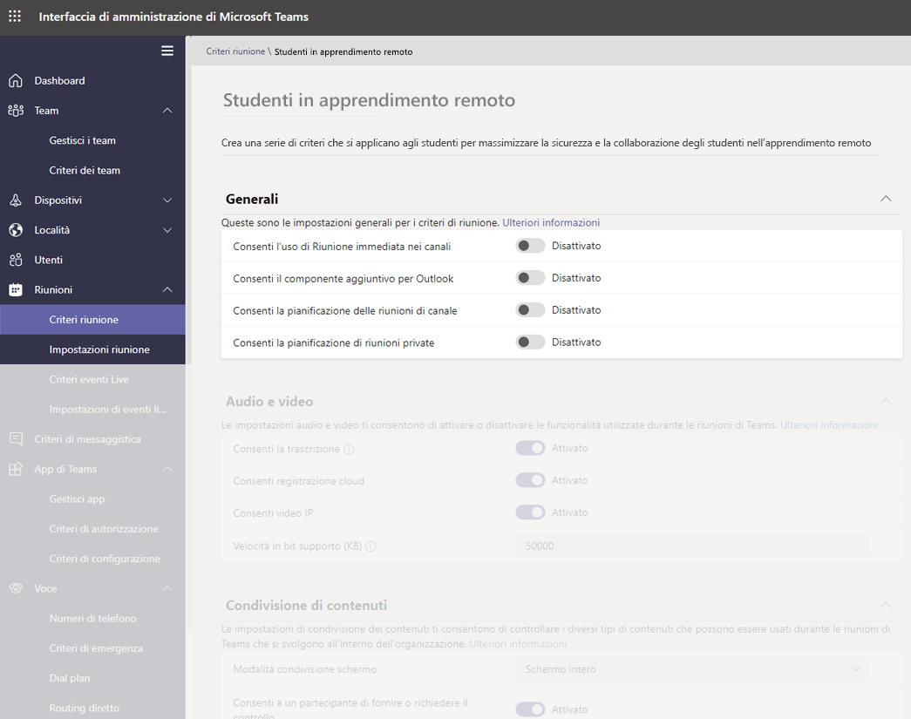

- Nella stessa pagina, nella sezione della riunione Partecipanti e ospiti:

  - **Consenti l'uso di Riunione immediata nelle riunioni private**: disattivato
  - **Consenti l'uso della chat nelle riunioni**: disabilitato

  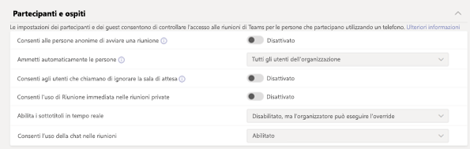

Se si disattiva **Consenti Riunione immediata nei canali**, **Consenti la pianificazione delle riunioni di canale**, **Consenti la pianificazione delle riunioni private** e **Riunione immediata nelle riunioni private**, non solo si blocca la possibilità per gli studenti di pianificare una riunione come organizzatori, ma si forniscono loro anche le misure di sicurezza seguenti:

- Se gli studenti tentano di partecipare alla riunione prima dell'insegnante, non saranno in grado di partecipare. Questa funzionalità è presente nella versione più recente dell'app Teams.

- Anche se la creazione di riunioni è disponibile per tutti gli utenti e qualsiasi licenza, le misure di sicurezza relative al blocco della partecipazione descritte sopra, sono valide solo per i clienti di Teams nel settore dell'istruzione in base al tipo di licenza.

Di seguito elenchiamo una tabella che descrive la logica per ogni criterio per la creazione di una riunione:

| Criteri per la creazione di riunioni | Creare una riunione | Avviare una riunione automatica | Ignorare la sala di attesa quando si accede | Terminare la riunione |
| --- | --- | --- | --- | --- |
| **Attivato (as esempio, docente)** | Sì | Sì | Determinato da [Opzioni riunione](https://go.microsoft.com/fwlink/?linkid=2093366) | Sì, come organizzatore
| **Disattivato (ad esempio studente)** | No | No\*\* | Determinato da [Opzioni riunione](https://go.microsoft.com/fwlink/?linkid=2093366) | No

> [!NOTE]
> \*\* Si applica solo agli utenti con licenza EDU, e si applica a riunioni, riunioni del canale, riunioni istantanee e riunioni di canali istantanee.

Quando si modifica il criterio **Consenti la chat nelle riunioni** per disabilitazione e impedire agli studenti di organizzare riunioni e mantenere il criterio per gli insegnanti (per le riunioni non programmate in un canale o Riunione immediata in un canale), gli studenti non potranno chattare prima dell'ingresso dell'insegnate nella riunione né dopo. Potranno comunque vedere la cronologia chat prima, durante e dopo la riunione. Ad esempio, gli studenti potranno vedere i messaggi dell'insegnante o il collegamento alla registrazione della riunione, se è stata registrata.

Se gli studenti e gli insegnanti hanno il criterio **Consenti la chat nelle riunioni** disattivato, nessuno sarà in grado di chattare nella finestra della chat della riunione. Le misure di sicurezza relative alle limitazioni delle chat nelle riunioni descritte in precedenza si applicano solo ai clienti di Teams nel campo dell'istruzione, in base al tipo di licenza.

Di seguito elenchiamo una tabella che descrive la logica per consentire le chat nelle riunioni:

| Criteri “Consenti chat nelle riunioni” | Vedere cronologia della chat in qualsiasi momento | Pubblicare messaggi durante la riunione | Pubblicare messaggi prima o dopo la riunione |
| --- | --- | --- | --- | 
| **Attivato per tutti** | Sì | Sì | Sì |
| **Disattivato per tutti** | N/D | N/D | N/D |
| **Attivato per i docenti e disattivato per gli studenti** | Docente: Sì Studente Sì | Docente: Sì Studente Sì | Docente: Sì Studente No \*\* | 

> [!NOTE]
> \*\* Si applica solo agli utenti con licenza EDU e si applica solo alle riunioni e alle riunioni istantanee. Non si applica alle riunioni del canale o alle riunioni del canale istantanee.

#### Controllare se gli studenti possono o meno condividere i loro video durante le chiamate o le riunioni

Nella sezione dei criteri di riunione, verificare che i valori relativi ad audio e video impostati per gli studenti siano allineati alle linee guida dell'istituto di istruzione, oltre che ai desideri di studenti, insegnanti e genitori, con l'eccezione di **Consenti registrazione cloud**, che è consigliabile **disattivare**.

Per le opzioni di questa sezione:

- **Consenti la trascrizione**: attivato/disattivato
- **Consenti registrazione cloud**: **disattivato**
- **Consenti video IP**: attivato/disattivato

:::image type="content" source="media/edu-policy-list-b.png" alt-text="Pagina per gli studenti in apprendimento remoto con le opzioni video visualizzate.":::

### Criteri degli eventi live per gli studenti

#### Disattivare la possibilità di creare e avviare eventi live

Per fare in modo che gli studenti non possano pianificare eventi live per comunicare senza alcuna sorveglianza, **disattivare** il criterio **Consenti la pianificazione** per gli studenti.

:::image type="content" source="media/edu-allow-scheduling-off.png" alt-text="Pagina per gli studenti in apprendimento remoto con l'opzione Consenti la pianificazione disattivata.":::

### Criteri di chiamata per gli studenti

#### Disattivare la possibilità di effettuare chiamate private

Per fare in modo che gli studenti non possano effettuare chiamate private con altri studenti o docenti, **disattivare** il criterio **Effettua chiamate private** per gli studenti.

:::image type="content" source="media/edu-private-calls-off.png" alt-text="Pagina per gli studenti in apprendimento remoto con opzione Effettua chiamate private disattivata.":::

### Criteri di messaggistica per gli studenti

#### Disattivare la possibilità di eliminare o modificare i messaggi inviati

- Per gli studenti: per fare in modo che i messaggi inviati dagli studenti non vengano eliminati o modificati, è necessario che gli studenti abbiano queste impostazioni **disattivate**:

  - **Elimina i messaggi inviati**
  - **Modifica i messaggi inviati**
  
- Per i docenti: per fare in modo che i docenti possano moderare o eliminare i messaggi non appropriati inviati dagli studenti, è necessario che i docenti abbiano queste impostazioni **attivate**:

  - **I proprietari possono eliminare i messaggi inviati** (questa opzione consente ai docenti di eliminare i messaggi degli studenti inappropriati)
  - **Elimina i messaggi inviati**
  - **Modifica i messaggi inviati**

  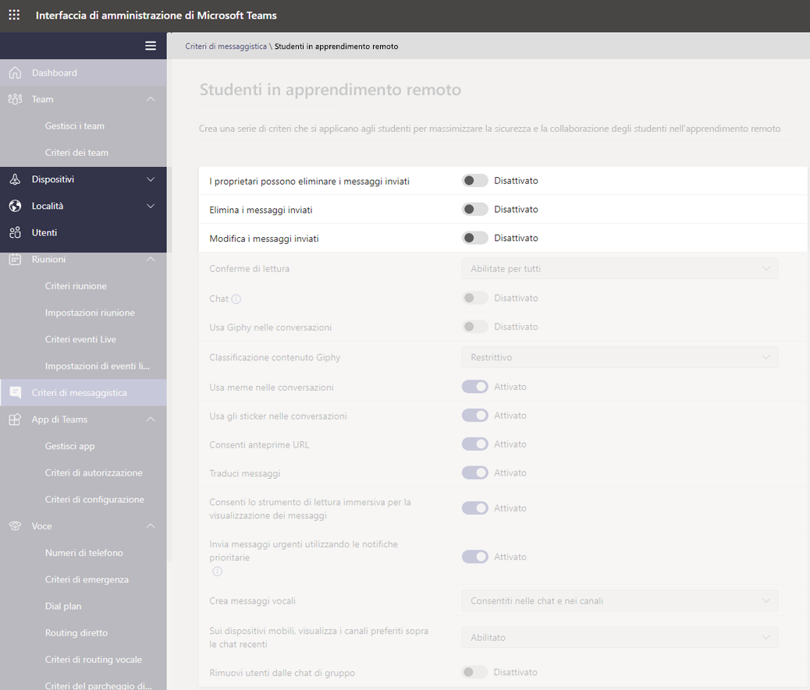

> [!NOTE]
> Per altre informazioni su questo argomento, vedere [Disattivare i commenti degli studenti in un team di classe](https://support.office.com/article/Mute-student-comments-in-a-class-team-a378de16-ffc0-420c-b08d-e17ec08e7c17).

#### Controllare se gli studenti possono chattare in privato

Assicurarsi che il valore dell'opzione **Chat** (attivata/disattivata) impostato per gli studenti sia allineato alle linee guida dell'istituto di istruzione, oltre che alle esigenze di studenti e docenti. Questo controllo attiva o disattiva la possibilità per un utente di comunicare privatamente in chat 1:1 o chat di gruppo in Teams.

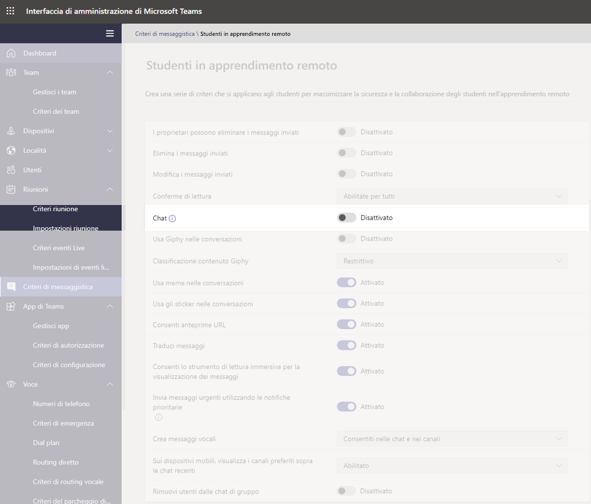

#### Controllare se gli studenti possono personalizzare i propri messaggi

Assicurarsi che il valore impostato per gli studenti sia allineata alle linee guida dell'istituto di istruzione, oltre che alle esigenze di studenti, docenti, genitori e tutori. È consigliabile **disattivare** l'**uso di Giphy** per gli studenti e mantenere **attivato** l'**uso di meme e sticker**.

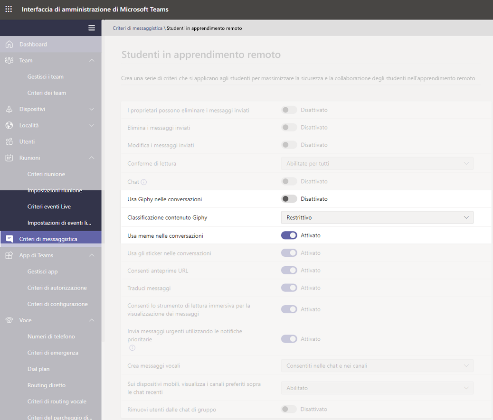

#### Controllare se gli studenti possono creare messaggi vocali

Assicurarsi che il valore dell'opzione **Crea messaggi vocali** impostato per gli studenti sia allineato alle linee guida dell'istituto di istruzione, oltre che alle esigenze di studenti e docenti.

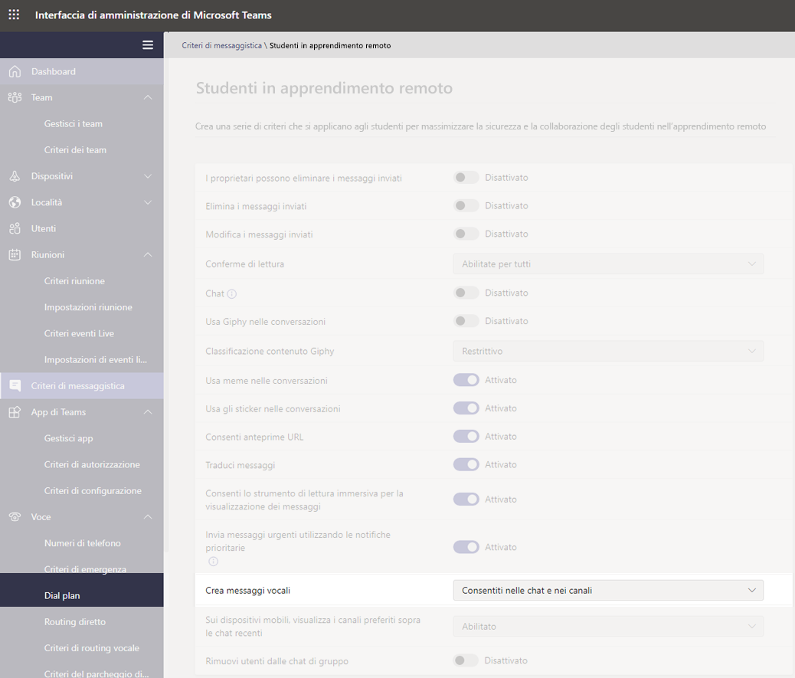

#### Disattivare la possibilità per gli studenti di rimuovere utenti dalla chat

Gli studenti non dovrebbero avere la capacità di rimuovere altri utenti da qualsiasi chat in cui sono inclusi. L'impostazione **Rimuovi utenti dalle chat di gruppo** va **disattivata**.

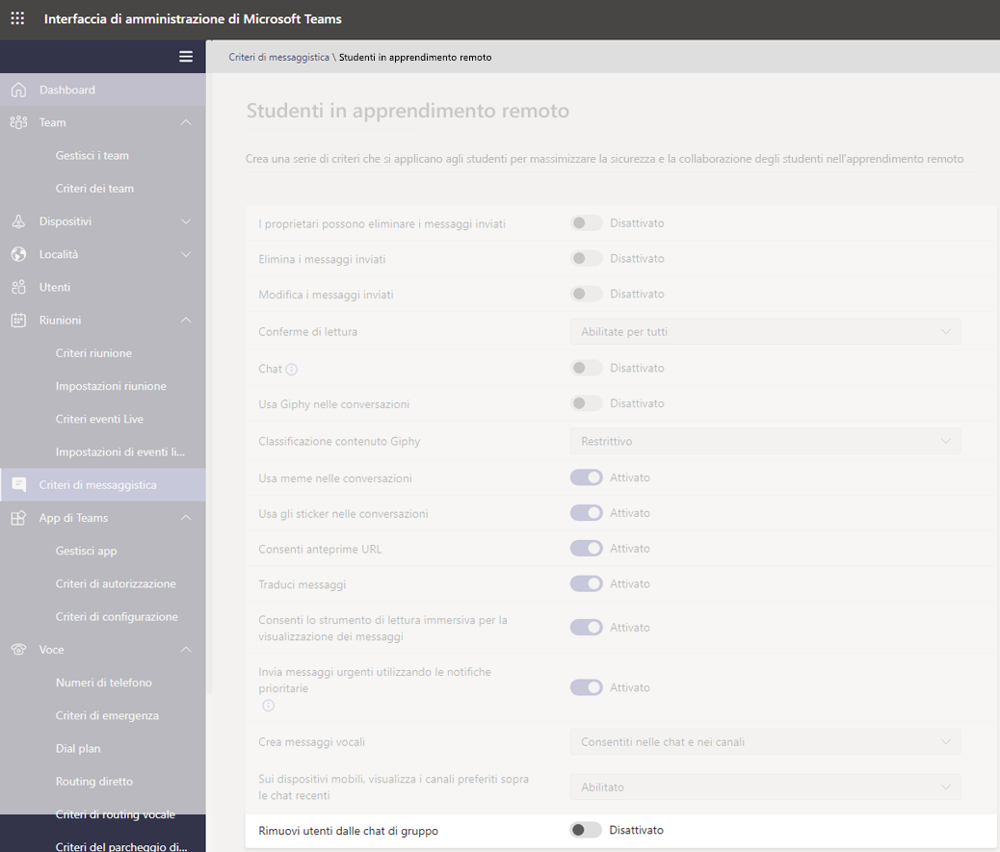

### Criteri di Teams per gli studenti

#### Disattivare la possibilità di individuare e creare canali privati

Per fare in modo che gli studenti non possano creare un canale privato come spazio personale per comunicare senza supervisione, impostare **Crea canali privati** per gli studenti su **disattivato**.

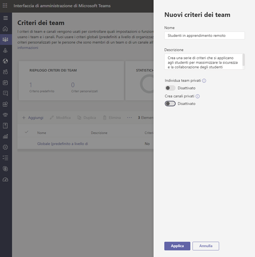

> [!IMPORTANT]
> Probabilmente si vorrà anche evitare che gli studenti possano creare nuovi team in Microsoft Teams. Questa in realtà è un'opzione dei gruppi di Microsoft 365. Altre informazioni in proposito sono disponibili [Gestire chi può creare gruppi di Microsoft 365](https://docs.microsoft.com/microsoft-365/admin/create-groups/manage-creation-of-groups).

### Criteri di autorizzazione app per gli studenti

#### Controllare se gli studenti possono aggiungere app in Teams

Assicurarsi che i valori impostati per gli studenti siano allineati alle linee guida dell'istituto di istruzione. Ad esempio, se si vuole che gli studenti abbiano accesso alle app approvate, è possibile selezionare:

- **App Microsoft**: **Consenti tutte le app**
- **App di terze parti**: **Consenti app specifiche e blocca tutte le altre**
- **App tenant**: **Consenti app specifiche e blocca tutte le altre**

:::image type="content" source="media/edu-policies-apps.png" alt-text="Pagina per gli studenti in apprendimento remoto con le opzioni per le app impostate.":::

> [!NOTE]
> Questo è solo un esempio e, come indicato in precedenza, questi criteri vanno impostati in base alle linee guida dell'istituto di istruzione.

## Criteri che è opportuno assegnare per i docenti

Queste sono le impostazioni dei criteri che si consiglia agli amministratori di applicare ai docenti, in modo che possano offrire un'esperienza sicura nella classe per gli studenti.

> [!NOTE]
> I suggerimenti per i criteri per gli studenti contengono più informazioni rispetto alle sezioni per i docenti mostrate di seguito. Anche se è possibile configurare le impostazioni dei criteri sulla base dei criteri e delle procedure del proprio istituto di istruzione, le indicazioni fornite in questo articolo sono particolarmente rilevanti per la sicurezza degli studenti.

### Criteri di riunione per i docenti

Queste impostazioni consentiranno ai docenti di controllare l'accesso alle riunioni.

- **Consenti alle persone anonime di avviare una riunione**: **disattivato**
- **Ammetti automaticamente le persone**: **Tutti gli utenti dell'organizzazione**
- **Consenti agli utenti che chiamano di ignorare la sala di attesa**: **disattivato**
- 1**DesignatedPresenterRoleMode**: **OrganizerOnlyUserOverride**

1 Questa impostazione non è presente nell'interfaccia di amministrazione di Microsoft Teams, quindi è necessario usare PowerShell per impostare il parametro **DesignatedPresenterRoleMode** usando il cmdlet [Set-CsTeamsMeetingPolicy](https://docs.microsoft.com/powershell/module/skype/set-csteamsmeetingpolicy) o [New-CsTeamsMeetingPolicy](https://docs.microsoft.com/powershell/module/skype/new-csteamsmeetingpolicy). Imposta il valore predefinito dell'impostazione **Chi può essere un relatore?** nelle **Opzioni riunione** in Teams su **Solo io**. Con questa opzione, solo l'organizzatore della riunione può essere un relatore, mentre tutti gli altri partecipanti alla riunione sono designati come partecipanti. Per altre informazioni, vedere [Impostazioni dei criteri di riunione - Modalità ruolo relatore designato](meeting-policies-in-teams.md#meeting-policy-settings---designated-presenter-role-mode).

> [!NOTE]
> Per i membri del personale che non sono docenti, è possibile impostare il parametro su **EveryoneUserOverride**, che corrisponde all'impostazione **Tutti** in Teams, o su **EveryoneInCompanyUserOverride**, che corrisponde all'impostazione **Utenti dell'organizzazione** in Teams.

### Criteri di messaggistica

Impostare l'opzione **I proprietari possono eliminare i messaggi inviati** come **attivata** permetterà ai docenti di monitorare le sessioni di chat e rimuovere i messaggi non appropriati nelle riunioni di canale.

> [!NOTE]
> In questo modo, i docenti potranno rimuovere i messaggi non appropriati nelle chat di classe quando si crea una riunione nel canale oppure di rimuovere messaggi nel canale stesso.

## Cosa possono fare i docenti per proteggere gli studenti

Naturalmente, anche se la configurazione di criteri è un ottimo modo per gli amministratori di proteggere in modo proattivo gli studenti in Teams, le persone che interagiscono regolarmente con gli studenti sono i docenti, che svolgono un ruolo fondamentale nel garantirne la sicurezza. Gli amministratori potranno voler discutere delle informazioni seguenti con gli insegnanti con cui lavorano.

### Impostare i ruoli assunti nelle riunioni tramite le opzioni riunione

Le opzioni riunione consentono di controllare se gli utenti si uniscono alle riunioni come partecipanti o come relatori. Le opzioni disponibili sono:

- Aprire il **Calendario** e passare alla riunione da aggiornare. Toccare o fare clic su **Opzioni riunione** accanto al collegamento per partecipare alla riunione per aprire **Opzioni riunione**.

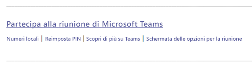

- Controllare chi può partecipare alla riunione direttamente con l'opzione **Chi può evitare la sala di attesa**. Impostare **Persone dell'organizzazione** per impedire l'accesso agli utenti esterni e impostare **Consenti sempre ai chiamanti di ignorare la sala di attesa** su **disattivato** per fare in modo che i partecipanti attendano di essere ammessi alla riunione anziché entrare direttamente. È anche possibile **attivare** l'opzione **Avvisa quando i chiamanti partecipano o abbandonano** per essere sempre informati su chi è presente a una riunione.

- Controllare chi partecipa alla riunione come relatore o partecipante. È possibile selezionare **Solo io** per designare tutti gli altri come partecipanti. Questa è la configurazione più sicura per le riunioni tenute in un ambiente di classe.

  - Se si prevede di avere più relatori nella riunione, selezionare **Persone specifiche** e scegliere gli altri utenti che devono partecipare come relatori. Selezionare **Tutti** se si vuole che tutti partecipino alla riunione come relatori.

:::image type="content" source="media/edu-meeting-options.png" alt-text="Elenco a discesa Chi può evitare la sala di attesa? con Persone dell'organizzazione selezionato ed elenco a discesa Chi può essere un relatore? con l'opzione Solo io selezionata.":::

### Ruoli in una riunione online

A ogni partecipante a una riunione viene assegnato il ruolo di relatore o partecipante. Il ruolo di un partecipante controlla cosa può fare in una riunione. Vedere la tabella seguente.

|Capacità  |Organizzatore/Relatore  |Partecipante  |
|---------|---------|---------|
|Parlare e condividere il video     |     S     |     S     |
|Partecipare alla chat della riunione     |     S     |     S     |
|Visualizzare in privato un file di PowerPoint condiviso da un altro utente     |     S     |     S     |
|Condividere il contenuto     |     S     |     N     |
|Disattivare l'audio degli altri partecipanti|     S     |     N     |
|Rimuovere partecipanti      |     S     |     N     |
|Ammettere partecipanti dalla sala di attesa|     S     |     N     |
|Modificare i ruoli di altri partecipanti     |     S     |     N     |
|Interrompere o avviare la registrazione     |     S     |     N     |

### Modificare i ruoli durante una riunione

A ogni partecipante a una riunione viene assegnato un ruolo di relatore o partecipante. Il ruolo di un partecipante controlla cosa può fare durante una riunione.

- Per cambiare il ruolo di un partecipante, fare clic o toccare **Mostra partecipanti** nei controlli delle chiamate. Fare clic con il pulsante destro del mouse sul partecipante di cui occorre modificare il ruolo e scegliere **Imposta come partecipante** o **Imposta come relatore**.

  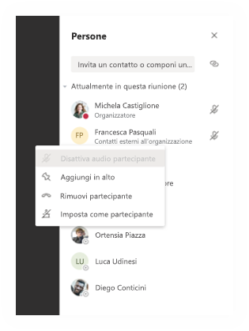

- Per accedere rapidamente alle opzioni di riunione e modificare le impostazioni relative al ruolo nella riunione sia per i partecipanti correnti che per chi si unirà alla riunione in futuro, fare clic o toccare **Altre azioni** nei controlli per le chiamate e quindi scegliere **Mostra dettagli della riunione**. È possibile trovare il collegamento **Opzioni riunione** accanto al collegamento per partecipare alla riunione.

  :::image type="content" source="media/edu-meeting-details.png" alt-text="Finestra della riunione con il riquadro Dettagli riunione sul lato destro.":::

### Disattivare i commenti degli studenti

Al termine della riunione, è possibile impedire agli studenti di continuare a commentare se è stata pianificata una riunione di canale.

#### Per una riunione specifica

Quando si pianifica una riunione in un canale, la riunione stessa è un post del canale e le chat della riunione sono risposte al post. Il proprietario del team può toccare o fare clic su **Altre azioni** per il post e fare clic su **Modifica**.

:::image type="content" source="media/edu-meeting-edit.png" alt-text="Scelta di Altre opzioni in un post del canale e visualizzazione dell'opzione di menu Modifica come seconda opzione nel menu a comparsa.":::

Nel riquadro di modifica c'è un elenco a discesa in cui è possibile impostare l'opzione **Tu e i moderatori potete rispondere**.

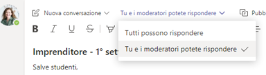

### Per tutte le riunioni e i post di un team

È possibile controllare quando gli studenti possono pubblicare e rispondere nel team di classe e nelle chat delle riunioni. Toccare o fare clic su **Altre azioni** del team, fare clic su **Gestisci team**, passare a **Membri** e selezionare **Disattiva l'audio di tutti gli studenti** oppure le persone di cui disattivare l'audio.

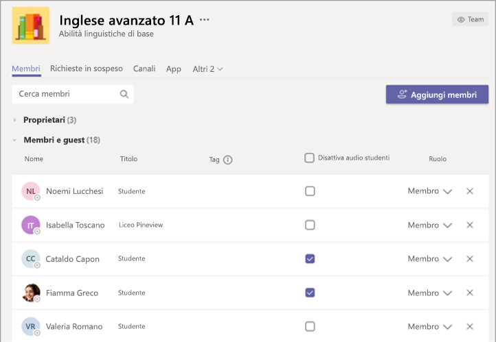

## Altre informazioni

Per altre informazioni sulla protezione degli studenti, vedere[Mantenere al sicuro gli studenti durante l'uso delle riunioni in Teams per l'apprendimento a distanza](https://support.office.com/article/keeping-students-safe-while-using-meetings-in-teams-for-distance-learning-f00fa399-0473-4d31-ab72-644c137e11c8).
