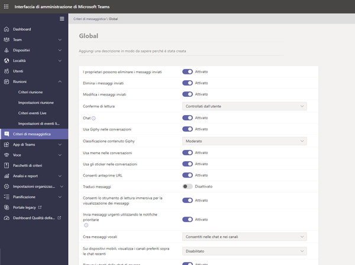
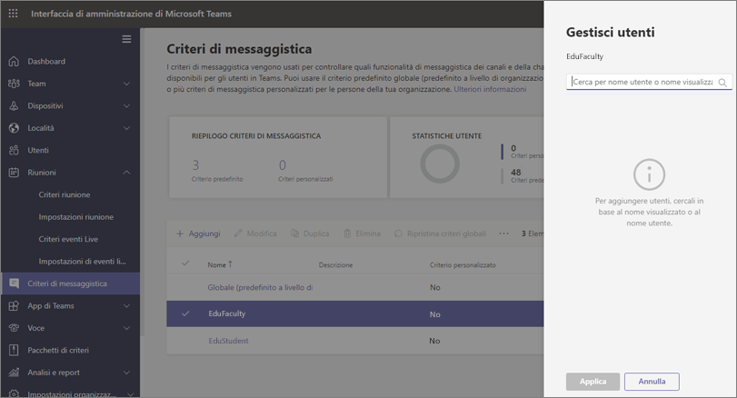
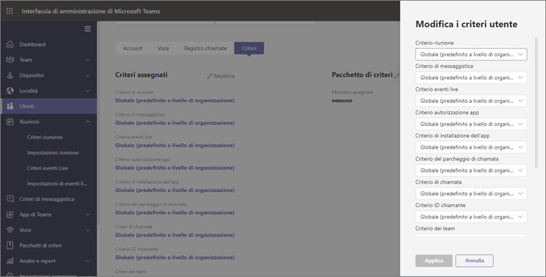

# Criteri e pacchetti di criteri di Teams per l'istruzione

[!INCLUDE [policy-wizard-edu](includes/policy-wizard-edu.md)]

> [!NOTE]
> Per informazioni approfondite sui criteri in Microsoft Teams, vedere [Assegnare i criteri agli utenti in Microsoft Teams](assign-policies.md).

## Amministratori: introduzione alla gestione dei criteri di Microsoft Teams

Microsoft Teams consente agli utenti di svolgere attività come partecipare a riunioni o eventi live, chattare, effettuare chiamate e usare app. Configurare i criteri di amministrazione di Microsoft Teams giusti è un passaggio fondamentale per la creazione di un ambiente di apprendimento sicuro per gli studenti in Teams. Gli amministratori possono usare i criteri per controllare le funzionalità di Teams disponibili per gli utenti dell'istituto di istruzione. Nella maggior parte dei casi, i criteri devono essere modificati per mantenere sicuro l'ambiente per studenti e docenti.  

Ecco un elenco delle aree dei criteri principali disponibili in Microsoft Teams. Per altre informazioni sui criteri di ogni area e delle funzionalità che controllano, usare i link seguenti:

- [Riunioni](meeting-policies-in-teams.md)
- [Eventi live](teams-live-events/configure-teams-live-events.md)
- [Chiamate](teams-calling-policy.md) 
- [Messaggistica](messaging-policies-in-teams.md)
- [Teams](teams-policies.md)
- [Autorizzazioni app](teams-app-permission-policies.md)

:::image type="content" source="media/edu-admin-center-users.png" alt-text="Screenshot di un utente con i criteri applicati.":::

È possibile gestire tutti i criteri di Teams nell'[interfaccia di amministrazione di Microsoft Teams](https://admin.teams.microsoft.com) accedendo con le credenziali di amministratore.

### Dove trovare i criteri di Microsoft Teams

Dopo aver eseguito l'accesso all'interfaccia di amministrazione di Teams, sarà possibile accedere alle impostazioni dei criteri per qualsiasi area di Teams che è necessario gestire, facendo clic sull'opzione dei criteri nel riquadro di spostamento sinistro. Lo screenshot che segue mostra la posizione dei criteri di messaggistica.

:::image type="content" source="media/edu-messaging-policies.png" alt-text="Posizione dei criteri di messaggistica nell'interfaccia di amministrazione di Teams.":::

### Come creare e aggiornare una definizione di criteri

Prima di assegnare criteri agli utenti, è necessario aggiungere e creare definizioni di criteri per ogni area di funzionalità di Teams.

> [!NOTE]
> È consigliabile impostare definizioni di criteri diverse per gli studenti e i docenti.

Per impostazione predefinita, a ogni nuovo utente (studente o docente) verrà assegnato il criterio Globale (predefinito a livello di organizzazione) per ogni area di funzionalità. Raccomandiamo di usare la definizione Globale (predefinita per l'intera organizzazione) per la serie più rigorosa di definizioni dei criteri. Nella maggior parte dei casi, il set di criteri più rigoroso sarà più appropriato per gli studenti. Se si usa la definizione globale dei criteri (impostazione predefinita per l'intera organizzazione) in questo modo, si garantirà che i nuovi abbiano le limitazioni più rigorose quando sono aggiunti al tenant. Per rispettare questa indicazione, raccomandiamo di seguire questi passaggi:

1. Creare un definizione personalizzata dei criteri per ogni area di funzionalità di Teams usando valori dei criteri che siano idonei per i bisogni dei docenti. Altrimenti, i docenti avranno lo stesso accesso limitato degli studenti, come definito nella definizione Globale (predefinita per l'intera organizzazione) dei criteri.

1. Assegnare questi nuove definizioni personalizzate dei criteri ai docenti.

1. Modificare le definizioni Globali (predefinite per l'intera organizzazione) per ogni area di funzionalità, usando valori che siano appropriati per gli studenti.

1. Le definizioni globali dei criteri (predefinite per l'intera organizzazione) saranno applicati agli studenti finché nessun'altra definizione dei criteri è assegnata a loro.

Per creare o modificare definizioni di criteri, passare all'area di funzionalità dei criteri su cui si intenda lavorare, ad esempio Criteri di messaggistica. Selezionare **Aggiungi** per creare una nuova definizione personalizzata dei criteri. Per modificare una definizione dei criteri esistente, selezionare **Modifica**.

:::image type="content" source="media/edu-messaging-policies-add-closeup.png" alt-text="Ingrandimento della sezione dei criteri di messaggistica con pulsante Aggiungi.":::

Che si scelga di aggiungere oppure di modificare una definizione di criteri, si aprirà una visualizzazione in cui sono elencate tutte le opzioni correlate all'area dei criteri corrispondente. Usare questo elenco per selezionare i valori da impostare nella definizione di criteri.

> [!IMPORTANT]
> Non dimenticare di selezionare **Salva** prima di uscire dalla pagina.

### Assegnare definizioni di criteri 
È possibile assegnare definizioni di criteri agli utenti in molti modi. Ogni metodo presenta vantaggi e svantaggi specifici, che variano in base alle esigenze individuali dell'istituto.  

Nella maggior parte dei casi, è consigliabile usare l'assegnazione dei criteri di gruppo per assegnare criteri agli utenti. Questo metodo consente di applicare i criteri più rapidamente e senza interruzioni.  Se un utente viene aggiunto a un gruppo a cui è assegnata una definizione di criteri, il nuovo utente eredita automaticamente i criteri del gruppo.  Questo consente di gestire più facilmente i criteri quando viene aggiunto e rimosso un numero elevato di utenti, ad esempio all'inizio e alla fine di un periodo scolastico.  

Per le organizzazioni di grandi dimensioni, raccomandiamo anche di usare la funzione di assegnazione dei criteri in gruppi, creata su misura per i casi in cui si devono assegnare criteri a grandi gruppi di utenti. Per altre informazioni su questi metodi di applicazione, vedere [Assegnare criteri a grandi gruppi di utenti dell'istituto di istruzione](batch-group-policy-assignment-edu.md).

Se si è un istituto più piccolo o si ha bisogno di aggiornare le impostazioni di uno studente o un docente individuale, seguire le istruzioni seguenti.  

> [!IMPORTANT]
> Le assegnazioni di criteri segute al livello dell'utente individuale sovrascrivono qualsiasi criterio di gruppo assegnato all'utente. Assicurarsi di usare le assegnazioni di criteri individuali solo quando si vuole sovrascrivere le impostazioni dei criteri di gruppo. 

#### Come assegnare una definizione di criteri a un utente

> [!NOTE]
> Per propagare l'assegnazione di una definizione di criteri a tutti gli utenti e i client può occorrere del tempo. Questa operazione può essere utile quando si creano gli account utente in Azure/Microsoft 365 e ogni volta che un nuovo studente si unisce all'istituto di istruzione.

Una volta creata o aggiornata la definizione di criteri, è possibile assegnarla a un utente selezionando **Gestisci utenti** nella pagina dei criteri, cercando l'utente desiderato e quindi applicando il criterio.

È possibile assegnare un criterio a un utente passando a **Utenti**, selezionando l'utente per il quale si vogliono aggiornare i criteri, e quindi selezionando **Criteri** e **Modifica**. Da qui è possibile selezionare la definizione di criteri che si vuole assegnare all'utente per ogni area di funzionalità.

### Pacchetti di criteri in Microsoft Teams
> [!NOTE]
> Vedere [Gestire i pacchetti di criteri in Microsoft Teams](manage-policy-packages.md) per istruzioni dettagliate sull'assegnazione di un pacchetto a singoli utenti, l'assegnazione di pacchetti in blocco a un massimo di 5.000 utenti e la gestione e aggiornamento dei criteri collegati a ogni pacchetto.

Un pacchetto di criteri in Teams raccoglie i criteri predefiniti e le impostazioni dei criteri illustrati in precedenza e li assegna agli utenti con ruoli simili nell'istituto. I pacchetti di criteri semplificano la gestione dei criteri e contribuiscono a garantirne la coerenza. Nella normale prassi è necessario assegnare un pacchetto di criteri a ogni utente e ridefinire i criteri in ogni pacchetto in base alle esigenze di quel gruppo di utenti. Quando si aggiornano le impostazioni di un pacchetto, tutti gli utenti ai quali è assegnato il pacchetto vengono modificati come aggiornamento in blocco.

Gli istituti di istruzione in generale hanno molti utenti con esigenze specifiche, a seconda dell'età e della maturità degli studenti. Ad esempio, si può decidere di concedere ai docenti e al personale l'accesso completo a Microsoft Teams, ma di limitare le funzionalità disponibili agli studenti per promuovere un ambiente di apprendimento sicuro e concentrato. È possibile usare i pacchetti di criteri per personalizzare le impostazioni in base alle esigenze di gruppi diversi nella community dell'istituto di istruzione.

> [!IMPORTANT] 
> La raccomandazione principale è di usare la definizione Globale (predefinita per l'intera organizzazione) dei criteri per gli studenti, invece di un pacchetto di criteri. In questo modo si garantisce che tutti gli utenti dell'organizzazione abbiano sempre il gruppo più rigoroso di criteri appropriati per gli studenti. Se questa raccomandazione non soddisfa le esigenze dell'istituto, uno dei pacchetti di criteri per studenti seguenti può essere una valida alternativa. 

Come per l'elenco dei criteri illustrato in precedenza in questo articolo, i pacchetti di criteri contengono criteri predefiniti per:

- Riunioni
- Eventi live
- Chiamate
- Messaggistica
- Autorizzazioni dell'app

Microsoft Teams attualmente include i pacchetti di criteri seguenti:

|Nome del pacchetto elencato nell'interfaccia di amministrazione di Microsoft Teams |Ideale per  |Descrizione |
|:--- |:--- |:--- |
|**Education_Teacher**| Docenti e personale| Usare questo set di criteri e impostazioni dei criteri per concedere ai docenti e al personale dell'organizzazione l'accesso completo alla chat, alle chiamate e alle riunioni tramite Microsoft Teams. |
|**Education_PrimaryStudent**| Studenti di scuole elementari  | Gli studenti più giovani dell'istituto di istruzione possono avere bisogno di più limiti all'interno di Microsoft Teams. Usare questo set di criteri e impostazioni di criteri per limitare le funzionalità, ad esempio per la creazione e la gestione di riunioni, la gestione delle chat e le chiamate private. |
|**Education_SecondaryStudent**| Studenti di scuole medie o superiori | Gli studenti delle scuole secondarie possono avere bisogno di più limiti all'interno di Microsoft Teams. Usare questo set di criteri e impostazioni di criteri per limitare le funzionalità, ad esempio per la creazione e la gestione di riunioni, la gestione delle chat e le chiamate private. |
|**Education_HigherEducationStudent**| Studenti universitari | Gli studenti universitari possono avere bisogno di meno limiti, ma l'applicazione di alcune limitazioni è comunque consigliata. È possibile usare questo set di criteri e impostazioni di criteri per consentire l'accesso a chat, chiamate e riunioni all'interno dell'organizzazione, limitando però il modo in cui gli studenti usano Microsoft Teams con i partecipanti esterni. |
|**Education_PrimaryTeacher_RemoteLearning**| Docenti e personale | Crea una serie di criteri che si applicano agli insegnanti delle scuole elementari per massimizzare la sicurezza e la collaborazione degli studenti quando si adotta l'apprendimento a distanza. |
|**Education_PrimaryStudent_RemoteLearning**| Studenti di scuole elementari| Crea una serie di criteri che si applicano agli studenti delle scuole elementari per massimizzare la sicurezza e la collaborazione degli studenti quando si adotta l'apprendimento a distanza.
|||

:::image type="content" source="media/edu-policy-packages-list.png" alt-text="Pagina con l'elenco dei pacchetti di criteri tra cui scegliere.":::

A ogni singolo criterio viene assegnato il nome del pacchetto di criteri, in modo da poter identificare i criteri collegati a un pacchetto di criteri. Ad esempio, quando si assegna il pacchetto di criteri Education_Teacher ai docenti dell'istituto di istruzione, viene creato un criterio denominato Education_Teacher per ogni criterio nel pacchetto.

> [!NOTE]
> Se si decide che i docenti e il personale amministrativo hanno bisogno di criteri diversi si può riutilizzare un pacchetto esistente, ossia identificare un pacchetto attualmente in uso e modificare le impostazioni in modo che siano appropriate per quel gruppo. Potrebbe essere necessario prendere nota di quale gruppo abbia un determinato pacchetto, ma questo è l'unico impedimento al riutilizzo di un pacchetto.

## Gestire i pacchetti di criteri

### Visualizzare

Visualizzare le impostazioni di ogni criterio in un pacchetto di criteri prima di assegnare il pacchetto. Nel riquadro di spostamento sinistro dell'interfaccia di amministrazione di Microsoft Teams selezionare **Pacchetti di criteri**, selezionare il nome del pacchetto e quindi selezionare il nome del criterio.

Stabilire se i valori predefiniti sono appropriati per la propria organizzazione o se è necessario personalizzarli in modo da renderli più restrittivi o permissivi.

### Personalizzare

Personalizzare le impostazioni dei criteri nel pacchetto di criteri come necessario per soddisfare le esigenze dell'organizzazione. Le modifiche apportate alle impostazioni dei criteri vengono applicate automaticamente agli utenti ai quali è assegnato il pacchetto. Per modificare le impostazioni di un criterio in un pacchetto di criteri, nell'interfaccia di amministrazione di Microsoft Teams selezionare il pacchetto di criteri, selezionare il nome del criterio da modificare e quindi selezionare **Modifica**.

È possibile modificare le impostazioni dei criteri in un pacchetto anche dopo l'assegnazione. Per altre informazioni, vedere [Personalizzare i criteri in un pacchetto di criteri](manage-policy-packages.md#customize-policies-in-a-policy-package). 

### Assegnare

Assegnare il pacchetto di criteri agli utenti. Se a un utente è assegnato un criterio e successivamente gli si assegna un criterio diverso, avrà priorità l'assegnazione più recente.

> [!NOTE]
> Ogni utente richiederà il componente aggiuntivo Comunicazioni avanzate per ricevere un'assegnazione del pacchetto di criteri personalizzata. Per ulteriori informazioni, vedere [Componente aggiuntivo per comunicazioni avanzate per Microsoft Teams](/microsoftteams/teams-add-on-licensing/advanced-communications).

#### Assegnare un pacchetto di criteri a uno o più utenti

Per assegnare un pacchetto di criteri a uno o più utenti, nel riquadro di spostamento sinistro dell'interfaccia di amministrazione di Microsoft Teams passare a **Pacchetti di criteri** e quindi selezionare **Gestisci utenti**.  

Per altre informazioni, vedere [Assegnare un pacchetto di criteri](manage-policy-packages.md#assign-a-policy-package).

Se a un utente è assegnato un criterio e successivamente gli si assegna un criterio diverso, avrà priorità l'assegnazione più recente.

#### Assegnare un pacchetto di criteri a un gruppo

**Questa funzionalità è in anteprima privata**

L'assegnazione di pacchetti di criteri ai gruppi consente di assegnare più criteri a un gruppo di utenti, ad esempio un gruppo di sicurezza o una lista di distribuzione. L'assegnazione dei criteri viene propagata ai membri del gruppo in base alle regole di precedenza. Quando vengono aggiunti o rimossi membri da un gruppo, le assegnazioni dei criteri ereditate vengono aggiornate di conseguenza. Questo metodo è consigliato per gruppi composti da un massimo di 50.000 utenti, ma funziona anche con i gruppi più grandi.

Per altre informazioni, vedere [Assegnare un pacchetto di criteri a un gruppo](assign-policies.md#assign-a-policy-package-to-a-group).

#### Assegnare un pacchetto di criteri a un set di utenti di grandi dimensioni (batch)

Usare l'assegnazione pacchetti di criteri per batch per assegnare un pacchetto di criteri a grandi set di utenti per volta. Per inviare un batch di utenti e il pacchetto di criteri da assegnare, usare il cmdlet [New-CsBatchPolicyPackageAssignmentOperation](/powershell/module/teams/new-csbatchpolicypackageassignmentoperation). Le assegnazioni vengono elaborate come operazione in background e viene generato un ID operazione per ogni batch.

Un batch può contenere fino a 5.000 utenti. È possibile specificare gli utenti in base all'ID oggetto, all'UPN, all'indirizzo SIP o all'indirizzo di posta elettronica. Per altre informazioni, vedere [Assegnare un pacchetto di criteri a un batch di utenti](assign-policies.md#assign-a-policy-package-to-a-batch-of-users).

## Criteri che è opportuno assegnare per la sicurezza degli studenti

Per altre informazioni sulle misure da attuare per proteggere gli studenti nel proprio ambiente, rivedere attentamente [Proteggere gli studenti durante l'uso di Teams per la didattica a distanza](https://support.office.com/article/keeping-students-safe-while-using-meetings-in-teams-for-distance-learning-f00fa399-0473-4d31-ab72-644c137e11c8).
