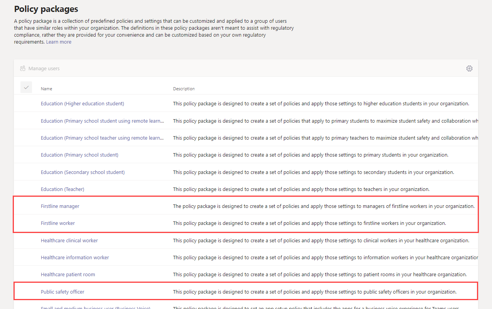

# Pacchetti di criteri per le squadre per enti pubbliciTeams policy packages for government

> [!NOTE]
> I pacchetti di criteri non sono attualmente disponibili nelle distribuzioni governative GCC High o DoD di Microsoft 365.Policy packages are currently not available in Microsoft 365 Government GCC High or DoD deployments.

## PanoramicaOverview

Un [pacchetto di criteri](manage-policy-packages.md) in Microsoft teams è una raccolta di criteri predefiniti e di impostazioni dei criteri che è possibile assegnare agli utenti che hanno ruoli simili nell'organizzazione.A [policy package](manage-policy-packages.md) in Microsoft Teams is a collection of predefined policies and policy settings that you can assign to users who have similar roles in your organization. I pacchetti di criteri semplificano la gestione dei criteri e contribuiscono a garantirne la coerenza.Policy packages simplify, streamline, and help provide consistency when managing policies. È possibile personalizzare le impostazioni dei criteri nel pacchetto in base alle esigenze degli utenti.You can customize the settings of the policies in the package to suit the needs of your users. Quando si modificano le impostazioni dei criteri in un pacchetto di criteri, tutti gli utenti assegnati al pacchetto ottengono le impostazioni aggiornate.When you change the settings of policies in a policy package, all users who are assigned to that package get the updated settings. Puoi gestire i pacchetti di criteri usando l'interfaccia di amministrazione di Microsoft teams o PowerShell.You can manage policy packages by using the Microsoft Teams admin center or PowerShell.

I pacchetti di criteri predefiniscono i criteri per i seguenti elementi, a seconda del pacchetto:Policy packages pre-define policies for the following, depending on the package:

- MessaggisticaMessaging
- RiunioniMeetings
- ChiamateCalling
- Configurazione dell'appApp setup
- Eventi liveLive events

I team attualmente includono i pacchetti di criteri seguenti per il governo.Teams currently includes the following policy packages for government.

|Nome pacchetto nell'interfaccia di amministrazione di Microsoft TeamsPackage name in the Microsoft Teams admin center|Ideale perBest used for|DescrizioneDescription |
|---------|---------|---------|
|Addetto alla sicurezza pubblicaPublic safety officer  |Responsabili della sicurezza pubblica nella propria organizzazione governativaPublic safety officers in your government organization  |Crea un set di criteri e impostazioni dei criteri applicabili agli addetti alla sicurezza pubblica dell'organizzazione.Creates a set of policies and policy settings that apply to public safety officers in your organization. |
|Gestione i FIRSTLINEFirstline manager  |Responsabili di i FIRSTLINE nella propria organizzazione pubblicaFirstline Managers in your government organization |Crea un set di criteri e applica tali impostazioni ai responsabili di I FIRSTLINE dell'organizzazione.Creates a set of policies and applies those settings to Firstline Managers in your organization.|
|Lavoratore i FIRSTLINEFirstline worker  |I FIRSTLINE lavoratori dell'organizzazione governativaFirstline Workers in your government organization |Crea un set di criteri e applica tali impostazioni agli operatori I FIRSTLINE dell'organizzazione.Creates a set of policies and applies those settings to Firstline Workers in your organization.|

A ogni singolo criterio viene assegnato il nome del pacchetto di criteri in modo da poter identificare facilmente i criteri collegati a un pacchetto di criteri.Each individual policy is given the name of the policy package so you can easily identify the policies that are linked to a policy package. Ad esempio, quando si assegna il pacchetto di criteri per gli agenti di sicurezza pubblica agli utenti dell'organizzazione, viene creato un criterio denominato PublicSafety_Officer per ogni criterio nel pacchetto.For example, when you assign the Public safety officer policy package to users in your organization, a policy named PublicSafety_Officer is created for each policy in the package.

## Gestire i pacchetti di criteriManage policy packages

### VisualizzazioneView

Visualizzare le impostazioni di ogni criterio in un pacchetto di criteri prima di assegnare un pacchetto.View the settings of each policy in a policy package before you assign a package. Nella barra di spostamento sinistra dell'interfaccia di amministrazione di Microsoft teams selezionare **pacchetti di criteri**, selezionare il nome del pacchetto e quindi selezionare il nome del criterio.In the left navigation of the Microsoft Teams admin center, select **Policy packages**, select the package name, and then select the policy name.

Decidere se i valori predefiniti sono appropriati per l'organizzazione o se è necessario personalizzarli per essere più restrittivi o indulgenti in base alle esigenze dell'organizzazione.Decide whether the predefined values are appropriate for your organization or whether you need to customize them to be more restrictive or lenient based on your organization's needs.

### PersonalizzaCustomize

Personalizzare le impostazioni dei criteri nel pacchetto dei criteri, se necessario, in base alle esigenze dell'organizzazione.Customize the settings of policies in the policy package, as needed, to fit the needs of your organization. Tutte le modifiche apportate alle impostazioni dei criteri vengono applicate automaticamente agli utenti a cui è stato assegnato il pacchetto.Any changes you make to policy settings are automatically applied to users who are assigned the package. Per modificare le impostazioni di un criterio in un pacchetto di criteri, nell'interfaccia di amministrazione di Microsoft teams selezionare il pacchetto di criteri, selezionare il nome del criterio che si vuole modificare e quindi selezionare **modifica**.To edit the settings of a policy in a policy package, in the Microsoft Teams admin center, select the policy package, select the name of the policy you want to edit, and then select **Edit**.

Tieni presente che puoi anche modificare le impostazioni dei criteri in un pacchetto dopo l'assegnazione del pacchetto di criteri.Keep in mind that you can also change the settings of policies in a package after you assign the policy package. Per altre informazioni, vedere [personalizzare i criteri in un pacchetto di criteri](manage-policy-packages.md#customize-policies-in-a-policy-package).To learn more, see [Customize policies in a policy package](manage-policy-packages.md#customize-policies-in-a-policy-package). 

### AssegnareAssign

Assegnare il pacchetto di criteri agli utenti.Assign the policy package to users. Per assegnare un pacchetto di criteri a uno o più utenti, fare clic su **Gestisci utenti**.To assign a policy package to one or multiple users, click **Manage users**. È anche possibile [usare PowerShell](https://docs.microsoft.com/powershell/module/teams/new-csbatchpolicypackageassignmentoperation) per assegnare un pacchetto di criteri ai batch di grandi dimensioni degli utenti.You can also [use PowerShell](https://docs.microsoft.com/powershell/module/teams/new-csbatchpolicypackageassignmentoperation) to assign a policy package to large batches of users. 

Per istruzioni su come assegnare un pacchetto di criteri usando l'interfaccia di amministrazione di Microsoft teams o PowerShell, vedere [assegnare un pacchetto di criteri](manage-policy-packages.md#assign-a-policy-package).For steps on how to assign a policy package using the Microsoft Teams admin center or PowerShell, see [Assign a policy package](manage-policy-packages.md#assign-a-policy-package).

Se un utente ha un criterio assegnato e in seguito si assegna un criterio diverso, l'assegnazione più recente avrà la priorità.If a user has a policy assigned, and then later you assign a different policy, the most recent assignment will take priority.

## Argomenti correlatiRelated topics

[Gestire i pacchetti di criteri in TeamsManage policy packages in Teams](manage-policy-packages.md)

[Assegnare criteri agli utenti in teamsAssign policies to your users in Teams](assign-policies.md) 
