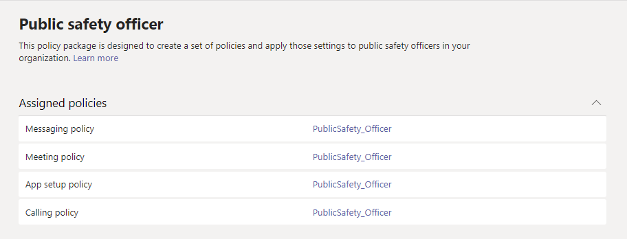

# Pacchetti di criteri per le squadre per enti pubblici

> [!NOTE]
> I pacchetti di criteri non sono attualmente disponibili nelle distribuzioni governative GCC High o DoD di Microsoft 365.

## Panoramica

Un [pacchetto di criteri](manage-policy-packages.md) in Microsoft teams è una raccolta di criteri predefiniti e di impostazioni dei criteri che è possibile assegnare agli utenti che hanno ruoli simili nell'organizzazione. I pacchetti di criteri semplificano la gestione dei criteri e contribuiscono a garantirne la coerenza. È possibile personalizzare le impostazioni dei criteri nel pacchetto in base alle esigenze degli utenti. Quando si modificano le impostazioni dei criteri in un pacchetto di criteri, tutti gli utenti assegnati al pacchetto ottengono le impostazioni aggiornate. Puoi gestire i pacchetti di criteri usando l'interfaccia di amministrazione di Microsoft teams o PowerShell.

I pacchetti di criteri predefiniscono i criteri per i seguenti elementi, a seconda del pacchetto:

- Messaggistica
- Riunioni
- Chiamate
- Configurazione dell'app
- Eventi live

I team attualmente includono i pacchetti di criteri seguenti per il governo.

|Nome pacchetto nell'interfaccia di amministrazione di Microsoft Teams|Ideale per|Descrizione |
|---------|---------|---------|
|Addetto alla sicurezza pubblica  |Responsabili della sicurezza pubblica nella propria organizzazione governativa  |Crea un set di criteri e impostazioni dei criteri applicabili agli addetti alla sicurezza pubblica dell'organizzazione. |
|Frontline Manager  |Responsabili di Frontline nell'organizzazione governativa |Crea un set di criteri e applica tali impostazioni ai responsabili di Frontline nell'organizzazione.|
|Lavoratore Frontline  |Lavoratori in prima linea nella tua organizzazione governativa |Crea un set di criteri e applica tali impostazioni agli operatori Frontline dell'organizzazione.|

A ogni singolo criterio viene assegnato il nome del pacchetto di criteri in modo da poter identificare facilmente i criteri collegati a un pacchetto di criteri. Ad esempio, quando si assegna il pacchetto di criteri per gli agenti di sicurezza pubblica agli utenti dell'organizzazione, viene creato un criterio denominato PublicSafety_Officer per ogni criterio nel pacchetto.

## Gestire i pacchetti di criteri

### Visualizzare

Visualizzare le impostazioni di ogni criterio in un pacchetto di criteri prima di assegnare il pacchetto. Nel riquadro di spostamento sinistro dell'interfaccia di amministrazione di Microsoft Teams selezionare **Pacchetti di criteri**, selezionare il nome del pacchetto e quindi selezionare il nome del criterio.

Stabilire se i valori predefiniti sono appropriati per la propria organizzazione o se è necessario personalizzarli in modo da renderli più restrittivi o permissivi.

### Personalizzare

Personalizzare le impostazioni dei criteri nel pacchetto di criteri come necessario per soddisfare le esigenze dell'organizzazione. Le modifiche apportate alle impostazioni dei criteri vengono applicate automaticamente agli utenti ai quali è assegnato il pacchetto. Per modificare le impostazioni di un criterio in un pacchetto di criteri, nell'interfaccia di amministrazione di Microsoft Teams selezionare il pacchetto di criteri, selezionare il nome del criterio da modificare e quindi selezionare **Modifica**.

È possibile modificare le impostazioni dei criteri in un pacchetto anche dopo l'assegnazione. Per altre informazioni, vedere [Personalizzare i criteri in un pacchetto di criteri](manage-policy-packages.md#customize-policies-in-a-policy-package). 

### Assegnare

Assegnare il pacchetto di criteri agli utenti. Se a un utente è assegnato un criterio e successivamente gli si assegna un criterio diverso, avrà priorità l'assegnazione più recente.

#### Assegnare un pacchetto di criteri a uno o più utenti

Per assegnare un pacchetto di criteri a uno o più utenti, nel riquadro di spostamento sinistro dell'interfaccia di amministrazione di Microsoft Teams passare a **Pacchetti di criteri** e quindi selezionare **Gestisci utenti**.  

Per altre informazioni, vedere [Assegnare un pacchetto di criteri](manage-policy-packages.md#assign-a-policy-package).

Se a un utente è assegnato un criterio e successivamente gli si assegna un criterio diverso, avrà priorità l'assegnazione più recente.

#### Assegnare un pacchetto di criteri a un gruppo

**Questa funzionalità è in anteprima privata**

L'assegnazione di pacchetti di criteri ai gruppi consente di assegnare più criteri a un gruppo di utenti, ad esempio un gruppo di sicurezza o una lista di distribuzione. L'assegnazione dei criteri viene propagata ai membri del gruppo in base alle regole di precedenza. Quando vengono aggiunti o rimossi membri da un gruppo, le assegnazioni dei criteri ereditate vengono aggiornate di conseguenza. Questo metodo è consigliato per gruppi composti da un massimo di 50.000 utenti, ma funziona anche con i gruppi più grandi.

Per altre informazioni, vedere [Assegnare un pacchetto di criteri a un gruppo](assign-policies.md#assign-a-policy-package-to-a-group).

#### Assegnare un pacchetto di criteri a un set di utenti di grandi dimensioni (batch)

Usare l'assegnazione pacchetti di criteri per batch per assegnare un pacchetto di criteri a grandi set di utenti per volta. Per inviare un batch di utenti e il pacchetto di criteri da assegnare, usare il cmdlet [New-CsBatchPolicyPackageAssignmentOperation](https://docs.microsoft.com/powershell/module/teams/new-csbatchpolicypackageassignmentoperation). Le assegnazioni vengono elaborate come operazione in background e viene generato un ID operazione per ogni batch.

Un batch può contenere fino a 5.000 utenti. È possibile specificare gli utenti in base all'ID oggetto, all'UPN, all'indirizzo SIP o all'indirizzo di posta elettronica. Per altre informazioni, vedere [Assegnare un pacchetto di criteri a un batch di utenti](assign-policies.md#assign-a-policy-package-to-a-batch-of-users).

## Argomenti correlati

[Gestire i pacchetti di criteri in Teams](manage-policy-packages.md)

[Assegnare i criteri agli utenti in Teams](assign-policies.md) 
