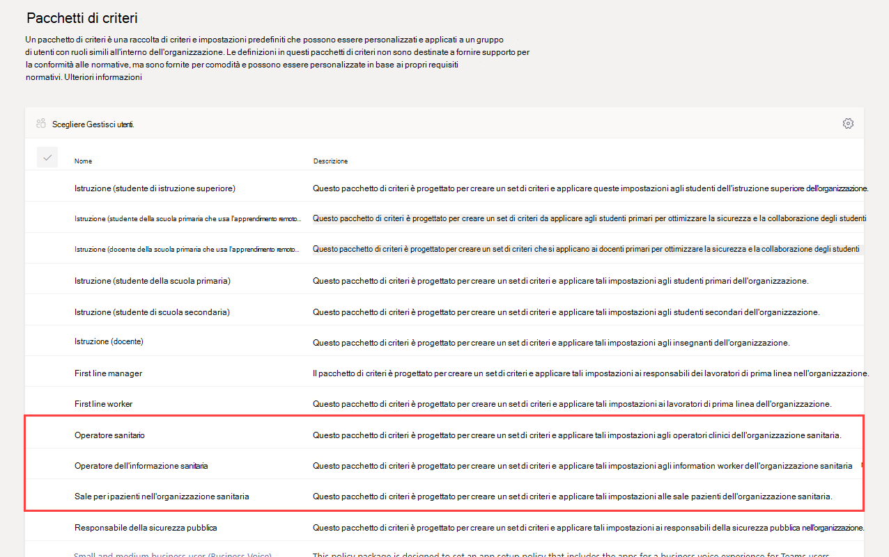
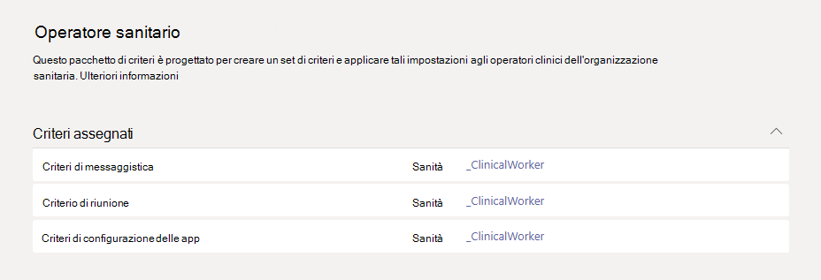
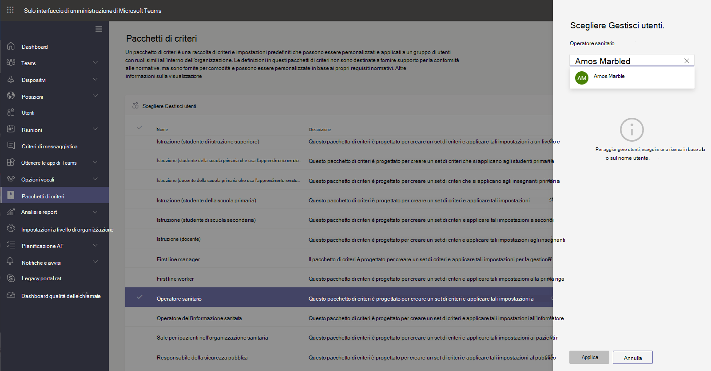

# Pacchetti di criteri di Teams per il settore sanitario

## Panoramica

Un [Pacchetto di criteri](manage-policy-packages.md) in Microsoft Teams è una raccolta di criteri e impostazioni predefiniti da assegnare agli utenti con ruoli simili nell'organizzazione. I pacchetti di criteri semplificano la gestione dei criteri e contribuiscono a garantirne la coerenza. È possibile personalizzare le impostazioni dei criteri del pacchetto in base alle esigenze degli utenti. Quando si modificano le impostazioni dei criteri in un pacchetto di criteri, tutti gli utenti assegnati al pacchetto ottengono le impostazioni aggiornate. È possibile gestire i pacchetti dei criteri tramite l'interfaccia di amministrazione di Microsoft Teams o PowerShell.

> [!VIDEO https://www.microsoft.com/videoplayer/embed/RE4Ht2o]

I pacchetti di criteri predefiniscono i criteri per gli elementi seguenti, a seconda del pacchetto:

- Messaggistica
- Riunioni
- Chiamate
- Configurazione delle app
- Eventi live

Teams attualmente include i pacchetti di criteri per il settore sanitario seguenti.

|Nome del pacchetto nell'interfaccia di amministrazione di Microsoft Teams|Ideale per|Descrizione |
|---------|---------|---------|
|Operatore sanitario  |Operatori sanitari in organizzazioni nel settore sanitario  |Creare un set e impostazioni di criteri che forniscano agli operatori sanitari, ad esempio infermieri, medici e operatori sociali accesso completo alle chat, alle chiamate, alla gestione dei turni e alle riunioni. |
|Operatore dell'informazione sanitaria  |Operatori dell'informazione in organizzazioni del settore sanitario |Crea un set di criteri e impostazioni di criteri che forniscono agli operatori dell'informazione, ad esempio personale in ambito IT e finanziario, responsabili della conformità, accesso completo alle chat, alle chiamate e alle riunioni.|
|Sale per i pazienti nell'organizzazione sanitaria  |Dispositivi per le sale dei pazienti|Crea un set di criteri e impostazioni di criteri da applicare alle sale dei pazienti nell'organizzazione sanitaria.|

A ogni singolo criterio viene assegnato il nome del pacchetto di criteri, in modo da poter identificare facilmente i criteri collegati a un determinato pacchetto di criteri. Ad esempio, quando si assegna il pacchetto di criteri per gli operatori sanitari nell'organizzazione, viene creato un criterio denominato Healthcare_ClinicalWorker per ogni criterio presente nel pacchetto.

## Introduzione ai pacchetti di criteri

Per un'introduzione ai pacchetti di criteri del settore sanitario, nell'hub di onboarding dell'interfaccia di amministrazione Microsoft selezionare **Assistenza sanitaria** poi **Assegna le impostazioni dei criteri in base al ruolo**. Quando si è pronti per iniziare, decidere a quali pacchetti di criteri si desidera assegnare gli utenti dell'organizzazione.

Selezionare **Visualizza dettagli dei criteri** per altre informazioni sui criteri specifici in un pacchetto e sulle relative impostazioni. Tali impostazioni [possono essere personalizzate](manage-policy-packages.md#customize-policies-in-a-policy-package) dopo l'assegnazione nell'interfaccia di amministrazione di Teams.

Scegliere uno o più pacchetti da assegnare poi fare clic su **Avanti**. È possibile cercare e aggiungere utenti al pacchetto di criteri in base al loro ruolo. Non è possibile assegnare un utente a più pacchetti di criteri contemporaneamente.

Dopo aver aggiunto gli utenti al pacchetto di criteri appropriato, fare clic **Fine** per salvare le selezioni. È possibile continuare a personalizzare e gestire i pacchetti dei criteri nell'interfaccia di amministrazione di Microsoft Teams.

## Gestire i pacchetti di criteri

### Visualizzare

Visualizzare le impostazioni di ogni criterio in un pacchetto di criteri prima di assegnare il pacchetto. Nel riquadro di spostamento a sinistra dell'interfaccia di amministrazione di Microsoft Teams passare a **Pacchetti di criteri**, selezionare il nome del pacchetto poi selezionare il nome del criterio.

Stabilire se i valori predefiniti sono appropriati per la propria organizzazione o se è necessario personalizzarli in modo da renderli più restrittivi o permissivi.

### Personalizzare

Personalizzare le impostazioni dei criteri nel pacchetto di criteri come necessario per soddisfare le esigenze dell'organizzazione. Le modifiche apportate alle impostazioni dei criteri vengono applicate automaticamente agli utenti ai quali è assegnato il pacchetto. Per modificare le impostazioni di un criterio in un pacchetto di criteri, nel riquadro di spostamento a sinistra nell'interfaccia di amministrazione di Microsoft Teams passare a **Pacchetto di criteri** e selezionare il nome del criterio che si desidera modificare poi selezionare **Modifica**.

È possibile modificare le impostazioni dei criteri in un pacchetto anche dopo l'assegnazione. Per altre informazioni, vedere [Personalizzare i criteri in un pacchetto di criteri](manage-policy-packages.md#customize-policies-in-a-policy-package).

### Assegnare

Assegnare il pacchetto di criteri agli utenti. Se a un utente è assegnato un criterio e successivamente gli si assegna un criterio diverso, avrà priorità l'assegnazione più recente.

> [!NOTE]
> Ogni utente richiederà il componente aggiuntivo Advanced Communications per ricevere un'assegnazione di pacchetti di criteri personalizzati. Per altre informazioni, vedere [Componente aggiuntivo Comunicazioni avanzate per Microsoft Teams](/microsoftteams/teams-add-on-licensing/advanced-communications).

#### Assegnare un pacchetto di criteri a uno o più utenti

Per assegnare un pacchetto di criteri a uno o più utenti, nel riquadro di spostamento sinistro dell'interfaccia di amministrazione di Microsoft Teams passare a **Pacchetti di criteri** e quindi selezionare **Gestisci utenti**.  

Per altre informazioni, vedere [Assegnare un pacchetto di criteri](manage-policy-packages.md#assign-a-policy-package).

Se a un utente è assegnato un criterio e successivamente gli si assegna un criterio diverso, avrà priorità l'assegnazione più recente.

#### Assegnare un pacchetto di criteri a un gruppo

**Questa funzionalità è in anteprima privata**

L'assegnazione di pacchetti di criteri ai gruppi consente di assegnare più criteri a un gruppo di utenti, ad esempio un gruppo di sicurezza o una lista di distribuzione. L'assegnazione dei criteri viene propagata ai membri del gruppo in base alle regole di precedenza. Quando vengono aggiunti o rimossi membri da un gruppo, le assegnazioni dei criteri ereditate vengono aggiornate di conseguenza. Questo metodo è consigliato per gruppi composti da un massimo di 50.000 utenti, ma funziona anche con i gruppi più grandi.

Per altre informazioni, vedere [Assegnare un pacchetto di criteri a un gruppo](assign-policies.md#assign-a-policy-package-to-a-group).

#### Assegnare un pacchetto di criteri a un set di utenti di grandi dimensioni (batch)

Usare l'assegnazione pacchetti di criteri per batch per assegnare un pacchetto di criteri a grandi set di utenti per volta. Per inviare un batch di utenti e il pacchetto di criteri da assegnare, usare il cmdlet [New-CsBatchPolicyPackageAssignmentOperation](/powershell/module/teams/new-csbatchpolicypackageassignmentoperation). Le assegnazioni vengono elaborate come operazione in background e viene generato un ID operazione per ogni batch.

Un batch può contenere fino a 5.000 utenti. È possibile specificare gli utenti in base all'ID oggetto, all'UPN, all'indirizzo SIP o all'indirizzo di posta elettronica. Per altre informazioni, vedere [Assegnare un pacchetto di criteri a un batch di utenti](assign-policies.md#assign-a-policy-package-to-a-batch-of-users).

## Argomenti correlati

[Gestire i pacchetti di criteri in Teams](manage-policy-packages.md)

[Assegnare pacchetti di criteri a utenti e gruppi](assign-policy-packages.md)
