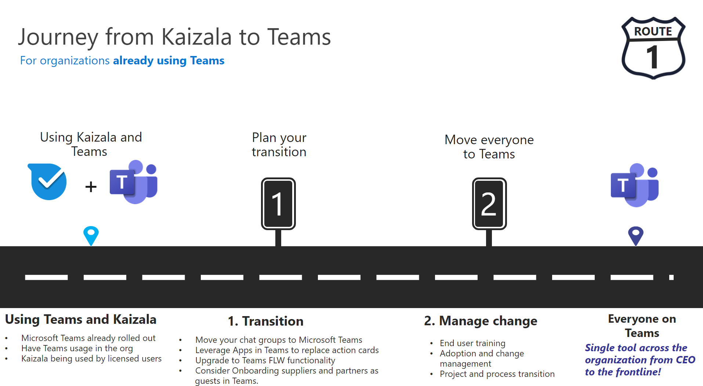

# Grafico del percorso da Kaizala a TeamsCharting your Kaizala to Teams journey

Hai deciso che la tua organizzazione è pronta per passare da Kaizala a Microsoft Teams.You’ve decided that your organization is ready to move from Kaizala to Microsoft Teams. Prima di iniziare, è importante comprendere le esigenze di collaborazione dell'organizzazione prima di eseguire la transizione.Before getting started, it's important to understand your organization’s collaboration needs before transitioning. Qual è l'aspetto delle comunicazioni di successo per l'organizzazione?What does successful communication look like for your organization? Quali preparativi saranno necessari all'organizzazione per il trasferimento?What preparations will your organization need to make for the move? Per rispondere a queste domande, è necessario considerare i gruppi di utenti dell'organizzazione e le specifiche esigenze di collaborazione.To answer these questions, you'll need to consider your organization's user groups and their unique collaboration needs. Le esigenze specifiche della forza lavoro determineranno il percorso da intraprendere in Teams.Your workforce's unique needs will determine what path you will take to Teams.

## Identificare i gruppi di utentiIdentify User Groups

*Quali gruppi esistono nell'organizzazione? Chi usa Teams e come? Quali esigenze richiederanno questi gruppi per un lavoro di squadra efficace?**What groups exist in your organization? Who will be using Teams and how? What needs will these groups require for effective teamwork?* Per iniziare il percorso verso Teams, identificare **prima di tutto i gruppi di utenti per la transizione.**To begin your journey to Teams, first **identify users groups for your transition.**  I gruppi di utenti sono un set di dipendenti all'interno della forza lavoro che conducono attività in aree simili dell'azienda.User groups are a set of employees within your workforce that conduct work in similar areas of the business. 

Sono stati identificati tre gruppi di utenti comuni per supportare l'utente nell'identificazione delle esigenze di collaborazione.We’ve identified three common user groups to support you in identifying collaboration needs. Ogni gruppo di utenti ha esigenze specifiche in termini di comunicazione.Every user group has its own unique needs in terms of communication. 

 1. **Gli Information Worker** sono dipendenti che creano, usano, trasformano, consumano o gestiscono le informazioni nel corso del loro lavoro.**Information workers** are employees who create, use, transform, consume, or manage information in the course of their work.

 2. **I** lavoratori in prima linea sono dipendenti la cui funzione principale è lavorare direttamente con i clienti o con il pubblico generale che fornisce servizi, supporto e vendita di prodotti o dipendenti direttamente coinvolti nella produzione e distribuzione di prodotti o servizi.**Frontline workers** are employees whose primary function is to work directly with customers or the general public providing services, support, and selling products, or employees directly involved in the manufacturing and distribution of products or services.
 
 3. **Gli utenti esterni** sono persone esterne all'organizzazione, ad esempio fornitori, fornitori, partner commerciali, clienti o clienti.**External users** are people outside your organization such as your suppliers, vendors, business partners, clients, or customers. 
 
Gli utenti che si connettono con altri information worker nella loro forza lavoro devono:Users connecting with other information workers in their workforce need:

 - Chat, riunione, collaborazione su fileChat, meeting, file collaboration
 
 - Lavorare su più dispositiviWork across devices
 
 - Soluzioni di settoreIndustry solutions
 
 - Controlli IT avanzatiAdvanced IT controls
  
 - Collaborazione interna ed esterna con la posta elettronicaInternal and external collaboration with email

Gli utenti che si connettono con la forza lavoro Frontline devono:Users connecting with the Frontline workforce need:

 - Connessione con Frontline Workers all'interno della directory dell'organizzazioneConnection with Frontline Workers within their organization’s directory
 
 - Posizioni offline e remoteOffline, remote locations
 
 - Coinvolgimento e coinvolgimento della forza lavoroWorkforce engagement and outreach
 
 - Processi e flussi di lavoro digitalizzatiDigitized processes and workflows
 
 - Pianificazione turni e gestione delle attivitàShifts scheduling and tasks management

Gli utenti che si connettono con utenti esterni (fornitori/fornitori) potrebbero usare:Users connecting with external users (suppliers/vendors) could use:
 - Collaborazione per l'accesso guestGuest access collaboration
 
 - FederazioneFederation 

## Determinare il percorsoDetermine your path

Dopo aver verificato le esigenze di collaborazione dei gruppi di utenti, sarà possibile determinare l'aspetto del percorso da Kaizala a Teams.After verifying the collaboration needs of your user groups, you'll be able to determine what your path from Kaizala to Teams will look like. Ogni organizzazione è univoca e nessun percorso della forza lavoro sarà lo stesso.Every organization is unique, and no workforce’s journey will be the exact same. Le organizzazioni che attualmente non usano Teams dovranno prendere altre decisioni strategiche per garantire un percorso di transizione efficace.Organizations not currently using Teams will need to make additional strategic decisions to ensure a successful transition journey. La determinazione del percorso consente di identificare le azioni importanti da completare per una transizione corretta.Determining your path will help you identify any important actions that should be completed for a successful transition.

Il percorso può essere costituito in base all'uso attuale dell'organizzazione:We’ve outlined what the path may consist of depending on your organization’s usage today:  

Per le organizzazioni **che non usano Teams:**For organizations **not using Teams**:

 1. Immagina il lavoro in team per la tua organizzazioneEnvision teamwork for your organization
 
 2. Team pilotaPilot Teams
  
 3. Distribuire TeamsDeploy Teams
  
 4. Usare Kaizala e TeamsUse Kaizala and Teams
  
 5. Gestire le modificheManage change
 
 6. Pianificare l'adozione di TeamsPlan for your adoption of Teams
 
 7. Spostare l'organizzazione in TeamsMove your organization to Teams

Per le organizzazioni **che già usano Teams:**For organizations **already using Teams**:

 1. Pianificare la transizionePlan for your transition
 
 2. Gestire le modificheManage change
 

 
