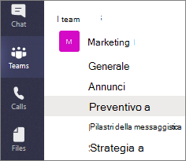
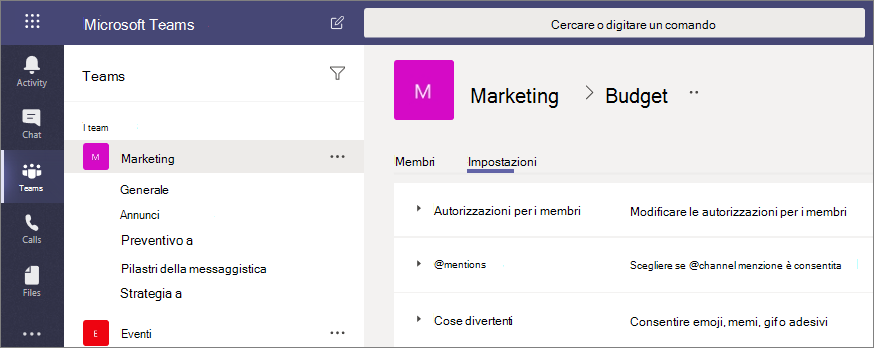

# Canali privati in Microsoft Teams

I canali privati di Microsoft Teams creano spazi dedicati per la collaborazione all'interno dei team. Solo gli utenti proprietari del team o membri del canale privato possono accedere al canale. Tutti gli utenti, inclusi gli utenti guest, possono essere aggiunti come membri a un canale privato, purché siano già membri del team.

È possibile usare un canale privato se si vuole limitare la collaborazione agli utenti che hanno la necessità acquisire competenze o se si vuole agevolare le comunicazioni tra un gruppo di persone assegnato a un progetto specifico, senza dover gestire un altro team.

Ad esempio, un canale privato è utile negli scenari seguenti:

- Un gruppo di persone in un team desidera uno spazio mirato per collaborare senza dover creare un team distinto.
- Un sottoinsieme di persone in un team vuole un canale privato per discutere di informazioni riservate, come budget, gestione delle risorse, posizionamento strategico e così via.

Un'icona a lucchetto indica un canale privato. Solo i membri dei canali privati possono visualizzare e partecipare ai canali privati a cui vengono aggiunti.

Quando viene creato un canale privato, questo viene collegato al team padre e non può essere spostato in un altro team. Inoltre, i canali privati non possono essere convertiti in canali standard e viceversa.

## Creazione canale privato

Per impostazione predefinita, tutti i proprietari o i membri del team possono creare un canale privato. Gli utenti guest non possono crearli. La possibilità di creare canali privati può essere gestita a livello di team e a livello aziendale. È possibile usare i [criteri](teams-policies.md) per controllare quali utenti dell'organizzazione sono autorizzati a creare canali privati. Una volta impostati i criteri, i proprietari del team possono disattivare o attivare la possibilità per i membri di creare canali privati nella scheda **Impostazioni** di un team.

La persona che crea un canale privato è il proprietario del canale privato e solo il proprietario del canale privato può aggiungere o rimuovere direttamente le persone da quest'ultimo. Il proprietario di un canale privato può aggiungere qualsiasi membro del team a un canale privato creato, inclusi gli utenti guest. I membri di un canale privato dispongono di uno spazio di conversazione sicuro e, quando vengono aggiunti nuovi membri, questi possono vedere tutte le conversazioni nel canale privato, anche quelle avvenute in precedenza.

I proprietari del team possono visualizzare i nomi di tutti i canali privati nel loro team nonché eliminare qualsiasi canale privato del team. È possibile ripristinare un canale privato entro 30 giorni dopo l’eliminazione. I proprietari dei team non possono visualizzare i file in un canale privato o le conversazioni e l'elenco dei membri di un canale privato, a meno che non siano membri di tale canale privato.

I membri del team possono vedere solo i canali privati a cui sono stati aggiunti.

## Aggiunta e rimozione di proprietari e membri

Il proprietario di un canale privato non può essere rimosso tramite il client di Teams, se si tratta dell'ultimo proprietario di uno o più canali privati.

Se il proprietario di un canale privato lascia l'organizzazione o viene rimosso dal gruppo di Microsoft 365 associato al team, un membro del canale privato viene automaticamente innalzato di livello per ricoprire il ruolo di proprietario del canale privato.

Se un membro del team lascia o viene rimosso da un team, tale utente lascerà o verrà rimosso anche da tutti i canali privati del team. Se l'utente viene aggiunto di nuovo al team, sarà necessario aggiungerlo di nuovo ai canali privati del team.

## Impostazioni del proprietario del canale

Ogni canale privato ha impostazioni personalizzate che possono essere gestisci dal proprietario del canale, tra cui la possibilità di aggiungere e rimuovere membri, aggiungere schede e @menzioni per l'intero canale. Queste impostazioni sono indipendenti dalle impostazioni del team padre. Quando viene creato un canale privato, questo eredita le impostazioni del team padre, che possono in seguito essere modificate indipendentemente dalle impostazioni del team padre.

Il proprietario del canale privato può fare clic su **Gestisci canale** e quindi usare le schede **Membri** e **Impostazioni** per aggiungere o rimuovere membri e modificare le impostazioni.

## Proprietario del canale privato e azioni relative ai membri

Nella tabella seguente sono illustrate le azioni che i proprietari, i membri e gli utenti guest possono eseguire nei canali privati.

|Azione  |Proprietario di un team|Membro di un team|Utente guest di un team|Proprietario di un canale privato|Membro di un canale privato|Utente guest di un canale privato|
|---------|---------|---------|---------|---------|---------|---------|
|Creare un canale privato|Controllato dall’amministratore|Controllato dall’amministratore e dal proprietario del team|No|N/D|N/D|N/D|
|Eliminare un canale privato|Sì|No|No|Sì|No|No|
|Lasciare un canale privato|N/D|N/D|N/D|Sì, a meno che non sia l'ultimo proprietario|Sì|Sì|
|Modificare un canale privato|No|N/D|N/D|Sì|No|No|
|Ripristinare un canale privato eliminato|Sì|No|No|Sì|No|No|
|Aggiungere membri|No|N/D|N/D|Sì|No|No|
|Modificare le impostazioni|No|N/D|N/D|Sì|No|No|
|Gestire schede e app|No|N/D|N/D|Sì, le app devono essere installate per il team|Controllato dal proprietario del canale|No|

## Gestire il ciclo di vita dei canali privati

Per informazioni su come gestire il ciclo di vita dei canali privati nell'organizzazione, vedere [Gestire il ciclo di vita dei canali privati in Teams](private-channels-life-cycle-management.md). Sono incluse informazioni su come controllare se gli utenti dell'organizzazione possono creare canali privati, come creare un canale privato per conto del proprietario del team, come ottenere un elenco di tutti i messaggi del canale privato a scopo di archiviazione e controllo e altre attività di gestione.  

## Siti di SharePoint del canale privato

Ogni canale privato include una siti di SharePoint. La raccolta siti separata consente di garantire l'accesso ai file del canale privato solo ai membri del canale privato. Questi siti vengono creati con una raccolta documenti per impostazione predefinita e possono essere facilmente migliorate per ottenere siti completi tramite l'[interfaccia di gestione dei siti](https://support.office.com/article/A2F2A5C2-093D-4897-8B7F-37F86D83DF04). Ogni sito viene creato nella stessa area geografica del sito del team padre. Questi siti semplificati hanno un ID modello personalizzato, "TEAMCHANNEL#0", per semplificare la gestione con PowerShell e API Graph. 

>[!NOTE]
>I siti di SharePoint del canale privato non sono inclusi nella pagina Siti attivi della nuova interfaccia di amministrazione di SharePoint.
>I siti di SharePoint del canale privato creati dopo il 28 giugno 2021 avranno l'ID modello personalizzato TEAMCHANNEL#1.

Un sito di un canale privato sincronizza la classificazione dei dati ed eredita le autorizzazioni di accesso guest dal sito del team padre. L'appartenenza ai gruppi dei membri e di proprietari al sito viene mantenuta sincronizzata con quella ai canali privati in Teams. Le modifiche apportate all'appartenenza ai gruppi di membri o di proprietari in SharePoint verranno trasferite automaticamente all'appartenenza ai canali privati entro quattro ore. Negli scenari in cui alcuni utenti hanno l'esigenza di accedere ai documenti senza bisogno di accedere ai messaggi del canale privato, è possibile aggiungerli al gruppo Visitatori nel documento e nella raccolta o a un nuovo gruppo distinto da quelli di Proprietari e Membri.

Teams gestisce il ciclo di vita della raccolta siti del canale privato. Se il sito viene eliminato all'esterno di Teams, un processo in background ripristina il sito entro quattro ore, a condizione che il canale privato sia ancora attivo. Se il sito viene eliminato permanentemente, viene eseguito il provisioning del sito per il canale privato.

Se un canale privato o un team che contiene un canale privato viene ripristinato, i siti vengono ripristinate con esso. Se un sito del canale privato viene ripristinato al di là del periodo di eliminazione temporanea di 30 giorni per il canale privato, il sito funzionerà come un sito autonomo.

## Record di conformità dei messaggi del canale privato

I record per i messaggi inviati in un canale privato vengono recapitati nella cassetta postale di tutti i membri del canale privato, anziché in una cassetta postale di gruppo. I titoli dei record vengono formattati in modo da indicare da quale canale privato sono stati inviati.

Per altre informazioni su come eseguire una ricerca di eDiscovery per i messaggi del canale privato, vedere [eDiscovery di canali privati](ediscovery-investigation.md#ediscovery-of-private-channels).

## Considerazioni sull'accesso ai file nei canali privati

Quando viene creato un nuovo blocco appunti di OneNote in un canale privato, altri utenti possono comunque ottenere l’accesso al blocco appunti poiché si tratta di un comportamento equivalente alla condivisione con un utente dell'accesso a qualsiasi altro elemento in un sito di SharePoint di un canale privato.

Se a un utente viene concesso l'accesso a un blocco appunti in un canale privato tramite SharePoint, la rimozione dell'utente dal team o dal canale privato non rimuove l'accesso di tale utente al blocco appunti.

Se un blocco appunti esistente viene aggiunto come scheda a un canale privato, l'accesso al canale privato non viene modificato e il blocco appunti conserva le autorizzazioni esistenti.

## Limitazioni del canale privato

Attualmente, i canali privati supportano i connettori e le schede, ad eccezione di Stream, Planner e Forms. Stiamo lavorando per fornire un supporto completo delle app per i canali privati, tra cui le estensioni per la messaggistica e i bot.

Ogni team può avere un massimo di 30 canali privati e ogni canale privato può avere un massimo di 250 membri. Il limite di 30 canali privati si aggiunge al limite di 200 standard per ogni team. 

Quando si crea un team da uno esistente, eventuali canali privati nel team esistente non verranno copiati.

Le notifiche dai canali privati non sono incluse nelle email di attività perse in questo momento.

I criteri di conservazione non sono supportati per i messaggi nei canali privati.

## Argomenti correlati

[Panoramica su team e canali in Teams](teams-channels-overview.md)

[Panoramica di PowerShell per Teams](teams-powershell-overview.md)

[Usare l'API Microsoft Graph per lavorare con Teams](/graph/api/resources/teams-api-overview)
