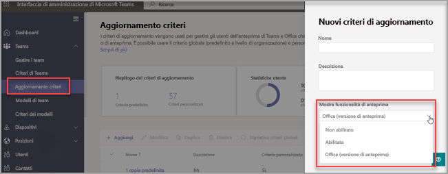

# Anteprima pubblica in Microsoft Teams

> [!NOTE] 
> Le funzionalità incluse nell'anteprima potrebbero non essere complete e potrebbero subire modifiche prima di essere disponibili nella versione pubblica. Sono disponibili solo a scopo di valutazione ed esplorazione. Le funzionalità di anteprima non sono supportate in Office 365 Government Community Cloud (GCC).

L'anteprima pubblica per Microsoft Teams offre accesso anticipato alle funzionalità non rilasciate in Teams. Le anteprime consentono di esplorare e testare le funzionalità imminenti. Microsoft è lieta di ricevere feedback sulle funzionalità presentate nelle anteprime pubbliche. L'anteprima pubblica è abilitata per singoli utenti di Teams, pertanto non è necessario preoccuparsi per l'impatto sull'intera organizzazione.

Per un elenco delle funzionalità disponibili nell'anteprima pubblica di Teams, vedere le [note tecniche sull'anteprima pubblica di Microsoft Teams](https://techcommunity.microsoft.com/t5/microsoft-teams-public-preview/bd-p/MicrosoftTeamsPublicPreview), [note sulla versione per le funzionalità amministrative di Teams](/OfficeUpdates/teams-admin) e le [Novità di Teams](https://support.microsoft.com/office/what-s-new-in-microsoft-teams-d7092a6d-c896-424c-b362-a472d5f105de).

## Impostare i criteri di aggiornamento

L'anteprima pubblica è abilitata per singolo utente e l'opzione per attivarla è controllata da un criterio amministrativo. I criteri di aggiornamento vengono usati per gestire gli utenti delle anteprime di Teams e Office che visualizzano le funzionalità non definitive o di anteprima nell'app Teams. È possibile usare il criterio globale (predefinito a livello dell'organizzazione) e personalizzarlo oppure creare uno o più criteri personalizzati per gli utenti. Questo criterio deve essere assegnato a utenti specifici in quanto non sovrascrive il criterio globale.

1. Accedere all'interfaccia di amministrazione.

2. Selezionare **Teams** > **Criteri di aggiornamento** e quindi selezionare l'opzione **Aggiorna criteri**.

1. Selezionare **Aggiungi** per creare un nuovo criterio o selezionare un criterio esistente per aprire **Aggiorna criterio**.

2. Assegnare un nome al criterio di aggiornamento, aggiungere una descrizione e attivare **Mostra funzionalità di anteprima**.

   -   **Segui Office Preview** (impostazione predefinita): questa nuova opzione predefinita abiliterà automaticamente le funzionalità dell'anteprima pubblica di Teams per qualsiasi utente registrato nel Canale corrente di Office (Anteprima). Non sono necessarie altre azioni da parte dell'utente finale.
   -   **Abilitato**: questa opzione abilita l'anteprima pubblica di Teams indipendentemente dal fatto che un utente sia o meno registrato nel Canale corrente di Office (Anteprima). L'utente finale deve anche acconsentire esplicitamente all'anteprima pubblica di Teams nella sua app Teams.

   > [!NOTE]  
   > Per gli utenti esistenti nell'anteprima pubblica di Teams che NON si trovano nel **Canale corrente (Anteprima)**, gli amministratori IT devono passare dall'impostazione predefinita **Segui Office Preview** ad **Abilitata**.
 
   - **Non abilitato**: le funzionalità dell'anteprima pubblica di Teams non saranno disponibili per gli utenti finali.

      

È anche possibile impostare il criterio tramite PowerShell usando il cmdlet `Set-CsTeamsUpdateManagementPolicy` con il parametro `-AllowPublicPreview`.

> [!NOTE]   
> Il parametro AllowPreview verrà presto deprecato.

## Abilitare l'anteprima pubblica

Per abilitare l'anteprima pubblica su un client desktop o Web, è necessario completare la procedura seguente:

1. Selezionare i tre puntini a sinistra del profilo per visualizzare il menu di Teams.
2. Selezionare **Informazioni** > **Anteprima pubblica**.
3. Selezionare **Passa all'anteprima pubblica**.

> [!NOTE]  
> Questa opzione è disponibile solo quando **Mostra funzionalità di anteprima** è impostato su **Abilitato**.

## Ora Teams segue gli utenti di Office Preview

Il nuovo criterio globale predefinito **Segui Office Preview** consentirà agli utenti di essere automaticamente nel canale Anteprima pubblica di Teams se si trovano nel Canale corrente (Anteprima) per il client Office 365 in Windows.

Microsoft Office continuerà a ricevere gli aggiornamenti dal Canale corrente (Anteprima) e il client di Teams riceverà gli aggiornamenti tramite il canale Anteprima pubblica. Questo criterio NON cambierà i canali di Office in base ai canali di Teams. 

**Come mantenere gli utenti dell'anteprima di Teams esistenti che NON usano il Canale corrente di Office (Anteprima)?**

Per gli utenti esistenti ai quali è stato permesso di acconsentire esplicitamente o rifiutare esplicitamente l'anteprima pubblica di Teams e che vogliono mantenere tale impostazione nella sua forma attuale, è necessario passare dalla nuova impostazione predefinita **Segui Office Preview** ad **Abilitato** (vedere [Impostare i criteri di aggiornamento](#set-the-update-policy))

**Come rifiutare esplicitamente questa impostazione?**

È possibile disabilitare l'impostazione dall'interfaccia di amministrazione di Teams in **Segui Office Preview** selezionando **Non abilitato** (vedere [Impostar i criteri di aggiornamento](#set-the-update-policy))

## Problemi noti

Gli utenti del Canale corrente di Office (Anteprima) possono uscire dall'anteprima pubblica di Teams tramite il menu Informazioni del client di Teams anche se il criterio di aggiornamento è impostato su **Segui Office Preview**. Questa funzionalità non è prevista e verrà rimossa in futuro. Il client di Teams può reimpostarsi automaticamente sull'anteprima pubblica quando il dispositivo è inattivo se l'utente si trova nel Canale corrente (Anteprima) per Office.

## Argomenti correlati

[Anteprima pubblica per sviluppatori](/microsoftteams/platform/resources/dev-preview/developer-preview-intro)
