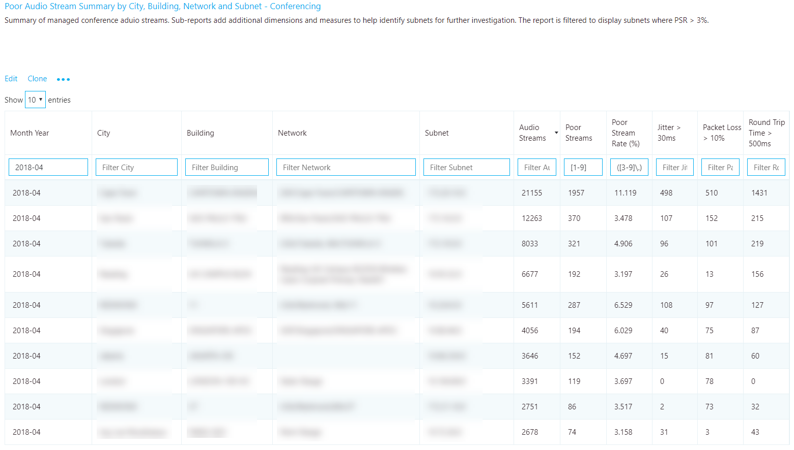

#  <a name="use-cqd-to-manage-call-and-meeting-quality-in-microsoft-teams"></a>Usare CQD per gestire la qualità delle chiamate e delle riunioni in Microsoft Teams 

Questo articolo consente all'amministratore o al supporto tecnico di Teams e al tecnico dell'helpdesk di sviluppare un processo per il monitoraggio e la gestione della qualità delle chiamate e delle riunioni per l'organizzazione usando Microsoft Teams Call Quality Dashboard (CQD). Le nostre linee guida enfatizzano gli scenari di qualità audio perché qualsiasi miglioramento della rete apportato per migliorare l'esperienza audio si tradurrà in miglioramenti nel video e nella condivisione.

Ecco i due modelli [CQD](https://aka.ms/QERtemplates) curati: è consigliabile scaricarli prima di eseguire le istruzioni di questo articolo.

Questo articolo presuppone che sia già [stato configurato CQD.](turning-on-and-using-call-quality-dashboard.md)


## <a name="categories-to-monitor-and-maintain"></a>Categorie da monitorare e gestire

Dopo aver eseguito l'implementazione di riunioni e voce in Teams, è necessario un piano per il monitoraggio e la manutenzione in corso. In questo modo si garantisce Teams sempre in modo ottimale. Questo piano deve includere le aree principali elencate di seguito. È inoltre consigliabile definire obiettivi per le metriche di qualità e un piano per la risoluzione dei problemi e isolare i problemi quando si verificano.

<table>
<thead>
<tr class="header">
<th>Categoria</th>
<th>Descrizione</th>
</tr>
</thead>
<tbody>
<tr class="odd">
<td><strong>Qualità delle chiamate</strong></td>
<td>
<p>Suddividere le metriche per chiamate interne (all'interno dell'organizzazione, ad esempio VPN, WiFi, cablate) o chiamate esterne</p>
<p>Suddividere le metriche in base alla creazione o alla rete</p>
<p>Chiamate VPN</p>
<p>Chiamate tramite TCP, UDP o proxy</p>
</td>
</tr>
<tr class="even">
<td><strong>Affidabilità delle chiamate</strong></td>
<td><p>Identificare e correggere eventuali problemi di rete o firewall</p>
<p>Ottenere informazioni approfondite sulle percentuali di errori di configurazione e eliminazione delle chiamate</p>
<p>Informazioni su dove si verifica la maggior parte degli errori di configurazione e eliminazione delle chiamate</p>
</td>
</tr>
<tr class="odd">
<td><strong>Sondaggio degli utenti</strong></td>
<td>
<p>Usare i dati di Valuta chiamata personale per informazioni sull'esperienza effettiva degli utenti</p>
<p>Dove si verificano le esperienze di scarsa qualità?</p>
<p>Correlare la scarsa esperienza con la qualità delle chiamate, l'affidabilità e i dispositivi</p>
</td>
</tr>
<tr class="even">
<td><strong>Dispositivi</strong></td>
<td><p>Scopri quali microfoni e altoparlanti vengono usati più di frequente e il loro impatto sulla qualità delle chiamate</p>
<p>I driver audio, video, USB e WiFi di supporto vengono regolarmente patchati?</p>
</td>
</tr>
<tr class="odd">
<td><strong>Client</strong></td>
<td>
<p>Scopri quali tipi di client e versioni vengono usati e il loro impatto sulla qualità e l'affidabilità delle chiamate  </p>
</ol></td>
</tr>
</tbody>
</table>

Valutando e correndo continuamente le aree descritte in questo articolo, è possibile ridurne il potenziale per influire negativamente sugli utenti. La maggior parte dei problemi degli utenti può essere raggruppata nelle categorie seguenti:

-   Configurazione incompleta del firewall o del proxy
-   Copertura Wi-Fi scarsa
-   Larghezza di banda insufficiente
-   VPN
-   Versioni e driver client incoerenti o obsolete
-   Dispositivi audio non supportati o incorporati
-   Subnet o dispositivi di rete problematici

Con una pianificazione e una progettazione appropriate prima della distribuzione di Teams o Skype for Business Online, è possibile ridurre la quantità di risorse necessarie per mantenere esperienze di alta qualità.

Questo articolo si concentra sull'uso di Call Quality Dashboard (CQD) Online come strumento principale per segnalare e analizzare ogni area, con particolare enfasi sull'audio per massimizzare l'adozione e l'impatto. Tutti i miglioramenti apportati alla rete per migliorare l'esperienza audio si tradurranno anche direttamente in miglioramenti nella condivisione di video e desktop.

Per accelerare la valutazione, sono disponibili due modelli [CQD](https://aka.ms/qertemplates) curati: uno è per la gestione di tutte le reti e l'altro è filtrato solo per le reti gestite (interne). Anche se i report del modello Tutte le reti sono configurati per visualizzare informazioni sull'edificio e sulla rete, possono comunque essere usati durante la raccolta e il caricamento di informazioni sull'edificio. Il caricamento di informazioni sull'edificio in CQD consente al servizio di migliorare la creazione di report aggiungendo informazioni personalizzate su edifici, reti e posizione, differenziando allo stesso tempo le subnet interne da altre. Per altre informazioni, vedere [Mapping dell'edificio](CQD-building-mapping.md).

### <a name="intended-audience"></a>Gruppo di destinatari previsto

Questo articolo è destinato a essere usato dagli stakeholder dei partner e dei clienti con ruoli come Lead/Architect di collaborazione, Consulente, Change Management/Adoption Specialist, Support/Help Desk Lead, Network Lead, Desktop Lead e IT Admin.

Questo articolo è destinato anche a essere usato dai campioni di qualità designati. Per altre informazioni, vedere [il ruolo Campione qualità](4-envision-plan-my-service-management.md#the-quality-champion-role).


## <a name="what-is-quality"></a>Che cos'è la qualità?

In questo contesto, la qualità è una combinazione di metriche di servizio ed esperienza utente.


### <a name="service-metrics"></a>Metriche dei servizi

Le metriche dei servizi sono costituite da metriche specifiche basate sul client. Durante ogni chiamata, il client raccoglie la telemetria per la chiamata e invia un report alla fine di ogni chiamata a cui è possibile accedere in un secondo momento in CQD o nell'analisi delle chiamate [per utente.](set-up-call-analytics.md) Queste metriche includono (ma non sono limitate a):

-   Poor Stream (in arrivo e in uscita)
-   Frequenza errori di configurazione
-   Drop Failure Rate


#### <a name="poor-stream-rate"></a>Scarsa frequenza di streaming

La scarsa velocità di flusso (PSR) rappresenta la percentuale generale di flussi dell'organizzazione con qualità scarsa. Questa metrica è pensata per evidenziare le aree in cui l'organizzazione può concentrare gli [](#managed-versus-unmanaged-networks) sforzi per avere l'impatto più forte sulla riduzione di questo valore e sul miglioramento dell'esperienza utente, motivo per cui le reti gestite sono lo stato attivo principale quando si guarda a PSR. Anche gli utenti esterni sono importanti, ma le indagini variano in base all'organizzazione. È consigliabile fornire procedure consigliate per gli utenti esterni e analizzare le chiamate esterne in modo indipendente dall'intera organizzazione.

La misurazione effettiva in CQD varia in base al carico di lavoro, ma ai fini di questo articolo ci concentriamo principalmente sulla misura _Audio Poor Percentage._ PSR è costituito da cinque medie metriche di rete descritte nella tabella seguente. Per classificare un flusso come scadente, è necessario che una sola metrica superi la soglia definita. CQD fornisce il "Poor Due To..." misurazioni per comprendere meglio quale condizione ha causato la classificazione del flusso come scarsa. Per altre informazioni, vedere [Classificazione dei flussi in CQD.](stream-classification-in-call-quality-dashboard.md)

> [!Note]
> CQD fornisce il "Poor due to..." misurazioni per comprendere meglio quale condizione ha causato la classificazione del flusso come scarsa.


##### <a name="audio-poor-quality-metrics"></a>Metriche di qualità scarsa dell'audio

| Media metrica     | Descrizione     | Esperienza utente |
|-------------|-----------------|-----------------|
| Instabilità \> 30 ms        | Questa è la variazione media del ritardo tra pacchetti successivi. Teams e Skype for Business possono adattarsi ad alcuni livelli di instabilità attraverso il buffering. È solo quando l'instabilità supera il buffering che un partecipante nota gli effetti di instabilità.      | I pacchetti che arrivano a velocità diverse causano un suono robotico della voce dell'altoparlante.   |
| Tasso di perdita pacchetti \> 10% o 0,1        | Questa opzione viene spesso definita come percentuale di pacchetti persi. La perdita di pacchetti influisce direttamente sulla qualità audio, da piccoli pacchetti persi individuali che non hanno quasi alcun impatto sulle perdite di burst back-to-back che causano il completo taglio dell'audio.     | I pacchetti che vengono scartati e non arrivano alla destinazione prevista causano lacune nei supporti multimediali, causando sillabe e parole perse e video e condivisione non consentiti. |
| Tempo di andata e ritorno \> 500 ms        | Questo è il tempo necessario per ottenere un pacchetto IP dal punto A al punto B e tornare al punto A. Questo ritardo di propagazione della rete è legato alla distanza fisica tra i due punti e alla velocità della luce e include un sovraccarico aggiuntivo dovuto ai vari dispositivi nel percorso di rete.      | I pacchetti che durano troppo tempo per arrivare a destinazione causano un effetto walkie-talkie.   |
| Media degradazione NMOS \> 1.0         | Degradazione [media del punteggio nmos (Network Mean Opinion Score)](/previous-versions/office/communications-server/bb894481(v=office.12)#network-mos) per lo stream. Rappresenta la quantità di perdita e instabilità di rete che ha influenzato la qualità dell'audio ricevuto che ha causato il calo di NMOS di più di un punto. | Si tratta di una combinazione di instabilità, perdita di pacchetti e, in misura minore, aumento del tempo di andata e ritorno. L'utente potrebbe riscontrare una combinazione di questi sintomi.   |
| Rapporto medio dei campioni nascosti \> 7% o 0,07 | Rapporto medio tra il numero di frame audio con campioni nascosti generati dalla perdita di pacchetti e il numero totale di frame audio. Un campione audio nascosto è una tecnica usata per smussare la transizione improvvisa che in genere sarebbe causata da pacchetti di rete eliminati.      | I valori alti indicano che sono stati applicati livelli significativi di perdita e che l'audio è stato distorto o perso.     |

##### <a name="why-do-we-prefer-to-use-streams-instead-of-calls"></a>Perché preferiamo usare i flussi invece delle chiamate?

Flussi facci sapere quale particolare parte della chiamata era scarsa- in uscita o in arrivo. Quando si sta esaminando l'analisi delle chiamate per una chiamata scadente, determinare se la chiamata scadente è dovuta allo stream (in uscita) o al flusso del chiamato (in ingresso). Determinare quale stream influisce sulla qualità delle chiamate è ancora più importante per le conferenze. Se si guardano solo i dati delle chiamate, si può vedere il numero di conferenze a cui partecipa una persona, ma non si vede quali persone sono gli altoparlanti attivi, effettuando la maggior parte della condivisione dello schermo.

I dati delle chiamate ti danno metriche di utilizzo, ma non ti porteranno necessariamente alla causa principale per la scarsa qualità delle chiamate. Esaminando la direzione del flusso, è possibile identificare fattori come una chiamata non in una rete gestita, una chiamata da parte di un non dipendente (ad esempio, un fornitore o una persona su una rete diversa). In questi casi, se la connessione di rete dell'altra persona era scarsa, l'intera chiamata verrà contrassegnata come scarsa. Non è possibile eseguire alcun'operazione su fattori esterni, quindi questi dati non sono utili.

La direzione del flusso consente anche di identificare i dispositivi o i client problematici.

 - Ad esempio, se si ha un budget limitato per i dispositivi e si vogliono fornire dispositivi solo per utenti audio pesanti, usare il report sull'utilizzo dell'audio (VoIP) e filtrare i flussi e le conferenze in uscita. Cercare gli utenti audio ad alto volume che parlano in microfoni predefiniti, che potrebbero essere correlati a una qualità delle chiamate più scarsa (e potrebbe essere necessario fornire dispositivi audio a queste persone). Per maggiore chiarezza, è possibile filtrare l'utilizzo dei pacchetti, in modo da consentire agli utenti audio particolarmente elevati di usare i pacchetti. 

  - Un altro esempio riguarda la condivisione dello schermo. Se un cliente usa un client Teams precedente, le prestazioni di condivisione dello schermo potrebbero essere interessate. È possibile risolvere il problema assegnando priorità all'aggiornamento dei client per le persone che eservitino molte attività di condivisione dello schermo.

 - Identificando la direzione di uno stream che causa una scarsa qualità delle chiamate, è possibile determinare se si è verificato un problema di QoS o relativo alla larghezza di banda. Se la QoS non è stata completamente implementata o se si contrassegnano solo i pacchetti nel client e non nel flusso in ingresso, la qualità delle chiamate potrebbe risultare inferiore. Esaminando la direzione dello stream, è possibile ottenere una visualizzazione più granulare di perdita di pacchetti, latenza o instabilità in una direzione specifica. 

   - Si supponga, ad esempio, che un utente si lamenti dell'audio robotico durante una connessione cablata (jitter). Esaminando lo stream e la direzione, è possibile determinare che il problema si verifica nel flusso in ingresso, solo per un set specifico di subnet. Dopo aver dato queste informazioni al team di rete, possono tenerne traccia fino a un acceleratore WAN non configurato correttamente che non ignorava il traffico multimediale. Dopo che il team di rete ha riconfigurato l'acceleratore WAN, il jitter scompare e la qualità delle chiamate migliora. 


#### <a name="setup-failure-rate"></a>Frequenza errori di configurazione

La percentuale di errori di  configurazione, nota anche come misura Percentuale totale errori di configurazione chiamata in CQD, è il numero di flussi in cui non è stato possibile stabilire il percorso multimediale tra gli endpoint all'inizio della chiamata.

Rappresenta qualsiasi flusso multimediale che non è stato possibile stabilire. Data la gravità dell'impatto di questo problema sull'esperienza utente, l'obiettivo è ridurre questo valore il più vicino allo zero possibile. Un valore elevato per questa metrica è più comune nelle nuove distribuzioni con regole del firewall incomplete rispetto a una distribuzione matura, ma è comunque importante guardarla regolarmente.

Questa metrica viene calcolata prendendo il numero totale di flussi che non è stato possibile configurare diviso per il numero totale di flussi che hanno inviato un record dettagli chiamata (CDR):

-   **Frequenza degli errori di installazione** = Numero totale di flussi non riusciti di configurazione delle chiamate / Numero totale di flussi disponibili per la registrazione cdR

#### <a name="drop-failure-rate"></a>Drop Failure Rate

La percentuale di errori di  eliminazione, nota anche come misura Percentuale totale errori chiamate interrotte in CQD, è la percentuale di flussi stabiliti correttamente in cui il percorso multimediale non è terminato normalmente.

Rappresenta qualsiasi flusso multimediale terminato in modo imprevisto. Anche se l'impatto di questa operazione non è grave come uno stream che non è riuscito a configurare, influisce comunque negativamente sull'esperienza utente. La perdita improvvisa e frequente dei supporti multimediali non solo può avere un impatto grave sull'esperienza utente, ma anche la necessità che gli utenti si riconnettono di nuovo, causando una perdita di produttività (per non parlare della frustrazione).

La metrica viene calcolata prendendo il numero totale di flussi eliminati diviso per il numero totale di flussi che sono stati impostati correttamente:

-   **Drop Failure Rate** = Total Call Dropped Stream Count /Total Call Setup Succeeded Stream Count

### <a name="define-your-target-metrics"></a>Definire le metriche di destinazione

Questa sezione illustra alcune metriche dei servizi di base usate per valutare l'integrità dei servizi. Valutando e guidando continuamente gli sforzi per mantenere queste metriche al di sotto dei loro obiettivi definiti, è possibile garantire agli utenti un'esperienza di qualità delle chiamate coerente e affidabile. Come punto di partenza, usare le destinazioni suggerite nella tabella seguente. Modificare gli obiettivi in base alle esigenze per raggiungere gli obiettivi aziendali.

<table>
<tr>
<th rowspan="2" colspan="2" valign="center">Tipo di rete</th><th rowspan="1">Obiettivi qualitativi</th><th colspan="2">Obiettivi di affidabilità</th></tr>
<tr><th>Audio Poor Stream Rate</th><th>Frequenza errori di configurazione</th><th>Drop Failure Rate</th></tr>
<tr><td rowspan="2"><strong>All</strong></td><td>Interno</td><td>2.0%</td><td>0.5%</td><td>2.0%</td></tr>
<tr><td>Nel complesso</td><td>3.0%</td><td>1.0%</td><td>3.0%</td></tr>
<tr><td rowspan="5"><strong>Conferenze</strong></td><td>Interno</td><td>2.0%</td><td>0.5%</td><td>2.0%</td></tr>
<tr><td>Cablato interno</td><td>1.0%</td><td>0.5%</td><td>1.0%</td></tr>
<tr><td>Wi-Fi 5 GHz interni</td><td>1.0%</td><td>0.5%</td><td>1.0%</td></tr>
<tr><td>Wi-Fi 2,4 GHz interni</td><td>2.0%</td><td>0.5%</td><td>2.0%</td></tr>
<tr><td>Nel complesso</td><td>2.0%</td><td>0.5%</td><td>3.0%</td></tr>
<tr><td rowspan="4"><strong>P2P</strong></td><td>Interno</td><td>2.0%</td><td>0.5%</td><td>2.0%</td></tr>
<tr><td>Cablata/Wi-Fi interna a 5 GHz</td><td>1.0%</td><td>0.5%</td><td>1.0%</td></tr>
<tr><td>Cablata/Wi-Fi complessivamente 5 GHz</td><td>2.0%</td><td>1.0%</td><td>1.0%</td></tr>
<tr><td>Nel complesso</td><td>2.0%</td><td>1.0%</td><td>3.0%</td></tr>
</table>

### <a name="user-experience"></a>Esperienza utente

L'analisi dell'esperienza utente è più grafica che scientifica, perché le metriche raccolte qui non sempre indicano che c'è un problema con la rete o il servizio, ma semplicemente indicano che l'utente percepisce un problema. CQD include un meccanismo di sondaggio incorporato, ovvero Valuta chiamata personale (RMC), per valutare l'esperienza utente generale. RMC fornisce informazioni approfondite sulle domande seguenti dal punto di vista degli utenti:

-   Si sa come usare la soluzione?
-   La soluzione è facile da usare e intuitiva e supporta le mie esigenze quotidiane di comunicazione?
-   La soluzione mi aiuta a completare il mio lavoro?
-   Qual è la percezione generale della soluzione?
-   È possibile usare la soluzione in qualsiasi momento, indipendentemente dalla posizione in cui ci si trova?
-   È possibile configurare e gestire una chiamata?

#### <a name="rate-my-call"></a>Valuta la mia chiamata 

Rate My Call (RMC) è integrato in Teams e Skype for Business. Viene visualizzato automaticamente dopo una chiamata ogni 10 o il 10%. Questo breve sondaggio chiede all'utente di valutare la chiamata e fornire un po' di contesto per il motivo per cui la qualità della chiamata potrebbe essere stata scarsa. Una valutazione di uno o due è considerata scarsa, da tre a quattro è buona e cinque è eccellente. Anche se si tratta di un indicatore in ritardo, si tratta di una metrica utile per individuare i problemi che le metriche dei servizi possono perdere.

> [!Note]
> Il fattore umano: gli utenti spesso ignorano il sondaggio quando la qualità delle chiamate è buona e lo compilano quando la qualità della chiamata è negativa. Di conseguenza, i report RMC potrebbero essere astrali verso il lato mediocre anche se le metriche dei servizi sono buone.

È possibile usare CQD per creare report sulle risposte degli utenti RMC e i report di esempio sono inclusi nel modello CQD. Tuttavia, non vengono discusse in dettaglio in questo articolo. 

#### <a name="client-and-device-readiness"></a>Conformità di client e dispositivi

È necessaria una solida strategia per client e dispositivi per garantire agli utenti un'esperienza utente coerente e positiva. Alcuni principi chiave sono alla base di ogni strategia di conformità.

##### <a name="client-readiness"></a>Conformità del client

Mantenere aggiornato Teams client garantisce che gli utenti osercitino sempre la migliore esperienza possibile. Microsoft rilascia aggiornamenti frequenti al [client di Teams](teams-client-update.md) (l'aggiornamento viene installato in background a meno che non sia stata disattivata questa funzionalità, operazione sconsigliata). È anche importante ricordare di applicare patch ai driver di rete, video, USB e audio, perché spesso vengono trascurati e possono influire sulla qualità delle chiamate e delle riunioni. È consigliabile aggiungere driver di rete, Wi-Fi, video, USB e audio al processo di gestione delle patch corrente.


##### <a name="device-readiness"></a>Conformità del dispositivo

Nessuna strategia può influire sull'esperienza utente più della strategia di conformità del dispositivo. Ad esempio, gli utenti che si affidano agli altoparlanti e al microfono del portatile sperimenteranno molti rumori di fondo nelle chiamate e nelle riunioni. Teams è progettato per funzionare con quasi tutti i dispositivi, ma in caso di problemi relativi al dispositivo, vedere Telefono [per Teams](./devices/phones-for-teams.md).


### <a name="categories-of-quality"></a>Categorie di qualità

È possibile utilizzare una serie di procedure di gestione della qualità, in modo da avere le migliori possibilità di ottenere una buona qualità per le chiamate e le riunioni. Un piano di gestione di buona qualità si rivolge alle categorie seguenti:

-   **Rete:** La qualità audio si è concentrata sulla metrica Poor Stream Ratio (PSR), sull'utilizzo di TCP, sulle subnet cablate e wireless e sull'identificazione dell'uso di proxy HTTP e VPN

-   **Endpoint:** Dispositivi audio e client aggiornati

-   **Gestione dei servizi:** Questa categoria è composta da due sezioni:

    -   Prima di tutto è responsabilità di Microsoft gestire e gestire i Teams e Skype for Business online.

    -   In secondo piano, le attività che l'organizzazione gestisce per garantire un accesso affidabile al servizio, ad esempio l'aggiornamento delle informazioni sull'edificio e la gestione dei firewall per i nuovi indirizzi IP di Office 365 quando l'infrastruttura viene aggiunta al servizio.


Esaminare l'elenco seguente di attività consigliate per mantenere la qualità. È consigliabile eseguire queste attività regolarmente, ad esempio settimanalmente.

#### <a name="service-management-tasks"></a>Attività di gestione dei servizi

Queste attività vanno dalla verifica della larghezza di banda sufficiente per raggiungere il servizio senza saturare i collegamenti Internet, dalla convalida della qualità del servizio (QoS) in tutte le aree di rete gestite e dalla permanenza Office 365 cima Office 365 intervalli IP nei [firewall.](/microsoft-365/enterprise/urls-and-ip-address-ranges)

#### <a name="network-tasks"></a>Attività di rete

Esistono due categorie di attività di rete: affidabilità e qualità. L'affidabilità è incentrata sulla misurazione della capacità dell'utente di effettuare chiamate correttamente e rimanere connesso. La qualità è incentrata sulla telemetria aggregata inviata a Teams e Skype for Business Online dal client dell'utente durante la chiamata e dopo che è terminata. 

Dato l'impatto critico dell'affidabilità sull'esperienza utente, è consigliabile valutare e analizzare le metriche di affidabilità prima di approfondire la qualità. 

#### <a name="endpoints-tasks"></a>Attività endpoint

L'attività principale in questa categoria rimuove gli eventuali ostacoli agli aggiornamenti Teams [client.](teams-client-update.md) Per impostazione predefinita, Teams automaticamente gli aggiornamenti , a meno che non si dissegni questa impostazione, scelta sconsigliata. 

È inoltre consigliabile monitorare i dispositivi e fornire aggiornamenti ogni volta che si identificano i problemi relativi a un dispositivo.

## <a name="use-cqd-to-manage-call-quality"></a>Usare CQD per gestire la qualità delle chiamate

Dopo aver configurato [CQD,](turning-on-and-using-call-quality-dashboard.md)è possibile iniziare a usarlo per gestire la qualità delle chiamate e delle riunioni per l'organizzazione.

La maggior parte dei Teams delle prestazioni rientrano nelle categorie seguenti:

-   Configurazione incompleta del firewall o del proxy
-   Copertura Wi-Fi scarsa
-   Larghezza di banda insufficiente
-   VPN
-   Versioni e driver client incoerenti o obsolete
-   Dispositivi audio non supportati o incorporati
-   Subnet o dispositivi di rete problematici

Se si prende del tempo prima di implementare Teams per valutare queste aree e correggere eventuali carenze, si ridurrà la quantità di lavoro necessaria per mantenere un'esperienza di Teams di alta qualità per tutti gli utenti. Per informazioni su come valutare la rete in preparazione per l'implementazione Teams, vedere [Advisor per](use-advisor-teams-roll-out.md) Teams e Preparare la rete [per](prepare-network.md)Teams .

### <a name="expectations-using-cqd"></a>Aspettative con CQD

Usare call quality dashboard (CQD) per ottenere informazioni approfondite sulla qualità delle chiamate effettuate usando Teams e Skype for Business servizi. CQD è progettato per aiutare Teams amministratori Skype for Business e tecnici di rete a ottimizzare la rete e tenere sotto controllo la qualità, l'affidabilità e l'esperienza utente. CQD esamina la telemetria aggregata per un'intera organizzazione, in cui i modelli complessivi possono diventare evidenti; in questo modo è possibile effettuare valutazioni informate e pianificare le correzioni. CQD fornisce report di metriche che forniscono informazioni generali sulla qualità, l'affidabilità e l'esperienza utente.

CQD, anche se utile per analizzare le tendenze e le subnet, non sempre fornisce una causa specifica per un determinato scenario. È importante comprenderlo e impostare le aspettative corrette quando si usa CQD:

-   CQD non fornirà la causa radice per ogni scenario
-   CQD non conterrà flussi Sistema telefonico audioconferenza
-   CQD chiamerà le aree per ulteriori indagini in base alle tendenze

### <a name="cqd-reports-overview"></a>Panoramica dei report CQD

Usare il menu a discesa nella parte superiore dello schermo per aprire un report. Per un elenco dei dati forniti in ogni report, vedere [Dati disponibili nei report CQD.](CQD-data-and-reports.md#data-available-in-cqd-reports)

Novità di gennaio 2020: [Scaricare Power BI di query per CQD](https://github.com/MicrosoftDocs/OfficeDocs-SkypeForBusiness/blob/live/Teams/downloads/CQD-Power-BI-query-templates.zip?raw=true). Modelli Power BI personalizzabili che è possibile usare per analizzare e segnalare i dati CQD.


### <a name="teams-vs-skype-for-business"></a>Teams confronto tra Skype for Business

CQD può creare report su Teams e Skype for Business. Tuttavia, a volte può essere necessario sviluppare un report per esaminare Teams telemetria separata da Skype for Business.

#### <a name="summary-reports"></a>Report di riepilogo

Per modificare la pagina dei report di riepilogo in modo da  visualizzare solo Teams o Skype for Business, selezionare il menu a discesa Filtro prodotti nella parte superiore dello schermo e quindi selezionare il prodotto desiderato.


#### <a name="detailed-reports"></a>Report dettagliati

Per filtrare tutti i report dettagliati, nella barra del browser aggiungere quanto segue alla fine dell'URL:

```PowerShell
/filter/[AllStreams].[Is Teams]|[FALSE]
```

**Esempio:**

```https://cqd.teams.microsoft.com/cqd/#/1234567/2018-5/filter/[AllStreams].[Is Teams]|[FALSE]```

Per altre informazioni sui filtri URL, vedere [Filtro dei report](CQD-data-and-reports.md#report-filters) più avanti in questa sezione.

Per filtrare un singolo report dettagliato, aggiungere il filtro al report e ``Is Teams`` impostarlo su True o False.


### <a name="managed-versus-unmanaged-networks"></a>Reti gestite e non gestite

Per impostazione predefinita, tutti gli endpoint in CQD sono classificati come esterni. Non appena viene introdotto un file di edificio, è possibile iniziare a esaminare i dati dell'endpoint gestito. Come descritto in precedenza, le reti in CQD sono definite come:

-   Una _rete gestita,_ spesso definita interna o interna, può essere influenzata e controllata dall'organizzazione. Sono incluse la LAN interna, la WAN remota e la VPN.
-   Una _rete non gestita,_ spesso definita esterna o esterna, non può essere influenzata o controllata dall'organizzazione. Un esempio di rete non gestita è una rete alberghiera o aeroportuale.

### <a name="dimensions-measures-and-filters"></a>Dimensioni, misure e filtri

Una query CQD ben formata contiene tutti e tre i parametri seguenti:

-   **Quota:** Come si vuole eseguire il pivot sui dati.

-   **Misura:** Cosa voglio segnalare.

-   **Filtro:** Come si vuole ridurre il set di dati restituito dalla query.

Un altro modo per osservare questo aspetto è che  una dimensione è la funzione di  raggruppamento, una misura è i dati a cui sono interessato e un filtro è il modo in cui si vogliono restringere i risultati a quelli rilevanti per la query. 

Un esempio di query ben formata è **Show me Poor Flussi [Measure] by Subnet [Dimension] for Building 6 [Filter]**. Per altre informazioni, vedere [Dimensioni e misure disponibili in CQD.](./dimensions-and-measures-available-in-call-quality-dashboard.md)

### <a name="first-vs-second"></a>Primo e secondo 

Molte dimensioni e misure in CQD sono classificate come prime o seconde. CQD non usa campi chiamante/chiamato, che sono  stati  rinominati per primo e secondo perché ci sono passaggi interviene tra il chiamante e il chiamato. La logica seguente determina quale endpoint coinvolto viene etichettato come primo:

-   **First** sarà sempre un endpoint del server (Conference Server, Mediation Server e così via) se un server è coinvolto nello stream o nella chiamata.

-   **Secondo** sarà sempre un endpoint client, a meno che lo stream non sia compreso tra due endpoint server.

-   Se entrambi gli endpoint sono dello stesso tipo, la scelta è basata sull'ordinamento interno della categoria agente utente. Ciò assicura che l'ordinamento sia coerente.

Per altre informazioni su come determinare il primo o il secondo endpoint quando sono entrambi uguali, vedere Dimensioni e misure [disponibili in CQD.](./dimensions-and-measures-available-in-call-quality-dashboard.md)

### <a name="stream-vs-call"></a>Confronto tra flusso e chiamata

È necessario comprendere la differenza tra una chiamata e uno stream per scegliere correttamente le dimensioni o le misure da guardare in CQD. Anche se lo stato attivo principale di CQD è sui flussi, sono disponibili anche misurazioni basate sulle chiamate.

-   **Flusso:** Esiste _un flusso_ tra due soli endpoint. Per ogni direzione è presente un solo flusso e per la comunicazione sono necessari due flussi. Flussi sono utili per analizzare edifici, reti o subnet. In alcuni casi, sia la chiamata che lo stream vengono usati nel nome della misura, ad esempio Call Setup Stream o Call Dropped Stream. Questi sono ancora classificati come flussi.

-   **Chiama:** Una _chiamata_ è un raggruppamento di tutti i flussi di tutti i partecipanti. Una chiamata è costituita almeno da due flussi. Una singola chiamata avrà almeno due endpoint, ognuno con un minimo di uno stream.

Per altre indicazioni sul fatto che la dimensione o la misura si riferisca a una chiamata o a uno stream, vedere Dimensioni e misure [disponibili in CQD](./dimensions-and-measures-available-in-call-quality-dashboard.md)

### <a name="good-poor-and-unclassified-calls"></a>Chiamate buone, povere e non classificate

Una chiamata è classificata come buona, scarsa o non classificata. Diamo un po' di tempo per parlare di ognuno in modo più dettagliato.

-   **Buono o scarso:** Una chiamata buona o scarsa è costituita da una chiamata che contiene un set completo di metriche del servizio, per cui il servizio ha generato e ricevuto un report QoE completo. Determinare se uno stream è buono o scadente è descritto più [indietro in questo articolo.](#poor-stream-rate)

-   **Non classificati:** Uno stream non classificato non contiene un set completo di metriche del servizio. Possono trattarsi di chiamate brevi, in genere inferiori a 60 secondi, in cui non è stato possibile calcolare le medie e non è stato generato un report QoE. Il motivo più comune per cui le chiamate non devono essere classificate è che l'utilizzo dei pacchetti è stato scarso o inevaso. Un esempio di questo potrebbe essere un partecipante che partecipa a una riunione con l'audio e non parla mai. Il partecipante riceve, ma non trasmette, elementi multimediali. Senza la trasmissione di elementi multimediali, non saranno disponibili metriche da usare per CQD per classificare il flusso multimediale in uscita dell'endpoint.

Per altre informazioni, vedere [Classificazione dei flussi in CQD.](stream-classification-in-call-quality-dashboard.md)

### <a name="common-subnets"></a>Subnet comuni

Le subnet comuni sono subnet private specifiche usate da hotel, reti domestiche, hotspot e aree simili. Queste subnet sono difficili da triage a causa del loro uso diffuso. Se l'organizzazione usa una di queste subnet comuni, è consigliabile spostare la rete in un'altra subnet. In questo modo la creazione di report sarà più semplice in CQD. Quando viene specificato, i report nel modello Tutte le reti sono stati configurati in modo da escludere queste subnet per eliminarle come fonte di scarsa qualità. Le subnet comuni sono definite di seguito. il loro impatto varia a seconda dell'organizzazione.

-   10.0.0.0/24
-   192.168.0.0/24
-   192.168.1.0/24
-   192.168.2.0/24
-   172.20.10.0/24
-   192.168.43.0/24

Quando si analizza una rete gestita che usa una subnet comune, è necessario usare la dimensione Second Reflexive Local IP per raggruppare le subnet. Questa dimensione contiene l'indirizzo IP pubblico dell'endpoint.


## <a name="reliability-investigations"></a>Indagini sull'affidabilità

Il primo passaggio per migliorare la qualità consiste nel valutare lo stato di affidabilità in tutta l'organizzazione. Poiché l'affidabilità è fondamentale per un'esperienza utente positiva, partiamo da due componenti che misurano l'affidabilità:

1.  **Errori di installazione:** Non è stato possibile stabilire la chiamata.

2.  **Errori di eliminazione:** La chiamata è stata stabilita e terminata in modo imprevisto.

In questa sezione verranno descritti i metodi per analizzare entrambe le aree.

> [!NOTE]
> Non tutti i report inclusi nei modelli sono trattati in questo articolo. Tuttavia, i metodi di indagine descritti di seguito sono ancora applicabili. Per altre informazioni, fare riferimento alla descrizione del singolo report.


### <a name="setup-failures"></a>Errori di configurazione

Assegnare prima la priorità alla correzione degli errori di configurazione in quest'area, perché questi errori hanno un impatto negativo significativo sull'esperienza utente.

Iniziare l'indagine valutando la percentuale di errori di configurazione complessivi per l'organizzazione e quindi assegnare priorità alle aree di indagine in base alla percentuale più alta per edificio o rete. 

#### <a name="setup-failure-trend-analysis"></a>Analisi della tendenza degli errori di configurazione

Questo report visualizza la quantità totale di flussi, gli errori di configurazione dello stream e la frequenza degli errori di configurazione dello stream. Posizionare il punto su una delle colonne per visualizzare i singoli valori. 

##### <a name="analysis"></a>Analisi

Usando questo report, è possibile rispondere alle domande seguenti e determinare il corso successivo dell'azione:

-   Qual è la percentuale totale di errori di configurazione delle chiamate per il mese corrente?

-   La percentuale totale di errori di configurazione delle chiamate è inferiore o superiore alla metrica di destinazione definita?

-   La tendenza al fallimento è peggiore o migliore del mese precedente?

-   La tendenza al fallimento è in aumento, costante o decrescente?

Indipendentemente dalle risposte a queste domande, è consigliabile approfondire l'analisi usando i report secondari complementari per cercare eventuali singoli edifici o subnet che potrebbero richiedere la correzione. Anche se il tasso di insuccesso complessivo potrebbe essere inferiore alla metrica di destinazione, i tassi di errore per uno o più edifici o reti potrebbero essere superiori alla metrica di destinazione e richiedere indagini.

#### <a name="setup-failure-investigations"></a>Analisi degli errori di configurazione 

Questo report di riepilogo viene usato per individuare e isolare gli edifici o le reti che potrebbero dover essere corretti.

> [!NOTE]
> Assicurarsi di modificare il filtro del report Anno mese sul mese corrente. Selezionare **Modifica** e modificare il filtro del report **Anno** mese per salvare il nuovo mese predefinito.

##### <a name="remediation"></a>Correzione 

Concentrare le prime attività di correzione su edifici o subnet con il maggior volume di errori. In questo modo si massimizza l'impatto sull'esperienza utente e si riduce rapidamente la frequenza degli errori di configurazione delle chiamate dell'organizzazione. La tabella seguente elenca i due motivi per cui gli errori di installazione sono riportati da CQD.

| Motivo errori di configurazione delle chiamate       | Causa tipica                    |
|----------------------------------|----------------------------------|
| Regola di esenzione di Controllo pacchetti approfonditi FW mancante | Indica che l'apparecchiatura di rete lungo il percorso ha impedito la creazione del percorso multimediale a causa delle regole di ispezione profonda dei pacchetti. È probabile che le regole del firewall non siano configurate correttamente. In questo scenario, l'handshake TCP è riuscito, ma non l'handshake SSL.      |
| Regola di eccezione del blocco IP FW mancante      | Indica che le apparecchiature di rete lungo il percorso impedirono la connessione del percorso multimediale alla Microsoft 365 o Office 365 rete. Ciò potrebbe essere dovuto al fatto che le regole del proxy o del firewall non sono configurate correttamente per consentire l'accesso agli indirizzi IP e alle porte usati per il traffico Teams e Skype for Business traffico. |

Quando si inizia la correzione, è possibile concentrare le attività su un determinato edificio o subnet. Come illustrato nella tabella precedente, questi problemi sono dovuti alle configurazioni del firewall o del proxy. Esaminare le opzioni nella tabella seguente per le azioni di correzione.

|      Correzione      |Linee guida  |
|-----------------------|----------|
| Configurare i firewall | Collaborare con il team di rete e verificare la configurazione dei firewall [rispetto all'Office 365 di indirizzi IP.](/microsoft-365/enterprise/urls-and-ip-address-ranges)<br><br>Verificare che le [subnet e](https://support.office.com/article/Office-365-URLs-and-IP-address-ranges-8548a211-3fe7-47cb-abb1-355ea5aa88a2#bkmk_teams) le porte multimediali siano incluse nelle regole del firewall. <br><br>Verificare che le [porte necessarie](prepare-network.md) siano aperte nel firewall. Udp deve avere la priorità perché TCP è considerato un protocollo di failback per la condivisione dello schermo basata su audio, video e video e il suo utilizzo influirà sulla qualità della chiamata. La condivisione di applicazioni RDP legacy usa solo TCP.|

### <a name="drop-failures"></a>Errori di eliminazione

A differenza dei codici di errore di configurazione, CQD non ha codice di errore di eliminazione per indicare il motivo per cui si verificano errori di eliminazione, il che rende difficile isolare una causa radice specifica. Per migliorare gli errori di eliminazione del triage, usare un approccio dedotto. Con la correzione di eventuali aree di interesse per i supporti multimediali, l'applicazione di patch a client e driver e l'utilizzo di dispositivi certificati per Teams e Skype for Business, è possibile prevedere un calo degli errori.

#### <a name="drop-failure-trend-analysis"></a>Analisi della tendenza a errori di rilascio

Questo report visualizza la quantità totale di flussi audio, il totale degli errori di eliminazione e la frequenza degli errori di eliminazione. Posizionare il punto su una delle colonne per visualizzarne i valori. 


##### <a name="analysis"></a>Analisi

Usando questo tipo di report, è possibile rispondere alle domande seguenti:

-   Qual è la frequenza corrente di errori di eliminazione?
-   La percentuale di errori di rilascio è inferiore alla metrica di destinazione definita?
-   La tendenza al fallimento è peggiore o migliore del mese precedente?
-   La tendenza al fallimento è in aumento, costante o decrescente?

Indipendentemente dalle risposte alle domande precedenti, è consigliabile usare i report secondari per cercare eventuali edifici o reti che potrebbero richiedere correzioni. Anche se il tasso di insuccesso complessivo potrebbe essere inferiore alla metrica di destinazione, il tasso di insuccesso per uno o più edifici o reti potrebbe essere superiore alla metrica di destinazione e richiedere indagini.

#### <a name="drop-failure-investigations"></a>Analisi degli errori di eliminazione

Gli errori riportati qui indicano che la chiamata è stata interrotta in modo imprevisto e ha restituito un'esperienza utente negativa. A differenza dei report di tendenza, questi report forniscono informazioni aggiuntive su subnet specifiche che devono essere ulteriormente approfondite.


##### <a name="remediation"></a>Correzione

Usando i report della tabella inclusa, è possibile isolare le aree di problemi nella rete in cui la velocità di rilascio è superiore alla metrica di destinazione definita. Concentrare i primi interventi di correzione sugli edifici o sulle subnet con il numero totale di flussi più elevato, per ottenere l'impatto più grande.

Cause comuni dei drop delle chiamate:

-   Uscita di rete o Internet con provisioning non eseguito
-   Nessun QoS configurato in reti vincolate
-   Versioni client precedenti
-   Comportamento dell'utente

Dopo aver scoperto le aree problematiche, è possibile usare l'analisi delle chiamate [per](use-call-analytics-to-troubleshoot-poor-call-quality.md) utente per esaminare ulteriormente gli utenti dell'edificio per problemi specifici. L'analisi delle chiamate contiene altri dati EUII e può essere utile per isolare ulteriormente i potenziali motivi degli errori di eliminazione.

Indipendentemente dal passaggio successivo, è consigliabile informare l'helpdesk che è stato rilevato un problema con specifici edifici o subnet. In questo modo l'helpdesk risponde rapidamente alle chiamate in arrivo e valuta gli utenti in modo più efficiente. Gli utenti contrassegnati possono quindi essere riportati al team di progettazione per ulteriori indagini.

La tabella seguente elenca alcuni metodi comuni per gestire e correggere gli errori di eliminazione.

| Correzione                              | Linee guida                      |
|------------------------------------------|-------------------------------|
| **Rete/Internet**                         | **Congestione:** collaborare con il team di rete per monitorare la larghezza di banda in specifici edifici/subnet per verificare che ci siano problemi di sovrautilizzazione. Se si conferma che esiste una congestione di rete, valutare l'aumento della larghezza di banda per l'edificio o l'applicazione di QoS. Usare i report di riepilogo di [Quality Poor Stream](#quality-investigations) inclusi per esaminare le subnet problematiche per i problemi di instabilità, latenza e perdita di pacchetti, perché spesso precedono uno stream eliminato.<br><br>**QoS:** se l'aumento della larghezza di banda è poco pratico o a costo proibitivo, valutare l'implementazione di QoS. Questo strumento è molto efficace nella gestione del traffico congestionato e garantisce che i pacchetti multimediali nella rete gestita siano prioritari sopra il traffico non multimediale. In alternativa, se non ci sono prove chiare che la larghezza di banda sia il responsabile, considerare queste soluzioni:<ul><li>[Microsoft Teams Guida alla QoS](qos-in-teams.md)</li></ul><br>**Eseguire una valutazione della** conformità della rete: una valutazione della rete fornisce informazioni dettagliate sull'utilizzo previsto della larghezza di banda, su come gestire le modifiche alla larghezza di banda e alla rete e sulle procedure di rete consigliate per Teams e Skype for Business. Usando la tabella precedente come origine, si ha un elenco di edifici o subnet che sono ottimi candidati per una valutazione.<ul><li>[Preparare la rete dell'organizzazione per Teams](prepare-network.md)</li></ul> |
| **Client (solo Skype for Business Online)** | Alcuni client Skype for Business precedenti hanno conosciuto problemi documentati con l'affidabilità dei supporti multimediali. Esaminare i report di Analisi delle chiamate di più utenti interessati oppure creare un report della tabella versione client personalizzato in CQD filtrato in base a specifici edifici o subnet con la misura % totale errori di chiamata. Queste informazioni consentono di capire se esiste una relazione tra il rilascio delle chiamate nell'edificio specifico e una versione specifica del client.     |
| **Dispositivi**                                  |Se i dispositivi sono il responsabile dei problemi di qualità delle chiamate, è consigliabile aggiornare i dispositivi offensivi. Leggi [Telefoni per Teams](./devices/phones-for-teams.md) per saperne di più. |
| **Comportamento dell'utente**                            | Se si stabilisce che il problema non è la rete, i dispositivi o i client, è consigliabile sviluppare una strategia di adozione degli utenti per informare gli utenti su come partecipare e uscire al meglio da una riunione. Un'esperienza Teams e Skype for Business utente migliorerà l'esperienza utente per tutti i partecipanti alla riunione. Ad esempio, un utente che mette il portatile in stato di sospensione (chiudendo il coperchio) senza uscire dalla riunione verrà classificato come un calo di chiamata imprevisto.   |

## <a name="quality-investigations"></a>Indagini sulla qualità

Il passaggio successivo per valutare lo stato della qualità audio in tutta l'organizzazione consiste nell'esaminare la scarsa frequenza di flusso (PSR), TCP e l'utilizzo del proxy. È importante ricordare che i dati CQD non forniscono una causa radice specifica, ma forniscono aree di problemi probabili per avviare una conversazione collaborativa con i team appropriati per le attività di correzione. 

> [!NOTE]
> Non tutti i report inclusi nei modelli sono trattati in questo articolo. Tuttavia, i metodi di indagine descritti di seguito verranno comunque applicati a tali report. Per altre informazioni, vedere la descrizione del singolo report. 

### <a name="quality"></a>Qualità

Le percentuali PSR vengono usate per indicare se l'organizzazione sta incontrando obiettivi metrici definiti per una determinata area di stato attivo. È importante notare che, anche se le percentuali di alto livello si trova all'interno della destinazione definita, le singole subnet o edifici potrebbero non soddisfare gli obiettivi definiti e, di conseguenza, richiedere ulteriori indagini. Ad esempio, se la percentuale complessiva di PSR audio è del 2% in aprile, che soddisfa l'obiettivo del campione, i singoli edifici e subnet potrebbero comunque avere esperienze scadenti, a seconda della distribuzione complessiva di quel 2%. 

Per valutare la percentuale di flussi scadenti, usare i report sulla qualità. Sono disponibili diversi report sulla qualità per esaminare le metriche relative a generale, conferenze, chiamate PSTN, VPN e sale riunioni. A questo scopo, vengono forniti report mensili, settimanali e giornalieri. I report settimanali e giornalieri sono limitati al modello Reti gestite per aumentare l'efficacia e ridurre il rumore. 

#### <a name="quality-trend-analysis"></a>Analisi delle tendenze qualitative

I report di tendenza visualizzano informazioni sulla qualità nel tempo e vengono usati per identificare e comprendere le tendenze qualitative all'interno di ogni area di interesse. Come indicato in precedenza, nei modelli per l'analisi della qualità sono inclusi alberi di report. conferenze, chiamate PSTN, VPN e sale riunioni a due parti. Ai fini dell'analisi della qualità, il processo di indagine è lo stesso. Tuttavia, è consigliabile iniziare prima con le conferenze, perché eventuali miglioramenti nella qualità delle conferenze influiranno positivamente anche su tutte le altre aree. 

> [!Note]
> L'analisi delle chiamate PSTN e delle sale riunioni a due parti è simile all'analisi delle conferenze. L'obiettivo è isolare gli edifici o le subnet che hanno la qualità peggiore e identificare il motivo della scarsa qualità.

> [!Important]
> I report basati su VPN vengono filtrati usando la seconda dimensione VPN. Questa dimensione richiede che la scheda di rete VPN sia registrata correttamente come adattatore di accesso remoto. I fornitori di VPN non usano in modo affidabile questo contrassegno e il chilometraggio varia a seconda del fornitore vpn distribuito nell'organizzazione. Modificare i [report VPN,](CQD-upload-tenant-building-data.md#vpn) se necessario, usando il nome dell'edificio o della rete.

##### <a name="investigation"></a>Indagine

Usando questi report, è possibile rispondere alle domande seguenti:

-   Qual è il psr totale per il mese corrente?
-   Il PSR è sotto la metrica di destinazione definita?
-   PsR è peggiore o migliore del mese precedente?
-   La tendenza PSR è in aumento, costante o decrescente?

Indipendentemente dalle risposte alle domande precedenti, è consigliabile usare i report secondari per cercare eventuali edifici o subnet che potrebbero richiedere indagini. Anche se il PSR complessivo potrebbe essere inferiore alla metrica di destinazione, spesso il PSR per uno o più edifici o reti è superiore alla metrica e richiede una correzione.

#### <a name="quality-investigations"></a>Indagini sulla qualità

I report di riepilogo qualitativo offrono informazioni più approfondite su ciò che ha contribuito alla classificazione dei flussi come di qualità scarsa e consentono di isolare le aree di problemi nella rete gestita.

Anche se le dimensioni usate potrebbero differire leggermente tra i report, ogni report includerà misure per i flussi totali, i flussi totali di qualità scarsa, il psr e la qualità scarsa a causa di. Sono stati creati report per ogni area di interesse: conferenze, due parti, chiamate PSTN, VPN e sale riunioni. Il modello Rete gestita include report aggiuntivi per sfruttare le informazioni sulla posizione caricate tramite il file di edificio.


> [!Note]
> Le subnet comuni sono difficili da triage a causa del loro uso diffuso. Al modello Tutte le reti è stato aggiunto un report separato che mostra l'IP pubblico del client (Second Reflexive Local IP) per facilitare la correzione degli uffici che usano reti comuni.




##### <a name="remediation"></a>Correzione

Concentrare le attività di correzione su edifici o subnet con il maggior volume di flussi, perché in questo modo si massimizza l'impatto e si migliora rapidamente l'esperienza utente. Usare le misure jitter, packet loss e round trip time (RTT) per capire cosa contribuisce alla qualità scarsa (è possibile che ci siano più problemi):

-   **Instabilità:** i pacchetti multimediali arrivano a velocità diverse, il che fa sembrare robotico un altoparlante.
-   **Perdita di pacchetti:** i pacchetti multimediali vengono eliminati, il che crea l'effetto di parole o sillabe mancanti.
-   **RTT:** i pacchetti multimediali stanno occupando molto tempo per raggiungere la destinazione, il che crea un effetto walkie-talkie.

Per facilitare l'analisi dei problemi di qualità, usare [l'analisi delle chiamate per utente.](use-call-analytics-to-troubleshoot-poor-call-quality.md) Con Call Analytics è possibile esaminare una conferenza specifica o il report delle chiamate dell'utente. Questo report conterrà i dati EUII/PII ed è utile quando si cerca la causa di un errore. Dopo aver notato quale edificio è interessato, dovrebbe essere semplice tenere traccia degli utenti dell'edificio. 

Non dimenticare di far sapere all'helpdesk che queste reti stanno riscontrando problemi di qualità, in modo che possano eseguire rapidamente il triage e rispondere alle chiamate in arrivo.

| Correzione                              | Linee guida                         |
|------------------------------------------|----------------------------------|
| **Reti**                                 | **Congestione:** una rete inutilizzata o con un provisioning inferiore può causare problemi con la qualità dei supporti multimediali. Collaborare con il team di rete per determinare se le connessioni di rete dall'utente al punto di uscita Internet hanno larghezza di banda sufficiente per supportare i supporti multimediali. <br><br>**Eseguire una valutazione della** conformità della rete: una valutazione della rete fornisce informazioni dettagliate sull'utilizzo previsto della larghezza di banda, su come gestire le modifiche alla larghezza di banda e alla rete e sulle procedure di rete consigliate per Teams e Skype for Business. Usando la tabella precedente come origine, si ha un elenco di edifici o subnet che sono ottimi candidati per una valutazione.<ul><li>[Preparare la rete dell'organizzazione per Teams](prepare-network.md)</li></ul>|
| **QoS (Quality of Service)**  | QoS è uno strumento comprovato che consente di assegnare priorità ai pacchetti in una rete congestionata per assicurarsi che arrivino a destinazione intatti e in tempo. Valutare l'implementazione di QoS all'interno dell'organizzazione per ottimizzare la qualità dell'esperienza utente in cui la larghezza di banda è limitata. La QoS consente di risolvere i problemi in genere associati a alti livelli di perdita di pacchetti e, in misura minore, a tempi di instabilità e di andata e ritorno.<ul><li>[Teams Guida alla QoS](qos-in-teams.md)</li></ul> |
| **Wi-Fi**               | Wi-Fi può avere un impatto significativo sulla qualità della chiamata. Wi-Fi le distribuzioni non prendono in genere in considerazione i requisiti di rete per i servizi VoIP e spesso sono fonte di scarsa qualità. Per altre informazioni sull'ottimizzazione dell'infrastruttura Wi-Fi, vedere questo articolo sulla pianificazione Wi-Fi [pianificazione.](/skypeforbusiness/certification/plan-wifi)<br><br>**Driver wireless:** verificare che i driver wireless siano aggiornati. In questo modo si ridurrà l'esperienza utente scarsa relativa a un driver obsoleto. Molte organizzazioni non includono driver wireless nei cicli di patch e questi driver possono passare senza patch per anni. Molti problemi wireless vengono risolti assicurando che i driver wireless siano aggiornati.<br><br>**WMM**: Wireless Multimedia Extensions (WMM), noto anche come Wi-Fi Multimedia, fornisce funzionalità QoS di base alle reti wireless. Le reti wireless moderne devono supportare molti dispositivi. Questi dispositivi competono per la larghezza di banda e possono causare problemi di qualità per i servizi VoIP, dove la velocità e la latenza sono essenziali. Consultare il fornitore della rete wireless per informazioni specifiche e valutare l'implementazione di WMM nella rete wireless per assegnare la priorità Skype for Business e Teams multimediali.<br><br>**Densità dei punti di accesso:** i punti di accesso potrebbero essere troppo distanti o non essere presenti in una posizione ideale. Per ridurre al minimo le potenziali interferenze, posizionare punti di accesso aggiuntivi nelle sale riunioni e in posizioni non ostruite da muri o altri oggetti in cui il segnale di Wi-Fi è debole.<br><br>**2,4 GHz** rispetto a 5 GHz: 5 GHz fornisce meno interferenze in background e velocità più elevate e dovrebbe essere prioritario quando si distribuisce VoIP tramite Wi-Fi. Tuttavia, i 5 GHz non sono così forti come 2,4 GHz e non penetrano facilmente nelle pareti. Esaminare il layout dell'edificio per determinare la frequenza su cui è possibile fare affidamento per la connessione ottimale. |
|**Dispositivo di rete** | Le organizzazioni più grandi potrebbero avere centinaia di dispositivi distribuiti in tutta la rete. Collaborare con il team di rete per assicurarsi che i dispositivi di rete dall'utente a Internet siano mantenuti e aggiornati. |
| **VPN**  | Gli appliance VPN non sono tradizionalmente progettati per gestire carichi di lavoro multimediali in tempo reale. Alcune configurazioni VPN proibiscono l'uso di UDP (che è il protocollo preferito per i supporti multimediali) e si basano solo su TCP. Valutare l'implementazione di una soluzione VPN a tunnel diviso per ridurre la VPN come fonte di scarsa qualità. |
| **Client** <br>(Skype for Business Online) | Assicurarsi che tutti i client vengano aggiornati regolarmente. |
| **Dispositivi** | Se i dispositivi sono il responsabile dei problemi di qualità delle chiamate, è consigliabile aggiornare i dispositivi offensivi. Leggi [Telefoni per Teams](./devices/phones-for-teams.md) per saperne di più. |
| **Driver** | La rete di gestione delle patch (Ethernet e Wi-Fi), i driver audio, video e USB dovrebbero far parte della strategia generale di gestione delle patch. Molti problemi di qualità vengono risolti aggiornando i driver. |
| **Sale riunioni su Wi-Fi** | È consigliabile che i dispositivi delle sale riunioni siano connessi alla rete usando almeno una connessione Ethernet da 1 Gbps. I dispositivi delle sale riunioni includono in genere più flussi audio e video, oltre al contenuto della riunione, ad esempio la condivisione dello schermo, e hanno requisiti di rete più elevati rispetto ad altri endpoint Teams o Skype for Business riunione. Le sale riunioni sono, per definizione, dispositivi stazionari in cui Wi-Fi offre un vantaggio solo durante l'installazione.<br><br>Le sale riunioni devono essere trattate con maggiore attenzione e attenzione per garantire che l'esperienza di utilizzo di questi dispositivi sia in grado di soddisfare o superare le aspettative. I problemi di qualità con le sale riunioni vengono in genere riassegnato rapidamente, perché vengono spesso usati dal personale di livello superiore.<br><br>Con tutte le cose uguali (a parte la convenienza), Wi-Fi prestazioni sono spesso inferiori a una connessione cablata. Con l'aumento dei criteri "porta il tuo dispositivo" e la proliferazione dei portatili, i punti di Wi-Fi di accesso sono spesso sovra-utilizzati. I supporti multimediali in tempo reale potrebbero non essere prioritari nelle reti Wi-Fi, il che può portare a problemi di qualità durante i periodi di punta. Questo utilizzo elevato può coincidere con una riunione in cui potrebbero essere presenti una decina di persone, ognuna con il proprio portatile e smartphone, tutte connesse allo stesso punto di accesso Wi-Fi del dispositivo della sala riunioni.<br><br>Wi-Fi deve essere considerato solo come soluzione temporanea, per un'installazione per dispositivi mobili o quando è stato eseguito correttamente il provisioning di Wi-Fi per supportare supporti basati su business class e in tempo reale. |


### <a name="tcp"></a>TCP 

Il protocollo TCP (Transmission Control Protocol) è considerato un trasporto failback e non il trasporto principale desiderato per i supporti multimediali in tempo reale. Il motivo per cui si tratta di un trasporto failback è dovuto alla natura stateful di TCP. Ad esempio, se una chiamata viene effettuata su una rete latente e i pacchetti multimediali vengono ritardati, i pacchetti di pochi secondi fa, che non sono più utili, competono per la larghezza di banda per raggiungere il destinatario, il che può peggiorare la situazione. In questo modo l'audio viene ricucito e allungato, producendo artefatti udibili, spesso sotto forma di instabilità.

I report di questa sezione non fanno distinzione tra flussi buoni e di qualità scarsa. Dato che UDP è preferibile, i report cercano l'uso di TCP per la condivisione dello schermo basata su audio, video e video (VBSS). Vengono fornite tariffe di flusso scadenti per confrontare la qualità UDP e la qualità TCP, in modo da concentrare le attività nei casi in cui l'impatto è maggiore. L'utilizzo di TCP è causato principalmente da regole del firewall incomplete. Per altre informazioni sulle regole del firewall per Teams e Skype for Business Online, vedere url Microsoft 365 e Office 365 e [intervalli di indirizzi IP.](/microsoft-365/enterprise/urls-and-ip-address-ranges)

> [!Note]
> Audio, video e VBSS preferiscono tutti UDP come trasporto principale. Il carico di lavoro legacy condivisione applicazioni RDP usa solo TCP.

#### <a name="tcp-usage"></a>Utilizzo TCP

I report TCP indicano l'utilizzo complessivo di TCP negli ultimi sette mesi. Tutti gli altri report di questa sezione saranno incentrati sul restringere edifici e subnet specifici in cui tcp è più comunemente usato. Sono disponibili report separati sia per le conferenze che per i flussi a due parti.


##### <a name="investigation"></a>Indagine

Usando questo report è possibile rispondere alle domande seguenti:

-   Qual è il volume totale di flussi TCP per il mese corrente?
-   È peggio o migliore del mese precedente?
-   La tendenza all'utilizzo di TCP è in aumento, costante o decrescente?
-   Tcp PSR è uguale al PSR complessivo?

Se si nota che la tendenza di utilizzo tcp è in aumento o superiore al normale utilizzo mensile, è consigliabile usare i report secondari per cercare eventuali edifici o reti che potrebbero richiedere la correzione. Idealmente, si vogliono il numero di sessioni audio basate su TCP possibile nella rete gestita.

#### <a name="tcp-vs-udp"></a>TCP e UDP

Questo report identifica il volume di report sull'utilizzo di TCP e UDP nell'ultimo mese per la condivisione dello schermo basata su audio, video e video (VBSS). 


##### <a name="analysis"></a>Analisi

Anche se si vuole che l'utilizzo tcp sia il più basso possibile, potrebbe verificarsi un certo utilizzo di TCP in una distribuzione altrimenti integra. Tcp di per sé non contribuisce a una chiamata di qualità scarsa, quindi vengono fornite tariffe di flusso per identificare se l'utilizzo di TCP contribuisce a una qualità scarsa. 

#### <a name="tcp-investigations"></a>Indagini TCP

Nei modelli CQD forniti passare al Flussi TCP tramite i report Edificio e Subnet usando il modello Reti gestite o Tutte le reti. Allo scopo di analizzare l'utilizzo di TCP, il processo è lo stesso, quindi la discussione verrà incentrata qui sulle conferenze.


##### <a name="remediation"></a>Correzione

Questo report identifica edifici e subnet specifici che contribuiscono al volume di utilizzo tcp. È incluso anche un report aggiuntivo per identificare l'IP di inoltro Microsoft usato nella chiamata per isolare le regole del firewall mancanti. Concentrare le attività di correzione sugli edifici che hanno il volume più elevato di flussi TCP per massimizzare l'impatto.

La causa più comune dell'utilizzo di TCP è la mancanza di regole di eccezione nei firewall o nei proxy. Nella sezione successiva verranno trattati i proxy, quindi per il momento concentrare le attività sui firewall. Usando l'edificio o la subnet fornita, è possibile determinare quale firewall deve essere aggiornato.

| Correzione        | Linee guida     |
|--------------------|--------------------------------------|
| Configurare il firewall | Verificare che [le Microsoft 365 o Office 365 IP](/microsoft-365/enterprise/urls-and-ip-address-ranges) e gli indirizzi IP siano esclusi dal firewall. Per i problemi TCP correlati ai supporti multimediali, concentrare le attività iniziali su quanto segue:<ul><li>Verificare che le subnet multimediali client 13.107.64.0/18 e 52.112.0.0/14 siano nelle regole del firewall.</li><li>Le porte UDP 3478-3481 sono le porte multimediali necessarie e devono essere aperte, altrimenti il client non riuscirà alla porta TCP 443.</li></ul> |
| Verifica             | Usare lo [Strumento di valutazione della](https://www.microsoft.com/download/details.aspx?id=53885) rete Microsoft per verificare la presenza di problemi di connettività a Microsoft 365 o Office 365 IP e porte dall'edificio o dalla subnet interessata.    |

### <a name="http-proxy"></a>Proxy HTTP

I proxy HTTP non sono il percorso preferito per stabilire sessioni multimediali, per molti motivi. Molti contengono funzionalità di controllo approfondito dei pacchetti che possono impedire il completamento delle connessioni al servizio e introdurre interruzioni. Inoltre, quasi tutti i proxy forzano TCP invece di consentire UDP, che è consigliato per una qualità audio ottimale.

È sempre consigliabile configurare il client in modo che si connetta direttamente ai Teams e Skype for Business servizi. Ciò è particolarmente importante per il traffico basato su supporti multimediali.


> [!IMPORTANT]
> È consigliabile caricare un file di [edificio](CQD-upload-tenant-building-data.md) valido in modo da poter distinguere i flussi audio dall'esterno durante l'analisi dell'utilizzo del proxy. 


#### <a name="http-proxy-usage"></a>Utilizzo del proxy HTTP

Il report flusso proxy HTTP in questa sezione del modello è molto simile ai report TCP. Non si verifica se le chiamate sono scadente o buone, ma se la chiamata è connessa tramite HTTP.


##### <a name="analysis"></a>Analisi

Si vuole visualizzare il numero di flussi multimediali HTTP possibile. Se i flussi attraversano il proxy, rivolgersi al team di rete per assicurarsi che siano presenti le esclusioni appropriate in modo che i client instradino direttamente alle subnet multimediali di Teams o Skype for Business Online.

Se nell'organizzazione è presente un solo proxy Internet, verificare gli URL Microsoft 365 o Office 365 e le esclusioni degli intervalli di indirizzi [IP.](/microsoft-365/enterprise/urls-and-ip-address-ranges) Se nell'organizzazione sono configurati più proxy Internet, usare il report secondario HTTP per isolare l'edificio o la subnet interessata.

Per le organizzazioni che non possono ignorare il proxy, assicurarsi che il client di Skype for Business sia configurato per l'accesso corretto quando si trova dietro un proxy, come descritto nell'articolo Skype for Business deve usare il server proxy per accedere invece di provare la connessione [diretta.](https://support.microsoft.com/help/3207112/skype-for-business-should-use-proxy-server-to-sign-in-instead-of-tryin) 


#### <a name="http-proxy-investigations"></a>Indagini sul proxy HTTP

Questo report identifica edifici e subnet specifici che contribuiscono all'utilizzo HTTP.


##### <a name="remediation"></a>Correzione

È [consigliabile](proxy-servers-for-skype-for-business-online.md) ignorare sempre i proxy per Skype for Business e Teams, in particolare il traffico multimediale. I proxy non rendono più Skype for Business, perché il traffico è già crittografato. Possono essere introdotti in un ambiente problemi di prestazioni attraverso latenza e perdita di pacchetti. Problemi come questi comportano un'esperienza negativa con la condivisione di audio, video e schermo, dove i flussi in tempo reale sono essenziali.

La causa più comune dell'utilizzo di HTTP è la mancanza di regole di eccezione nei proxy. Usando l'edificio o la subnet fornita, è possibile determinare rapidamente quale proxy deve essere configurato per il bypass multimediale.

Verificare che i nomi Microsoft 365 [o Office 365 fqdn](/microsoft-365/enterprise/urls-and-ip-address-ranges) necessari siano aggiunti a un elenco di indirizzi consentiti nel proxy.

## <a name="endpoint-investigations"></a>Indagini sull'endpoint

Questa sezione è incentrata sulle attività per la creazione di report sulle versioni client e sull'uso di dispositivi certificati. I report sono disponibili per delineare l'utilizzo per le versioni client, il tipo di client, i dispositivi di acquisizione e i driver (microfono), i dispositivi di acquisizione video e le versioni Wi-Fi fornitore e driver.

> [!NOTE]
> Non tutti i report inclusi nei modelli sono trattati in questo articolo. Tuttavia, i metodi di indagine descritti di seguito sono ancora applicabili. Per altre informazioni, vedere la descrizione del singolo report.

### <a name="client-versions"></a>Versioni client

Questi report sono incentrati sull'identificazione Skype for Business versioni client in uso e sul relativo volume nell'ambiente.

> [!IMPORTANT]
> Attualmente, Teams client vengono distribuiti e aggiornati automaticamente tramite il rete per la distribuzione di contenuti Azure e verranno mantenuti aggiornati dal servizio. Di conseguenza, non è necessario monitorare le versioni client Teams, a meno che non si dissegni l'aggiornamento automatico, operazione sconsigliata.

A meno che non si escludono i dati dei partecipanti federati, questi report includeranno la telemetria del client dagli endpoint federati. Per escludere gli endpoint federati, è necessario aggiungere un filtro di query per il secondo ID tenant impostato [sull'ID tenant dell'organizzazione.](CQD-data-and-reports.md#how-to-find-your-tenant-id) In alternativa, è possibile usare un filtro [URL per](CQD-data-and-reports.md#url-filters) escludere la telemetria dei partecipanti federati.


#### <a name="remediation"></a>Correzione

Una parte fondamentale della gestione di esperienze utente di alta qualità è garantire che i client gestiti eseereno versioni aggiornate di Skype for Business, oltre a garantire che i driver audio, video, di rete e USB di supporto siano aggiornati. Ciò offre diversi vantaggi, tra cui: 

-   È più facile gestire alcune versioni rispetto a molte versioni.
-   Fornisce un livello di coerenza dell'esperienza.
-   Semplifica la risoluzione dei problemi relativi alla qualità e all'usabilità delle chiamate.
-   Microsoft apporta continuamente miglioramenti generali e ottimizzazioni all'interno del prodotto. Assicurarsi che gli utenti ricevano questi aggiornamenti riduce il rischio di insodd di un problema già risolto.

Limitando la distribuzione alle versioni client meno di sei mesi prima, si migliorerà l'esperienza utente complessiva e si migliorerà la gestibilità riducendo il numero di versioni che devono essere supportate.

Se si usa solo Office A portata di clic, si verrà automaticamente entro la finestra di sei mesi. Non sono necessarie altre azioni.

Se si dispone di una combinazione di pacchetti di installazione e pacchetti di installazione a scelta (MSI), è possibile usare il report per verificare che i client MSI vengano aggiornati regolarmente. Se si nota che i client sono in ritardo, collaborare con il team responsabile della gestione degli aggiornamenti Office e assicurarsi che approvino e distribuiscano regolarmente le patch client.

È anche importante considerare e verificare che anche i driver di rete, video, USB e audio vengano aggiornati. È facile ignorare questi driver e non includerli nella strategia di gestione delle patch.

I numeri di versione Skype for Business disponibili tramite i collegamenti seguenti:

-   [Informazioni sulla versione per gli aggiornamenti Microsoft 365 Apps](/officeupdates/release-notes-office365-proplus)
-   [Cronologia degli aggiornamenti per Microsoft 365 Apps for enterprise](/officeupdates/update-history-office365-proplus-by-date)
-   [Download e aggiornamenti per Skype for Business](/SkypeForBusiness/software-updates)

### <a name="devices"></a>Dispositivi

Per usare il report del dispositivo microfono, è necessario comprendere il concetto di punteggio medio di opinione (MOS). MOS è la misura standard gold per misurare la qualità audio percepita. Viene rappresentato come un numero intero compreso tra 0 e 5.

La base di tutte le misure della qualità vocale è il modo in cui una persona percepisce la qualità della voce. Poiché è influenzata dalla percezione umana, è intrinsecamente soggettiva. Esistono diverse metodologie per i test soggettivi. La maggior parte delle misure di qualità vocale si basa su una scala ACR (Absolute Categorization Rating).

In un test soggettivo ACR, un numero statisticamente significativo di persone valuta la qualità dell'esperienza su una scala da 1 (cattiva) a 5 (eccellente). La media dei punteggi è mos. Il MOS risultante dipende dalla gamma di esperienze esposte al gruppo e dal tipo di esperienza valutata.

Poiché non è pratico condurre test soggettivi della qualità vocale per un sistema di comunicazione in tempo reale, Microsoft Teams e Skype for Business generano valori MOS usando algoritmi avanzati per prevedere oggettivamente i risultati di un test soggettivo.

Il set di mos disponibile e le metriche associate forniscono una visualizzazione della qualità dell'esperienza che viene consegnata agli utenti da un dispositivo audio. 

Fornendo agli utenti dispositivi certificati per Teams e Skype for Business, si riduce la probabilità di riscontrare esperienze negative a causa del dispositivo stesso ,che è più probabile, ad esempio, con altoparlanti e microfoni predefiniti per i portatili. Per altre informazioni, vedere questi articoli sul programma [di certificazione](/SkypeForBusiness/certification/overview) e sul catalogo delle soluzioni per [i partner.](https://partnersolutions.skypeforbusiness.com/solutionscatalog/personal-peripherals-pcs)

I report sui dispositivi vengono usati per valutare l'utilizzo dei dispositivi in base al volume e al punteggio MOS (solo audio) e sono disponibili nei modelli di accompagnamento in Client & dispositivi. 

> [!IMPORTANT]
> A meno che non si escludono i dati dei partecipanti federati, questi report includeranno la telemetria del client dagli endpoint federati. Per escludere gli endpoint federati, è necessario aggiungere un filtro di query per il secondo **ID tenant** impostato sull'ID tenant [dell'organizzazione.](CQD-data-and-reports.md#how-to-find-your-tenant-id) È possibile usare un filtro [URL](CQD-data-and-reports.md#url-filters) per escludere la telemetria dei partecipanti federati.


> [!Note]
> Quando si visualizza questo report, si potrebbe notare che lo stesso dispositivo viene segnalato più volte. Questo è dovuto al modo in cui il dispositivo viene segnalato a CQD. Le differenze nell'hardware e nelle impostazioni locali del sistema operativo causano differenze nel modo in cui vengono riportati i dati dei dispositivi.

##### <a name="remediation"></a>Correzione

In genere, è necessario individuare e sfasare gradualmente i dispositivi non certificati e sostituirli con dispositivi certificati. Di seguito sono riportate alcune considerazioni da tenere in considerazione quando si esaminano i report dei dispositivi:

-   I dispositivi in uso sono certificati per Teams e Skype for Business? 
-   È possibile identificare gli utenti di un dispositivo specifico usando [l'analisi delle chiamate per utente.](use-call-analytics-to-troubleshoot-poor-call-quality.md) Verificare che siano disponibili i driver di dispositivo più recenti e che il dispositivo non sia connesso tramite un hub USB o un'alloggiamento di espansione. 
-   Quante versioni diverse di vari driver sono in uso? Vengono regolarmente patchate? Assicurarsi che i driver audio, video e Wi-Fi vengano aggiornati regolarmente aiuterà a eliminarli come fonte di problemi di qualità e rendere l'esperienza utente più prevedibile e coerente.

##### <a name="audio"></a>Audio

L'attività successiva è determinare l'utilizzo complessivo dei [dispositivi audio certificati.](https://partnersolutions.skypeforbusiness.com/solutionscatalog/personal-peripherals-pcs) È consigliabile che almeno l'80% di tutti i flussi audio usi un dispositivo audio certificato. Questa operazione è possibile esportando il report sui dispositivi microfono Excel per calcolare l'utilizzo di dispositivi certificati o approvati. Le organizzazioni in genere mantengono un elenco di tutti i dispositivi approvati, quindi filtrare e ordinare i dati dovrebbe essere semplice.

##### <a name="video"></a>Video

Anche i driver video sono importanti per mantenersi aggiornati. Assicurarsi che le schede video vengano regolarmente patchate consente di escludere i driver video come fonte di scarsa qualità per i flussi video. [L'uso di dispositivi video](https://partnersolutions.skypeforbusiness.com/solutionscatalog/personal-peripherals-pcs) certificati garantisce un'esperienza utente fluida e di alta qualità. Sono preferiti i dispositivi video che supportano la codifica nativa H.264, per ridurre l'utilizzo della CPU durante le videoconferenze.

##### <a name="wi-fi"></a>Wi-Fi

Wi-Fi anche i driver devono essere patchati a cadenza regolare e devono essere inclusi nella strategia di gestione delle patch. Molti problemi di qualità possono essere corretti mantenendo i driver di Wi-Fi aggiornati. Per altre informazioni sull'ottimizzazione dell'infrastruttura Wi-Fi, vedere questo articolo sulla Wi-Fi [pianificazione.](/skypeforbusiness/certification/networking-wifi)


## <a name="related-topics"></a>Argomenti correlati

[Usare Advisor per Teams](use-advisor-teams-roll-out.md)

[Preparare la rete per Teams](prepare-network.md)

[Office 365 Principi di connettività di rete](/microsoft-365/enterprise/microsoft-365-network-connectivity-principles)

[Analisi e creazione dei report di Teams](teams-analytics-and-reports/teams-reporting-reference.md).

[Gestire i dispositivi in Teams](./devices/device-management.md)

[Migliorare e monitorare la qualità delle chiamate per Teams](monitor-call-quality-qos.md)

[Che cos'è CQD?](CQD-what-is-call-quality-dashboard.md)

[Configurare call quality dashboard (CQD)](turning-on-and-using-call-quality-dashboard.md)

[Upload tenant e edificio](CQD-upload-tenant-building-data.md)

[Dati e report CQD](CQD-data-and-reports.md)

[Dimensioni e misure disponibili in CQD](dimensions-and-measures-available-in-call-quality-dashboard.md)

[Classificazione dei flussi in CQD](stream-classification-in-call-quality-dashboard.md)

[Usare Power BI per analizzare i dati CQD](CQD-Power-BI-query-templates.md)